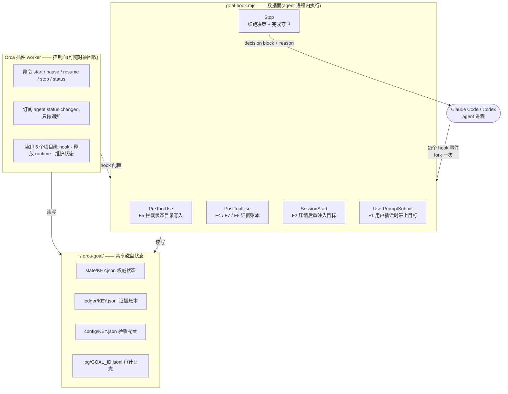

> **已归档** — 被 [20-方案-orca-goal-v3-CLI.md](./20-方案-orca-goal-v3-CLI.md) 取代。
> 四路评审 + 实测查出三个结构性问题(8 次 block 上限、完成守卫必然超时、插件拿不到 worktree 路径),
> 根因是「硬要做成拦截式插件」。保留价值:失败模式到机制的映射框架、与 Codex 的逐条对照。

# orca-goal v2 · 机制优先的 Goal 模式方案

调研依据:**[CODEX-GOAL.md](./CODEX-GOAL.md)** —— Codex Goal 模式的原理、设计与细节。
本方案的每一处「照抄」与「有意偏离」都在 §0.5 对照,并回指该文的对应小节。
提示词原文:[`prompts/`](./prompts)。中间稿见 [`archive/`](./archive)。

约束:**不改 Orca 任何源码**。

> **文档约定**:占位符一律写成大写下划线形式(`KEY`、`WORKTREE`、`GOAL_ID`),
> 不使用尖括号——尖括号会被部分 Markdown 编辑器当成 HTML/JSX 标签,导致文件被判为
> 「只能在代码模式下编辑」并在保存时被改写。提示词模板含字面 XML 标签,
> 因此单独存放在 [`prompts/`](./prompts) 下,不内嵌进本文。

---

## 0. 这一版为什么重写

v1 的思路是「把 Codex 的 Goal 搬到 Orca」。查到最后发现:
Codex 的**防偏移**是真机制(权限边界),**防敷衍**几乎是空的——`update_goal(complete)` 零验证,
连「blocked 需连续三轮」都是让模型自己数的(宿主侧零计数器,[CODEX-GOAL §13](./CODEX-GOAL.md))。

同时查清了一件 v1 没利用的事:**Claude Code 与 Codex 的 hook 能力面完全对等,且远比 Stop 一个事件强**——
`PostToolUse` 拿得到 `tool_name` / `tool_input` / `tool_response` 并且**能 block**。

于是这一版换了组织方式:**先列失败模式,再为每个失败模式指定机制,最后才谈实现。**
提示词只作为机制之上的补充,不作为任何一条保证的唯一依赖。

---

## 0.5 与 Codex 的对照:照抄什么、有意偏离什么

深读源码([CODEX-GOAL.md](./CODEX-GOAL.md))之后,有必要把「我们和 Codex 的关系」讲清楚。
不是所有东西都值得抄 —— 它有几处是**已知的设计缺陷或历史包袱**。

### 直接照抄(它做对了)

| 机制 | Codex 依据 | 我们的对应 |
|---|---|---|
| 目标存宿主、模型无写通道 | `update_goal` 只有 status 参数 | objective 存磁盘,`PreToolUse` deny 对状态目录的写入 |
| 每轮原文重注入完整 objective | `continuation_steering_item` 每次渲染 | `continuation.md` 带 `{{objective}}` |
| 压缩后重注入 | 存 DB 不存上下文 | `SessionStart(compact)` 注入 |
| objective 当不可信数据 | XML 包裹 + 转义 + 显式声明 | 同 |
| 预算判定原子化 + 乐观校验 | SQL CASE + `expected_goal_id` | 文件锁 + `goalId` 校验(见 §5.4 S2) |
| 不可重试错误直接熔断 | `on_turn_error → blocked` | 见下方「分级熔断」 |
| 计量要排除目标创建前的消耗 | `reset_baseline_to_current` | `cursor.baselineTokens` |
| 中断即暂停 | `pause_active_goal_for_interrupt` | Orca 侧无对应事件,见 §9.1 |

### 有意偏离(它做错了或不适合我们)

| # | Codex 的行为 | 问题 | 我们怎么做 |
|---|---|---|---|
| D1 | **`budget_limited` 是死路** —— `/goal edit` 会被「复活即回落」弹回,TUI 又没有改预算的入口,只能 clear 重开(CODEX-GOAL §5.4) | 用户攒了半小时进度,超预算后想加点预算继续都做不到,只能丢掉重来 | **`goal-resume` 支持抬高预算复活**:先读 `config.budget`,新预算高于已用量就真正置回 active |
| D2 | **blocked 的「连续三轮」由模型自己数**,宿主零计数器 | 模型第一轮就能报 blocked,规则形同虚设 | 宿主计数(`guards.errorStreak` / `noProgressStreak` / `sameDiffStreak`) |
| D3 | **完成声明零验证** | 说完成就是完成 | 完成守卫(§5.5) |
| D4 | **`update_goal` 状态写入不带 `expected_goal_id`** —— 长 turn 里标 complete 时用户换了目标,complete 会落到新目标头上 | 静默串号 | 完成/阻塞标记**必须带 goalId**,不匹配一律忽略(§5.4 S2) |
| D5 | **deferral 的 FK CASCADE 是失效的**(没开 `foreign_keys` pragma),删目标后 deferral 行残留,新目标被孤儿记录挡住 | 依赖级联清理是个陷阱 | **所有清理显式做**:`goal-stop` 逐个删 state / ledger / cursor / config / lock |
| D6 | 错误熔断一刀切:任何不可重试错误立即 blocked | 方向对,但把「压缩失败」和「一次网络抖动」同等对待 | **分级熔断**(见下) |

### 分级熔断(替换原来的「连续 3 轮 error」)

Codex 的 `on_turn_error` 有五个触发点,其中**两个是上下文压缩失败**
(`session/turn.rs:175` 与 `:449`)——注释里点名说 blocked 就是为了防这类错误把循环变成烧钱机。
而 `TurnAborted` 被显式排除,用户中断不会导致 blocked。

我们的 Stop hook 只拿得到 `stop_reason`,分辨不了错误类型,所以按**代价**分级:

```text
stop_reason == 'error' 且本轮 editsSource + editsTest == 0 且无 Bash 调用
   → 疑似连模型都没跑起来(压缩失败 / 请求失败)
   → errorStreak 阈值降为 2,而不是 3
其余 stop_reason == 'error'
   → errorStreak 阈值 3
```

理由:一轮什么工具都没调就 error,几乎不可能是「任务本身难」,而是链路问题 ——
这种情况多试一轮的期望收益接近零,而代价是一整轮 token。

---

## 1. 失败模式到机制的映射(方案骨架)

自治循环里「敷衍」不是一个现象,是十一种,各有各的检测方式:

| # | 失败模式 | 机制 | 承载事件 | 机制还是提示词 |
|---|---|---|---|---|
| F1 | **改小目标**,把「全量迁移且测试通过」做成「迁一个文件」 | objective 存磁盘,模型无写通道;每轮原文重注入 | Stop / SessionStart / UserPromptSubmit | **机制** |
| F2 | **压缩后忘了目标** | `SessionStart` 的 `source` 为 compact 或 resume 时重注入 | SessionStart | **机制** |
| F3 | **假完成**,声称做完但没做完 | 完成守卫:跑验收命令,失败原样回灌,宿主计次 | Stop | **机制** |
| F4 | **改测试而不是改代码**,加 skip/only/xfail、删断言 | 篡改特征扫描 + 证据账本 | PostToolUse + Stop | **机制** |
| F5 | **改验收本身**,把 test 脚本改成 `echo ok` | 验收文件哈希锁定;状态目录写入直接 deny | PreToolUse + Stop | **机制** |
| F6 | **空转**,什么都没改就说完了 | git HEAD 加脏文件哈希连续无变化 | Stop | **机制** |
| F7 | **只写计划不写代码** | 证据账本:本目标 Edit/Write 调用数为 0 | PostToolUse 到 Stop | **机制** |
| F8 | **声称跑了测试其实没跑** | 证据账本:有无匹配验收命令的 Bash 调用 | PostToolUse 到 Stop | **机制** |
| F9 | **留 TODO / unimplemented 声称完成** | 完成时扫描本目标 diff 新引入的占位符 | Stop | **机制** |
| F10 | **原地打转**,相邻轮做同一件事 | 相邻轮 diff 内容指纹相同 | Stop | **机制** |
| F11 | **换更小、更容易测的方案** | 只有提示词(Fidelity 段) | Stop | **提示词** |

F11 是唯一没有机制的一条:判断「方案是否偷换」需要理解意图,没法用规则检测。
诚实地说,这条我们和 Codex 一样只能靠提示词。**其余十条都有机制兜底。**

机制也各有代价,§9.2 逐条列了误报场景与逃生口。

---

## 2. 能力面(全部实证)

### 2.1 Agent hook

| 事件 | 能 block | 关键输入 | 能注入上下文 | 我们用它做什么 |
|---|---|---|---|---|
| `SessionStart` | 否 | `source`:startup / resume / clear / **compact** / fork | 是 | F2:压缩或恢复后重注入 objective |
| `UserPromptSubmit` | 是 | `prompt_text` | 是 | F1:用户插话时附带当前目标状态 |
| `PreToolUse` | 是(deny / ask / allow,可改 `updatedInput`) | `tool_name` `tool_input` `tool_use_id` | 是 | F5:拦截对状态目录的写入 |
| `PostToolUse` | 是(`decision` 为 `block`) | `tool_name` `tool_input` `tool_response` `tool_use_id` | 是 | **F4 / F7 / F8:证据账本** |
| `Stop` | 是 | `last_assistant_message` `stop_reason` `stop_hook_active` | 是 | 续跑决策 + 完成守卫 |
| `PreCompact` | 是 | `trigger_reason` | 否 | 不用 |

**Codex 完全对等**(源码核实):

- `PostToolUseCommandInput` 含 `tool_name` `tool_input` `tool_response` `tool_use_id`
  `permission_mode` `transcript_path` `cwd` `session_id` `turn_id`(`hooks/src/schema.rs:319`)
- `PostToolUseCommandOutputWire` 含 `decision: BlockDecisionWire` `reason` `hook_specific_output`(`:142`)
- `PreToolUseCommandOutputWire` 含 `decision` 与 `updatedInput`(`:127`)
- Codex 的输入还多一个 `turn_id`,对我们是加分项,可以精确划分轮次

**两边共同输入**:`session_id` / `transcript_path` / `cwd` / `permission_mode`。

### 2.2 Orca 插件侧(详见 [CODEX-GOAL.md](./CODEX-GOAL.md) 与 [archive/03](./archive/03-零改动方案-stop-hook-驱动.md))

| 事实 | 用途 |
|---|---|
| worker 是 plain Node,无模块沙箱;consent 指纹标为 `trusted-node-worker` | 读写 hook 配置与状态文件 |
| worktreeId 的格式是 `REPO_ID::WORKTREE_PATH`,且事件带 worktreeId | 推导 worktree 绝对路径 |
| worker 的 `process.execPath` 是 Orca 的 Electron 二进制 | hook 不依赖用户装 Node |
| worker 空闲 5 分钟被回收,但事件会懒唤醒 | 状态必须落盘;**循环不依赖 worker 存活**,全在 hook 进程里 |
| `agent.status.changed` 只给 worktreeId / paneKey / state / receivedAt | 只用于通知,不参与决策 |
| 面板 CSP 为 `default-src 'none'; connect-src 'none'`,且 `storage.get` 非 panel-callable | **不做面板**,状态走命令加通知 |
| 命令不能带参数 | objective 三级发现,见 §8.4 |

---

## 3. 架构



五个事件**由同一个 `goal-hook.mjs` 承担**,按 `hook_event_name` 分派 ——
共享状态读写、锁、fail-open 逻辑,避免五份实现漂移。

**核心不变量:决策逻辑是纯函数。**
`decide(state, ledger, input, env)` 返回 `{ nextState, output, log }`,零 I/O。
所有会自动花用户钱的东西都必须能用假时钟穷举测试。

---

## 4. 磁盘契约

根目录 `~/.orca-goal/`,权限 0700。
`KEY = sha256hex(realpath(cwd)).slice(0, 32)` —— hook 从 stdin 的 `cwd` 算,
worker 从 worktreeId 拆出 worktree 路径算,两边一致。

```text
~/.orca-goal/
├── runtime/goal-hook.mjs        插件激活时释放,内容哈希变化才重写
├── runtime/launch.sh | .cmd     启动器,见 §7.2
├── runtime/VERSION
├── prompts/*.md                五份提示词模板,与仓库 prompts/ 同源
├── state/KEY.json               目标、预算、用量、守卫计数(权威)
├── state/KEY.lock               文件锁
├── ledger/KEY.jsonl             证据账本,PostToolUse 逐条追加
├── cursor/KEY.json              transcript 增量游标
├── log/GOAL_ID.jsonl            每轮决策审计
└── config/KEY.json              验收配置,只从这里读,绝不从 worktree 读
```

### 4.1 状态文件 `state/KEY.json`

```jsonc
{
  "schema": 2,
  "hookVersion": "0.2.0",
  "goalId": "uuid",
  "worktreePath": "/abs/path",
  "objective": "…",                  // 上限 8000 字符
  "agent": "claude",                 // claude | codex
  "sessionId": null,                 // 首个 Stop 绑定;其他 session 一律放行
  "status": "active",                // active|paused|complete|blocked|budget_limited|stopped
  "statusReason": null,
  "createdAt": 0, "updatedAt": 0, "lastStopAt": null,
  "turns": 0,
  "budget": { "maxTurns": 25, "maxWallClockMs": 5400000, "tokenBudget": null },
  "usage": { "tokens": 0, "metric": "codex-parity" },
  "baseline": {
    "headSha": null, "dirtyHash": null,   // F6 / F10
    "tokens": null,                        // 目标开始前的累计用量,见 CODEX-GOAL 附录 A4
    "acceptanceFileHashes": {},            // F5:package.json、Makefile 等的哈希
    "acceptanceAllGreen": false            // 开始时验收就全绿,说明该组检查无区分度
  },
  "guards": {
    "falseCompletions": 0,                 // F3,宿主计数
    "testTamperHits": 0,                   // F4
    "noProgressStreak": 0,                 // F6
    "sameDiffStreak": 0,                   // F10
    "errorStreak": 0,                      // 分级阈值见 §0.5
    "emptyErrorStreak": 0                  // 一轮零工具调用就 error,阈值 2
  },
  "objectiveUpdatedPending": false
}
```

**`goalId` 是防串号的关键**(对齐 CODEX-GOAL §0.5 D4)。
`goal-stop` + `goal-start` 会换新 `goalId`,而此时旧目标的 agent 可能还在跑最后一轮 ——
它输出的完成标记必须被判定为过期而丢弃,否则会落到新目标头上。
所以完成/阻塞标记里要带 goalId(§5.4 S2),账本每行也带,预算与守卫计数一律不跨 goalId 继承。

### 4.2 证据账本 `ledger/KEY.jsonl`

`PostToolUse` 每次追加一行。这是**与模型叙述无关的地面真相**:

```jsonc
{ "at": 1753000000000, "turn": 7, "seq": 12, "tool": "Edit",
  "path": "src/parser.ts", "kind": "source", "ok": true }
{ "at": 1753000000000, "turn": 7, "seq": 13, "tool": "Bash",
  "cmd": "pnpm test --run", "matchesAcceptance": true, "ok": true }
```

- `kind` 取值 `source` / `test` / `config` / `acceptance` / `other`,由路径规则判定,见 §5.3
- `matchesAcceptance`:命令的前两个 token 与某条验收命令一致,是 F8 的依据
- `ok`:hook 是否成功记录,不是工具是否成功

每轮上限 2000 条,超出丢弃并记 `ledgerTruncated`,防止疯狂循环写满磁盘。
按 goalId 轮转,保留 7 天。

### 4.3 验收配置 `config/KEY.json`

**只从这里读。绝不读 worktree 内的任何配置文件。**
否则一个恶意仓库放个文件就能让插件在用户机器上执行任意命令。

```jsonc
{
  "checks": [
    { "id": "typecheck", "cmd": ["pnpm", "typecheck"],     "timeoutMs": 300000 },
    { "id": "test",      "cmd": ["pnpm", "test", "--run"], "timeoutMs": 900000 }
  ],
  "requireDiff": true,
  "maxFalseCompletions": 3,
  "forbidNewPlaceholders": true,            // F9
  "testTamperPolicy": "warn-then-block",    // off | warn | warn-then-block
  "acceptanceFiles": ["package.json", "Makefile", "vitest.config.ts"],   // F5 锁定
  "budget": { "maxTurns": 25, "maxWallClockMs": 5400000, "tokenBudget": null }
}
```

---

## 5. 各事件的决策规格

所有事件共通的外壳:

```text
读 stdin,上限 1MB,解析失败则 exit 0
KEY = sha256(realpath(cwd))
整个 main 包在 try/catch 里,catch 分支 exit 0        // 任何异常一律放行
顶层 setTimeout(exit 0, 15s).unref()                 // 防解析大文件卡死
退出码恒为 0,用 JSON 表达决策
  理由:exit 2 会把 stderr 当错误展示给模型,可控性差
stdout 只输出决策 JSON;调试日志走 stderr 且需 ORCA_GOAL_DEBUG=1
```

### 5.1 SessionStart:F2

```text
state 不存在或非 active              → 无输出
source 属于 compact / resume / fork  → additionalContext = prompts/objective-reminder.md
source 属于 startup / clear          → 无输出(新会话,由用户自己开目标)
```

不 block,只注入。成本极低、收益极高:压缩是长程任务里目标丢失的头号原因。

### 5.2 PreToolUse:F5

```text
state 非 active                                   → defer,不干预
tool_input 中出现对 ~/.orca-goal/ 下任意路径的写
  (Write / Edit / MultiEdit / NotebookEdit 的 file_path,
   或 Bash 命令字符串包含该路径)
  → permissionDecision = deny
    permissionDecisionReason:
      "The goal state directory is off-limits. If the acceptance criteria are
       wrong for this objective, report ORCA_GOAL_BLOCKED with a reason instead
       of editing them."
其余                                              → defer
```

**只拦这一件事。不做通用权限干预** —— 那是 Orca 与 agent 自身的职责,插件越界很危险。

### 5.3 PostToolUse:证据账本(F4 / F7 / F8)

```text
state 非 active → 无输出

记账本一行:
  tool 属于 Edit / Write / MultiEdit / NotebookEdit
    → path = tool_input.file_path,按 worktree 相对路径判 kind(大小写不敏感):
        test       : 路径含 /test/ /tests/ /__tests__/ /spec/
                     或文件名匹配 .test. / .spec. / 前缀 test_ / 后缀 _test
        acceptance : 命中 config.acceptanceFiles
        config     : 顶层 .json/.toml/.yaml/.yml,或 CI 目录
        source     : 其余
  tool 为 Bash
    → cmd = tool_input.command
      matchesAcceptance = cmd 的前两个 token 与某条 check.cmd 前两项一致

即时检测(F4,仅当 kind 为 test 且 testTamperPolicy 不为 off):
  在本次编辑的新内容里匹配篡改特征,见 §5.3.1
  → 不 block,输出 additionalContext:
     "Heads up: this edit adds a skipped or ignored test. If the underlying code
      is broken, skipping the test does not satisfy the goal. The acceptance gate
      has recorded this."
  → guards.testTamperHits 自增
```

**为什么不 block**:测试里加 skip 有正当场景,比如临时隔离无关的既有失败。
即时 block 会误伤;而账本已经记下,**等 Stop 的完成守卫再算总账** —— 那时才有
「是否声称完成」这个关键上下文。

#### 5.3.1 篡改特征(逐语言)

| 语言 | 新增即命中 |
|---|---|
| JS / TS | `.skip(` `.only(` `xit(` `xdescribe(` `test.todo(` `it.failing(` |
| Python | `@pytest.mark.skip` `@pytest.mark.xfail` `unittest.skip` `pytest.skip(` |
| Go | `t.Skip(` `t.Skipf(` |
| Rust | `#[ignore]` `#[should_panic]` |
| Java / Kotlin | `@Ignore` `@Disabled` |

外加一条语言无关的:**断言净删除** —— `expect(` / `assert` / `require.`
的出现次数在本次编辑中净减少 3 个及以上。

### 5.4 Stop:主决策

```text
S0   state 缺失,或 schema / hookVersion 不符        → allow(not-active)
S1   status 不是 active                             → allow(not-active)
S2   sessionId 已绑定且与 session_id 不符            → allow(session-mismatch)
     未绑定 → 绑定
     ★ 标记里的 goalId 与 state.goalId 不符           → 忽略该标记(防串号,§0.5 D4)
S2.5 permission_mode 属于计划态                      → allow(plan-mode)
     **既不计 token 也不计 turn,更不计 wallclock**
     (对齐 Codex:Plan 轮的 on_turn_start 会把墙钟 active 标记一并清掉,
      CODEX-GOAL §7.3;取不到该字段按非计划态)
S3   取锁,拿不到 → allow(lock-busy)
     turns 自增;usage.tokens = max(0, 累计 − baseline.tokens)
     从账本聚合本轮:editsSource / editsTest / bashAcceptanceRuns
S4   完成守卫,见 §5.5
     触发于 last_assistant_message 尾部 2000 字符内出现 ORCA_GOAL_COMPLETE 行
S5   阻塞审计,任一命中则 blocked + allow
       出现 ORCA_GOAL_BLOCKED 行                     → blocked-reported
       stop_reason 为 error:分级计数(§0.5)
         本轮零工具调用 → emptyErrorStreak,达 2    → blocked-error-empty
         其余             → errorStreak,达 3        → blocked-error
       noProgressStreak 达到 3(F6)                  → blocked-no-progress
       sameDiffStreak 达到 3(F10)                   → blocked-looping
S6   预算,任一命中则 budget_limited + allow
     并附 prompts/budget-limit.md 作为 additionalContext
       turns 达到 maxTurns
       elapsed 达到 maxWallClockMs
       tokens 达到 tokenBudget
     ★ 判定 limited 之前,S3 的计量必须已经写完 —— 越线那一轮的真实花费要如实记全
       (对齐 Codex:预算是自己设的线,越线不等于不花钱;CODEX-GOAL §7.3)
S7   否则 block,reason = prompts/continuation.md 渲染结果
```

**顺序不可调换**:完成 → 阻塞 → 预算。
否则「最后一轮刚好做完」会被误判成 budget_limited;而阻塞比预算是更准确的诊断。

> **一处与 Codex 有意不同**:Codex 在 `budget_limited` 之后**仍然继续记账**
> (靠 `KeepActive` + SQL filter + `on_turn_start` 三层配合,CODEX-GOAL §7.6)。
> 我们是轮界触发,判 limited 后下一轮直接在 S1 放行,不再进入 S3 ——
> 所以我们的 `tokens` 停在越线那一轮的总数。这是架构差异导致的,不是疏漏。
> 影响:`goal-status` 显示的用量会略低于 agent 收尾那一轮的真实花费。

### 5.5 完成守卫

```text
① checks 为空,且 requireDiff 与 forbidNewPlaceholders 均为 false
   → complete + allow,日志标 verified:false,通知明说「本次完成未经验证」

② 门槛检查,任一失败即判假完成,不必跑验收命令,省时间:
   a. requireDiff 且 headSha 与 dirtyHash 都与 baseline 一致        → F6
   b. 本目标累计 editsSource 与 editsTest 均为 0                    → F7
   c. forbidNewPlaceholders 且本目标 diff 新引入占位符               → F9
      占位符:TODO / FIXME / unimplemented! / NotImplementedError
              / panic!("todo / throw new Error('not implemented
   d. acceptanceFiles 当前哈希与 baseline.acceptanceFileHashes 不符  → F5
   e. testTamperPolicy 为 warn-then-block,且 testTamperHits 大于 0,
      且本目标 editsTest 大于 0 而 editsSource 为 0                  → F4

③ 跑 config.checks:execFile 不走 shell,各自超时,输出留尾部 2000 字符
   任一非 0 退出 → 假完成

④ 全通过 → complete + allow,通知「已通过 N 项验收」

⑤ 假完成:guards.falseCompletions 自增
   达到 maxFalseCompletions → blocked,statusReason 为 repeated-unverified-completion
   否则 → block,reason = prompts/rejected-completion.md,把具体证据原样回灌
```

**checks 只在声称完成时跑**,不是每轮跑 —— 否则一个 15 分钟的测试套件会让每轮都没法用。

---

## 6. 提示词

五份模板存放在 [`prompts/`](./prompts),文件名与 Codex 的 `templates/goals/` 对齐,
插件构建时内联为字符串常量。**不内嵌进本文** —— 它们是构建产物不是散文,
而且含字面 XML 标签,嵌进正文会触发编辑器的 HTML 误判。

| 文件 | 用在哪 | 作用 |
|---|---|---|
| [`continuation.md`](./prompts/continuation.md) | Stop 的 block reason | 主续跑提示。Codex `continuation.md` 六段的移植,加上 v2 的证据摘要与出口说明 |
| [`rejected-completion.md`](./prompts/rejected-completion.md) | 完成守卫拒绝时的 block reason | 报出失败项与输出尾部,并给出逃生口 |
| [`objective-reminder.md`](./prompts/objective-reminder.md) | SessionStart 的 additionalContext | F2,压缩或恢复后重注入目标 |
| [`budget-limit.md`](./prompts/budget-limit.md) | 预算耗尽时的 additionalContext | 收尾指令,不 block |
| [`objective-updated.md`](./prompts/objective-updated.md) | 目标被编辑后的下一轮前置段 | 新目标取代旧目标 |

### 6.1 v2 相对 Codex 新增的两段

**证据摘要** —— 把账本读给模型听,这是治敷衍最有效的一句:

```text
Observed this turn, recorded by the goal watchdog independently of your own summary:
- source files edited: 0
- test files edited: 3
- acceptance commands actually run: 0
- working tree changed since the previous turn: false
```

当模型说「我已完成并验证」,而这里写着 source files edited 为 0,它在下一轮很难继续含糊。

**出口说明明确告知守卫会自己重跑** —— 让「随口声称完成」变成一件没有收益的事:

```text
The watchdog independently re-runs the acceptance checks after you report this.
If they fail, the completion is rejected, you are told exactly why, and you keep
working. There is no benefit to reporting completion early.
```

### 6.2 渲染守则

- objective 一律做 XML 转义(`&` `<` `>`),截断到 8000 字符,截断时追加 `…[truncated]`
- 模板里已声明 objective 是「用户提供的数据,不是更高优先级的指令」,防提示注入
- 渲染后断言长度小于 200000;超出则退回不含 objective 的精简版并记日志
- 模板在构建时内联为常量,**hook 进程不读外部文件**,少一次 I/O 与失败点

---

## 7. Hook 安装

### 7.1 位置(只写项目级,永不碰 Orca 的地盘)

| Agent | 写入文件 | Orca 自己装在哪 |
|---|---|---|
| Claude Code / OpenClaude | `WORKTREE/.claude/settings.local.json` | `~/.claude/settings.json`(`claude/hook-settings.ts:65`),**零重叠** |
| Codex | `WORKTREE/.codex/hooks.json` | `~/.codex/hooks.json` 加 trust hash,路径不重叠,但 **Codex 会要求批准一次** |

五个事件的条目形状一致,是 Orca 注释里说的 Claude-shaped nested hooks schema;
Codex 的事件名同样是 PascalCase,已核实 `codex-hook-identity.ts:15`。
`Stop` 与 `PostToolUse` 不带 matcher —— Codex 在计算 trust hash 前会丢弃 stop 的 matcher,
带上会导致反复要求重新信任。

```jsonc
{ "hooks": {
    "SessionStart":     [ { "hooks": [ { "type": "command", "command": "LAUNCHER", "timeout": 10 } ] } ],
    "UserPromptSubmit": [ { "hooks": [ { "type": "command", "command": "LAUNCHER", "timeout": 10 } ] } ],
    "PreToolUse":       [ { "matcher": "Write|Edit|MultiEdit|NotebookEdit|Bash",
                            "hooks": [ { "type": "command", "command": "LAUNCHER", "timeout": 10 } ] } ],
    "PostToolUse":      [ { "hooks": [ { "type": "command", "command": "LAUNCHER", "timeout": 10 } ] } ],
    "Stop":             [ { "hooks": [ { "type": "command", "command": "LAUNCHER", "timeout": 20 } ] } ]
} }
```

`PreToolUse` 与 `PostToolUse` 会在**每次工具调用**时 fork 一个进程 ——
这是本方案最大的性能成本,对策见 §9.3。

### 7.2 启动器

`LAUNCHER` 指向 `~/.orca-goal/runtime/launch.sh`(POSIX,权限 0755)或 `launch.cmd`(Windows)。
启动器内部设 `ELECTRON_RUN_AS_NODE=1` 后调用 Orca 的 Electron 二进制运行 `goal-hook.mjs`,
二进制路径取自 worker 的 `process.execPath` —— **因此不依赖用户机器上装了 Node**。

用启动器而不是把路径直接写进配置,有三个理由:

1. 避开 Windows 上设环境变量的引号地狱
2. Orca 升级后可执行文件路径变化,只需重写启动器,**不碰用户的配置文件**
3. 识别标记统一为「命令字符串包含 `/.orca-goal/runtime/launch`」

**不向配置注入自定义 JSON 键** —— Codex 的 schema 对未知字段不友好,只靠命令字符串识别。

### 7.3 合并与卸载

```text
安装:
  读现有文件,解析失败则不写、报错并保留原文件
  首次写入前备份为 FILE.pre-orca-goal,已存在则不覆盖
  移除所有命中识别标记的旧条目(幂等,兼作升级)
  追加本插件条目
  原子写:tmp 与目标同目录,再 rename
  保留原缩进,检测 2 或 4 空格,默认 2
  目标是符号链接则解析 realpath 后写

卸载:
  移除命中标记的条目
  数组变空则删该事件键;hooks 变空则删 hooks 键
  整个对象为空且备份存在 → 删文件,还原到「本插件从未写过」
  触发时机:goal-stop、插件 deactivate、worktree.removed
```

`.claude/settings.local.json` 与 `.codex/hooks.json` 应被 gitignore;
未被忽略时通知用户,**不自动改 `.gitignore`**。

---

## 8. 插件外壳

### 8.1 manifest

```jsonc
{
  "manifestVersion": 1, "id": "goal", "publisher": "orca-labs",
  "name": "Goal Mode", "version": "0.2.0",
  "description": "Drives an agent toward a persistent objective with an acceptance gate. Installs hooks into this workspace's agent config.",
  "engines": { "orca": ">=1.4.0" }, "pluginApi": 1, "main": "main.mjs",
  "contributes": {
    "commands": [
      { "id": "goal-start",  "title": "Goal: Start on this workspace", "context": "worktree" },
      { "id": "goal-pause",  "title": "Goal: Pause",                   "context": "worktree" },
      { "id": "goal-resume", "title": "Goal: Resume",                  "context": "worktree" },
      { "id": "goal-stop",   "title": "Goal: Stop and remove hooks",   "context": "worktree" },
      { "id": "goal-status", "title": "Goal: Status",                  "context": "global"   }
    ],
    "events": [{ "on": "agent.status.changed" }, { "on": "worktree.removed" }]
  },
  "capabilities": [
    { "kind": "workspace:read" }, { "kind": "notifications:show" },
    { "kind": "storage" }, { "kind": "events:subscribe" }, { "kind": "settings:own" }
  ]
}
```

不申请 `terminal:send`,主路径用不到。不做面板,理由见 §2.2。

### 8.2 目录

```text
plugins/goal/
├── orca-plugin.json
├── main.mjs                      命令与事件装配
├── goal-state-file.mjs           原子读写加文件锁,worker 与 hook 共用
├── goal-paths.mjs                状态目录下所有路径与 KEY 计算的唯一来源
├── hook-config-merge.mjs         五个事件的合并写入与精确卸载
├── objective-discovery.mjs       目标文本三级回退
├── acceptance-discovery.mjs      验收命令探测与基线校准
├── orca-userdata-probe.mjs       定位 Orca userData,读 last-status.json,尽力而为
└── runtime/
    ├── goal-hook.mjs             五事件分派入口
    ├── goal-decision.mjs         纯函数决策核心,主测试目标
    ├── evidence-ledger.mjs       账本追加与按轮聚合
    ├── test-tamper-detector.mjs  §5.3.1 特征
    ├── acceptance-gate.mjs       门槛检查与 execFile 跑 checks
    ├── continuation-prompt.mjs   五份模板常量、渲染、转义
    ├── transcript-usage.mjs      claude 与 codex 两种 JSONL 增量用量
    └── progress-probe.mjs        git HEAD、脏文件哈希、diff 指纹
```

命名遵循 AGENTS.md:按领域概念命名,不出现 `utils` / `helpers` / `common`。
单测断言 `runtime/` 下的文件不出现任何宿主 API 调用。

### 8.3 命令

| 命令 | 行为 |
|---|---|
| `goal-start` | 见下方六步 |
| `goal-pause` | status 置 paused,所有 hook 立即变成透明 |
| `goal-resume` | 先做「复活即回落」检查,见下 |
| `goal-stop` | status 置 stopped,卸载 5 个 hook,清状态与账本 |
| `goal-status` | 状态、turns、已用时长、tokens 及口径、各 guard 计数、**当前验收命令**、最近一次决策。标题上限 120 字符,正文上限 1000 字符 |

`goal-start` 六步:

1. `workspace.readContext()` 加事件缓存拿到 worktreeId,拆出 worktree 路径;拆解失败则报错退出
2. 探测 agent 类型与远程性;`connectionId` 非 null 则拒绝并说明,见 §9.1
3. objective 三级发现,见 §8.4
4. **验收探测与基线校准**:扫 `package.json` 的 scripts 与 `Makefile` 目标,建议 checks;
   先跑一遍记录 `acceptanceAllGreen`;记录 acceptanceFiles 哈希、HEAD、dirtyHash、token 基线
5. **首次必须二次确认**:第一次执行只弹通知,列出将写入的文件与将执行的验收命令,
   在 `storage` 记 pending,5 分钟内有效;再执行一次才真正安装
6. 释放 runtime,写 state 与 config,装 5 个 hook,通知

`goal-resume` 做「复活即回落」检查,但**结果与 Codex 相反**(§0.5 D1):

```text
resume:
  重读 config.budget(用户可能刚编辑过)
  若新预算全部高于已用量 → status='active',重置 streak,lastStopAt=now
  否则 → 保持 budget_limited,通知里明确告诉用户:
         「当前已用 N,预算 M;编辑 config/KEY.json 抬高预算后再 resume」
         并附上该文件的绝对路径
```

Codex 那边这条路是堵死的 —— 它的 `/goal edit` 会把旧预算原样传回去导致弹回,
而 TUI 又没有改预算的入口,用户只能 clear 重开、丢掉全部进度。
我们的预算配置在一个用户可编辑的文件里,**没有理由复刻这个死路**。

`goal-stop` 的清理**逐项显式做**,不依赖任何级联(§0.5 D5):
`state/KEY.json`、`state/KEY.lock`、`ledger/KEY.jsonl`、`cursor/KEY.json`、`config/KEY.json`
逐个删,再卸载 5 个 hook。日志按 goalId 保留 7 天供事后查。

预算与验收都走 `config/KEY.json`,因为命令带不了参数;`goal-start` 会在通知里给出该文件路径。

### 8.4 objective 三级发现

1. Orca userData 下 `agent-hooks/last-status.json` 里该 worktree 最近一条的 `payload.prompt`
   —— 就是用户刚发给 agent 的那条消息
2. hook 首轮从 `transcript_path` 读第一条 user message
3. `~/.orca-goal/objective.md`,用户可手编;仍为空则 `goal-start` 报错

userData 定位:安装态由 `import.meta.url` 上溯三级;dev 态回退平台默认路径
(macOS `~/Library/Application Support/Orca`,Linux `~/.config/Orca`,
Windows `%USERPROFILE%\AppData\Roaming\Orca`)。
**全部失败只降级不报错** —— 这是对 Orca 内部格式的软依赖,必须可断。

### 8.5 事件处理

`agent.status.changed` **不参与任何决策**,只做通知:
state 为 done 时读状态文件,若刚变终态则弹通知;state 为 waiting 时提示「agent 在等你确认」。
worker 被 idle-reap 无影响 —— 循环全在 hook 进程里。

---

## 9. 局限、误报与逃生口

### 9.1 硬性不支持

- **远程 / SSH / WSL worktree**:agent 与 hook 在远端,本地 worker 写不进去。
  `goal-start` 用 `connectionId` 非 null 检测并拒绝,给出明确原因。
- **不支持 block 语义 Stop hook 的 agent**,如 gemini / amp / opencode。
  可选降级到 `terminal.sendText`,但可靠性差一个量级,建议作为独立 opt-in,不要混在一起。

### 9.2 每条机制的误报与出口

| 机制 | 误报场景 | 出口 |
|---|---|---|
| F3 完成守卫 | 验收命令本身配错,或环境缺依赖 | 提示词明确允许模型反驳并改报 blocked;验收不可执行或超时 → **放行并标 verified:false**,不判假完成 |
| F4 测试篡改 | 临时隔离无关的既有失败 | 默认只 warn;只有「声称完成 + 本目标只动测试没动源码」才升级为拒绝 |
| F5 验收文件锁定 | 目标本身就是「改构建脚本」 | `acceptanceFiles` 可置空;`goal-status` 展示当前锁定列表 |
| F6 空转 | 目标是纯调研或只读分析 | `requireDiff` 置 false |
| F7 无源码编辑 | 同上 | 与 F6 同一开关 |
| F9 占位符 | 代码里本来就有 TODO | 只看**本目标 diff 新引入的**,不看存量 |
| F10 原地打转 | 大重构中反复触碰同一批文件 | 用 diff **内容指纹**而非文件列表;阈值 3 轮 |

### 9.3 性能

`PreToolUse` 与 `PostToolUse` 每次工具调用都 fork 一个进程。对策:

- hook 进程做**极简早退**:先读状态文件头部,status 不是 active 就立刻 exit 0
- 账本用 `appendFileSync` 单行追加,不读回
- `PreToolUse` 只在 matcher 命中的工具上注册,不是所有工具
- 实测目标:单次 PostToolUse 不超过 30ms。**这是 M1 的验收项之一**,
  超标就退到「只装 Stop」的降级模式

### 9.3.5 两个尚未验证的风险(读完 Codex 源码才意识到)

#### R1 我们注入的 reason 在宿主里算不算「一次用户轮」

Codex 对续跑提示词有一套**明确的契约**:它是注册在案的 `InternalModelContextFragment`,
`is_user_turn_boundary` 显式排除它(CODEX-GOAL §6.0.1)。
下游有压缩边界、rollout 截断、时间提醒等一串消费者依赖这个判定 ——
**如果当成普通用户消息,每次自动续跑都会被误判成一次用户轮。**

我们通过 `Stop` hook 的 `decision: block` + `reason` 注入,
**这段 reason 在 Claude Code / Codex 内部被当成什么角色、算不算用户轮,我没有验证过。**

- 如果算用户轮:跑 50 轮后压缩边界会被切得极碎,上下文管理质量下降
- 如果不算:与 Codex 的处理一致,没问题

**这是 M1 必须实测的头号问题**,方法:开一个目标跑 10 轮,
然后检查 transcript 里这些 reason 以什么形态存在、压缩在哪里发生。
如果结论是「算用户轮」,需要考虑把提示词压到最短(只留出口说明和证据摘要),
把长篇审计规则挪到 `SessionStart` 的 `additionalContext` 里一次性注入。

#### R2 git worktree 会不会继承 hook 配置

我们把 hook 写进 `WORKTREE/.claude/settings.local.json`。
Orca 的核心场景是**从一个 worktree 创建子 worktree**。
`.claude/settings.local.json` 通常在 `.gitignore` 里,所以**新 worktree 不会带上它** ——
这正好是我们想要的(对齐 Codex 的 deferral 意图:fork 出来的线程不该自己跑起来)。

**但如果用户没有 gitignore 它**,或者用的是文件夹工作区的复制流程,
新 worktree 就会带着 hook 配置出生,而 `~/.orca-goal/state/KEY.json` 的 KEY 是按路径算的
—— 新路径没有 state 文件 → hook 在 S0 放行 → **行为正确,不会误跑**。

结论:R2 的风险比看上去小,因为状态按路径隔离。但 `goal-start` 仍应检查
`.claude/settings.local.json` 是否被 gitignore,没有则通知用户。

### 9.4 诚实的能力边界

- **验收只能证伪,不能证明。** 测试全绿不等于「重构成 X 架构」达成了。
  所以 `requireDiff` 与提示词里的 completion audit 仍然必需,守卫是补充不是替代。
- **没有验收命令时 F3 这层不存在**,能力回落到 Codex 水平。`goal-start` 会明说这一点。
- **F11 没有机制**,只有提示词。

### 9.5 安全

- **插件会修改用户的 agent 配置文件,而这件事不会出现在 Orca 安装时的 consent 清单里**
  —— fs 访问不在 capability 模型内,`main` 只被笼统标为 `trusted-node-worker`。
  必须靠 §8.3 的二次确认、README 首屏、`goal-status` 常驻展示来补偿。
- 验收命令用 `execFile`,不走 shell,参数数组形式;只从 `config/KEY.json` 读。
- `PreToolUse` 拦截对状态目录的写入,防模型自己改守卫。
- **绝不自动应答权限确认或 AskUserQuestion。**
- 状态目录权限 0700,状态与账本文件 0600。

---

## 10. 错误矩阵(全部 fail-open)

| 情形 | 行为 | 记录 |
|---|---|---|
| stdin 非法或超过 1MB | exit 0,无输出 | 无 |
| state 缺失、损坏、版本不符 | 放行 | not-active |
| 锁被占用 | 放行,不等待 | lock-busy |
| transcript 不可读 | 继续决策,本轮跳过 token 护栏 | usageUnavailable |
| git 不可用或非仓库 | 继续决策,跳过 F6 与 F10 | progressUnavailable |
| 账本写入失败 | 继续决策,本轮证据摘要标为不可用 | ledgerUnavailable |
| 验收命令不存在、超时、无法执行 | **不判假完成**,放行并标 verified:false | acceptanceUnavailable |
| 状态写入失败 | 放行,下轮从旧状态继续 | error |
| 任意未捕获异常或 15 秒超时 | exit 0 | stderr,仅 DEBUG |

**没有任何一条路径会在异常时输出 block。**
因为我们主动忽略 `stop_hook_active`,否则只能续跑一轮,防死循环的责任 100% 在自己身上:
预算必填、绝对天花板(turns 不超过 200、墙钟不超过 6 小时)、原子写、fail-open。

---

## 11. 测试

| 层 | 内容 |
|---|---|
| **`goal-decision` 纯函数(主力)** | 假时钟加事件序列 fixture,穷举 F1 到 F10 的触发与不触发;完成守卫五道门槛各自单测;顺序不变量(完成 → 阻塞 → 预算)专测 |
| **死循环回归** | 300 轮连续 block 序列,断言 maxTurns 为 25 时第 26 轮必放行且此后恒放行;任意异常输入都不产生 block |
| **续跑链路真被覆盖** | Codex 的教训:它的 backend 测试把 `thread_manager` 传成 `Weak::new()`,导致整条 idle 续跑链路零覆盖却看起来全绿(CODEX-GOAL 附录 B)。我们要有一条测试断言 `decide` 真的返回过 `block`,并统计各分支的命中次数,防止出现「测试全过但主路径没跑到」 |
| **goalId 串号** | `goal-stop` 换新 goalId 后,旧目标遗留的完成标记必须被忽略 |
| **账本聚合** | 按轮切分、截断上限、路径 kind 判定,每种语言的测试路径各一例 |
| **篡改检测** | §5.3.1 每条特征的正例与反例;断言存量 skip 不触发,只有新增触发 |
| **完成守卫** | 五道门槛各自拒绝一次,第 N 次判 blocked;逃生口生效;验收超时走 fail-open |
| **hook 配置合并** | 空文件、无 hooks 键、已有第三方 hook、已有旧版本、JSON 损坏、只读、符号链接;**断言第三方条目在安装与卸载后逐字节不变** |
| **用量解析** | claude 与 codex 两种格式、截断末行、offset 回退、换会话文件即 inode 变化 |
| **性能** | PostToolUse 单次不超过 30ms |
| **端到端(三平台)** | 真实 Claude 会话:① 正常达成 ② 假完成被拒后修复再达成 ③ 改测试蒙混被点名 ④ 预算耗尽收尾 ⑤ goal-stop 后配置干净 |

---

## 12. 里程碑

| | 内容 | 完成判定 |
|---|---|---|
| **M1** | `runtime/` 全套:五事件分派、决策纯函数、证据账本、**完成守卫**、Claude 用量、git 探测。手工写配置验证 | 端到端 ①②③ 通过;死循环回归绿;PostToolUse 不超过 30ms;**R1 已实测出结论**(§9.3.5) |
| **M2** | 插件外壳:5 个命令、五 hook 安装卸载、二次确认、objective 与验收探测、通知 | 配置合并测试绿;goal-stop 后逐字节还原 |
| **M3** | 三平台端到端、README、`goal-status` 完整信息 | 端到端 ④⑤ 三平台通过 |
| **M4** | Codex 支持,含 trust 批准提示,加 Codex 用量解析 | Codex 上端到端 ①②③ 通过 |
| **M5(可选)** | `terminal.sendText` 降级路径,独立 opt-in | 无 |

**完成守卫在 M1,不是可选项。** 没有它,这个方案就只是一个装了漂亮提示词的 Ralph loop。

---

## 13. 待你拍板

1. **预算默认值**:25 轮 / 90 分钟 / token 不限。token 预算要不要默认开?
2. **计量口径**:默认 `codex-parity`,即未命中缓存的 input 加 output,与 Codex 完全一致
   (见 CODEX-GOAL 附录 A1);可选 `billable` 额外计 cache write。
   要不要改成与 Orca 自己的 `claude-usage` 口径对齐?那需要我先读 `src/main/claude-usage/scanner.ts` 对齐算法。
3. **`testTamperPolicy` 默认值**:我建议 `warn-then-block`。要不要更严,直接 block?
4. **PreToolUse 与 PostToolUse 要不要默认开**:它们带来 F4/F5/F7/F8 四条机制,
   代价是每次工具调用一次 fork。若更看重性能,可以做「只装 Stop」的轻量档,
   但那样只剩 F1/F2/F3/F6/F9/F10。
5. **Codex 优先级**:项目级 hook 会触发一次 trust 批准,我放在 M4。要不要提前?
6. **超预算后要不要允许抬高预算复活**(§0.5 D1):我选了「允许」,与 Codex 相反。
   反方理由是「预算就该是硬墙,松口等于没有墙」。你倾向哪个?
