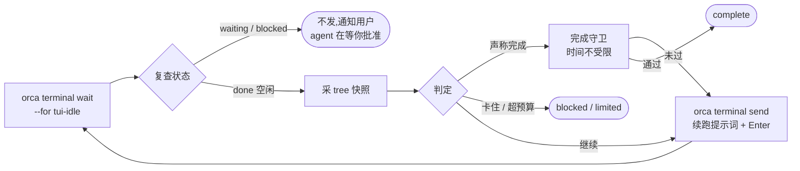

# orca-goal v4 · 外部驱动交互式会话

取代 [20-方案-orca-goal-v3-CLI.md](./20-方案-orca-goal-v3-CLI.md)(headless 驱动)与
[10-方案-orca-goal-v2.md](./10-方案-orca-goal-v2.md)(hook 拦截插件)。
调研依据:[CODEX-GOAL.md](./CODEX-GOAL.md)。约束不变:**不改 Orca 源码**。

---

## 0. 定位:你要的是 B

三版方案的形态差别:

| | agent 在哪 | 续跑方式 | 你能不能插话 |
|---|---|---|---|
| v2 | 你的交互式会话 | Stop hook `decision: block` | 能,但**连续 8 轮就被宿主强制打断** |
| v3 | headless 子进程 | CLI 循环调 `claude -p` | **不能**,只能看它刷屏 |
| **v4** | **你的交互式会话** | **外部驱动进程往终端发指令** | **能,随时** |

v4 是 B:**agent 一直待在你的会话里,你随时能看、能插话、能 Ctrl-C**;
一个外部进程盯着它,一旦它停下来就把它推起来。

---

## 1. 关键发现:Orca 公开 CLI 没有插件的那道限制

v2 的死穴是插件的 `terminal.sendText` 要求目标终端在**当前聚焦的** worktree 里
(`plugin-host-method-bindings.ts:98` 读 `activeWorktreeId`)—— 而「设好目标去干别的」正是核心场景。

**Orca 的公开 CLI 没有这个限制**,而且四件套齐全:

```bash
orca terminal list  --worktree SELECTOR --json     # 找任意 worktree 的终端
orca terminal wait  --for tui-idle --timeout-ms N    # 等 agent 真的空闲
orca terminal read  --cursor N --limit M --json      # 读输出
orca terminal send  --text "..." --enter             # 发指令
```

于是循环变成:



**每一次 send 都开启一个新回合**,不是 block —— 所以 8 轮上限根本不参与。
不用装任何 hook,不用改用户的 `settings.json`,不用碰 `env`。

---

## 2. 这一版解决了什么

| 问题 | v2 | v3 | v4 |
|---|---|---|---|
| 8 轮 block 上限 | ❌ 撞死 | ✅ 不适用 | ✅ **不适用(新回合)** |
| 完成守卫的时间 | ❌ 20 秒 hook 超时 | ✅ 不受限 | ✅ **不受限(在驱动进程里)** |
| 后台 worktree | ❌ 插件要求聚焦 | ✅ 不适用 | ✅ **公开 CLI 支持 `--worktree`** |
| agent 留在交互式会话 | ✅ | ❌ headless | ✅ |
| 用户能随时插话 | ✅ | ❌ | ✅ |
| 精确成本 | ❌ | ✅ CLI JSON 直给 | ⚠️ **拿不到,见 §7** |

**选 B 的代价就在最后一行**:v3 能从 `claude -p` 的 JSON 里直接拿到
`total_cost_usd` / `usage` / `is_error` / `subtype`;
v4 驱动的是交互式 TUI,**这些结构化返回全部没有**。§7 讲怎么办。

---

## 3. 状态机与注入时机

### 3.1 只在 `done` 注入 —— 这条极易搞反

Orca 的 hook→state 映射(`src/shared/agent-hook-listener.ts:2565`,已核实):

| hook 事件 | state | 含义 | 驱动进程该做什么 |
|---|---|---|---|
| UserPromptSubmit / PostToolUse / PreToolUse | `working` | 正在干活 | 不动 |
| PermissionRequest / AskUserQuestion | `waiting` | **卡在等人批准** | **绝不注入**,通知用户 |
| Stop / StopFailure | **`done`** | **回合结束、空转** | **← 唯一该注入的时刻** |
| (agent 主动提问) | `blocked` | 在问你问题 | 绝不注入,通知用户 |

> ⚠️ **仓库里那份 `docs/goal-watchdog-plugin-design.md` 的映射表是反的**
> (它写 `waiting → 续跑注入`、`done → 完成判定`)。
> 照那份实现会**往权限对话框里打续跑提示词,而 agent 真干完时反而不动**。用之前必须先改。

好消息:`orca terminal wait --for tui-idle` **内部已经做对了** ——
`mapExplicitAgentStateToRuntimeTerminalStatus`(`orca-runtime.ts:33252`)把
`done → idle`、`blocked|waiting → permission`,而 `tui-idle` 只认 `idle`。
**用公开 CLI 等于白拿正确语义**,这是不自己解析状态的又一条理由。

但 `wait` 返回后仍要**复查一次**再发 —— 中间有窗口。
Orca 自己的安全发送序列可以照抄:`src/renderer/src/lib/active-agent-note-send.ts:95`
(wait → 查 blockedReason → 复查 agentStatus → bracketed-paste → 延迟 → Enter)。

### 3.2 状态

沿用 Codex 的六态语义,去掉 `usage_limited`(我们分辨不了):

```
active | paused | blocked | budget_limited | complete | stopped
```

只有 `active` 会被自动续跑。

---

## 4. 证据机制:一个原语解决全部

v3 用了两个哈希(`dirtyHash` 取 porcelain、`diffFingerprint` 取 `git diff HEAD`),
**两个都实测有致命缺陷**:

| 算法 | 缺陷 | 实测 |
|---|---|---|
| `git status --porcelain` 的哈希 | **对内容完全失明** | 文件已 modified 时,内容从 `version A` 改成 `version B COMPLETELY DIFFERENT`,porcelain 哈希**一模一样** |
| `git diff HEAD` 的哈希 | **对未跟踪文件完全失明** | 新建文件后 `git diff HEAD` 输出 **0 字节**,而 `git status` 看得见 |

后果分别是:**真完成被判成假完成**(第一条命中「工作树与 baseline 一致」),
**正在写新模块的目标被判成原地打转杀掉**(第二条连续三轮指纹不变)。

**统一换成 tree SHA**:

```bash
IDX=$(mktemp -u)                                    # 必须在工作树之外
GIT_INDEX_FILE=$IDX git add -A                      # 尊重 .gitignore,含未跟踪
TREE=$(GIT_INDEX_FILE=$IDX git write-tree)
rm -f $IDX
```

实测三次快照(含未跟踪新文件 / 改已跟踪内容 / 再改一次)得到**三个不同 SHA**。
它同时覆盖内容、未跟踪文件、文件模式,天然规范排序,不受用户 `diff.noprefix` 等
gitconfig 影响,跨平台一致。

一个 SHA 同时当三样东西用:

| 用途 | 怎么用 |
|---|---|
| 工作树指纹(F6 空转) | 与 baseline 比 |
| 相邻轮指纹(F10 原地打转) | 与上一轮比 |
| 验收快照源 | `git commit-tree $TREE -p HEAD -m ...` 再 `git worktree add --detach` |

> ⚠️ **进度指纹必须是 `(treeSHA, headSHA)` 二元组,不能只用 treeSHA。**
> agent 如果这一轮只做了 `git commit`,工作树内容没变 → treeSHA 不变 →
> 会被判成原地打转。而 Orca 的工作流是鼓励在 worktree 里提交的,这不是边缘场景。
> 判定改成:**treeSHA 或 headSHA 任一变化即视为有进展**。

**禁止用 `git stash create`** —— 实测它在只有未跟踪改动时**返回空**,
而 agent 新写的实现和测试文件在提交前全是未跟踪的,正是最需要被验收的东西。
`-u` / `--include-untracked` 不报错但也不含未跟踪,是静默失效。

### 4.1 变更文件与路径分类

从 tree 比对拿变更文件:`git diff --name-status BASELINE_TREE CURRENT_TREE`。
分类规则**有序**,先匹配先生效:

```text
1. acceptance   命中 config.acceptanceFiles(绝对优先)
2. test         路径含 /test/ /tests/ /__tests__/ /spec/ /e2e/ /cypress/
                或文件名匹配 \.(test|spec)\. / ^test_ / _test\. / ^conftest\.py$
3. config       顶层 *.json|*.toml|*.yaml|*.yml,或 .github/ .gitlab/ 等 CI 目录
4. docs         *.md / docs/
5. source       其余
```

v3 只写了一句「按路径分」,v2 那版规则把 test 排在 acceptance 之前(所以
`tests/` 下的验收文件会被误判)。这里已修正优先级。

**已知盲区必须写进文档**:Rust 的 `#[cfg(test)]` 内联测试与源码同文件,
一律判成 source;Java 的 `src/test/java` 命中 `/test/` 但 `Test*.java` 命名不命中。

---

## 5. 完成守卫

### 5.1 判定流程

```text
模型输出 ORCA_GOAL_COMPLETE 行 →
  ① 门槛检查(秒级,任一失败即假完成):
     a. requireDiff 且 currentTree == baselineTree                   → 空转
     b. requireSourceEdit 且本目标累计无 kind=source 变更             → 只写计划
     c. forbidNewPlaceholders 且新增行含占位符                        → 留 TODO
     d. acceptanceFiles 的 blob SHA 与 baseline 不符                  → 改了验收本身
     e. 测试证据集判定(§5.2)                                        → 删/跳测试
  ② 跑 config.checks(分钟级,但**必须有超时**,见 §5.5)
  ③ 全通过 → complete
  ④ 假完成:falseCompletions++,失败详情回灌;达上限 → blocked
```

四个开关全部可关(`requireDiff` / `requireSourceEdit` / `forbidNewPlaceholders` /
`testEvidence`),供「纯调研」「只改文档」这类目标使用。

占位符清单**穷举**,不用省略号:
`TODO` / `FIXME` / `XXX` / `HACK` / `unimplemented!` / `todo!()` /
`NotImplementedError` / `panic!("todo` / `throw new Error('not implemented` /
`raise NotImplementedError`。大小写敏感。

### 5.2 测试证据用**集合**,不用总数

v3 提的「测试用例总数下降就是硬证据」**不成立** —— 实测与调研确认:

- **`.skip` 不会让总数下降**(skipped 用例照样被 collect),而 `.skip` 正是它要取代的头号手法
- **Go 的 `go test -list .` 不展开 `t.Run` 子测试** —— table-driven 删掉 5 个 case 里的 4 个,计数纹丝不动
- **Jest 没有 collect-only**(`--listTests` 列的是文件不是用例)
- vitest 的正确命令是 `vitest list --json`,不是 `--reporter=json`(后者要跑完才有报告)
- 动态生成用例、`skipIf(env)` 会让总数正常波动 → 假阳性

改成**三元组集合**,`id = file::fullName`:

```text
{ executedIds, skippedIds, collectErrors }

判定:
  baseline.executedIds − (current.executed ∪ current.skipped) 非空  → 用例消失
  baseline.executedIds ∩ current.skippedIds                非空  → 用例被跳过
  collectErrors 非空                                              → 弃权(不判假完成)
```

**消失或被跳过的具体用例名直接进回灌提示词** —— 比「总数少了 3 个」有用得多,
而且模型没法用「换个写法」绕过。

`collectErrors` 非空时**弃权**很重要:副本环境问题(缺构建产物导致 import 失败)
会让计数骤降,不能把环境问题变成对 agent 的指控。

**支持度必须写明**,别让实现者瞎编:

| 框架 | 命令 | 可靠性 |
|---|---|---|
| pytest | `--collect-only -q` | ✅ |
| vitest ≥2.1 | `vitest list --json` | ✅ |
| cargo | `test -- --list` | ✅ 需能编译 |
| Go | `go test -list .` | ⚠️ **不展开子测试** |
| Jest | 无 collect-only | ❌ 不支持,弃权 |
| Gradle / Maven | 无 | ❌ 不支持,弃权 |

### 5.3 验收在哪跑:**默认原地**

v3 倾向默认跑 `git worktree add --detach` 的干净副本。**改成默认原地**,理由是实测的现实:

Orca 自己的仓库 `node_modules` **2.6 GB**,`postinstall` 要按 Electron ABI 重编原生模块,
`pnpm test` 前还要跑 `ensure-native-runtime`。一次干净副本验收 = 完整 `pnpm install`
+ 原生重编 + 可能的运行时下载,十几分钟起步,离线环境直接失败。
**默认值必须能在自家项目上跑通。**

```text
默认   --acceptance-inplace   原地跑,标注「验证强度:中」
可选   --acceptance-clean     干净副本,标注「验证强度:高」
```

选 `--acceptance-clean` 时的正确做法(**不要用 stash**):

```bash
SNAP=$(git commit-tree $TREE -p HEAD -m "orca-goal acceptance")
git worktree add --detach "$COPY" "$SNAP"
```

并且必须诚实标注三条:

1. **副本复用与隔离二选一。** 复用 `node_modules` 意味着 agent 污染一次就长期有效
   (lockfile 没变所以永不重装),精确抵消了隔离的意义。要复用就把副本放到 agent
   不可写的位置,或接受每次重装。
2. **副本会出现在 Orca 的 worktree 列表里**(`git worktree list` 无过滤),
   崩溃后留 `prunable` 条目。必须 `try/finally` + 退出钩子 + 启动时 `git worktree prune`
   + 固定前缀 `orca-goal-acceptance-`。
3. **子模块不会被初始化**,LFS 需要重跑 smudge filter,monorepo 的 `workspace:*`
   要重新 link。这些场景下副本模式不可用,应自动降级为原地并告知。

### 5.5 验收的执行环境:四条硬约束

v3 把「**没有时间限制**」当卖点写在标题上,这修掉了 v2 的 fail-open,却换来了 fail-hang。

**① 必须有超时。** 没有超时的后果不是慢,是**永久挂死**:
`vitest`(不带 `run`)在 TTY 且非 CI 下默认进 watch 模式永不退出;
`pnpm install` 遇 peer 冲突会交互提问;git 会弹凭据框。
循环就停在一次验收上,零输出、无心跳,用户看不出是在跑还是死了。

**② 必须脱离 TTY。** 驱动进程跑在 Orca 的 PTY 里,子进程会继承 TTY。
执行验收时:`stdio` 不继承、设 `CI=1`,并套上 Orca 现成的无人值守环境变量 ——
`GIT_TERMINAL_PROMPT=0`、空 `GIT_ASKPASS` / `SSH_ASKPASS`
(照抄 `src/shared/git-credential-prompt-env.ts:93`)。

**③ 必须 `execFile` 不走 shell**,参数数组形式。这是 v2 有、v3 丢掉的一条。

**④ 首次运行必须让用户确认验收命令清单。** 也是 v2 有、v3 丢掉的。
理由见下:验收本身就是一次代码执行。

#### 验收本身是一次代码执行,要说清楚

`--acceptance-clean` 模式下的 `pnpm install` 会执行 lockfile / package.json 里的
postinstall —— 而这两个文件**正是 agent 可写的**。也就是说「干净副本」隔离了
`node_modules/.bin` 的篡改,却没有隔离「装依赖这个动作本身」。

所以:安装用 `--ignore-scripts`(或至少显式告知),副本目录放在 **repo 之外**
(`$TMPDIR`,不是 worktree 内 —— 放里面会直接锁死父 worktree 的删除,
`worktree-removal-safety.ts:131` 拒绝删除包含另一个已注册 worktree 的目录)。

#### fail-safe:验收环境坏了不算 agent 的账

v2 有这条,v3 删了,**v4 必须补回来**:

```text
验收命令不存在 / 超时 / 无法执行 / collectErrors 非空
  → 不判假完成,放行并标 verified:false,通知用户「本次完成未经验证」
```

理由:把环境问题变成对 agent 的指控,会让它去修一个根本不存在的问题,
而失败原文还会被回灌 —— 这是唯一一条会**主动破坏正确代码**的失败模式。

**同时要诚实说清两件 v2 说过、v3 删掉的事**:

1. **验收只能证伪,不能证明。** 测试全绿不等于「重构成 X 架构」达成了。
   守卫是提示词的补充,不是替代。
2. **没有验收命令时,守卫这一层不存在**,能力回落到 Codex 水平(完成声明零验证)。
   `goal-start` 必须明说这一点,而不是静默降级。

### 5.4 验收配置必须在 worktree 之外

v3 把 `config.json` 放进了 worktree 内的 `.orca-goal/`,而 v3 零 hook 没有任何保护 ——
**agent 直接把 `checks` 改成 `["true"]` 就通关**。这是相对 v2 的安全回退。

v4 放回 `~/.orca-goal/config/KEY.json`,worktree 内最多放只读镜像。
`KEY = sha256hex(realpath(worktreePath))`。

---

## 6. 循环规格

```text
orca-goal start "OBJECTIVE" [--worktree SEL] [--max-turns 30] [--max-minutes 90]

初始化:
  取锁 ~/.orca-goal/state/KEY.lock(pid + boot time + 心跳),已被占用则拒绝启动
    —— 同一 worktree 两个驱动进程会互相往同一个终端发指令,后果不可预测
  解析 worktree(默认当前 cwd 所在的),用 orca terminal list 找到 agent 终端
  采 baseline:tree SHA、HEAD、acceptanceFiles 的 blob SHA、测试证据集
  跑一次验收 → **记录失败集合 baselineFailures**(不是布尔):
    全绿           → 警告「该组检查对本目标无区分度」
    本来就有失败   → 记下来,判定改成「**不新增失败**」而不是「全绿」
                     否则一个 pre-existing 失败会让守卫永远过不了,
                     agent 被回灌去修一个跟目标无关的测试,烧到预算上限
  写 ~/.orca-goal/state/KEY.json
  发出第一轮:orca terminal send --text "<objective 提示词>" --enter

每一轮:
  1. orca terminal wait --for tui-idle --timeout-ms T
     超时 → 记 stall,连续 2 次 → 通知用户并暂停
     ★ T 就是**单轮墙钟上限**。预算只在轮边界检查,一轮内部跑多久循环看不见 ——
       没有这个上限,单轮就能穿透总预算(默认建议 20 分钟)
  2. 复查状态(orca worktree ps --json 或再 wait 一次)
     waiting / blocked → 不注入,通知用户「agent 在等你」,进入 paused
  3. orca terminal read --cursor N --json,取本轮新增输出
  4. 采 tree 快照,与 baseline 和上一轮比对
  5. 判定(顺序不可换):
       a. 输出含 ORCA_GOAL_COMPLETE 行  → 完成守卫(§5)
       b. 输出含 ORCA_GOAL_BLOCKED 行   → 连续 3 轮出现即接受(见下)
       c. tree 与上一轮相同             → sameTreeStreak,达 3 → blocked
       d. tree 与 baseline 相同         → noProgressStreak,达 3 → blocked
       e. 预算(轮数 / 时长)命中        → limited,发收尾提示跑最后一轮
       f. 否则                          → 继续
  6. orca terminal send 续跑提示词 + Enter
  7. 落盘 state,追加 log.jsonl
```

**`ORCA_GOAL_BLOCKED` 的判据明确定死**:连续 3 轮出现该标记即接受,
**不比对 reason 文本**(模型每轮的措辞不会逐字相同,比对文本等于永久堵死这个出口)。
reason 仅用于展示。这修掉了 Codex「三轮由模型自己数」那个空白 —— 我们在宿主侧数。

---

## 7. 计量:选 B 的代价

v3 能从 `claude -p` 的 JSON 里直接拿 `total_cost_usd` 和 `usage`。
v4 驱动的是交互式 TUI,**这些结构化返回全部没有**。

诚实的处理:

| 预算维度 | v4 怎么做 |
|---|---|
| **轮数** | 驱动进程自己数,**准确** |
| **墙钟** | 累计已结算时长,不用 `now - createdAt`(否则合盖一晚就超预算) |
| token / 成本 | **尽力而为**:解析 transcript,但要处理三个坑 |

transcript 解析的三个坑(v2 调研已确认):

1. 同一 API response 会拆成**多行 JSONL 各带同一份 usage**,不按 `message.id` 去重会**超算 2.65 倍**
2. subagent 的用量在**独立文件** `PROJECT/SESSION/subagents/agent-*.jsonl`,只读主 transcript 会漏约 28%
3. Codex 的公式 `(input − cached) + output` 搬到 Claude 上会**算出负数**,
   因为 Anthropic 的 `input_tokens` 本就不含 cache;Claude 侧正确口径是 `input + output`

Orca 自己 `src/main/claude-usage/scanner.ts` 已经把这三条都解决了(`messageId:requestId`
去重 + 逐字段取 max + 递归含 `subagents/`)。**直接照搬它的算法**,不要重新发明。

**结论:主预算用轮数 + 时长(准确),token/成本降级为展示。**
如果你更看重精确成本,那是 v3(headless)才有的能力 —— 这是 A/B 取舍的一部分。

---

## 8. 提示词

五份模板在 [`prompts/`](./prompts)。v2 和 v3 都声称改过,实际一处都没落地。
**这一版已经真的改完了**,下表是已落地的改动:

| # | 已改 | 原因 |
|---|---|---|
| 1 | 删掉 `continuation.md` 的 `acceptance commands actually run: {{bashAcceptanceRuns}}` | 那是 F8,已废弃;v4 没有数据源能填 |
| 2 | 删掉 `rejected-completion.md` 的 `{{attempt}} of {{maxAttempts}}` | 公开倒计时 = 告诉模型放弃比干活便宜 |
| 3 | 删掉 `rejected-completion.md` 的「The goal state directory is off-limits and edits to it are denied」 | v2 里是真的(PreToolUse deny),**v4 里是一句谎话**,而且是对着一个会验证事实的 agent 说的 |
| 4 | 改掉 `continuation.md` 的「same blocking condition repeated for at least three consecutive turns」与「immediately and without waiting three turns」 | 前者由宿主数,不该让模型数;后者是自己给自己开的后门 |
| 5 | 预算口径从 token 改成轮数 + 时长 | 与 §7 对齐 |
| 6 | `{{failureOutput}}` 必须转义 + 剥离 `ORCA_GOAL_*` 字面量 + 包在「不可信命令输出」标签里 | 验收输出来自仓库,可被恶意仓库控制;一行 `console.log` 就能伪造看门狗指令 |
| 7 | `objective-reminder.md` 在 v4 失去触发点(没有 SessionStart hook) | 改成「每 N 轮插一次」,或删掉 |

`objective` 本身仍要 XML 转义 + 截断上限 + 渲染后长度断言。

---

## 9. 局限

| # | 局限 |
|---|---|
| L1 | **精确成本拿不到**(§7)。主预算是轮数 + 时长 |
| L2 | **往 TUI 里发指令有竞态**。靠 `wait --for tui-idle` + 复查 + bracketed-paste 缓解,照抄 Orca 的 `active-agent-note-send.ts` |
| L3 | **每轮一次完整的 agent 生命周期 → 通知风暴。** 不只是侧边栏闪:Orca 的通知去重键含 `stateStartedAt`,每次状态变化都重置(`agent-hooks/server.ts:808`),而 `working` 会把 `currentTurn` 加一顶掉 `lastCompletedTurn` 守卫 —— **跑 30 轮 = 30 条桌面通知 + 声音 + 未读徽章 + Dock 提醒**。这恰好是「设好目标走开」最不该有的东西,而且 B 路线绕不开(除非 Orca 提供「抑制某个 pane 的完成通知」,那要改宿主) |
| L4 | **Orca 必须在运行**。反过来也要注意:Orca 自动更新会 `killAllPty()`(`updater.ts:713`),macOS 注销时 daemon 退出会孤儿化子进程 —— 两种情况都会让循环无声中断 |
| L5 | 只支持 Orca 管理的终端;`orca terminal send` 未暴露 `requireAgentStatus`(CLI 的 allowedFlags 只有 terminal/text/enter/interrupt),守卫要自己做三段式复查 |
| L6 | **如果 goal 是这个 worktree 的第一次 work**,Orca 会按我们注入的提示词**自动改分支名**(`first-work-branch-rename.ts:94`,门槛就是 `state === 'working'`,默认开)。分支名会来自提示词模板而不是用户意图,还会额外起一个文本生成 CLI 花钱。建议 `goal-start` 检测到 worktree 无提交历史时提醒用户 |
| L7 | **Windows 未验证**:`orca` CLI 的行为、进程信号、`execFile` 跑 `.cmd`、Orca 在 Windows SSH 远端不装 agent hook(`ssh-relay-session.ts:597`)。M3 之前不宣称支持 |
| L8 | **folder workspace(非 git)下守卫大部分失效** —— tree 快照、变更分类、F6/F10 全依赖 git。要么明确不支持,要么退化成「只跑验收命令」并告知强度降级 |
| L9 | F11「偷换成更容易的方案」仍然只有提示词 |

---

## 10. 里程碑

| | 内容 | 完成判定 |
|---|---|---|
| **M0** | 先修 `docs/goal-watchdog-plugin-design.md` 那张反了的映射表 | — |
| **M1** | 循环核心:wait → 复查 → read → tree 快照 → 判定 → send。轮数/时长预算 | 真实目标连跑 15 轮不掉线;`waiting` 时确认不注入 |
| **M2** | 完成守卫:四道门槛 + 测试证据集 + 原地验收 + 回灌 | 端到端:假完成被拒 → 修复 → 真达成;`.skip` 掉一个用例能被抓出来 |
| **M3** | 提示词七处修改、崩溃恢复、`status`/`pause`/`stop`、干净副本模式 | 三平台跑通 |
| **M4** | Codex 支持 | — |

---

## 11. 待定

1. **`--acceptance-clean` 要不要做**,还是 M1–M3 只做原地?我倾向先只做原地 ——
   干净副本在 monorepo 上的成本可能高到没人用。
2. **transcript 计量要不要做**,还是干脆只报轮数+时长?我倾向 M1 不做,
   等有人真的需要再说。
3. **L3 那个「每轮闪一次 done」** 能忍吗?这是 B 路线的固有代价,
   除非 Orca 那边提供「抑制某个 pane 的完成通知」的能力(需要改宿主,超出约束)。
