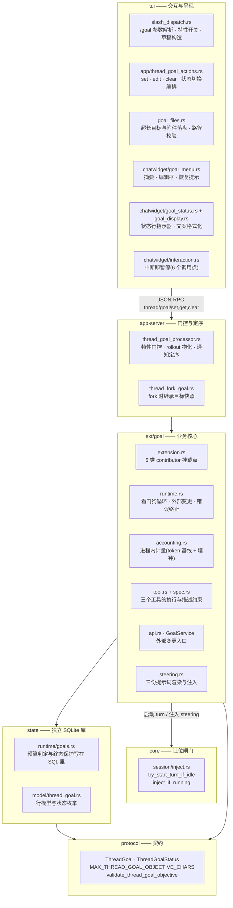
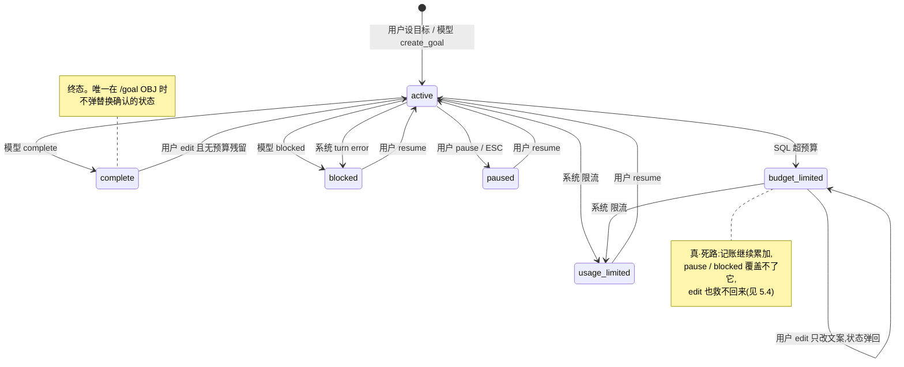
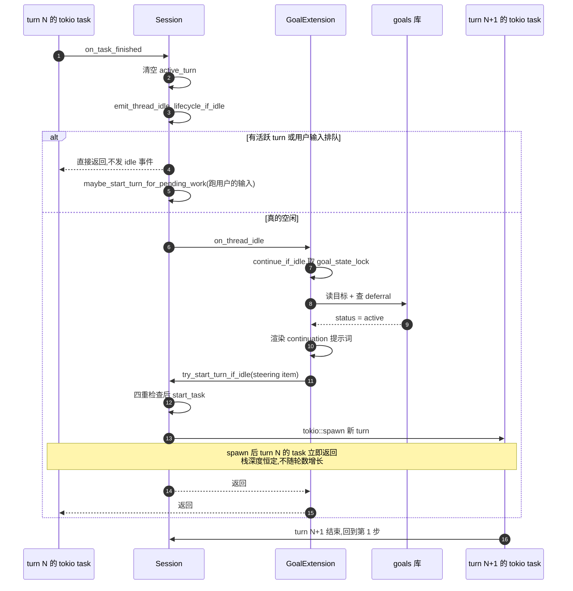
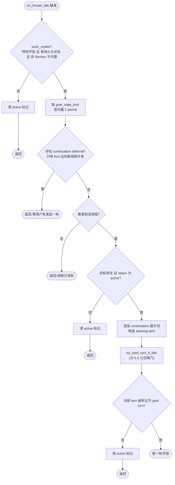
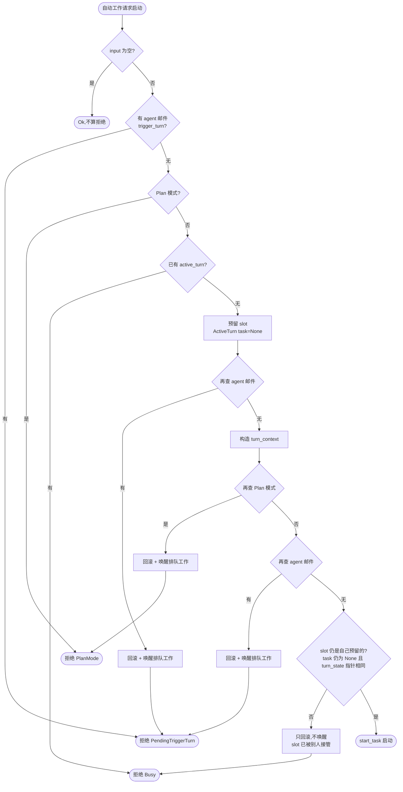
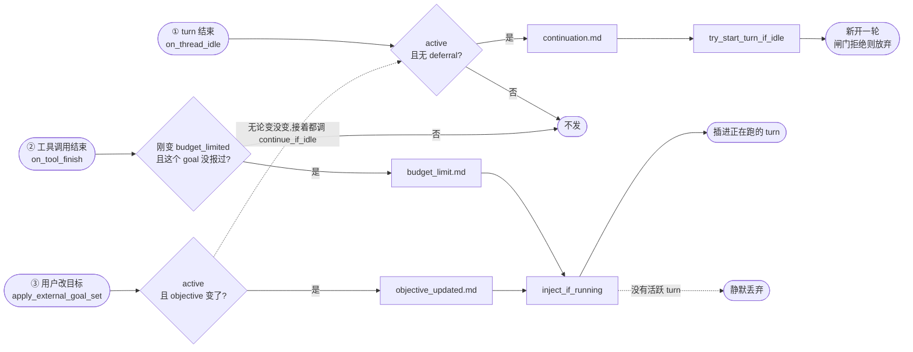
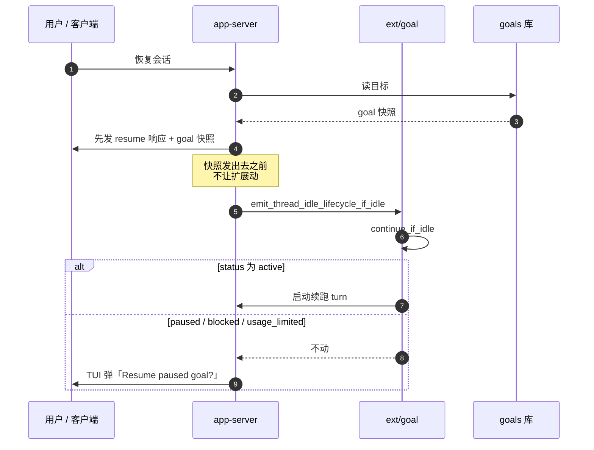
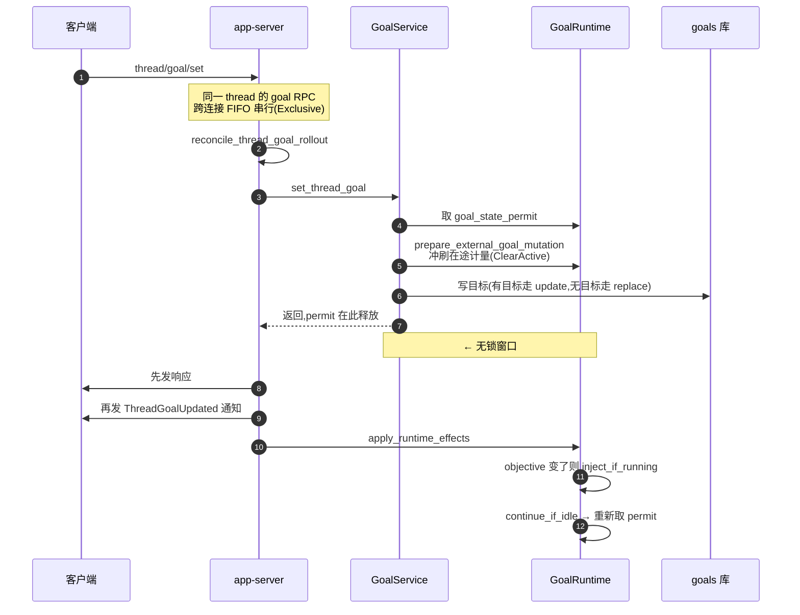

# Codex Goal 模式:原理、设计与细节

调研对象:`openai/codex` @ `2b5bdcf6`(2026-08-02)
覆盖:goal 相关全部 53 个文件、6 个实现层、20 个后端集成测试、3 份提示词、5 次数据库迁移

本文合并了此前的 4 份调研笔记(首版调研、精读修正、防敷衍机制分析、完整解读),是唯一权威版本。
我们自己的插件方案见 [10-方案-orca-goal-v2.md](./10-方案-orca-goal-v2.md)。

> 文档约定:占位符用大写下划线,不用尖括号(见 [README](./README.md#文档约定))。

**读法建议**:想快速抓住精髓,读 §2(设计是怎么演进来的)、§6(看门狗循环)、§13(哪些是机制哪些只是提示词)。
想照着实现,§5 状态机 + §7 计量 + 附录 A 的五个反直觉点是必读。

---

## 1. 是什么

`/goal` 把一次性指令变成**挂在 thread 上的持久目标**。设定之后,每当会话空闲,
系统自动再开一轮把目标往前推,直到达成、判定卡住、或预算耗尽。

用户命令(`goal_display.rs:5`):

```
Usage: /goal [OBJECTIVE|clear|edit|pause|resume]
```

三个前提,任一不满足直接拒绝:

| 前提 | 位置 | 失败表现 |
|---|---|---|
| `Feature::Goals` 特性开关打开 | `thread_goal_processor.rs:124`、`slash_dispatch.rs:776` | 命令静默返回,或 RPC 报 "goals feature is disabled" |
| thread 必须**非临时**(有 rollout 文件) | `thread_goal_processor.rs:277` | "Goals need a saved session. This session is temporary." |
| 会话已启动(有 thread_id) | `slash_dispatch.rs:802` | "The session must start before you can change a goal." |

一句话概括它的本质:**把「什么时候该继续干」这个决策,从模型手里拿走,交给宿主。**

---

## 2. 设计是怎么演进来的

五次数据库迁移完整记录了这个功能的成长过程,比任何设计文档都诚实。
理解这段演进,比直接看最终形态更能明白每个部件为什么存在。

| 迁移 | 内容 | 说明了什么 |
|---|---|---|
| `migrations/0029_thread_goals.sql` | 在**主 state 库**建表,`thread_id` 带 `REFERENCES threads(id) ON DELETE CASCADE`,状态只有 **4 个**:active / paused / budget_limited / complete | **初版没有「卡住」这个概念**。目标要么在跑、要么被用户暂停、要么烧完预算、要么完成 |
| `migrations/0033_thread_goal_stopped_statuses.sql` | 重建表,状态加到 6 个:补上 **blocked** 与 **usage_limited** | 跑起来才发现:模型会陷进去,账号会被限流。这两个终止原因是**实践中学到的** |
| `migrations/0034_drop_thread_goals.sql` | `DROP TABLE IF EXISTS thread_goals` | 从主库删除 |
| `goals_migrations/0001_thread_goals.sql` | 在**独立库**重建,`thread_id` 变成裸 `TEXT PRIMARY KEY`,**去掉了对 threads 的外键** | 目标状态与 thread 生命周期**解耦**;独立库也意味着独立的连接与锁域 |
| `goals_migrations/0002_thread_goal_continuation_deferrals.sql` | 加 deferral 表 | **fork 出来的新线程不该自己跑起来** —— 这个坑是后来才补的(deferral 只服务 fork,见 §6.4) |

三条直接可迁移的经验:

1. 自动循环的终止原因,初版一定想不全。至少要给「卡住」和「外部限流」留位置。
2. 目标状态不该跟着会话生命周期走,应该独立存储。
3. 「自动接管的时机」会踩坑,需要一个显式的让位机制。

---

## 3. 架构分层

goal 横跨六层。**它不是主循环里的 if,而是一个扩展。**



`GoalExtension` 通过 `ExtensionRegistryBuilder` 注册 6 类 contributor(`extension.rs:460`):

| Contributor | 钩子 | 职责 |
|---|---|---|
| `ThreadLifecycleContributor` | `on_thread_start` / `on_thread_resume` / **`on_thread_idle`** / `on_thread_stop` | `on_thread_idle` 是看门狗心脏 |
| `TurnLifecycleContributor` | `on_turn_start` / `on_turn_stop` / `on_turn_abort` / `on_turn_error` | 计量起止、错误终止 |
| `TokenUsageContributor` | `on_token_usage` | 累计 token 增量 |
| `ToolLifecycleContributor` | `on_tool_finish` | 工具调用后即时结算,超预算即时注入收尾 |
| `ToolContributor` | 无 | 暴露三个工具 |
| `ConfigContributor` | `on_config_changed` | 开关热更新 |

**目标状态与 turn 完全解耦**,turn 只是目标的一次推进。

---

## 4. 数据模型

```sql
-- goals_migrations/0001_thread_goals.sql,独立库
CREATE TABLE thread_goals (
    thread_id TEXT PRIMARY KEY NOT NULL,   -- 一个 thread 至多一个目标
    goal_id TEXT NOT NULL,                 -- 乐观校验用
    objective TEXT NOT NULL,               -- 上限 4000 字符
    status TEXT NOT NULL CHECK(status IN (
        'active','paused','blocked','usage_limited','budget_limited','complete')),
    token_budget INTEGER,                  -- 可空 = 不限
    tokens_used INTEGER NOT NULL DEFAULT 0,
    time_used_seconds INTEGER NOT NULL DEFAULT 0,
    created_at_ms INTEGER NOT NULL,
    updated_at_ms INTEGER NOT NULL
);
CREATE TABLE thread_goal_continuation_deferrals (
    thread_id TEXT PRIMARY KEY NOT NULL REFERENCES thread_goals(thread_id) ON DELETE CASCADE
);
```

`is_terminal() = budget_limited | complete`(`model/thread_goal.rs:39`)。
**只有 `active` 会被自动续跑。**

---

## 5. 状态机

### 5.1 全图

边上只标**谁触发**,完整依据见 §5.2 的表格。



两点图上没画:**只有 `active` 会被自动续跑**;`/goal clear` 在任意状态都能直接删除记录
(六条重复连线会把图撑乱)。

`/goal OBJ` 撞上已有未完成目标时,先弹确认,确认后走 **clear + set**
(换新 goal_id、用量清零),不是原地更新 —— 详见 §5.4。

### 5.2 每条边由谁触发

| 转移 | 触发者 | 入口 |
|---|---|---|
| 无 → active | 用户 `/goal OBJ`;模型 `create_goal` | `api.rs:143` / `tool.rs:180` |
| active → complete | **仅模型** `update_goal(complete)` | `tool.rs:221` |
| active → blocked | **模型** `update_goal(blocked)`;**系统**在不可重试 turn error 时 | `tool.rs:221` / `extension.rs:308` |
| active → paused | **仅用户**:`/goal pause`、ESC、Ctrl-C 等中断 | `slash_dispatch.rs:797` / `interaction.rs:499` |
| active → usage_limited | **系统**:`UsageLimitExceeded` | `extension.rs:315` |
| active → budget_limited | **SQL 自动**:结算时 `tokens_used + delta >= token_budget` | `goals.rs:548` |
| budget_limited → usage_limited | 系统(唯一允许覆盖终态的转移)。判定在 **Rust 里**做:`can_stop = status==Active \|\| (status==BudgetLimited && 新状态==UsageLimited)` | `runtime.rs:291` |
| paused / blocked / usage_limited → active | **仅用户** `/goal resume` | `slash_dispatch.rs:798` |
| complete → active | **仅用户** `/goal edit`,**且要求没有预算残留**(见 §5.4) | `goal_menu.rs:139` |
| paused / blocked / usage_limited → budget_limited | 模型 `update_goal(blocked)` 时用 `ActiveOrStopped` 结算模式,会把超预算的停止态目标一并提升 | `tool.rs:239` + `goals.rs:530`,测试 `goals.rs:1290` |
| budget_limited → complete | 模型 `update_goal(complete)`,走 CASE 的 ELSE 分支(分支①只挡 paused/blocked) | `goals.rs:292` |

> ⚠️ `goals.rs` 里的 `pause_active_thread_goal` / `usage_limit_active_thread_goal`
> (含 `update_active_thread_goal_status`,`goals.rs:436-470`)**是测试专用死代码** ——
> 生产零调用者,7 处命中全在 `mod tests`(从 `goals.rs:633` 起)。
> 真实的 pause 走 `/goal set(status=Paused)` → `api.rs:143` → `update_thread_goal` 的 CASE 分支。

**模型永远只能做两件事:标完成、标卡住。**

(注:表里的「仅模型」「仅用户」是**对 TUI 而言**。协议层 `ThreadGoalSetParams.status`
接受全部六个状态,任何 app-server 客户端都能直接设 complete/blocked ——
这不是协议级约束。)
暂停、恢复、预算、限流全部不在它权限内 —— 工具描述里明写:
"You cannot use this tool to pause, resume, budget-limit, or usage-limit a goal"(`spec.rs:82`)。

### 5.3 SQL 层的三条硬规则

```sql
-- goals.rs:292  update_thread_goal
status = CASE
    WHEN status = 'budget_limited' AND :new IN ('paused','blocked') THEN status   -- ① 终态保护
    WHEN :new = 'active' AND token_budget IS NOT NULL
         AND tokens_used >= token_budget THEN 'budget_limited'                    -- ② 复活即回落
    ELSE :new
END
```

1. **终态保护**:`budget_limited` 不会被 pause / blocked 覆盖
2. **复活即回落**:resume 一个已超预算的目标会立刻掉回 `budget_limited`,
   除非同一次调用抬高 `token_budget`

#### 但它不是一条统一的 SQL,是四条

上面那段是简化写法。真实代码按 `(status, token_budget)` 的 Some/None 组合分成**四个独立分支**
(`goals.rs:285-411`),语义各不相同 —— 照抄成一条会错:

| 分支 | 行号 | 终态保护 | 复活即回落 | 谁走这条 |
|---|---|---|---|---|
| `(Some, Some)` | 286 | 有 | 比较**新传入**的 budget | `/goal edit`(所以抬高预算才能真复活) |
| `(Some, None)` | 321 | 有 | 比较**列里现有**的 budget | `/goal pause` `/goal resume` |
| `(None, Some)` | 352 | **无** | 只在 `status='active'` 时降级 | 单改预算,不受终态保护 |
| `(None, None)` 带 objective | 380 | **无 status CASE** | 无 | **纯改 objective 完全不碰 status** |
| `(None, None)` 无 objective | 399 | — | — | 退化成一次读;`expected_goal_id` 不匹配返回 `None` |

第四行解释了 §5.4 那个坑的另一半:SQL 层根本不负责「编辑即复活」,
复活是 TUI 在客户端算好 status 再传回来的(`goal_menu.rs:133`)。

还有个实现风格上的不一致值得注意:这四条 SQL **都不用 `RETURNING`**,
而是 `rows_affected() == 0 → None`,然后**重新 `get_thread_goal` 读一遍**(`goals.rs:413`)。
`replace_thread_goal` 和 `account_thread_goal_usage` 用的是 `RETURNING`。
写与读之间存在窗口。

### 5.4 replace 与 edit 的语义差异

这两个很容易混,但语义完全不同:

| 操作 | 走的路径 | goal_id | 累计用量 | 状态 |
|---|---|---|---|---|
| `/goal NEW_OBJ`,当前无目标 | `replace_thread_goal` | 新 | 清零 | active |
| `/goal NEW_OBJ`,当前有未完成目标 | **弹确认** → `get` → 物化 → `clear` → `set`(三次 RPC) | 新 | **清零** | active |
| `/goal NEW_OBJ`,当前目标已 complete | 不弹确认,**但同样走 clear + set** | 新 | 清零 | active |
| `/goal edit` | `update_thread_goal` | **保留** | **保留** | 见下,**没有想象中那么万能** |

确认弹窗规则(`thread_goal_actions.rs:364`):**只有 `complete` 不需要确认**,
其余五态(含 `budget_limited`)都要用户点「Replace current goal」。

#### `/goal edit` 救不回超预算的目标

TUI 侧 `edited_goal_status`(`goal_menu.rs:133`)确实把 `BudgetLimited` 和 `Complete` 映射成 `Active`,
看起来「改目标即复活」。**但它同时把原封不动的旧预算一起传回去**
(`goal_menu.rs:16` 取值,`thread_goal_actions.rs:199` 透传),于是命中 §5.3 规则 ② 的
「复活即回落」:预算没变而 `tokens_used >= token_budget` 恒成立,**状态原地弹回 `budget_limited`**。

仓库里有测试直接钉死这个行为
(`state/src/runtime/goals.rs:1385 activating_goal_already_over_budget_keeps_it_budget_limited`):
objective 被改成了新文案、预算仍是 40、用量仍是 50,而 `status` 断言为 `BudgetLimited`。

而且 **TUI 根本没有修改预算的入口** —— `/goal` 只有
`OBJECTIVE|clear|edit|pause|resume` 五个分支,`token_budget` 全程只读不写。

所以在 Codex 里,**`budget_limited` 是真正的死路**:唯一出路是 `/goal clear` 再 `/goal 新目标`
(新 goal_id、用量清零、且新目标没有预算)。

`complete → active` 那一半成立,但也有前提:complete 目标若带预算且已超,同样会弹回 `budget_limited`。
只有「无预算」或「未超预算」的 complete 才能真复活。

---

## 6. 看门狗循环

这是整个设计的核心,也是最值得抄的部分。

### 6.0 循环是怎么闭合的

先回答最根本的问题:**谁在什么时候触发看门狗?**

**不是轮询,没有定时器。** 是 turn 结束时**同步触发**的。

turn 的执行体在 `on_task_finished` 里收尾(`core/src/tasks/mod.rs`),关键的一段顺序是:

```rust
// tasks/mod.rs:800 附近
let cleared_active_turn = {                      // ① 先把 active_turn 清空
    let mut active = self.active_turn.lock().await;
    if ... { *active = None; true } else { false }
};
if cleared_active_turn {
    self.emit_thread_idle_lifecycle_if_idle().await;   // ② 触发看门狗
}
if let Err(err) = self.flush_rollout().await { ... }   // ③ 落盘
if cleared_active_turn {
    self.maybe_start_turn_for_pending_work().await;    // ④ 才轮到用户排队的输入
}
```

注意 ② 在 ④ 之前 —— 看门狗比用户排队输入**先**拿到机会。
这看起来危险,但不会出问题,因为 ② 自己带了守卫(见下)。

`emit_thread_idle_lifecycle_if_idle`(`core/src/tasks/lifecycle.rs:42`)全文只有几行:

```rust
pub(crate) async fn emit_thread_idle_lifecycle_if_idle(&self) {
    if self.active_turn.lock().await.is_some()
        || self.input_queue.has_trigger_turn_mailbox_items().await
    {
        return;                                   // 有活跃 turn 或用户输入排队 → 连事件都不发
    }
    for contributor in self.services.extensions.thread_lifecycle_contributors() {
        contributor.on_thread_idle(ThreadIdleInput { ... }).await;
    }
}
```

**这是第一道守卫,而且比 `try_start_turn_if_idle` 更早。但它防的不是用户。**

`has_trigger_turn_mailbox_items` 只扫 `mailbox_pending_mails` 这一个队列
(`core/src/session/input_queue.rs:96`),而这个队列的**唯一非测试写入口**是
`inter_agent_communication`(`core/src/session/handlers.rs:295`)——
里面装的是 **agent 之间的消息**,不是用户输入。

用户输入走完全不同的路:`Op::UserInput` → `steer_input`(`core/src/session/mod.rs:3958`),
进的是 `turn_state.pending_input` 或者干脆在客户端排队,**从不进 mailbox**。

所以「用户优先」不是靠这道守卫实现的,而是靠 §6.2 的**抢占接管 + 事后自查**(见下)。
这道守卫真正的作用是:**别在 agent 邮件排队时启动目标续跑**。

完整闭环:



四个真实触发点(全部是事件,没有定时器):

| 触发点 | 位置 | 场景 |
|---|---|---|
| turn 正常结束或中止 | `core/src/tasks/mod.rs:814` | **主路径**,循环靠它闭合 |
| guardian review 结束 | `core/src/guardian/review.rs:276` | 审批熔断中断后补一次;注释明确**用户主动 interrupt 不走这条** |
| **冷 resume** | `app-server/…/thread_goal_processor.rs:79` | 线程未运行,恢复后启动 |
| **热 resume** | `app-server/…/thread_lifecycle.rs:751` | 线程已在跑,replay 完成后补发,门控条件与冷 resume 不同 |

(另有 `core/src/codex_thread.rs:260` 的对外转发包装,不是独立触发点。)

#### 清空 active_turn 是两段式的,而且带身份校验

上面的伪代码从「清空 active_turn」开始,漏了前一步:`RunningTask` 早在 `tasks/mod.rs:583`
就被 `take()` 走了,此时 `ActiveTurn` 已经退化成 `task: None` 的空壳
—— **形态上等价于一个预留 slot**。到 `:801` 才真正 `*active = None`,并且带校验:

```rust
if active_turn.task.is_none() && Arc::ptr_eq(&active_turn.turn_state, &turn_state)
```

**如果这中间有人抢占了 slot,`cleared_active_turn` 为 false,后面的 idle 事件和
pending work 都不会触发。** 这是抄这段最容易漏的分支。

顺带一个细节:`maybe_start_turn_for_pending_work()` 在两条分支之后是**无条件**执行的
(只受 `cleared_active_turn` 保护,`tasks/mod.rs:821`)。走完看门狗那条路也会调它,
只是此时已有 active_turn,所以是空操作。

**为什么栈不会爆**:`start_task` 内部是 `tokio::spawn`(`tasks/mod.rs:368`),
turn N+1 在新的 tokio task 上跑,turn N 的 task spawn 完就返回了。
所以跑 5 轮和跑 500 轮,调用栈深度一样。

**一个代价**:`on_thread_idle` 是在 turn N 的执行流里 `await` 的,
而且所有 `thread_lifecycle_contributors` 是**顺序 await**。
所以 `continue_if_idle` 里的 DB 读写会短暂阻塞 turn N 的收尾(在 `flush_rollout` 之前)。
Codex 靠"只做几次 SQLite 读写"把这段控制得很短。

### 6.0.1 续跑提示词以什么形式进入模型

这一步同样关键 —— 它决定模型怎么看待这段文字。

`steering.rs` 把渲染好的提示词包成 `InternalModelContextFragment`,
`source` 标签是 `"goal"`,然后 `ContextualUserFragment::into()`
(`context-fragments/src/fragment.rs:80`)把它变成:

```jsonc
ResponseItem::Message {
  role: "user",                     // ← 以「用户消息」的身份进入上下文
  content: [ InputText { text: WRAPPED_PROMPT } ]
}
```

`WRAPPED_PROMPT` 的结构是:`codex_internal_context` 开标签(带 `source="goal"` 属性)、
换行、续跑提示词全文、换行、对应的闭标签。

三个要点:

1. **role 是 `user`,不是 `developer`。** 续跑提示词在模型眼里是一条用户消息 ——
   这是 Codex 让模型认真对待它的方式。
2. **包在 `codex_internal_context` 标记里**,`source` 属性标明来源,便于在存储的历史里审计。
   老会话里用的是 `goal_context` 标记,代码里仍保留识别(`internal_model_context.rs`)。
3. **它是 core 注册在案的一等 fragment 类型,不只是"一段带标记的文本"。**
   `InternalModelContextFragment` 登记在 `CONTEXTUAL_USER_FRAGMENTS` 表里
   (`core/src/context/contextual_user_message.rs:57`),至少有四个消费者依赖这个身份:

| 消费者 | 位置 | 行为 |
|---|---|---|
| 界面渲染 | `core/src/event_mapping.rs:93` | `parse_user_message` 返回 `None`,不显示给用户 |
| **用户轮边界判定** | `core/src/context_manager/history.rs:795` | `is_user_turn_boundary` 显式排除它 |
| 回滚裁剪 | `core/src/context_manager/history.rs:407` | `trim_pre_turn_context_updates` 会把它从历史里剥掉 |
| realtime / guardian 转写 | `core/src/realtime_context.rs:220`、`core/src/guardian/prompt.rs:435` | 跳过 |

**第二条是这里最容易踩的坑**:`is_user_turn_boundary` 的下游有压缩边界、rollout 截断
(`core/src/thread_rollout_truncation.rs:86`)、rollout 重建、时间提醒等一串消费者。
**如果把续跑提示词当成普通 user message 注入,每一次自动续跑都会被误判成一次用户轮**,
压缩粒度、回滚粒度、提醒节奏全部错位。

所以这条是硬契约:**注入内容必须是宿主能识别的隐藏 fragment 类型,而不是伪装成用户消息。**

至于"跑一百轮会不会攒一百份提示词":回滚裁剪那条路径会剥,但正常流程下并没有针对
历史里旧 goal fragment 的通用去重,主要靠上下文压缩消化。

进入 turn 的路径:`try_start_turn_if_idle` 把这个 `ResponseItem` 塞进
`extend_pending_input_for_turn_state`,`start_task` 启动时用 `get_pending_input` 取出作为
turn 的初始输入。用的是普通的 `RegularTask` —— **续跑轮和用户发起的轮走同一套执行路径**,
没有特殊模式。

### 6.1 决策主流程 `continue_if_idle`(`runtime.rs:359`)



锁的作用范围值得注意:**持锁跨越「读目标 → 启动 turn」整个窗口**,
外部的 set / clear 无法在这中间插队。

### 6.2 让位闸门 `try_start_turn_if_idle`(`core/src/session/inject.rs:46`)

注释自称是「所有扩展发起的自动工作共用的一道闸」(`inject.rs:42`),
但当前**全仓库唯一调用者就是 goal**(`ext/goal/src/runtime.rs:405`)。

三种拒绝理由,分散成 7 次检查:`PendingTriggerTurn` 查 3 次(`:53/78/100`)、
`PlanMode` 查 2 次(`:59/90`)、`Busy` 查 2 次(`:68/108`)。
入口还有一条早退:`input.is_empty()` 直接 `Ok(())`,不算拒绝(`:50`)。



#### 「预留 slot」到底是什么

```rust
// core/src/state/turn.rs:31
pub(crate) struct ActiveTurn {
    pub(crate) task: Option(RunningTask),          // None = 已预留、未启动
    pub(crate) turn_state: Arc(Mutex(TurnState)),  // 用 Arc::ptr_eq 做身份标识
}
```

预留 = `Some(ActiveTurn { task: None, .. })`(`inject.rs:74`)。
身份校验统一用 `task.is_none() && Arc::ptr_eq(&turn_state, &mine)`,
在 `inject.rs:110`、`:140`、`tasks/mod.rs:803` 三处出现同一个式子。

**回滚不只是置 None**:前三条回滚路径还各自调了 `maybe_start_turn_for_pending_work()`
(`inject.rs:80/92/102`),把机会立刻还给排队的 agent 邮件;
最后一条 `still_reserved` 失败的路径**不调**(`:114`)—— 那时 slot 已被别人接管,不需要唤醒。

还有个连锁效果:因为 `emit_thread_idle_lifecycle_if_idle` 的守卫是 `active_turn.is_some()`,
**预留期间连 idle 事件都发不出去**。

#### 用户输入是怎么赢的

这道闸检查的 `PendingTriggerTurn` 是 agent 邮件(§6.0),**不是用户输入**。
用户能抢到位置靠的是另一条链:

1. 用户消息走 `steer_input`(`core/src/session/mod.rs:3958`),它要求 `active_turn.task` 是 `Some`;
   面对一个**预留态**的 slot(`task: None`)会返回 `NoActiveTurn`
2. 于是用户消息落到 `start_task`,里面 `active.get_or_insert_with(...)` 直接**接管**了
   goal 预留的那个 `ActiveTurn`,并把 `task` 填上(`tasks/mod.rs:326`)
3. goal 走到第 7 次检查发现 `task.is_none()` 不成立 → `Busy` → 放弃

所以让位机制的真相是**抢占接管 + 事后自查**,不是「事件不发出去」。

> **一个未闭合的窗口**:第 7 次检查释放锁之后,到 `extend_pending_input_for_turn_state`(`:122`)
> 和 `start_task`(`:128`)之间不持锁。若用户的 `start_task` 恰好落在这个窗口,
> `start_task` 里的 `debug_assert!(turn.task.is_none())`(`tasks/mod.rs:327`)会在 debug 构建下触发。
> 窗口很窄,但照抄这段逻辑时值得知道它没被闭合。

设计意图仍然清楚:**宁可放弃一次自动续跑,也不抢用户的位置。**

### 6.3 决定发什么消息:三条注入路径

这是看门狗的另一半 —— 前面讲的是「什么时候动」,这里讲「动的时候说什么、怎么送到」。

**先说一个反直觉的结论:看门狗不做任何内容判断。**
它不读模型上一轮的输出、不分析进度、不识别语义。
发哪份模板 100% 由**代码路径**决定,三条路径各自绑死一份模板:

| 路径 | 触发点 | 判定条件 | 模板 | 送达方式 | 送不到时 |
|---|---|---|---|---|---|
| ① **续跑** | `on_thread_idle` → `continue_if_idle`(`runtime.rs:403`) | status 为 active,无 deferral,能拿到活线程 | `continuation.md` | `try_start_turn_if_idle` **新开一轮** | 让位闸门拒绝 → 放弃本次,等下次 idle |
| ② **预算收尾** | `on_tool_finish`(`extension.rs:409`) | 结算后 status **是** `budget_limited`(不是「刚变成」,`extension.rs:400`),且该 goal_id 尚未报告过 | `budget_limit.md` | `inject_if_running` **插进正在跑的 turn** | 没有活跃 turn → 静默丢弃 |
| ③ **目标变更** | `apply_external_goal_set`(`runtime.rs:205`) | status 为 active **且** objective 文本发生变化 | `objective_updated.md` | `inject_if_running` **插进正在跑的 turn** | 没有活跃 turn → 丢弃,紧接着走路径 ① |



三点值得注意:

**路径 ② 和 ③ 是「中途插话」,不新开 turn。** `inject_if_running`(`core/src/session/inject.rs:20`)
把 item 追加到当前 turn 的 pending input 队列,模型在下一次请求时看到;没有活跃 turn 就返回 `Err`,
`inject_active_turn_steering` 只打一条 debug 日志(`runtime.rs:437`),不会退化成新开一轮。

**路径 ③ 有个巧妙的降级。** 看 `apply_external_goal_set` 的顺序(`runtime.rs:204`):

```rust
if objective_changed {
    let item = objective_updated_steering_item(...);
    self.inject_active_turn_steering(item).await;   // agent 在跑 → 插一句「目标变了」
}
self.continue_if_idle().await?;                     // agent 空闲 → 直接开新一轮
```

改目标时如果 agent 正在跑,插一句「新目标取代旧目标」;如果空闲,那句话被丢弃,
但紧接着的 `continue_if_idle` 会用 `continuation.md` 开新一轮 ——
而 continuation 模板里本来就带**最新的 objective 原文**,所以新目标照样送到。
两条路径殊途同归,不需要额外判断。

**路径 ② 只报一次。** 预算耗尽后,后续每次 `on_tool_finish` 仍会结算
(因为结算 mode `ActiveOnly` 包含 `budget_limited`,见 §7.3),但只有第一次会注入收尾提示:

```rust
// accounting.rs:290
pub(crate) fn mark_budget_limit_reported_if_new(&self, goal_id: &str) -> bool {
    if inner.budget_limit_reported_goal_id.as_deref() == Some(goal_id) {
        return false;                                  // 这个 goal 已经报过了
    }
    inner.budget_limit_reported_goal_id = Some(goal_id.to_string());
    true
}
```

这个标志在目标切换、或状态离开 `budget_limited` 时被清空
(`mark_progress_accounted_for_status` 与 `mark_*_goal_active` 都会重置它)。

#### 模板里填什么

选定模板后,`steering.rs` 用目标的当前状态渲染。三份模板的变量集不同:

| 变量 | continuation | budget_limit | objective_updated |
|---|---|---|---|
| `objective` | 有 | 有 | 有 |
| `tokens_used` | 有 | 有 | 有 |
| `token_budget` | 有 | 有 | 有 |
| `remaining_tokens` | 有 | 无 | 有 |
| `time_used_seconds` | 无 | 有 | 无 |

无预算时的降级取值也不一样:`token_budget` 一律渲染成 `none`;
`remaining_tokens` 在 continuation 里是 `unbounded`,在 objective_updated 里是 `unknown`。

`objective` 一律先过 `escape_xml_text`(转义 `&` `<` `>`),防止目标文本本身破坏包裹标签
或注入伪造的上下文标记。

#### 还有一条不走 steering 的消息

`update_goal(complete)` 的**工具返回值**里可能带 `completionBudgetReport` ——
一段要模型把最终用量讲给用户听的指令(§8)。
它是 tool result,不是 steering item,走的是正常的工具调用返回通道。

### 6.4 deferral:只为 fork 而存在

`thread_goal_continuation_deferrals` 表的作用很容易望文生义地想成「设完目标先别抢跑」。
**不是。** 全仓库只有一处会插入这张表的记录:

```rust
// state/src/runtime/goals.rs:109,在 replace_thread_goal_snapshot 的同一事务里
INSERT INTO thread_goal_continuation_deferrals (thread_id)
VALUES (?) ON CONFLICT(thread_id) DO NOTHING
```

而 `replace_thread_goal_snapshot` 全仓库**只有一个调用者**:
`app-server/src/request_processors/thread_fork_goal.rs:25`。

所以 deferral 的真实语义是:

> **fork 一个带目标的 thread 时,新 thread 继承目标(连同累计用量),
> 同时打上一条 deferral,让看门狗在新 thread 里先按兵不动。**

它在新 thread 的 `on_turn_start` 时被**无条件**清除(`extension.rs:210`)——
任何一轮都会清掉它,不限于用户发起的。实际效果是:**fork 出来的线程不会立刻自己跑起来,
要等第一轮 turn 发生过之后看门狗才接管。**

这个设计很合理:fork 的语义是「从这里分叉一条新线」,你不希望它一被创建就自己跑起来烧钱。

**而且 fork 也不是必然继承目标。** 三个条件同时满足才会继承 + 打 deferral
(`app-server/src/request_processors/thread_processor.rs:4293`):

```rust
let inherited_goal = if defer_goal_continuation      // ← fork RPC 的入参
    && session_configured.rollout_path.is_some()     // ← 不能是临时线程
    && goals_enabled { ... }
```

`defer_goal_continuation` 是 `thread/fork` 的显式参数(`protocol/v2/thread.rs:590`),
与 `ephemeral` 互斥(`thread_processor.rs:4041`)。**不传这个参数的 fork 根本不继承目标。**
另外 objective 校验失败时是 `warn!` + `return Ok(false)`,fork 照常成功但新线程无目标
(`thread_fork_goal.rs:17`)。

**普通的 `/goal OBJ` 路径不插 deferral。** 它走 `api.rs` 的
`replace_thread_goal` 或 `update_thread_goal`,两者都不碰这张表。
所以设完目标后,`apply_external_goal_set` 里的 `continue_if_idle()` 会**立刻**启动第一轮
—— 前提是当时线程空闲。而 `/goal OBJ` 本身是 slash command,不产生 turn,
所以正常情况下就是空闲的:**你设完目标,它马上开始干。**

> ⚠️ **一个真实存在的坑:deferral 的外键级联是失效的。**
> `goals_migrations/0002` 声明了 `REFERENCES thread_goals(thread_id) ON DELETE CASCADE`,
> 但连接配置里**没有 `.foreign_keys(true)`**(`state/src/sqlite.rs:250-257`),
> 而 SQLite 默认 `foreign_keys = OFF`。
> 于是 `delete_thread_goal`(`goals.rs:472`)删掉目标后,**deferral 行会残留**。
> 对 fork 出来的线程执行 `/goal clear` 再设新目标,新目标会被这条孤儿 deferral 挡住,
> 直到有人手动跑一轮才恢复自动续跑。
> 自己实现时要么显式开 FK,要么删目标时显式删 deferral。

### 6.5 恢复会话时的时序

`app-server` 显式控制顺序(`thread_goal_processor.rs:68`):



注释:"App-server owns resume response and snapshot ordering, so wait until those are sent
before letting extensions react to the idle thread."

**恢复时不会自动续跑 paused / blocked / usage_limited 的目标**,
而是 TUI 弹一个 "Resume paused goal?" 选择框(`thread_goal_actions.rs:54`,覆盖这三种状态)。

---

## 7. 计量与预算

### 7.1 口径(唯一权威公式)

```rust
// accounting.rs:331
(Δinput_tokens − Δcached_input_tokens) + Δoutput_tokens
```

先对每个字段求增量,再套公式(`accounting.rs:313`)。含义:

- **`cache_write_input_tokens` 完全不计**
- **`reasoning_output_tokens` 不单独加**(已含在 `output_tokens` 内)
- 缓存命中的输入不计

测试佐证(`tests/accounting.rs:11`):基线 `(100, 10, 30)` → 当前 `(120, 14, 42)` →
`(20 − 4) + 12 = 28`。

### 7.2 结算时机

| 时机 | 钩子 | 说明 |
|---|---|---|
| turn 开始 | `on_turn_start` | 记录 token 基线,标记这一 turn 属于哪个目标 |
| token 变化 | `on_token_usage` | 只更新进程内快照,不落库 |
| 每个工具调用后 | `on_tool_finish` | **落库结算**,见下方计入规则 |
| turn 结束 / 中止 | `on_turn_stop` / `on_turn_abort` | 收尾结算 |
| 外部改目标前 | `prepare_external_goal_mutation` | 冲刷在途计量。**没有活跃 turn 时**走 `account_idle_goal_progress` 只结算墙钟 |

**没有"空闲定时结算"这回事。** `account_idle_goal_progress`(`runtime.rs:505`)全仓库只有一个调用者
—— 上表最后一行的 `prepare_external_goal_mutation`(`runtime.rs:150`),而且是在
「当前没有 turn_id」的 else 分支里。它不是独立的时机,是那一行的一个分支。

那空闲时间是怎么被计进去的?靠两条性质叠加:
墙钟基线 `last_accounted_at` 只按已结算秒数前进而不重置为 now(`accounting.rs:398`),
且 turn 结束时 `should_clear_active_goal(Active, ClearActive)` 返回 `false`(`accounting.rs:432`)
让 `wall_clock.active_goal_id` 跨 turn 存活 ——
于是**空闲期攒下的秒数,在下一次 turn 的结算里被一并算掉**。

### 7.3 五条容易踩错的语义

1. **目标创建之前的本轮消耗不计入**。`create_goal` 会 `reset_baseline_to_current()`
   (`accounting.rs:160`)。测试 `:190`:创建前烧 28、创建后烧 15,最终 `tokens_used == 15`。
2. **Plan 模式的 turn 完全不参与**,token 与时间都不计,而且**会把空闲计时也停掉** ——
   `on_turn_start` 遇到 Plan 直接 `clear_current_turn_goal()`(`extension.rs:225`),
   它同时清掉 `wall_clock.active_goal_id` 和 `budget_limit_reported_goal_id`(`accounting.rs:174`),
   直到下一次非 Plan turn 的 `on_turn_start` 重新 mark。用户在 Plan 里待很久,这段时间不算进目标。
   `account_tokens = !matches!(mode, Plan)`,而 `progress_snapshot` 在 `!account_tokens` 时
   直接返回 `None`(`accounting.rs:199`),所以连时间也不计。
   Plan turn 上的 usage-limit 也不会停目标(测试 `:688`)。
3. **空闲时间也计入 `time_used_seconds`**。目标是「活着就在烧时间」,不是「只在跑 turn 时烧」。
   测试 `:1012`:resume 后单纯 sleep 1.1 秒,`time_used_seconds >= 1`。
4. **`budget_limited` 后继续记账,`usage_limited` 后停止记账**。
   前者结算 mode 是 `ActiveOnly = status IN ('active','budget_limited')`(测试 `:363`,25 → 35);
   后者结算完即 `clear_active_goal`(测试 `:497`,之后再烧仍是 23)。
   设计意图:预算是自己设的线,越线后真实花费仍要如实记;
   限流是外部强制中断,之后的消耗不算这个目标的。
5. **墙钟结算不丢余数**。`mark_accounted` 让基线**前进已结算的秒数**而非重置为 now
   (`accounting.rs:398`),`.as_secs()` 截断掉的毫秒留在基线里累积。
   `mark_active_goal` 只在 goal_id 变化时才重置基线,所以切换目标不会把旧目标的时间算到新目标头上。

### 7.3.1 `on_tool_finish` 的计入规则

两条独立的过滤,都要抄准(`extension.rs:373-377`、`:492-504`):

**排除自身**:只排除 `namespace` 为空**且**名字是 `update_goal` 的调用。
`get_goal` 和 `create_goal` **不排除**,照样触发结算;带 namespace 的同名工具也不排除。

**按结果计入**:

| `ToolCallOutcome` | 计入结算 |
|---|---|
| `Completed` | 是 |
| `Failed { handler_executed: true }` | 是 |
| `Failed { handler_executed: false }` | 否 |
| `Blocked` | 否 |
| `Aborted` | 否 |

### 7.3.2 结算主流程伪代码

流程图表达不了锁的持有区间和早退顺序,这段直接给伪代码
(`runtime.rs:442 account_active_goal_progress`):

```text
account_active_goal_progress(turn_id, event_id, mode, disposition):
    permit = accounting.progress_accounting_permit().await     # 信号量 1,串行化并发结算
    snapshot = accounting.progress_snapshot(turn_id)
        # 内部三道早退:
        #   turn 不存在 → None
        #   !account_tokens(Plan 模式)→ None
        #   拿不到 active_goal_id → None
        #   token_delta 与 time_delta 都为 0 → None
    if snapshot is None: return None                            # ← SQL 根本不会被调用

    previous_status = 读当前状态(带 expected_goal_id 过滤,仅供 metrics)

    outcome = SQL account_thread_goal_usage(
        time_delta, token_delta, mode,
        expected_goal_id = snapshot.expected_goal_id)           # ← 乐观校验在这里

    match outcome:
        Updated(goal):
            记 metrics / analytics
            accounting.mark_progress_accounted_for_status(
                turn_id, snapshot, goal.status, disposition)    # ← disposition 在这里生效
            发 ThreadGoalUpdated 事件
            return goal
        Unchanged(_):
            return None                                        # 注意:什么都不做
                                                               # 空闲版本这里会重置基线并清 active
```

最后那个不对称值得单独记:`account_active_goal_progress` 的 `Unchanged` 分支什么都不做,
而 `account_idle_goal_progress` 的 `Unchanged` 分支会
`reset_idle_progress_baseline_and_clear_active_goal()`(`runtime.rs:562`)——
因为空闲版本走到 `Unchanged` 说明 DB 侧目标已经消失或状态不匹配,
必须重置墙钟基线,否则这段时间会被重复计到别的目标上。

### 7.4 并发安全

- `progress_accounting_permit`(信号量 1)+ `progress_snapshot` / `mark_progress_accounted` 配对
- 测试 `:300`:两个 `tool_finish` 并发 → **只产生一个事件**,`tokens_used == 30`
- 每次**结算** SQL 都带 `AND goal_id = :expected_goal_id`,
  目标被替换后在途的旧结算不会写错账
  (测试 `state/src/runtime/goals.rs:913 usage_accounting_ignores_replaced_goal_version`)
- ⚠️ **但模型的状态写入没有这层校验**:`update_goal` 落库时传的是
  `expected_goal_id: None`(`tool.rs:261`),`current_goal_status_for_metrics(None)` 同理(`tool.rs:250`)。
  所以模型在一个长 turn 里标 complete 时,若用户中途换了目标,**complete 会落到新目标头上**。
  对比 `stop_active_goal_for_turn` 是带 `expected_goal_id` 的(`runtime.rs:309`)
- `stop_active_goal_for_turn` 先查 `turn_is_current_active_goal(turn_id)`,
  过期 turn 的请求直接忽略(测试 `:725`)

### 7.5 结算 SQL:两个正交的 filter,四种 mode

```sql
-- goals.rs:548
status = CASE WHEN BUDGET_LIMIT_FILTER
              AND token_budget IS NOT NULL
              AND tokens_used + :delta >= token_budget
         THEN 'budget_limited' ELSE status END
WHERE thread_id = ? AND STATUS_FILTER [AND goal_id = ?]
```

不是先读再判再写,而是一条 UPDATE 完成,天然免疫竞态。

**关键是这里有两个不同的 filter,不能写成同一个**(`goals.rs:518-531`):

| `GoalAccountingMode` | `status_filter`(哪些行可以加账) | `budget_limit_status_filter`(哪些行可以被翻成 budget_limited) | 谁用 |
|---|---|---|---|
| `ActiveStatusOnly` | `active` | `active` | 生产零调用,仅测试 |
| `ActiveOnly` | `active`, `budget_limited` | `active` | 默认路径:tool_finish / turn_stop / turn_abort / 外部变更 |
| `ActiveOrComplete` | `active`, `budget_limited`, `complete` | `active` | `update_goal(complete)`(`tool.rs:238`) |
| `ActiveOrStopped` | `active`, `paused`, `blocked`, `usage_limited`, `budget_limited` | **同左(全集)** | `update_goal(blocked)`(`tool.rs:239`) |

两个 filter 的差异正是「已 `budget_limited` 的行继续加账、但不会重复触发状态翻转」的来源。
**写成同一个 filter,行为立刻错。**

最后一行还藏着一条 §5.2 提过的语义:`ActiveOrStopped` 的 budget filter 是全集,
所以模型标 blocked 时,一个已超预算的 `paused` 目标会被**顺带提升成 `budget_limited`**
(测试 `goals.rs:1290 stopped_usage_accounting_promotes_paused_goal_over_budget`)。

### 7.6 进程内的另一半:`BudgetLimitedGoalDisposition`

只看 SQL 会漏掉一半 —— 结算能不能发生,还取决于进程内的 `active_goal_id` 有没有被清。
`progress_snapshot` 在拿不到 `active_goal_id` 时直接返回 `None`(`accounting.rs:202`),
**SQL 根本不会被调用**。

清不清由一个枚举参数决定:

```rust
// accounting.rs:54
pub(crate) enum BudgetLimitedGoalDisposition { KeepActive, ClearActive }

// accounting.rs:427
fn should_clear_active_goal(status, disposition) -> bool {
    match status {
        Active         => false,
        BudgetLimited  => matches!(disposition, ClearActive),   // ← 唯一由调用方决定的分支
        Paused | Blocked | UsageLimited | Complete => true,
    }
}
```

**全仓库 `KeepActive` 只出现一次**:`on_tool_finish`(`extension.rs:386`)。
其余五个调用点全是 `ClearActive`(`extension.rs:267/295`、`runtime.rs:144/153/276`、`tool.rs:246`)。

所以「`budget_limited` 后继续记账」是三层共同作用的结果,少一层都不成立:

| 层 | 位置 | 作用 |
|---|---|---|
| SQL `status_filter` 含 `budget_limited` | `goals.rs:520` | 允许 UPDATE 命中该行 |
| `on_tool_finish` 用 `KeepActive` | `extension.rs:386` | 不清进程内标记,下次才进得了 SQL |
| `on_turn_start` 对 `BudgetLimited` 也 mark active | `extension.rs:240` | 否则下一轮开始就断账 |

判别性测试:`goal_extension_backend.rs:439 budget_limited_goal_keeps_accounting_after_later_tool_finish`
—— 刻意不调 `stop_turn`,第二次 tool_finish 仍记到 35。若 tool_finish 用 `ClearActive`,会停在 25。

---

## 8. 模型侧的三个工具

只在 `tools_visible()` 时暴露:特性开启 **且** 有持久化 thread 状态 **且** 不是 Review 子代理
(`extension.rs:105`)。

| 工具 | 参数 | 约束 |
|---|---|---|
| `get_goal` | 无 | 读状态、预算、用量、剩余 |
| `create_goal` | `objective`,可选 `token_budget` | **仅在用户明确要求时**创建;只有现有目标 `status = 'complete'` 才能替换(`goals.rs:245` 的 `ON CONFLICT … WHERE`),**budget_limited 虽是终态也会被拒**,报 "this thread has an unfinished goal" |
| `update_goal` | `status: complete 或 blocked` | **只能标完成或卡住**。`tool.rs:226` 二次校验,传其他值直接报错 |

返回体:

```jsonc
{ "goal": {...}, "remainingTokens": 12, "completionBudgetReport": "Goal achieved. Report final usage…" }
```

`completionBudgetReport` 只在 `update_goal(complete)` 且(有预算 或 耗时大于 0)时出现
(`tool.rs:491`),内容是一段**要模型把最终用量讲给用户听**的指令。`blocked` 不带(测试 `:762`)。

**工具描述本身就是约束的一部分。** `spec.rs:74-83` 那段 `update_goal` 的工具 description 有 1100 多字符,
把「什么时候可以标 blocked」写得极细 —— 因为宿主侧没有任何计数器执行它(见 §13)。

---

## 9. 提示词

三份模板,`ext/goal/templates/goals/` 与 `prompts/templates/goals/` **逐字节相同**
(后者是重构前的旧位置)。但 **`prompts/src/goals.rs` 不是 `steering.rs` 的副本**:
它缺少 `*_steering_item` 与 fragment 包裹逻辑,而且 `objective_updated` 无预算时渲染成 `unbounded`,
生效路径(`steering.rs:109`)渲染的是 `unknown`。参考时别抄错那一份。
渲染后作为 `InternalModelContextFragment { source: "goal" }` 注入。

我们改写后的版本见 [`prompts/`](./prompts)。

### 9.1 `continuation.md`(51 行,5261 字节)—— 续跑主提示

七个小节,每节防一种具体失败:

| 小节 | 防的失败 | 关键句 |
|---|---|---|
| **Continuation behavior** | 把目标缩小到本轮能做完的程度 | "Ending this turn does not require shrinking the objective to what fits now" |
| **Budget** | 无(信息告知) | 已用 / 预算 / 剩余 |
| **Work from evidence** | 靠对话记忆而不看实际状态 | "Use the current worktree and external state as authoritative" |
| **Progress visibility** | 多步任务无计划;或用计划替代干活 | "do not treat a plan update as a substitute for doing the work" |
| **Fidelity** | 换一个更容易通过测试的更小方案 | "An edit is aligned only if it makes the requested final state more true" |
| **Completion audit** | 假完成 | "treat completion as unproven";逐条需求找权威证据;"Treat uncertain or indirect evidence as not achieved" |
| **Blocked audit** | 一遇阻力就放弃 | 同一阻塞**连续 3 轮**才允许标 blocked |

两条贯穿始终的硬约束:

- 不许因为预算快用完就标完成
- objective 用 objective XML 标签包裹并转义,明确声明是**用户数据而非高优先级指令**(防提示注入)

最长的一段是 Completion audit 的收尾,它的逻辑结构值得完整理解:

```text
不许拿意图、局部进展、对早前工作的记忆、或一个看起来合理的最终答复当作完成的证明。
标记完成 = 声称完整目标已经做完,且能经受逐条需求的推敲。
只有当前证据证明每条需求都已满足、且没有必需工作剩余时,才允许标完成。
如果证据不完整、薄弱、间接、仅仅与完成相容、或有任何一条需求缺失 / 未完成 / 未验证,
继续工作,不要标完成。
```

### 9.2 `budget_limit.md`(16 行)—— 预算耗尽收尾

"系统已把目标标为 budget_limited,不要开新工作;总结进展、列出剩余工作与阻塞、给用户明确下一步。"
末尾一句关键:"Do not call update_goal unless the goal is actually complete."

### 9.3 `objective_updated.md`(16 行)—— 目标被编辑

新目标取代旧目标;"Avoid continuing work that only served the previous objective
**unless it also helps the updated objective**"(后半句不能漏,否则语气比原文强)。
这里 objective 用的标签是 `untrusted_objective`,比另外两份更强调不可信。

---

## 10. TUI 层的体验设计

### 10.1 超长目标的落盘机制(`goal_files.rs`)

`MAX_THREAD_GOAL_OBJECTIVE_CHARS = 4000`。超长时:

1. 正文落盘到 `CODEX_HOME/attachments/UUID/goal-objective.md`
   —— 注意用的是 `fs_write_file_path` 等 **app-server RPC,不是本地 fs**(`goal_files.rs:185-217`),
   SSH / 远程场景下这个区别是决定性的
2. objective 本身改写成一句
   `Read the Codex goal objective file at ABS_PATH before continuing.`
3. 这句话本身还要再校验一次长度(`objective_file_reference`)

顺带处理的还有:粘贴的长文本落成单独文件、本地图片复制进附件目录、远程图片 URL 追加成引用段落。

**路径校验值得抄**(`objective_file_path:157`):把 objective 反解成路径时,
严格要求它等于 `CODEX_HOME/attachments/UUID/goal-objective.md` 且 UUID 可解析,否则拒绝。
这是防路径穿越 —— objective 是用户数据,不能让它指向任意文件。

`/goal edit` 会把文件内容**读回来**给用户编辑(`objective_text_for_edit`)。

### 10.2 状态呈现

`blocked` 对用户显示为 **"stalled"**,不是 "blocked"(`goal_display.rs:37`),措辞上弱化了失败的意味。

状态行指示器(`goal_status.rs`):

| 状态 | 显示 |
|---|---|
| active | 有预算显示 `12.5K / 50K`,无预算显示已用时长 `2m` |
| paused / stalled / usage limited | 只显示状态 |
| limited by budget | `63.9K / 50K tokens` |
| complete | 有预算显示 tokens,无预算显示时长 |

active 状态下指示器的数字是滚动的,但**不是简单地加上 turn 已跑时间**:
基线取 `max(快照观测时刻, turn 开始时刻)`(`goal_status.rs:34`),
这样才不会把「turn 开始前的空闲」和「服务端已计入的时间」重复累加。

裸 `/goal` 打印摘要,并按状态给出可用命令(`goal_menu.rs:109`):

- active → `/goal edit, /goal pause, /goal clear`
- paused / stalled / usage limited → `/goal edit, /goal resume, /goal clear`
- limited by budget / complete → `/goal edit, /goal clear`

### 10.3 中断即暂停

`pause_active_goal_for_interrupt`(`interaction.rs:499`)挂在**六个中断路径**上:
ESC 打断、Ctrl-C、会打断任务的模态按键等。

三个前置守卫(`interaction.rs:500/503/509`):

```rust
if !self.turn_lifecycle.agent_turn_running { return; }   // 没有在跑的 turn 就不管
if !current_goal_status.is_some_and(GoalStatusState::is_active) { return; }  // 目标不是 active 就不管
```

语义:**用户按 ESC 的意思是「停下」,不只是「停这一轮」。**
所以顺带把目标也暂停,否则下一次空闲又会自动跑起来,用户会觉得打不断。
这是很细但很重要的体验决策。

### 10.4 其他细节

- 设定目标成功后调 `maybe_send_next_queued_input()`,让排队的输入接着走
- 附件清理发生在**物化成功之后、RPC 失败时**(`thread_goal_actions.rs:182/218`);
  物化本身失败是直接 return,不调 `cleanup_materialized_goal_files`
- 所有异步操作后都检查 `current_displayed_thread_id() != Some(thread_id)`,
  防止用户切走后把结果写到别的会话里
- 临时会话的错误有专门文案,不是抛裸错误

---

## 11. app-server 层的七个设计点

### 11.1 目标可以先于会话存在

`thread_goal_set_inner`(`:119`,rollout 物化分支在 `:161`):如果 thread 还没有 rollout 文件,
设定目标会**顺带物化 rollout**,并把 thread settings 一起写进去。

注释:"Goal-first threads need their settings captured when the goal creates the rollout."

也就是说,可以先定目标再开始干活。

### 11.2 只有 set 写 rollout,clear 不写

`thread_goal_set_inner` 里有三处 `append_rollout_items`(`thread_goal_processor.rs:174/186/196`),
往 rollout 追加 `RolloutItem::EventMsg(ThreadGoalUpdated)`。

但 **`thread_goal_clear_inner`(`:237-270`)完全没有 rollout 写入**,只发一条客户端通知。
所以 rollout 重放看不到「目标被清除」,DB 与 rollout 在这件事上天然不对称。

「变更史在会话记录里」也是过誉:模型侧 `create_goal` / `update_goal`、
系统侧 blocked / usage_limited / budget_limited **全部只走事件通道,不落 rollout**。
而落进 rollout 的那一条,唯一消费方是 `state/src/extract.rs:114` ——
用来给 thread 填 preview 标题,**不用于恢复 goal 状态**。

顺带:set 路径的 rollout 写入失败也只 `warn!`(`:202`),响应照样返回成功。

### 11.3 外部变更的三段式锁交接

§6.1 只说了「持锁跨越读目标到启动 turn」,那是看门狗一侧。
外部变更(set / clear / edit)这一侧的锁交接是三段的,中间有个无锁窗口:



三个容易踩的点:

1. **`apply_runtime_effects` 在响应和通知都发出之后才跑**(`thread_goal_processor.rs:214`)——
   客户端看到「设置成功」时,续跑还没启动。
2. **`clear` 的顺序不同**:它是**先 drop permit 再** `apply_external_goal_clear`(`api.rs:315`)。
3. app-server 还有一道文档之外的保护:三个 goal RPC 都声明了 `serialization: thread_id(...)`,
   映射成 `RequestSerializationAccess::Exclusive`,**同一 thread 的 goal 请求跨连接串行**。

另外 `thread/goal/set` 和 `clear` **每次调用前都会先跑一次全量 `reconcile_rollout`**
(`reconcile_thread_goal_rollout`,`thread_goal_processor.rs:303`),把 rollout 回灌进 state db
—— 这也是为什么非运行中的 thread 也能设目标。

### 11.4 目标 objective 会变成 thread 的标题

`fill_empty_thread_preview_if_possible`(`tool.rs:439`)在 thread preview 为空时用 objective 填充,
被 `handle_create`(`tool.rs:207`)和 `set_thread_goal`(`api.rs:274`)调用。
另一条路径是 rollout 回放时 `state/src/extract.rs:114` 从 `ThreadGoalUpdated` 事件取 objective ——
这是 §11.2 里那条 rollout item 的**唯一消费方**。

### 11.5 `on_thread_stop` 之后外部变更会静默丢账

`on_thread_stop` 把 runtime 从 `GoalService` 注销(`extension.rs:169`),
之后 `runtime_for_thread` 返回 `None`,外部 set / clear 会
**跳过 permit、跳过 `prepare_external_goal_mutation`、跳过 `apply_runtime_effects`**
(`api.rs:172-188`、`:289-305`)—— 在途计量丢失,且不发任何 goal 事件。
测试 `goal_extension_backend.rs:972` 断言了这个行为。

### 11.6 通知定序

`emit_thread_goal_updated_ordered` 优先走 thread listener 的 command channel,拿不到才直接发。
目的是让 goal 通知和其他 thread 事件保持顺序,避免客户端收到乱序状态。

### 11.7 fork 继承目标(含用量)

`thread_fork_goal.rs`:fork 一个 thread 时,把源目标**整个快照**复制过去,只换 `thread_id`。
`replace_thread_goal_snapshot` 复制全部字段,包括 `tokens_used` 和 `time_used_seconds`。

**fork 不重置预算。** fork 前会先 `flush_thread_goal_progress_for_fork` 冲刷在途计量,
保证快照是准的;继承前还会重新校验 objective,校验失败就跳过继承。

---

## 12. 失败与边界处理

| 情形 | 行为 | 位置 |
|---|---|---|
| 不可重试的 turn error | → **blocked** | `extension.rs:308`,五个触发点见下 |
| `UsageLimitExceeded` | → usage_limited | `extension.rs:315` |
| 临时会话(无 rollout) | 拒绝,专门文案 | `thread_goal_processor.rs:277` |
| Review 子代理 | 不暴露 goal 工具 | `extension.rs:108` |
| Plan 模式 | 不计量、不续跑、usage-limit 不生效 | `accounting.rs:80` |
| 拿不到活线程 | 跳过续跑 | `runtime.rs:379` |
| 目标已被替换 | 在途结算被 `expected_goal_id` 拦掉 | `goals.rs:583` |
| 过期 turn 的停止请求 | 忽略 | `runtime.rs:256` |
| 模板 parse 失败 | **panic**(嵌入模板视为不变量) | `steering.rs:33` |
| 模板 render 失败 | **panic** | `steering.rs:76/97/120` |

`on_turn_error` 那条的注释解释了为什么不可重试错误要直接 blocked:

```
The turn has ended because the error was non-retryable or its retries were exhausted.
Block the goal to prevent automatic continuation from looping and consuming tokens,
as can happen with compaction errors.
```

**这是整个设计里唯一一条明确的防烧钱熔断。**

#### `on_turn_error` 的五个触发点

不是「turn 失败时触发一次」这么简单:

| 位置 | 场景 |
|---|---|
| `core/src/tasks/mod.rs:562` | task 返回非 abort 错误 |
| `core/src/session/turn.rs:175` | **pre-sampling 压缩失败** |
| `core/src/session/turn.rs:449` | **turn 中途压缩失败** ← 就是注释里说的 compaction errors |
| `core/src/session/turn.rs:524` | 图片非法 → BadRequest |
| `core/src/session/turn.rs:537` | 通用 turn 错误 |

三条必须知道的配套事实:

1. **`TurnAborted` 被显式排除**(`turn.rs:170` 与 `:445` 都先 `matches!(err.details(), TurnAborted)` 就提前 return)。
   所以**用户中断走 abort 路径,不会导致 blocked** —— 中断的暂停语义由 TUI 侧的
   `pause_active_goal_for_interrupt` 负责(§10.3),两条路径不要混。
2. turn.rs 那四处之后 turn 都**正常收尾**(`return Ok(None)` / `break`),
   所以 `on_turn_stop`(`tasks/mod.rs:782`)和 `on_thread_idle`(`:814`)**还会照跑一次**。
   靠 `turn_is_current_active_goal` 的幂等守卫兜住(`runtime.rs:256`)。
3. `finish_turn` 只在 stop / abort 里调(`extension.rs:276/304`),
   **`on_turn_error` 不清理 per-turn 记录**。

---

## 13. 哪些是机制,哪些只是提示词

这一节是全文最重要的判断,直接决定能不能照搬。

### 13.1 防偏移:是真机制

| 机制 | 源码依据 | 挡住了什么 |
|---|---|---|
| **模型没有改写 objective 的权限** | `update_goal` 参数只有 `status`,且只接受 complete / blocked(`spec.rs:60`、`tool.rs:226` 二次校验);`create_goal` 在有未完成目标时硬失败(`goals.rs:245`) | 模型**不能**把「迁移全部并让测试通过」改成「迁移一个文件」 |
| **每轮把完整 objective 原文重注入** | `continuation_steering_item` 每次续跑都重新渲染(`steering.rs:45`) | 长跑中上下文压缩、对话漂移导致的「忘了原始要求」 |
| **objective 存 DB 而非上下文** | `thread_goals` 表 | compaction 吃不掉目标 |
| **objective 被标为不可信数据** | XML 包裹 + 转义 + 显式声明 | 目标文本本身变成提示注入向量 |
| **续跑与否由宿主决定** | `continue_if_idle` + `try_start_turn_if_idle`;预算判定在 SQL 里 | 模型无法自己决定「我不干了」 |
| **不可重试错误强制 blocked** | `on_turn_error`(`extension.rs:308`) | 编译 / 压缩错误把循环变成烧钱机 |

**「目标不偏移」这件事,Codex 是用权限边界解决的,不是用提示词。**

### 13.2 空白一:完成声明零验证

`update_goal(complete)` **没有任何验证**。`tool.rs:221` 的 `handle_update` 只做三件事:
校验 status 属于 {complete, blocked}、结算用量、写状态。

对 `ext/goal` 全模块 grep `review|verify`,唯一的 `validate_*` 是校验 objective 长度和
budget 为正数。**没有任何一行代码检查「目标真的完成了吗」。**

模型说完成,循环立刻停止。

> 顺带排除一个容易产生的猜测:Codex 确实有 `Guardian` 和 `auto_review`,
> 但那是**工具调用的安全审批** —— 审批 `rm -rf` 这类命令,`ApprovalReviewer::Guardian`。
> 它和 goal 的唯一交集是「Review 子代理不发放 goal 工具」。**不是完成验证器。**
> 快照名 `guardian_goal_continuation_drops_stale_reviews` 有误导性,
> 对应测试 `guardian_cleanup_drops_stale_reviews_and_restores_mcp_status` 压根不涉及 goal。

### 13.3 空白二:blocked 三轮由模型自己数

```
$ grep -rn "streak|consecutive|blocked_count" ext/goal/src/*.rs state/src/runtime/goals.rs
# 宿主侧零个计数器
```

"at least three consecutive goal turns" 只出现在两个地方:`spec.rs:66/77`(工具描述)
和 `continuation.md`(提示词)。`thread_goals` 表也没有任何 streak 字段。

模型完全可以第一轮就报 blocked,宿主不会拦。**这是提示词,不是机制。**

### 13.4 总表

| 保证 | 靠什么 | 性质 |
|---|---|---|
| 模型不能改小目标 | 权限边界 | **机制** |
| 目标不随压缩丢失 | 存 DB + 每轮重注入 | **机制** |
| 目标文本不能当指令 | XML 包裹 + 转义 + 声明 | **机制** |
| 续跑与否不由模型决定 | 宿主循环 + SQL 预算 | **机制** |
| 不烧钱死循环 | 不可重试错误强制 blocked + SQL 硬预算 | **机制** |
| 用户输入优先 | `try_start_turn_if_idle` 四重检查 | **机制** |
| **完成是真的完成** | Completion audit 段 | **提示词** |
| **不轻易放弃** | Blocked audit 三轮规则 | **提示词** |
| **不偷换更容易的方案** | Fidelity 段 | **提示词** |

**结论:Codex 用权限边界解决了「不偏移」,用提示词处理「不敷衍」。**
前者可以直接照搬,后者如果照搬,就只是搬了段文字。

对通用 CLI 来说这个取舍是合理的 —— Codex 不知道用户的项目怎么算「做完了」。
但如果要在特定环境里做,这一层是必须自己补的
(我们的补法见 [10-方案 §5.5 完成守卫](./10-方案-orca-goal-v2.md))。

---

## 14. 可迁移的十二条

1. 目标持久化,与单次 turn 解耦;存的是意图 + 预算 + 用量,不是对话
2. 自动续跑必须走**统一的「仅空闲时启动」闸门**,并且反复检查用户输入
3. **fork 出来的新线程要有 deferral**,不能一创建就自己跑起来(Codex 的 deferral 只为这个场景存在)
4. 模型只能设两个终止标志,其余状态转移全在宿主手里
5. blocked 与 usage_limited 是**必须预留**的终止原因(Codex 初版没有,后来补的)
6. 目标状态独立存储,不挂在会话生命周期上(Codex 从主库迁到独立库)
7. 预算判定写进原子更新,配合 `expected_goal_id` 乐观校验
8. 任何不可重试的错误直接终止循环 —— 唯一的防烧钱熔断
9. 计量要区分:创建前不算、Plan 轮不算、空闲时间要算、限流后不算、超预算后仍要算
10. 中断即暂停 —— 用户按 ESC 的意思是「停下」,不是「停这一轮」
11. 超长目标落盘 + 单行引用,并对反解路径做严格校验(objective 是用户数据)
12. **完成判定是唯一的空白**;要真正防敷衍,必须自己补一层可证伪的验收

---

## 附录 A:五个反直觉点

这五条最容易想当然想错,每条都有测试佐证。落地实现时逐条对照。

### A1 token 口径不是「总 token」

是 `(Δinput − Δcached) + Δoutput`。**不含 cache write**,reasoning token 也不单独加
(已在 output 内)。

映射到 Claude 的字段时要注意:Claude 的 `input_tokens` **本身就已排除**缓存命中部分,
所以对齐 Codex 口径应该是 `input_tokens + output_tokens`,不需要再做减法。

### A2 「换目标就换 goal_id、清用量」只对一条路径成立

- 无目标时设定 → `replace_thread_goal`:新 goal_id,用量清零
- 已有目标编辑 objective → `update_thread_goal`:**保留** goal_id 与累计用量

测试 `:896`:创建目标后消耗 20 → 编辑 objective → 再消耗 10 → 最终 `tokens_used == 30`。
编辑不清零,而且基线被正确重置,所以既不丢账也不重复计。

### A3 `create_goal` 的替换条件是 `status = 'complete'`,不是「任意终态」

`ThreadGoalStatus::is_terminal()` 包含 `BudgetLimited | Complete`,
但 SQL 的 `ON CONFLICT … WHERE thread_goals.status = 'complete'` 只认 complete。
**模型面对 budget_limited 目标建新目标依然会失败**。

⚠️ 这条只有 SQL 依据,**没有测试兜底**:`:133 installed_goal_tools_only_replace_complete_goal`
走的是 active → 建失败 → 标 complete → 建成功,全程没出现过 `budget_limited`。

### A4 目标创建之前的本轮消耗不计入

`create_goal` 会 `reset_baseline_to_current()`。
测试 `:190`:创建前烧 28、创建后烧 15,最终 `tokens_used == 15`,那 28 没被计入。

### A5 `budget_limited` 与 `usage_limited` 的记账行为相反

| 状态 | 后续用量 | 依据 |
|---|---|---|
| `budget_limited` | **继续累加** | 结算 mode `ActiveOnly` 含 budget_limited(`goals.rs:520`);测试 `:363` 断言 25 → 35 |
| `usage_limited` | **停止累加** | 结算后 `clear_active_goal()`;测试 `:497` 断言之后再消耗仍是 23 |

---

---

## 附录 C:枚举速查

实现时最容易漏变体的五个枚举,集中在这里。

| 枚举 | 变体 | 位置 |
|---|---|---|
| `ThreadGoalStatus` | `active` / `paused` / `blocked` / `usage_limited` / `budget_limited` / `complete` | `state/src/model/thread_goal.rs:14` |
| `GoalAccountingMode` | `ActiveStatusOnly`(仅测试) / `ActiveOnly`(默认) / `ActiveOrComplete`(标完成) / `ActiveOrStopped`(标阻塞) | `state/src/runtime/goals.rs:32`,语义见 §7.5 |
| `BudgetLimitedGoalDisposition` | `KeepActive`(只有 `on_tool_finish` 用) / `ClearActive`(其余 5 处) | `ext/goal/src/accounting.rs:54`,语义见 §7.6 |
| `TryStartTurnIfIdleRejectionReason` | `PendingTriggerTurn` / `PlanMode` / `Busy` | `core/src/codex_thread.rs`,检查点见 §6.2 |
| `ToolCallOutcome`(决定是否计入结算) | `Completed` 计 / `Failed{handler_executed:true}` 计 / `Blocked` 不计 / `Failed{handler_executed:false}` 不计 / `Aborted` 不计 | `ext/goal/src/extension.rs:492` |

另外两个容易漏的数据契约:

- **`token_budget` 是双层 Option**:双层 Option(`Option` 套 `Option` of i64) 配 `deserialize_double_option` ——
  外层 `None` = 不改、`Some(None)` = 清空、`Some(Some(n))` = 设值
  (`app-server-protocol/src/protocol/v2/thread.rs:814`)
- **objective 长度按 Unicode scalar 计**:`chars().count()` 不是字节数;
  校验函数自身不 trim,trim 在 `ext/goal/src/api.rs:157`(`protocol/src/protocol.rs:4073`)

## 附录 B:文件索引与阅读覆盖度

| 层 | 文件 | 行数 | 覆盖 |
|---|---|---|---|
| protocol | `protocol/src/protocol.rs`(goal 部分) | — | 全 |
| state | `state/src/model/thread_goal.rs` | 117 | 全 |
| state | `state/src/runtime/goals.rs` | 1728 | 非测试部分全读 |
| state | `goals_migrations/*.sql`、`migrations/0029/0033/0034` | 81 | 全 |
| ext/goal | `extension.rs` | 504 | 全 |
| ext/goal | `runtime.rs` | 586 | 全 |
| ext/goal | `accounting.rs` | 442 | 全 |
| ext/goal | `tool.rs` | 500 | 全 |
| ext/goal | `api.rs` | 357 | 全 |
| ext/goal | `spec.rs` / `steering.rs` / `events.rs` / `metrics.rs` / `analytics.rs` / `lib.rs` | 446 | 全 |
| ext/goal | `tests/goal_extension_backend.rs` | 1477 | 20 个测试全读 |
| ext/goal | `tests/accounting.rs` | 69 | 全 |
| ext/goal | `templates/goals/*.md` | 83 | 全 |
| core | `core/src/session/inject.rs` | 167 | 全 |
| app-server | `thread_goal_processor.rs` | 462 | 全 |
| app-server | `thread_fork_goal.rs` | 28 | 全 |
| tui | `app/thread_goal_actions.rs` | 464 | 全 |
| tui | `goal_files.rs` | 242 | 全 |
| tui | `chatwidget/goal_menu.rs` | 143 | 全 |
| tui | `chatwidget/goal_status.rs` | 228 | 全 |
| tui | `goal_display.rs` | 111 | 全 |
| tui | `chatwidget/slash_dispatch.rs`(goal 部分) | — | 全 |
| tui | `chatwidget/interaction.rs`(中断部分) | — | 全 |
| prompts | `prompts/src/goals.rs` | 110 | 全(旧位置,与 `steering.rs` 行为有出入,见 §9) |

**未读**:TUI 快照文件(纯渲染断言)、`chatwidget/tests/goal_menu.rs` 与
`goal_validation.rs` 的测试体(测试名已核对,覆盖超长目标、多行目标、粘贴保留、队列中断)。

### 关于测试覆盖的一个重要提醒

`ext/goal/tests/goal_extension_backend.rs` 的 harness 把 `thread_manager` 传成 `Weak::new()`
(`:1125`/`:1179`),所以 `continue_if_idle` 在 `runtime.rs:379` 就提前 return ——
**整条 idle 续跑链路(含 deferral 检查、让位闸门调用)在这个文件里零覆盖**。
`on_turn_abort` 与 `on_thread_idle` 两个钩子也没有对应的 harness 方法。

真正的覆盖散在别处:
- 让位闸门拒绝:`core/src/session/tests.rs:10243/10272/10297/10328`
- deferral 端到端:`app-server/tests/suite/v2/thread_fork.rs:603/746/818`

也就是说:看到 backend 测试全绿,**不等于看门狗循环被验证过**。自己实现时这条链路要单独补测试。

**版本说明**:首次调研在 `3418498f`(7-28),本文核对到 `2b5bdcf6`(8-2)。
期间三份提示词模板逐字节未变。
