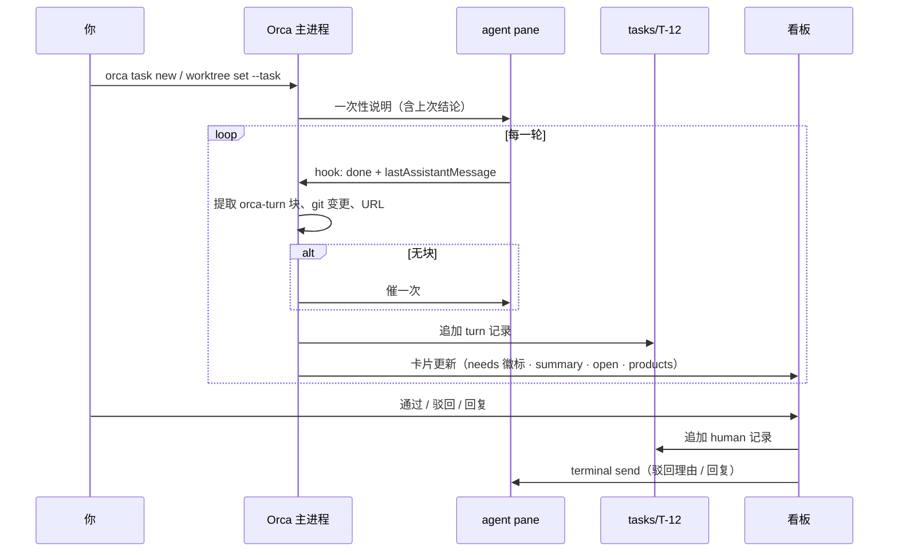

# 产品方案 v2：Orca 任务与介入看板

状态：草稿 v2（取代 v1《本地任务管理与介入队列》——v1 把负担放在了 agent 的自报仪式上，被否）
日期：2026-08-19
依据：通读 Orca 的 hook 层（`src/shared/agent-hook-listener.ts`、`src/shared/agent-status-types.ts`）、看板（`src/shared/dashboard-snapshot.ts`、`dashboard-popout/`）、worktree 元数据、CLI、goal-mode 驱动器；task-leader skill 全部脚本与契约

---

## 0. 这版和 v1 的根本区别

| | v1 | v2 |
| --- | --- | --- |
| 介入点从哪来 | agent 主动跑一条六字段命令 | **Orca hook 层已经在捕获的事件**（审批弹窗、提问、一轮结束），系统自动记录 |
| 任务记录由谁写 | agent | **Orca**；agent 只在每轮末尾多写一个小块，漏写系统会催一次 |
| 部分采用的价值 | 接近零（10 个不全进来就还得到处找） | 每个绑定的任务**独立**变厚，第一个就有收益 |
| 看板 | 新脚本输出文本 | **现有 dashboard 的卡片变厚**，不新开视图 |
| 与 task-leader | 把它改造成任务登记处 | **不动它**。它是 agent 交付的文档；任务记录是 Orca 观察到的过程 |

判断标准只有一条：**我自己会不会用**。v2 的答案是会——绑一个任务只要起个名字，之后什么都不用做，每一轮的结论和产物自动留下。

---

## 1. 一句话

给 Orca 加一个 **任务（task）** 对象：跨仓库、跨会话地把 worktree 绑在一起，自动记录每一轮 agent 的结论与产物；看板按"需要我什么"排队，卡片上直接看、直接下钻、直接回。

---

## 2. Orca 现在已经有什么（设计的地基）

这一节是 v2 成立的前提，全部有代码出处：

| 已有能力 | 位置 | 对本方案的意义 |
| --- | --- | --- |
| 每个 agent pane 的状态 `working / blocked / done`，来自各 agent 的原生 hook（Claude、Codex、Copilot、Gemini、Pi、OpenCode…） | `agent-hook-listener.ts` | **介入点已经被捕获**：`blocked` = 权限弹窗或 AskUserQuestion；`done` = 一轮结束 |
| `interactivePrompt`：AskUserQuestion 的完整 JSON，或权限请求的 `{approval}` | `agent-status-types.ts:130` | 决策/审批的**信息已经在**，只是没有被当成任务的一部分 |
| `lastAssistantMessage` / `lastCompletedAssistantMessage`：一轮结束时的最后一条消息 | 同上 | 验收信息的载体 |
| `stateHistory`（最近 20 个状态）、`prompt`（本轮用户输入）、`providerSession`（可 resume） | 同上 | 过程与续接 |
| 看板：attention / working / done / idle 四列，卡片带 `askSummary`、`unseen`、PR 状态、终端预览可直接输入 | `dashboard-snapshot.ts`、`AgentTerminalPreview.tsx` | **看板与回复框已经存在** |
| worktree：`displayName / comment / parentWorktreeId / isArchived / linkedPR / linkedLinearIssue / workspaceStatus` | `worktree/types.ts` | 任务要绑的对象 |
| CLI：`orca terminal send/read/wait`、`orca worktree set` | `src/cli/` | 回灌与绑定 |
| goal-mode：外部驱动器逐轮检查认领文件、跑验收、算空转与假完成，状态在 `~/.orca-goal/goals/*.json` | `goal-mode/cli/` | **不可伪造的宿主信号**来源；也证明"外部驱动 + 认领文件"这条路对任意 agent 都通 |

所以 v2 不发明介入点、不发明看板、不发明回灌，只补三样：**任务对象、每轮自动记录、需要我的排序**。

---

## 3. 三个新东西

### 3.1 任务对象

```
{profile-data}/tasks/T-12/
  task.json     # 元数据
  log.jsonl     # 每轮一条，Orca 自动追加；人的动作也追加
  notes.md      # 可选，人手写
```

`task.json`：

```json
{
  "id": "T-12",
  "title": "查 xxx 接口 5xx 突增",
  "type": "oncall",
  "priority": "p0",
  "status": "active",
  "createdAt": "2026-08-19T13:40:00+08:00",
  "worktrees": ["repoA::/Users/me/code/a", "repoB::/Users/me/code/b"],
  "links": [{ "title": "Meego 单", "url": "https://..." }],
  "journal": "/Users/me/code/a/docs/issue/xxx/journal.md"
}
```

规则：

- **一个 worktree 至多绑一个任务；一个任务可绑多个 worktree**（跨仓库）。文件夹工作区同样可绑（review 别人的 MR 时可能只是一个 clone 目录）。
- 建任务：`orca task new "查 5xx" --type oncall`，或在新建工作区弹窗里顺手填一个任务名（`NewWorkspaceComposerModal` 加一栏）。
- 绑定：`orca worktree set --task T-12`。绑定时 Orca 向该 worktree 的 agent 终端发一段一次性说明（见 3.2）；会话 resume 时再发一次。
- 归档：`orca task archive T-12`。目录留着，worktree 归档或删除**不影响**任务记录。
- `journal` 字段是给 task-leader 留的：开发需求有正式文档时链上，看板从卡片可以点过去。**task-leader 的契约、脚本、模板一个字不改。**

### 3.2 每轮自动记录

触发点：hook 层每次把某 pane 置为 `done`（非 `sessionBoundary`、非 `interrupted`）。若该 pane 所在 worktree 绑了任务，Orca 追加一条：

```json
{
  "ts": "2026-08-19T14:02:11+08:00",
  "kind": "turn",
  "worktreeId": "repoA::/Users/me/code/a",
  "paneKey": "tab1:leaf7",
  "agent": "claude",
  "prompt": "看一下这个 5xx 是不是缓存的问题",
  "message": "……最后一条 assistant 消息全文，上限 20k……",
  "turn": {
    "kind": "deliverable",
    "summary": "缓存失效未触发导致读到旧值",
    "products": ["evidence/argus-2026-08-19.md", "https://argus.example/trace/abc"],
    "open": ["D 服务的缓存路径未看", "对 C 的排除依据偏弱"],
    "confidence": { "level": "medium", "why": "复现只做了一次" }
  },
  "git": { "head": "abc123", "filesChanged": ["src/cache.ts"], "dirty": 1 },
  "links": ["https://argus.example/trace/abc"]
}
```

三部分来源不同：

| 字段 | 来源 | 可伪造 |
| --- | --- | --- |
| `prompt` `message` | hook 层已有 | — |
| `git` `links` | Orca 机械提取：本轮起止的 HEAD 与变更文件；消息里的 URL；worktree 已链的 PR | 否 |
| `turn` | agent 在最后一条消息末尾写的 `orca-turn` 块（见下） | 能，但格式固定、缺项显眼 |

**`orca-turn` 块**——agent 每轮末尾要写的唯一东西：

````markdown
```orca-turn
kind: deliverable        # deliverable | progress | question | blocked | fyi
summary: 一句话
products:
  - evidence/argus-2026-08-19.md
  - https://argus.example/trace/abc
open:
  - 未覆盖或未确定的点
confidence: medium — 复现只做了一次
```
````

五个字段，schema 对所有任务类型相同；**类型只改变说明文字**（绑定时发给 agent 的那段话）：

| type | 对 `summary / products / open / confidence` 的要求 |
| --- | --- |
| `oncall` | summary = 归因或当前最可能原因；products = 引用的日志/trace **片段文件** + 深链；open = 已排除但依据弱的 + 未覆盖的路径；confidence = 最可能错在哪 |
| `review` | summary = 问题数与最严重一条；products = 每条问题（位置 · 断言 · **触发场景**）；open = 扫了但未细看的范围；confidence = 最可能误报的几条 |
| `dev` | summary = 完成声明；products = PR / 变更范围；open = 未覆盖的验收项；confidence = 最不放心的改动 |
| `research` | summary = 结论；products = 材料链接；open = 未知项；confidence = 最不确定的判断 |
| `accept` | summary = PASS/FAIL 汇总；products = 引用的 TC 与证据；open = 未执行项 |

**漏写怎么办**：Orca 在 `done` 时检查块是否存在；缺失且 pane 绑了任务 → 通过 `terminal send` 催一次"请补 orca-turn 块"，**每轮至多一次**。再没有就记 `turn: null`，卡片标"未结构化"并直接显示原文——**绝不因为 agent 没写块就把它藏起来**。这是外部驱动的做法（goal-mode 已验证对任意 agent 都通），不装 hook、不受 Claude Stop-hook 轮数限制。

绑定时发给 agent 的一次性说明（示意）：

> 本会话已绑定 Orca 任务 T-12《查 xxx 接口 5xx 突增》（oncall）。每轮结束时，在最后一条消息末尾输出一个 `orca-turn` 块（格式见 `orca task brief T-12`）。上次结论：{最近一条 deliverable 的 summary}；未决：{open}。

最后一句是给 agent 的"切回来读什么"——跨天、跨会话续做时，它不用翻历史。

### 3.3 需要我的排序

看板增加一个"需要我"筛选，卡片来源与排序：

| 信号 | 队列项 | 排序 |
| --- | --- | --- |
| 宿主异常：goal-mode `stallCount ≥ 3` / `falseClaims` 超阈值；任务活跃但 pane 已不存在；连续 N 轮 `git.filesChanged` 为空且 kind 非 question；oncall 2h / 其他 24h 无新记录 | **异常** | 1 |
| pane `blocked` + `interactivePrompt.approval` | **审批** | 2 |
| pane `blocked` + `interactivePrompt.questions` | **决策** | 2 |
| `done` + `turn.kind = deliverable` | **验收** | 3，按任务 priority，同级按等待时长 |
| `done` + `turn.kind ∈ {question, blocked}` | **决策 / 受阻** | 3 |
| `done` + `turn: null`（未结构化） | **未分类**，显示原文 | 3 |
| `done` + `turn.kind ∈ {progress, fyi}` | 不进队列；fyi 折叠计数 | — |
| `working` | 不进 | — |

**正常推进的任务不出现在队列里**——这是"并行 10 个但视野里只有 3 个"的来源。未绑任务的 pane 行为与今天完全一样。

---

## 4. 卡片

在现有 dashboard 卡片上加内容，不换壳：

```
[验收] 查 xxx 接口 5xx 突增            oncall · P0 · repoA repoB · 等你 12 分钟
缓存失效未触发导致读到旧值                                   ← turn.summary
──────────────────────────────────────────────────────────
未覆盖 / 不确定：D 服务缓存路径未看 · 对 C 的排除依据偏弱      ← open
把握：medium — 复现只做了一次                                ← confidence
产物：evidence/argus-2026-08-19.md · argus.example/trace/abc  ← 可点
本轮改动：src/cache.ts (+12 −3)   HEAD abc123                ← git
[goal] turn 7 · 验收 12/12 · 空转 0                          ← 有 goal 时
──────────────────────────────────────────────────────────
展开原文 ▸                                                   ← message 全文
[验收通过] [驳回…] [回复…] [打开 journal] [打开终端] [打开 worktree]
```

四问对应：**进展**＝summary + git；**看什么**＝徽标；**看到什么程度**＝open + confidence + goal 信号；**怎么推进**＝动作栏。

声明与观测矛盾时红字置顶：`kind: deliverable` 但本轮 `filesChanged` 为空且 goal 验收未过 → "声称完成，但代码未变 / 验收未过"。

动作落到哪：

| 动作 | log.jsonl | 回灌 |
| --- | --- | --- |
| 验收通过 | `{kind: human, action: accept}` | 无 |
| 驳回（附理由） | `{kind: human, action: reject, reason}` | `terminal send` 理由原文 |
| 回复 | `{kind: human, action: reply, text}` | `terminal send` |
| 审批 | 聚焦到终端预览（各 agent 的权限交互不同，v1 不代按键） | — |
| 归档任务 | `task.status = archived` | — |

任务卡在多个 pane 时（跨仓库），每个 pane 一张卡，任务名相同，卡片可按任务分组折叠。

---

## 5. 下钻

| 从 | 到 |
| --- | --- |
| 产物条目 | 本地路径：内联预览（md / 图 / 日志）；URL：新开 |
| 展开原文 | 本轮 message 全文 |
| 打开 journal | task-leader 的 `journal.md`（有绑定时） |
| 打开终端 / worktree | 现有 reveal |
| 任务名 | 任务页：`task.json` + 全部记录时间线（每轮的 summary 一行，可展开），跨仓库、跨会话、跨天 |

外部系统一律不同步：**agent 引用过的片段内联，其余深链**。

---

## 6. 归档与找回

`log.jsonl` 里每轮的 `summary / open / products / message` 都在，worktree 没了它还在。

- `orca task list --archived`
- `orca task search "缓存 失效"`：跨任务全文搜 summary 与 message
- 任务页时间线就是这个任务的 journal——自动生成的，不需要 agent 维护

开发需求仍由 task-leader 维护正式文档（需求 / 决策 D-* / 测试）；两者关系：**agent 写交付物，Orca 记过程，人在两者之上做决定。** 任务页链到 journal，journal 不需要知道任务存在。

---

## 7. 数据流



---

## 8. 分期

| 期 | 交付 | 单独就有的价值 |
| --- | --- | --- |
| **1** | 任务对象 + 绑定 + `done` 时自动追加记录（message · git · links）+ `orca task new/list/show/archive` | 每个任务一份跨仓库、跨会话、**自动**的过程记录；会话关了结论还在；产物（改了哪些文件、提了哪些链接）不用翻 |
| **2** | `orca-turn` 块：绑定说明 + 提取 + 催一次；卡片加徽标 / summary / open / confidence / products；"需要我"筛选与排序 | 看板本体：到点信息齐、能下钻 |
| **3** | 异常信号（goal-mode / 无进展 / 陈旧 / pane 消失）；矛盾置顶；驳回回灌；任务页时间线；`task search` | 不可伪造的那一半 + 闭环 + 找回 |
| 4 | 新建工作区弹窗任务栏；任务 ↔ workspaceStatus 映射让侧栏颜色跟着走；task-leader journal 链接 | 顺手 |

1 期不需要 agent 做任何改变。2 期 agent 只多写一个块。

---

## 9. 代价与边界

- **agent 必须跑在 Orca 终端里。** Codex app、独立终端里的会话没有 hook，进不来。这是唯一硬性代价。
- 审批动作 v1 不代按键（各 agent 的权限 TUI 不同），只聚焦终端预览——预览里本来就能直接输入。
- `orca-turn` 靠说明 + 催一次，不是强制。漏写的轮次仍上榜（未分类），信息不丢，只是不结构化。
- 不做 tracker：没有标签、看板列、父子任务；`priority` 只用来排队。
- 不同步外部系统。

---

## 10. 待你定

| # | 问题 | 我的默认 |
| --- | --- | --- |
| Q1 | 催一次会不会烦？改成只在 `oncall / review` 类型催？ | 全类型催一次；agent 在同一会话里学得很快 |
| Q2 | 跨仓库任务是否需要"主 worktree"？ | 不需要，卡片按任务分组即可 |
| Q3 | 1 期先做 CLI 还是先做卡片？ | 先 CLI（`task show` 就能验证记录够不够用），卡片在 2 期 |
| Q4 | 记录保留 `message` 全文上限 20k 够不够？超出截尾并保留指针 | 20k |
