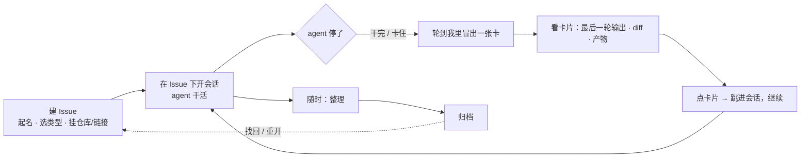

# 产品方案 v3：Issue 与"轮到我"

状态：产品层草稿（只写体验，不写实现）
日期：2026-08-19
取代：v1、v2

---

## 一句话

在 Orca 里建**本地 Issue**，把会话、关键文件、产物、归档、重启都挂在 Issue 下；dashboard 上多一个"**轮到我**"——agent 一停下来，我就在这里看到它最后一轮说了什么、改了什么，点一下跳进会话。

---

## 三个对象

| 对象 | 是什么 | 例子 |
| --- | --- | --- |
| **Issue** | 一件事的容器，本地的，不依赖 GitHub / Linear。有名字、类型、涉及的仓库和外部链接 | 「查 xxx 接口 5xx 突增」「批量图片后编辑」「review 张三的 MR !128」 |
| **会话** | 一个 agent 会话（Orca 终端里的）。**一个 Issue 下可以开多个会话**，跨仓库、跨天 | 同一个 Oncall：今天在 A 仓查日志的会话，明天在 B 仓复现的会话 |
| **产物** | 会话产出的东西：改动的关键文件与 diff、生成的报告/截图、提到的链接 | `src/cache.ts` 的 diff、`排障报告.md`、Argus trace 链接 |

**Issue 是入口**：找会话、找产物、看归档、重启会话，都从 Issue 进。

---

## 一天怎么过

1. **建 Issue**。起个名字，选个类型（Oncall / 需求 / 调研 / 验收 / MR review），挂上涉及的仓库和外部链接。十秒钟。
2. **在 Issue 下开会话**。新开会话时选它属于哪个 Issue；也可以从 Issue 页直接"开一个会话"。跨仓库的事就在不同仓库各开一个，都归这个 Issue。
3. **agent 停了，"轮到我"里出现一张卡**。干完也好、卡住也好、等我批也好——**停下来就出现**，不分类。
4. **看卡片**：agent **最后一轮**的输出，按 Orca chat 视图那样渲染（正文、diff、文件链接、产物），不是终端截屏。
5. **点卡片跳进会话**，该回的回、该批的批，跟今天点 dashboard 一样。卡片上不放按钮。
6. **随时整理**：我在 Issue 页点"整理"，agent 把这件事到目前为止的会话读一遍，起草"问题 / 结论 / 关键产物 / 未决与矛盾"，把过期的、前后不一致的、自相矛盾的标出来刷新掉；我改一改，确认。
7. **归档**：整理完，归档。会话关了、worktree 删了，Issue 和它的结论、产物、时间线都在。以后搜得到，也能重开。

---

## 三个界面（都在 dashboard 上迭代）

### 轮到我

- 只列**停下来的**会话：干完的、卡住的、等审批的、等回答的。正在跑的不出现。
- 按 Issue 分组；同一 Issue 下多个停了的会话各一张卡。
- 排序：停得越久越靠前；我没看过的高亮（沿用现在的 unseen）。
- 一张卡：
  - Issue 名 · 类型 · 仓库 · 停了多久
  - **最后一轮输出**（chat 渲染）
  - **本轮 diff / 关键文件**
  - **产物**（报告、截图、链接，可点）
  - 点整张卡 → 跳进这个会话

### Issue 页

- 头部：名字、类型、状态（进行中 / 已归档）、仓库、外部链接
- **会话列表**：每个会话一行——在哪个仓库、最后一轮说了什么、什么时候停的；点进去跳会话；**重启**（续上原会话，或以这个 Issue 的上下文开新会话）
- **产物**：这件事所有会话累计的关键文件、报告、链接
- **结论区**：最近一次"整理"的结果——问题 / 结论 / 关键产物 / 未决与矛盾；上面有"整理"按钮，每次整理生成新版，旧版可查
- **时间线**：每个会话每一轮的一句话摘要，按时间排
- 若这件事有 task-leader 的 journal（开发需求的正式文档），链在这里；不合并

### 归档与找回

- 归档的 Issue 从"轮到我"和进行中列表消失，进归档列表
- 搜索：按名字、按结论、按产物找
- 重开：归档的 Issue 可以重开，继续开会话

---

## 整理是什么

- **谁发起**：我，随时点，不限于归档前
- **谁来做**：agent。读这件事下所有会话的记录，起草四段——**问题**（到底在解决什么）、**结论**（现在的答案）、**关键产物**（哪几个文件/报告/链接是关键的）、**未决与矛盾**（还没定的、前后说法不一致的、已经过期的）
- **谁确认**：我。改完确认，成为这个 Issue 当前的"真话"
- **为什么需要它**：几十轮会话下来，早期的判断会被后期推翻、临时的结论会过期。不整理，归档的只是一堆日志；整理过，归档的是一份能直接用的答案

---

## 边界

- 只管在 Orca 里跑的 agent；Codex app、独立终端里的会话进不来
- 只管"轮到我"这一段：不做派活，不做 agent 之间的协作，不做优先级/标签/看板列
- 不同步 GitHub / Linear / Meego / Argus 的数据，只存链接
- 卡片上不做动作，动作都在会话里做
- 工作区看板（todo / in progress 那个）不动

---

## 待确认

| # | 问题 | 我的默认 |
| --- | --- | --- |
| Q1 | 没归到任何 Issue 的会话停了，出不出现在"轮到我"？ | 出现，标"未归属"，可以从卡上一键归到某个 Issue |
| Q2 | Issue 类型只影响什么？ | 只是个标签，用于分组和过滤；不同类型体验一样 |
| Q3 | "整理"的四段结构固定吗？ | 固定，agent 只填内容 |
