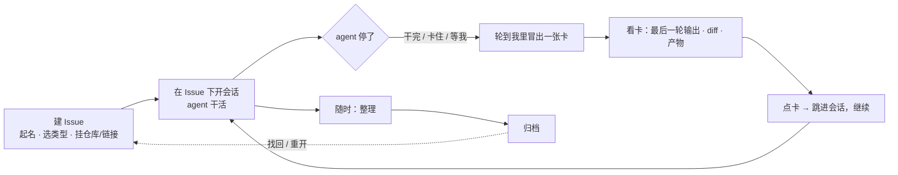

# 并行任务：Issue 与"轮到我"

产品方案（合并稿）
日期：2026-08-19
说明：本文合并此前的需求稿、v1、v2、v3，是唯一有效版本；历史稿在 `_历史稿/`，只作演进痕迹。Multica 调研全文在 `../multica-调研/`。

---

## 1. 问题

我同时在推大约 10 件事：查线上 Oncall、开发需求、调研技术方案、做验收、review 别人的 MR。它们分布在不同仓库，每件事背后是一个或几个 agent 在干活，**每一个产出都必须我亲自看**——Oncall 要看它查到了没有、查到什么程度、归因对不对；MR review 要看它给的结果里哪些是错的。

现在每次介入的路径是：意识到有事 → 找到会话 → 审批 → 再找它的产物 → 有些产物在别的软件里，还得打开去看。**每次介入都要重新把信息拼一遍。** 并行度越高，拼的次数越多，进度、决策点、后续推进、归档、分类、流转全部失控。

看板的意义就是这一句：**任何需要我介入的点，系统要给我；给我的时候信息要全；我要能下钻。**

## 2. 为什么在 Orca 上做，做成什么样

| 参考 | 拿来什么 |
| --- | --- |
| Multica | **一件事的记录（Issue）和一次运行分开**：Issue 跨多次运行、永不覆盖；运行结束不等于事情完成。所有上下文挂在同一个 Issue 上，Issue 页就是工作台 |
| Orca 现状 | dashboard 已经在捕获 agent 停下来（干完 / 等审批 / 等回答），已有可弹出的卡片和终端预览；native-chat 已能把 agent 输出渲染成正文 + diff + 文件链接；worktree 已有归档、外链、状态 |
| 你的判断 | 单位不是会话也不是仓库，是"一件事"；停下来就是轮到我，不用细分；卡上不放动作，点了跳进会话；归档是整理，不是存日志 |

所以不新建系统，**在 dashboard 上迭代**：加一个本地 Issue 对象，加一个"轮到我"视图，加一个"整理"。

## 3. 三个对象

| 对象 | 是什么 | 例子 |
| --- | --- | --- |
| **Issue** | 一件事的容器。本地的，不依赖 GitHub / Linear。有名字、类型、涉及的仓库、外部链接 | 「查 xxx 接口 5xx 突增」「批量图片后编辑」「review 张三的 MR !128」 |
| **会话** | 一个 agent 会话（Orca 终端里的）。**一个 Issue 下可开多个会话**，跨仓库、跨天 | 同一个 Oncall：今天在 A 仓查日志，明天在 B 仓复现 |
| **产物** | 会话产出的东西：改动的关键文件与 diff、生成的报告 / 截图、提到的链接 | `src/cache.ts` 的 diff、`排障报告.md`、Argus trace 链接 |

**Issue 是管理单元，不是标签。** 它下面的会话、目录（worktree / 文件夹工作区）、产物、结论、归档、重启，全部挂在 Issue 下管理：找会话、找产物、看结论、归档、重启会话，都从 Issue 进；归档 Issue 时它的目录一并归档，重开时一并恢复。

## 4. 一天怎么过

1. **建 Issue**：起名，选类型（Oncall / 需求 / 调研 / 验收 / MR review），挂仓库和外部链接。十秒钟。
2. **在 Issue 下开会话**：新开会话时选它属于哪个 Issue，或从 Issue 页直接"开一个会话"。跨仓库的事在各仓库各开一个，都归这个 Issue。
3. **agent 停了，"轮到我"出现一张卡**。干完、卡住、等审批、等回答——**停下来就出现**，不分类。
4. **看卡**：agent **最后一轮**的输出，按 native-chat 那样渲染（正文、diff、文件链接、产物），不是终端截屏。
5. **点卡跳进会话**，该回的回、该批的批。卡上不放按钮。
6. **随时整理**：在 Issue 页点"整理"，agent 读完这件事到目前为止的全部会话，起草"问题 / 结论 / 关键产物 / 未决与矛盾"，把过期的、前后不一致的、自相矛盾的标出来刷新；我改一改，确认。
7. **归档**：整理完归档。归档 Issue 时，它下面的会话记录留存、相关目录（worktree）一并归档；Issue 和它的结论、产物、时间线都在，搜得到，能重开，重开时目录一并恢复。

## 5. 三个界面

### 5.1 轮到我

- 只列**停下来的**会话。正在跑的不出现。
- 按 Issue 分组；同一 Issue 下多个停了的会话各一张卡。
- 排序：停得越久越靠前；没看过的高亮（沿用现在的 unseen）。
- 一张卡：

| 区块 | 内容 |
| --- | --- |
| 头 | Issue 名 · 类型 · 仓库 · 停了多久 |
| 正文 | **最后一轮输出**，chat 渲染 |
| 改动 | **本轮 diff / 关键文件**，可点开 |
| 产物 | 报告、截图、链接，可点 |
| 动作 | 点整张卡 → 跳进这个会话。没有别的按钮 |

### 5.2 Issue 页

| 区块 | 内容 |
| --- | --- |
| 头 | 名字、类型、状态（进行中 / 已归档）、仓库、外部链接 |
| 会话列表 | 这件事下的全部会话，每个一行：在哪个仓库、最后一轮说了什么、什么时候停的。点进去跳会话；**重启**：续上原会话，或以这个 Issue 的上下文开新会话 |
| 目录 | 这件事涉及的 worktree / 文件夹工作区，每个一行：仓库、路径、状态。从这里开新会话；归档 Issue 时一并归档，重开时一并恢复 |
| 产物 | 这件事所有会话累计的关键文件、报告、链接 |
| 结论区 | 最近一次"整理"的结果：问题 / 结论 / 关键产物 / 未决与矛盾。上有"整理"按钮；每次整理生成新版，旧版可查 |
| 时间线 | 每个会话每一轮的一句话摘要，按时间排 |
| 正式文档 | 开发需求若有 task-leader 的 journal，链在这里；不合并 |

### 5.3 归档与找回

- 归档的 Issue 从"轮到我"和进行中列表消失，进归档列表
- 归档 Issue 时：会话记录、结论、产物、时间线留存；相关目录（worktree）一并归档——目录归档跟着 Issue 走，不再单独操作
- 搜索：按名字、按结论、按产物找
- 归档的 Issue 可以重开，重开时目录一并恢复，继续开会话

## 6. 整理

| | |
| --- | --- |
| 谁发起 | 我，随时点，不限于归档前 |
| 谁来做 | agent。读这件事下所有会话的记录，起草固定四段：**问题**（到底在解决什么）、**结论**（现在的答案）、**关键产物**（哪几个文件 / 报告 / 链接是关键的）、**未决与矛盾**（没定的、前后说法不一致的、已经过期的） |
| 谁确认 | 我。改完确认，成为这个 Issue 当前的"真话" |
| 为什么 | 几十轮会话下来，早期判断会被推翻、临时结论会过期。不整理，归档的是一堆日志；整理过，归档的是能直接用的答案 |

## 7. 边界

- 只管在 Orca 里跑的 agent；Codex app、独立终端里的会话进不来
- 只管"轮到我"这一段：不做派活、不做 agent 之间协作、不做优先级 / 标签 / 看板列
- 不同步 GitHub / Linear / Meego / Argus 的数据，只存链接
- 卡上不做动作，动作都在会话里
- 工作区看板（todo / in progress 那个）不动
- task-leader 不动：它是 agent 交付的正式文档，Issue 是过程与结论的容器，两者链接不合并

## 8. 已定与已否

**已定**

- Issue 必建，是管理单元：会话、目录、产物、结论、归档、重启都挂在 Issue 下管；一个 Issue 下多会话、多目录；单位是"一件事"而不是会话或仓库
- Issue 类型只是标签（分组、过滤用），不改变体验；Issue 本身不是标签
- 停下来 = 轮到我，不细分类型
- 卡片 = 最后一轮 + diff + 产物；点卡跳会话
- 整理：我发起、agent 办、我确认、随时可做、四段固定
- dashboard 上迭代

**已否（别绕回去）**

- 让 agent 主动汇报"我需要你介入"（自报仪式，会被跳过；部分采用零价值）
- 四种介入的强分类和各自的必填字段
- 终端文本队列当看板
- 卡片上的通过 / 驳回 / 回复按钮
- 产品未定就写数据结构与流程

## 9. 待确认

| # | 问题 | 我的默认 |
| --- | --- | --- |
| Q1 | 没归到任何 Issue 的会话停了，出不出现在"轮到我"？ | 出现，标"未归属"，卡上一键归到某个 Issue |
| Q2 | 归档 Issue 时目录是直接归档，还是先问一下（比如还有未提交改动）？ | 有未提交改动或未合并分支时提示，否则直接归档 |
| Q3 | 整理的四段结构固定吗？ | 固定，agent 只填内容 |

## 附：后续实现可以站的地基（事实，不是设计）

| 已有 | 位置 | 与本方案的关系 |
| --- | --- | --- |
| agent 停下来已被捕获：`blocked`（权限弹窗 / AskUserQuestion）、`done`（一轮结束），并带最后一条消息与提问全文 | `src/shared/agent-hook-listener.ts`、`src/shared/agent-status-types.ts` | "轮到我"的触发与卡片正文来源 |
| dashboard 可弹出、有卡片、有 unseen、有终端预览 | `src/shared/dashboard-snapshot.ts`、`src/renderer/src/components/dashboard-popout/` | 迭代的落点 |
| native-chat 渲染器：正文、diff、文件链接、工具折叠 | `src/renderer/src/components/native-chat/` | 卡片正文的渲染方式 |
| worktree 元数据：显示名、外链（PR / Linear / 其他）、归档、父子 | `src/shared/worktree/types.ts` | 会话所在仓库、外链的来源 |
| CLI：`orca worktree set`、`orca terminal send/read/wait` | `src/cli/` | 绑定与重启的入口 |
| goal-mode：逐轮外部驱动、空转与假完成计数 | `goal-mode/` | 以后若要"矛盾置顶"可用；本方案不依赖 |
| task-leader：journal / REQ / D / TC | `~/.agents/skills/task-leader/` | Issue 页"正式文档"链接的目标 |
