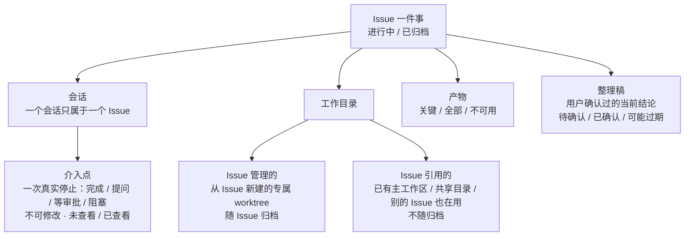

# 并行任务：Issue 与"轮到我"

产品方案 v5（评审后）
日期：2026-08-19
说明：唯一有效版本。吸收了一轮外部评审（GPT）——评审的核心判断是对的：v4 把"会话"当成了"轮到我"的队列项，队列会退化成越来越长的已停止会话列表；正确的队列项是**介入点**（一次真实的停止事件）。历史稿在 `_历史稿/`；Multica 调研在 `../multica-调研/`。

---

## 1. 问题

我同时在推大约 10 件事：查线上 Oncall、开发需求、调研技术方案、做验收、review 别人的 MR。它们分布在不同仓库，每件事背后是一个或几个 agent 在干活，**每一个产出都必须我亲自看**——Oncall 要看它查到了没有、查到什么程度、归因对不对；MR review 要看它给的结果里哪些是错的。

现在每次介入的路径是：意识到有事 → 找到会话 → 审批 → 再找它的产物 → 有些产物在别的软件里，还得打开去看。**每次介入都要重新把信息拼一遍。** 并行度越高，拼的次数越多，进度、决策点、后续推进、归档、分类、流转全部失控。

看板的意义就是这一句：**任何需要我介入的点，系统要给我；给我的时候信息要全；我要能下钻。**

## 2. 产品定义

> **Issue** 是一件工作的持久上下文；**"轮到我"** 是新产生、尚未看过的人工交接点队列；**Issue 页** 是会话、目录、产物和当前结论的工作台。

| 参考 | 拿来什么 |
| --- | --- |
| Multica | **长期事项（Issue）和一次执行分开**：一次运行完成不等于 Issue 完成；所有上下文挂在同一个 Issue 上 |
| Orca 现状 | 已能区分真实完成与会话边界；打开会话即确认其最新状态（unseen / ack）；native-chat 能把 agent 输出渲染成正文 + diff + 文件链接；worktree 有归档与清理生命周期 |
| 你的判断 | 单位是"一件事"不是会话或仓库；停下来就是轮到我；卡上不放动作，点了跳进会话；归档是整理，不是存日志；在 dashboard 上迭代 |
| Forge（多仓 workspace + 文档规范 CLI，已下线） | **吸收原则，不搬机制**：信息分层落点、快照语义、开场 brief、记录 lint 四条原则内化进 Issue；它的命令与目录不进入产品，用户只感知 Orca 和 Issue，见 §3.7 |

## 3. 产品模型

### 3.1 Issue

长期存在的管理单元。只有两个状态：**进行中 / 已归档**。不做 Todo / Doing / Review / Done——不要另一套项目管理系统。

有标题（唯一必填）、类型（文本标签，只用于分组筛选，不改变任何页面和流程，默认"未分类"）、仓库、外部链接。

**轻重两档**：默认 Issue 只有标题 + 类型 + 目录 + 会话，零文档负担；变成真正的开发需求时一键"升级为正式需求"（task-leader 骨架，journal 链回 Issue）。依据见观察文档——绝大多数执行不需要完整文档骨架，升级是少数路径。

### 3.2 会话

一次可继续或恢复的 agent 对话。

- 一个 Issue 多个会话（跨仓库、跨天）；**一个会话同一时间只属于一个 Issue**
- 换了工作主题就新开会话，不让一个会话横跨两个 Issue
- 绑错了可以整体迁到另一个 Issue，不复制两份历史
- **会话身份由 Orca 分配且稳定**，不随终端面板复用/销毁而变；provider 的 session id 只用于恢复，不是身份（它可缺失、可换 provider）。同一个面板里开新会话 = 新身份、新绑定，不继承旧会话的 Issue 归属

**数据归属（决策）**：Issue、介入点、整理稿都存在**Orca 客户端本地**（与工作区元数据同级），不存仓库、不存远程主机。介入点在停止那一刻把输出与附件快照采集进本地——所以 SSH 断开、远程主机不可达时，Issue 和已采集的介入点完好，只有远端目录里的原始文件标"不可达"。多客户端共享同一批 Issue 不在 v1 范围（Orca 本就是单用户桌面工具）。

### 3.3 介入点（队列项）

**一次真实的 agent 停止事件**：完成、提问、等审批、阻塞。这才是"轮到我"里的卡片。

- 同一会话先后产生多个介入点
- **一经产生不修改**：保留当时的输出、当时的变更快照、当时的产物
- 主队列只显示**未查看**的；看过退出主队列，但留在 Issue 时间线里
- 会话再次停止 → 新介入点 → 重新入队

**唯一新增的持久对象是"轮次记录"。** 每轮停止时固化一条：当时的输出、变更快照、产物、提问。时间线（§6.5）= 全部轮次按时序；介入点 = 停止型轮次 + 它自己的未读标记——**同一份数据的两个视图，不是两套存储**。它必须独立持久：有稳定身份，应用重启、远程断连都不丢，同一次停止不重复计数。与 Orca 现有"打开即已读"一致的只是交互习惯；数据上已读是轮次级的，不是终端面板级的（现状为何不够，见附录）。

### 3.4 工作目录

**默认形态：一个 Issue 绑一个普通 git 仓库的一个目录，零配置。** 不需要任何 workspace 概念——今天在 Orca 里怎么开 worktree / folder 工作区，就怎么绑。跨仓的事 = 给同一个 Issue 多绑几个目录，仅此而已；"多仓工作区"不是产品对象，Issue 的目录列表就是它。

| 关系 | 是什么 | 归档时 |
| --- | --- | --- |
| **Issue 管理的** | 从 Issue 里新建的专属 worktree（用 Orca 已有的创建能力，单仓多仓同一个动作） | 跟随 Issue 归档 |
| **Issue 引用的** | 已有主工作区、共享 folder workspace、别的 Issue 也在用的目录 | **不**自动归档 |

Oncall、MR review 常用已有目录，这条区分是为了归档一个 Issue 时不误伤别的工作。

**所有权规则**（防连带误伤——worktree 归档 7 天后会进清理候选）：一个目录最多有一个管理者 Issue；归档管理者时，若该目录仍被其他**进行中** Issue 引用，则目录**不**随归档，自动降为共享引用并在归档清单里说明。目录被清理的前提永远是"没有任何进行中 Issue 还在用它"。

### 3.5 产物

| 级别 | 来源 |
| --- | --- |
| **关键产物** | 最新已确认整理稿引用的，或我手动标的 |
| **全部产物** | 按会话、按介入点自动收集：变更文件、生成的报告/截图、提到的链接 |
| **不可用产物** | 路径已删、远程离线、外链失效——保留记录与来源，标明不可用 |

Orca 现有的 Artifact 模块是发布与分享链接（带过期时间），不是 Issue 的产物库；**产物记录和分享链接分开**。

### 3.6 整理稿

不是聊天摘要，是**我确认过的"当前真话"**。固定分段：目标 / 阶段 / 结论 / 下一步 / 阻塞 / 关键产物 / 未决与矛盾。写入语义：**同字段只留最新值、整段覆盖、禁止流水**——快照和流水必须分开，流水归时间线（§6.5），快照只有一份且永远是最新的。"阶段"是纯文本字段，只供人读，不驱动任何产品行为（不重新引入工作流状态）。

状态是**两条独立的轴**，不是一条：

| 轴 | 取值 | 含义 |
| --- | --- | --- |
| 审核 | 草稿 / 已确认 | 草稿 = agent 起草完等我改；已确认 = 我确认过 |
| 新鲜度 | 最新 / 已过期 | 已过期 = 该版本确认后又产生了新介入点，页面直接写"之后又有 N 次新产出" |

两轴分开才能同时存在"最后一份已确认结论（已过期）"和"正在等确认的新草稿"——旧真话在新草稿确认前不消失。

每个版本记录**覆盖到哪个介入点**。这就是"刷新过期、不一致和矛盾"的闭环：不是靠人记得，是系统标出来。

### 3.7 与 Forge 的关系：吸收原则，不搬机制

Forge 下线，融入 Orca。融入的方式**不是**把它的命令、目录名、文件搬进来——父仓 workspace、`STATE.md` / `DECISIONS.md` / `bugfree/`、`forge new / add / brief / doctor` 这些机制都不进入产品。进入产品的是它被 7 周真实使用验证过的四条**原则**，各自已长在 Issue 自己的对象上：

| 验证过的原则 | 在本产品里的形态 |
| --- | --- |
| 信息按生命周期分落点：一次性证据 ≠ 单件事的当前事实 ≠ 跨事复用的沉淀 | 证据挂轮次记录（§3.3）；单件事的当前事实是整理稿（§3.6）；跨事沉淀走归档分流（§7）——agent 列候选、我勾选并指定落点 |
| 快照与流水分开，快照同字段只留最新值、整段覆盖 | 整理稿的写入语义（§3.6）；时间线负责流水（§6.5） |
| 开工先拿快照，不翻历史 | "以 Issue 上下文新开会话"注入 Issue brief：整理稿 + 目录 git 状态 + 最近介入点（§6.2） |
| 记录会腐化，需要机械检查而不是靠人记得 | 归档前清单（§7）；整理稿的"可能过期"标记（§3.6） |

**存量迁移（完成后才下线，无长期过渡态）**：今天 dreamina 的 forge 指引仍在生效——"已下线"是迁移完成后的状态，不是现状。产品只定口径：子仓清单导入 Orca 已有的 repo 列表（"Issue 的可选目录"由 repo 列表持有，不需要 workspace 对象）；`tmp/tasks/` 等存量内容原地不动；`AGENTS.md` 的全部 forge 活引用（含 marker 区块之外的）替换为 Orca 等价指引并验证零残留后，`forge` CLI 才停用；中途失败整体回退，不留半迁移状态。迁移步骤与回滚细节**另立迁移文档**，不属于本产品方案。

## 4. "轮到我"怎么工作

**入队**：每次真实的完成 / 阻塞 / 等待都产生一个介入点。启动、恢复落到空闲、连接事件这类会话边界**不**入队——Orca 已能区分，产品上只定一句：真实产出才入队。

**出队**：

1. 点卡
2. Orca 打开并聚焦到准确的会话
3. 该介入点标为已查看，退出主队列
4. 会话仍停着，可在"已查看但仍停止"筛选里找到
5. 会话再次产生结果 → 新介入点 → 重新入队

交互习惯与 Orca 现有 unseen / ack 一致（打开即已读）；数据上已读记在介入点上，不是面板上（§3.3）。

**排序**：按 Issue 分组；Issue 组按**最早未查看介入点**的等待时长排，等得越久越靠前；组内按停止时间。默认只显示未查看。

**未归属**：只处理历史会话和异常导入，不是正常工作流——正常流程里新会话必须选 Issue。

**新会话流程（极轻，否则"Issue 必建"就成了仪式）**：

- 标题是唯一必填
- 类型默认"未分类"
- 当前工作目录自动挂上
- 当前能识别的外部 Issue / MR / PR 链接自动带入
- 选已有 Issue，或输入标题快速新建，都能直接启动会话

## 5. 卡片

卡片只干两件事：**判断值不值得现在打开**，**一步进入准确现场**。不承担审批、回复、驳回。

| 层 | 内容 | 规则 |
| --- | --- | --- |
| 上下文 | Issue 名 · 会话名 · 目录 · 执行主机 · 停止时间 | — |
| 原始交付 | agent 最后一条输出，Markdown / chat 渲染 | 默认限高，可展开；**不生成另一份 AI 摘要** |
| 客观附件 | 本轮变更快照、文件、报告、截图、外部链接 | **本轮 diff 是停止时保存的快照**，不是稍后变化过的当前工作区 diff；**没采集到要显式写"未采集"**，不能显示为空让人以为没变更 |

"关键文件"不全自动判断：卡片展示本轮变更与引用的文件；Issue 页累计候选；整理稿引用的才升为关键产物。

点整张卡 → 跳会话。

## 6. Issue 页

按"先拿到当前答案，再下钻过程"组织：

### 6.1 当前结论

按 §3.6 的分段展示最新**已确认**整理稿（目标 / 阶段 / 结论 / 下一步 / 阻塞 / 关键产物 / 未决与矛盾），并标注：覆盖至哪个介入点、之后是否又有新产出（新鲜度轴）；存在未确认的新草稿时并列提示，不覆盖已确认版。

没有整理稿就写"尚未整理"，**不**临时生成一段未经确认的摘要冒充结论。"整理"按钮在这里。

### 6.2 会话与介入

每个会话一行：运行中 / 已停止 / 不可用 · 所在目录与主机 · 最新介入点 · 最近活动时间，以及两个动作：

- **继续会话**：恢复同一个 provider 会话
- **新开会话**：以 Issue 当前整理稿为上下文重新开始

Orca 的 AI Vault 能恢复很多 provider 会话，但零轮次、记录丢失、目录不匹配时恢复会被禁用——**不承诺所有会话都能继续**，不能继续时给"新开会话"。

### 6.3 工作目录

按 3.4 的两类分列，每个目录标明：Issue 管理 / Issue 引用、仓库、路径、主机、状态。从这里新开会话。

### 6.4 产物

按 3.5 的三级分列。

### 6.5 时间线

只记不可变事实：用户输入、agent 最终输出、当时的 diff / 文件 / 链接、查看时间、整理稿版本、归档与重开事件。

**不**每轮自动生成一句话摘要——那是另一层不可信信息，而我本来就是因为不完全信任 agent 的结论才需要验收。条目预览用原始输出的截断，不用生成的摘要；高层总结只由"整理"产生并经我确认。

### 6.6 正式文档

开发需求若有 task-leader 的 journal，链在这里；不合并。

## 7. 归档与重开

> 归档 Issue 是冻结并移出当前工作视野，**不等于删除会话、目录或产物**。

**归档前给一份清单**（不卡流程，把结果说清楚）：

- 最新整理稿是否覆盖了所有介入点
- 是否还有未查看的介入点
- 是否还有运行中的会话
- 哪些目录会跟随归档；哪些是共享引用**或仍被其他进行中 Issue 引用**、不归档（§3.4 所有权规则）
- 哪些远程目录当前无法确认状态

**归档分流（跨事沉淀）**：整理时 agent 除起草整理稿外，额外列出"值得留在这个 Issue 之外"的候选——可复用的排查方法、永久的工程取舍。我勾选要沉淀的，并**指定写到哪**（一个文件路径，默认记住上次的选择），agent 执行写入；不勾选就什么都不写。Orca 不猜测 workspace 的目录约定，落点永远由我指定。

主操作"先整理再归档"，保留"直接归档"。

**重开**：

- Issue 恢复为进行中
- 仍然存在的专属目录恢复；已被资源清理删除的标"不可用"，**不承诺复原**——Orca 里归档的 worktree 七天后就进入清理候选
- 原会话可恢复则给"继续会话"；不能则用最新确认整理稿"新开会话"

三个词分开用：**继续会话**（恢复 provider 会话）/ **新开会话**（用 Issue 上下文重开）/ **重开 Issue**（从归档恢复）。

## 8. 三个入口（都在 dashboard 上）

| 入口 | 回答 |
| --- | --- |
| **轮到我** | 刚刚有哪些新产出需要我看 |
| **Issues** | 我现在同时在推进哪些事——全都在跑时"轮到我"可能是空的，十件事仍然存在 |
| **已归档** | 过去的问题、结论、产物在哪里 |

Issue 页是从 Issues / 已归档 / 卡片点进去的详情。类型只做文本标签和筛选，不用颜色表达状态。

**与现有 Activity 页的关系**：Orca 已有一个按终端面板聚合的 Activity 原型页（未读筛选、分组、标记已读、终端下钻）——"轮到我"就是它的演进，**接管它的"未读 / 需要我"职责**。全产品只允许一套已读语义、一个队列：启用时把现有面板级未读一次性映射为该面板最新介入点的未读；Activity 页保留还是移除是实现期决定，但不得再维护第二套已读。

## 9. 边界

- 只管在 Orca 里跑的 agent；Codex app、独立终端里的会话进不来
- 只管"轮到我"这一段：不做派活、不做 agent 之间协作、不做优先级 / 看板列
- 不同步 GitHub / Linear / Meego / Argus 的数据，只存链接
- 卡上不做动作，动作都在会话里
- 工作区看板（todo / in progress 那个）不动
- task-leader 不动：它是 agent 交付的正式文档，Issue 是过程与结论的容器，两者链接不合并

## 10. 产品决策（已定，不再开放）

| 决策 | 结论 |
| --- | --- |
| 队列项 | 介入点（停止事件），不是会话 |
| 持久对象 | 只新增"轮次记录"一个：介入点与时间线是它的两个视图；已读是轮次级 |
| 数据归属 | Issue / 轮次记录 / 整理稿存 Orca 客户端本地；停止时快照采集进本地，远程离线不丢；多客户端共享不在 v1 |
| 会话身份 | Orca 分配且稳定；provider session id 只用于恢复；同一面板开新会话 = 新身份、新归属 |
| 目录所有权 | 一个目录至多一个管理者 Issue；仍被其他进行中 Issue 引用时不随归档，自动降为共享引用 |
| 与 Activity | "轮到我"接管其未读职责；一套已读语义、一个队列；存量面板级未读映射为最新介入点未读 |
| 归档分流 | agent 列沉淀候选，我勾选并指定落点；不勾不写 |
| Issue 状态 | 进行中 / 已归档，没有别的 |
| 会话归属 | 一个会话同时只属于一个 Issue；可迁移不可复制 |
| Issue 必建 | 是；但创建只要标题，目录和外链自动带入 |
| 未归属 | 只给历史会话和异常导入 |
| 类型 | 文本标签，不改行为、不上色 |
| 卡片 | 最后一条原始输出 + 停止时快照的变更与产物；不做 AI 摘要；未采集显式标注 |
| 卡片动作 | 只有"点卡跳会话" |
| 目录归档 | Issue 管理的跟随归档；Issue 引用的不归档 |
| 目录恢复 | 仍存在的恢复；被清理的标不可用，不承诺复原 |
| 会话恢复 | 能继续则继续，不能则用整理稿新开；不承诺全部可恢复 |
| 整理稿 | 我发起、agent 起草、我确认；固定分段、同字段最新值、整段覆盖；审核（草稿/已确认）与新鲜度（最新/已过期）两条独立轴；记录覆盖到哪个介入点 |
| Forge | 吸收原则（信息分层、快照语义、brief、lint），不搬机制（workspace 概念、STATE/DECISIONS 文件、forge 命令都不进产品）；存量迁移完成并验证零 forge 残留后 CLI 才下线，无长期过渡态；迁移方案另立 |
| 目录默认形态 | 普通单 git 仓库零配置开箱即用；跨仓 = Issue 多绑几个目录，不存在"workspace"产品概念 |
| Issue 轻重两档 | 默认轻 Issue（标题 + 证据目录 + 会话）；"升级为正式需求"才建 task-leader 骨架 |
| 时间线 | 不可变事实；不自动生成摘要 |
| 产物 | 关键 / 全部 / 不可用三级；与分享链接分开 |

## 11. MVP 完成标准

第一版算可用，要同时满足：

- 普通单 git 仓库零配置可用，不要求任何 workspace 结构
- 新会话能快速选择或新建 Issue
- 一个会话只归属一个 Issue
- 每次真实停止生成一个独立介入点
- 点击查看后退出主队列；再次停止重新进入
- 卡片能展示停止时的最后输出
- diff、文件、产物有明确来源和"未采集"状态
- Issue 页能找到全部会话、目录和介入历史
- 整理稿有版本、确认和过期状态
- 专属目录与共享目录的归档规则不同
- SSH / 远程离线不导致 Issue 和已采集介入点消失
- 归档一个 Issue 不影响其他活跃 Issue
- 存量 Forge workspace（如 dreamina）完成一次性迁移后可用：repo 清单入 Orca、`tmp/tasks/` 原地不动、AGENTS 指引零 forge 残留（验证通过后 `forge` 才下线）
- 只有一套未读：启用后现有 Activity / 面板级未读被映射为介入点未读，不存在两个队列

## 附：后续实现可以站的地基（事实，不是设计）

| 已有 | 位置 | 与本方案的关系 |
| --- | --- | --- |
| agent 停下来已被捕获：`blocked`（权限弹窗 / AskUserQuestion）、`done`（一轮结束），带最后一条消息与提问全文；会话边界有 `sessionBoundary` 标记 | `src/shared/agent-hook-listener.ts`、`src/shared/agent-status-types.ts` | 介入点的来源与"真实产出才入队"的依据 |
| dashboard 可弹出、有卡片、有 unseen / ack（打开即确认）——但 ack 是**面板级**单时间戳 | `src/shared/dashboard-snapshot.ts`、`dashboard-popout/AgentKanbanBoard.tsx` | 交互习惯沿用；数据模型不够用，见下两行 |
| 运行态历史的局限：状态历史每面板最多 20 条且**不含输出**；"最后一条输出"每面板只有最新一份 | `src/shared/agent-status-types.ts` | "轮次记录必须新建持久存储"的依据（§3.3） |
| 已有 Activity 原型页：按面板聚合、未读筛选、分组、标记已读、终端下钻 | `src/renderer/src/components/activity/ActivityPrototypePage.tsx` | "轮到我"的前身；未读职责被接管（§8） |
| native-chat 渲染器：正文、diff、文件链接、工具折叠 | `src/renderer/src/components/native-chat/` | 卡片"原始交付"的渲染方式 |
| AI Vault：provider 会话发现与恢复；零轮次 / 记录丢失 / 目录不匹配时禁用 | `src/shared/ai-vault-types.ts` | "继续会话"的能力边界 |
| worktree 归档 7 天进入清理候选 | `src/shared/workspace-cleanup.ts` | "不承诺目录复原"的依据 |
| worktree 元数据：显示名、外链（PR / Linear / 其他）、归档、父子 | `src/shared/worktree/types.ts` | 目录与外链的来源 |
| Artifact：发布与分享链接，带 `expiresAt` | `src/shared/artifacts.ts` | 与产物记录分开的依据 |
| CLI：`orca worktree set`、`orca terminal send/read/wait` | `src/cli/` | 绑定与重启的入口 |
| task-leader：journal / REQ / D / TC | `~/.agents/skills/task-leader/` | Issue 页"正式文档"链接的目标 |
