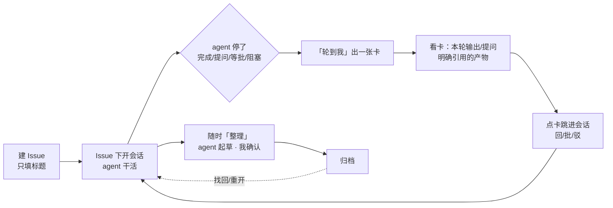
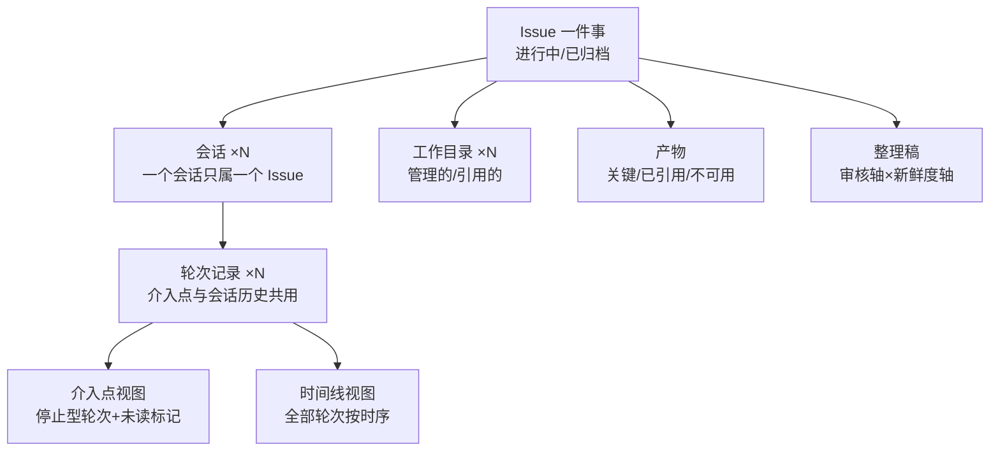

# 并行任务管理：Issue 与"轮到我"

产品方案 · 2026-08-21 · 唯一有效文档（演进过程在 `_历史稿/`，dreamina 工作历史与 Forge 的调研证据也在其中）

---

## 1. 设计目标

### 1.1 问题

我同时在推大约 10 件事：查线上 Oncall、开发需求、调研技术方案、做验收、review 别人的 MR。它们分布在不同仓库，每件事背后是一个或几个 agent 在干活，每一个产出都必须我亲自验收。现在每次介入的路径是：意识到有事 → 找到会话 → 审批 → 再找产物 → 有些产物还要打开第三方软件看。**每次介入都要重新把信息拼一遍**；会话关掉，结论就丢了。并行度越高，进度、决策点、后续推进、归档、分类、流转越失控。

### 1.2 目标

1. **介入点系统给我**：任何需要我看、批、答、验的点，主动出现在一个队列里，不用我去找。
2. **到点信息齐、可下钻**：卡片上有做判断所需的一切；要深看，一步到达现场或证据。
3. **一件事有持久的家**：跨仓库、跨会话、跨天的过程与结论挂在同一个 Issue 上，随时切回、最终归档成能复用的答案。

### 1.3 非目标

- 不做项目管理系统：无 Todo/Doing/Done 看板列、无优先级体系、无甘特；Issue 层级最多三级且**零联动**，不做 stage 闸门 / 状态汇总 / 进度上卷 / 依赖编排
- 不做派活和 agent 间协作，只管"轮到我"这一段
- 不同步 GitHub / Linear / Meego / Argus 数据，只存链接
- 只覆盖 Orca 里跑的 agent；Codex app、独立终端进不来
- 卡片上不做审批/回复/驳回动作，动作都在会话里做

### 1.4 已否决的方向（防止绕回去，标注否决来源）

- **用户否决**：给卡片附覆盖不全的变更快照（"不全的 diff 和不给有什么区别"）；启动会话强制先选 Issue（"我没有说必须要建 issue"）
- **设计/评审否决**：让 agent 主动汇报"需要介入"（自报仪式必被跳过）；介入强分类与各类必填字段；终端文本队列当看板；把会话当队列项（退化成永不清空的停止列表）；每轮自动生成 AI 摘要（第二层不可信信息）；照搬 Forge 的命令与目录机制；"workspace"作为产品概念；整理稿沿用 STATE 词表

---

## 2. 用户动线

### 2.1 主动线

1. **建 Issue**：标题是唯一必填；类型默认"未分类"，当前目录自动挂上，能识别的 MR/PR/外部链接自动带入。十秒钟。
2. **开会话**：Issue 内启动自动绑定；交互式入口（Dashboard 启动、Quick Launch、work item）**内联建议、不强制**——默认最近/当前 Issue、输入标题即建、也可跳过；无交互机会的路径（automation、orchestration、会话恢复）静默跳过。跳过的会话落"未归属"，功能完整（照进轮到我、有时间线），只是不参与 Issue 级的整理/归档/找回，随时一键归入——**归属的动力来自价值，不来自门禁**。跨仓库就在各目录各开一个，都归同一 Issue。
3. **agent 停了**：完成、提问、等审批、阻塞——停下来就在"轮到我"出一张卡，不分类。
4. **看卡**：agent 本轮的原始输出或待答问题（chat 渲染）+ 它明确引用的产物。判断值不值得现在处理；要核实改动，点进现场看实时 diff。
5. **点卡**：跳进准确的会话现场，该回的回、该批的批。点卡只标**已读**；完成型介入点已读即出队，**等待型（提问/等审批/阻塞）被解除前不出队**——agent 回到工作中、产生下一条记录或会话明确结束才算解除。看过一眼不等于办完。
6. **整理**（随时）：我点"整理"，agent 通读该 Issue 全部会话，起草当前结论快照并标出过期与矛盾，我改完确认。
7. **归档**：看一眼归档清单（未读介入点、运行中会话、目录去向、沉淀候选），归档。之后可搜索、可重开。

### 2.2 两条典型分支

- **Oncall 被打断后切回**：从 Issues 列表点开该 Issue → 读"当前结论"（整理稿）而不是翻 scrollback → "继续会话"或"以 Issue 上下文新开会话"（注入整理稿 + 各目录现场状态 + 最近介入点）。
- **同类问题再现**：已归档里按名字/结论/产物搜索 → 打开旧 Issue 看当时的归因路径与结论 → 需要就"重开 Issue"继续。

---

## 3. 产品逻辑

### 3.1 对象模型

| 对象 | 定义 | 关键规则 |
| --- | --- | --- |
| **Issue** | 一件事的持久容器（对内命名 **Orca Issue**，与既有 `linkedIssue`＝GitHub issue 编号严格区分，UI 首现处标注）。标题必填；类型是纯文本标签（不改行为、不上色）；只有进行中/已归档两个状态 | 默认轻档只有标题+类型+目录+会话；真正的开发需求一键"升级为正式需求"（task-leader 骨架，journal 链回）。依据：dreamina 7 周 313 个任务目录仅 2 个需要完整文档骨架。**可选指定一个父 Issue，层级最多三级**（大事 > 子事 > 孙事，如「画布 Agent 一期 > CloudAgent SDK > MR 1522 review」；已在第三级的不能再挂子）。**每级同构**：都是完整的 Issue，能挂会话/目录/产物、有自己的整理稿、独立归档。**零状态联动**——归档父不动后代、后代全归档不自动归档父；整理父时 agent 可读直接子的已确认整理稿作为输入，结论逐级上卷靠整理而非机制 |
| **会话** | 一次可继续/恢复的 agent 对话 | 身份是**新增的持久 Orca 会话 id**——现状 paneKey 是 UI 面板位置、provider session id 可缺失可更换，都当不了身份。稳定性契约：同一面板开新会话=新 id；睡眠/恢复、跨面板恢复、迁移 Issue、主机重连=同 id（与 paneKey/provider id/transcript 的映射细节留技术方案）。绑错可整体迁移、不复制历史。**范围**：只有独立会话/面板的 agent 才建介入点，in-process subagent 折叠进父会话（现状已抑制子完成覆盖父状态） |
| **轮次记录** | 每次真实停止固化一条：用户输入、agent 最终输出（完成型）或待答问题（等待型，轮中间卡住时尚无最终输出），以及正文中明确引用的文件/链接。**一轮可产生多条**——若干次提问/等审批 + 至多一条完成。介入点与会话历史共用这一对象，不另建 `InterventionRecord` | **先临时后定稿**：停止时先以 hook/scrape 内容落临时版（运行态预览有 8KB 级上限），同一轮身份可被 transcript **幂等补全**（沿用现有 transcript > hook > scrape 优先级），到达 provider 生命周期边界或超时才定稿；定稿后正文不可覆盖，仍可附加"事后发现的缺失/失效"状态。每个正文字段带 `完整 / 已截断 / 未采集`，不把预览冒充全文。已读（`readAt`）与**解除**是两回事：等待型在解除事件前始终是待办。重启/断连不丢已落盘内容，同一次停止不重复计数 |
| **工作目录** | Issue 绑的 Orca 工作目标：Git worktree 或 folder workspace，本地或 SSH；默认自动挂当前目录，跨仓/跨主机就多绑几个 | 管理的（Issue 创建的专属 Git worktree，可随归档）/ 引用的（既有 worktree 或 folder workspace，不随归档删除）。**生命周期 owner 与引用分开记**：owner 恒为创建它的 Issue、负责最终清理，引用方只是名单；被其他进行中 Issue 引用时仅**延后清理**，不换 owner。绑定按 执行主机 + 工作区类型 + 工作区 id + 实例 id 识别，路径复用不串号 |
| **产物** | 关键（整理稿引用或手标）/ 已引用（轮次正文明确提及）/ 不可用（路径删、离线、外链失效，保留记录） | 不承诺自动找全 agent 改过或生成的文件；与 Orca 的公开分享链接（artifact，带过期）分开；支持"远端文档+版本号"形态（飞书同步类任务） |
| **整理稿** | 我确认过的"当前真话"。固定分段：**问题 / 结论 / 关键产物 / 未决与矛盾 / 下一步**（每段都可溯源用户原话："整理问题、结论""关键文件产物""过期的、不一致的、矛盾的刷新""怎么继续推进"；不用 Forge STATE 的词表——历史定案已否决，此前正文误用） | 同字段只留最新值、整段覆盖、禁流水（流水归时间线）；两条独立轴：审核（草稿/已确认）×新鲜度（最新/已过期）；每版记录**覆盖时刻**（多会话下轮次记录无全序，用时间戳做水位），此后出现新轮次记录即标过期 |

### 3.2 队列规则（轮到我）

| 规则 | 内容 |
| --- | --- |
| 入队 | 每次真实停止（完成/提问/等审批/阻塞）生成一个介入点。启动、恢复落空闲、连接事件等会话边界**不**入队 |
| 出队 | 点卡 → 打开并聚焦准确会话 → 标已读。**完成型**已读即出队；**等待型**已读只降亮，解除事件（agent 回到工作中 / 产生下一条记录 / 会话明确结束）才出队——待办不因看过一眼而消失。已出队的在"已查看"筛选可找回；再次停止 → 新介入点入队 |
| 排序 | 按 Issue 分组；组间按最早未读介入点等待时长（久者前）；组内按停止时间；默认只显示未读 |
| 未归属 | 合法状态：任何入口跳过选择、自动化路径、历史会话与异常导入都落这里；队列单独成组、可一键归入；其介入点功能完整，只是不参与 Issue 级整理/归档/找回 |
| 归组提示 | 新建时与近期任务共享前缀/MR 号/logid → 提示归入已有 Issue（dreamina 历史里同一件事拆多个目录是常态） |

### 3.3 数据归属

Issue、轮次记录、整理稿存 **Orca 客户端本地**（与工作区元数据同级），不存仓库、不存远程主机。停止事件到达时，Orca 把该轮可获得的用户输入、最终输出、待答问题和明确引用写入轮次记录；完整性状态与正文一起落盘。SSH 断开、远端不可达时，Issue 与已落盘内容仍可读；未完整采集的正文和失效的远端路径分别标"已截断/未采集"与"不可达"。多客户端共享不在 v1。

**删除与保留（用户可见语义）**：支持显式**永久删除**——整个 Issue，或单条含敏感内容的轮次；磁盘占用可控，超限先压最旧全文、保留元信息并如实标注；transcript 被删后已复制的正文保留、标注来源已失；支持导出（含产物引用清单）。归档≠删除，但"只归档、永不删除"不成立。存储放哪、怎么放是技术方案的事（实现约束见附录）。

### 3.4 与 Forge 的关系：吸收原则，不搬机制

Forge 融入 Orca，用户此后只感知 Orca 和 Issue。它的命令（new/add/brief/doctor）、文件（STATE/DECISIONS/bugfree）、workspace 概念都**不进产品**；进产品的是四条被 7 周真实使用验证的原则：

| 原则 | 落点 |
| --- | --- |
| 信息按生命周期分落点 | 证据挂轮次记录；当前事实是整理稿；跨事沉淀走归档分流 |
| 当前结论与流水分开、同字段只留最新值 | 整理稿写入语义；流水归时间线 |
| 开工先拿当前结论不翻历史 | Issue brief（§4.6） |
| 记录会腐化、要机械检查 | 归档清单；整理稿过期标记 |

**存量迁移（完成后才下线，无长期过渡态）**：子仓清单导入 Orca 已有 repo 列表；`tmp/tasks/` 等存量内容原地不动；AGENTS.md 全部 forge 活引用（含 marker 外）替换为 Orca 等价指引并验证零残留后，`forge` CLI 才停用；失败整体回退。迁移步骤与回滚另立迁移文档。

---

## 4. 模块细节

### 4.1 轮到我（队列视图）

**保留唯一的 Agent Dashboard 入口**，不出现第二个仪表盘。内部一级视图：**轮到我 / Agents / Issues**——轮到我列待办介入点（按 §3.2）；**Agents 原样保留**现有 Board / Map / 搜索过滤 / 终端预览 / 启动 agent / 休眠 workspace；Issues 列全部进行中 Issue（轮到我可能为空但十件事仍在），**已归档是 Issues 内的筛选**，不占顶级位置（渐进披露）。

**与现有 Activity 页的关系**：轮到我是 Activity 原型页（按面板聚合、未读筛选、标已读、终端下钻）的演进，**接管其未读职责**。全产品一套已读语义、一个队列：启用时为处于停止态的存量面板各合成一条初始轮次记录（内容取当前可得的运行态预览，完整性标"已截断"），面板级未读映射到它上面；Activity 页去留是实现期决定，但不得再维护第二套已读。

### 4.2 卡片

只干两件事：判断值不值得现在打开；一步进入现场。

| 层 | 内容 | 规则 |
| --- | --- | --- |
| 上下文 | Issue 名（有层级时显示完整路径，如 A / B / C）· 会话名 · 目录 · 执行主机 · 停止时长 | — |
| 原始交付 | 本轮最终输出或待答问题，Markdown/chat 渲染 | 默认限高可展开；不生成 AI 摘要；正文若不是完整采集，紧邻内容标"已截断/未采集" |
| 附件 | agent 在本轮正文中明确引用的文件、报告、截图、外链 | 便利跳转、不承诺穷尽；路径不存在或远端离线时标"不可达" |

**不做变更快照**：多仓 workspace、gitignore、仓库外改动让任何 git 快照都注定不全，而一个显示"无变更"的不全快照会诱导漏看——负价值，不如不给。"改了什么"由 agent 的原始输出承载；核实入口是现场（右侧 SourceControl 即实时 diff、PR 链接即评审视图），卡片不夹一层残缺的中间态。

关键产物不由系统猜全：卡片展示 agent 明确引用的文件与链接；Issue 页累计这些候选；整理稿引用或人工标记的才升"关键产物"。点整卡跳会话，无其他按钮。

### 4.3 Issue 页

按"先拿当前答案，再下钻过程"排布：

| 区块 | 内容 |
| --- | --- |
| 当前结论 | 最新**已确认**整理稿（按 §3.1 分段），标注覆盖至何时、之后有几条新轮次记录；有未确认新草稿则并列提示，不覆盖已确认版；没有整理稿写"尚未整理"，不用临时摘要冒充 |
| 会话与介入 | 每会话一行：运行中/已停止/不可用 · 目录与主机 · 最新介入点 · 最近活动；动作：**继续会话**（恢复 provider 会话；AI Vault 有禁用条件，不承诺全部可续）/ **新开会话**（注入 Issue brief） |
| 子 Issue | 有子时列出：每子一行（状态 + 最新已确认结论一句 + 有孙时标数量）；从这里新建子 Issue（最多三级、零联动，§3.1）。Issues 列表按树形展开/折叠 |
| 工作目录 | 管理的/引用的分列：类型（Git worktree / folder workspace）、路径、主机、状态；都能从这里开会话，只有 Git 仓目标提供"新建 worktree" |
| 产物 | 关键 / 已引用 / 不可用三级 |
| 时间线 | 轮次记录与 Issue 事件按时序：用户输入、agent 最终输出、待答问题、引用的文件/链接、查看时间、整理稿版本、归档重开事件。正文不可变、不生成摘要，预览用原文截断并保留完整性状态 |
| 正式文档 | 升级过的 Issue 链 task-leader journal；不合并 |

### 4.4 归档与重开

归档 = **退出活跃视野**（不叫"冻结"——会话可以继续跑），不删除会话、目录、产物；要删除走 §3.3 的显式删除。

归档前清单（说清结果，不卡流程；主操作"先整理再归档"，保留"直接归档"）：整理稿是否覆盖全部介入点；有无未读介入点；有无运行中会话；是否还有进行中的后代 Issue（仅提示，不阻止、不联动）；哪些专属 Git worktree 随归档、哪些目录因共享/属于 folder workspace/被其他进行中 Issue 引用而不随（§3.1 所有权规则）；哪些远端目录状态未知。

**归档不终止会话，新事件自动重开**：运行中会话继续跑；它再产生介入点时 Issue **自动重开**（回到进行中）并正常入队，卡片标注"自动重开"——队列里永远只有进行中的 Issue，也不静默丢失。归档前清单提示运行中会话，接受自动重开还是先停会话由我选。

**归档分流（跨事沉淀）**：整理时 agent 额外列出"值得留在 Issue 之外"的候选（可复用方法、永久取舍）；我勾选并**指定写到哪**（默认记住上次路径），agent 写入；不勾不写。Orca 不猜 workspace 的目录约定。

重开：Issue 恢复进行中；仍存在的专属目录恢复，被清理的专属 Git worktree 标不可用（归档 7 天进清理候选，**不承诺复原**）；引用目录与 folder workspace 只重查可达性。会话能续则续，否则以整理稿新开。三个词分开：继续会话 / 新开会话 / 重开 Issue。

### 4.5 建 Issue 与开会话

创建极轻：标题必填，其余全自动（类型默认未分类、当前 Git worktree 或 folder workspace 自动挂、外链自动识别）。入口矩阵：**Issue 内启动**＝自动绑定；**Dashboard / Quick Launch / work item**＝内联建议（默认最近/当前 Issue，输入标题即建，可跳过）；**automation / orchestration / 会话恢复**＝零交互。跳过即落未归属，随时归入；任何入口都不因选 Issue 打断启动流。

### 4.6 整理与 Issue brief

整理：我发起（随时）→ 整理基于**已采集记录**（由 Orca 提供给整理 agent，不假设任何 agent 能自行读到跨主机数据）；父 Issue 附带直接子的已确认整理稿 → 起草新版并**报告覆盖范围**（读到何时、哪些记录缺失/截断）→ 我改、我确认。失败不产生半个版本；长历史如何装进上下文是技术方案的事。
Issue brief（"以 Issue 上下文新开会话"注入的内容）：最新已确认整理稿 + 直接子 Issue 的已确认结论（如有）+ 各目录现场状态（Git 目标给 git status；folder workspace 给可达性与最近活动，不伪造 Git 状态）+ 最近几个介入点 + 关联文档链接。远端不可达时保留上次信息并明确标旧。

### 4.7 MVP 完成标准

- Git worktree 与 folder workspace 都能零配置使用；一个 Issue 可绑定多个目录与主机
- Issue 内启动自动绑定；其余入口内联建议、可跳过落未归属、随时归入；一个会话只归属一个 Issue
- 每次真实停止生成独立介入点；完成型已读出队，等待型解除才出队
- 轮次记录保存用户输入、最终输出和待答问题；完整正文是目标契约，任何截断/缺失都必须显式标记，不能把运行态预览当全文
- 卡片展示 agent 明确引用的产物并可跳转；不声称自动找全，本地路径失效或远端离线时显式标"不可达"
- Issue 页能找到全部**已绑定**会话与目录，并展示各自采集状态（transcript 全文当前仅 Claude/OpenClaude/Codex/Grok/OMP；其余用预览并如实标注）
- Issue 最多三级、每级同构且零状态联动
- 整理稿有版本、两轴状态、覆盖时刻
- 专属 Git worktree、共享引用与 folder workspace 的归档规则不同，且不误伤其他进行中 Issue
- SSH/远程离线不丢 Issue 与已采集介入点
- 一套未读：现有 Activity/面板级未读被映射，不存在两个队列；现有 Agent Dashboard 的 Board/Map/启动/休眠原样可用，不出现第二个仪表盘
- v1 桌面端；移动端后续按能力协商接入（远端混合版本是常态），不做隐式支持
- 存量 Forge workspace（dreamina）完成一次性迁移后可用——第一用户的主力工作区就是验收标准

### 4.8 扩展能力与迁移

- **升级为正式需求**（task-leader 骨架）依赖用户目录下的 skill，按环境探测启用——扩展能力，不算 MVP 门槛
- **存量 Forge workspace 迁移**（dreamina）：用户决策是"Forge 融入 Orca、无过渡期"；由此整理者推导"迁移完成属于 MVP"（第一用户的主力工作区即验收标准）。执行细节另立迁移文档；验证零 forge 残留后 `forge` CLI 才下线

---

## 附：实现可以站的地基（事实核查过，非设计）

| 已有 | 位置 | 关系 |
| --- | --- | --- |
| 停止已被捕获：blocked（权限/提问）、done；会话边界有 `sessionBoundary` 标记 | `src/shared/agent-hook-listener.ts`、`src/shared/agent-status-types.ts` | 介入点来源；"真实产出才入队"的依据 |
| 运行态内容是预览而非档案：`lastAssistantMessage` 上限 8 KB、`interactivePrompt` 上限 16 KB、prompt 上限 200 字符；状态历史每面板≤20 条且不含输出，最后输出每面板仅一份，ack 是面板级单时间戳 | `src/shared/agent-status-types.ts`、`src/shared/agent-status-field-normalization.ts`、`src/shared/dashboard-snapshot.ts` | 不能直接把现有状态缓存当轮次全文；需在预览归一化前或从 transcript 持久化正文，并记录完整性 |
| Activity 原型页：按面板聚合、未读筛选、标已读、下钻 | `src/renderer/src/components/activity/ActivityPrototypePage.tsx` | 轮到我的前身，未读职责被接管 |
| native-chat 可分页读取并渲染 Claude/OpenClaude、Codex、Grok、OMP transcript；其他 provider 不能假设有同等全文来源 | `src/shared/native-chat-agent-support.ts`、`src/main/native-chat/`、`src/renderer/src/components/native-chat/` | 完整轮次采集的优先复用基础；unsupported/failure 必须显式降级 |
| AI Vault 会话恢复（零轮次/记录丢失/目录不匹配时禁用） | `src/shared/ai-vault-types.ts` | "不承诺全部可续"的依据 |
| worktree 归档 7 天进清理候选 | `src/shared/workspace-cleanup.ts` | "不承诺目录复原"的依据 |
| 元数据持久化是整文件序列化＋约 300ms debounce 重写；GitHub cache 因写放大已拆独立 sidecar | `src/main/persistence.ts` | 轮次全文/整理稿需独立存储的**实现约束**（§3.3 正文只写用户语义） |
| folder workspace 已有独立持久模型、主机归属和终端路由，不依赖 Git worktree | `src/shared/folder-workspace-types.ts`、`src/shared/folder-workspace-worktree.ts`、`src/main/runtime/runtime-folder-workspace.ts` | Issue 目录模型必须同时覆盖 Git 与非 Git |
| worktree 元数据（显示名/外链/归档/父子）、artifact 公开分享（带过期） | `src/shared/worktree/types.ts`、`src/shared/artifacts.ts` | 目录与外链来源；公开分享不是轮次产物自动收集 |
| task-leader skill（journal/REQ/D/TC） | `~/.agents/skills/task-leader/` | "升级为正式需求"的目标 |

---

## 5. 变更记录

### 2026-08-21

- 变更原因：多仓、gitignore、仓库外改动使 git 变更快照必然不全；继续核对源码后又确认现有 hook 状态字段只是有长度上限的运行态预览，不能宣称天然提供完整轮次正文
- 变更内容：彻底移除变更快照；轮次正文增加完整性状态；产物改为"明确引用"而非"全部自动收集"；工作目录补齐 folder workspace 与 SSH 语义；介入点继续复用轮次记录，不另建一套对象
- 影响范围：用户动线、对象模型、数据归属、卡片、Issue 页、归档、Issue brief、MVP 与实现地基
- 记录人：Codex

### 2026-08-21（第二次）

- 变更原因：自查发现四处缺口——等待型停止发生在轮中间（一轮可多停），"每轮一条"的措辞不成立；归档后运行中会话的停止去向未定义；整理稿覆盖水位用"某个介入点"在多会话下无全序；未读迁移在启用时刻无介入点可指
- 变更内容：轮次记录明确一轮可产生多条（等待型+完成型）；归档不终止会话、其后停止仍入队并标注；覆盖水位改为时间戳；启用时为存量停止面板合成初始记录承接未读
- 影响范围：对象模型、归档、Activity 迁移、MVP
- 记录人：Claude

### 2026-08-21（第三次，外部评审后）

- 变更原因：评审指出九处与 Orca 现状的冲突，经核实全部属实——已读会吞掉未处理的等待项；未处理现有 Agent Dashboard 落位；稳定会话身份现状不存在；强制选 Issue 阻塞自动化启动链路；轮次不可变会固化 8KB 预览；归档"冻结"与会话继续矛盾；共享引用抹掉目录清理责任人；全文存储不能进整体重写的元数据文件；整理的跨主机执行模型缺失
- 变更内容：等待型介入点改为事件解除才出队（已读只降亮，不引入手动 resolve）；唯一 Dashboard 入口、内部轮到我/Agents/Issues、已归档降为筛选；会话身份改为新增持久 id 并给出稳定性契约；启动入口矩阵（自动化零交互、待归属为合法收件箱）；轮次先临时后定稿、transcript 幂等补全；归档=退出活跃视野、新介入点自动重开；目录 owner 与引用分记、绑定键含主机与实例；独立有界存储＋显式删除＋磁盘预算；整理由 Orca 打包记录供给并报告覆盖范围；subagent 折叠进父会话；对内命名 Orca Issue；v1 桌面端；task-leader 升级与 Forge 迁移移出 MVP 门槛
- 影响范围：动线、对象模型、队列规则、数据归属、全部模块细节、MVP
- 记录人：Claude

### 2026-08-21（第四次，自纠）

- 变更原因：上一轮对外部评审照单全收，三处接过头——交互式入口"可跳过"稀释了用户定下的"必建 Issue"；Forge 迁移被移出 MVP，违背用户决策（第一用户的主力工作区就是验收标准）；存储机制与整理分段等实现手段被写进产品正文
- 变更内容：交互式入口恢复内联必选，仅无交互机会的自动化路径落待归属；Forge 迁移完成回归 MVP（执行细节仍另立文档）；§3.3 收敛为删除/保留的用户语义、§4.6 收敛为覆盖范围承诺，persistence 写放大事实移入附录
- 记录人：Claude

### 2026-08-21（第五次，用户澄清）

- 变更原因："必建 Issue / 启动必选"是整理者从"我们得建 issue"推导出的交互约束，被误记为用户决策，并在第四次自纠中用它推翻了评审本来合理的建议；用户澄清从未要求强制
- 变更内容：交互式入口改为内联建议、可跳过；未归属恢复为合法状态（功能完整，只是不参与 Issue 级整理/归档/找回，随时归入）；归属的动力来自价值而非门禁
- 教训：用户原话与整理者推导必须分开记录，推导升级为决策需要用户确认
- 记录人：Claude

### 2026-08-21（第六次，全量溯源自查）

- 变更原因：按用户要求全量核查"推导/评审建议被误记为定论"。发现：整理稿分段（目标/阶段/阻塞）实为 Forge STATE 词表，与历史定案"否决沿用 STATE 词表"自相矛盾，且"阶段"需要"纯文本不驱动行为"的补丁来圆——与"必建 Issue"同构的走私
- 变更内容：整理稿分段改为全部可溯源用户原话的五段（问题/结论/关键产物/未决与矛盾/下一步）；§1.4 否决清单按来源拆分（用户否决 vs 设计/评审否决）；§4.8 拆开用户决策与整理者推导的措辞
- 遗留待用户裁决（本次仅点名、未改立场）：①"类型是纯文本标签不改行为"系整理者默认，用户从未确认；②"v1 桌面端、移动端不做"系评审二选一时整理者代拍，移动端现已具备审批能力
- 记录人：Claude
