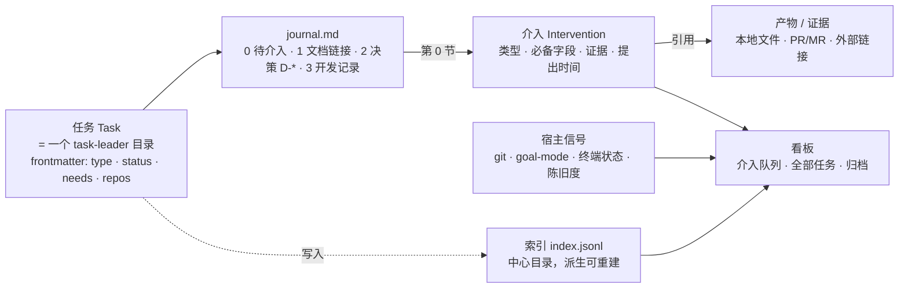
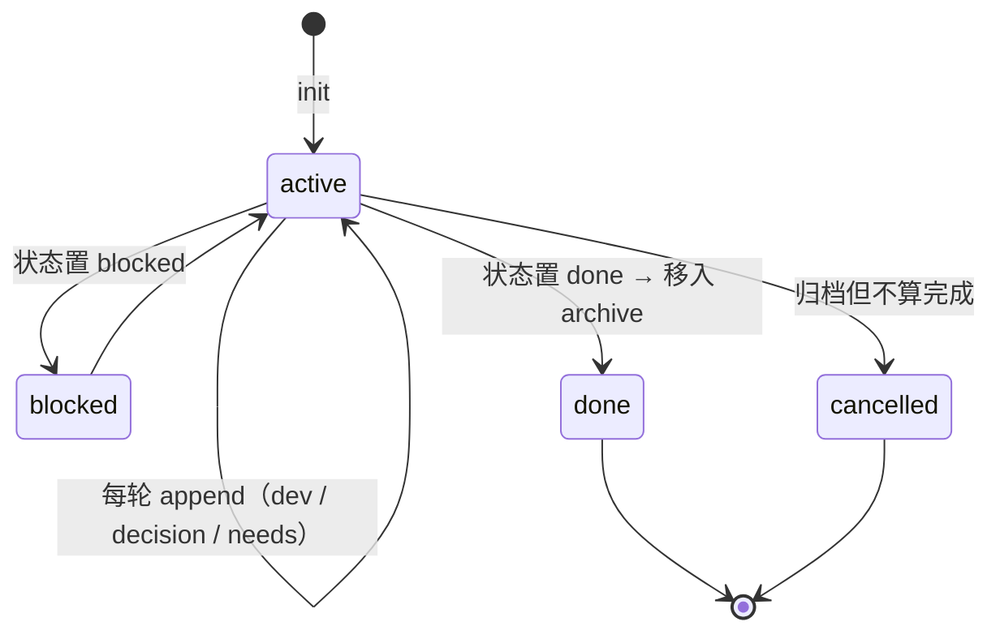
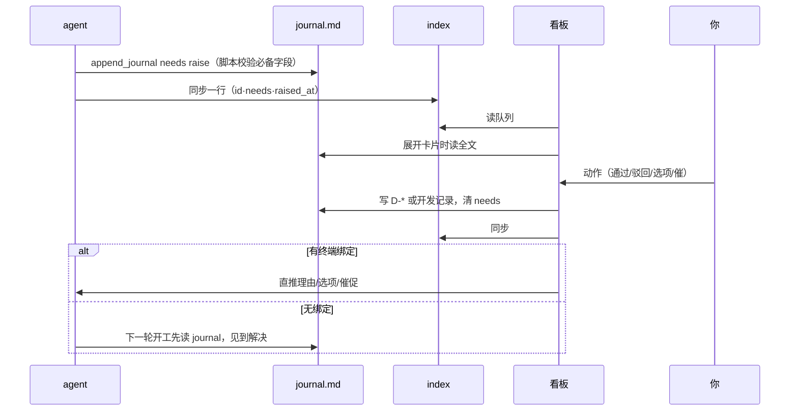

# 产品方案：本地任务管理 + 介入队列看板

状态：草稿 v1
日期：2026-08-19
基础：`~/.agents/skills/task-leader`（已有）、Orca（看板 / worktree / goal-mode / CLI）
前置需求：`需求-介入点看板.md`（本方案是它的收敛版，以本方案为准）

---

## 1. 一句话

**在 task-leader 之上加一层"介入"概念，让每个任务能声明"现在需要我什么"，再用一个跨仓库的队列把所有需要我的点聚在一起——到点时信息齐、能下钻、能当场推进。**

不做新的 tracker，不接外部系统，不改 task-leader 的文档契约。加的东西只有三样：任务的**类型与位置**、**介入块**、**索引与队列**。

---

## 2. 设计原则

| # | 原则 | 它排除了什么 |
| --- | --- | --- |
| P1 | **Journal 就是卡片。** 看板上一张卡的全部内容都来自该任务的 `journal.md`，看板只是投影，不持有独立数据 | 独立的任务数据库、双写、同步 |
| P2 | **介入由 agent 声明，由宿主核对。** agent 写"需要你验收"，宿主用 git / goal-mode / 终端状态核对它说的是不是真的；两者矛盾时**矛盾本身上榜** | 只信 agent 自报；或反过来只靠推断 |
| P3 | **信息跟着介入走。** 声明一个介入必须同时交齐该类型的必备字段，交不齐脚本拒收 | 到了介入点还要回会话里翻 |
| P4 | **类型是档案，不是系统。** oncall / dev / review / research / accept 共用同一份 journal 契约，只在"必备字段、状态词表、典型目录"三处不同 | 每种任务各一套格式 |
| P5 | **仓库内优先，仓库外兜底。** 有单一仓库的任务文档留在仓库里随代码提交（task-leader 现状）；跨仓库、无仓库的任务放中心目录；索引统一 | 全部搬到中心目录，丢掉"文档随 MR 评审"的好处 |

---

## 3. 概念模型



四个对象，只有 **介入** 是新的；产物沿用 task-leader 的"证据放证据目录、Journal 只留链接"的做法；宿主信号是只读的。

---

## 4. 任务

### 4.1 类型档案

| type | 典型目录 | 状态词表 | 默认优先级 |
| --- | --- | --- | --- |
| `dev` | task-leader 全套（现状） | `clarifying / designing / implementing / testing / done / blocked` | P2 |
| `oncall` | `journal.md` + 可选 `research/` + `evidence/` | `triaging / investigating / mitigated / root-caused / done / blocked` | **P0** |
| `review` | `journal.md` | `reviewing / reported / done` | **P1**（别人在等） |
| `research` | `journal.md` + `research/` | `scoping / researching / concluded / done` | P2 |
| `accept` | `journal.md` + `tests/runs/` | `preparing / running / reported / done` | P2 |

规则：

- 类型只影响三件事——**验收类介入的必备字段**（见 5.2）、**状态词表**、**init 时建哪些目录**。Journal 三节契约对所有类型一致。
- task-leader 的"阶段授权边界"原样适用：oncall 任务本轮只要 journal，就不会被要求补 requirements/solutions。
- 优先级可手动覆盖（`priority: p0`），只用于队列排序。

### 4.2 位置

| 情形 | 根目录 | 例子 |
| --- | --- | --- |
| 单仓库开发需求 | `{repo}/docs/issue/{slug}/`（task-leader 默认，不变） | 一个前端需求 |
| 跨仓库 / 无仓库 | `~/.orca/tasks/{slug}/` | Oncall 排障、review 别人的 MR、跨前后端的需求 |

`init_task.py --root` 已存在，只需让它接受绝对路径并把结果登记进索引。两处的目录结构、脚本、契约**完全相同**。

frontmatter 新增：

```yaml
id: T-042            # 本机索引分配的短号，仅作显示与 CLI 引用；身份以路径为准
type: oncall
priority: p0         # 可省，省略取类型默认
needs: acceptance    # none | review | approval | decision | acceptance
repos:               # 可空；用于看板显示与 git 信号采集
  - ~/code/foo
  - ~/code/bar
terminal: orca://...  # 可空；绑定 Orca 终端后动作可直推 agent
```

### 4.3 生命周期



`done` / `cancelled` 的目录移到同根下的 `archive/`；索引标记 `archived: true`。归档不做别的——journal 本身就是归档。

---

## 5. 介入（核心）

### 5.1 五种介入

| 类型 | 含义 | 是否阻塞 agent | 由谁提出 |
| --- | --- | --- | --- |
| `review` 看 | 有新产出建议你过目，不卡我 | 否 | agent |
| `approval` 审批 | 我要做一件有后果的事，先要你点头 | 是 | agent |
| `decision` 决策 | 我遇到分叉，不该由我定 | 是 | agent |
| `acceptance` 验收 | 我认为交付完成了，请你判断对不对 | 是（等你判） | agent |
| `anomaly` 异常 | 宿主观测到不对劲：空转、假完成、报错连击、进程没了、agent 说没事但信号说有事 | — | **宿主** |

一个任务同一时刻**最多一个开放介入**。agent 需要多件事就合并成一条——这条约束是队列可读的前提。

### 5.2 必备字段（脚本校验，缺一拒收）

| 类型 | 必备字段 |
| --- | --- |
| `review` | 产出清单（每项：说明 + 链接） |
| `approval` | 拟执行动作 · 理由 · 影响范围 · 拒绝后的替代路径 |
| `decision` | 分歧点 · 选项（每项含代价）· agent 推荐及理由 · 自评最可能错处 |
| `acceptance`（按 type 分档） | 见下表 |
| `anomaly` | 触发信号 · 起始时间 · 最近一条开发记录摘要（宿主自动填） |

`acceptance` 的分档：

| type | 结论 | 证据 | 边界 | 自评 |
| --- | --- | --- | --- | --- |
| `oncall` | 归因结论 · 止血/修复建议 | 引用的日志/trace **原文片段** + 深链 · 复现或证伪方式 · 已排除的可能及理由 | 未覆盖的范围 | 最可能错在哪 |
| `review` | 问题列表 | 每条：代码位置 · 断言 · **触发场景**（什么输入会坏、坏成什么样）· 严重度 | 扫了但未细看的文件/范围 | 最可能误报的几条 |
| `dev` | 完成声明 | 验收命令结果（过/未过项）· 变更范围 · PR 链接 | 未覆盖的 REQ-* | 最可能有问题的改动 |
| `research` | 结论 | 支撑材料链接 · 关键事实 vs 推断 | 未知项 | 最不确定的判断 |
| `accept` | PASS/FAIL 汇总 | 引用的 TC-* · 证据 | 未执行的 TC | — |

"边界"和"自评"两列是把验收成本从你这边挪走的关键：你验收时最花时间的不是核对它说对的部分，是发现它没说的部分。让它自己交代。

### 5.3 动作与去向

| 介入 | 你的动作 | 写回 journal | 回灌 agent |
| --- | --- | --- | --- |
| `review` | 已阅 | 清 `needs` | 无 |
| `approval` | 批准 / 驳回（附理由） | 新增 `D-*`（结论 + 理由） | 批准：继续；驳回：理由原文 |
| `decision` | 选项 N / 自定义答复 | 新增 `D-*` | 选定项 + 你的补充 |
| `acceptance` | 通过 / 驳回（附理由）/ 通过但留尾巴 | 新增开发记录（"验收通过" 或 "验收驳回：…"）；留尾巴时同时新增 `--open-issue` | 驳回：理由原文；通过：无 |
| `anomaly` | 催一下 / 重启 / 置 blocked / 归档 | 视动作 | 催：一句话；重启：走 Orca |

**每个动作都同时做两件事：写 journal + 清 `needs`。** 回灌是第三件，有 Orca 终端绑定就直推，没有就靠 agent 下一轮读 journal（task-leader 已规定"已有需求：先读 journal.md"）。所以闭环不依赖 Orca，Orca 只是让它更快。

### 5.4 介入块的形态

`journal.md` 新增第 0 节，放在三节之前：

```markdown
## 0. 待介入

### acceptance · 归因结论待确认

- 提出时间：2026-08-19 14:02
- 结论：缓存失效未触发导致读到旧值
- 证据：
  - [Argus 日志片段](evidence/argus-2026-08-19.md)（T1 写入 / T2 读到旧值）
  - https://argus.example/trace/abc
- 复现/证伪：注释掉 X 可复现，恢复后不复现
- 已排除：B（时间线不符）· C（无对应日志）
- 未覆盖：D 服务的缓存路径未看
- 自评最可能错处：对 C 的排除依据偏弱
- 产物：[排障报告](research/root-cause.md)
```

无介入时本节只有一行"当前无待介入。"。解决后块被移除，内容按 5.3 落到 D-* 或开发记录——**介入没有独立历史，它的历史就是决策和开发记录**。

---

## 6. 信息来源：声明 vs 观测

看板上每张卡的信息分两半，来源不同、可信度不同：

| 来源 | 内容 | 可伪造 |
| --- | --- | --- |
| **agent 声明**（journal） | 介入块 · 最近一条开发记录（本轮目标/完成/变更/验证/下一步）· status | 能 |
| **宿主观测** | git：HEAD 是否前进、脏文件数、分支、PR 状态<br/>goal-mode（若绑定）：turns · falseClaims · stallCount · 验收过/未过 · tamperFindings<br/>Orca 终端（若绑定）：进程在不在 · attention/askSummary<br/>陈旧度：journal `updated` 距今 | 不能 |

合并规则只有一条：**矛盾上榜。** 典型矛盾及其处理：

| agent 说 | 宿主看到 | 看板 |
| --- | --- | --- |
| `needs: none`，status active | goal-mode `stallCount ≥ 3` 或 HEAD 连续几轮没动 | 生成 `anomaly`：空转 |
| `needs: acceptance`，声明完成 | 验收命令未过 / HEAD 自上次记录未动 | 卡片顶部红字标出，不阻止你验收但你先看到 |
| `needs: none`，status active | journal 超过阈值（oncall 2h / 其他 24h）没更新 | 生成 `anomaly`：陈旧 |
| status `blocked` | — | 直接进队列（等价一个 `decision`） |

`anomaly` 是唯一由宿主写入的介入类型；它写进索引，不写进 journal（避免宿主污染 agent 的文档）。

---

## 7. 看板

### 7.1 三个视图

| 视图 | 回答 | 形态 |
| --- | --- | --- |
| **介入队列**（默认） | 下一个看谁 | 排序列表，每项展开是介入卡片 |
| **全部任务** | 每个任务在哪、多久没动 | 表格 / 按 type 分栏，列：id · title · type · status · needs · repos · 最近记录 · 陈旧度 |
| **归档** | 上次类似问题怎么解决的 | 搜索（标题 / D-* / 开发记录全文） |

不做 todo/in-progress/done 的状态看板——并行 10 个时全部在 in-progress，那个轴没有信息量。状态只在"全部任务"里作为一列。

### 7.2 队列排序

```
anomaly（矛盾）
  > 阻塞类（approval / decision / acceptance）按 priority，同级按提出时间早的在前
    > review（不阻塞）折叠成一行计数
```

正在正常推进、`needs: none`、不陈旧的任务**不出现在队列里**——这是"并行 10 个但视野里只有 3 个"的来源。

### 7.3 介入卡片解剖

```
┌ [acceptance] 查 xxx 接口 5xx 突增          oncall · P0 · foo,bar · 提出 12 分钟前
│ 归因结论待确认
├─ 信息区（按 5.2 渲染必备字段；缺项显示"未提供"，不留空）
├─ 证据 / 产物：每项一行，本地文件点开预览，PR / 外链一跳直达
├─ 宿主信号：git +3 −1 · 验收 12/12 · goal turn 7 · stall 0 · 终端 alive     ← 与声明矛盾时红字
├─ 最近一条开发记录：标题 · 完成 · 下一步
└─ 动作：[通过] [驳回…] [通过但留尾巴…]   [打开 journal] [打开终端] [打开 worktree]
```

对应四问：**进展**＝最近开发记录 + 宿主信号；**看什么**＝介入类型 + 信息区；**看到什么程度**＝边界 + 自评 + 信号；**怎么推进**＝动作栏 + 开发记录的"下一步"。

### 7.4 下钻

| 从卡片点 | 到 |
| --- | --- |
| 证据条目 | 本地 markdown/图片/日志内联预览；PR/MR/Argus 等外链新开 |
| 打开 journal | 完整 journal，三节都在 |
| 打开终端 | 绑定的 Orca 终端（有绑定时） |
| 打开 worktree | 对应仓库目录（有 repos 时） |
| 任务标题 | 全部任务视图里的这一行（看 status、其他文档） |

外部系统不做同步：**agent 引用过的片段内联，其余深链**。这就是 4.4 的"内联最小、其余一跳"。

---

## 8. 与 agent 的闭环



agent 侧只多一个动作：需要你时调 `needs raise`。其余全是它已经在做的（append dev / decision）。

---

## 9. 存储与索引

```
~/.orca/tasks/
  index.jsonl              # 每任务一行；派生数据，可由 reindex 重建
  roots.txt                # 要扫描的仓库根（reindex 用）；Orca 有仓库列表时可省
  {slug}/journal.md        # 中心目录里的任务
  archive/{slug}/          # 归档
{repo}/docs/issue/{slug}/  # 仓库内的任务（现状）
```

`index.jsonl` 一行的字段：`id · path · title · type · status · needs · needs_title · needs_raised_at · priority · repos · updated · archived · anomaly`。

写入时机：init / append（任一子命令）/ set / archive；`reindex` 扫 roots 全量重建。索引损坏或丢失不影响任何 journal。

---

## 10. 对 task-leader 的改动清单

| 文件 | 改动 | 量级 |
| --- | --- | --- |
| `templates/journal.md` | frontmatter 加 `id/type/priority/needs/repos/terminal`；加 `## 0. 待介入` | 小 |
| `references/document-contracts.md` | 第 0 节契约；类型档案表；介入必备字段表；`archive/` 语义 | 中（纯文档） |
| `scripts/task_utils.py` | 状态词表按 type 取；`--root` 接受绝对路径；索引读写；`repos` 解析 | 小 |
| `scripts/init_task.py` | `--type`、`--repo`（可多）、`--priority`；写索引 | 小 |
| `scripts/append_journal.py` | 新子命令 `needs raise --type … --field …`、`needs resolve --action … --reason …`、`set --status/--priority/--terminal`；每次写完同步索引 | 中 |
| `scripts/validate_task.py` | 校验第 0 节：有 needs 时必备字段齐；status 属于本 type 词表 | 小 |
| 新增 `scripts/list_tasks.py` | 读索引 + 采集宿主信号 + 矛盾判定 + 排序；`--needs-me` / `--all` / `--json` | 中 |
| 新增 `scripts/reindex.py` | 扫 roots 重建索引 | 小 |
| `SKILL.md` | 类型章节、介入章节、位置规则、CLI 用法 | 中 |

不动的：三节 Journal 契约、REQ/D/TC 追踪、阶段授权、事实来源分级、所有模板正文。

---

## 11. 分期

| 期 | 交付 | 依赖 | 你拿到什么 |
| --- | --- | --- | --- |
| **0** | 第 10 节全部；`list_tasks.py --needs-me` | 无（纯 skill） | 终端里一条排好序的介入队列，每项能展开看必备字段。**这一期就能判断字段设计够不够** |
| **1** | Orca CLI：`orca task list/show/resolve/needs`（包脚本）；`orca worktree set --task {path}` 绑定；动作直推终端 | Orca CLI 层 | 动作不用切终端；宿主信号加入 Orca 终端状态 |
| **2** | Orca 面板：介入队列 + 卡片 + 下钻 + 动作（先做插件，形态同 goal-mode 面板） | 1 | 看板本体 |
| **3** | 全部任务视图、归档搜索、goal-mode 信号接入矛盾判定 | 2 | 完整三视图 |

0 期不写 Orca 一行代码。1、2 期是否做，看 0 期跑两周后队列里的信息是不是真的够你当场决策——不够就先改字段，改字段比改 UI 便宜十倍。

---

## 12. 与 Orca 现有能力的接点

| Orca 已有 | 用法 |
| --- | --- |
| 工作区看板 / 自定义状态 | 不复用作主视图（轴不对）；`任务 → worktree` 绑定后，任务 status 可映射到工作区状态，让侧栏卡片颜色跟着走 |
| Agent 运行态看板（`dashboard-snapshot`：attention / askSummary / unseen） | 作为宿主信号之一进卡片："终端 alive / 在等你回答" |
| goal-mode（`~/.orca-goal/goals/*.json`：turns / falseClaims / stallCount / 验收） | 宿主信号最重要的来源；矛盾判定主要靠它 |
| `orca terminal send` | 动作直推 |
| `orca worktree set` | 加 `--task` 建立绑定；已有 `--workspace-status` 用于映射 |
| goal-mode 插件（右侧面板 + worker） | 2 期看板面板照它的壳做，零改 Orca 核心 |
| artifact（分享 HTML/MD） | 可选：把 journal 或排障报告发成可分享链接给别人看；不作为证据存储 |

---

## 13. 非目标

- 不做优先级/标签/项目/父子任务的完整 tracker——`priority` 只用于排序，就一个字段
- 不同步 Linear / Meego / GitHub / Argus 的数据——只存链接
- 不做多人协作、权限
- 不让 agent 自己判断"这个不用给人看"——所有 acceptance 都进队列，队列只负责排序和把信息备齐
- 不做 agent 之间的自动派活——那是 orchestration skill 的事，本方案只管"人在哪介入"

---

## 14. 待你定的事

| # | 问题 | 我的默认 |
| --- | --- | --- |
| Q1 | 一任务一介入的约束接受吗？ | 接受；agent 多件事合并成一条 |
| Q2 | 跨仓库开发需求（前后端各一仓）放中心目录还是主仓库？ | 中心目录，`repos` 列两个 |
| Q3 | `review` 类型（review 别人的 MR）要不要区分"我发起的 review"和"别人请我 review"？ | 不分；优先级手动调 |
| Q4 | 陈旧阈值：oncall 2h、其他 24h，合适吗？ | 先用这个，跑两周再调 |
| Q5 | 0 期先在哪种任务上跑？ | `review`——字段最好定义、产物最规整；跑通再上 `oncall` |
