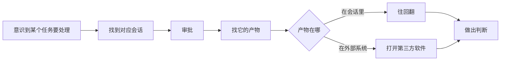

# 需求文档：并行任务的介入点看板

状态：草稿
提出人：zhangchao.zc
整理时间：2026-08-19
适用范围：Orca

> 本文档第 1~5 章是需求方原话与由原话直接推导的需求，第 6~8 章是整理者的分析与建议，已单独标注。
> 需求方可以只保留前 5 章。

---

## 1. 一句话需求

并行处理多个任务时，需要一个看板，**一眼看到每个任务的进展、需要我介入什么、看到什么程度、怎么继续推进**，而不是自己去各处找。

目标是**提高可持续的并行度**。

---

## 2. 使用场景

### 2.1 需求方的真实工作状态（原话）

> 我一边查线上 Oncall 的 bug，一边开发需求，另外一边在调研一个新的技术方案，一边做验收，一边做别人的 MR 的 review。这不是很正常吗？

并行的任务具有以下特征：

| 特征 | 说明 |
| --- | --- |
| **数量** | 约 10 个并行 |
| **跨仓库** | 任务分布在多个仓库，不在同一个仓库内 |
| **类型异构** | Oncall 排障、需求开发、技术调研、验收、他人 MR review 混合 |
| **全部委托 agent** | 每一类任务都交给 agent 执行，包括 Oncall 排障和 MR review |
| **全部需要人验收** | 每一个 agent 产出都必须由人查看确认，介入比例接近 100% |

### 2.2 验收的具体内容（原话）

> oncall 的时候，我让 Agent 去查问题，我得去看他查出来的问题是不是查出来了？查到了什么程度？他的归因是不是正常的？
>
> MR review 的时候，我让 Agent 去 review，给我一个结果。然后我去复查这个结果，然后看他的结果里有哪些是有问题的。
>
> 每一个都需要人去验收啊，当他产出的时候，我都需要去看呀。

即：agent 的产出是**待验证的断言**，不是可直接采信的结果。验收动作包括判断"查到了没有""查到什么程度""归因是否成立""结果里哪些是错的"。

### 2.3 当前的操作路径（反例，原话）

> 不然我得自己去找，比如说 Codex 里边，我先找到会话，然后审批，然后再找它的产物，有一些产物还不好找，我还要打开一个第三方的软件去看。

单次介入的实际动作序列：

问题不在任何单一环节，在于**每次介入都要重新收集一遍决策所需的信息**。

---

## 3. 问题陈述

需求方最初提出的六个问题（原话）：

> 无论是 codex app 还是 orca，当我并行 10 个需求的时候，无法比较好的管理，进度，查看关键决策点，推进后续，无法较好归档，分类，流转。

| 编号 | 问题 | 展开 |
| --- | --- | --- |
| P1 | 管理不了 | 10 个并行任务没有统一的承载面，散落在不同工具、不同会话、不同仓库 |
| P2 | 看不到进度 | 不知道每个任务当前实际推进到什么程度 |
| P3 | 看不到关键决策点 | 不知道哪个任务此刻需要我介入、需要我做哪一种介入 |
| P4 | 推不动后续 | 介入之后，不知道也不方便执行"下一步该做什么" |
| P5 | 归档差 | 任务结束后，过程与结论没有可复用的沉淀 |
| P6 | 分类、流转差 | 任务之间没有有效的组织与状态流转 |

### 3.1 需求方对"看板的意义"的定义（原话，本需求的核心）

> 任何任务需要人工介入，去看、去审批、去决策、去验收。**这个介入的点你需要给我，介入的时候你要把给我的信息给全，并且能够让我下钻去看。这才是看板的意义啊！这才是并行这么多需要的东西啊！**

这句话确立了三条基本要求：

- **R-A 给出介入点**：系统主动告诉我哪个任务此刻需要我，而不是我去找
- **R-B 信息给全**：到达介入点时，做出判断所需的信息已经在手边，不需要再去别处拼
- **R-C 可下钻**：需要更深的证据时，能从当前位置直接进入，而不是另开一个工具重新定位

### 3.2 需求方对看板内容的要求（原话）

> 而不是在看板里能一眼看到当前每一个任务在什么进展了，需要我去看什么？看到了什么程度，怎么继续推进。

每张卡片必须当场回答四问：

- **Q1** 这个任务现在什么进展了
- **Q2** 需要我去看什么
- **Q3** 看到了什么程度
- **Q4** 怎么继续推进

---

## 4. 功能需求

### 4.1 介入点（对应 R-A、P3）

| 编号 | 需求 | 优先级 | 验收标准 |
| --- | --- | --- | --- |
| F1.1 | 系统识别并列出所有当前需要人介入的任务 | P0 | 打开看板即可看到待介入清单，无需逐个任务点开确认 |
| F1.2 | 介入点区分类型：**看 / 审批 / 决策 / 验收** | P0 | 每个待介入项标明类型，四类可分别筛选 |
| F1.3 | 介入点按紧迫度排序 | P1 | 排序有明确依据（见 F1.4），非按创建时间 |
| F1.4 | 介入点不能只依赖 agent 自报 | P0 | agent 未报告需要介入、但客观信号显示异常（长时间无实质推进、反复声称完成未通过验收）时，系统仍将其列为介入点 |
| F1.5 | 不需要介入的任务默认不占据视野 | P1 | 正常推进中的任务不出现在待介入清单里 |

### 4.2 信息完整性（对应 R-B、Q2、Q3）

| 编号 | 需求 | 优先级 | 验收标准 |
| --- | --- | --- | --- |
| F2.1 | 每种介入类型有对应的必备信息，缺失即视为未就绪 | P0 | 见 4.2.1 信息清单；信息不全的卡片明确标记为"信息不全"，而不是显示一张空卡 |
| F2.2 | **验收类**介入必须携带：结论 + 支撑证据 + 产物清单 | P0 | 不打开任何其他工具即可判断结论是否成立，或明确知道还需要看哪一份具体材料 |
| F2.3 | **审批类**介入必须携带：要做什么 + 为什么 + 影响范围 + 拒绝的后果 | P0 | 不需要回到会话上下文即可决定批或不批 |
| F2.4 | **决策类**介入必须携带：分歧点 + 可选项 + agent 的推荐及理由 | P0 | 不需要重建上下文即可做出选择 |
| F2.5 | 产出的自我边界说明：agent 必须声明覆盖了什么、未覆盖什么、自认最可能出错的地方 | P1 | 验收时可直接看到未覆盖范围，不需要自己推断 |

#### 4.2.1 各介入类型的信息清单

| 介入类型 | 必备信息 |
| --- | --- |
| 验收（Oncall 归因） | 归因结论；支撑证据（引用的日志/trace 原文片段）；复现或证伪方式；已排除的其他可能及理由；自评最可能出错处 |
| 验收（MR review 结果） | 问题列表；每条问题的代码位置；每条问题的触发场景；已扫描但未深入的范围 |
| 验收（需求开发） | 完成声明；验收命令的执行结果（通过/失败项）；代码变更范围；PR 链接 |
| 审批 | 拟执行动作；理由；影响范围；拒绝后的替代路径 |
| 决策 | 分歧点；可选项及各自代价；agent 推荐及理由 |
| 看 | 产出物清单及各自入口 |

### 4.3 进展可见（对应 Q1、P2）

| 编号 | 需求 | 优先级 | 验收标准 |
| --- | --- | --- | --- |
| F3.1 | 展示的是**实质进展**而非运行状态 | P0 | 显示"已提交 3 个文件 / 测试 12 项失败"这类事实，而不只是"运行中" |
| F3.2 | 展示距离目标的剩余量 | P1 | 有验收标准的任务显示"N 项通过 / M 项未过" |
| F3.3 | 识别并标记空转 | P0 | 连续多轮无实质推进的任务被标出，不与正常推进的任务混排 |
| F3.4 | agent 自报与客观信号矛盾时，矛盾本身要被展示 | P1 | 例如"声称完成但代码无变更"必须显式呈现，而不是二选一采信 |

### 4.4 下钻（对应 R-C、P1）

| 编号 | 需求 | 优先级 | 验收标准 |
| --- | --- | --- | --- |
| F4.1 | 产物是一等对象，可从卡片直接打开 | P0 | 报告、diff、截图、日志片段、外部链接均可从卡片一次点击到达 |
| F4.2 | 支持跨仓库、跨工具的产物聚合 | P0 | 同一张卡片可同时挂载本地文件、PR 链接、外部系统（如日志平台）链接 |
| F4.3 | 可回到任务的原始执行现场 | P1 | 一次操作可回到对应的会话/终端/worktree |
| F4.4 | 外部系统内容不要求全量同步 | P1 | agent 引用过的证据片段内联展示，其余以深链方式到达原系统 |

### 4.5 推进（对应 Q4、P4）

| 编号 | 需求 | 优先级 | 验收标准 |
| --- | --- | --- | --- |
| F5.1 | 卡片上可直接执行推进动作 | P0 | 至少支持：批准、驳回并附理由、追加指令、判定完成、转为人工处理 |
| F5.2 | 驳回时的理由回传给 agent | P0 | agent 下一轮能看到驳回理由，不需要人重述 |
| F5.3 | 推进动作不要求离开看板 | P1 | 常规推进无需切换到终端或第三方工具 |

### 4.6 归档、分类、流转（对应 P5、P6）

| 编号 | 需求 | 优先级 | 验收标准 |
| --- | --- | --- | --- |
| F6.1 | 任务结束后，过程与结论可检索 | P1 | 同类问题再次出现时，能找到上次的归因路径与结论 |
| F6.2 | 归档的是产出物与决策，而非会话记录 | P1 | 归档内容包含结论、证据、产物；不要求保留完整对话 |
| F6.3 | 分类维度支持任务类型与所属仓库/项目 | P1 | 可按 Oncall / 开发 / 调研 / 验收 / MR review 及仓库筛选 |
| F6.4 | 状态流转可由 agent 写入，而非仅靠人工拖动 | P0 | agent 完成一轮后状态自动前进，看板不因人未操作而停留在过期状态 |

---

## 5. 非目标

明确不在本需求范围内，避免方案跑偏：

| 编号 | 非目标 | 原因 |
| --- | --- | --- |
| N1 | 减少人的介入次数 | 需求方明确说明每个产出都需要人看，介入比例本身不是优化对象 |
| N2 | 让 agent 自主判断"不需要人介入" | agent 产出是待验证断言，其自评不能作为跳过验收的依据 |
| N3 | 把所有外部系统的数据全量同步进来 | 不可行且非必要，见 F4.4 |
| N4 | 重做一个 issue tracker | 需求方倾向在 Orca 现有看板基础上改进 |
| N5 | 单仓库多分支的合并冲突治理 | 任务跨仓库，不存在此问题 |

---

## 6. 现状差距（整理者分析）

> 以下为整理者基于代码与文档核查后的判断，非需求方原话。

### 6.1 Codex App

| 需求 | 现状 |
| --- | --- |
| R-A 给出介入点 | 无统一介入点视图，需自己找会话 |
| R-B 信息给全 | 决策信息散落在会话上下文中 |
| R-C 可下钻 | 产物无一等对象概念，部分产物需外部工具打开 |

### 6.2 Orca 现状

已具备的原语：

| 能力 | 位置 |
| --- | --- |
| 工作区看板：自定义状态列、拖拽、泳道、按项目与状态过滤 | `src/renderer/src/components/sidebar/WorkspaceKanbanLaneGrid.tsx`、`src/shared/workspace-status-defaults.ts` |
| Agent 运行态看板（可弹出独立窗口）：attention/working/done/idle 四列，卡片含待答问题摘要、未读标记、最近一问一答、PR 状态 | `src/shared/dashboard-snapshot.ts` |
| agent 可通过 CLI 写看板状态 | `orca worktree set --workspace-status` |
| 产物子系统（开发中） | `src/main/artifacts/`、`src/shared/artifacts.ts` |
| 目标看门狗：轮次循环、验收闸门、假完成计数、无进展熔断（HEAD 与脏文件哈希连续多轮不变） | `goal-mode/` |
| Linear 集成 CLI：读 issue、写评论、改状态、挂 PR、建子任务 | `orca linear ...` |

差距：

| 需求 | 差距 |
| --- | --- |
| F1.1 / F1.2 介入点清单与分类 | 现有 attention 列只覆盖"agent 弹出问题在等回答"一种，不覆盖验收、审批、决策 |
| F2.x 信息完整性 | `askSummary` 与最近一条 agent 消息是运行态摘要，不是按介入类型组织的决策信息 |
| F3.1 实质进展 | 看板显示的是状态与运行态，不是实质进展事实 |
| F3.3 / F3.4 空转与矛盾 | goal-mode 已在宿主侧计算这些信号，但**限于单目标，且未进入看板** |
| F4.1 / F4.2 产物聚合 | artifact 子系统开发中，尚未与看板打通 |
| F6.4 状态由 agent 写入 | CLI 入口已具备，但缺少"每轮必须回写"的强制机制 |

### 6.3 Multica（外部参考）

方向一致但不满足本需求的两点：

- agent 的回报是**自然语言评论**，看板层无法结构化消费，只能提示"有新评论"，无法给出"这条需要审批，影响面是 X"
- **产物不是一等对象**，agent 产出需依赖附件或 PR 承载

可借鉴的两点：

- 所有上下文挂在同一个工作项上，工作项页即工作台；执行日志可下钻到每次工具调用
- 硬性约定"结果只有通过 CLI 发出才算交付，终端里的文字不算"

---

## 7. 实现建议（整理者建议，非需求）

> 以下为建议方案，需求方可否决。

三件事，顺序不可颠倒：

### 7.1 结构化 checkpoint 契约

agent 每轮结束必须写入一条结构化记录，而非自然语言总结。字段对应 4.2.1 的信息清单：

- `progress` 本轮实质动作
- `evidence` 引用的证据（登记为 artifact）
- `needs` 介入类型：none / approval / decision / acceptance / review，以及该类型的必备字段
- `coverage` 覆盖范围与未覆盖范围
- `self_doubt` 自认最可能出错处
- `next` 无人介入时的下一步

校验放在 stop-hook：字段缺失即打回重来。这与 goal-mode 现有的完成守卫处于同一位置，可复用其机制。

### 7.2 证据登记为 artifact

agent 引用的日志片段、生成的报告、变更的文件、外部系统链接，均登记为带类型的 artifact。这是 F4.1、F4.2 的前提，与正在开发的 artifact backend 直接衔接。

### 7.3 聚合视图

跨 worktree 读取 checkpoint + 宿主客观信号 + artifact 清单，按介入紧迫度排序。

建议先做成 CLI 命令输出，验证"信息是否足够当场决策"，确认后再进 UI。

### 7.4 建议的验证顺序

先在**他人 MR review** 场景验证：其 checkpoint 字段最易定义（结论、证据、误报判定），产物最规整（问题列表与代码位置）。跑通后再迁移到 Oncall 归因场景。

---

## 8. 开放问题

| 编号 | 问题 | 影响 |
| --- | --- | --- |
| O1 | 介入点的紧迫度排序依据是什么？是否引入外部 SLA（如他人 MR review 的等待时长）？ | 影响 F1.3 |
| O2 | 卡片的承载单位是什么：worktree、工作项、还是独立的任务对象？跨仓库任务与 worktree 是否一一对应？ | 影响数据模型与 F6.1 归档 |
| O3 | 归档保留多久、存在哪里？是否需要跨仓库检索？ | 影响 F6.1、F6.2 |
| O4 | 已有的 Linear 集成是否作为记录层，还是看板自持数据？ | 影响 F6.x 与数据一致性 |
| O5 | 非 agent 执行的任务（纯人工任务）是否也进入这个看板？ | 影响看板的完整性与噪音水平 |
