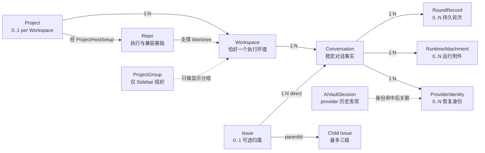
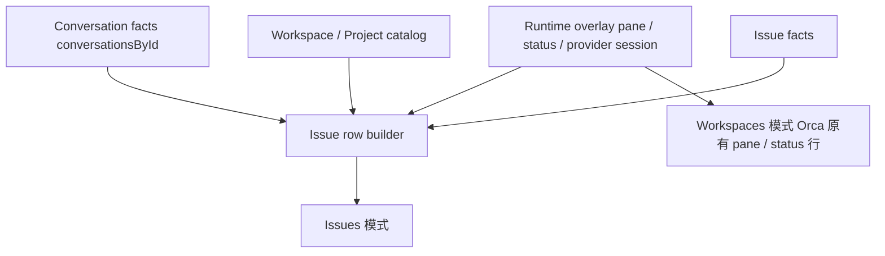

# Orca 并行任务管理：产品数据模型

2026-08-24 · 对 [`产品方案.md`](./产品方案.md) 与 [`技术方案.md`](./技术方案.md) 的对象模型补充

> 本文只回答“Orca 中 Project、Workspace、Conversation、Issue 和运行态对象是什么关系”。
> 它不是新的功能方案，也不改变既有产品范围；后续产品和技术实现如与本文冲突，以本文的数据关系与不变量为准。

## 0. 一句话结论

**Conversation 是唯一的对话事实；它必须处于一个 Workspace 中，因此带有该 Workspace 对应的 Project 上下文，同时可以选择性地归入一个 Issue。持久 Conversation 只在 Issues 中呈现；Workspaces 保持它原有的 pane / status 运行行不变。**

```text
同一个 Conversation
  ├─ 按执行位置看：Project → Workspace → Conversation
  └─ 按工作事项看：Issue → Conversation
```

Issue 不是另一套对话容器，也不拥有一套独立 Conversation。给 Conversation 绑定、改绑或解绑 Issue，只改变它的 `issueId`，不能改变 Conversation 身份、Project/Workspace 执行上下文或既有历史。

## 1. 当前结论

| 问题 | 结论 |
| --- | --- |
| Conversation 是否必须属于 Workspace | 是，恰好一个 |
| Conversation 是否属于 Project | 从产品视角属于其 Workspace 对应的 Project；独立 FolderWorkspace 可以没有正式 Project |
| Conversation 是否必须属于 Issue | 否，`issueId` 可以为空 |
| 一个 Conversation 能否属于多个 Issue | 不能，当前模型是 `0..1 Issue` |
| 一个 Issue 能否包含多个 Conversation | 可以，而且可以来自多个 Workspace |
| Issue 是否直接绑定 Workspace 或 Project | 不绑定；从它的直接 Conversation 派生 |
| Workspaces 与 Issues 是否有两套 Conversation | 没有。持久 Conversation 只有一份，且只由 Issues 读取；Workspaces 不读它，继续用原有 pane / status 行 |
| pane、tab、provider session 是否是 Conversation | 不是；它们只是 Conversation 的运行附件或恢复证据 |
| 关闭 tab 是否等于关闭 Conversation | 不等于；只移除当前运行附件，不改变 Conversation 身份或 Issue 归属 |
| 右侧 Session History 的每一条是否都是 Conversation | 不是；其中既有已映射 Conversation 的 provider session，也有尚未被 Orca 记录的历史 session |
| 从右侧恢复是否总会新建 Conversation | 不会；已知 provider identity 复用原 `conversationId`，未知 identity 首次恢复时才创建 |
| 一个 terminal tab 是否必然对应一个 Conversation | 不必然；普通 shell tab 不是 Conversation，split tab 还可能承载多个 pane |
| Project、Repo、ProjectGroup 是否同一个概念 | 不是，三者必须分开 |

当前代码中的持久 `ConversationRecord` 已经具备稳定 `id`、必填 `workspaceRef` 和可空 `issueId`，这一方向是正确的。展示层的分工是明确的：Workspaces 模式继续从 tab、pane 和 agent status 生成对话行，Issues 模式读取持久 Conversation。这不是偏差，而是目标态——见 6.2。

## 2. 核心对象与边界

### 2.1 Project：逻辑项目

Project 表示用户长期维护的一个逻辑项目或代码库，是跨执行主机和 Workspace 的上层身份。

Orca 已有正式的 `Project` 与 `ProjectHostSetup`：

```text
Project
  └─ ProjectHostSetup(projectId, hostId, repoId, path)
       └─ Workspace
```

Project 的职责：

- 提供稳定的逻辑项目身份；
- 组织不同主机上的 setup；
- 作为 Workspaces 模式中的上层分组；
- 参与 Profile Project copy / move。

Project 不负责：

- 表示一次具体执行；
- 保存 Conversation 历史；
- 代替 Issue；
- 代替 Sidebar 的 `ProjectGroup`。

### 2.2 Repo：执行与兼容基础

Repo 是 Orca 当前大量 Git、文件系统、Source Control 和 Workspace 链路的基础对象。一个 `ProjectHostSetup` 可以关联一个 Repo，Worktree 也持有 `repoId`。

Repo 与 Project 不是同义词：

- Project 是产品上的逻辑项目身份；
- Repo 是某个具体存储或执行配置；
- 旧数据可能只有 `repoId`，没有正式 `projectId`；
- 兼容层可以把 Repo 暂时当成一个项目分组显示，但不能把 `repoId` 静默写成正式 `projectId`。

### 2.3 ProjectGroup：Sidebar 组织

`ProjectGroup` 只表示用户在 Sidebar 中对 Repo 或 FolderWorkspace 的组织方式。

它不是正式 Project，也不参与 Conversation 的 Project 归属：

- 移动 ProjectGroup 不改变 Conversation；
- `projectGroupId` 不能作为 `projectId`；
- 独立 FolderWorkspace 即使位于某个 ProjectGroup 下，也不因此获得正式 Project 归属。

### 2.4 Workspace：具体执行环境

Workspace 是 Conversation 实际运行和恢复的环境。现有 `WorkspaceScope` 是权威引用：

```ts
type WorkspaceScope =
  | { type: 'worktree'; worktreeId: string }
  | { type: 'folder'; folderWorkspaceId: string }
```

Workspace 有两种：

1. **Worktree Workspace**
   - 必有 `repoId`；
   - 新模型中通常能解析到正式 `projectId`；
   - 旧数据可能暂时只有 Repo 关系。
2. **Folder Workspace**
   - 可以是独立文件夹；
   - 当前只有 `projectGroupId`，不等于正式 Project；
   - 因此它可以没有 Project，但仍是完整合法的 Workspace。

Workspace 的归档、删除或暂时不可达，不会删除 Conversation。Conversation 保留创建时的 Workspace 名称和路径快照，用于历史展示。

### 2.5 Conversation：稳定对话事实

Conversation 表示一次可以持续、脱离当前 UI 后仍保留、恢复并跨 pane 展示的 agent 对话。

它不是“当前开的 terminal”，也不是“一次 provider session”。其稳定身份由 Orca 分配：

```text
conversationId
  ├─ 1 Workspace
  ├─ 0..1 effective Project
  ├─ 0..1 Issue
  ├─ N RoundRecord
  ├─ 0..N ProviderIdentity
  └─ 0..N RuntimeAttachment
```

Conversation 是连接“在哪里做”和“在做什么”的中心事实：

- `workspaceRef` 回答：这段对话在哪里执行；
- `effectiveProjectRef` 回答：它属于哪个逻辑项目；
- `issueId` 回答：它当前被归到哪件事；
- `RoundRecord` 回答：这段对话发生过什么；
- `ProviderIdentity` 回答：哪个 provider session 可以精确恢复到它；
- `RuntimeAttachment` 回答：它现在通过哪个 pane、tab 或 PTY 展示和运行。

Conversation 的创建有两条入口：

- **Issue 内显式启动**：用户已经明确创建工作容器，Orca 可在调用现有 launcher 前预分配
  `conversationId` 与一次性 launch claim；
- **普通 Workspace 启动**：不因为 tab/PTY 被创建就写 Conversation，只有首个能确认 Workspace、
  current authority 与 provider identity/session boundary 的可信 hook 到达后才创建。

后者如果始终没有可信运行证据，现有 terminal 仍可使用，但不会为了填满 Sidebar 而制造一条
无法证明的持久 Conversation。

### 2.6 Issue：可选的工作分类

Issue 是“一件事”的稳定实体，支持本地创建、外部来源和最多三级嵌套。

在 Conversation 上，Issue 只表现为一个可空外键：

```text
Conversation.issueId: IssueId | null
```

但 Issue 本身不是普通字符串标签。它有自己的：

- 稳定 `issueId`；
- 标题、来源与归档状态；
- `parentId` 与同级顺序；
- 备注与手工外部引用快照；
- 从直接 Conversation 派生的注意力与 Workspace 集合。

Issue 不保存一份独立的 Conversation 列表。其直接 Conversation 永远由下面的查询得到：

```text
directConversations(issueId)
  = Conversations where conversation.issueId == issueId
```

### 2.7 RoundRecord：Conversation 的持久轮次

RoundRecord 是 Conversation 中一次真实停止、提问、等待或完成的持久事实。

它承载：

- 停止类型、发生时间与采集来源；
- 一级停止类型为 `completion | waiting`；提问、审批等待和阻塞是 `waiting` 的可见原因；
- 有界的用户输入、agent 输出与待答问题预览；
- 用户输入、agent 输出、待答问题各自的 `not-captured | runtime-preview | reconciled-preview`
  完整性状态；
- `readAt`；
- `resolvedAt`；
- provider turn / transcript fact ref，用于把重复 hook 与对账结果合并为同一条记录。

`readAt` 与 `resolvedAt` 必须独立。用户看过一条记录，只表示已读，不能自动表示事情已经处理完成。

首版不保存或读取完整 provider transcript，也没有“完整全文”状态。hook 内容只能是
`runtime-preview`；从 transcript 对账得到的稳定片段最多是 `reconciled-preview`；没有可用文本时
为 `not-captured`，但停止类型和处理义务仍然保留。

首版不保存 `executionChainId`、`supersedesRoundId` 或派生 `superseded` 状态。当前 hook 与
transcript 能提供 turn identity，却不能对所有 agent 提供可靠 predecessor lineage；因此同一 fact
只做去重/补强，不同 fact 之间只由明确新输入、resume、显式处理或归档改变 `resolvedAt`。
waiting 只有在同一 provider identity 出现时间更晚的 authoritative working/completion 时以
`resumed` 解决；pane/tab clear、disconnect 或进程消失本身不解决义务。

### 2.8 RuntimeAttachment：运行态附件

RuntimeAttachment 是 Conversation 当前或历史上的运行映射，例如：

- terminal tab；
- pane / `paneKey`；
- PTY；
- agent status；
- runtime connection。

这些对象可以晚到、断开、重建或变化，因此都不能成为 Conversation 主键。首版 registry
只保存当前可用映射；历史恢复身份由 ProviderIdentity 承担，不持久化 pane/tab/PTY 附件史。

```text
Conversation 1 ── 0..N RuntimeAttachment
```

关闭 pane 只会移除一个运行附件，不会删除 Conversation。恢复已映射的 provider session 时，应重新附着到原 `conversationId`，而不是创建第二条业务对话。

更准确地说，Conversation 与 pane 绑定，而不是与整个 tab 一一绑定。一个 terminal tab 可以没有 agent Conversation，也可以因为 split layout 同时包含多个 pane。

首版实现从 AgentHookServer 已有 status/provider identity snapshot、current authority observation、
live hook 与 pane clear 重建附件，不要求 PTY 或 main-window service 增加 Issue callback。

### 2.9 ProviderIdentity 与 Session History

ProviderIdentity 是 Orca Conversation 与外部 agent session 之间的稳定映射：

```text
Conversation
  └─ ConversationProviderIdentity
       ├─ agent
       ├─ provider session ID
       └─ transcript path / resume locator
```

右侧 Session History 中的 `AiVaultSession` 则是 Orca 扫描 provider transcript、session 文件或数据库后得到的历史条目。它是一条“发现到的 provider session”，不是第二种 Conversation：

```text
AiVaultSession
  ├─ 可能命中已有 ConversationProviderIdentity
  └─ 也可能来自 Orca 之外、旧版本或尚未记录的历史运行
```

所以 Session History 是 provider 历史发现与恢复入口，不是 Conversation 事实库。仅仅扫描并展示一条 `AiVaultSession`，不能让它自动进入 Workspaces、Issues、Activity 或未读统计。

## 3. 目标关系模型



读图重点：

- Workspace 是 Conversation 的强制执行归属。
- Project 是 Workspace 的可选上层；独立 FolderWorkspace 可以没有 Project。
- Issue 与 Project/Workspace 是正交维度。
- Issue 的父子结构只组织 Issue，不继承或改写 Conversation 归属。
- RuntimeAttachment 是运行态叠加，不是持久对象身份。
- AiVaultSession 是 provider 历史发现；只有 identity mapping 才能把它精确关联到 Conversation。

### 3.1 规范化依赖

模型中的关键函数依赖是：

```text
conversationId
  → workspaceRef
  → effectiveProjectRef?

conversationId
  → issueId?

conversationId
  → RoundRecord[]

conversationId
  → RuntimeAttachment[]
```

因此 Project 不能成为与 Workspace 平行、可独立编辑的第二个归属字段。否则会产生非法组合：

```text
Conversation
  projectId = Project A
  workspaceRef = Project B 下的 Workspace
```

正确方式是：

1. `workspaceRef` 是 Conversation 的权威执行位置；
2. `effectiveProjectRef` 由 Workspace 当前关系解析；
3. 为了 Workspace 删除后的历史展示，可以保存 `projectSnapshot`；
4. `projectSnapshot` 只是快照，不能反向决定当前 Project；
5. 普通 mutation 不能改写 Conversation 的 Project 或 Workspace；首版 Project copy 不复制工作事实，Project move 命中已记录的 Conversation 时在 transfer 前阻断。

这意味着用户所说的“Conversation 跟 Project 绑定”在产品语义上成立，但它是由 Workspace 保证一致性的受约束关系，而不是第二个随意可写的外键。

## 4. Conversation 的目标字段模型

### 4.1 权威字段

| 字段 | 可空 | 可变性 | 说明 |
| --- | --- | --- | --- |
| `id` / `conversationId` | 否 | 创建后不可变 | Orca 稳定对话身份 |
| `authorityId` + `hostPartitionKey` | 否 | 创建后不可变 | 持有该事实的 authority 与主机分区 |
| `executionHostId` | 否 | 创建后不可变 | authority 侧执行主机身份；只允许 `local | ssh:<targetId>`，不使用客户端 runtime 路由别名 |
| `workspaceRef` | 否 | 普通操作不可变 | 权威执行位置 |
| `workspaceSnapshot` | 否 | 可随明确刷新补充 | Workspace 不可达时的名称与路径 |
| `issueId` | 是 | 可 bind / rebind / unbind；每次原子变更 | 唯一允许独立改动的工作归属；失败时保留原值 |
| `agent` | 否 | 创建后不可变 | 对话使用的 agent 类型 |
| `title` | 是 | 可变 | 用户或 provider 可更新的显示标题 |
| `recordRevision` | 否 | 本记录写入时递增 | 并发编辑保护；不随其他实体或 Round 变化 |
| `launchFailure` | 是 | 启动/重试流程写入 | 有界错误摘要与失败时间；不能冒充 Conversation 业务关闭 |
| `createdAt` / `updatedAt` | 否 | 系统维护 | 生命周期时间 |

当前实现中的 `state: active | closed` 不进入目标权威模型。产品没有定义独立的“关闭 Conversation”动作，而正常关闭 tab、provider 停止和启动失败是三个不同事件，不应压成一个枚举。

`routeExecutionHostId` 不属于 Conversation 主记录。它由当前客户端到 authority 的连接关系派生，
例如 `runtime:<environmentId>`；同一权威副本从不同客户端访问时路由可以不同，但持久
`executionHostId` 不变。

查询响应必须返回 authority、host partition 与 authority execution host；即使结果为空，也不能
从某条 Conversation 反推。`routeExecutionHostId` 由发起请求的客户端保存，不由 authority 回显，
因为同一 authority 在不同客户端上的 runtime alias 可以不同。首版 route 只支持本机 local、
本客户端直接管理的 SSH target，或配对 remote runtime 的 local partition，不支持经 remote
runtime 再二跳到其 SSH target。

远端 Workspace 在客户端可标成 `runtime:<environmentId>`，其 Conversation 在 owning authority
内仍标成 `local`。Issues 的 row builder 必须先确认 route/authority 映射，再按 `workspaceRef` 联合，
不能直接比较这两个 host id。

### 4.2 Project 上下文

Conversation 对 Project 的逻辑字段建议表述为：

```ts
type EffectiveConversationProject =
  | {
      kind: 'project'
      projectId: string
      projectHostSetupId?: string
      repoId?: string
    }
  | {
      kind: 'legacy-repo'
      repoId: string
    }
  | null
```

它不是用户可以单独修改的 membership：

- `project`：Workspace 可以解析到正式 Project；
- `legacy-repo`：旧 Worktree 只有 Repo，尚未迁入正式 Project；
- `null`：独立 FolderWorkspace，没有正式 Project。

实际落库可以选择按需解析并保存快照，也可以保存受约束的 `projectId` 加速查询；无论采用哪种物理形式，都必须满足：

```text
effectiveProjectRef == resolveProject(workspaceRef)
```

任何缓存字段不一致时，以 `workspaceRef` 和 Workspace catalog 为准，不允许 UI 展示两种互相冲突的归属。

### 4.3 不属于 Conversation 主记录的字段

下面这些只能放在 RuntimeAttachment 或 identity mapping 中：

- `paneKey`；
- tab ID；
- PTY ID；
- provider session ID；
- transcript path；
- connection ID；
- agent status；
- 最新运行态预览。

这些值不能参与 Sidebar 行的持久身份。Issues 中同一 Conversation 的 row key 必须以 `conversationId` 为核心。

### 4.4 四个容易混淆的层次

| 层次 | 当前代码对象 | 是否是业务事实 | 何时存在 | 主要作用 |
| --- | --- | --- | --- | --- |
| Orca Conversation | `ConversationRecord` | 是 | 创建或首次记录后持续存在 | Workspace / Issue 归属、轮次与稳定导航 |
| Provider 恢复身份 | `ConversationProviderIdentity` | 是，属于 Conversation 的身份映射 | Orca 确认 provider session 身份后 | 精确判断恢复的是哪一个 Conversation |
| 当前运行附件 | `TerminalTab`、pane、PTY、agent status | 否 | 当前 tab / pane 仍存在或正在启动时 | 展示、运行、聚焦和实时状态 |
| Provider 历史发现 | `AiVaultSession` | 否 | Session History 扫描到 transcript/session 时 | 浏览 provider 历史、查看预览、恢复或首次记录 |

这四层不能互相代替：

- 不能因为 tab 存在就断言有一个正式 Conversation；
- 不能因为 tab 被关闭就删除或关闭 Conversation；
- 不能因为 Session History 扫到一条记录就自动创建 Conversation；
- 不能只靠相似 prompt 把历史 session 合并进某个 Conversation。

### 4.5 “打开、关闭、可恢复”是不同维度

Conversation 是否有可见 tab，应作为派生的附件可用性，而不是 `ConversationRecord.state`：

```ts
type ConversationAttachmentAvailability =
  | { kind: 'attached'; paneKey: string; tabId: string }
  | { kind: 'detached-resumable'; providerIdentityId: string }
  | { kind: 'detached-unavailable' }
```

三种状态的含义：

1. **attached**
   - Conversation 有可用 pane，或同一 provider session 已在排队启动；
   - 点击 Conversation 应聚焦现有 pane，不能重复 resume。
2. **detached-resumable**
   - 原 tab / pane 已关闭；
   - `ConversationRecord` 和 provider identity 仍在；
   - Workspace、执行主机和 transcript 满足恢复条件；
   - 点击后创建新的 RuntimeAttachment，但仍是原 `conversationId`。
3. **detached-unavailable**
   - Conversation 事实仍在；
   - 但没有可用 pane，也没有足够的精确身份或恢复条件；
   - UI 只能展示历史并解释不可恢复原因，不能猜测合并或静默新建。

Conversation 的用户可见状态应由多条正交事实派生：

```text
attachment availability  = attached / detached
resumability             = resumable / unavailable
execution state          = launching / running / waiting / stopped / failed
workspace availability   = available / unavailable
```

因此，用户口中的“已经关闭但能从右侧恢复”，准确含义是“tab 已关闭、Conversation 已 detach，但 provider session 仍可恢复”，不是 `Conversation.state = closed`。

### 4.6 右侧恢复的两种结果

#### 已被 Orca 记录的 session

```text
Conversation C1
  + ProviderIdentity P1
  + RuntimeAttachment A1
        │
        ├─ 关闭 tab → C1 + P1，A1 消失
        │
        └─ 从右侧恢复 → C1 + P1 + 新附件 A2
```

这里恢复前后都是 C1：

- Workspace、Project 上下文、Issue、RoundRecord 都不变；
- 新 tab ID、paneKey 和 PTY ID 可以全部变化；
- identity mapping 命中时必须复用原 `conversationId`。

这里的“恢复”还必须回到 C1 原本的 `workspaceRef`。如果用户选择另一个 Workspace，语义已经不是 resume，而是“在新 session 中继续”，必须创建新 Conversation。

#### 尚未被 Orca 记录的历史 session

```text
AiVaultSession P9
  └─ 仅在右侧被扫描到：还不是 Conversation
       └─ 首次显式恢复 / 被运行时确认身份
            → 创建 Conversation C2
            → 绑定 ProviderIdentity P9
            → 创建 RuntimeAttachment A3
```

目标创建规则：

- 扫描和展示时不创建 Conversation，避免把所有 provider 历史自动灌入 Sidebar；
- 首次显式恢复，或一个已运行 session 被 hook 以强身份确认时，才创建 `ConversationRecord`；
- 首次记录使用实际恢复目标 Workspace，`issueId` 默认为空；
- 用户随后可以把 C2 绑定到 Issue；
- 一旦完成映射，后续再次恢复 P9 必须复用 C2。

如果用户选择的是“在新 session 中继续”而不是恢复原 provider session，则应创建新的 Conversation，并通过来源引用表达它来自旧 session，不能和“恢复同一 Conversation”混为一谈。

### 4.7 “恢复”与“在新 session 中继续”

| 用户动作 | Provider session | Workspace | Conversation |
| --- | --- | --- | --- |
| 聚焦当前 pane | 不变 | 不变 | 不变 |
| 原 Workspace 恢复 | 复用原 session | 不变 | 复用原 `conversationId` |
| 另一个 Workspace 继续 | 创建新 session | 改变 | 创建新 `conversationId` |

禁止下面这种只做一半的状态：

```text
Conversation C1.workspaceRef = Workspace A
Provider session P1 在 Workspace B 被 resume
RuntimeAttachment A2 挂在 Workspace B
但 allocator 仍返回 C1
```

它会让 Issues 中显示的 Workspace 归属、恢复位置和真实执行目录互相矛盾。恢复 allocator 命中已有 identity 后必须校验目标 Workspace 与原 `workspaceRef` 一致；不一致时拒绝 resume，并引导用户走“在新 session 中继续”。

### 4.8 不引入“关闭 Conversation”

首版不提供独立的“关闭 Conversation”业务动作：

- 关闭 tab / pane：只删除 RuntimeAttachment；
- provider 进程结束：执行状态变为 stopped 或 failed；
- Conversation 历史折叠：是查询与展示策略；
- 启动失败：记录 `launchFailure`；
- 重试未确认启动：复用原 Conversation，只创建新 claim 并清除旧 `launchFailure`；
- 忘记 Conversation：是显式、独立且高风险的数据删除动作。

当前代码中的 `state: active | closed` 是需要逐步去掉的实现兼容字段：

- 正常 tab 关闭不会更新它；
- 目前自动写 `closed` 的明确路径是 agent 启动失败；
- retention 又把 `closed + unassigned` 当作优先清理信号；
- resume 命中既有 identity 时不会把它改回 `active`。

这说明该字段混合了启动诊断、留存策略和假想业务生命周期。目标实现应移除它，或在迁移期停止让它参与 Sidebar、恢复和业务状态判断。首版不增加自动 Conversation retention；历史折叠只影响查询与展示，不能删除 Conversation 或未解决义务。

重试只允许满足全部条件的预分配记录：没有 ProviderIdentity、RoundRecord、RuntimeAttachment 和
未过期 claim。它保留 `conversationId`、Workspace、agent 与 Issue，并以 `recordRevision` 防并发
重试。忘记操作先返回预检快照；attached / running / waiting 时拒绝，确认后级联删除 Orca 侧
claim、identity、Round 与绑定，但不删除 provider transcript。之后显式 Resume 同一 provider
session 时属于一次新的记录，可以获得新的 `conversationId`。

## 5. Issue 的目标字段模型

### 5.1 Issue 自身字段

| 字段 | 说明 |
| --- | --- |
| `issueId` | Orca 内部稳定身份 |
| authority / host partition | Issue 权威数据所在分区 |
| `source` | local 或外部 provider 来源 |
| 标题、类型、备注 | Issue 自身信息 |
| `state` / `archivedAt` | Orca 侧进行中或已归档 |
| `recordRevision` | Issue 自身字段的并发编辑版本；不随无关 Round 变化 |
| `parentId` | 可空；最多三级 |
| `siblingOrder` | 同一 parent 作用域内排序 |
| note / external reference snapshot | 用户备注，以及手工保存的 provider、编号、URL 和标题快照 |

首版不建立 `issue_events`、`issue_links`、digest、artifact 或全文索引。结构变化直接反映在当前
Issue / Conversation 状态中，详情时间线只读取直接 Conversation 的 Round preview。

### 5.2 Issue 明确不保存的字段

Issue 不保存：

- `projectId` membership；
- `workspaceId` membership；
- 一份可独立维护的 `conversationIds` 数组；
- pane、tab 或 provider session；
- 另一套 read / resolved 状态。

以下内容全部是派生结果：

```text
Issue.directConversations
  = Conversation where issueId == Issue.id

Issue.directWorkspaces
  = distinct directConversations.workspaceRef

Issue.directProjects
  = distinct resolveProject(directWorkspaces)

Issue.ownAttention
  = unresolved RoundRecord of directConversations

Issue.descendantAttention
  = matching descendant Issues
```

因此，一个 Issue 可以自然跨多个 Workspace，甚至跨多个 Project；前提是正式绑定仍满足同一 authority DB、host partition 与 immutable `executionHostId` 的约束。

### 5.3 Issue 嵌套

父子关系只表达工作分解，不表达 Conversation 继承：

```text
Parent Issue
  ├─ 自己的 direct Conversations
  ├─ Child Issue A
  │    └─ Child A 自己的 direct Conversations
  └─ Child Issue B
       └─ Child B 自己的 direct Conversations
```

规则：

- 父 Issue 的直接 Conversation 不自动属于子 Issue；
- 子 Issue 的 Conversation 不自动成为父 Issue 的直接 Conversation；
- 父详情可以显示后代汇总，但必须标为派生汇总；
- 改变 Issue 父子关系，不改变任何 Conversation 的 `issueId`；
- 删除父 Issue 不级联删除子 Issue 或 Conversation；
- 正式父子关系不能跨 authority、host partition 或 immutable `executionHostId`。

## 6. Conversation 的呈现：只在 Issues

### 6.1 唯一事实源

目标态只有一个稳定 Conversation 集合：

```text
conversationsById: Map<conversationId, ConversationRecord>
```

只有 Issues 的 row builder 读取它。Workspaces 那条链路一个字不改：



Runtime overlay 只能补充“正在运行、等待、最新预览、可打开 pane”等实时信息，不能决定 Conversation 是否存在。

“唯一事实源”不要求一个无界 RPC 一次返回全部对象。首版读模型拆成：

```text
issues.list(route, filter)            → 固定 revision 的 Issue tree 分页
conversations.list(route, scope)      → 固定 revision 的 Conversation 分页
issues.listRounds(route, scope)       → 固定 revision 的 Round preview 分页
```

- `scope` 可以是 authority、Workspace、Issue 或 unassigned；所有页最终按 `conversationId` 合并进
  同一 entity map；
- `全部 / 需要我 / 已归档` 各自只保存 Issue ID 列表和分页状态，不能拥有或覆盖另一份
  Conversation 对象；
- cursor 固定 snapshot revision；翻页期间 authority/facts/tree revision 变化时返回 `stale`，整次
  翻页作废后重拉，不能把两个快照拼在一起；
- Issues 的各个 scope（authority / Workspace / Issue / unassigned）可能按可见范围分别懒加载，但
  一旦加载同一 `conversationId`，必须引用同一 normalized entity。

### 6.2 Workspaces 保持原样

Workspaces **不显示持久 Conversation**。Project / Workspace 列表、分组、状态列，以及 Workspace 下的
agent 对话行，全部保持 Orca 原有实现——那些行由 tab、pane、agent status 实时生成，重启即清，
天然有界。

取舍原因：持久 Conversation 一旦画到 Workspace 卡片上，每一条没有活 pane 的会话都会留下一行常驻
行；实测一天下来 23 条会话里只有 8 条有未处理轮次，其余 15 条把卡片淹没成一列 `Idle`。
Workspaces 回答的是「我此刻在哪里工作」，不是「我有过哪些对话」——后者是 Issues 的职责。

Conversation 与 Workspace 的唯一关系是 `workspaceRef` 这个**单向引用**：Conversation 记录自己属于
哪个 Workspace，用于在 Issues 中显示归属、解析 Project 上下文、以及恢复时校验目标 Workspace。
它不产生任何 Workspaces 侧的渲染。

### 6.3 Issues 怎么组织

推荐结构：

```text
Issue tree
  └─ Direct Conversation
       └─ Workspace / Project context

Unassigned
  └─ Conversation where issueId is null
```

Issues 这种组织方式回答：

- 我在推进哪些事情？
- 每件事有哪些直接 Conversation？
- 这些 Conversation 分布在哪些 Workspace / Project？
- 哪些 RoundRecord 需要我处理？

Issue 展开后可以按 Workspace 分组 direct Conversation，但分组只是展示，不产生 Issue→Workspace membership。

### 6.4 行身份与选择状态

同一 Conversation 在 Issues 的每一处呈现（Sidebar 行、Issue 详情卡片）中必须满足：

| 行为 | 规则 |
| --- | --- |
| row identity | 都基于 `conversationId` |
| 标题 | 读取同一 Conversation title |
| 当前状态 | 读取同一 runtime overlay |
| 未读 / 待处理 | 读取同一 RoundRecord |
| 点击 | 进入同一 Conversation 或其当前运行附件 |
| 改名 | Sidebar 行与详情卡片同时更新 |
| 绑定 Issue | 只改变它在 Issues 中的归类；Workspaces 的显示不受任何影响 |
| 切换 ProjectGroup | 只改变 Workspaces 外层组织，不改变 Conversation |

### 6.5 一个具体例子

事实：

| Conversation | Project | Workspace | Issue |
| --- | --- | --- | --- |
| C1 | Orca | `worktree:frontend` | I1「Issue Sidebar」 |
| C2 | Orca | `worktree:runtime` | I1「Issue Sidebar」 |
| C3 | Orca | `worktree:runtime` | 空 |
| C4 | 空 | `folder:notes` | I2「产品方案」 |

Issues 模式（Workspaces 侧不呈现这四条 Conversation，其卡片仍是原有的 pane / status 行）：

```text
I1 Issue Sidebar
  frontend
    C1
  runtime
    C2

I2 产品方案
  notes
    C4

未归属
  runtime
    C3
```

这里没有复制 C1–C4。`workspaceRef` 只用来在 Issue 展开时分组显示，不构成第二个展示入口。

## 7. 生命周期与允许的变化

### 7.1 从 Workspace 新建 Conversation

```text
选择 Workspace
  → 沿用现有入口启动 agent
  → 首个可信 hook 确认 Workspace + authority + provider session boundary
  → 创建 conversationId
  → 固定 workspaceRef，解析 Project 上下文
  → issueId = null
  → 建立 ProviderIdentity 与 RuntimeAttachment
```

用户不需要选 Issue。创建后的未归属 Conversation 仍然完整显示、记录历史并产生通知。
这里的“产生通知”仅指 Orca 现有 agent 通知链；首版不根据 RoundRecord 新增 Issue 通知。

若启动从未产生可信 hook/status，Orca 不创建 Conversation；这不是丢失一条已确认事实，而是明确
拒绝用 tab/PTY 创建成功替代 provider identity 与 authority 证据。

### 7.2 从 Issue 新建 Conversation

Issue 本身不提供执行位置，因此必须先选 Workspace：

```text
当前 Issue
  → 选择 Workspace
  → 预分配 Conversation(workspaceRef, issueId) + 一次性 launch claim
  → 沿用现有 launcher 传递 launch token
  → 可信 hook 消费 claim，补齐 ProviderIdentity 与 RuntimeAttachment
  → Project 上下文由 Workspace 决定
```

如果 Workspace 与 Issue 不在同一 authority、host partition 或 immutable execution host，创建必须被拒绝，不能静默取消 Issue 绑定后继续。

这个拒绝发生在现有 launcher 之前：Conversation、launch claim 和 facts revision 都不写入，
launcher 也不调用。只有预分配成功后 launcher 自身失败，才保留用户显式创建的 Conversation
并写 `launchFailure`；两种失败不能混为一谈。

launch token 只用于这次待确认启动。同一 shell 后续 process 可能继承同一个 token，因此 claim
被消费、过期或 pane authority 作废后，token 不能继续把新的 provider session 归入原
Conversation。

预分配后的 launcher 失败只更新结构化 `launchFailure` 并结算当前 claim，不写业务 `closed`。
用户重试时提交 `conversationId + expectedRecordRevision`；服务端确认尚无 identity、Round、附件和
未过期 claim 后，为同一 Conversation 创建新 claim。重试成功后仍是原 `conversationId`。

### 7.3 恢复 Conversation

恢复已有 provider session 时：

- 唯一强身份命中原 Conversation，则复用原 `conversationId`；
- 只能恢复到原 `workspaceRef`，并保留原 Project 上下文和 Issue；
- 新 pane / tab 只是新的 RuntimeAttachment；
- 身份歧义时不得按 prompt 猜测合并。
- 目标 Workspace 不同则不能 resume 原 session，必须走“在新 session 中继续”并创建新 Conversation。

### 7.4 绑定、改绑与解绑 Issue

唯一变化是：

```text
conversation.issueId:
  null → I1
  I1   → I2
  I1   → null
```

不变化的内容：

- `conversationId`；
- `workspaceRef`；
- Project 上下文；
- RoundRecord；
- provider identity 历史；
- 创建时间和已有标题。

所以“归入 Issue”是重新分类，不是移动或复制对话数据。

bind / rebind / unbind 必须是单次原子 mutation：

- 目标 Issue、authority、host partition、immutable execution host 或 Conversation
  `expectedRecordRevision` 任一校验
  失败时，整次 mutation 零写入；
- bind/rebind 失败时保留原 `issueId`；原本未归属则仍为 `null`，原本属于 I1 则仍属于 I1；
- 失败不能自动降级成 `issueId = null`，解绑只允许来自用户显式 unbind；
- 同一 `mutationId` 重试只能返回同一结果，不能再次移动归属或增加 revision。

Issue 标题/类型/备注、归档/重开使用 Issue `recordRevision`；Conversation 标题、绑定、重试和忘记
使用 Conversation `recordRevision`。authority `factsRevision` 只用于读快照失效和跨实体删除计划，
不能让无关 Conversation 新增 Round 导致普通编辑冲突。reparent 仍使用 `treeRevision`，因为一次
操作会改变整个 sibling scope；实际 parent/order 变化的 Issue 同时各自递增一次
`recordRevision`，便于 normalized entity 精确失效。

### 7.5 在另一个 Workspace 继续

Conversation 的 Workspace 不能被普通编辑静默替换。若用户要在另一个 Workspace 继续，应创建或 fork 新 Conversation：

```text
C1 @ Workspace A
  └─ fork / continue as C2 @ Workspace B
```

C2 可以继承来源线索并绑定同一个 Issue，但它有新的 `conversationId`。这样历史不会谎称原对话一直在 Workspace B 中执行。

### 7.6 忘记 Conversation

忘记操作删除的是 Orca 的记录事实，不是 provider transcript：

- 先返回包含 `recordRevision`、Issue 绑定、identity/Round/未解决数量与当前附件状态的预检；
- attached / running / waiting 或已有未过期 claim 时拒绝；
- commit 必须匹配预检的 `recordRevision`，并在一个事务内删除 Conversation 及其 claim、identity、
  Round、refs；
- provider transcript、Workspace 和 Project 不删除；
- 删除后晚到的当前权威 hook 可以重新创建事实，用户显式 Resume 也会按首次记录处理；
- Project move guard 返回的受影响项必须能导航到这里，避免形成永久不可解除的阻塞。

### 7.7 Workspace 不可达或删除

- Conversation 不删除；
- `workspaceRef` 保留为历史引用；
- `workspaceSnapshot` 继续展示名称与路径；
- UI 标记 Workspace 不可用；
- Issue、RoundRecord 和已读/处理状态保持不变；
- 如需在新 Workspace 继续，创建新 Conversation。

### 7.8 Issue 归档或删除

Issue 归档：

- 不停止 Conversation；
- 不改变 Workspace / Project；
- 不删除 RoundRecord；
- 后续满足重开条件的新事实可以重开 Issue。

Issue 删除：

- 先处理子 Issue；
- direct Conversation 必须显式解绑或改绑；
- 不删除 Conversation 或 provider transcript；
- 不级联删除 Workspace。

### 7.9 Project / Workspace 与 Profile transfer

普通 Conversation mutation 不改变 Project 或 Workspace。首版也不跨 Profile 迁移 Issue /
Conversation 工作事实：

- Project copy 沿用 Orca 原流程，不查询、不复制 Issue、Conversation、Round 或处理状态；
- Project move 在现有 transfer IPC 写入前，通过窄只读 guard 查询受影响 Conversation；
- 命中任意已记录的 Conversation时阻止 move；没有命中才继续原 transfer；
- guard 不改变 transfer payload 或 transfer 本体，查询失败时 move fail closed；
- guard 返回受影响 Conversation 的管理入口；用户逐条忘记后可重新 move；
- 独立 FolderWorkspace 不因 Project move 被隐式带走。

这是明确的首版边界，不是待补的“半迁移”。只有未来能提供跨 JSON / SQLite 的 closure planner、
journal、冲突处理和崩溃恢复时，才可以单独设计完整迁移。

## 8. 数据权威与主机边界

每个 Issue、Conversation 和 RoundRecord 都属于一个 authority DB 与 host partition。

```text
Authority DB
  └─ Host Partition
       ├─ Issue
       ├─ Conversation
       └─ RoundRecord
```

规则：

- Conversation 的 `executionHostId` 创建后不可变；
- Issue 的执行主机创建后不可变；
- Conversation 绑定 Issue 时必须同 authority、同 host partition、同 immutable `executionHostId`；
- Issue 父子必须同 authority、同 host partition、同 immutable `executionHostId`；
- 跨主机只能建立单向引用，不形成正式父子或 Conversation binding；
- `runtime:<environmentId>` 是客户端到远端 runtime local partition 的路由，不是远端持久身份；
- 首版不支持客户端经 remote runtime 再二跳到其 SSH partition；
- Profile 隔离决定本地可见的 Project 和 authority 数据集合。

Project 可以在不同主机上有不同 `ProjectHostSetup`，但某条具体 Conversation 仍只属于一个 Workspace 和一个 host partition。

Issues 的“全部主机”视图由多个独立 authority tree 组成，而不是跨 authority 合并树。renderer 按
`routeExecutionHostId` 请求，并把响应里的 `authorityId` 一起记在缓存上，用来标明「这批数据是从谁
那里拿的」。同一个路由下次返回了不同的 `authorityId`，说明对面已经换成另一套数据（改了 SSH 目标、
换了 profile 等），必须把上一批缓存整个丢掉重拉，不能和新数据混在一起。authority descriptor 可附带 `profileLabel` 供标题展示，但 label 不
参与身份或校验。父子、sibling order、拖拽和 Conversation binding 都不能跨树。

协议支持与运行健康分开：

```text
orca-issues.v1 capability  = 主机理解首版 Issue RPC
IssueFeatureReadiness      = storage + hookEvidence 当前状态
route connectivity         = online / offline
```

- storage ready、hook ready：`ready`；
- storage ready、hook disabled/failed：`degraded`，CRUD 和显式预分配可用，普通启动不创建；
- storage failed：`unavailable`；
- capability 缺失：`unsupported`；
- route 不可达：`offline`。

## 9. 与 Activity、Dashboard 和通知的关系

首版只让 Issues 消费新的 Conversation / Round 事实。Workspaces、Activity、Agent Dashboard
和通知完全保持 Orca 原有数据源、入口与 ack 语义：

| 入口 | 数据来源 | 回答的问题 |
| --- | --- | --- |
| Workspaces | Orca 现有 Workspace/Project catalog 与 pane / status 行（不读 Conversation） | 我此刻在哪里工作 |
| Issues | Conversation + Issue + RoundRecord | 在推进什么、什么需要处理 |
| Activity | Orca 现有 Activity facts 与 pane 级 ack | 最近发生了什么 |
| Agent Dashboard | Orca 现有 agent / pane runtime state | 现在哪些 agent 在运行 |
| 通知 | Orca 现有 agent 事件、面板可见性与路由 | 哪个现有运行事件需要提醒 |

Activity、Dashboard 和通知首版不读取 RoundRecord，也不写 `readAt` 或 `resolvedAt`。因此不存在
跨入口共享 read 的承诺；未来若整合，必须以“替换旧数据源并删除旧 read 语义”为独立项目，
不能保留双读或双写。

## 10. 当前实现与目标模型的差距

### 10.1 已经对齐的部分

- `ConversationRecord.id` 已是稳定 Orca 身份；
- `workspaceRef` 必填；
- `issueId` 可空；
- Conversation 的 Issue 绑定支持 bind / rebind / unbind；
- Issue 侧已经按 direct Conversation 展示并可按 Workspace 分组；
- Issue 嵌套、RoundRecord 与运行附件在模型上是分离的。

### 10.2 尚未对齐的部分

1. ~~**Workspaces 与 Issues 仍读取不同的 Conversation 集合**~~ —— 2026-08-27 判定这不是差距：
   Workspaces 本就只应显示 pane / status 行，Issues 才读持久 `ConversationRecord`。
2. **Project 上下文还没有在 Conversation 查询层明确表达**
   - 当前持久记录只有 `workspaceRef`；
   - 需要通过 Worktree、ProjectHostSetup 和 Project catalog 解析；
   - 独立 FolderWorkspace 必须保持 Project 为空。
3. **运行态仍可能被误当成对话身份**
   - Issues 行不得以 `paneKey` / tab ID 作为身份，只能把运行态叠加到 `conversationId` 上；
   - Workspaces 行依赖 pane/tab/status 是正确的，不在此列。
4. **Issues 内的选择和导航还没有围绕 `conversationId` 完全统一**
   - 最终点击、状态、标题、未读和待处理都应指向同一实体。
5. **Session History 仍是独立的 provider 扫描结果**
   - `AiVaultSession` 来自 transcript / session storage 扫描；
   - 它没有直接携带 `conversationId`，也不代表已经被 Orca 记录；
   - 原 pane 查找可以在 provider identity 缺失时使用唯一 prompt 匹配，但该匹配只能用于临时导航，不能写入 identity mapping。
6. **跨 Workspace resume 会破坏 Conversation 的执行归属**
   - 当前右侧允许把历史 provider session resume 到当前另一个 Workspace；
   - allocator 命中已有 provider identity 后直接复用原 Conversation，没有校验目标 Workspace；
   - 目标态必须把跨 Workspace 操作改为“在新 session 中继续”，创建新 `conversationId`。
7. **`ConversationRecord.state` 混合了不相同的语义**
   - 正常关闭 tab 不写 `closed`；
   - 启动失败会写 `closed`；
   - retention 又把 `closed + unassigned` 当成优先清理条件；
   - resume 不会重开该状态，因此它不能代表可靠的 Conversation 生命周期。
8. **当前实验生命周期接入侵入 PTY 热点**
   - 实验实现通过 PTY/runtime callback 创建 Conversation 与附件；
   - latest main 已有 hook snapshot、多订阅、authority evidence 和 pane clear；
   - 目标态改为 Issue 内预分配、普通启动由可信 hook 创建，不修改 PTY、main-window service
     或 hook server。
9. **launch token 可能跨 provider session 继承**
   - token 存在于 PTY shell 环境，后续 process 可继续携带；
   - token 只能标识一次短期 claim，不能独立作为 Conversation 或 provider session 身份；
   - claim 消费/过期/作废后必须依赖新的 provider identity 或 session boundary。
10. **Round supersession 字段没有真实写入证据**
   - 当前 schema 有 `executionChainId` / `supersedesRoundId`；
   - hook 与 transcript 只提供 turn identity，ingestor 创建记录时不会填两字段，reconciler 也只保留旧值；
   - 目标 v1 删除这组假能力，用 provider turn ref/dedupe 合并同一事实。
11. **失败 Conversation 有 repository delete，但没有安全产品路径**
   - launcher 失败当前写 `closed`，RPC/UI 没有同 ID retry 或 prepare-delete；
   - 目标态用结构化 `launchFailure`、同 ID retry 和带 runtime preflight 的 forget 取代。
12. **列表与普通编辑使用了过粗的 authority revision**
   - 当前分页快照范式可复用；
   - Issue filter cache、Conversation entity map 必须拆开；
   - 普通编辑改用实体 `recordRevision`，避免无关 Round 制造冲突。

目标不是改造 Workspaces，而是在不动它一行的前提下，复用它已有的 Project、Workspace、虚拟列表、行组件与 runtime status 能力来构建 Issues。

## 11. 明确禁止的错误模型

以下任何一种实现都不符合本文：

1. 把持久 Conversation 显示到 Workspaces，或以任何方式改变 Workspaces 既有对话行的渲染与交互。
2. 给 Issue 增加独立 `workspaceIds` 或 `projectIds` membership，并和 Conversation 分别维护。
3. 给 Conversation 的 `projectId` 和 `workspaceRef` 提供两个互不校验的编辑入口。
4. 把 `ProjectGroup` 当成 Project。
5. 把所有 `repoId` 直接冒充正式 `projectId`。
6. 用 `paneKey`、tab ID 或 provider session ID 作为 Conversation 主键。
7. 改绑 Issue 时复制 Conversation 或从改绑时刻截断历史。
8. 为了换 Workspace 直接改写原 Conversation 的 `workspaceRef`。
9. 父 Issue 自动拥有全部后代 Conversation。
10. 让 Activity、Dashboard 或通知读取或写入 Issue Round，形成第二套 read / resolve 入口。
11. 独立 FolderWorkspace 因为处在某个 ProjectGroup 下就被认为属于该 Project。
12. 运行态预览被当成 RoundRecord 全文。
13. 把 Session History 扫描到的每条 `AiVaultSession` 自动变成 Conversation。
14. 关闭 tab 时删除 Conversation，或把它写成业务 `closed`。
15. 在另一个 Workspace resume 同一 provider session，却继续复用原 Conversation。
16. 把“Resume Session”和“Continue in New Session”当作同一个动作。
17. 仅因 PTY/tab 创建成功就在普通 Workspace 中创建 Conversation。
18. 把被同一 shell 后续 process 继承的 launch token 当作永久 Conversation 身份。
19. Issue 内启动校验失败后仍调用 launcher，或先创建 Conversation 再把 `issueId` 静默清空。
20. bind/rebind 失败时把原 `issueId` 改成 `null`、部分写 receipt，或推进 facts revision。
21. 仅按时间顺序把不同 provider turn 的后续完成标为 superseded。
22. 用一个 filter-scoped `issues.list` 响应覆盖 canonical `conversationsById`。
23. 用 authority 全局 `factsRevision` 保护标题/备注等单实体编辑，导致无关 Round 触发冲突。
24. 把静态 capability 当成 DB/hook 当前健康证明，或在不修改 capability 发布机制时声称可动态撤销。
25. 删除 attached/running/waiting Conversation，或声称忘记 Orca 记录会删除 provider transcript。

## 12. 验收不变量

后续实现和页面验收至少应证明：

- 任意 Conversation 在 Issues Sidebar 与 Issue 详情中使用同一 `conversationId`；
- Issues Sidebar 与 Issue 详情对同一 Conversation 显示相同标题、状态和未处理数量；
- Workspaces 的对话行与 main 完全一致，Issues 上线前后无任何可观察差异；
- Conversation 必有 Workspace，Issue 可空；
- Project 与 Workspace 不会出现矛盾组合；
- 独立 FolderWorkspace 可以没有 Project；
- Conversation 改绑 Issue 后，只有 Issues 中的归类变化；
- Conversation 在另一个 Workspace 继续时产生新 `conversationId`；
- 同一 provider session 在原 Workspace 恢复时复用原 `conversationId`；
- 关闭 tab 后 Conversation 仍在 Issues 中可查，并显示为 detached；
- Session History 扫描本身不增加 Conversation 数量；
- 未记录的历史 session 首次恢复后只创建一条 Conversation，后续恢复稳定复用；
- 普通 shell tab 不产生 Conversation，split tab 中每个 agent pane 独立映射；
- 普通 Workspace agent 启动只有在可信 hook 确认后才创建；无可信 hook 时 Conversation 数量不变；
- Issue 内显式预分配即使未被 hook 确认也不会生成虚假 ProviderIdentity 或 RoundRecord；
- Issue 内新启动的 authority/partition/host 校验失败时，Conversation、claim、facts revision 与
  launcher 调用次数都不变；
- 既有 Conversation bind/rebind 因跨主机、目标不存在或 revision 冲突失败时，原 `issueId`、
  mutation receipt 与 facts revision 都不变；
- 同一 launch token 被后续 provider session 继承时，不会复用已消费、过期或作废的 claim；
- 启动失败/claim 超时后重试复用原 `conversationId`，并拒绝 identity/Round/attachment 已存在的 retry；
- forget 预检与 commit 使用同一 `recordRevision`，运行中拒绝，成功后只删除 Orca 事实；
- Issue 的 Workspace / Project 集合完全由 direct Conversation 派生；
- 父子 Issue 不改变 direct Conversation 语义；
- pane 关闭或 provider session 变化不删除 Conversation；
- Conversation 展示与恢复不依赖兼容字段 `state: active | closed`；
- Activity、Dashboard 和通知首版行为保持不变，不读取或修改 Issue Round；
- `readAt` 与 `resolvedAt` 始终独立；
- 同一 provider turn 的重复 hook/reconciliation 只形成一条 Round；不同 turn 不自动 supersede；
- 同 identity 的后续 authoritative working/completion 解决较早 waiting；pane clear/disconnect 不解决；
- Round 文本只有 `not-captured | runtime-preview | reconciled-preview`，运行态预览不冒充全文；
- Issue 详情不依赖通用 `issue_events`、digest、artifact 或全文索引；
- Project copy 不复制工作事实；Project move 命中已记录的 Conversation 时在原 transfer 写入前阻断；
- 跨主机父子和 Conversation binding 被拒绝；
- Issue filter 分页与 Conversation scope 分页固定 snapshot revision，stale 页不会混入当前缓存；
- 同一 `conversationId` 在所有已加载 scope 中只对应一个 normalized entity；
- Issue/Conversation 普通编辑使用自身 `recordRevision`，reparent 使用 `treeRevision`，删除计划使用 authority snapshot revision；
- capability、readiness 与 connectivity 分别产生 unsupported、degraded/unavailable 与 offline；
- 全部主机视图按 authority 显示独立树；同一路由的 authority 变了，就把上一批缓存整个丢掉。

## 13. 变更记录

### 2026-08-27 · Conversation 只在 Issues 呈现，Workspaces 一行不改

- 变更原因：原模型把 Workspaces 与 Issues 定义为同一批 Conversation 的两种组织方式，实现照此把
  Workspace 卡片的 agent 行换成了显示持久 Conversation。后果是每一条没有活 pane 的会话都留下
  一行常驻行——实测 23 条会话只有 8 条有未处理轮次，卡片被一列 `Idle` 淹没。用户明确：
  Workspaces 原来什么样就什么样，从未要求改它。
- 变更内容：
  - 第 6 章由「两种组织方式」改为「Conversation 的呈现：只在 Issues」；6.2 由「Workspaces 也显示 Conversation」
    改为「Workspaces 保持原样」；
  - `workspaceRef` 降为**单向引用**：只用于在 Issues 中显示归属、解析 Project、恢复时校验目标
    Workspace，不产生任何 Workspaces 侧渲染；
  - 10.2 第 1 条「两侧读取不同 Conversation 集合」撤销——那不是差距，是目标态；
  - 第 11 章禁止模型第 1 条反向：把持久 Conversation 显示到 Workspaces 即为错误模型；
  - 验收不变量新增「Workspaces 的对话行与 main 完全一致，Issues 上线前后无任何可观察差异」。
- 影响范围：产品方案 §2.1 / §3.3 / §10、技术方案 §7.3 与 §12.3(1) 同步修改。

### 2026-08-24 · 删除无证据 supersession 并补齐可执行生命周期契约

- 变更原因：代码核验确认 provider turn identity 可用于同事实去重，但当前不存在可靠的跨 agent
  predecessor lineage；同时失败 Conversation、分页 cache、实体并发与 capability readiness 仍缺
  完整数据边界。
- 变更内容：
  - Round v1 删除 execution chain / supersession，只保留明确 resolution；
  - Conversation 与 Issue 增加 `recordRevision`，失败诊断结构化，并定义同 ID retry/forget；
  - Issue tree、Conversation 与 Round 使用独立 scope 的 snapshot-pinned 分页；
  - capability、readiness、connectivity 分层；
  - 多 authority 以独立 host/profile tree 呈现，route 与 authority 分开。
- 影响范围：Conversation/Round 字段、生命周期、查询缓存、并发、主机边界、错误模型与验收不变量。
- 记录人：Codex

### 2026-08-24 · 固化启动与绑定失败的原子语义

- 变更原因：新启动校验失败和既有 Conversation bind/rebind 失败影响的对象不同；若都用“取消
  Issue 后继续”处理，会产生用户未授权的未归属 Conversation 和部分 mutation。
- 变更内容：
  - Issue 内启动校验失败时 Conversation、claim、revision 与 launcher 调用均保持不变；
  - 预分配成功后的 launcher 失败单独记为 `launchFailure`；
  - bind/rebind 失败保持原 `issueId`，不把 unbind 当 fallback；
  - 验收补充 mutation receipt 与 facts revision 的失败不变性。
- 影响范围：Conversation 字段可变性、Issue 内启动、bind/rebind/unbind、禁止模型与验收不变量。
- 记录人：Codex

### 2026-08-24 · 生命周期证据改为 hook 驱动

- 变更原因：latest `origin/main` 已提供 hook snapshot、多订阅、authority evidence 与 pane
  clear；继续把 Conversation 生命周期接到 PTY 会扩大上游热点冲突。上游行为同时证明 launch
  token 会被同一 shell 后续 process 继承。
- 变更内容：
  - 区分 Issue 内显式预分配与普通 Workspace 首个可信 hook 创建；
  - 普通启动无可信证据时不创建 Conversation；
  - launch claim 改为一次性、可过期、可作废，token 不再被视为永久 identity；
  - RuntimeAttachment 改由 hook snapshot/live event 与 pane clear 重建；
  - 补充当前实现差距、禁止模型与验收不变量。
- 影响范围：Conversation 创建、RuntimeAttachment、ProviderIdentity、launch claim 与验收。
- 记录人：Codex

### 2026-08-24 · 收敛为低冲突核心首版

- 变更原因：旧数据模型仍把全文留存、通用 Issue 事件、Activity 共同已读和 Profile 完整迁移写成目标能力，与当前长期 fork 的主动减项冲突。
- 变更内容：
  - Round 只保存带 `not-captured | runtime-preview | reconciled-preview` 状态的有界预览；
  - 区分持久 authority execution host 与客户端 route，禁止 `runtime:*` 进入 Conversation / Issue 主记录；
  - Issue 只保留备注与手工外部引用快照，不建 digest、artifact、`issue_events` 或 `issue_links`；
  - Activity、Dashboard 和通知继续使用 Orca 原事实与 ack，不消费或修改 Issue Round；
  - Project copy 不复制工作事实，move 命中已记录的 Conversation 时由现有 transfer IPC 前的窄只读 guard 阻断；
  - 明确首版不做 Conversation 自动 retention 或跨 Profile 工作事实迁移。
- 影响范围：RoundRecord、Issue 字段、现有入口边界、Conversation 留存和 Profile Project transfer。
- 记录人：Codex

### 2026-08-24 · 区分 Conversation、tab 与 Session History

- 变更原因：需要回答“tab 中的 Conversation”和“关闭后可从右侧恢复的 Conversation”是否是两类对象，并避免 Session History 成为第二套对话事实。
- 变更内容：
  - 区分 `ConversationRecord`、`ConversationProviderIdentity`、RuntimeAttachment 和 `AiVaultSession`；
  - 明确关闭 tab 只 detach，不关闭或删除 Conversation；
  - 明确已记录的 session 在原 Workspace 恢复时复用 `conversationId`；
  - 明确未记录的历史 session 只在首次恢复或强身份确认时创建；
  - 明确跨 Workspace 必须“在新 session 中继续”，创建新 Conversation；
  - 将 `state: active | closed` 定义为需要逐步去掉的兼容字段，不作为目标产品状态。
- 影响范围：产品方案 Conversation 章节、技术方案 allocator、Workspaces 与 Issues row builder、Session History 恢复入口。
- 记录人：Codex

### 2026-08-24 · 固化 Conversation 中心模型

- 变更原因：当前实现虽然已有 `Workspaces | Issues` 两个入口，但两侧读取不同数据源，容易误以为产品模型已经成立；同时 Project、Repo、ProjectGroup 和 Workspace 的边界尚未单独讲清。
- 变更内容：
  - 固定 Conversation 为唯一稳定对话事实；
  - 明确 `Conversation → 1 Workspace → 0..1 Project` 与 `Conversation → 0..1 Issue`；
  - 明确 Project 是由 Workspace 约束的产品上下文，不是独立可写的第二归属；
  - 明确独立 FolderWorkspace 可以没有 Project；
  - 明确 Workspaces 与 Issues 是同一 `conversationsById` 的两种 row projection；
  - 明确 pane、tab、provider session 和 agent status 只是 RuntimeAttachment；
  - 列出当前实现与目标模型的实际差距和禁止模型。
- 影响范围：产品方案、技术方案、Conversation 查询层、Sidebar 两种 row builder、Issue detail、Activity 与 Dashboard 改动点。
- 记录人：Codex
