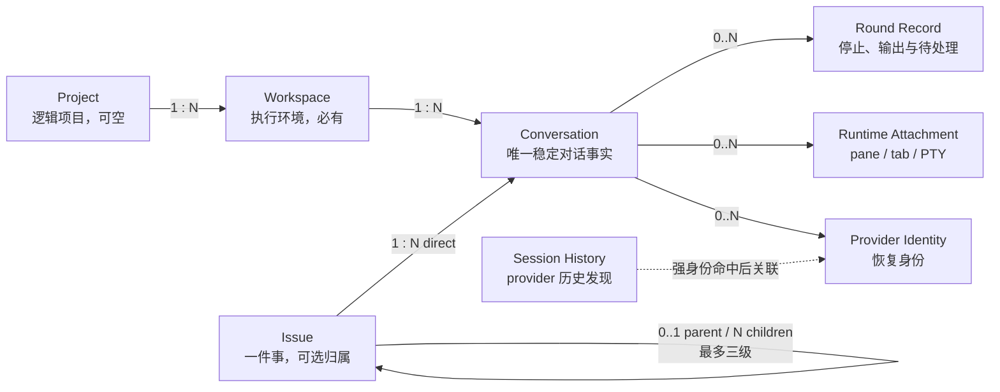
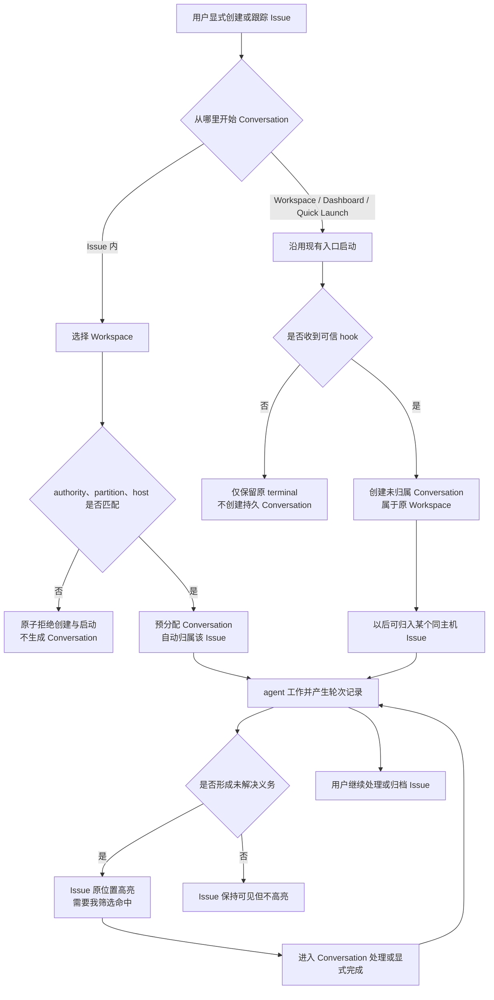

# 并行任务管理：Issue、Workspace 与 Conversation

产品方案 · 2026-08-24 · 目标态唯一有效说法  
规范数据模型：[`产品数据模型.md`](./产品数据模型.md)  
历史调研：[`调研-本地Issue机制.md`](./调研-本地Issue机制.md) · [`调研-对话与Issue绑定.md`](./调研-对话与Issue绑定.md) · [`调研-Activity现状.md`](./调研-Activity现状.md)

---

## 0. 摘要与结论

Orca 需要补的不是另一张 agent 状态看板，而是一层由用户维护的、可持久组织工作的 **Issue**。它把跨 Workspace、跨 Conversation、跨天的同一件事收在一起；现有 Project / Workspace 继续表示项目与执行环境，Conversation 是唯一的对话事实。

最终关系只有一套：



- 每个 Conversation **必须属于一个 Workspace**，并且**最多属于一个 Issue**。
- Conversation 的 Project 上下文由 Workspace 解析；它不是另一个可独立编辑、可能与 Workspace 冲突的 membership。独立 Folder Workspace 可以没有正式 Project。
- 一个 Issue 可以包含同一 authority DB、host partition 和 immutable authority execution host 下、多个 Workspace 中的多个 Conversation；持久 `executionHostId` 只允许 `local | ssh:<targetId>`，界面通过当前 `routeExecutionHostId` 呈现可访问主机。
- “全部主机”不是一棵可跨主机拖拽的全局树，而是多个 authority tree 的并列视图；每棵树有独立 host/profile 标题、顺序、加载与错误状态。
- Conversation 不选 Issue 是合法状态；启动 Conversation 不强制选 Issue。
- 持久 Conversation 只在 `Issues` 呈现。`Workspaces` 保持它原有的 pane / status 运行行，不做替换，也不因此另建一套对话事实。
- tab、pane、PTY、agent status 和 provider session 都不是 Conversation；它们分别是运行附件或恢复身份。
- 关闭 tab 只让 Conversation 脱离当前运行附件，不关闭、不删除 Conversation，也不改变其 Workspace、Project、Issue 或历史。
- 右侧 Session History 是 provider 历史发现与恢复入口，不是第二个 Conversation 事实库；扫描历史本身不得创建 Conversation。
- Issue 只能由用户显式创建或显式跟踪外部工作项，系统不自动创建。
- Issue 支持最多三级嵌套；父子 Issue 和 Conversation 绑定都必须落在同一个权威库、同一个 authority host partition，并具有相同的 immutable `executionHostId`。客户端当前如何路由到该权威副本由独立的 `routeExecutionHostId` 表达。
- 左侧常驻 `Workspaces | Issues` 根模式切换。`Issues` 是持久组织入口，不是 `WorktreeGroupBy` 的新值。
- `Issues` 内有 `全部 | 需要我 | 已归档`。所有进行中 Issue 始终能在 `全部` 中看到；`需要我` 是同一棵树的派生筛选。
- Activity 与 Agent Dashboard 首版保持 Orca 原样，不接入 Issue / Round Record，也不改变它们现有的已读语义；需要我只在 Issues 内闭环。
- 本地 Issue 首版可手工记录 GitHub、GitLab、Linear、Jira 等外部引用，但不做 provider 自动刷新、反向写入或原生层级同步。本地 Issue 不是第五个 `TaskProvider`，也不是 `WorkspaceLinkedItem.provider = 'orca'`。

## 1. 目标、范围与非目标

### 1.1 要解决的问题

用户同时推进多件事时，当前信息被切散在 Workspace、terminal pane、可恢复会话、外部 Issue、MR/PR 和文档中。每次介入都要重新回答：

1. 这条 Conversation 在做哪件事？
2. 同一件事还有哪些 Conversation、分布在哪些 Workspace？
3. 哪些事情现在需要我处理？
4. 子任务的进展是否已经影响父任务？
5. 切回来时，当前结论和关键证据在哪里？

### 1.2 产品目标

1. **一件事有稳定容器**：Issue 跨 Workspace、跨 Conversation、跨天存在。
2. **执行位置与事情分开**：Workspace 管环境，Issue 管工作，Conversation 连接两者。
3. **所有事情都可见**：默认显示全部进行中 Issue，需要处理的在原位置突出。
4. **注意力不重复计数**：子 Issue 待处理时，父行能感知，但不会把同一个待处理重复算两次。
5. **本地与外部统一使用**：用户不需要先决定“这是 Orca Issue 还是 GitHub Issue”，但系统必须尊重各自的数据权威。
6. **历史可找回**：Issue 详情、Conversation 的持久记录和现有 Session History 共同支持跨天恢复上下文。
7. **同一对话只有一个身份**：关闭、恢复、切换 Sidebar 模式都不复制 Conversation；跨 Workspace 继续则明确创建新 Conversation。

### 1.3 非目标

- 不做 Todo / Doing / Done 看板、甘特图、依赖调度或自动项目管理。
- 不用 Issue 接管 Workspace、worktree 或 folder workspace 的创建、归档和清理。
- 不自动从 prompt 猜 Issue，不自动合并 Issue，不强制启动前选 Issue。
- 不把本地 Issue 塞进 GitHub / GitLab / Linear / Jira 的 provider 拉取体系。
- 不把父子 Issue 做成状态联动：父子独立归档、独立处理。
- 不让 Activity 或 Agent Dashboard 成为第二个 Issue 事实源。
- 不让 Issues 与 Session History 各自维护一套 Conversation；Workspaces 不参与 Conversation 事实。
- 不把 tab 关闭、provider 停止或启动失败压成 `Conversation.state = closed`。
- 不承诺自动发现全部产物或自动生成可信“下一步”。

### 1.4 首版范围与主动取舍

首版只交付能证明核心模型成立的最小闭环：

1. Orca 为被记录的交互式 agent Conversation 分配稳定身份：Issue 内显式启动先预分配，
   普通 Workspace 启动在首个可信运行证据到达时创建；
2. Conversation 必属 Workspace，可选绑定一个同主机 Issue；
3. 本地 Issue 支持 CRUD、最多三级嵌套、归档、删除约束和“需要我”；
4. 持久 Conversation 只在 Issues 显示，Workspaces 一行不改；
5. 关闭 pane / tab 只移除运行态映射，Conversation 仍可从原 Workspace 或 Session History 恢复；
6. 本地与远端 authority 在线时均可读写，并通过 capability 明确不支持的旧主机；capability
   只表示协议支持，DB、hook evidence 与 bootstrap 当前是否健康由独立 readiness 表达。

首版包含两层范围：

- **核心业务闭环**：Conversation / Issue / Round 的稳定事实，以及 Issues 视图、详情、绑定和恢复。
- **不替换任何现有 UI**：Workspaces 的 agent 对话行保持原样。Activity、Dashboard、通知、移动端和 Project transfer 同样不接入 Issue。

为了降低长期 fork 对上游热点文件的侵入，首版明确做以下取舍：

| 能力 | 首版处理 | 原因 |
| --- | --- | --- |
| Round 正文 | 保存停止类型、义务状态和带完整性标记的有界预览；预览绝不标成全文 | 足以支持“需要我”和时间线，同时不侵入 provider transcript 全量对账 |
| 普通 Workspace 启动 | 首个可信 hook/status 到达后创建未归属 Conversation；无可信证据时只保留 Orca 原 terminal，不伪造持久记录 | 复用 latest main 的 hook snapshot/订阅链，避免改 PTY 与 main-window service 热点 |
| 外部 Issue | 只保存用户显式录入的 provider、编号和 URL 快照 | 避免修改多个 provider client 与后台刷新链 |
| Activity | 保持 Orca 原实现，不显示 Issue Round，不修改 `readAt` | 避免两套实现同时争夺 Activity 已读语义 |
| Agent Dashboard | 保持 Orca 原实现，不增加 Issue chip 或 Issue ack | Dashboard 不是核心组织入口 |
| 通知 | 不新增 Issue / Round 通知；现有 agent 通知不变 | 避免侵入通知抑制、窗口可见性和跨端路由 |
| 移动端 | 不提供 Issues 页面 | 桌面端闭环稳定后再设计移动信息密度与冷启动 |
| 搜索 | 只做 Issues 当前已加载标题的本地筛选 | 不建全局 FTS，不索引 Round 正文 |
| 整理稿 | 不做自动生成、确认和失效状态机 | 不引入文本生成执行链和额外持久状态 |
| 离线远端 | 主机不可达时显示不可用，不展示旧缓存、不排队写入 | 避免离线 cache、route index 和双向对账 |
| Profile Project move | 有受影响 Conversation 时阻止 move；copy 不复制 Issue 数据 | 先保证不产生半迁移，不实现跨库 journal |
| Forge migration | 不纳入首版 | 与核心用户闭环无关，单独立项迁移 |

这些取舍不改变核心数据关系。后续能力只能在不复制 Conversation、Issue 或 read 状态的前提下增量接入。

## 2. 信息架构与用户用户路径

### 2.1 左侧入口

Sidebar 顶部使用常驻根模式切换：

```text
┌──────────────────────────────┐
│  Workspaces  |  Issues    ＋ │
├──────────────────────────────┤
│  当前模式对应的列表与工具栏   │
└──────────────────────────────┘
```

- `Workspaces`：完全保持现状——Project / Workspace 列表、分组、状态列、创建和清理能力，以及 Workspace 下的 agent 对话行，一律不动。
- `Issues`：显示 Issue 树、Conversation 和注意力状态。
- 切换是 Sidebar 的根模式，不改变当前主内容；再次选择同一项时打开对应详情。
- `＋` 的行为跟随模式：Workspaces 下创建 Workspace，Issues 下由用户创建本地 Issue 或记录外部 Issue。
- 两种模式各自记住展开、滚动和选中状态，来回切换不丢空间记忆。

Issues 只改变组织方式，不改变对象；Workspaces 不参与：

```text
同一 conversationsById
  └─ group by issueId → Issues（issueId 为空的进「未归属」区）

workspaceRef
  → 单向引用：在 Issues 中显示归属、解析 Project、恢复时校验目标 Workspace
  → 不产生 Workspaces 侧的任何渲染

pane / tab / PTY / agent status
  → 只作为 runtime overlay 叠加到对应 conversationId
```

绑定或改绑 Issue 只改变它在 Issues 中的归类，对 Workspaces 的显示没有任何影响。

Issues 模式顶部固定：

```text
全部 | 需要我 | 已归档     全部主机 ▾     筛选标题
```

层级是每个 authority partition 内的主结构。主机选择复用 Workspaces 已有 host scope；“全部主机”
按 host/profile 标题依次展示多棵独立树，不能跨标题拖拽。首版不增加类型、来源等复合筛选或第二种
业务分组方式。

### 2.2 主用户路径



### 2.3 三个典型场景

**跨仓需求**

- Issue「画布 Agent 一期」下有前端 Workspace 的两条 Conversation、BFF Workspace 的一条 Conversation、文档 Workspace 的一条 Conversation。
- Issue 页面按 Workspace 展示这些 Conversation，但 Workspace 列表是从 Conversation 派生，不是另一张手工维护的绑定表。

**从 Workspace 直接开工**

- 用户在 Workspace 中直接启动 Conversation，不强制先选 Issue。
- 首个可信 hook 到达前仍只是 Orca 原 terminal；不会为了填 Sidebar 先写一条无法证明的 Conversation。
- 可信 hook 确认后，它才在 Issues 模式显示于“未归属”区；Workspaces 侧仍是它原有的 agent 行，不受影响。
- 用户确认它属于某件事后再归入 Issue，整条 Conversation 的已有历史一起移动。

**父子任务**

- 根 Issue「画布 Agent 一期」下面有子 Issue「Cloud Agent SDK」和「编辑器接入」。
- 子 Issue 的待处理会让父行显示“后代 1”，但全局徽标只计算真正有未解决义务的子 Issue。
- 父 Issue 可以有自己的 Conversation，不要求所有工作都落到叶子。

## 3. 对象模型

### 3.1 Project、Repo 与 ProjectGroup

三者不是同一个概念：

| 对象 | 职责 | 是否决定 Conversation 归属 |
| --- | --- | --- |
| Project | 用户长期维护的逻辑项目；可跨主机拥有多个 `ProjectHostSetup` | 通过 Workspace 间接决定 |
| Repo | Git、文件系统、Source Control 和 Worktree 的执行与兼容基础 | 旧数据可作为兼容上下文，不直接成为正式 Project |
| ProjectGroup | Sidebar 中组织 Repo / Folder Workspace 的显示分组 | 否；移动分组不改变 Conversation |

Conversation 不保存一个可独立编辑的 `projectId` membership。其 Project 上下文必须满足：

```text
effectiveProjectRef = resolveProject(conversation.workspaceRef)
```

- Worktree Workspace 通常经 Repo / `ProjectHostSetup` 解析到正式 Project。
- 旧 Worktree 只有 Repo 时，先显示为 legacy repo context，不把 `repoId` 冒充正式 `projectId`。
- 独立 Folder Workspace 可以没有正式 Project；它位于某个 ProjectGroup 下也不会因此获得 Project 归属。
- Workspace 删除后可保留 Project / Workspace 名称与路径快照，但快照不能反向改写当前归属。

### 3.2 Workspace

Workspace 是 Conversation 的强制执行环境，沿用 Orca 现有语义：

- Git worktree 和 folder workspace 都是一等 Workspace。
- Workspace 有自己的执行主机、路径、终端、文件、Source Control、状态列和生命周期。
- 每个 Conversation 必须属于恰好一个 Workspace；普通编辑不能静默改写它的 `workspaceRef`。
- Issue 不拥有 Workspace，也不影响 Workspace 的归档或清理。
- Workspace 被归档、删除或暂时不可达后，Conversation 和 Issue 历史仍保留；界面显示 Workspace 快照和不可用状态。

### 3.3 Conversation

Conversation 是一次可继续、脱离当前 UI 后仍保留、并可恢复的 agent 对话。首版只由 Issues 引用；未来 Workspaces、Activity、Dashboard 或通知如需接入，也只能引用它，不能再创建另一套对话事实。

| 字段 | 产品语义 |
| --- | --- |
| `conversationId` | Orca 分配的稳定身份，贯穿活 pane、关闭后的历史与恢复 |
| authority host partition | 持有 Conversation、Issue 绑定和 Round Record 权威副本的稳定主机分区 |
| `executionHostId` | authority 侧不可变的执行主机身份；只允许 `local | ssh:<targetId>`，创建后不可被普通 mutation 改写 |
| `routeExecutionHostId` | 客户端导航和缓存使用的路由；例如远端配对的 `runtime:<environmentId>`，不发给 authority 充当持久关系键 |
| `workspaceRef` | 必填且普通操作不可变；指向一个 worktree 或 folder workspace |
| `effectiveProjectRef` | 从 `workspaceRef` 解析的只读 Project 上下文；可以为空 |
| `agent` | agent 类型 |
| `issueId` | 可选；为空就是未归属，允许 bind / rebind / unbind |
| `title` | Issues Sidebar 与 Issue 详情共用的显示标题 |
| `recordRevision` | 只在该 Conversation 自身可编辑字段变化时递增；用于阻止并发覆盖，不随其他 Conversation 的 Round 变化 |
| `launchFailure` | 可选的失败时间与有界错误摘要；不等于 Conversation 被关闭，可由同一 Conversation 的重试清除 |

Conversation 主记录不保存 pane key、tab ID、PTY ID、provider session ID、transcript path 或 agent status。这些分别属于 Runtime Attachment 或 Provider Identity。

身份规则：

1. 从 Issue 内显式启动时，先原子校验 Issue、Workspace、authority、host partition 和
   immutable execution host；校验失败不创建 Conversation/claim，也不调用 launcher。校验成功
   后才在调用现有 agent launcher 前创建 `conversationId` 和短期 launch claim；这样即使启动
   未被运行证据确认，用户显式创建的工作记录仍存在。
2. 从普通 Workspace、Dashboard 或 Quick Launch 启动时，不强制先选 Issue、也不先调 Issue RPC；首个能够确认
   Workspace、当前 authority 和 provider identity/session boundary 的可信 hook 到达后，才创建
   未归属 Conversation。
3. `launchToken` 只关联一次待确认启动。同一 shell 后续进程可能继承它，所以 claim 被消费、
   过期或 authority 作废后，token 不能继续把新 provider session 归入旧 Conversation。
4. provider session 尚未到达时，Issue 内预分配可暂时只保留 launch claim；到达后原子补上
   Provider Identity。普通启动没有足够身份或 session boundary 时不猜测创建。
5. 恢复已记录的 session 时，只有强身份唯一命中且目标仍是原 Workspace，才复用原
   `conversationId`。
6. Pi、Prime Agent 等依赖文件身份的 provider 必须连同规范化 transcript path 判断 identity，
   不能只比较 session ID。
7. scrape-only agent 即使无法跨关闭恢复，已经落盘的 Conversation 与 Round Record 仍保留；UI
   明确显示“历史存在，但无法自动恢复”。从未产生可信证据的普通启动不会伪造这条记录。
8. Conversation 改绑 Issue 时只改 `issueId`，历史、Workspace、Project 上下文和
   `conversationId` 都不变。
9. 预分配后 launcher 失败或 claim 超时，重试必须复用原 `conversationId`，只创建新的短期
   claim；已经存在 Provider Identity、Round Record 或当前运行附件时，不允许走“重试启动”。
10. 用户可以显式“忘记此 Conversation”。提交前必须展示将删除的 Orca 侧 Round、identity 和
    Issue 绑定，running / waiting 或仍有附件时拒绝；操作不删除 provider transcript，之后用户显式 Resume
    同一 provider session 时可重新记录为新的 Conversation。

首版不引入独立的“关闭 Conversation”业务动作，也不把 `active | closed` 放进目标模型：

- 关闭 tab / pane：只 detach Runtime Attachment；
- provider 结束：改变运行态，不改变 Conversation 身份；
- 启动失败：只写 `launchFailure`，重试仍使用同一 Conversation；
- 历史折叠：只是查询与展示策略；
- 忘记 Conversation：必须是显式、高风险的数据操作，且不能作用于 attached / running 对话。

### 3.4 Runtime Attachment

Runtime Attachment 表示 Conversation 当前通过哪个运行容器展示或执行，例如 pane、tab、PTY、connection 和实时 agent status。

```text
Conversation 1 ── 0..N Runtime Attachment
```

- 一个普通 shell tab 可以没有 Conversation。
- 一个 split tab 可以有多个 agent pane，每个 pane 分别映射自己的 Conversation。
- 关闭 pane 只移除附件；Conversation、Issue 绑定、Round Record 和 Provider Identity 都保留。
- 运行附件可以重建、晚到或失效，因此不能作为 Sidebar 行身份或持久主键。
- 首版附件由现有 hook 的 pane、tab、worktree、connection 与 provider identity evidence
  重建；不要求 PTY 或 main-window service 增加 Issue callback。

用户可见状态由正交事实派生，而不是一个含混枚举：

| 维度 | 状态 |
| --- | --- |
| 附着 | attached / detached |
| 可恢复性 | resumable / unavailable |
| 执行 | launching / running / waiting / stopped / failed |
| Workspace 可用性 | available / unavailable |

### 3.5 Provider Identity 与 Session History

Provider Identity 是已记录的 Conversation 与 provider session 的稳定映射，包含 agent、provider session key / id，以及 provider 需要的 transcript path 或 resume locator。

右侧 Session History 中的 `AiVaultSession` 则是扫描 provider transcript、session 文件或数据库得到的历史发现。两者边界是：

| 对象 | 是否是 Conversation 事实 | 作用 |
| --- | --- | --- |
| `ConversationRecord` | 是 | Workspace / Issue 归属、历史与稳定导航 |
| `ConversationProviderIdentity` | 是，属于 Conversation 的身份映射 | 精确恢复原 Conversation |
| `AiVaultSession` | 否 | 浏览 provider 历史、预览、恢复或首次记录 |

扫描 Session History 本身不创建 Conversation，也不把历史自动灌入 Workspaces、Issues、Activity 或未读统计。未记录的历史只有在用户首次显式恢复，或运行时拿到可唯一确认的强身份时才创建 Conversation；后续恢复同一 identity 必须稳定复用。

prompt 唯一匹配只能帮助用户临时跳回可见 pane，不能持久写入 identity mapping。

### 3.6 Issue

Issue 是“一件事”的稳定容器，核心字段由 Orca 保存：

- 内部稳定 `issueId`
- authority DB、host partition 与 immutable `executionHostId`；客户端另外保存当前 `routeExecutionHostId` 以访问和显示主机
- 本地或外部来源
- Orca 侧进行中 / 已归档状态
- 可选类型、备注
- 父 Issue、同级顺序
- 直接 Conversation 与基于 Round Record 的简要时间线

Issue **没有默认的 Workspace 归属字段**。其 Workspace 列表由直接 Conversation 的 `workspaceRef` 去重得到。这样不会出现“Issue 说属于 Workspace A，但所有 Conversation 都在 Workspace B”的双事实。

从某个 Workspace 创建 Issue 时，可以把该 Workspace 作为“启动第一条 Conversation”的默认建议，但不因此建立独立归属。若以后需要固定 Workspace，只能明确建模为启动快捷方式，不能混入 Issue membership。

### 3.7 本地与外部 Issue

本地 Issue 和手工记录的外部 Issue 使用同一套树、Conversation 绑定与注意力。首版的“外部 Issue”只是一个本地 Issue 加外部引用快照，不连接 provider API：

| 字段 | 本地 Issue | 外部 Issue |
| --- | --- | --- |
| `issueId`、主机、父子、顺序 | Orca 权威 | Orca 权威 |
| Conversation 绑定、备注、归档 | Orca 权威 | Orca 权威 |
| 标题 | Orca 权威 | 用户录入的本地快照 |
| provider、编号、URL | 无 | 用户显式录入，Orca 原样保存 |
| provider 状态与原生父子关系 | 无 | 首版不读取、不同步 |

关键规则：

- 本地 Issue 是独立 `IssueRecord`，不是 `WorkspaceLinkedItem.provider = 'orca'`。
- 外部 Issue 通过显式“记录外部引用”进入 Orca；用户填写 provider、编号和 URL，可同时修改标题快照。
- 首版不调用 GitHub、GitLab、Linear 或 Jira adapter，不自动刷新标题、状态或父子关系。
- Orca 的进行中 / 已归档状态完全独立；归档 Orca Issue 不修改外部系统。
- 本地与外部 Issue 都可以成为 Orca 树中的父或子。
- provider 原生 hierarchy 首版不读取；Orca 树只由用户维护。

### 3.8 轮次记录与“需要我”

每次可确认的真实停止固化一条 Round Record。首版只用它支撑 Issue 时间线和注意力计算，不替换 Activity 的现有数据源。

每条记录包含：

- 所属 `conversationId`
- 完成、提问、审批等待或阻塞
- 领域层一级类型为 `completion | waiting`；提问、审批等待和阻塞是 `waiting` 的可见原因，不各自发明一套处理状态
- 有界的用户输入、agent 输出或待答问题预览
- 明确引用的文件与链接
- 发生时间、采集来源
- 用户输入、agent 输出和待答问题分别拥有预览完整性：`not-captured` / `runtime-preview` /
  `reconciled-preview`
- `readAt`：用户看过
- `resolvedAt` 与 resolution：这项义务已结束

三个概念必须分开：

- **执行状态**：Conversation 当前运行中、等待、停止或不可用。
- **已读**：用户是否看过一条记录。
- **已解决**：这条记录是否还要求用户采取行动。

“需要我”是派生结果，不是可任意写入的 Issue 状态：

- 等待型记录在同一 provider identity 出现时间更晚的 authoritative working/completion 时客观解除；
  仅关闭 pane/tab、连接断开或进程消失不能证明义务结束，必须继续保留或由用户显式处理。
- 完成型记录由用户发送下一条输入、显式点“处理完成”或归档 Issue 时解决。
- 打开、选中或标已读不能解决义务。
- 同一 provider turn / transcript fact 的重复 hook 和后续对账只升级同一条 Round，不新增义务。
- 首版不建模 execution chain 或 supersession。不同 turn 的后续完成不能仅按时间解决旧完成；没有
  明确新输入时宁可保留待处理，也不推断“已被取代”。未来只有 provider 普遍提供可靠 lineage
  后，才单独设计 supersession。

Orca 不复制完整 provider transcript。首版每个文本字段只保存固定上限的预览：

- hook 运行态消息只能标记为 `runtime-preview`，即使没有触及长度上限，也不能推断为完整全文。
- reconciler 从 provider transcript 得到更稳定的有界片段时，最多标记为 `reconciled-preview`。
- 无可用预览时标记为 `not-captured`，但停止类型、时间、`readAt`、`resolvedAt` 和未解决义务仍然保留。
- 首版没有“完整全文”状态、正文读取 RPC 或正文留存/清理状态机。
- 查看完整历史继续复用 provider 的 Session History / transcript 能力，不在 Issue DB 中复制一份档案。

### 3.9 首版不做整理稿与产物聚合

首版 Issue 详情只展示标题、备注、层级、直接 Conversation、子 Issue 和有界 Round 时间线。

自动整理稿、确认版本、过期状态、父子摘要上卷和产物聚合全部延后。原因不是数据模型不允许，而是这些能力会引入文本生成、全文读取、额外状态机和更多主干改动点；在 Conversation / Issue 核心闭环稳定前，它们不值得承担长期 fork 成本。

## 4. Issue 层级

### 4.1 树规则

- 最多三级：根 Issue → 子 Issue → 孙 Issue。
- 禁止自己作为父，禁止环。
- 正式父子必须同一个权威库、同一个 authority host partition，且创建时固化的 `executionHostId` 相同；客户端路由别名不能替代这三项校验。
- reparent 移动整个子树；提交前校验整个子树的新深度。
- 同级顺序按 parent 作用域保存；根 Issue 使用独立 root scope。
- 拖拽只提交一次主机侧原子变更，不能对多个节点 `Promise.all` 分别更新。
- 无效落点在拖动时给出原因：跨主机、会形成环、超过三级或目标不可编辑。

### 4.2 生命周期独立

- 父归档不归档子；子全部归档也不自动归档父。
- 父处于已归档、子仍进行中时，子仍显示在 `全部`；已归档父作为 dimmed、context-only 的祖先路径。
- 父和子可以分别有 Conversation 和未解决义务。
- 删除父 Issue 绝不级联删除子 Issue。删除前必须选择：
  - 提升到被删父的上一层；
  - 改挂到另一个合法父；
  - 解除父关系成为根 Issue。
- 删除有直接 Conversation 的 Issue 前，必须选择把 Conversation 解绑或整体移到另一个同主机 Issue；Conversation 历史不随 Issue 删除。

### 4.3 注意力聚合

Issue 行区分：

- `own attention`：本 Issue 直接 Conversation 中的未解决义务数。
- `descendant attention`：后代 Issue 中命中的 Issue 数。

全局 Issues 徽标按“有 own unresolved obligation 的 Issue 数”计算：

- 子 Issue 有 2 条待处理，父只有 descendant attention：全局计 1，不计 2。
- 父和子各有待处理：全局计 2。
- 折叠父仍显示 descendant attention。
- `需要我` 筛选命中子时保留祖先路径；祖先标为 context-only，不伪装成自己待处理。

## 5. Issues 模式

### 5.1 列表结构

Issue 行保持 quiet、dense、monochrome，遵循 `docs/STYLEGUIDE.md`：

```text
▾ 画布 Agent 一期                 自身 1 · 后代 2
  ├─ ▾ Cloud Agent SDK            后代 1
  │   └─ MR 1522 review           需要我 1
  └─ 编辑器接入                   运行中 2
```

一行包含：

- 展开箭头与层级线
- 标题
- 本地编号或外部 provider 标识
- own / descendant attention
- 直接 Conversation 的运行摘要
- 已归档、运行主机不可达或预览不完整等低噪声状态

展开 Issue 后只显示**直接 Conversation**，按 Workspace 分组；子 Issue 仍作为树节点显示，不把所有后代 Conversation 混成一张列表。

### 5.2 三个筛选

| 筛选 | 内容 |
| --- | --- |
| `全部` | 所有进行中 Issue，保持树与同级顺序；为活动子节点补齐已归档祖先上下文 |
| `需要我` | 命中的 Issue + 必要祖先路径；不复制节点、不改顺序 |
| `已归档` | 已归档 Issue，仍保留层级上下文；活动子节点仅作为关系提示，不混入归档结果 |

筛选不改变事实，不产生第二套列表数据。首版搜索只匹配当前已加载结果中的 Issue 标题、外部编号和 Conversation 标题；不提供类型、来源、主机组合过滤。

### 5.3 未归属 Conversation

Issues 树底部有一个固定“未归属”虚拟区：

- 它不是 Issue，不参与层级、归档或 Issue 数量统计。
- 默认只显示摘要；展开后按 Workspace 列出 Conversation。
- 未归属 Conversation 的未解决义务不会丢：该区显示独立提示；现有 agent 通知是否发送仍由 Orca 原逻辑决定。
- Issues 主徽标只数 Issue；未归属区用独立圆点/计数，避免把它伪装成一个 Issue。
- 归入 Issue 时移动整条 Conversation 与全部 Round Record。
- 已结束且无未解决义务的未归属 Conversation 可折入该区的历史分段，首版不承诺全局搜索。

### 5.4 Issue 详情

详情页按“直接工作 → 子任务 → 历史”组织：

| 区块 | 内容 |
| --- | --- |
| 标题区 | 层级 breadcrumb、来源、主机、进行中/已归档、own/descendant attention |
| 直接 Conversation | 按 Workspace 分组；运行状态、最新输出、待处理、继续或打开 |
| 子 Issue | 只列直接子；状态、own/descendant attention |
| Workspace | 从直接 Conversation 派生；只读展示，不提供 Issue 级所有权操作 |
| 时间线 | 直接 Conversation 的有界 Round preview；明确显示完整性、已读与处理状态 |
| 外部引用 | 用户保存的 provider、编号、URL 和标题快照；点击跳转外部系统 |
| Conversation 管理 | 失败/未确认时重试；符合预检的 detached Conversation 可“忘记”，并明确 provider transcript 不受影响 |

父 Issue 页面必须把“本 Issue 的 Conversation”和“后代汇总”分开，不能把后代记录混成父自己的历史。

改绑、reparent、归档和重开直接反映在当前 Issue / Conversation 状态中。首版不保存通用 `issue_events`，也不把结构变化伪装成可回放的历史时间线。

## 6. 创建、绑定、归档与删除

### 6.1 创建与跟踪

- 本地 Issue 只能由用户点击创建。
- 创建必填标题和执行主机；类型、父 Issue、备注均可选。
- 从 Issue 下创建子 Issue 时默认同主机，并在提交前校验三级上限。
- 记录外部 Issue 由用户显式填写 provider、编号、URL 和标题快照；系统创建 Orca `IssueRecord` 作为本地的组织记录。
- 系统不自动复用、合并或创建 Issue。

### 6.2 Conversation 绑定

| 入口 | Issue 行为 |
| --- | --- |
| Issue 详情“新建 Conversation” | 先选 Workspace并完成同 authority/partition/host 校验；成功后预分配 Conversation 并自动绑定当前 Issue，失败则不启动 |
| Workspace / Dashboard / Quick Launch | 不增加 Issue 选择步骤；可信 hook 到达后创建为未归属 |
| 恢复已有 Conversation | 保留原绑定；没有绑定则保持未归属 |
| automation / orchestration | 零交互、默认未归属；若调用方需要绑定 Issue，先走同一 Conversation 预分配接口，再把既有 launch token 交给原启动链 |

绑定校验：

- Conversation 与 Issue 必须在同一权威库、同一 authority host partition，且创建时固化的 `executionHostId` 相同。
- 一个 Conversation 同时最多绑定一个 Issue。
- 改绑是单次原子更新，历史整体移动。
- **新启动校验失败**：不创建 Conversation/claim，不调用 launcher，不能静默取消 Issue 后继续。
- **既有 Conversation bind/rebind 失败**：整次 mutation 不写入，保留原 `issueId`（原本未归属则仍未归属），并显示原因。

### 6.3 打开、关闭、恢复与跨 Workspace 继续

四个动作必须明确区分：

| 用户动作 | Provider session | Workspace | `conversationId` | 结果 |
| --- | --- | --- | --- | --- |
| 点击已有 Conversation，pane 仍在 | 不变 | 不变 | 不变 | 聚焦现存 pane |
| 关闭 tab / pane | 不变或随后停止 | 不变 | 不变 | 只 detach，Conversation 继续存在 |
| 在原 Workspace 执行 `Resume Session` | 复用原 session | 不变 | 复用原 ID | 创建新 Runtime Attachment |
| 在另一个 Workspace 执行 `Continue in New Session` | 创建新 session | 改变 | 创建新 ID | 新 Conversation，可保留来源线索 |

启动失败与数据删除另外遵守：

- **重试启动**：只适用于尚无 Provider Identity、Round Record 和 Runtime Attachment 的预分配
  Conversation；原 Workspace、agent、Issue 与 `conversationId` 不变，新建一次性 claim 并清除旧
  `launchFailure`。已有未过期 claim 时禁止重复重试。
- **忘记此 Conversation**：先展示 Orca 将删除的 Issue 绑定、Round 数、未解决数和恢复身份；
  attached / running / waiting 时拒绝。确认后删除 Orca 的 Conversation、claim、identity 与 Round，
  不删除 provider transcript。删除后再 Resume 该 provider session，视为一次新的显式记录。
- **并发保护**：重试、改名、改绑和忘记均携带当前 `recordRevision`；过期时刷新后由用户重试，
  不能用 authority 全局 revision 让无关 agent Round 阻断编辑。

`Resume Session` 只允许回到已映射 Conversation 的原 `workspaceRef`。如果当前选中的 Workspace 不同，界面不能把同一 provider session 强行 resume 过去，而应：

1. 禁用或隐藏该目标下的 Resume；
2. 提供 `Continue in New Session`；
3. 复用 Orca 现有 continuation 能力，把必要上下文带入新 provider session；
4. 创建新 Conversation，并允许默认沿用原 Issue，但仍执行新 Workspace 所在 authority / host partition 的绑定校验。

未记录的 Session History 条目没有原 `conversationId`：

- 仅浏览或扫描时仍不是 Conversation；
- 首次显式 Resume 时，以实际目标 Workspace 创建 Conversation 并绑定 provider identity；
- 首次选择 Continue 时创建全新 provider session 与 Conversation，不把来源 session 冒充为该 Conversation 的恢复身份。

恢复时如果 Workspace 已删除、不可达、provider identity 歧义或 transcript 不可读，显示明确原因；不能靠相似 prompt 猜测合并，也不能静默在当前 Workspace 新建后声称“恢复成功”。

### 6.4 归档与重开

归档表示“退出活跃视野”，不删除 Conversation、Workspace 或 Round Record。

- 有未解除的等待型义务，或任一直接 Conversation 的当前权威运行态仍是 waiting / blocked 时，不能直接归档：先进入 Conversation 处理，或显式结束/放弃该等待。
- 运行中的 Conversation 不阻止归档，也不会被隐式停止。
- 归档后若产生 `occurredAt > archivedAt` 的新停止记录，Issue 自动重开。
- 归档前已经发生、之后延迟到达的普通历史只补记录，不触发重开；但如果延迟到达的是 waiting / blocked，且当前权威运行态仍指向同一个停止事实，则无论原始时间是否早于归档都必须重开，不能隐藏仍在等待用户的 Conversation。
- 归档父不影响活动子；活动子仍通过 dimmed 祖先路径可见。

### 6.5 删除

- 删除只删除 Orca 的 Issue 组织记录，不删除 Workspace、Conversation transcript 或 provider 数据。
- 子 Issue 必须先 promote / reparent / detach，绝不级联。
- 直接 Conversation 必须先解绑或移动，绝不随 Issue 删除。
- UI 明确说明：删除 Orca 副本不会删除 provider transcript；能定位时显示 transcript 路径。

### 6.6 跨 Profile 复制与移动 Project

首版不迁移 Issue / Conversation 工作事实，也不扩展现有 Project transfer：

- **复制 Project**：沿用 Orca 原行为；不复制 Issue、Conversation、Round Record、已读或解决状态。
- **移动 Project**：现有 transfer IPC 在调用 Project transfer 本体前，通过窄只读 `IssueProjectMoveGuard` 查询受影响 Conversation；命中时阻止移动并解释原因。用户可以保留原 Profile，或逐条“忘记”受影响 Conversation 后再移动。
- guard 结果必须提供受影响 Conversation 的管理入口；用户逐条“忘记”后可重新尝试 move，不能给出产品中不存在的解除建议。
- 没有已记录的 Conversation 时，Project move 继续使用 Orca 原流程。
- guard 不修改 transfer payload、copy/move 写入流程或 transfer 本体；查询失败时 move fail closed，copy 不查询也不受影响。
- remote runtime Project 仍按现有配对和远端 authority 行为处理；首版不为 Issue 增加离线 cache 或跨 Profile 重连迁移语义。

这是主动取舍：跨 JSON 与 SQLite 做可恢复的完整迁移需要 closure planner、journal、冲突处理和崩溃恢复，改动面远大于核心价值。首版宁可明确阻断，也不发布会产生半迁移的实现。

## 7. Activity、Agent Dashboard 与现有通知

### 7.1 Activity

Activity 首版完全保持 Orca 原实现、原数据源和原已读语义：

- 不展示 Issue Round Record 或 Issue 生命周期事件；
- 不增加 Issue / Workspace 筛选；
- 不把 pane 级 Activity ack 迁移成 Round `readAt`；
- 不把 Activity 变成 Issues 的另一种入口。

因此首版暂时存在两个互不互写的“看过”概念：Orca 现有 Activity ack 和 Issues 内 Round `readAt`。它们服务不同功能，不宣称同源；后续若要整合，必须以“换数据源并删除旧语义”为独立项目，不能长期双写。

### 7.2 Agent Dashboard

Agent Dashboard 首版完全保持运行时监控，不增加 Issue chip、Issue 跳转或 Round ack：

- 展示和计数继续以 agent / pane 为单位；
- Dashboard 现有 ack 不写 Issue Round 的 `readAt` 或 `resolvedAt`；
- Issue 归属和“需要我”只在 Issues 入口处理。

三者分工：

| 入口 | 回答的问题 | 主组织 |
| --- | --- | --- |
| Workspaces | 我在哪个环境里工作？ | Workspace |
| Issues | 我在推进哪些事情，哪些需要我？ | Issue 树 |
| Activity | Orca 现有的最近运行事件 | 现有 pane / event |
| Agent Dashboard | 现在哪些 agent 在哪里运行？ | agent / pane |

### 7.3 现有通知

现有 agent 通知保持原样。首版不新增 Issue / Round 通知 payload、不改抑制规则、不接移动端路由。Issues 内的“需要我”是用户主动打开后的组织能力，不承诺系统级提醒。

## 8. 首版查询、远端与延后能力

### 8.1 查询

Issues 模式只对当前已加载的 Issue 标题、外部编号和 Conversation 标题做内存筛选：

- 不建 SQLite FTS；
- 不搜索 Round 正文、Workspace 路径、产物或完整 provider transcript；
- 不承诺跨 authority 全局搜索；
- 已归档内容只在切到“已归档”后参与当前列表筛选。

### 8.2 跨主机读取

- Issue、Conversation 和 Round Record 的权威副本位于负责该 authority host partition 的 Orca runtime，并按**该 owning runtime 当前激活的 Orca profile**隔离。
- 每个 host/profile authority 在 Issues 中有独立标题行。标题至少包含客户端已有 host label；远端
  可提供时附加 profile display name。`authorityId` 才是缓存身份，display name 只用于解释。
- remote runtime 收到 `runtime:<environmentId>` 路由后使用自己的 `local` partition 保存权威数据；该 runtime 路由不能写入 Issue 或 Conversation 的 `executionHostId`。
- direct SSH workspace 的权威数据保存在建立 SSH 连接的 Orca runtime 中，分到对应 SSH partition；Node 18 SSH relay 只转发执行和证据，不保存 Issue 权威库。
- 首版只支持单跳 route：本机 local、本客户端直接管理的 SSH target，或配对 remote runtime 的 local partition；不支持从一个客户端经 remote runtime 再二跳到该 runtime 管理的 SSH target。
- 客户端 route 只决定请求发到本机还是某个配对 runtime；RPC 内只发送该 authority 的 `local | ssh:<targetId>` 分区选择，返回值不回显客户端相对的 runtime alias。
- 客户端显示远端 Workspace 下的 Conversation 时，把本次请求 route 与返回 authority descriptor 配对，再按 `workspaceRef` 关联；不能把客户端 `runtime:*` 与持久 `local` 直接比较。
- 客户端 profile 不会作为普通 RPC 参数去选择远端数据库；切换客户端 profile 会切换本地 Project 引用和界面状态，但安装级 runtime 配对目录仍共享。能否读取同一远端 authority 由该共享配对、认证和远端当前 active Profile 共同决定。
- 同一路由返回新的 `authorityId` 时，表示远端 profile / authority 已切换：旧树立即失效并显示
  “远端工作上下文已切换”，完成新快照前不得继续展示旧事实或写入。
- 正式父子和 Conversation binding 不跨权威库、host partition 或 immutable execution host。
- 首版不创建跨主机正式关系；用户只能在备注或外部 URL 中保留单向人工线索，它不参与层级或注意力聚合。
- 不可达主机显示“当前不可用”；首版不展示旧缓存、不排队写操作、不假装成功。
- 加载中、不支持和失败分别展示，不能把未知显示为 0。
- capability 缺失显示 `unsupported`；capability 存在但 DB 不可用显示 `unavailable`；DB 可用但
  hook evidence 被关闭或启动失败显示 `degraded`，此时 Issue CRUD 可用，普通 Workspace 启动不创建。
- 新客户端连接不支持 Issues 的旧 runtime 时明确提示升级；老客户端忽略新数据时，只承诺主机数据保留、升级后可见。

### 8.3 明确延后

以下能力不属于首版验收，也不得以“顺手接入”为由扩大主干改动：

- Activity 换数据源与 Dashboard Issue 化；
- Issue / Round 系统通知；
- 移动端 Issues；
- 全局搜索、FTS 与全文索引；
- 自动整理稿、产物聚合与文本生成；
- 外部 provider 自动刷新或反向写入；
- 远端离线只读 cache；
- Profile Issue 数据迁移；
- Forge 数据迁移。

## 9. 验收标准

首版只验收核心闭环，不把延后功能当作隐含发布条件：

- `Workspaces | Issues` 根切换始终可见，Issues 不是 `WorktreeGroupBy`。
- 本地 Issue 与手工外部引用使用同一棵树；外部引用不调用 provider API。
- Issue 最多三级；self、cycle、跨主机、超深 reparent 均被阻止；子树移动原子完成。
- 所有进行中 Issue 在 `全部` 可见；`需要我` 保留祖先路径；父子注意力不重复计数。
- Conversation 有 Orca 稳定 `conversationId`，不是 provider 三元组主键。
- Conversation 始终属于一个 Workspace，Issue 可选；未归属完整可用。
- Conversation 的 Project 上下文始终由 Workspace 解析；独立 Folder Workspace 可无 Project，`ProjectGroup` 不冒充 Project。
- 持久 Conversation 只由 Issues 读取；Workspaces 继续读它原有的 pane / status 临时行，两者互不影响、互不改写。
- 普通 shell tab 不创建 Conversation；split tab 中每个 agent pane 独立映射。
- 普通 Workspace agent 启动在可信 hook 到达前不创建持久 Conversation、不增加 Issues Sidebar 的 Conversation 行；原 terminal 仍可使用。
- 同一 shell 后续 provider process 即使继承旧 launch token，也不能复用已消费、过期或 authority 已作废的 claim。
- Issue 内启动若 authority/partition/host 校验失败，Conversation 数量、claim 数量和 launcher 调用次数都不变。
- 给既有 Conversation bind/rebind 失败时，原 `issueId` 保持不变。
- 关闭 tab 后 Conversation 仍可在 Issues Sidebar 中找到并显示 detached；不依赖 `active | closed`。
- Session History 扫描不增加 Conversation 数量；未记录的历史首次 Resume 只创建一条，后续强身份命中稳定复用。
- 原 Workspace Resume 复用 provider session 与 `conversationId`；跨 Workspace Continue 创建新 session 与新 `conversationId`。
- 一个 Issue 可包含多个 Workspace 的 Conversation；Workspace 列表从 Conversation 派生。
- 创建 Conversation 不强制 Issue；Issue 只能由用户创建或跟踪。
- Round preview 显示明确完整性；运行态预览不冒充全文，首版没有全文状态或正文读取入口。
- `readAt` 与 `resolvedAt` 分离；打开记录不等于处理完成。
- 同一 provider turn 的重复停止被合并；不同 turn 不做时间顺序 supersession，新输入只解决其前一条可确认的未处理 completion。
- 同 provider identity 的后续 authoritative working/completion 解决较早 waiting；pane clear、断连或进程消失不解决 waiting。
- 失败/超时的预分配 Conversation 可复用原 `conversationId` 重试；已有 identity/Round/attachment 时拒绝 retry。
- detached Conversation 可经预检后被用户显式忘记；attached/running/waiting 时拒绝，provider transcript 不删除。
- 父归档不隐藏活动子，删除父不级联。
- Activity、Agent Dashboard 和现有通知在首版前后行为一致，不读取或修改 Issue Round。
- Issues 当前列表的标题筛选可用；没有全局搜索或全文搜索入口。
- Project copy 不复制 Issue 数据；有受影响 Conversation 时 Project move 被明确阻止。
- local、remote runtime、direct SSH、folder workspace 与无 Git 仓库场景按在线能力使用；主机不可达时显示不可用。
- 混合版本按 capability 降级，不引入不协商的新 stream opcode。
- capability、readiness 和 route connectivity 三者分别呈现为 unsupported、degraded/unavailable 与 offline。
- Issue 树分页与 Conversation 分页使用固定 snapshot revision；翻页期间 revision 变化时整页作废并重拉，不混合两个快照。
- Issue / Conversation 普通编辑使用各自 `recordRevision` 拒绝并发覆盖；reparent 使用 `treeRevision`，删除计划使用 authority snapshot revision。
- 打包后的真实 Electron App 完成创建 Issue、启动/绑定 Conversation、关闭 pane 后恢复、原 Workspace Resume、跨 Workspace Continue、重启后数据仍在的完整旅程。

以下内容**不属于首版验收**：Activity 换数据源、Dashboard Issue 化、Issue 通知、移动端 Issues、FTS / 全文搜索、整理稿、外部 provider 刷新、离线远端 cache、Profile Issue 数据迁移和 Forge migration。

## 10. 与 Orca 现有能力的关系

### 10.1 Orca 原有设计，直接保留

| 原有能力 | 产品职责 | 复用结论 |
| --- | --- | --- |
| Project / `ProjectHostSetup` / Repo | 逻辑项目与不同主机上的执行 setup | 继续作为 Workspaces 上层结构；Conversation 通过 Workspace 解析 Project |
| Worktree / Folder Workspace | 具体执行环境 | 直接复用为 Conversation 的唯一 Workspace 引用 |
| Terminal tab / split pane / PTY | 当前运行容器 | 继续运行 shell 和 agent；只作为 Runtime Attachment |
| Session History / `AiVaultSession` | provider 历史浏览、预览与恢复 | 保留右侧入口，不变成 Conversation 数据库 |
| `Resume Session` | 恢复 provider session | 收紧为只回原 Workspace、复用原 Conversation |
| `Continue in New Session` | 把历史上下文带入新运行 | 直接复用为跨 Workspace 的正确动作，并创建新 Conversation |
| Activity | 最近事件时间线 | 首版入口、数据源和 ack 语义全部不变 |
| Agent Dashboard | 当前 agent / pane 运行态 | 首版入口、卡片和 ack 语义全部不变 |
| agent 通知 | 运行完成与等待提醒 | 首版 payload、抑制和路由全部不变 |
| Workspace cleanup / archive | 执行环境生命周期 | 不由 Issue 接管 |
| Profile Project transfer | Project 配置 copy / move | 不扩展迁移；只增加受影响 Conversation 的 move guard |

### 10.2 本需求新增

- `IssueRecord`、最多三级 hierarchy、原子 reparent 与 sibling order；
- 稳定 `ConversationRecord`，必有 Workspace、可选 Issue；
- provider identity mapping 与短期 launch claim；
- 持久 Round Record、逐条 `readAt` / `resolvedAt`；
- profile-scoped authority DB、在线 RPC 与 capability；
- Sidebar `Workspaces | Issues` 根模式、独立 Issue row builder 与 Issue detail；
- Issues 专用的 `conversationsById`；Workspaces 不读它；
- 手工外部引用快照，不含 provider 集成。

### 10.3 当前实现已有雏形，但必须继续修改

| 当前状态 | 问题 | 目标改法 |
| --- | --- | --- |
| Issue 服务分别散落在 desktop、headless 与 Node-only 入口 | profile DB、allocator、ingest、RPC 和 dispose 容易出现不同生命周期 | 用统一 `IssueFeatureBootstrap` 组合内核；desktop 与 `orca serve` 复用既有 hook 生命周期后创建 bootstrap，只有 `orcad` 补同一 hook singleton 的启停 |
| PTY、runtime 与 hook 直接接触 Issue repository | 宿主热点会吸收领域逻辑，长期重放主干时容易冲突 | bootstrap 直接读取 hook server 的公开 snapshot/订阅接口；不改 PTY、main-window service 或 hook server，不传 `issueId` 或 repository |
| renderer 通过 preload/local IPC 和实验事件读取 Issue | local/remote 形成两套协议，mixed-version 难以降级 | 统一使用现有 runtime RPC request/response 与 `orca-issues.v1` capability；首版不新增 stream opcode、preload API 或 client-event |
| Issues 已从 SQLite 读取持久 Conversation | 无 —— Workspaces 的 agent 行本就应由 tab、pane、agent status 临时生成 | 维持现状：`worktree-card-secondary-rows.tsx` 及其下游一行不改；detached Conversation 只在 Issues 内呈现 |
| 实验实现通过 PTY / runtime callback 分配 `conversationId` | callback 侵入宿主热点，且 token 会被同一 shell 后续 session 继承 | Issue 内显式预分配；普通启动由可信 hook 创建；附件由 hook snapshot/live event 与 pane clear 维护 |
| provider identity 与 allocator 已存在 | identity 命中后未严格校验目标 Workspace | 原 Workspace才允许 Resume；跨 Workspace 必须 Continue + 新 Conversation |
| Conversation schema 有 `state: active | closed` | tab 关闭、启动失败、provider 停止和 retention 被混成一个字段 | 迁移删除业务依赖；启动失败只写 `launchFailure`，状态由几个正交字段派生 |
| Round schema 有 `executionChainId` / `supersedesRoundId` | hook 与 transcript 只有 turn identity，没有可靠 predecessor lineage；当前 ingestor 实际不会填充 | 首版删除两字段和 `superseded` 派生状态；同 turn 用 ref/dedupe 合并，不同 turn 只按明确新输入/显式动作解决 |
| Conversation repository 有通用 delete，但 RPC/UI 未开放，失败记录靠 `closed` 表达 | 用户无法重试或解除 move guard，且 `closed` 再次混合语义 | 新增同 ID retry 与 prepare-delete/forget；删除前校验 runtime attachment，明确不删 transcript |
| Issue list 已有分页快照雏形，但新版契约草稿又退化成无界 `issues + conversations` 数组 | filter cache 会覆盖 canonical Conversation，长期历史会放大轮询 payload | 保留 snapshot-pinned 分页；Issue view cache 与 Conversation entity/cache 分开 |
| `orca-issues.v1` 已放入静态 capability 列表 | 静态协议支持无法表达 DB/hook 当前是否健康 | capability 固定表示协议；新增 Issue readiness RPC，renderer 区分 unsupported/degraded/unavailable/offline |
| 查询层把最近 launch claim 的 `paneKey` 当导航提示 | claim 是短期启动证据，旧 pane 可能已失效 | 导航先读当前 Runtime Attachment；无附件时按 Provider Identity 恢复 |
| Project / `ProjectHostSetup` 已存在 | Conversation 查询结果还未稳定表达 effective Project | 从 `workspaceRef` + catalog 解析并返回只读 Project context |
| Session History 已有 Resume 与 Continue | 当前 Resume target 仍可回退到另一个 active Workspace | 两个动作在 UI 与 allocator 两层同时隔离 |
| 当前草稿已接入 Activity、Dashboard、通知、移动端、FTS、整理稿和离线 cache | 这些改动扩大主干热点、制造额外状态同步和长期 fork 冲突 | 从首版发布路径移除；不再注册对应服务、RPC、订阅、菜单或页面入口 |
| 当前草稿以旧 `App.tsx` / `SidebarHeader.tsx` 作为主要 UI 改动点，并新增全局 Issues view | latest main 已拆为 app-shell 与模块化 Sidebar；全局 view union 是高冲突持久状态 | 根模式只在 latest main `sidebar/index.tsx` 薄接入；Issue 详情使用 `activeIssueRoute` 覆盖中心 page slot，不给 `TopLevelView` 增值 |
| 当前草稿直接大改 `main/index.ts`、`orca-runtime.ts`、`ipc/pty.ts`、`preload/index.ts` 和 Sidebar 热点 | 这些是上游高频热点，重放主干时冲突成本过高 | 领域逻辑回收到独立目录；不改 `orca-runtime.ts`、PTY、preload 或 hook server，热点文件只保留 bootstrap、RPC manifest、launch leaf、sync gate 或单点挂载 |

这部分不是“以后可做的优化”，而是闭合 Conversation 中心模型的发布前置条件。

## 11. 变更记录

### 2026-08-27 · Workspaces 一行不改，持久 Conversation 只属于 Issues

- 变更原因：实现按原条款把 Workspaces 的 agent 行换成了显示持久 Conversation，结果是每一条没有
  活 pane 的会话都无条件补一行（本机 23 条会话只有 8 条有未处理轮次），卡片被几十行 Idle 淹没；
  而原条款只要求「行仍在」，从未回答「仍到什么时候」。用户就此明确：Workspaces 原来什么样就什么样。
- 变更内容：
  - 取消「唯一必要的现有 UI 替换」，Workspaces 的对话行、分组、状态列全部保持现状；
  - 持久 Conversation 的呈现只放在 Issues Sidebar 与 Issue 详情两处；
  - §12.3 发版禁止清单第 1 条反向：改动 Workspaces 既有行本身就不许发版；
  - 保留边界问题随之消解——Workspaces 不再有持久行，无需定义保留窗口。
- 影响：`worktree-card-secondary-rows.tsx` 恢复为 main 的实现（逐字节一致），
  `workspace-conversation-rows.tsx` 及其测试删除。

### 2026-08-24 · 闭合 Round、失败 Conversation、readiness、分页与并发契约

- 变更原因：逐项回读当前实验实现与 latest main 后确认，hook/transcript 不提供可靠 predecessor
  lineage，静态 capability 不能表达运行健康，全局 facts revision 也不适合普通记录编辑；同时当前
  pagination、host scope、Conversation delete repository 与自动重开已有可复用内核。
- 变更内容：
  - 首版取消自动 supersession，以 provider turn ref/dedupe 合并同一事实；
  - 预分配失败新增同 `conversationId` retry 与显式 forget，删除不影响 transcript；
  - capability 固定为协议支持，增加 ready/degraded/unavailable readiness；
  - Issue 树与 Conversation 分别使用 snapshot-pinned 分页和独立缓存；
  - 用户可编辑实体引入 `recordRevision`，避免无关 Round 造成并发冲突；
  - 多 authority 使用独立 host/profile 树与单主机筛选，不建立跨主机正式关系。
- 影响范围：Conversation 与 Round 生命周期、Issues 信息架构、远端降级、查询、并发、Profile
  move、验收标准与技术工作包。
- 记录人：Codex

### 2026-08-24 · 收紧三类宿主与 Workspaces 行改动点

- 变更原因：统一 bootstrap 不代表三个宿主重复实现 hook 生命周期；同时持久 Conversation 行若
  直接改写现有 agent row 组件，会增加上游冲突并混淆持久事实与 runtime overlay。
- 变更内容：
  - desktop 与 Electron `orca serve` 复用 `main/index.ts` 既有 hook 启停，Node-only
    `orcad` 才补同一个 hook singleton；
  - Workspaces 在低 churn 的 `worktree-card-secondary-rows.tsx` 挂独立持久 Conversation 行，
    保留现有 agent row 组件只做 runtime overlay / fallback；
  - 三个宿主继续复用同一 `IssueFeatureBootstrap`，不复制领域内核。
- 影响范围：当前实现差距、长期 fork 冲突边界与后续技术落点。
- 记录人：Codex

### 2026-08-24 · 拆分新启动与既有绑定的失败语义

- 变更原因：旧文案把 Issue 内新启动校验失败与既有 Conversation bind 失败都写成“保持未归属”，会让实现先启动再降级，破坏用户显式选择的 Issue 归属。
- 变更内容：
  - Issue 内新启动先原子校验 authority、partition 和 immutable execution host；失败时不创建、不启动；
  - 既有 Conversation bind/rebind 失败时保留原 `issueId`，不产生部分写入；
  - 主用户路径显式增加普通启动“无可信 hook 则不创建”的分支；
  - 验收补充 claim 继承、新启动原子拒绝和 bind 失败不变性。
- 影响范围：启动用户路径、Conversation 身份、绑定语义与验收标准。
- 记录人：Codex

### 2026-08-24 · 普通启动改为可信 hook 创建

- 变更原因：latest `origin/main` 已有 hook snapshot、authority evidence、多订阅和 pane clear，
  无需继续侵入 PTY；同时同一 shell 后续 process 会继承 launch token，不能把 token 当永久
  Conversation 身份。
- 变更内容：
  - Issue 内显式启动仍先预分配 Conversation 与一次性 claim；
  - Workspace / Dashboard / Quick Launch 不增加 RPC 前置调用，首个可信 hook 才创建未归属
    Conversation；
  - 无可信 hook 的普通启动继续保留 Orca 原 terminal 使用能力，但不进入持久 Conversation
    的显示；
  - claim 被消费、过期或 authority 作废后，同 token 的后续 provider session 必须重新判定；
  - Runtime Attachment 改为复用 hook snapshot/live event 与 pane clear，不要求 PTY callback。
- 影响范围：首版范围、Conversation 身份、Runtime Attachment、启动入口、当前实现差距与验收。
- 记录人：Codex

### 2026-08-24 · 三文档统一为低冲突核心首版

- 变更原因：产品方案、产品数据模型与技术方案仍混有全文留存、通用事件时间线、Profile 完整迁移和 Activity 共同读写等旧说法，会诱导实现重新侵入上游热点。
- 变更内容：
  - Round 统一为 `not-captured | runtime-preview | reconciled-preview` 的有界预览，首版不保存或读取全文；
  - Issue 时间线只展示 Round preview，不建立通用 `issue_events`；
  - 持久 `executionHostId` 与客户端 `routeExecutionHostId` 分离，首版只支持单跳 route；
  - Project copy 不复制工作事实，move 仅在现有 transfer IPC 前通过窄只读 guard 阻断；
  - desktop、Electron `orca serve` 与 Node-only `orcad` 统一使用
    `IssueFeatureBootstrap`；前两者复用已有 hook 生命周期，只有 `orcad` 补同一 singleton 的
    启停；当时保留的 `ConversationLifecyclePort` 已被同日“普通启动改为可信 hook 创建”变更取代；
  - local/remote 统一 runtime RPC；Issue detail 使用 latest main app-shell 的叶子 `activeIssueRoute`，不扩展全局 `TopLevelView`。
- 影响范围：Round 模型、Issue 详情、Project transfer、运行时组合、RPC 与 latest main UI 改动点。
- 记录人：Codex

### 2026-08-24 · 首版按长期 fork 成本主动减项

- 变更原因：当前全量方案同时侵入 Activity、Dashboard、通知、移动端、全文搜索、文本生成、Profile transfer 和 Forge，核心用户闭环之外的主干冲突成本过高。
- 变更内容：
  - 首版只保留稳定 Conversation、Workspace/Issue 归属、三级 Issue、“需要我”、关闭后恢复和在线多主机能力。
  - Round 正文降为带完整性状态的有界预览；外部 Issue 降为手工引用快照；搜索降为当前列表标题筛选。
  - Activity、Agent Dashboard 和现有通知保持原样，不接 Issue / Round。
  - 移动端、FTS、整理稿、provider refresh、离线 cache、Profile Issue 数据迁移和 Forge migration 全部延后。
  - Profile copy 不复制工作事实；move 遇到已记录的 Conversation 时阻断，不实现跨库 journal。
  - 接入原则改为“独立 Issue 内核 + 极薄 Orca 宿主适配层”。
- 影响范围：首版范围、详情页、Activity/Dashboard/通知、查询、跨主机、Profile transfer、验收与技术实施工作包。
- 记录人：Codex

### 2026-08-24 · 固化 Conversation 中心模型与恢复语义

- 变更原因：需要把 Project、Workspace、Conversation、Issue、tab/pane 与右侧 Session History 的关系写成唯一标准说法，并纠正当前实现中 Workspaces/Issues 两套行来源、跨 Workspace resume 和 `active | closed` 混合状态。
- 变更内容：
  - Conversation 固定为唯一对话事实；Workspaces 与 Issues 改为同一批数据的两种组织方式。
  - Conversation 必有 Workspace，可选 Issue；Project 由 Workspace 解析，ProjectGroup 只做显示组织。
  - 新增 Runtime Attachment 与 Provider Identity 边界，明确普通 shell、split pane 和 tab 关闭语义。
  - Session History 保持 provider 历史发现入口；扫描不创建 Conversation。
  - 原 Workspace Resume 复用原 Conversation；跨 Workspace 只能 Continue in New Session 并创建新 Conversation。
  - 移除目标模型中的 Conversation `active | closed`，改为附着、可恢复性、执行和 Workspace 可用性四个正交维度。
  - 按“Orca 原有 / 本需求新增 / 当前仍需修改”重写复用边界。
- 影响范围：信息架构、对象模型、Sidebar、Session History、Conversation allocator、运行附件、迁移与验收。
- 记录人：Codex

### 2026-08-22 · Issue / Conversation 模型重构

> 历史记录：其中“Activity 事件时间线”和“move 完整迁移”已被 2026-08-24 的低冲突核心首版明确取代，不是当前实现要求。

- 变更原因：前版仍把 Activity 当主入口、把 `WorkspaceLinkedItem.provider = 'orca'` 当本地 Issue 本体、把 `(host, agent, providerSessionId)` 当 Conversation 主键，并把左侧 Issues 模式放到最后；这些结论与 Orca 当前对象边界、用户要求的嵌套 Issue 和 Multica 的组织模型冲突。
- 变更内容：
  - 固定 `Workspaces | Issues` 为常驻根模式，Issues 内使用 `全部 | 需要我 | 已归档`。
  - 明确 `Conversation → 1 Workspace + 0..1 Issue`，Issue 的 Workspace 从 Conversation 派生。
  - 新增稳定 `ConversationRecord.id`；provider session 降为可晚到、可变化的身份包络。
  - 本地 Issue 改为独立 `IssueRecord`；外部 Issue 与本地 Issue 统一呈现、分开字段权威。
  - 补齐最多三级树、子树 reparent、同级顺序、独立生命周期、祖先上下文和注意力聚合。
  - Activity 改回事件时间线，Agent Dashboard 保持实时监控。
  - 明确跨 Profile copy 不复制工作事实；move 按完整根 Issue 树迁移并拒绝静默拆分。
  - 删除 Issue→Workspace 独立归属、Activity 主入口、第五个本地 provider 和三元组 Conversation 主键等旧路线。
- 影响范围：信息架构、对象模型、创建与绑定、层级、注意力、Activity、Dashboard、通知、搜索、迁移与验收标准。
- 记录人：Codex
