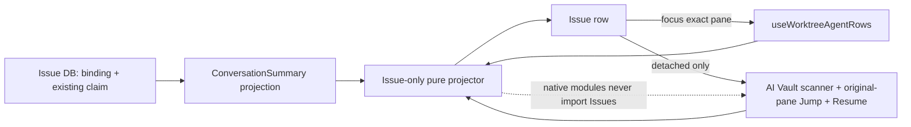
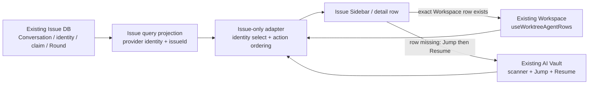
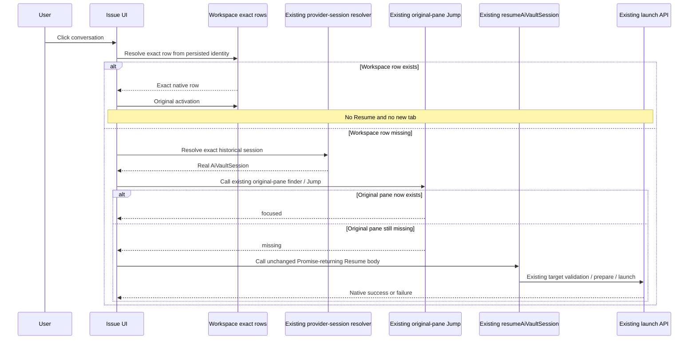
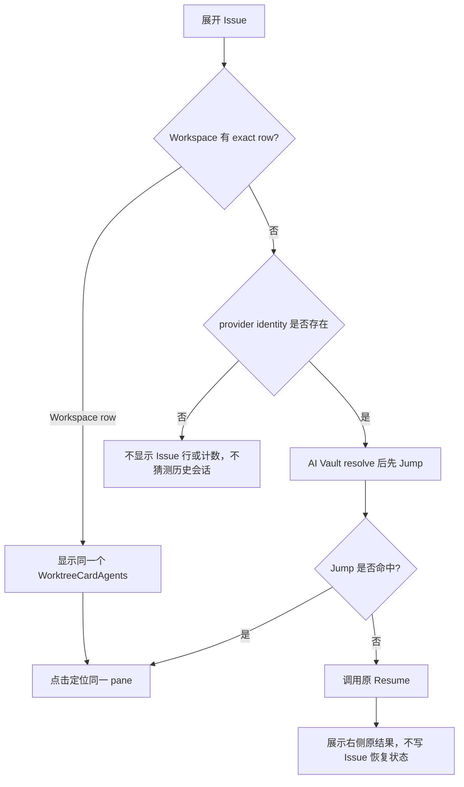
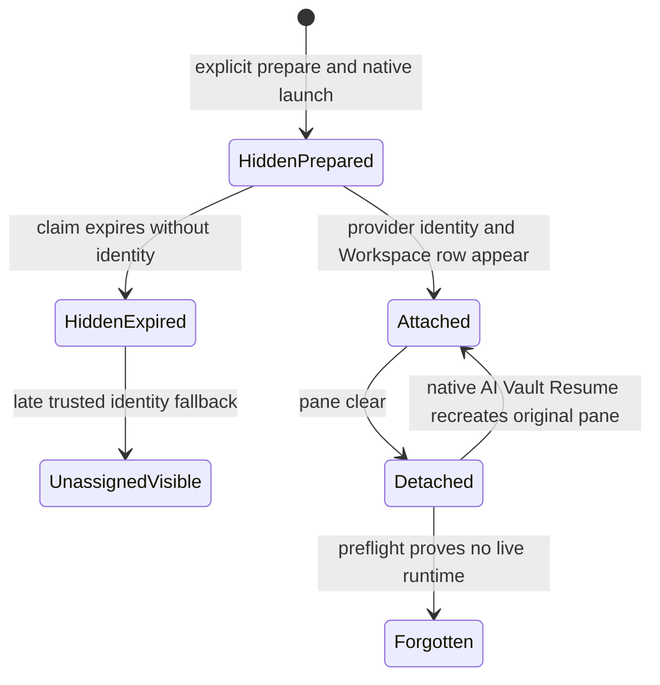
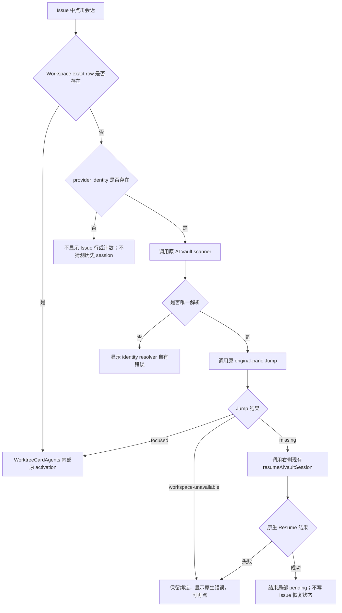
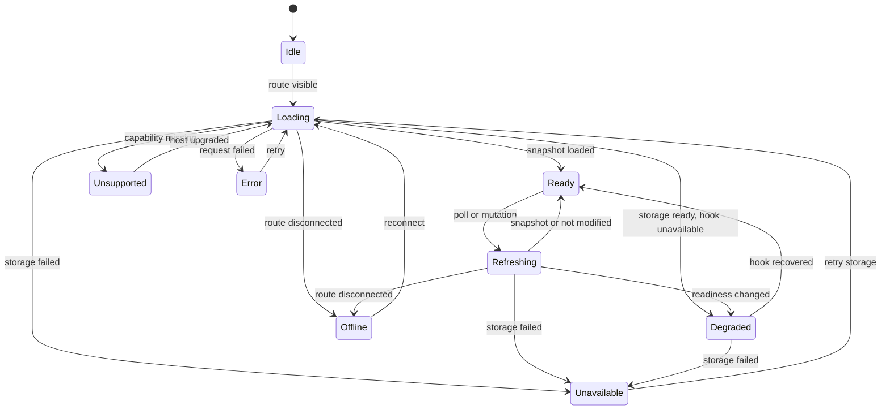

# Orca 并行任务管理：低冲突核心首版技术方案

技术方案 · 2026-08-30 · Issue 只做投影、按右侧当前行为复用原生能力

> 本文按用户指定的历史目录 `.docs/并行任务看板/` 保存。
> 产品说法见 [`产品方案.md`](./产品方案.md)，规范对象关系见
> [`产品数据模型.md`](./产品数据模型.md)。**Conversation 绑定、关闭会话找回及 Issues 会话行展示的
> 产品契约，以
> [`docs/requirements/Issues-会话展示与关闭会话恢复需求.md`](../../docs/requirements/Issues-会话展示与关闭会话恢复需求.md)
> 为唯一有效说法。会话层的当前有效实现边界以
> [`改动方案-会话层改为投影.md`](./改动方案-会话层改为投影.md) 为准：**Issue 不拥有第二套会话
> 生命周期，右侧 AI Vault 当前行为连同其现有缺陷一起作为复用基线。\*\*
> 会话存在于 Workspace 时，Issue 直接投影并定位原 row；会话已关闭时，Issue 调用同一 AI Vault
> `listSessions` 数据源、原 pane finder、原 Jump 和原 Resume。Issue 不修原生重复 Resume、启动空窗或
> Host 问题，也不要求自身比右侧更正确。Issue 新建后照常进入原 Workspace tab，provider
> identity 到达前不在 Issues 中展示 Starting/Retry 行或计数。
> 现有 Conversation、provider identity、launch claim、Runtime Attachment 与 Round 保持不变；不再新建
> 映射表，也不删除或重键这些表。新 `issue_conversation_bindings`、Issue session cache、平行 Resume
> 状态机、Issue pane index 或用户可见 `unverifiable` UI 均属于已撤销设计。

---

## 0. 摘要

本次是对当前 Issue 会话实现的**架构收敛**，不是再补一条 Issue 生命周期链路。最终实现只允许两个职责：

1. Issue 内核继续持久化 `Conversation → Issue` 归属；新建会话继续在原 Workspace 启动，
   provider identity 到达后才进入 Issues 投影；
2. Renderer 把 Issue 的 provider identity 与 Workspace 原 row、AI Vault 当前已有的查找/Jump/Resume
   能力做纯投影。

会话行按以下优先级求解，不再依赖 Issue 自己的 tab Map、TTL 或进程退出回调：

1. 先在目标 host/workspace 的 `useWorktreeAgentRows` 中按完整 provider identity 找原生 row；命中即按
   attached 处理，优先于可能滞后的 Issue RuntimeAttachment 投影；
2. 未命中时调用 AI Vault 原 `listSessions` 数据源，并用持久 provider identity 选择
   `AiVaultSession`；
3. 调用原 pane finder；找到 target 就执行原 Jump，返回 missing 才调用右侧现有
   `resumeAiVaultSession`；
4. target validation、Host/Workspace 支持范围、成功、失败、取消和错误提示全部保持右侧当前行为；
5. Promise 期间只保留组件局部 pending，结束后不写 Issue 恢复状态。

这个收敛方案明确删除当前 Issue 专属的 `conversationId → tabId` Map/TTL，撤回
`providerSessionOnly` Host producer、certified-process-exit 回调和相关 Issue 结算链。不新增表/列、
Issue observer、timer、lifecycle marker、PTY main callback、AgentHook API、Runtime callback 参数、
stream opcode、preload IPC 或 SSH liveness 逻辑。本需求也不扩展
`automaticAgentResumeClaimsByTabId`、`recordAgentProviderSession`、original-pane state 或
sleeping-session 生命周期。原生 AI Vault 自身无法 Jump、重复 Resume 或不支持某类 Host 时，Issue 允许
表现一致；本需求只禁止 Issue 复制、改写或绕开原链路。

当前状态是**代码已按本方案收敛，并已用新隔离 packaged App 重做验证**。之前包含 Host 新链路的
测试包和 PASS 仍不作为本方案证据；本版证据只认§12.4 记录的产物与 Test Run。

## 1. 状态与结论

| 项目         | 结论                                                                                                                 |
| ------------ | -------------------------------------------------------------------------------------------------------------------- |
| 当前状态     | 收敛实现已完成；静态、单测、隔离 packaged App 与真实 Codex 本机旅程已通过，远端实机边界见§12.4                       |
| 核心事实     | provider session 事实归 AI Vault；现有 Conversation + provider identity 记录 Issue 归属                              |
| 唯一身份     | 继续使用现有 `ConversationIdentityRepository` 的 host-scoped provider identity                                       |
| 持久化       | 每个 active profile 一个 SQLite；本次不新增表、不迁移现有 Conversation/Round                                         |
| 恢复接入     | Workspace exact row 优先；否则调用 AI Vault 原数据源、原 pane finder、原 Jump/Resume；Issue 不增加生命周期观察者     |
| 本地/远端    | 统一使用 `callRuntimeRpc`；不增加平行 IPC transport                                                                  |
| 同步         | revision-aware 有界轮询；mutation 后立即刷新；首版无离线事实 cache                                                   |
| 分页         | Issue filter、Conversation scope、Round timeline 沿用现有分页；cursor 固定 authority snapshot                        |
| 并发         | 单实体编辑使用 `recordRevision`；树用 `treeRevision`；跨实体删除计划用 `factsRevision`                               |
| Round        | 保持现有 `round_records.conversation_id`；本次不改 Round 模型                                                        |
| UI           | `Workspaces \| Issues` 根模式；Workspace 行零改动；Issues 在精确可激活 Workspace row 存在时复用 `WorktreeCardAgents` |
| Activity 等  | 首版完全不接入，不改现有数据源、ack、通知和移动端                                                                    |
| Profile move | 本版本不介入 Project transfer；沿用 main 的 copy/move，不迁移 Issue DB，也不注入 move guard                          |
| 最大风险     | 把右侧已有缺陷当成 Issue 问题后再次新增状态、Hook 或 Host 判定                                                       |
| 缓解方式     | Issue 只调用原生能力；验收右侧入口与 Issue 入口行为一致，不要求 Issue 增强原生能力                                   |

### 1.1 发布必须成立的不变量

1. AI Vault 的 provider session 是会话历史事实；Issue 归属继续由现有
   `conversation_provider_identities → conversations.issue_id` 表达，不新增第二份映射。
2. Workspaces 继续使用原有 pane/status row。Issues 按完整 provider identity 选中并渲染同一个可激活
   `WorktreeCardAgents`，不得复制 CSS 或重画 live row；原生 inert 的 `retained` 完成证据走降级链。
3. attached 展示以目标 Workspace 中按完整 provider identity 找到的原生 row 为准；
   `ConversationSummary.attachment.paneKey` 可作投影提示，但不能否定已找到的原生 row。
4. Workspace row 不存在时才进入 AI Vault；调用原 pane finder，找到 target 就执行原 Jump，只有
   `missing` 才调用原 Resume。Host、投影滞后与重复恢复行为保持右侧当前实现。
5. Issue 最多三级；self、cycle、超深和跨主机 reparent 原子失败。
6. 关闭 pane/tab 只清理 RuntimeAttachment，不删除 Conversation、provider identity、Issue 归属或
   AI Vault transcript。
7. Resume 必须复用右侧 AI Vault 的 `listSessions` 数据源、原 pane finder、Jump、目标校验、prepare、
   launch、提示和错误处理；不调 Issue `prepareResume`，不生成 Issue launch token/claim。Issue 不修
   右侧的原 pane 识别、幂等或 Host 缺陷。
8. Session History 扫描不自动创建 Conversation/Issue 归属；继续使用现有 hook/用户动作接入。
9. `readAt` 与 `resolvedAt` 独立；mark-read/ack 绝不写 `resolvedAt`。
10. hook 运行态文字只能标为 `runtime-preview`，不能冒充全文。
11. Issues tree 使用独立 row builder；有精确 Workspace row 的 attached Conversation 内容由
    `WorktreeCardAgents` 渲染，无 status row 的 attached Conversation 走同一降级行定位；不给
    `WorktreeGroupBy` 增值。
12. Activity、Dashboard、通知和移动端首版不读取或写入 Issue/Round。
13. 现有 prepare/claim/Workspace launcher、bind/rebind 与 forget 数据契约保持；无 active
    provider identity 的预分配 Conversation 不进入 Issues 行、direct/running 计数或 Starting/Retry UI。
14. Issue 不新增 Host/liveness 判定或用户可见 `unverifiable` / `ambiguous` 标签。SSH 扫描失败和恢复
    继续采用 AI Vault 当前已有结果。
15. `orca-issues.v1` 只证明 RPC contract；storage 与 hook evidence 分别报告
    ready/degraded/unavailable，不根据运行健康动态增删 capability。
16. 同一 provider turn 的重复 stop/reconciliation 只升级同一 Round；不同 turn 不按时间自动
    supersede。
17. Round 继续外键到 Conversation；bind/rebind 只修改 `Conversation.issueId`，不复制或重键 Round。
18. AI Vault、Workspace、Dashboard、PTY 与 runtime 核心不得反向依赖 Issue；只有明确的组合入口可同时
    import 原生能力与 `@/issues/*`。
19. 原生 tab title sync 保持不变；Issue 不新建全局 title cache/timer。活行直接使用
    Workspace 原标题，降级行只对当前可见 identity 分批调现有 `aiVault.resolveSessionTitles`。
20. Renderer 只允许按钮当前 Promise 期间的组件局部 pending；不保存 `conversationId → tabId` Map、
    TTL 或任何 Issue 专属启动结果。Promise 结束后再次调用原生能力，不推断右侧应已恢复成功。
21. 收敛性重构不新增 SQLite 表、不重写历史 migration、不改变 Conversation ID、Issue 归属或 provider
    transcript；代码整洁不能以用户数据兼容为代价。
22. 所有完成结论必须来自独立测试包、隔离 `userData` 的真实 Electron App 与当前源码；不得用正在使用
    的 Local App、历史 PASS 报告或 mock-only 测试替代。
23. 本次收敛不修改 PTY main commit、`AgentHookServer`、`OrcaRuntimeService`、AppStore claim 或其组合
    回调；Issue 不为空闲 TUI、早退出或 Resume 再生产一份生命周期事实。

### 1.2 技术方案设计原则（评审硬约束）

本节优先级高于具体文件设计。实现或后续修改只要违反任一原则，就必须退回方案评审，不能用“测试已过”
或“改动更快”作为例外理由。

| 原则                     | 目标约束                                                                                                 | 直接判定为错误的信号                                                              |
| ------------------------ | -------------------------------------------------------------------------------------------------------- | --------------------------------------------------------------------------------- |
| 用户动线优先             | 用户从 Issue 一次点击即可调用右侧原能力                                                                  | 打开右侧后仍要搜索或二次点击；Issue 另写一套恢复 controller                       |
| 单一事实、单一所有者     | Conversation/Issue 归属在 Issue DB；历史发现与 Resume 在 AI Vault；运行事实归 execution host             | 复制会话记录、在 renderer 推断 exited、从标题/prompt 猜 identity                  |
| 复用完整行为，不复制表象 | 优先直接调用现有公开能力；公开面不足时只允许领域中性的 seam，再由 Issue 薄 adapter 组合                  | 复制 AI Vault scanner/Resume、复制 Workspace row CSS、模拟 DOM 点击               |
| 单向依赖与组合根         | `Issue UI → Issue adapter → 原生公共 API`；原生模块不知道 Issue                                          | `right-sidebar`、Dashboard、Workspace、PTY 或 runtime 核心 import `@/issues/*`    |
| 薄适配、失败隔离         | adapter 只做 identity 转换、原 row 选择和原生函数调用                                                    | Issue DB/RPC/迁移失败导致 AI Vault Resume 失败                                    |
| 不新增平行基础设施       | 沿用现有 Conversation/identity/attachment/title/launch 能力                                              | 新映射表、Issue session cache、pane index、第二套 title timer 或 Resume 状态机    |
| 不增强原生行为           | Host、SSH、paired 与 Folder 的成功/失败保持 AI Vault 当前行为                                            | Issue 新增 Host gate、liveness、observer 或补偿状态                               |
| 数据兼容优先             | 保留 schema、migration、ID、Issue 归属和 transcript；清理先从依赖与重复代码开始                          | 为减 LOC 重建 DB、重键 Conversation 或删除历史 migration                          |
| 混合版本与跨平台         | 不新增未协商 stream opcode；路径、快捷键、Git、folder/SSH/WSL 均遵循仓库边界                             | local-only IPC、假设 Git worktree、硬编码路径或只测 macOS                         |
| 低冲突预算               | 领域逻辑留在 Issue 目录；AI Vault 只允许 identity resolver、Jump、Resume 三个中性 seam；Workspace 零改动 | 在热点文件加入 Issue 分支、RPC、claim lifecycle、trailing action 或平行业务状态机 |
| 删除优先、按证据演进     | 先删失效 overlay/adapter/重复解析，再考虑新增；每次新增都记录候选复用失败证据                            | “重新写更快”、隐藏旧实现但继续后台运行、两套链路同时保留                          |
| 分层验收                 | 静态、单测、类型、真实 App、跨 Host 分开陈述，最高只宣称已取得的证据层级                                 | 用历史报告、截图或 mock 调用次数宣称真实恢复完成                                  |

目标依赖方向固定为：



读图重点：Issue 只组合 Workspace 与 AI Vault 公开动作；它不向 AppStore、AI Vault、PTY、Hook 或
runtime 回写生命周期状态，原生模块也不反向知道 Issue。

## 2. 当前实现、上游改动点与复用决策

### 2.1 当前事实

- `conversation_provider_identities → conversations.issue_id` 已完整表达 provider session 到 Issue 的
  持久归属；关闭 pane 不会删除 Conversation、identity、`issueId` 或 transcript。
- `useWorktreeAgentRows` + `WorktreeCardAgents` 已完整定义 Workspace 会话行的标题、状态、model、时间、
  子 agent、样式和激活行为；Issue 不应重画。
- AI Vault 的 `findOriginalAiVaultSessionPane` 已实现原 pane 查找；main 的 Jump 仍在右侧 hook 内，
  Resume body 已实现 target validation、prepare、launch、toast 与失败处理。本方案只抽出可调用入口，
  不把分支新增 API 误写成 main 已有公开能力。
- 右侧 Jump 与 Resume 是两个既有动作：有原 pane时提供 Jump，Resume body 本身总是执行恢复。
  Issue 应按 `Jump if present → otherwise Resume` 编排，而不是修改 Resume 的语义。
- AI Vault scanner 已按 execution host 拉取 Session History；Issue 只增加同一 `listSessions` 结果上的
  provider identity selector，不复制 scanner 或 cache。该 selector 自己负责 scan failed/cancelled、
  not-found-or-ambiguous 和 not-resumable 提示；进入 Jump/Resume 后才使用右侧原错误处理。
  右侧人工文本搜索与该 selector 不是同一个现有公共 API。
- `ConversationSummary.attachment` 是 main 的异步投影，可能落后于 renderer 已经存在的 Workspace row；
  它不能作为 Issue 是否复用原 row 的硬门槛。
- 当前 `issue-conversation-pending-tab.ts` 的 Map/TTL、`issue-resume-bookkeeping.ts`、Resume launch token、
  provider-resume observation 与 certified-process-exit 都在重复表达原生运行事实，必须撤回。
- `automaticAgentResumeClaimsByTabId`、startup/config 与 sleeping-session 是右侧/终端原生内部状态；本
  需求不读取、不扩展也不修补它们。
- renderer 的 `callRuntimeRpc`、Issue snapshot pagination、profile-scoped SQLite、Conversation/provider
  identity/Round 契约继续复用，不因本次投影修复重写。

### 2.2 复用候选与结论

| 候选能力                                 | 路径                                                                        | 相似点                                           | 差异                                           | 决策                                                                               |
| ---------------------------------------- | --------------------------------------------------------------------------- | ------------------------------------------------ | ---------------------------------------------- | ---------------------------------------------------------------------------------- |
| SQLite 封装                              | `src/main/sqlite/sync-database.ts`                                          | 同步事务、统一 native driver                     | 无领域 schema                                  | 直接复用                                                                           |
| Orchestration DB                         | `src/main/runtime/orchestration/db.ts`                                      | WAL、NORMAL、timeout、迁移、权限                 | 领域与表完全不同                               | 复用开库和迁移范式，不复制业务类                                                   |
| Profile 路径                             | `src/main/orca-profiles/profile-storage-paths.ts`                           | active profile 隔离                              | 无 Issue 文件名                                | 直接复用 `getOrcaProfileDirectory`                                                 |
| runtime RPC                              | `src/main/runtime/rpc/core.ts`、`methods/index.ts`                          | local/remote 共用、Zod 验证                      | 需新增 Issue methods                           | 增量挂载一组 methods                                                               |
| renderer RPC                             | `src/renderer/src/runtime/runtime-rpc-client.ts`                            | 统一 local/remote、capability cache              | 无 Issue client                                | 直接复用，不建 preload API                                                         |
| 原 pane定位                              | `ai-vault-original-pane*`                                                   | finder 与右侧 Jump 函数体已存在                  | main 的 Jump 不是可返回结果的公共函数          | 抽出原 Jump body，右侧与 Issue 共用；不增强 finder                                 |
| Session History                          | `components/right-sidebar/ai-vault-session-*`                               | `listSessions`、Resume、Continue 已存在          | 右侧人工搜索不是按持久 identity 的公共 API     | 复用原数据源和 Resume body，只增加 identity selector                               |
| provider identity 解析历史行             | `ai-vault-provider-session-resolution.ts`                                   | 当前分支已有薄 selector 草稿                     | 不是 main 既有公共搜索能力                     | 保留为无状态胶水；输出真实 `AiVaultSession`，不修改 `ai-vault-session-identity.ts` |
| Worktree agent rows                      | `WorktreeCardAgents.tsx`                                                    | 已有密集行、运行态、导航，且支持传入预计算 rows  | Issue 当前错误地先要求 attachment attached     | 先按完整 identity 选原 row，再直接复用整个组件                                     |
| Sidebar grouping                         | `worktree-list/grouping/`                                                   | Workspaces 树与虚拟列表                          | Issues 是另一种根组织                          | 保持不改，新增独立 Issue row builder                                               |
| Profile transfer                         | `profile-project-transfer.ts`、IPC 入口                                     | 已有 copy/move                                   | 不支持 SQLite 跨 profile journal               | 本版本不介入；沿用 main，不迁移 Issue DB、不注入 guard                             |
| 实验 Issue pagination                    | `issue-query-service.ts`、`issue-list-snapshot.ts`、`issue-query-cursor.ts` | 固定 revision、cursor、stale restart             | 当前把 Issue view 与其他实验能力混在同一 store | 复用分页内核，拆开 Issue view 与 Conversation entity cache                         |
| 实验 Conversation delete                 | `conversation-record-repository.ts`                                         | 已能级联删除 Round/identity/claim 并修正字节计数 | 没有 runtime preflight、RPC 和 UI              | 复用 repository 删除内核，新增 prepare-delete/forget service guard                 |
| Sidebar host scope                       | `use-sidebar-host-scope-options.ts`、实验 Issue row builder                 | 已能枚举 local/SSH/runtime 并生成 host state row | 当前仍带延后 filter/search 支线                | 直接复用主机 scope，只保留独立 authority tree                                      |
| Issue pending-tab Map                    | `issue-conversation-pending-tab.ts`                                         | 能在短期内记住 tab                               | 与原生 startup/config 重复，TTL 不是生命周期   | 删除，不复用                                                                       |
| Host Resume observation / certified exit | 当前分支 PTY、Hook、runtime 改动                                            | 试图为 Issue 补事件                              | 侵入核心且与原生 UI 事实仍可矛盾               | 整条撤回，不进入最终方案                                                           |

#### 2.2.1 恢复编排的方案取舍

| 方案                                                          | 是否采用 | 结论                                                         |
| ------------------------------------------------------------- | -------- | ------------------------------------------------------------ |
| 修改右侧 Resume 为“有 surface 则定位”                         | 否       | 改变右侧既有语义，并把 Jump/Resume 两个动作混成新 controller |
| Issue Map/TTL、`prepareResume`、Host provider-resume observer | 否       | 新增第二所有者；失败、SSH 断联、混合版本与清理时机都会分叉   |
| 扩展 `automaticAgentResumeClaimsByTabId`                      | 否       | 该原生 claim 自身生命周期未闭合，不应夹带到 Issue 功能中修补 |
| Workspace exact row → AI Vault Jump → AI Vault Resume         | 是       | 只组合既有展示、定位和恢复动作，不保存第二份运行状态         |
| 扩读 startup/config、修原生重复 Resume 或增加 Host gate       | 否       | 需求方接受右侧当前行为，本需求只验证调用一致性               |

具体调用顺序与验收见
[`改动方案-会话层改为投影.md`](./改动方案-会话层改为投影.md)。

### 2.3 明确不复用或不继续的实验实现

| 实验能力                                     | 不进入首版的原因                                           | 处理                                                                                |
| -------------------------------------------- | ---------------------------------------------------------- | ----------------------------------------------------------------------------------- |
| Issue digest / 文本生成                      | 增加生成状态机、成本、失效和主干 text-generation 改动点    | 删除注册、RPC、UI 与表                                                              |
| FTS / search rebuild queue                   | 当前标题筛选不需要持久索引                                 | 删除表与后台任务                                                                    |
| `issue_events` 通用事件流                    | 详情首版只需 Round 时间线；事件流会牵引 Activity           | 不建表、不发事件                                                                    |
| `issue_links` 正式跨主机关联                 | 容易被误解为可参与层级/注意力                              | 首版只允许 note 或 external URL                                                     |
| provider 自动 refresh                        | 会修改 GitHub/GitLab/Linear/Jira 多条链路                  | 外部引用只保存人工快照                                                              |
| Activity / Dashboard / notification / mobile | 非核心闭环且主干热点多                                     | 保持上游原样                                                                        |
| Issue preload API 与 `useIpcEvents`          | 会形成 local-only 平行 transport                           | 全部改走 runtime RPC                                                                |
| 离线 read cache                              | 会引入陈旧事实、写队列与对账                               | 不可达即 offline                                                                    |
| Profile Issue transfer                       | 需要跨 JSON/SQLite 可恢复 journal                          | move 阻断，copy 不复制                                                              |
| `Conversation.state`                         | 混合 tab 关闭、启动失败与 retention                        | 目标 schema 删除                                                                    |
| Round execution chain / supersession         | 没有可靠上游 lineage，字段当前始终为空                     | v1 删除字段、索引、effective superseded view；只保留同 fact merge 与明确 resolution |
| 动态增删 `orca-issues.v1`                    | capability 发布点在 runtime core，且协议支持不等于运行健康 | capability 保持静态，新增 `issues.status` readiness                                 |

### 2.4 为什么不把领域逻辑放进 `OrcaRuntimeService`

`src/main/runtime/orca-runtime.ts` 是上游高频核心文件，且承担 terminal、repo、orchestration、
remote runtime 等大量职责。把 allocator、repository 和 Issue CRUD 放进去会：

- 迫使 desktop、headless 和 orcad 在多个构造路径重复接线；
- 让 Issue 领域对象扩散到 runtime 核心；
- 提高每次同步上游时的冲突概率；
- 难以独立关闭、切换 profile 和测试。

因此 `OrcaRuntimeService` 只继续提供既有 runtime 能力。Issue 由独立
`IssueFeatureBootstrap` 组合，并直接消费现有 hook source 的公开证据。

## 3. 目标架构

> 现有 Conversation/identity/claim 架构继续使用。两个新增交互通过薄 adapter 接线：attached 复用
> Workspace 整行；detached 使用 provider identity 精确解析历史 session，并一次点击调用 AI Vault
> 原生 Resume 公共内核，见
> [`改动方案-会话层改为投影.md`](./改动方案-会话层改为投影.md)。

### 3.1 模块关系



读图重点：

- adapter 只在 Issue renderer 内部，输入全是已有对象，输出只是展示与点击顺序；
- AI Vault、Workspace、AppStore、PTY、Hook 和 runtime 不增加 Issue 分支或 Issue callback；
- Workspace exact row 优先；没有 row 时先 Jump，明确 missing 后才 Resume。

### 3.2 系统交互时序

```mermaid
sequenceDiagram
  participant U as User
  participant I as Issue row
  participant Q as Issue query
  participant W as Workspace rows
  participant S as AI Vault scanner
  participant J as AI Vault original-pane Jump
  participant R as Existing Resume body

  I->>Q: Read ConversationSummary
  Q-->>I: provider identity + issueId
  I->>W: Select exact row by host/workspace/agent/provider identity
  alt Exact Workspace row exists
    W-->>I: Existing Workspace row
    I-->>U: Render WorktreeCardAgents
    U->>I: Click row
    I->>W: Original activation
  else Provider identity exists
    I-->>U: Render detached Resume
    U->>I: Click once
    I->>S: Resolve real AiVaultSession
    I->>J: Existing original-pane lookup and Jump
    alt Original pane exists
      J-->>I: focused
    else Original pane missing
      J-->>I: missing
      I->>R: Existing Resume body
    end
  else Provider identity missing
    I-->>U: Hide the preallocated record; do not guess a session
  end
```

恢复已有会话的读链不产生 Issue 持久写；日志不记录 prompt、assistant 正文或 provider transcript。

#### 3.2.1 已关闭会话的一键 Resume 时序

本时序不增加 Issue-side route/host gate。原 pane finder、target validation 和 Resume 对当前 Host 的处理
保持右侧现状。



验收关注点：Issue 不保存 Resume 目标，也不为 Resume 准备 claim/launchToken。右侧与 Issue 调用同一
finder、Jump 和 Resume 实现；本次不在 AppStore、PTY commit、Hook 或 runtime 中增加任何状态增强。

### 3.3 用户动线



用户只看到两种会话复用动作：Workspace 有原 row 就定位；没有 row 时自动找到 AI Vault session，按右侧
现有逻辑 Jump 或 Resume。右侧原行为成功、失败或降级，Issue 都不增强。

### 3.4 生命周期所有者：`IssueFeatureBootstrap`

新增 `src/main/issues/issue-feature-bootstrap.ts`，它是每个 runtime 进程内唯一的 Issue
组合根：

```ts
export type IssueFeatureBootstrapOptions = {
  profileId: string
  profileLabel: string
  userDataPath: string
  runtimeId: string
  workspaceResolver: IssueWorkspaceResolver
  hookSource: IssueAgentHookSource | null
  hookEvidenceStatus: 'ready' | 'disabled' | 'failed'
  managedSshTargets: ManagedSshTargetResolver
}

export interface IssueFeatureBootstrap {
  readonly service: IssueRuntimeService
  readonly readiness: IssueFeatureReadiness
  dispose(): void
}
```

职责：

1. 根据 active profile 打开一个 Issue DB；
2. 创建 repository、allocator、attachment registry、identity/Round ingestor 和 query service；
3. hook ready 时先安装 live subscriptions 到短期队列，再读取 status、provider identity 和
   authority snapshots，完成 seed 后按 observation/dedupe 顺序排空队列；hook disabled/failed 时
   仍创建 DB/query/mutation service，但 readiness 为 degraded，不创建普通启动；
4. 向 runtime RPC methods 暴露当前 service；
5. profile 切换或进程退出时先取消订阅，再关闭 DB；
6. desktop、Electron `orca serve` 和 Node-only `orcad` 使用同一构造函数，不复制领域组合。

bootstrap 不负责 renderer store、窗口状态、Activity 或通知。

三个宿主入口的生命周期边界不同，不能写成一套模糊的“都启动 hook”：

| 宿主                  | hook 生命周期                                                  | bootstrap 接入                                                                                      | 停止顺序                                                                |
| --------------------- | -------------------------------------------------------------- | --------------------------------------------------------------------------------------------------- | ----------------------------------------------------------------------- |
| desktop               | 复用 `main/index.ts` 已有 startup service 与 `will-quit`       | hook 启动步骤结束后创建，不再次 `start()`                                                           | 先注销并 dispose bootstrap，再沿用现有 hook stop                        |
| Electron `orca serve` | 与 desktop 共用同一 startup service                            | 在 headless RPC 发布 capability 前创建                                                              | 同 desktop                                                              |
| Node-only `orcad`     | 在 `orcad-entry.ts` 尝试启动同一个 `agentHookServer` singleton | hook start settled（成功或失败）→ 注册 headless PTY → 创建 ready/degraded bootstrap → `rpc.start()` | 先阻止新的 Issue 调用并 dispose bootstrap，再停 RPC，最后停 hook server |

若 desktop / `orca serve` / `orcad` 的 hook 启动失败，bootstrap 仍提供 DB 可用范围内的 Issue
CRUD、显式预分配、历史查询与 retry/forget；`issues.status` 返回 degraded，普通启动不创建，页面
显示 hook evidence 不可用。不得偷偷拉起第二个 server，也不得动态撤销静态
`orca-issues.v1`。若 DB 打开/迁移失败，status-only registry 仍可响应 `issues.status = unavailable`，
其余 Issue method 返回稳定 `issue_feature_unavailable`，Orca 其他能力继续启动。

## 4. 核心数据模型与 SQLite

> **当前继续使用**：本节的 `conversations`、`conversation_provider_identities`、
> `conversation_launch_claims`、Runtime Attachment 与 Round 均保留。本次两个 UI 需求不修改 schema、
> allocator 或 identity 语义。关闭会话找回与行复用的接线见
> [`改动方案-会话层改为投影.md`](./改动方案-会话层改为投影.md)。

### 4.1 共享类型

`src/shared/issues/` 首版只保留：

- `IssueRecord` / `IssueSummary` / `IssueDetail`；
- `ConversationRecord` / `ConversationSummary`；
- `ConversationProviderIdentity` / `ConversationLaunchClaim`；
- `RoundRecord` / `RoundRecordPreview`；
- authority、host partition、mutation receipt 和分页/revision 契约；
- hierarchy、attention 与 Zod schemas；
- `ORCA_ISSUES_RUNTIME_CAPABILITY = 'orca-issues.v1'`。

主机类型必须在 shared contract 中分开，不能继续让一个字段同时承担持久身份和客户端路由：

```ts
type AuthorityExecutionHostId = 'local' | `ssh:${string}`
type IssueRouteExecutionHostId = ExecutionHostId
```

- `IssueRecord.executionHostId` 与 `ConversationRecord.executionHostId` 使用
  `AuthorityExecutionHostId`，schema 必须拒绝 `runtime:*`；
- renderer partition key、transport 寻址和当前导航使用 `IssueRouteExecutionHostId`；
- typed client 把 route 映射为 RPC `AuthorityExecutionHostId` selector；handler 再从 selector
  推导 partition，调用方不能分别提交或伪造 `hostPartitionKey`。

删除首版无消费者的 digest、mobile、notification、Activity、Dashboard、FTS/body read 和
provider refresh 类型。外部引用只保存：

```ts
type IssueSource =
  | { kind: 'local'; number: number }
  | {
      kind: 'external'
      provider: 'github' | 'gitlab' | 'linear' | 'jira' | 'other'
      identifier: string
      url: string
      titleSnapshot: string
    }

type IssueFeatureReadiness = {
  status: 'ready' | 'degraded' | 'unavailable'
  storage: 'ready' | 'failed'
  hookEvidence: 'ready' | 'disabled' | 'failed'
  reason:
    | 'storage-open-failed'
    | 'storage-migration-failed'
    | 'hook-disabled'
    | 'hook-start-failed'
    | null
}

type ConversationLaunchFailure = {
  message: string
  failedAt: number
}
```

`IssueRecord` 与 `ConversationRecord` 都包含从 `0` 开始的整数 `recordRevision`。只有该记录自身
可编辑字段、归档状态或绑定变化时递增；Round ingest 与其他实体变化只增加 host
`factsRevision`，不能推进无关记录的 `recordRevision`。

Conversation 目标字段不包含 `state`：

```ts
type ConversationRecord = {
  id: string
  hostPartitionKey: AuthorityHostPartitionKey
  executionHostId: AuthorityExecutionHostId
  workspaceRef: WorkspaceScope
  workspaceSnapshot: WorkspaceSnapshot
  agent: TuiAgent
  title: string | null
  issueId: string | null
  recordRevision: number
  launchFailure: ConversationLaunchFailure | null
  createdAt: number
  updatedAt: number
}
```

本次会话展示/恢复不增加 `ConversationSummary` 字段，也不为恢复已有会话暴露 claim
fingerprint。`executionState` 与 `launchFailure` 可继续作为既有数据契约，但 Issues renderer 不再
用它们为无 provider identity 记录绘制 Starting/Retry UI。

Round 只保存有界预览：

```ts
type RoundTextCompleteness = 'not-captured' | 'runtime-preview' | 'reconciled-preview'

type RoundTextPreview = {
  text: string | null
  completeness: RoundTextCompleteness
}

type RoundRecord = {
  id: string
  conversationId: string
  kind: 'completion' | 'waiting'
  waitingReason: 'question' | 'approval' | 'blocked' | 'other' | null
  stateSource: 'hook' | 'reconciled'
  occurredAt: number
  dedupeKey: string
  userInput: RoundTextPreview
  agentOutput: RoundTextPreview
  pendingQuestion: RoundTextPreview
  readAt: number | null
  resolvedAt: number | null
  resolution: 'new-input' | 'explicit' | 'archive' | 'resumed' | null
  createdAt: number
}
```

`waitingReason` 只在 `kind = 'waiting'` 时非空，把现有 agent `waiting` / `blocked` 与
interactive prompt 归一为用户可解释的提问、审批、阻塞或其他等待。它不引入第二套
read/resolve 状态。

`runtime-preview` 明确表示 hook 截断内容。即使 reconciler 从 transcript 得到更稳定的有界片段，
也只能标为 `reconciled-preview`；首版没有“全文”状态和全文读取 RPC。

Round v1 明确不包含 `executionChainId`、`supersedesRoundId`、`effectiveResolvedAt` 或
`effectiveResolution = superseded`。同一 provider turn 通过 `round_refs` 与 `dedupeKey` 命中同一
记录并补强 preview；不同 turn 之间只有 `new-input | explicit | archive | resumed` 四种可验证
resolution，不按时间猜测 predecessor。

### 4.2 profile 与 authority

数据库路径：

```text
getOrcaProfileDirectory(profileId, userDataPath)
  /issues/orca-issues.db
```

- 每个 profile 独立文件，互不可见；
- remote runtime 只打开它自己 active profile 的文件；
- direct SSH workspace 由建立连接的 owning runtime 保存，并用 `ssh:<targetId>` partition；
- 持久 `executionHostId` 是 authority 侧身份：local partition 写 `local`，direct SSH partition
  写对应 `ssh:<targetId>`；
- `routeExecutionHostId` 是客户端导航与 partition cache key；`runtime:<environmentId>` 只存在于
  客户端，不进入 RPC authority descriptor，也不写入 Issue / Conversation；
- 客户端不能通过普通 RPC 参数指定远端 profile。

每次查询都返回显式 authority 描述，空列表也不能靠首条记录猜 authority：

```ts
type IssueAuthorityDescriptor = {
  authorityId: string
  hostPartitionKey: AuthorityHostPartitionKey
  authorityExecutionHostId: AuthorityExecutionHostId
  profileLabel?: string
}
```

`profileLabel` 只用于已认证客户端解释当前 owning runtime 的 active profile，不进入 identity、cache
key 或同主机校验。renderer 判断缓存该不该整批丢掉，依据仍是 `routeExecutionHostId + authorityId` 这一对。

首版 route 是单跳的：`local`、本客户端直接管理的 `ssh:<targetId>`，或配对远端 runtime 的
`runtime:<environmentId>`。`runtime:*` 映射到该远端 runtime 的 local partition；不设计
“先到 remote runtime、再进入它管理的 SSH target”的复合 route。二跳 SSH 只有在 owning
runtime 本机使用时按 direct SSH partition 可见，跨客户端支持需另行设计复合寻址与 capability。

renderer typed client 保存本次请求使用的 `routeExecutionHostId`，并将其解析为：

| client route              | `RuntimeClientTarget`                    | RPC `authorityExecutionHostId` |
| ------------------------- | ---------------------------------------- | ------------------------------ |
| `local`                   | `{ kind: 'local' }`                      | `local`                        |
| `ssh:<targetId>`          | `{ kind: 'local' }`                      | 同一个 `ssh:<targetId>`        |
| `runtime:<environmentId>` | `{ kind: 'environment', environmentId }` | `local`                        |

服务端只信任经过 Zod 校验的 authority selector 与 RPC context：

- `runtime:*` 无法通过 `AuthorityExecutionHostIdSchema`；
- paired runtime caller（`RpcContext.clientKind === 'runtime'`）只能选择 `local`，从协议层禁止二跳；
- 本地 caller 选择 `ssh:*` 时，必须确认 target 由当前 runtime 管理；
- handler 根据 selector 推导 `hostPartitionKey`，调用方不能分别提交两者；
- 返回 descriptor 后，client 校验其 authority execution host 与本地映射一致，再挂到原 route key。

### 4.3 开库和迁移

严格复用 `OrchestrationDb` 范式：

```ts
database.pragma('journal_mode = WAL')
database.pragma('synchronous = NORMAL')
database.pragma('busy_timeout = 5000')
database.pragma('foreign_keys = ON')
```

还必须：

- 立即读回 `PRAGMA foreign_keys` 并断言为 `1`；
- migration 使用 `BEGIN IMMEDIATE`；
- 所有 schema 变更成功后才写 `user_version`；
- 失败 `ROLLBACK`，旧版本继续可打开；
- 非 Windows 上目录权限为 `0700`；
- db、`-wal`、`-shm` 在打开、事务提交和关闭后收紧为 `0600`；
- 不引入第二个 SQLite 驱动。

当前 schema v5 是未发布实验草稿。正式实现前压平为首版 schema v1，不把 digest/FTS/events
的历史变更永久带入产品。已有开发机实验 DB 只允许通过明确的开发数据重置处理，不能伪装成已发布
迁移。

### 4.4 首版表

```text
issue_authority_meta
issue_host_state
issues
conversations
conversation_provider_identities
conversation_launch_claims
round_records
round_refs
issue_mutation_receipts
```

不创建：

```text
issue_links
issue_events
issue_event_issue_refs
issue_digests
issue_digest_inputs
issue_artifact_refs
issue_search_documents
issue_search_fts
issue_search_rebuild_queue
```

### 4.5 关键 schema 约束

```sql
CREATE TABLE issue_authority_meta (
  singleton    INTEGER PRIMARY KEY CHECK(singleton = 1),
  authority_id TEXT NOT NULL UNIQUE,
  created_at   INTEGER NOT NULL
);

CREATE TABLE issue_host_state (
  host_partition_key      TEXT PRIMARY KEY,
  next_local_issue_number INTEGER NOT NULL DEFAULT 1 CHECK(next_local_issue_number >= 1),
  facts_revision          INTEGER NOT NULL DEFAULT 0 CHECK(facts_revision >= 0),
  tree_revision           INTEGER NOT NULL DEFAULT 0 CHECK(tree_revision >= 0),
  updated_at              INTEGER NOT NULL
);

CREATE TABLE issues (
  id                 TEXT PRIMARY KEY,
  host_partition_key TEXT NOT NULL CHECK(
                       host_partition_key = 'local' OR
                       host_partition_key GLOB 'ssh:?*'
                     ),
  execution_host_id  TEXT NOT NULL CHECK(
                       execution_host_id = host_partition_key
                     ),
  source_kind        TEXT NOT NULL CHECK(source_kind IN ('local', 'external')),
  source_provider    TEXT,
  source_identifier  TEXT,
  source_url         TEXT,
  source_title       TEXT,
  local_number       INTEGER,
  local_title        TEXT,
  type_label         TEXT,
  note               TEXT,
  state              TEXT NOT NULL CHECK(state IN ('active', 'archived')),
  parent_id          TEXT REFERENCES issues(id) ON DELETE RESTRICT,
  sibling_order      INTEGER NOT NULL,
  record_revision    INTEGER NOT NULL DEFAULT 0 CHECK(record_revision >= 0),
  created_at         INTEGER NOT NULL,
  updated_at         INTEGER NOT NULL,
  archived_at        INTEGER,
  CHECK (
    (source_kind = 'local' AND local_title IS NOT NULL AND local_number IS NOT NULL
                           AND source_provider IS NULL) OR
    (source_kind = 'external' AND source_provider IS NOT NULL
                              AND source_identifier IS NOT NULL
                              AND source_url IS NOT NULL
                              AND source_title IS NOT NULL)
  )
);

CREATE UNIQUE INDEX idx_issues_local_number
  ON issues(host_partition_key, local_number) WHERE source_kind = 'local';
CREATE INDEX idx_issues_parent_order
  ON issues(host_partition_key, parent_id, sibling_order);

CREATE TABLE conversations (
  id                      TEXT PRIMARY KEY,
  host_partition_key      TEXT NOT NULL CHECK(
                            host_partition_key = 'local' OR
                            host_partition_key GLOB 'ssh:?*'
                          ),
  execution_host_id       TEXT NOT NULL CHECK(
                            execution_host_id = host_partition_key
                          ),
  workspace_kind          TEXT NOT NULL CHECK(workspace_kind IN ('worktree', 'folder')),
  workspace_id            TEXT NOT NULL,
  workspace_name_snapshot TEXT NOT NULL,
  workspace_path_snapshot TEXT NOT NULL,
  agent                   TEXT NOT NULL,
  title                   TEXT,
  issue_id                TEXT REFERENCES issues(id) ON DELETE RESTRICT,
  record_revision         INTEGER NOT NULL DEFAULT 0 CHECK(record_revision >= 0),
  launch_failure_message  TEXT,
  launch_failed_at        INTEGER,
  created_at              INTEGER NOT NULL,
  updated_at              INTEGER NOT NULL,
  CHECK(
    (launch_failure_message IS NULL AND launch_failed_at IS NULL) OR
    (launch_failure_message IS NOT NULL AND launch_failed_at IS NOT NULL)
  )
);
CREATE INDEX idx_conversations_workspace
  ON conversations(host_partition_key, workspace_kind, workspace_id, updated_at DESC);
CREATE INDEX idx_conversations_issue
  ON conversations(issue_id, updated_at DESC);

CREATE TABLE conversation_provider_identities (
  id                   TEXT PRIMARY KEY,
  conversation_id      TEXT NOT NULL REFERENCES conversations(id) ON DELETE CASCADE,
  host_partition_key   TEXT NOT NULL,
  agent                TEXT NOT NULL,
  session_key          TEXT NOT NULL,
  session_id           TEXT NOT NULL,
  transcript_path      TEXT,
  identity_fingerprint TEXT NOT NULL,
  resume_locator       TEXT,
  observed_at          INTEGER NOT NULL,
  retired_at           INTEGER
);
CREATE UNIQUE INDEX idx_provider_identity_active
  ON conversation_provider_identities(host_partition_key, agent, identity_fingerprint)
  WHERE retired_at IS NULL;
CREATE INDEX idx_provider_identity_conversation
  ON conversation_provider_identities(conversation_id, observed_at DESC);

CREATE TABLE conversation_launch_claims (
  claim_id             TEXT PRIMARY KEY,
  conversation_id      TEXT NOT NULL REFERENCES conversations(id) ON DELETE CASCADE,
  host_partition_key   TEXT NOT NULL,
  launch_token_hash    TEXT NOT NULL,
  pane_key             TEXT,
  process_incarnation  TEXT,
  connection_id        TEXT,
  created_at           INTEGER NOT NULL,
  expires_at           INTEGER NOT NULL,
  settled_at           INTEGER,
  settlement           TEXT CHECK(settlement IN ('attached', 'failed', 'expired', 'retired')),
  CHECK(
    (settled_at IS NULL AND settlement IS NULL) OR
    (settled_at IS NOT NULL AND settlement IS NOT NULL)
  )
);
CREATE UNIQUE INDEX idx_launch_claim_pending_token
  ON conversation_launch_claims(host_partition_key, launch_token_hash)
  WHERE settled_at IS NULL;
CREATE INDEX idx_launch_claim_conversation
  ON conversation_launch_claims(conversation_id, created_at DESC);

CREATE TABLE round_records (
  id                       TEXT PRIMARY KEY,
  conversation_id          TEXT NOT NULL REFERENCES conversations(id) ON DELETE CASCADE,
  kind                     TEXT NOT NULL CHECK(kind IN ('completion', 'waiting')),
  waiting_reason           TEXT CHECK(
                             (kind = 'completion' AND waiting_reason IS NULL) OR
                             (kind = 'waiting' AND waiting_reason IN (
                               'question', 'approval', 'blocked', 'other'
                             ))
                           ),
  state_source             TEXT NOT NULL CHECK(state_source IN ('hook', 'reconciled')),
  occurred_at              INTEGER NOT NULL,
  dedupe_key               TEXT NOT NULL UNIQUE,
  user_input_preview       TEXT,
  user_input_completeness  TEXT NOT NULL CHECK(user_input_completeness IN (
                             'not-captured', 'runtime-preview', 'reconciled-preview'
                           )),
  agent_output_preview     TEXT,
  output_completeness      TEXT NOT NULL CHECK(output_completeness IN (
                             'not-captured', 'runtime-preview', 'reconciled-preview'
                           )),
  pending_question_preview TEXT,
  question_completeness    TEXT NOT NULL CHECK(question_completeness IN (
                             'not-captured', 'runtime-preview', 'reconciled-preview'
                           )),
  read_at                  INTEGER,
  resolved_at              INTEGER,
  resolution               TEXT CHECK(
                             resolution IS NULL OR
                             resolution IN ('new-input', 'explicit', 'archive', 'resumed')
                           ),
  created_at               INTEGER NOT NULL,
  CHECK(
    (resolved_at IS NULL AND resolution IS NULL) OR
    (resolved_at IS NOT NULL AND resolution IS NOT NULL)
  )
);
CREATE INDEX idx_rounds_conversation
  ON round_records(conversation_id, occurred_at DESC, id);
CREATE INDEX idx_rounds_unresolved
  ON round_records(conversation_id, kind, occurred_at DESC)
  WHERE resolved_at IS NULL;

CREATE TABLE round_refs (
  round_id  TEXT NOT NULL REFERENCES round_records(id) ON DELETE CASCADE,
  ref_kind TEXT NOT NULL,
  value    TEXT NOT NULL,
  reachable INTEGER,
  PRIMARY KEY(round_id, ref_kind, value)
);
CREATE UNIQUE INDEX idx_round_provider_turn_ref
  ON round_refs(ref_kind, value) WHERE ref_kind = 'provider-turn';

CREATE TABLE issue_mutation_receipts (
  caller_fingerprint TEXT NOT NULL,
  mutation_id        TEXT NOT NULL,
  method             TEXT NOT NULL,
  payload_hash       TEXT NOT NULL,
  state              TEXT NOT NULL CHECK(state IN ('pending', 'completed')),
  result_json        TEXT,
  created_at         INTEGER NOT NULL,
  completed_at       INTEGER,
  PRIMARY KEY(caller_fingerprint, mutation_id),
  CHECK(
    (state = 'pending' AND result_json IS NULL AND completed_at IS NULL) OR
    (state = 'completed' AND result_json IS NOT NULL AND completed_at IS NOT NULL)
  )
);
```

数据库 trigger 强制：

- Issue 与 Conversation 的 `execution_host_id`、`host_partition_key` 不可变；
- parent 必须同 authority DB、host partition 与 execution host；
- Conversation 绑定的 Issue 必须同 authority DB、host partition 与 execution host；
- provider identity / launch claim 的 host partition 必须与所属 Conversation 一致；
- FK 删除行为不能静默失效。

repository 事务强制：

- parent self/cycle/depth ≤ 3；
- reparent 整个子树的新深度；
- 同级顺序归一化；
- 删除前显式处理 children 与 direct Conversations；
- 所有 mutation 更新 `facts_revision`，树变化同时更新 `tree_revision`。
- Issue / Conversation 自身字段更新使用 `WHERE id = ? AND record_revision = ?`，成功后
  `record_revision = record_revision + 1`；冲突返回当前记录，不使用全局 facts revision 代替。
- reparent 先校验 `treeRevision`，并给 parent/sibling order 实际变化的每个 Issue 各自增加一次
  `recordRevision`；未变化节点不推进。
- repository 中的 retry 只接受无 identity、无 Round、无 attachment，且不存在未结算/未过期
  claim 的 Conversation；`prepareRetry` 仍会在同一事务中清除 launch failure、递增 record revision
  并创建新 claim。本次 Issues renderer 不调用 `recordLaunchFailure` / `prepareRetry`，不对无 identity
  记录提供 Retry UI。
- forget commit 重新校验 `recordRevision` 和 runtime preflight token，再级联删除 Orca 事实；provider
  transcript 从不进入删除事务。

### 4.6 mutation receipt

所有写 RPC 都携带 `mutationId`。repository 使用：

```text
PRIMARY KEY(caller_fingerprint, mutation_id)
```

执行规则：

1. 同 key、同 method、同 payload hash、状态 completed：返回已保存结果；
2. 同 key、不同 method 或 payload hash：拒绝 `mutation_receipt_conflict`；
3. 新 key：在与领域写相同的 transaction 中写 pending、执行副作用、保存 result、改为
   completed；
4. transaction 失败时 receipt 与领域写一起回滚；
5. 同一 mutation 重试不能生成第二个 Issue、重复 reparent 或重复 bind。

receipt 的 `payload_hash` 可以覆盖 launch token，但 `result_json` 不得包含明文 token。
prepareLaunch/prepareRetry 由调用方生成并重传同一个 token，服务端响应只保存
`conversation + claimId + disposition`；这样 RPC 丢响应后的幂等 replay 不需要在 DB 中恢复秘密。

## 5. Conversation 生命周期

> 现有 Conversation、provider identity、launch claim 与 Runtime Attachment 继续使用。本次不新建、
> 不补齐、不拦截 Orca 生命周期；Issue 只将现有事实投影为行和动作。关闭会话找回只复用
> AI Vault 原生能力，详见
> [`改动方案-会话层改为投影.md` §2—§5](./改动方案-会话层改为投影.md#2-设计原则与复用结论)。

### 5.1 Workspace 优先的无状态投影

恢复已有会话不增加查询字段、schema 或状态类型。Renderer 只需要一个 Issue 领域内的纯选择结果：

```ts
type IssueConversationReuseSurface =
  | { kind: 'workspace-row'; row: DashboardAgentRow }
  | { kind: 'history'; canResume: boolean }
  | { kind: 'no-provider-identity' }
```

Issue adapter 不拼 AppStore 的 startup/claim/config map。它只消费两个原生公开面：目标 workspace 的
`useWorktreeAgentRows`，以及 AI Vault 的 scanner、original-pane Jump 和 Resume。

求解顺序固定：

1. 先限定同一 execution host 与持久 workspace route，再用 `agentProviderSessionsEqual` 在
   `useWorktreeAgentRows` 的原生 rows 中匹配同一 agent/provider session；Pi-family 同时校验 transcript
   path。命中即返回 `workspace-row`，不再要求 Issue attachment 已经变成 attached。
2. 未命中且 provider identity 存在时返回 `history`；点击后调用 AI Vault 原 `listSessions` 数据源，
   用持久 identity 选择真实 `AiVaultSession`，再调用原 pane finder、Jump 或 Resume。
3. 无 provider identity 时返回 `no-provider-identity`，不猜测历史 session，并在 Issues Sidebar、
   详情会话列表和 direct/running 计数中过滤该预分配记录。

已有 provider identity 的历史恢复不创建或结算 Issue claim，也不维护 Issue timer 或 destination map。
无 identity 的新建记录只保留在既有数据/启动链中，不进入用户可见投影。

本节不修改 `automaticAgentResumeClaimsByTabId`、`recordAgentProviderSession`、pane bind、status
reducer、command-finished、PTY、Hook server 或 runtime。唯一例外是 Issue 领域 ingestor 对现有
`conversation_launch_claim_expired` 的错误分流：它降级到已有 ordinary identity 摄取，既不修改 claim
repository/TTL/settlement，也不新增状态或观察者。

必须撤回 `observeCommittedProviderResumeSpawn`、`observeProviderResumeSpawn`、`providerSessionOnly`、
certified-process-exit 组合回调及相关 launchConfig/token 透传。AI Vault 原生 Jump/Resume 自身失效或
重复启动时，Issue 允许表现一致；本需求不修复，也禁止回到 Issue Map/claim/Hook 方案。

### 5.2 claim、identity 与 token 生命周期

`conversation_launch_claims` 只保存 launch token 的 SHA-256 fingerprint，不保存明文。claim
包含目标 Conversation、Workspace、agent、authority/partition、创建时间、过期时间与
`attached | failed | expired | retired` 结算结果；只有未结算 claim 能确认启动。

默认 TTL 直接沿用 `CONVERSATION_LAUNCH_CLAIM_TTL_MS = 15 * 60 * 1000`，即 **15 分钟**，本次不调整。

`launchToken` 不是永久 session ID：

- 同一 PTY shell 后续启动的进程会继承相同 `ORCA_AGENT_LAUNCH_TOKEN`；
- token 只能关联一次待确认启动，不能单独决定“后续 hook 仍属于原 Conversation”；
- claim 消费后必须绑定 provider identity 或可验证的 session boundary；
- provider session 结束、pane authority 作废、claim 超时或 pane clear 时，token 不再具有把新
  session 归入旧 Conversation 的权力；
- 后续进程即使携带相同 token，只能凭新的 provider identity / session boundary 创建或命中另一个
  Conversation；
- token 明文只在调用方 prepare 请求和现有启动链内短暂存在；server 仅计算 fingerprint，不把明文
  写入 receipt、日志、DB 或长期 snapshot，也不在 prepare 响应中回显。

首条可信 Hook 晚于 TTL 到达时，`attachProviderIdentity` 先把 claim 结算为 `expired` 并拒绝消费；
`ConversationHookIdentityIngestor` 随后只把 `conversation_launch_claim_expired` 与现有
`conversation_launch_claim_not_found` 一样交给 `resolveOrdinaryIdentity`。该路径用已通过
Workspace/runtime evidence 校验的 provider identity 创建或复用 `issueId = null` 的 Conversation，并
记录 Runtime Attachment。首次降级建立 identity 后，后续同 identity hook 由现有 existingIdentity 分支复用，不重复
建 Conversation。

这不是“过期后仍挂回预分配记录”：原预分配 Issue Conversation 保持无 identity、不可见，用户可把新出现
的未归属 Conversation 用现有 `Bind existing` 绑定。`conversation_launch_claim_invalid`、歧义和 evidence
mismatch 继续 fail closed，避免已消费/失败/退休 token 被当成新 session。更改过期 claim 的绑定语义需
另立项评审。

### 5.3 Runtime Attachment

Runtime Attachment 继续是 Issue main 进程内的瞬时投影，不落 SQLite，也不升级为 UI 的唯一导航事实：

```ts
type RuntimeAttachment = {
  conversationId: string
  paneKey: string
  tabId: string | null
  worktreeId: string | null
  connectionId: string | null
  providerIdentityFingerprint: string | null
  observedAt: number
}
```

- 已有 RuntimeAttachment 时，其 paneKey 可用于快速选中 Workspace row，但仍需校验完整 provider identity；
- 没有 RuntimeAttachment 不等价于 detached；renderer 必须继续按完整 identity 查 Workspace 原 row；
- Workspace 原 row 或 AI Vault original pane 已存在而 RuntimeAttachment 尚未刷新时，以原生对象为导航
  真相，不改写 attachment registry，不在 renderer 伪造 attachment；
- 原生 hook/hydration/clear 行为保持不变；本次不修改 `AgentHookServer` 的 replay/hydration 语义，
  不修改 `ConversationHookIdentityIngestor` 对 `restoredUnconfirmed` 的判定；
- 无 Workspace row 且有 provider identity 时，进入 AI Vault 当前的查找/Jump/Resume 动线；
- 不新增 pane/tab/PTY 持久表，也不从 PTY 内部读取 Issue 状态。

这个边界专门解决“右侧/工作区已经有活会话，Issue 仍 detached + Starting”：不是再往
RuntimeAttachment 塞一个事件，而是让 Issue 展示和点击与右侧/Workspace 使用同一个原生定位源。

### 5.4 Issue 内启动

Issue 页面不能把 `issueId` 塞入 `pty:spawn`。新建会话沿用现有 prepare/claim/Workspace launcher
流程，但可见性与 Workspace 保持一致：

1. renderer 使用现有安全随机能力生成 launch token，并把它作为
   `conversations.prepareLaunch` 的一次性参数；
2. repository 在写入前校验 Issue、Workspace、authority、host partition 与 immutable
   execution host；
3. 校验成功才在同一 transaction 原子创建 Conversation 与 hashed launch claim，响应只返回
   `conversationId + claimId`，不回显 token；
4. Issue 薄 adapter 调用现有 `launchAgentInNewTab` / web-host launch API 并传入该 token，
   创建真实 tab 后立即激活原 Workspace；
5. 首个匹配 token、Workspace、agent 和 current authority evidence 的可信 hook 消费 claim，
   创建 Runtime Attachment，并在有 provider identity 时原子补齐映射；
6. provider identity 到达前，Sidebar、Issue 详情、direct/running 计数和标题 resolver 都过滤该
   Conversation；identity 到达后才复用 Workspace 原 row；
7. 后续 stop/waiting hook 写 Round preview；pane clear 只 detach。

失败边界收缩为：

- **prepare 校验失败**：transaction 不开始或完整回滚，Conversation 数量、claim 数量、facts
  revision 和 launcher 调用次数均不变；renderer 不允许降级为“取消 Issue 后照常启动”；
- **launcher 立即返回失败**：保留 launcher 自有错误反馈，不由 renderer 调用
  `recordLaunchFailure` 或渲染 Retry 行；预分配记录因无 identity 不可见；
- **launcher 已接受但始终没有可信 Hook**：claim 按现有 repository 规则在 15 分钟后过期，预分配
  Conversation 仍不可见；不增加 PTY/Hook observer、renderer Retry 或指纹投影；
- **首条可信 Hook 在 claim 过期后到达**：过期 token 不绑定原 Issue，ingestor 按普通可信 identity
  创建或复用未归属 Conversation，并记录 attachment，防止 Workspace 真实会话从 Issues 数据源消失。

`conversations.recordLaunchFailure`、`conversations.prepareRetry`、`executionState` 与 `launchFailure` 可继续
存在于数据契约中，但本次删除 Issues renderer 对它们的启动 UI 调用/消费。无 identity
过期记录的自动清理是已知数据卫生债务，不在本次增加 timer 或删除任务。

`conversations.prepareDelete` / `conversations.delete` 的 runtime preflight 和不触碰 provider transcript
契约保持不变。

delete preflight token 是 bootstrap 内生成的 60 秒随机 nonce，只保存
`conversationId + recordRevision + attachmentGeneration` 的内存绑定；不写 DB、不跨进程恢复。commit
既校验 nonce 又重新读取 registry 和 record revision，进程重启、超时，或运行附件已经不是原来那一份，都要求重新预检。



状态图只描述可见性与原生对象的关系，不新增 `Conversation.state` 列。`HiddenPrepared` 与
`HiddenExpired` 均不产生 Issue 行或计数；`HiddenExpired → UnassignedVisible` 表示真实 identity 创建或
复用**另一条未归属 Conversation**，不是让过期 token 重新绑定原记录。Attached 由 Workspace exact row
派生；Detached 点击走 AI Vault Jump/Resume，不由 Issue timer 或 callback 维护。

### 5.5 Workspace 普通启动

Workspace、Dashboard 或 Quick Launch 不强制先选 Issue，也不需要先调 Issue RPC：

1. 现有 launch path 原样生成并传播 launch token；
2. bootstrap 等待首个带 Workspace evidence 和 current authority evidence 的可信 hook；
3. 若 provider identity 已命中已有 Conversation，先校验 Workspace 后复用；
4. 否则按 `token fingerprint + pane authority + provider identity/session boundary` 原子创建一个
   `issueId = null` 的 Conversation、identity 和 Runtime Attachment；
5. 同一 hook replay、provider identity 更新或 Round 更新通过 fingerprint/dedupe 幂等；
6. Issues 的未归属区在下次 revision refresh 后看到这条 Conversation。

普通 shell 本身不会创建 Conversation。若用户在 shell 中手工启动 agent，只有当前可信 hook
能够解析 Workspace 和强 provider identity/session boundary 时才首次记录；没有可信 hook/status
时不伪造持久 Conversation，用户仍可通过原 terminal tab 使用该进程。

### 5.6 绑定、改绑与解绑的原子性

`conversations.bindIssue` 是唯一修改 `Conversation.issueId` 的写入口：

1. 在同一 transaction 中读取 Conversation、原 `issueId`、目标 Issue 与当前 record revision；
2. 校验 `expectedRecordRevision`、authority、host partition、immutable execution host 与目标存在性；
3. 全部通过后才更新 `issueId`、receipt 和 facts revision；
4. 任一校验或写入失败时完整回滚，原 `issueId`、receipt 与 revision 不变；
5. `issueId = null` 只表示用户显式解绑，不能作为 bind/rebind 失败后的 fallback。

同一 `mutationId` 重试返回已保存结果，不会产生第二次改绑。跨主机、目标不存在或 revision
冲突必须返回明确错误，UI 保持原分组并展示原因。

### 5.7 Resume 与 Continue

下图不增加 Issue-side route/host gate；SSH、paired、Folder 与 offline 的结果保持 AI Vault 当前行为。



Issue 恢复只接受已持久记录且可精确解析的 provider identity：execution host、agent、provider session
key/id 必须一致；provider 要求 transcript path 时继续沿用该精确 locator。title、prompt、cwd、model、
消息预览和时间相似度均不能作为自动恢复身份。

Resume 不再调用 `conversations.prepareResume`，不生成 Issue launch token/claim，不记录 tab/pane，也不
修改 AppStore claim。恢复结果继续由 AI Vault、Workspace 与 execution host 的原生状态呈现。

已有 provider identity 仍是原 Conversation 的持久映射；原生 Resume 恢复同一 session，后续原生 Hook 自然
复用该 identity。Continue in New Session 仍按原生行为创建新 session/新 Conversation，不偷偷改绑原
Conversation。

AI Vault 公共模块继续负责原数据源、原 pane finder、Jump、目标校验、prepare、launch、成功/失败 toast
和结构化 session 激活，并保持不 import `@/issues/*`。Issue 只增加同一 `listSessions` 结果上的无状态
identity selector，再调用抽出的原 Jump/Resume；Issue 不注册 claim、observer、tab Map、timer 或 Host
callback。

`resumeAiVaultSession` 只做 Promise 化抽取，函数体与右侧语义不变；不得在其中新增“有 surface 就
focused”的 controller。按钮仅在当前 Promise 期间用组件局部 pending 防止同一按钮连点，所有出口在
`finally` 释放。Promise 结束后的原 pane 识别、重复 Resume 与 Host 行为不作增强，以右侧现状为准。

右侧 AI Vault 原有手动搜索、Resume 和 Continue in New Session 入口继续调用同一个公共内核。跨
Workspace Continue 仍创建新 provider session 和新 Conversation，不属于本节“一键恢复原
Conversation”的成功路径。

### 5.8 hook identity 与 Round ingest

直接订阅 `agent-hooks/server.ts` 已有公开订阅接口。ingestor 依赖一个窄 resolver：

```ts
interface ConversationRuntimeEvidenceResolver {
  resolve(input: { paneKey: string; worktreeId?: string; connectionId: string | null }): Promise<{
    executionHostId: AuthorityExecutionHostId
    workspaceRef: WorkspaceScope
    workspaceSnapshot: WorkspaceSnapshot
    hostPlatform: NodeJS.Platform
  } | null>
}
```

identity ingest：

- 有 launch token 时只在 claim 未消费、未过期且 Workspace/agent/authority 全匹配时消费；
- launch token 对应 claim 已过期时，不恢复原 Issue 绑定权限；在其它 runtime evidence 已通过后，按
  ordinary identity 创建或复用未归属 Conversation；`invalid` / 歧义仍拒绝；
- 无 token 但有可唯一规范化的 provider identity 时，复用或首次记录；
- main 同步 canonicalizer 只能读取 main 进程本机文件系统；撤回 path-access 扩展后，SSH/WSL 等远端
  host 的 Pi / Prime Agent 无法验证 transcript path 时安全拒绝，不猜测、不误绑；
- stale replay、restored-unconfirmed、无 current authority、上下文不匹配或 identity 歧义只记录
  诊断，不创建错误映射；
- identity 命中已有 Conversation 时再次校验 Workspace。

Round ingest：

- 只在稳定停止状态写 completion/waiting；waiting 再从 agent state、interactive prompt 和
  provider 证据归一出 question/approval/blocked/other；
- 同一 provider identity 的 authoritative working/completion 解决时间更早的最新 waiting；带明确
  user prompt 的 working 另解决最新 completion；pane clear/disconnect 不解决 Round；
- hook 字段全部截断到共享常量限制，并标为 `runtime-preview`；
- provider turn ref、状态开始时间和 Conversation 参与 dedupe；
- reconciliation 只负责按 provider turn / transcript fact 合并重复停止并补强有界 preview，不抓取或保存全文；
- 首版不生成 execution chain 或 supersession；不同 turn 的后续完成不能解决旧 completion；
- mark-read 只写 `readAt`；
- explicit resolve、新输入、resume 或 archive 才能写 `resolvedAt` 与 resolution。

自动重开与新 Round 在同一 repository transaction 中完成：

- `occurredAt > archivedAt` 的新 completion/waiting：写 Round 后重开直接 Issue；
- `occurredAt <= archivedAt` 的延迟普通历史：只补 Round，不重开；
- 延迟 waiting 且 hook 明确证明当前 authority 仍处于同一 waiting fact：即使发生时间较早也重开；
- duplicate/reconciliation 只升级既有 Round，不重复重开或推进 revision；
- 新 Round + 重开作为一个事实 mutation，只推进一次 host facts revision，并把目标 Issue
  `recordRevision` 加一；
- 重开只更新 Issue 当前状态与 revision，不依赖已删除的通用 `issue_events`。

## 6. Runtime RPC 与混合版本

> 本节中 Issue tree、Conversation、authority、分页、readiness 与混合版本原则均继续有效；现有
> `conversations.prepareLaunch/prepareRetry` / bind/delete/identity RPC 保留；不保留已撤回的
> `conversations.prepareResume`。detached 用户入口先调用 AI Vault 原 Jump，明确 missing 后再调用原
> Resume；不新增 RPC 或 stream opcode。

### 6.1 契约原则

- 复用 `src/main/runtime/rpc/core.ts` 的 `defineMethod` 与 Zod；
- RPC methods 只依赖 bootstrap 注册的 `IssueRuntimeService`，不经
  `OrcaRuntimeService` 转发领域调用；
- local 与 remote 都由 `callRuntimeRpc` 调用；
- 不新增 Issue preload API；
- 不修改 `useIpcEvents.ts`；
- 不新增 stream opcode；旧 decoder 因未知 opcode 静默丢弃，所以首版只使用 request/response；
- remote 调用前检查 `orca-issues.v1`；
- mutation 的 caller fingerprint 来自认证 RPC context，不能由 params 伪造。

### 6.2 首版 Zod 契约

仓库没有独立 IDL 文件，真实契约落点是：

- `[修改] src/shared/issues/schemas.ts`：请求与响应 Zod schema；
- `[新增] src/main/runtime/rpc/methods/issues.ts`：`defineMethod` manifest；
- `[修改] src/main/runtime/rpc/methods/index.ts`：单点加入 `ISSUE_METHODS`；
- `[修改] src/shared/protocol-version.ts`：发布 capability；
- `[新增] src/renderer/src/issues/issue-runtime-client.ts`：typed client。

以下代码段是目标契约，不是伪造 Thrift/Proto：

```ts
// [新增] authority 内分区选择；client route 只用于选择 RPC transport。
const IssueMutationEnvelope = {
  authorityExecutionHostId: AuthorityExecutionHostIdSchema,
  mutationId: z.string().min(1).max(128)
}
const LaunchTokenSchema = z
  .string()
  .min(32)
  .max(256)
  .regex(/^[A-Za-z0-9._:-]+$/)

// [新增] capability 只表示协议；status 在 DB 不可用时也必须能响应。
export const IssuesStatusParams = z.object({
  authorityExecutionHostId: AuthorityExecutionHostIdSchema
})
export const IssueFeatureStatusResult = z.object({
  status: z.enum(['ready', 'degraded', 'unavailable']),
  storage: z.enum(['ready', 'failed']),
  hookEvidence: z.enum(['ready', 'disabled', 'failed']),
  authority: IssueAuthorityDescriptorSchema.nullable(),
  reason: z
    .enum(['storage-open-failed', 'storage-migration-failed', 'hook-disabled', 'hook-start-failed'])
    .nullable()
})

const SnapshotStart = z.object({
  mode: z.literal('start'),
  sinceFactsRevision: z.number().int().nonnegative().optional(),
  limit: z.number().int().min(1).max(500).default(200)
})
const SnapshotContinue = z.object({
  mode: z.literal('continue'),
  snapshotFactsRevision: z.number().int().nonnegative(),
  snapshotTreeRevision: z.number().int().nonnegative(),
  cursor: z.string().min(1).max(2_048),
  limit: z.number().int().min(1).max(500).default(200)
})
const FactsSnapshotContinue = z.object({
  mode: z.literal('continue'),
  snapshotFactsRevision: z.number().int().nonnegative(),
  cursor: z.string().min(1).max(2_048),
  limit: z.number().int().min(1).max(500).default(200)
})

// [新增] Issue view 只返回 filter-specific Issue IDs/summaries，不携带 Conversation 集合。
export const IssuesListParams = z.intersection(
  z.object({
    authorityExecutionHostId: AuthorityExecutionHostIdSchema,
    filter: z.enum(['all', 'needs-me', 'archived'])
  }),
  z.discriminatedUnion('mode', [SnapshotStart, SnapshotContinue])
)
export const IssuesListResult = z.discriminatedUnion('status', [
  z.object({
    status: z.literal('not-modified'),
    authority: IssueAuthorityDescriptorSchema,
    factsRevision: z.number().int().nonnegative(),
    treeRevision: z.number().int().nonnegative()
  }),
  z.object({
    status: z.literal('stale'),
    authority: IssueAuthorityDescriptorSchema,
    factsRevision: z.number().int().nonnegative(),
    treeRevision: z.number().int().nonnegative()
  }),
  z.object({
    status: z.literal('snapshot-page'),
    authority: IssueAuthorityDescriptorSchema,
    snapshotFactsRevision: z.number().int().nonnegative(),
    snapshotTreeRevision: z.number().int().nonnegative(),
    issues: z.array(IssueSummarySchema).max(500),
    unassigned: UnassignedConversationSummarySchema.optional(),
    nextCursor: z.string().max(2_048).nullable()
  })
])

// [新增] 所有表面通过同一 scope-paged endpoint 加载 canonical Conversation entities。
export const ConversationListScope = z.discriminatedUnion('kind', [
  z.object({ kind: z.literal('authority') }),
  z.object({ kind: z.literal('workspace'), workspaceRef: WorkspaceRefSchema }),
  z.object({ kind: z.literal('issue'), issueId: EntityId }),
  z.object({ kind: z.literal('unassigned') })
])
export const ConversationsListParams = z.intersection(
  z.object({
    authorityExecutionHostId: AuthorityExecutionHostIdSchema,
    scope: ConversationListScope
  }),
  z.discriminatedUnion('mode', [SnapshotStart, FactsSnapshotContinue])
)
export const ConversationsListResult = z.discriminatedUnion('status', [
  z.object({
    status: z.literal('not-modified'),
    authority: IssueAuthorityDescriptorSchema,
    factsRevision: z.number().int().nonnegative()
  }),
  z.object({
    status: z.literal('stale'),
    authority: IssueAuthorityDescriptorSchema,
    factsRevision: z.number().int().nonnegative()
  }),
  z.object({
    status: z.literal('snapshot-page'),
    authority: IssueAuthorityDescriptorSchema,
    snapshotFactsRevision: z.number().int().nonnegative(),
    conversations: z.array(ConversationSummarySchema).max(500),
    nextCursor: z.string().max(2_048).nullable()
  })
])

// [新增] Issue 内显式启动；terminal 参数链只收到返回的 launchToken。
export const ConversationsPrepareLaunchParams = z.object({
  ...IssueMutationEnvelope,
  launchToken: LaunchTokenSchema,
  workspaceRef: WorkspaceRefSchema,
  agent: TuiAgentSchema,
  issueId: EntityId.nullable(),
  title: z.string().trim().max(512).nullable().optional()
})

export const ConversationLaunchPreparationSchema = z.object({
  conversation: ConversationRecordSchema,
  claimId: EntityId,
  disposition: z.enum(['created', 'replayed', 'retried'])
})

// [新增] Issue 核心写入。
export const IssuesCreateParams = z.object({
  ...IssueMutationEnvelope,
  source: IssueCreateSourceSchema,
  parentId: EntityId.nullable().optional(),
  index: z.number().int().nonnegative().optional(),
  typeLabel: z.string().trim().max(128).nullable().optional(),
  note: z.string().max(32_768).nullable().optional()
})

export const IssuesUpdateParams = z.object({
  ...IssueMutationEnvelope,
  issueId: EntityId,
  expectedRecordRevision: z.number().int().nonnegative(),
  title: z.string().trim().min(1).max(512).optional(),
  typeLabel: z.string().trim().max(128).nullable().optional(),
  note: z.string().max(32_768).nullable().optional()
})

export const IssuesLifecycleParams = z.object({
  ...IssueMutationEnvelope,
  issueId: EntityId,
  expectedRecordRevision: z.number().int().nonnegative()
})

export const IssuesReparentParams = z.object({
  ...IssueMutationEnvelope,
  issueId: EntityId,
  parentId: EntityId.nullable(),
  index: z.number().int().nonnegative(),
  expectedTreeRevision: z.number().int().nonnegative()
})

export const ConversationsBindIssueParams = z.object({
  ...IssueMutationEnvelope,
  conversationId: EntityId,
  issueId: EntityId.nullable(),
  expectedRecordRevision: z.number().int().nonnegative()
})

export const ConversationsUpdateParams = z.object({
  ...IssueMutationEnvelope,
  conversationId: EntityId,
  expectedRecordRevision: z.number().int().nonnegative(),
  title: z.string().trim().min(1).max(512).nullable()
})

export const ConversationsPrepareRetryParams = z.object({
  ...IssueMutationEnvelope,
  launchToken: LaunchTokenSchema,
  conversationId: EntityId,
  expectedRecordRevision: z.number().int().nonnegative()
})

export const ConversationsPrepareDeleteParams = z.object({
  authorityExecutionHostId: AuthorityExecutionHostIdSchema,
  conversationId: EntityId
})

export const ConversationsDeleteParams = z.object({
  ...IssueMutationEnvelope,
  conversationId: EntityId,
  expectedRecordRevision: z.number().int().nonnegative(),
  preflightToken: z.string().min(1).max(256)
})

// [新增] read 与 resolve 保持为两个方法。
export const IssuesMarkReadParams = z.object({
  ...IssueMutationEnvelope,
  roundId: EntityId
})

export const IssuesResolveRoundParams = z.object({
  ...IssueMutationEnvelope,
  roundId: EntityId
})
```

并发与时间规则：

- `issues.update/archive/reopen`、`conversations.update/bindIssue/prepareRetry/delete` 必须携带实体
  `expectedRecordRevision`；成功后只推进相关记录 revision；
- `issues.reparent` 继续携带 `expectedTreeRevision`；`issues.delete` 的 closure plan 同时固定
  `snapshotFactsRevision + snapshotTreeRevision`，因为它会重排 children 并移动 Conversations；
- mark-read/resolve 的时间由 authority server 产生，client 不提交自己的时钟；重复调用幂等，已解决
  Round 不被另一种 resolution 静默覆盖；
- record conflict 返回稳定 `issue_record_revision_stale` / `conversation_record_revision_stale` 与当前
  record，renderer 刷新对应实体，不清空整个 authority cache。

首版 method manifest：

```ts
export const ISSUE_METHOD_NAMES = [
  'issues.status',
  'issues.list',
  'issues.get',
  'issues.create',
  'issues.update',
  'issues.archive',
  'issues.reopen',
  'issues.reparent',
  'issues.prepareDelete',
  'issues.delete',
  'issues.markRead',
  'issues.resolveRound',
  'issues.listRounds',
  'conversations.list',
  'conversations.get',
  'conversations.update',
  'conversations.bindIssue',
  'conversations.prepareLaunch',
  'conversations.prepareRetry',
  'conversations.prepareDelete',
  'conversations.delete'
] as const
```

`conversations.prepareResume` 从目标 manifest、schema、handler、client 和测试中删除。已有
provider identity 已经是恢复原 Conversation 的稳定键，再加 Resume claim 只会创造第二套状态。

不发布 `issues.search`、`issues.listActivity`、`issues.projectDashboardPanes`、
`issues.pendingForMobile`、`issues.migrateLegacyActivity`、digest methods 或正文读取 method。
`全部 / 需要我 / 已归档` 在服务端形成 attention-preserving tree page；标题搜索只在 renderer 当前
已加载 Issue/Conversation entity 上执行。

### 6.3 同步与失效

不为首版修改 runtime client-events 或新增 facts stream。renderer 使用：

- Sidebar Issues 可见：5 秒轮询；
- Issue 详情可见：5 秒轮询；
- `issues.status` 在 route 首次出现、重连和 30 秒健康刷新时请求；capability 结果单独缓存；
- app 背景或相关表面不可见：暂停；
- mutation 成功：对应 route 立即刷新；
- reconnect/profile/route 变化：丢弃旧 generation，再做全量 snapshot；
- `not-modified`：保留当前 normalized facts；
- Issue view cache 按 `route + authorityId + filter` 保存 Issue IDs/cursor；Conversation scope cache 按
  `route + authorityId + scope` 保存 IDs/cursor；两者共用 `conversationsById` entity map；
- 翻页 cursor 固定 snapshot revision；收到 `stale` 时丢弃该 scope 的所有页，从第一页重拉；
- authority ID 改变：清空该 route 的 entity/view/scope facts，显示“远端工作上下文已切换”后重新加载；
- 不可达：标记 offline，保留当前进程内最后一次对象只用于稳定 row key，但不展示为可信旧事实、
  不允许 mutation；
- 进程重启：不从本地 renderer cache 恢复远端事实。

这不是最终实时协议。若以后需要 push，必须在独立方案中新增 capability-negotiated opcode 或复用
上游已经稳定的通用 invalidation channel。

### 6.4 capability 降级

`src/shared/protocol-version.ts` 只增加：

```ts
export const ORCA_ISSUES_RUNTIME_CAPABILITY = 'orca-issues.v1' as const
```

- local runtime 与同版本 desktop 直接可用；
- remote runtime 未声明 capability 时显示“此主机版本不支持 Issues”，不发送写请求；
- remote 不可达与 unsupported 分开显示；
- old client 不认识 capability 时继续忽略 Issue UI，DB 不受影响；
- 不改变已有 RPC params 或 host 发布给旧 client 的 terminal/hook 内容。

新 renderer 连接旧 host 时只消费既有字段；缺少新能力不能被解释成进程退出。无 active provider
identity 时，即使旧响应仍报 `executionState=launching/failed`，也不进入 Issues 行或计数；不跨版本
猜 tab、提前 Retry 或增加 Host 判定。

capability 是静态的协议支持声明，不随 DB、设置或 hook 启停变化。client 在 capability 通过后调用
`issues.status`：

- `ready`：storage 与 hook evidence 都可用；
- `degraded`：storage 可用，hook disabled/failed；允许 CRUD、查询、显式 prepare/retry/forget，
  禁止普通 Workspace 自动创建并展示持久告警；
- `unavailable`：storage 打开或迁移失败；status 仍可读，其他 Issue RPC 返回
  `issue_feature_unavailable`；
- route transport 失败由 client 标为 `offline`，不混入 readiness；
- `issues.status` 由 status-only registry 响应，不要求 `IssueRuntimeService` 已成功构造。

这里的“不改变已有 RPC params”指 Orca 已发布方法；Issue 是新增 method。Issue client 不把
`routeExecutionHostId` 发给服务端，而是用它选择 `RuntimeClientTarget`，并按上表发送
`authorityExecutionHostId`。

## 7. Renderer 单一事实与 UI

### 7.1 状态边界

独立 Zustand vanilla store 继续避免把远端 Issue facts 塞入高频 `AppState`。它缓存现有：

- authority、readiness、revisions 与 normalized Issues；
- `conversationsById` 以及按 Issue/未归属分页的 Conversation id；
- Round preview/read/resolved 用户状态；
- 根模式、筛选、折叠、选中、滚动等 client state。

它不复制 `AiVaultSession`、Workspace live facts、pending tab 或 launch-config 状态。渲染时按每帧可得的
原生对象派生会话行：

```text
Issue Conversation row =
  ConversationSummary(binding + provider identity)
  ⨝ existing useWorktreeAgentRows
  ⨝ existing AI Vault scanner / original-pane Jump / Resume actions
```

server RPC 继续返回现有 `ConversationSummary`，不增加 pending claim fingerprint。provider identity
存在时，无论 RuntimeAttachment 当前是否刷新，都先在目标 Workspace rows 中匹配真实会话。

找到精确且可激活的 row 后直接传给 `WorktreeCardAgents`。`rowSource = retained` 是原组件故意保持 inert
的 hibernation 完成证据，不算可激活 row；只匹配到它或完全不存在 row 时都使用降级行。点击后先通过
AI Vault scanner 还原真实 `AiVaultSession`，再调用原 original-pane Jump，只有明确 missing 才进入原
Resume。

活行 activation 不可由 Issue 调用或复制：main 的 `WorktreeCardAgents` handler 是组件内部实现，且组件
根节点会 `stopPropagation()`，普通外层冒泡 `onClick` 不会执行。Issue 行组合层使用
`onClickCapture`，以 main 的 full/compact 原行均已有的 `.worktree-agent-row-hover` 识别主行，排除
嵌套 button/link/input、send-target 模式与展开/收起操作，再通过 `setTimeout(0)` 在本次 click 的
bubble handler 完成后清除 `activeIssueRoute`。不能使用 microtask：它可能先触发 React 卸载，导致原
activation handler 来不及执行。该观察者不激活
Workspace/tab/pane；`WorktreeCardAgents`、`DashboardAgentRow` 和 compact row 均保持 main 零改动。

标题优先级也不再自造：有精确 Workspace row 时直接显示该 row 的原生标题；降级行先用
用户持久命名的 `Conversation.title`，缺失时由 Issue-only `conversation-session-titles.ts` 对当前
可见 identity 调用现有 `aiVault.resolveSessionTitles`。该 adapter 只按 host 和现有上限分批，结果仅存在
当前 Issue 页面生命周期；不改 `ai-vault-tab-title-sync.ts`，不新建全局 title cache/timer，不周期扫描。
失败时保留已有标题，只在现有 Issue refresh 或用户重试时再请求。

远端 Workspace 的 route/authority 映射继续由 AI Vault、AppStore 与 workspace activation 当前实现处理。
Issue 不新增 Host gate 或 liveness 状态；SSH 断联不得删除 Conversation/identity/Issue 归属，具体 Jump/
Resume 结果保持右侧现状。

`activeIssueRoute` 仍不加入 `TopLevelView` union，不修改全局 view persistence；远端 server facts 仍不
持久化到 renderer。

### 7.2 Sidebar 根模式

latest main 挂载点是 `src/renderer/src/components/sidebar/index.tsx`：

```text
SidebarNav
SidebarRootModeBar        [新增]
├─ workspaces → existing SidebarHeader + WorktreeList + SidebarToolbar
└─ issues     → IssueSidebar
```

- `SidebarHeader.tsx` 继续只负责 Workspace header，不重写；
- `SidebarRootModeBar` 使用现有 shadcn primitives 和
  `src/renderer/src/assets/main.css` tokens；
- Issues 使用自己的 `build-issue-rows.ts` 与 virtual row；
- 复用 `use-sidebar-host-scope-options.ts` 的 local/SSH/runtime host selector；“全部主机”按 route
  输出独立 host/profile header 与独立树，跨 header drag/bind 在 UI 预校验阶段拒绝；
- `worktree-list/grouping/` 完全不改；
- 不给 `WorktreeGroupBy` 加 `issues`；
- 两种模式各自保留 scroll/collapse state；
- 根模式切换不改变主内容，也不改 `activeView`。

### 7.3 Workspaces：事实、公开面和默认行为全部不变

Workspaces 继续只显示现有 live/retained pane/status 行，不额外注入已关闭 session，也不增加 Issue
绑定按钮、trailing action 或 activation seam。以下数据与组织链路原样作为唯一 live row 实现：

- `WorktreeCardAgents.tsx`
- `useWorktreeAgentRows.ts` / `buildWorktreeAgentRows`
- `worktree-card-secondary-rows.tsx`
- `worktree-list/grouping/**`

“Issues 与 Workspace 行对齐”不能靠复制 CSS，也不能只看可能滞后的 Issue attachment。目标复用按
原生定位信号分为以下情况：

| 情况                                                                   | 数据与组件                                     | 交互                                                                     |
| ---------------------------------------------------------------------- | ---------------------------------------------- | ------------------------------------------------------------------------ |
| Workspace 中有同 host/workspace/agent/provider identity 的可激活原 row | 直接渲染 `<WorktreeCardAgents agents={[row]}>` | 原组件内部 activation；Issue capture 观察者下一任务清 route              |
| 只匹配到 `rowSource = retained` 的 inert 完成证据                      | 保留 Issue 降级行                              | 调用 AI Vault 原 finder；命中 Jump，否则原 Resume                        |
| Workspace row 缺失，但 AI Vault original pane 存在                     | 保留 Issue 降级行                              | 调用原 Jump 定位，不调用 Resume                                          |
| pane 已关闭且历史 session 可由原数据源找到                             | 降级行显示 `Resume`                            | 原数据源找 session，原 finder missing 后调用原 Resume body               |
| 右侧原生链失败、重复 Resume 或 Host 不支持                             | 保留 Issue 持久归属                            | Issue 与右侧保持同一结果，不增加补偿状态                                 |
| 无 provider identity                                                   | 不渲染 Issue 行，不计入 direct/running 计数    | 新建仍在原 Workspace tab 中运行；不猜历史 session，不展示 Starting/Retry |

`WorktreeCardAgents` 和 `DashboardAgentRow` 保持 main 的公开面、DOM 与行为。Issue 专属
rename/bind/unbind/forget 控件留在 Issue 外层；Workspace 不拥有 Issue facts。Workspace 快捷绑定若仍需
提供，作为独立需求重新评审。

detached 行没有真实 pane/tab，禁止合成假 `paneKey`、假 `tab` 或 pane 专属交互。它不新增用户可见
`unverifiable` / `exited` 状态，也不修改 `AgentStateDot`。Resume identity 只认持久 provider identity，
不使用 title/prompt/cwd/时间相似度；Issue 不读取或修改 `automaticAgentResumeClaimsByTabId`。

详细交互与验收项见
[`改动方案-会话层改为投影.md` §2—§5](./改动方案-会话层改为投影.md#2-设计原则与复用结论)。

### 7.4 Issues tree 与详情

新增目录：

```text
src/renderer/src/components/sidebar/issues/
  build-issue-rows.ts
  issue-sidebar.tsx
  issue-virtual-row.tsx
  create-issue-dialog.tsx

src/renderer/src/components/issues/
  IssuesPage.tsx
  IssueDetail.tsx
  IssueConversationList.tsx
  IssueChildren.tsx
  IssueTimeline.tsx
```

Issue row：

- `全部 | 需要我 | 已归档`；
- 当前已加载的 Issue 标题、外部编号与 Conversation 标题内存筛选；
- 最多三级，必要祖先为 context-only；
- own 与 descendant attention 分开；
- 展开只列 direct Conversations；
- unassigned 是虚拟区，不是 Issue。

Issue detail：

- 标题、breadcrumb、来源、host、归档状态；
- direct Conversations 按 Workspace 派生分组；
- direct children；
- Round preview 时间线；
- 外部 URL；
- create/bind/rebind/unbind、reparent、archive/reopen、delete；
- live session 行与 Workspace 使用同一真实 row；detached session 行提供一次点击的原生 Resume；
- bind/rebind/unbind；Forget 只删除 Issue 映射，不删除 transcript；
- 不显示 digest、通用 lifecycle events、artifact 聚合或正文读取。

### 7.5 主内容挂载

面向 latest main，只在 `AppWorkspaceShell.tsx` 增加叶子宿主：

```tsx
const IssuesPage = lazy(() => import('../components/issues/IssuesPage'))

// activeIssueRoute 存在时覆盖中心 page slot，但不改 activeView。
{
  activeIssueRoute ? <IssuesPage /> : <ActivePage layout={layout} />
}
```

这样：

- 点击 Issue 才打开详情；
- 只切 Sidebar 根模式不会抢走当前 terminal/tasks 页面；
- 返回/关闭详情只清除 `activeIssueRoute`；
- terminal workbench 可继续 mounted，仅按现有可见性规则隐藏；
- 不修改 `TopLevelView`、`top-level-view.ts`、UI slice 的 view persistence 或 titlebar history；
- 如果后续产品要求 Issue 成为真正全局页面，再独立评估全局导航接入。

`AppBackgroundServices.tsx` 只新增叶子 `IssueDomainSyncGate`，根据 sidebar/detail 可见性启停轮询。
不在 `App.tsx`、`useIpcEvents.ts` 或 preload 注册 facts event。

### 7.6 页面状态机



UI 不能把 unknown/unavailable 显示为 0。mutation 期间：

- 使用按钮级 pending，首版不做复杂乐观树 mutation；
- receipt replay 视为成功；
- revision conflict 刷新后要求用户重试；
- route generation 已变化时丢弃晚到结果；
- 删除必须先展示子 Issue 与 direct Conversations；现有 delete/forget 预检继续保证不碰 transcript。

Conversation 复用入口不建立持久或定时状态机；下图只表示每次交互选择哪个原生入口。新建的
prepare/claim/launcher 数据链不在此重新建模，但无 identity 时明确不进入可见状态。

```mermaid
stateDiagram-v2
  [*] --> WorkspaceRow: exact Workspace status row
  [*] --> History: identity exists; Workspace row missing
  [*] --> Hidden: provider identity missing
  WorkspaceRow --> WorkspaceRow: click focuses exact pane
  History --> WorkspaceRow: original Jump finds pane
  History --> History: native Resume returns; local pending releases
  History --> WorkspaceRow: native facts later expose original row
  Hidden --> WorkspaceRow: attachProviderIdentity then exact row appears
  Hidden --> Hidden: launch fails or claim expires without identity
```



唯一可变的恢复 UI 状态是调用期间的按钮级 single-flight，并在 success/failure/throw 后立即释放。
它不保存 tabId，也不推断右侧已成功；后续点击再次调用同一原生能力。

## 8. Project transfer、authority 与 SSH

### 8.1 Project transfer 不在本工作包

本版本不修改 `profile-project-transfer.ts` 或 `src/main/ipc/orca-profiles.ts`，不新增
`IssueProjectMoveGuard`、admission port 或跨 profile journal：

- `copy` / `move` 完全沿用 main 的既有结果；
- Issue SQLite 仍按 profile 隔离，不随 Project transfer 复制或迁移；
- session binding 存在时也不由本工作包额外阻断 move；
- 需要解决 Project move 后 Workspace membership 与旧 profile Issue facts 分离时，单独立项设计数据
  迁移或 guard，不能夹带进会话展示/恢复复用。

这是一项明确接受的范围外基线，不得保留半套 guard 文件、IPC 接线或 E2E 断言。

### 8.2 authority 与 SSH

- local worktree/folder：`hostPartitionKey = 'local'`；
- direct SSH workspace：`hostPartitionKey = ssh:<managedTargetId>`，DB 仍属于建立 SSH 的 runtime；
- remote Orca environment：`runtime:<environmentId>` 路由到该远端 runtime 的 local
  partition；它不能作为持久 `executionHostId`；
- 首版不从一个客户端通过 remote runtime 二跳到其 SSH partition；用户在 owning runtime 本机
  使用该目标时，仍按 direct SSH partition 工作；
- relay 只转发运行证据，不持有 Issue DB；
- folder workspace 与无 Git 仓库完全受支持；
- Workspace resolver 不假设 `repoId`；
- 跨 authority/partition 只能在 note 或 external URL 留人工线索。
- 全部主机视图按 route host header 输出多棵独立树；authority descriptor 的可选 `profileLabel` 只
  用于标题。route 返回新 authority ID 时，renderer 清空该 route 的旧 generation。

## 9. 仓库改动总览与冲突预算

### 9.1 目标目录树

```text
src/
├─ main/
│  └─ issues/
│     ├─ conversation-launch-failure-transactions.ts [收缩] 删除 certified-exit 新增入口
│     ├─ conversation-allocator.ts                  [收缩] 删除 prepareResume/certified-exit，保留 launch/retry/failure
│     ├─ conversation-hook-identity-ingestor.ts      [修改] 回同步 canonicalizer；expired 降级到 ordinary identity
│     ├─ issue-query-projections.ts                 [修改] direct/running 计数过滤无 active identity 记录
│     ├─ issue-feature-bootstrap.ts                 [收缩] 删除 process-exit/path-access 接线
│     ├─ issue-host-lifecycle.ts                    [收缩] 删除远端 path-access provider
│     ├─ issue-workspace-resolver.ts                [收缩] 删除 path-access adapter
│     └─ conversation-certified-process-exit.test.ts [删除] 被撤回设计的测试
└─ renderer/src/
   ├─ issues/
   │  ├─ issue-conversation-navigation.ts          [修改] Workspace row→原 Jump→原 Resume
   │  ├─ issue-conversation-resume.ts              [收缩] identity 转换与原函数调用
   │  ├─ issue-conversation-presentation.ts        [修改] Workspace exact row 优先
   │  ├─ conversation-session-titles.ts            [收缩] 只调现有 title RPC，无全局 cache/timer
   │  ├─ issue-conversation-pending-tab.ts          [删除] 删除 Map + TTL
   │  ├─ issue-resume-bookkeeping.ts               [删除] Resume 不再写 Issue claim
   │  └─ issue-conversation-launch-observer.ts      [删除] 保持已撤回
   ├─ components/issues/IssueConversationRowContent.tsx [修改] 强 identity 选原 row；capture 后置清 Issue route
   ├─ components/issues/IssueConversationList.tsx       [修改] identity 可见性 + Sidebar/详情共用点击
   ├─ components/issues/issue-conversation-launch-action.ts [收缩] 保留新建/聚焦，删除 renderer Retry/失败投影
   ├─ components/right-sidebar/ai-vault-provider-session-resolution.ts [薄胶水] 原 listSessions 上的 identity selector
   ├─ components/right-sidebar/ai-vault-original-pane-actions.ts [中性抽取] 原 Jump body 可调用
   ├─ components/right-sidebar/ai-vault-session-launch-actions.ts [中性抽取] 原 Resume body 返回 Promise
   ├─ components/sidebar/WorktreeCardAgents.tsx          [复用/零改动] 使用现有 row 与 activation
   ├─ components/dashboard/DashboardAgentRow.tsx         [复用/零改动] 恢复 main 行为
   ├─ components/sidebar/worktree-card-compact-agent-row.tsx [复用/零改动] 恢复 main 行为
   ├─ components/sidebar/issues/build-issue-rows.ts     [修改] 过滤无 active identity 记录
   ├─ components/sidebar/issues/issue-virtual-row.ts   [修改] 消费同一选择结果，不包裹复制 live 行
   ├─ lib/launch-agent-in-new-tab.ts                  [最小保留] 仅新建会话可选 launchToken 透传
   └─ lib/launch-agent-web-host-tab.ts                [最小保留] web-host 新建的同一可选 token
```

本次收敛的最终 diff 中明确不修改（当前分支若已改，必须撤回到既有行为）：

```text
src/main/agent-hooks/server.ts
src/main/ipc/pty.ts
src/main/ipc/pty/ipc/spawn-commit.ts
src/main/ipc/pty/runtime/spawn-commit.ts
src/main/ipc/pty/pane/launch-authority.ts
src/main/runtime/orca-runtime.ts
src/main/index.ts                              # 仅保留原 Issue bootstrap 接线，不加生命周期回调
src/main/orcad/orcad-entry.ts                  # 本功能不启动额外 Hook server
src/main/window/attach-main-window-services.ts
src/preload/index.ts
src/renderer/src/hooks/useIpcEvents.ts
src/renderer/src/components/right-sidebar/ai-vault-session-launch-target.ts
src/renderer/src/components/right-sidebar/ai-vault-session-identity.ts
src/renderer/src/components/right-sidebar/ai-vault-original-pane.ts
src/renderer/src/components/right-sidebar/ai-vault-original-pane-host-match.ts
src/renderer/src/components/right-sidebar/ai-vault-original-pane-prompt-match.ts
src/renderer/src/components/right-sidebar/ai-vault-original-pane-index.ts
src/renderer/src/lib/ai-vault-tab-title-sync.ts
src/renderer/src/lib/ai-vault-session-title-cache.ts      # 删除当前分支新建的平行全局 cache
src/renderer/src/lib/launch-ai-vault-session.ts            # 撤回 Issue Resume launchToken/类型扩张
src/renderer/src/components/sidebar/useWorktreeAgentRows.ts
src/renderer/src/components/sidebar/SidebarHeader.tsx
src/renderer/src/components/sidebar/worktree-card-secondary-rows.tsx
src/renderer/src/components/sidebar/workspace-conversation-binding-rows.tsx # 删除本需求新建文件
src/renderer/src/components/sidebar/worktree-card-compact-agent-row.tsx
src/renderer/src/components/sidebar/worktree-list/rows/folder-row.tsx
src/renderer/src/components/sidebar/worktree-list/rows/HostSectionHeader.tsx
src/renderer/src/components/dashboard/DashboardAgentRow.tsx
src/renderer/src/components/sidebar/worktree-list/grouping/**
src/renderer/src/components/activity/**
src/main/ipc/notifications.ts
src/main/runtime/agent-session-claim-identity.ts           # 撤回 Issue-only 远端 Pi/Prime path-access 扩展
src/main/local-worktree-filesystem.ts                      # 撤回与上述扩展配套的 path access
mobile/**
```

同时删除当前分支新增的 `ipc/pty/**/provider-resume-observation.ts` 文件，以及它们在测试 mock/registry 中
带入的组合面。这些是撤回实现，不是新功能开发。

上述两个 path-access 文件回 main 后，必须同步收缩 `issue-feature-bootstrap.ts`、
`issue-host-lifecycle.ts`、`issue-workspace-resolver.ts` 与 `conversation-hook-identity-ingestor.ts`，删除
`AgentSessionIdentityPathAccess`、`getLocalWorktreeCanonicalPathAccess` 和
`canonicalizeAgentSessionIdentityWithPathAccess` 依赖，改回同步 `canonicalizeAgentSessionIdentity`。最后一个
文件随后单独叠加 expired → ordinary identity 错误分流，不能在回退时一起丢掉。

`launch-agent-in-new-tab.ts` 与 `launch-agent-web-host-tab.ts` 不整文件回 main：Issue 新建仍需要把
prepare 产生的 token 送入既有 Hook claim 链，否则 `attachProviderIdentity` 无法把首条 identity
归到目标 Issue。只保留可选 token 透传；当前分支为 renderer 失败结算新增的 return shape、
`runtimeLaunchResult` 和 Resume token 全部撤回。这是新建归属的既有必要接线，不是第四条 AI Vault 恢复 seam。

`src/main/orcad/orcad-entry.ts` 启动 Hook server，以及
`src/shared/plugins/plugin-host-api.ts`、`config/electron-builder.config.cjs`、
`config/scripts/electron-builder-config.test.mjs`、`src/renderer/src/runtime/runtime-rpc-environment-call.ts` 及其测试的
非 Issue 改动不进入本功能；必须回退或拆到其各自需求。

### 9.2 模块总览

| 模块                         | 职责                                                   | 落点                                       | 改动             | 输入/输出                                            |
| ---------------------------- | ------------------------------------------------------ | ------------------------------------------ | ---------------- | ---------------------------------------------------- |
| Workspace row projection     | 按完整 provider identity 选可激活原 row；排除 retained | Issue row/list 组合层                      | 修改             | identity + existing rows → WorktreeCardAgents        |
| Historical-session selection | 复用 AI Vault 原 `listSessions` 数据源                 | `ai-vault-provider-session-resolution.ts`  | 无状态薄胶水     | provider identity → AiVaultSession                   |
| Original-pane navigation     | 复用 AI Vault 原 finder/Jump                           | `ai-vault-original-pane-actions.ts`        | 原函数体中性抽取 | AiVaultSession → focused/missing                     |
| Native Resume                | 复用原 target validation、prepare、launch 与反馈       | `ai-vault-session-launch-actions.ts`       | Promise 化薄抽取 | AiVaultSession → native result                       |
| New launch visibility        | 复用 prepare/claim/Workspace launcher，identity 前隐藏 | Issue launch action + row/count projection | 收缩 renderer UI | token → Hook identity → visible row                  |
| Expired launch fallback      | 复用 ordinary identity 摄取                            | `conversation-hook-identity-ingestor.ts`   | 一处分流         | expired + trusted identity → unassigned Conversation |
| Session binding              | provider identity→Conversation→Issue 单映射            | 现有 Issue repository                      | 本方案零改动     | 仅回归                                               |

### 9.3 冲突热点预算

| 文件                                                                                      | 允许改动                                                                 | 禁止扩张                                                                    |
| ----------------------------------------------------------------------------------------- | ------------------------------------------------------------------------ | --------------------------------------------------------------------------- |
| `IssueConversationRowContent.tsx` / `IssueConversationList.tsx` / `issue-virtual-row.tsx` | 强 identity 选可激活原 row；排除 retained；下一任务清 route；组合降级行  | 复制 activation/CSS/状态机、普通冒泡假设、干扰次级操作、伪造 pane/tab       |
| `issue-conversation-navigation.ts`                                                        | 调用 AI Vault Jump；missing 后 Resume                                    | 复制 Workspace activation、pending destination、DOM 模拟点击、模糊 identity |
| `issue-conversation-launch-action.ts`                                                     | 保留 prepare + 新建/聚焦原 tab；删除 renderer failure/Retry 分支         | fingerprint 投影、Host observer、PTY 回调、自动重试                         |
| `build-issue-rows.ts` / `IssueConversationList.tsx` / `issue-query-projections.ts`        | 共用 active provider identity 可见性，direct/running 计数对齐            | Starting/Retry 行、无 identity 标题请求                                     |
| `conversation-hook-identity-ingestor.ts`                                                  | 回同步 canonicalizer；仅 expired 与 not_found 一样进入 ordinary identity | 改 TTL/claim repository、放宽 invalid/歧义、path-access、observer           |
| `conversation-session-titles.ts`                                                          | 可见 identity 分 host 定点调原 `resolveSessionTitles`                    | 全局 cache、timer、改 tab-title-sync                                        |
| `ai-vault-provider-session-resolution.ts`                                                 | 调用原 listSessions，并按输入 identity 选择结果                          | Issue import/参数、第二个 scanner/cache、原生缺陷修复                       |
| `ai-vault-original-pane-actions.ts`                                                       | 抽出原 Jump body，右侧原入口继续调用                                     | startup/config 扩读、Issue 状态、改变原 matcher/Jump 语义                   |
| `ai-vault-session-launch-actions.ts`                                                      | 现有 Resume body Promise 化，右侧原入口继续调用                          | focus controller、Issue import/params、launchToken、Issue bookkeeping       |
| `launch-agent-in-new-tab.ts` / `launch-agent-web-host-tab.ts`                             | 仅保留 Issue 新建所需的可选 launchToken 透传                             | Resume token、Issue import、失败状态/return shape 扩张                      |
| Workspace / Dashboard rows                                                                | **0**                                                                    | activation/trailing action、Issue store/RPC/状态分支、默认 DOM/行为变化     |
| PTY main / Hook / runtime / AppStore / AI Vault launcher / Workspace 默认逻辑             | **0 业务改动**                                                           | Issue 字段、callback、observer、marker、claim lifecycle、新状态             |

`ipc/pty.ts`、spawn commit、`AgentHookServer`、`OrcaRuntimeService` 的本次冲突预算统一为 **0**。
renderer AppStore/terminal 与 Workspace/Dashboard 预算同样为 **0**；AI Vault 只允许上表三个中性 seam，
另外只保留 Issue 新建归属必需的两处 launcher 可选 token 透传，以及 Issue ingestor 一处
expired → ordinary identity 分流；其它预算为 **0**。不得为“首条 Hook 前窗口”或右侧原生缺陷补事件或状态。

如果实现需要超过上表边界，必须先回到方案评审，不以“顺手接入”为由扩张。

静态 diff/ratchet 必须双向验证：既有 AI Vault、Workspace、Dashboard、PTY、Hook、runtime 不得 import
Issue；除上表三个 AI Vault seam 与两个只增 optional token 的新建 launcher 外，不得为了“通用化”
改其它原生模块的签名或行为。

## 10. 实施工作包

工作包按依赖顺序拆分；每包完成后跑相关 typecheck 与真实行为单测，不累积到最后。

| 包  | 内容                                                      | 主要验收                                                                                                                                                                                         | 主干冲突                             |
| --- | --------------------------------------------------------- | ------------------------------------------------------------------------------------------------------------------------------------------------------------------------------------------------ | ------------------------------------ |
| 0   | 冻结两条原则与当前 diff 基线                              | 列出所有 PTY/Hook/runtime/AppStore/Map/timer 撤回项                                                                                                                                              | 无代码                               |
| 1   | 先删侵入链                                                | 从 `server.ts +60` 对应接线开始，删除 provider-resume observation、certified exit、PTY/Hook/runtime/AppStore 接线，再删 pending Map、Resume bookkeeping、`prepareResume`、title cache 与无关改动 | 纯减法                               |
| 2   | 回退共享热点                                              | Workspace/Dashboard 六文件和 original-pane 五文件回 main；撤回 Resume token；两个 path-access 文件与四个 Issues 消费方一起回同步 canonicalizer                                                   | 以 main 为准                         |
| 3   | 闭合过期降级                                              | ingestor 只增加 expired → ordinary identity；15 分钟内仍绑定原 Issue，过期后只生成/复用未归属 Conversation                                                                                       | 低，单个 Issues 文件                 |
| 4   | 对齐 Workspace 原 row                                     | 按完整 identity 选 `useWorktreeAgentRows`；stale attachment 也复用 `WorktreeCardAgents`；capture 仅在主行原 handler 后清 Issue route                                                             | 低，仅 Issue renderer                |
| 5   | 收缩恢复编排                                              | 增加 identity selector；抽出原 Jump/Resume；Issue 固定执行 Workspace→finder→Jump/Resume                                                                                                          | 低，三个中性 seam                    |
| 6   | 接入可见性与标题                                          | Sidebar/详情共用 identity 过滤；direct/running 计数对齐；删除 renderer Retry/失败 UI；定点解析可见标题                                                                                           | 低，Issue renderer + 一处 query 计数 |
| 7   | 静态 diff audit、单测、typecheck 与隔离 packaged App 验收 | §12 成对比较右侧入口与 Issue 入口，并覆盖 claim TTL 两侧                                                                                                                                         | 不触碰已安装 Local App               |

原全量方案的 Activity、Dashboard、通知/移动端、全局搜索/整理稿、Profile transfer 和 Forge
不再作为 7–10 包继续实现；它们是明确延后项，不是“暂时隐藏但后台仍注册”这种只做一半的做法。

本次工作包不修改 schema、历史 migration、route/authority、持久 identity、Round、PTY main、Hook
server、runtime 或 AppStore 设计；AI Vault 只允许§9.3 的三个领域中性 seam，Workspace 零改动；Issue
ingestor 只允许 expired 错误分流。任何需要其它改动的方案都自动退回评审。

工作包 0 是实施前置，不允许推迟到最后。当前功能工作混在
`feat/self-hosted-artifact-backend` 的非 Issue 历史中；在对外合并前应从 latest main 建立独立 Issue
分支，用 `range-diff` 证明只包含本功能，并按“shared/schema → main domain → 公共复用 seam → renderer
Issue adapter/UI → tests”组织可审查提交。不得通过重写 migration 或丢弃现有用户 DB 来换取干净历史。

### 10.1 每个工作包的测试原则

- 测真实状态变化，不只断言 mock 被调用；
- DB 测试读回真实 PRAGMA、表内容、revision 和 `user_version`；
- 现有 repository 测最终 provider identity→Conversation→Issue 映射与 host 隔离；
- renderer 测同一 pane row 在 Workspace、Issues Sidebar 与详情中由同一组件渲染；
- UI 测 loading/empty/error/unsupported/unavailable 和 mutation conflict；
- 不通过降低断言或保留两套数据源让测试变绿。

## 11. 可观测性、风险与降级

### 11.1 诊断日志

允许记录：

- authority ID 的短 hash；
- execution host kind / partition；
- provider session identity 的短 hash / `issueId`；
- binding upsert/delete 与 pending token consume/expire disposition；
- live row exact-match / detached / unavailable reason；
- Round dedupe disposition；
- revisions、poll latency、RPC error code；
- migration version 与 rollback。

禁止记录：

- prompt、assistant output、pending question 正文；
- transcript 内容；
- 明文 launch token；
- auth token、device token；
- 外部系统私密 URL query。

### 11.2 主要风险

| 风险                                                | 后果                                                 | 缓解                                                                                                          |
| --------------------------------------------------- | ---------------------------------------------------- | ------------------------------------------------------------------------------------------------------------- |
| Issue 工作混在非 Issue 长分支                       | 审查范围失真、热点冲突和回滚困难                     | 从 latest main 建独立 Issue 分支并用 range-diff 锁定范围                                                      |
| AI Vault 反向 import Issue                          | 原生 Resume 被新领域故障阻断，后续 main 合入频繁冲突 | AI Vault 保持零 Issue import/业务分支；只暴露三个中性 seam，Issue 单向调用                                    |
| 为 Issue 改写原生 title sync 或新建全局 cache/timer | 热点冲突、重复扫描、标题闪烁                         | live 行直接复用 Workspace 标题；降级行仅对当前可见 identity 调用现有 `aiVault.resolveSessionTitles`，无 timer |
| Renderer Issue timer/Map 记 launch 结果             | Issue 与右侧产生不同状态和结果                       | 删除 Issue Map/timer；Issue 只调用 AI Vault 原生动作                                                          |
| 按钮 pending 未在全出口释放                         | UI 长期显示恢复中                                    | pending 只存在于按钮调用期并在 success/failure/throw 的 `finally` 清理                                        |
| Issue attachment 投影比 Workspace row 慢            | 降级行与真实 App 矛盾                                | Workspace exact row 优先于滞后 attachment 投影                                                                |
| 为首 Hook 前窗口扩展 claim                          | 侵入 AppStore 后仍可能产生新竞态                     | TTL/claim 语义不变；只让过期后的真实 identity 降级到既有未归属摄取                                            |
| 无 identity 预分配记录进入行/计数                   | 再次出现 Starting 卡死、列表空但计数为 1             | Sidebar、详情、direct/running 计数共用 active identity 可见性                                                 |
| 首条可信 Hook 晚于 15 分钟                          | Workspace 会话运行但 Issues 永久无记录               | expired 不恢复原 Issue 权限，改走 ordinary identity，形成一条可手工绑定的未归属记录                           |
| 普通启动从未产生可信 identity                       | 无 Issue 映射                                        | 不伪造记录；真实 session 之后仍可从 AI Vault 手工绑定                                                         |
| 同一 shell 后续 session 继承新建 token              | 错误绑定到旧 Issue                                   | pending token 仅用于新建归属，一次性、有界、过期即丢；Issues renderer 不调 Retry/Resume token                 |
| SSH 失联                                            | 错误删除归属或写 exited                              | 保留 Conversation/identity/issueId；Jump/Resume 保持 AI Vault 当前结果                                        |
| Issue live 行仍自行渲染                             | 与 Workspace 继续漂移                                | 直接使用 `WorktreeCardAgents`；Workspace/Dashboard 零改动                                                     |
| 无可靠 Round predecessor lineage                    | 错误把旧完成标为已处理                               | v1 不做 supersession；同 provider turn 只做 ref/dedupe merge                                                  |
| Resume 到错误 Workspace                             | Issues 显示的归属与真实执行目录矛盾                  | 持久原 Workspace + host 作为唯一目标；交给 AI Vault 原生 target validation，不回退当前 Workspace              |
| live row 暂时取不到                                 | 活会话短暂显示 detached                              | 点击降级行时调用原 finder，命中 Jump，missing 才 Resume；不增强原 finder                                      |
| 轮询陈旧响应                                        | route facts 回退                                     | route generation + authority/revision 检查                                                                    |
| remote 混合版本                                     | 不支持或静默丢消息                                   | capability gate，不发新 stream opcode                                                                         |
| capability 与健康混用                               | 主机宣称支持但所有调用失败                           | 静态 capability + `issues.status` readiness + typed unavailable error                                         |
| authority facts revision 过粗                       | 无关 Round 阻塞 Issue/绑定编辑                       | Issue/binding revision 分离；facts revision 只管 snapshot/closure                                             |
| route/authority 混用                                | `runtime:*` 被持久化或远端行丢失                     | typed route mapping、selector admission、DB CHECK                                                             |
| Project move 后旧 profile 仍保留 Issue facts        | Workspace membership 与事实可能分离                  | 本工作包接受 main 基线并明确延后；另立数据迁移/guard 需求，不保留半套接线                                     |
| Round preview 被当全文                              | 用户误判                                             | schema 与 UI 明示 completeness                                                                                |
| 双 read 语义                                        | 用户不清楚已读                                       | Activity 不接入；Issue read 只在 Issues 内                                                                    |

### 11.3 降级

- DB 打不开或迁移失败：`issues.status = unavailable`，其余 Issue RPC 返回稳定 unavailable，Orca
  其他功能继续启动；不得自动删除 DB；
- hook disabled/failed：`issues.status = degraded`，CRUD/查询/显式启动可用，普通启动不创建；
- remote unsupported：只禁用该 route 的 Issues；
- remote offline：显示 offline，禁写，不展示旧 cache 为可信结果；
- 普通启动无可信 identity：不创建映射，不影响现有 terminal；
- Issue 内启动无可信 identity：真实 Workspace tab 保留，预分配记录不进入 Issues 行或计数；
- Issue 内启动的首条可信 identity 晚于 15 分钟：原预分配记录继续隐藏，真实 identity 创建或复用一条
  未归属 Conversation；不按过期 token 自动绑定原 Issue；
- SSH/WSL 等远端 host 的 Pi/Prime 在回退 main 同步 canonicalizer 后无法验证 transcript path：安全拒绝
  identity，不猜测、不误绑；本机 Pi/Prime 保持 main 行为；
- bind/rebind revision 过期：零修改，刷新后重试；
- hook identity 不确定：只记录诊断，不按弱信号错误绑定；
- Round 文本缺失：保存 `not-captured`；
- Workspace/SSH 不可达：保留 Conversation/identity/issueId；Issue 调用结果与 AI Vault 当前行为一致，
  不新增 Host/liveness 状态；
- Project transfer：沿用 main，不由 Issues 增加拒绝、迁移或降级分支。

## 12. 验证与发布

### 12.1 自动化检查

分层执行，不得用下层 PASS 代替上层：

1. **diff 边界**
   - 对比当前 feature baseline，确认 PTY main、Hook、runtime、AppStore、Workspace/Dashboard 无本次业务
     改动；AI Vault 只有§9.3 列出的三个领域中性 seam；
   - `provider-resume-observation.ts`、certified-process-exit API/test、pending-tab Map/TTL、
     `issue-resume-bookkeeping.ts` 与 `conversations.prepareResume` 已删除；
   - 为 certified-exit 新增的 `ConversationSummary.livenessVerdict`、Host producer 与 Issue-side Host gate
     已删除；
   - 无新 SQLite 表/列/migration、IPC、RPC method、stream opcode、store slice 或 lifecycle marker；
   - `automaticAgentResumeClaimsByTabId`、pane bind、status consumer 与 sleeping recovery 未因本需求改动。
   - original-pane 五个重写文件、`launch-ai-vault-session.ts` Resume token、远端 Pi/Prime 两个
     Issue-only path-access 扩展以及 orcad/三组无关改动已回 main 或拆出；四个 Issues 消费方已回同步
     `canonicalizeAgentSessionIdentity`；
   - 新建 launcher 只剩两处可选 token 透传，无 `runtimeLaunchResult`/失败 return shape 扩张。
2. **main/shared 契约**
   - 恢复已有会话不新增 `ConversationSummary` 字段、RPC method 或明文 token；
   - 现有 Conversation/provider identity/claim/Round 测试继续通过。
3. **纯投影单测**
   - attachment detached 但 Workspace exact 可激活 row 存在 → `workspace-row`；只有 retained → history；
   - 完整 identity 覆盖 execution host、workspace route、agent、provider key/id 与 Pi-family path；
   - 同 agent/session id 在不同 host 或 workspace 同时存在时不串 row；
   - Workspace row 缺失且有 identity → history；不增加 Host-verifiable 分支；
   - 无 identity 时 Sidebar/详情不产生行，direct/running 计数不增加，不发 title/AI Vault 请求。
   - 显式时钟覆盖 15 分钟 TTL：到期前绑定预分配 Issue Conversation；到期后 expired 只生成/复用一条
     未归属 Conversation 并记录 attachment；原预分配记录隐藏；invalid/歧义仍 ignored。
4. **行与导航单测**
   - Sidebar 与 Issue 详情对同一 Conversation 使用同一选择与点击规则；
   - Workspace row 精确存在时直接渲染 `WorktreeCardAgents`；主行 capture 观察者用下一任务在原
     handler 后只清 `activeIssueRoute`，嵌套按钮/send target/展开收起不触发清理；普通冒泡 `onClick`
     的测试应证明因原组件 `stopPropagation()` 不可用；
   - Workspace row 缺失时严格按 AI Vault listSessions → identity selector → finder → Jump/Resume；finder
     命中不得调用 Resume；
   - identity selector 的 scan failed/cancelled、not-found-or-ambiguous、not-resumable 分支只展示
     resolver 自有提示，不调用 finder/Resume；
   - Jump `workspace-unavailable` 保留原错误，不降级 Resume；只有 `missing` 才调用 Resume；
   - Resume 过程不调 Issue RPC、不生成 Issue claim/token、不保存 tab/pane；
   - success/failure/throw 都释放按钮局部 pending，失败后可再次点击；
   - 右侧与 Issue 调用同一 Jump/Resume 实现；右侧 Jump、Resume、Continue 的 DOM 和语义保持不变；
   - Issue 新建只保留 prepare token 到 Workspace/web-host launcher 的最小透传；不增加 fingerprint
     投影、Host 判定、observer、renderer `recordLaunchFailure` / `prepareRetry` 或 Resume token。
   - 关闭行标题优先持久 `Conversation.title`；缺失时仅对当前可见 identity 分批调原
     `aiVault.resolveSessionTitles`，不启动全局 cache/timer。
5. **回归边界**
   - 已命名 Conversation 绑定/改绑/解绑后标题与 identity 不丢；
   - app 重启后不依赖 Issue Map，仍从 Workspace/AI Vault 原生对象重新投影；
   - Issue 的结果与右侧在 local/folder/SSH/runtime 各自当前支持范围内一致；
   - pane 关闭只移除 live row，Conversation/identity/issueId/transcript 保留。

相关文件通过后执行：

```bash
pnpm test <targeted Issue/shared/renderer tests>
pnpm tc
pnpm run check:code-quality:changed
pnpm run build:desktop
pnpm run build:unpack
```

### 12.2 真实打包 App 验收

单测和 dev renderer 不能替代发布验收。必须单独构建测试包，以隔离的 `userData` / profile 启动
`build:unpack` 产生的真实 Electron App，并按仓库要求使用 Electron + Playwright CDP。不得退出、覆盖或
拿用户正在使用的 `/Applications/Orca (local).app` 做测试，也不得读取或改写用户真实 profile 数据：

验收用真实 Codex 验证历史、命名、provider identity 与原生 Jump/Resume，并把右侧入口与 Issue 入口
成对比较。测试必须在同一个新隔离包中执行：

1. 启动隔离 profile，记录 executable/asar hash、userData 路径、App PID 和 CDP 端口；
2. 创建 Issue，从 Issue 新建一个真实 Codex Conversation；确认立即聚焦原 Workspace tab，
   首条 Hook/identity 前 Sidebar、详情和 direct/running 计数都不出现；发送消息后确认 provider
   identity 与 Issue 归属建立，行只出现一次；
3. 在 Workspace 新建并命名一个 Conversation，用现有入口绑定到已有 Issue；重启和刷新后名称、
   provider identity、issueId 与 Round 不变；
4. 同时展开 Workspace、Issue Sidebar 和 Issue 详情，逐项比对 icon、标题、状态、model、时间和
   子 agent；确认三处点击均聚焦同一 pane，Workspace 原 send/dismiss/ack/expand 无回归；
5. 人为让 Issue attachment 仍投影 detached，但 Workspace exact row 存在；确认仍渲染同一个
   `WorktreeCardAgents` 并定位原 pane。这是第一个核心回归；
6. 关闭已命名真实 Codex pane，确认 Workspace row 消失、Issue 绑定仍在；记录
   `conversation_launch_claims` 基线，点击一次后由 AI Vault 原生链恢复历史，不打开右侧、
   不搜索、不二次 Resume，且 claim 数量不变；
7. 对同一 session 分别从右侧和 Issue 执行，确认使用同一 scanner/finder/Jump/Resume 实现，并得到同一
   target、launch 参数、成功或错误结果；
8. 如果右侧自身重复 Resume、无法 Jump 或不支持当前 Host，确认 Issue 没有增加额外调用、状态或不同
   结果；记录为原生基线问题，不阻塞本需求复用验收；
9. 退出隔离 App 并重启同一 profile，确认没有 Issue pending Map，绑定仍在，活会话重新使用 Workspace
   原 row，关闭会话仍可从 AI Vault Resume；
10. 让 resolver 分别进入 scan failed/cancelled、not-found-or-ambiguous、not-resumable，确认展示
    resolver 自有提示；再让原 Jump/Resume prepare/launch 失败，确认右侧原错误保留、局部 pending
    释放且下次点击可重试；
11. 在右侧当前可支持的 folder workspace、SSH 与 paired runtime 场景中成对比较右侧和 Issue；不要求
    Issue 修复右侧不支持或失败的场景；
12. 回归 Issue 新建的原 Workspace 启动/identity 归属，bind/rebind/unbind/Forget；用显式测试时钟验证
    claim 到期前绑定原 Issue，到期后原记录不可见、不计数，而真实 identity 只进入一条未归属记录并可
    手工绑定；renderer 无 Starting/Retry 入口；
13. 分别点击活行主体、send target、展开/收起与其它嵌套控件，确认只有主体激活后关闭 Issue 页面，原
    Workspace activation 和次级交互未被复制或改变；
14. 回归右侧 AI Vault 手工 Jump、Resume、Continue，确认入口与 main 行为一致；同时确认 Workspace 原行、
    Activity、Dashboard、通知和移动端无回归。

验收报告必须包含预期、实际、截图、CDP/DOM 证据、失败归因与构建产物路径。

### 12.3 出现以下任何一条，就不能发版

这一节列的不是 bug（没有哪一行代码算错），而是**功能只做了一半**的情况：App 能跑、测试也可能全过，
但产品内部自相矛盾——同一件事在两个地方说法不一致，或者某条原有能力被改了一半。这种东西不该被
发布出去，所以单独列成发版前必须逐条确认的清单。以下任何一条成立，就不能发版：

1. Workspaces 既有行的默认渲染/交互被改变，或 Issues 仍用平行组件重画 attached live 行；
2. `issueId` 已穿透 terminal 参数链，或 `OrcaRuntimeService` 持有 Issue repository；
3. Activity、Dashboard、通知或移动端仍注册实验 Issue 服务，却没有统一 read/resolve；
4. hook preview 仍可能被标为全文，或 ack 会写 `resolvedAt`；
5. Project transfer 被 Issue 工作包注入 guard、迁移或额外 admission，偏离§8.1 的 main 基线；
6. PTY、spawn commit、main-window service、hook server 或 runtime 被改造成 Issue 生命周期接入口，
   包括任何 provider-resume observation、certified-exit callback 或 Resume 额外 launchConfig/token 透传；
   仅§9.3 列出的新建 launcher optional token 例外。
7. filter-scoped Issue response 会覆盖/删除 canonical binding，或分页混合不同 revision。
8. v1 保留无法从真实 provider evidence 生成的 supersession 字段/状态。
9. capability 被当作运行健康，DB/hook 失败只能表现成 generic RPC error。
10. Issues 仍保留第二套 resolve/prepare/target/launch Resume，要求用户打开右侧再搜索/点击，或
    detached 行伪造 pane/tab/live 状态。
11. 新增 `issue_conversation_bindings`、Issue session/title cache、pane index、共享展示壳或可见
    `unverifiable` / `ambiguous` 状态。
12. AI Vault、Workspace、Dashboard、PTY、Hook 或 runtime 核心反向 import Issue，或 Issue DB/记账
    失败会阻断右侧原生 Resume。
13. 同一前置状态下，Issue 与右侧调用不同的 finder/Jump/Resume 实现、传入不同 target/launch 参数，
    或 Issue 额外创建 tab、claim、状态和错误包装。右侧自身已有的重复 Resume 不属于本条。
14. 验收覆盖或操作用户正在使用的 Local App / 真实 profile，或只凭 mock、旧 PASS 记录和 dev renderer
    宣称真实 App 已验证。
15. 恢复已有 provider identity 时仍调用 `conversations.prepareResume`、新建 launch claim/token，
    或保留 `issue-resume-bookkeeping.ts`。
16. 为修复 Issue 又修改 `automaticAgentResumeClaimsByTabId`、pane-bind、status consumer、
    command-finished 或 sleeping-session recovery 生命周期。

### 12.4 本版实际验证记录（2026-08-30）

- 隔离产物：`/tmp/orca-issues-reuse-package.OYRu8W/mac-arm64/Orca.app`，未安装、未覆盖或启动用户的
  `/Applications/Orca (local).app`；测试结束后无该产物残留进程。
- `app.asar`：136,970,062 bytes，SHA-256
  `836cd16789e06034963511e357dad9fc545e7b5e70f477a6b4b991ffbd3dfa7b`；App 总大小 558 MB。
- 真实 Codex 产品旅程：12/12 通过；完整 packaged App Issues 16 步旅程：1/1 通过，耗时 3.6 分钟；
  Workspace row parity 与 Issue→Workspace 路由专项均通过。
- 自动化：`pnpm tc:web` 通过；main Issues 17 files / 78 tests、renderer/Issues/AI Vault 18 files /
  73 tests、launcher/original-pane 9 files / 67 tests 全部通过；相关 oxlint 与 `git diff --check` 通过。
- diff ratchet：§6.2 的 Workspace/Dashboard 六个文件、original-pane 核心、title sync、PTY/Hook/runtime/
  AppStore、orcad 与列出的无关文件均与 main 无差异；AI Vault 只剩三个中性 seam，launcher 只剩新建
  Conversation 所需两处 optional token 透传。
- 本轮真实覆盖为 macOS 本机执行、Git/Folder Workspace 和本地 authority/profile 分区。测试中的
  `ssh:<target>` 只验证 authority tree 分区，不建立真实 SSH 连接；paired runtime 也未做真实成对
  Jump/Resume。因此§12.2(11) 的远端实机验收仍未完成，不能写成 SSH/paired PASS。

## 13. 明确延后

只有核心首版稳定后才允许分别立项：

- Activity 换数据源并删除旧 read 语义；
- Dashboard Issue projection；
- 面板级可见性通知与移动端；
- FTS/全文检索；
- digest、产物聚合和文本生成；
- provider 自动刷新或反向写；
- 离线远端 cache 与写队列；
- Profile Issue 数据迁移；
- Forge migration；
- capability-negotiated push invalidation。
- provider 明确 lineage 到位后的 execution-chain supersession。

这些能力不能通过保留死代码、隐藏菜单或后台注册的方式提前进入首版。

## 14. 附录与引用

- [`产品方案.md`](./产品方案.md)
- [`产品数据模型.md`](./产品数据模型.md)
- [`调研-本地Issue机制.md`](./调研-本地Issue机制.md)
- [`调研-对话与Issue绑定.md`](./调研-对话与Issue绑定.md)
- [`调研-Activity现状.md`](./调研-Activity现状.md)
- [`改动方案-会话层改为投影.md`](./改动方案-会话层改为投影.md)
- [`../../docs/requirements/Issues-会话展示与关闭会话恢复需求.md`](../../docs/requirements/Issues-会话展示与关闭会话恢复需求.md)
- [`../../docs/STYLEGUIDE.md`](../../docs/STYLEGUIDE.md)
- [`../../docs/reference/remote-wire-compatibility.md`](../../docs/reference/remote-wire-compatibility.md)
- `src/main/runtime/orchestration/db.ts`
- `src/main/sqlite/sync-database.ts`
- `src/main/runtime/rpc/core.ts`
- `src/main/issues/round-record-ingestor.ts`
- `src/main/issues/round-record-reconciliation.ts`
- `src/main/issues/round-record-repository.ts`
- `src/main/issues/issue-lifecycle-repository.ts`
- `src/main/issues/issue-query-service.ts`
- `src/main/issues/issue-list-snapshot.ts`
- `src/main/issues/issue-query-cursor.ts`
- `src/renderer/src/components/sidebar/issues/build-issue-rows.ts`
- `src/renderer/src/components/sidebar/use-sidebar-host-scope-options.ts`
- `src/renderer/src/components/sidebar/useWorktreeAgentRows.ts`
- `src/renderer/src/components/dashboard/DashboardAgentRow.tsx`
- `src/renderer/src/issues/issue-conversation-resume.ts`
- `src/renderer/src/issues/conversation-session-titles.ts`
- `src/renderer/src/components/right-sidebar/AiVaultPanel.tsx`
- `src/renderer/src/components/right-sidebar/ai-vault-original-pane-actions.ts`
- `src/renderer/src/components/right-sidebar/ai-vault-session-launch-actions.ts`
- `src/renderer/src/components/right-sidebar/ai-vault-provider-session-resolution.ts`
- `src/renderer/src/components/right-sidebar/ai-vault-original-pane.ts`
- `src/renderer/src/lib/ai-vault-tab-title-sync.ts`
- `src/renderer/src/issues/issue-native-dependency-boundary.test.ts`
- `src/shared/ai-vault-types.ts`
- `src/shared/protocol-version.ts`
- `src/main/runtime/orca-runtime.ts`
- `origin/main:src/main/agent-hooks/server.ts`
- `origin/main:src/shared/agent-hook-listener.ts`
- `origin/main:src/shared/agent-hook-relay.ts`
- `origin/main:src/shared/worktree/launch-types.ts`
- `origin/main:src/renderer/src/lib/launch-agent-in-new-tab.ts`
- `origin/main:src/renderer/src/lib/launch-agent-web-host-tab.ts`
- `src/renderer/src/runtime/runtime-rpc-client.ts`
- `origin/main:src/renderer/src/app-shell/AppWorkspaceShell.tsx`
- `origin/main:src/renderer/src/app-shell/AppBackgroundServices.tsx`
- `origin/main:src/renderer/src/components/sidebar/index.tsx`

## 15. 变更记录

### 2026-08-30 · 收敛实现与新隔离包验收完成

- **实现结果**：删除 Issue Resume 记账、pending Map/TTL、launch observer、Host observation、certified
  exit、全局 title cache 与 Workspace trailing action；Workspace/Dashboard 和其它共享核心回 main。
- **保留边界**：AI Vault 仅 identity resolver、Jump action、Resume action 三个中性 seam；Issue 新建
  launcher 仅透传已有 optional launch token；expired claim 仅降级 ordinary identity。
- **真实 App 修正**：首次 packaged App 复现出 capture + microtask 会先卸载原 row，导致点击不定位；
  改为下一任务清 route 后，完整 16 步回归通过。`retained` inert 行不再被当作可激活 Workspace row。
- **验证结论**：§12.4 的本机证据通过；真实 SSH/paired runtime 尚未验收，结论不外推。
- **取代关系**：本条取代下方同日各条的“待实现/待重验”状态和 capture + microtask 实现说明；下方仅作
  决策演进留痕。
- **记录人**：Codex。

### 2026-08-30 · [已由上方实施记录修正] 闭合 15 分钟 claim 过期降级与真实回退依赖

- **变更原因**：identity 前隐藏后，首条可信 Hook 晚于 15 分钟会命中 `expired` 并被丢弃，导致真实
  Workspace 会话无法进入 Issues；同时 path-access 回退漏列四个消费方，活行点击误用了不存在的冒泡。
- **变更内容**：
  - 保持 15 分钟 TTL、一次性与防重放语义不变，仅在 Issue ingestor 将 `expired` 与 `not_found` 一样
    降级到 ordinary identity，创建/复用一条未归属 Conversation；原预分配 Issue 记录继续隐藏；
  - 两个 path-access 文件回 main 时同步收缩 `issue-feature-bootstrap.ts`、`issue-host-lifecycle.ts`、
    `issue-workspace-resolver.ts` 与 ingestor；降级范围明确为 SSH/WSL 等全部远端 host 的 Pi/Prime；
  - `WorktreeCardAgents` 继续零改动并自行处理 activation。因其根节点 `stopPropagation()`，Issue 组合层
    使用主行限定的 capture + microtask 在原 handler 后只清 `activeIssueRoute`，不影响次级操作；
  - 实施顺序固定为侵入链纯删除 → 共享热点回 main → expired 分流 → 三个 seam 与可见性/标题接线。
- **影响范围**：§5、§7、§9—§12 与会话层实施子方案。
- **验证状态**：文档已修订；代码和独立 packaged App 尚未按本版验证。
- **记录人**：Codex。

### 2026-08-30 · 收口 identity 前可见性、标题来源与实际回退面

- **变更原因**：右侧复用边界已定，但上版仍把 Issue 新建的 Starting/Retry 当成现有 UI
  保留，且 original-pane、launcher token、远端 Pi/Prime 与关闭行标题的去留未闭合。
- **变更内容**：
  - 新建会话继续在原 Workspace 启动并聚焦，active provider identity 到达前不进入
    Sidebar、详情、direct/running 计数或 Starting/Retry UI；
  - 删除 renderer `recordLaunchFailure` / `prepareRetry` 与失败态消费；无 identity 过期记录
    暂保存但对用户不可见，自动清理延后；
  - 关闭行优先持久 title，否则仅对当前可见 identity 调用原
    `aiVault.resolveSessionTitles`，不建全局 cache/timer；
  - 五个 original-pane 重写、`launch-ai-vault-session.ts` Resume token、远端 Pi/Prime 两处
    Issue-only path 扩展全部回 main；仅保留 Issue 新建归属必需的两个 launcher 可选 token。
  - identity resolver 的 scan failed/cancelled、not-found-or-ambiguous、not-resumable 提示明确归
    resolver 自有；Jump/Resume 才保留右侧原生错误。
- **影响范围**：§0—§3、§5、§6.4、§7、§9—§12 与会话层实施子方案。
- **验证状态**：文档已修订；代码和独立 packaged App 尚未按本版验证。
- **记录人**：Codex。

### 2026-08-30 · [已被上述方案补充] 以右侧当前行为为复用基线，不再修复原生缺陷

- **变更原因**：需求方明确当前只解决复用问题，并接受右侧 AI Vault 已有的原 pane、重复 Resume、Host
  与启动窗口问题；Issue 不应为了增强右侧能力再引入 claim、Hook、Host gate 或状态机。
- **变更内容**：
  - 固定调用为 `Workspace 原 row → AI Vault listSessions → identity selector → 原 finder → 原 Jump/Resume`；
  - 明确 identity selector 是同一原数据源上的薄胶水，不把它误写成 main 已有的完整公共搜索 API；
  - AI Vault 公共改动如实计为 identity resolver、Jump、Resume 三个中性 seam；Workspace/Dashboard 零改动；
  - 删除 host-verifiable、fingerprint、startup/config 扩读、native claim、重复 Resume 修复和
    Workspace 快捷绑定设计；当时对新建可见性的“保持现状”表述已被上述方案修正；
  - 验收改为成对比较右侧入口与 Issue 入口。右侧原生问题只要没有被 Issue 放大或改写，就不阻塞本需求。
- **影响范围**：§0—§3、§5、§7、§9—§12 与会话层实施子方案。
- **验证状态**：文档已修订；代码和独立 packaged App 尚未按本版验证。
- **记录人**：Codex。

### 2026-08-30 · [已被上述方案取代] 删除 native claim/Hook 扩展，改为 Workspace → Jump → Resume

- **变更原因**：源码复核确认右侧 Jump 与 Resume 是两个既有动作；此前把 Resume 改成“有 surface 就
  focus”的新 controller，并扩展未闭合的 `automaticAgentResumeClaimsByTabId`，仍然形成平行生命周期。
- **变更内容**：
  - Workspace 中只要有同 host/workspace/agent/provider identity 的原 row，Issue 就直接渲染并调用原
    activation，不再以 attachment attached 为门槛；
  - Workspace row 缺失时，Issue 用原 AI Vault scanner 找 session，先调用 original-pane Jump，只有
    `missing` 才调用原 Resume body；
  - 右侧 Jump、Resume、Continue 的语义不变；Resume 只做 Promise 化薄抽取；
  - 删除 Issue pending Map/TTL、Resume bookkeeping/claim/token、Host observation、certified exit，以及
    native resume claim/pane-bind/status/失败 lifecycle 扩展；
  - 真实验收若证明“恢复后再次 Jump”在 AI Vault 原链本身失败，按原生缺陷单独修复，禁止在 Issue
    旁路补状态。
- **影响范围**：§0—§3、§5、§7、§9—§12 与会话层实施子方案。
- **验证状态**：仅完成源码核对与方案修订；代码和独立 packaged App 尚未按本版验证。
- **记录人**：Codex。

### 2026-08-30 · [已被上述方案取代] 修正 startup 消费后的身份空窗，复用既有 native resume claim

- **变更原因**：源码核对证明上一版“只读 pending startup / launch config、核心零改动”的前提错误。
  pane 获得 PTY 后 startup 会被一次性消费；execution host 提供的现成 `resumeCommand` 又可能没有
  launch config。首条 Hook 未到时，Issue 因此会重新误判 detached 并重复 Resume。
- **复用结论**：Orca 已有 `automaticAgentResumeClaimsByTabId`，数据正是
  `worktreeId + launchAgent + providerSession`，且注释明确用于跨过 startup consumption 到 Hook mount
  的窗口；另有 `recordAgentProviderSession` 可在不创建可见 turn row 的情况下写入现有可持久化
  sleeping-session recovery record。本方案复用两者，不新增 Issue Map/TTL、表、RPC、Host observer、
  wire 字段或 marker。
- **变更内容**：
  - AI Vault 本地/直连 SSH Resume 复用 `createTab` 现有原子 `pendingStartup + automaticResumeClaim`
    能力；paired runtime 继续复用 `ensureAgentSession + snapshot refresh`；
  - pane bind 复用 `recordAgentProviderSession` 接管跨重启 identity；首 Hook 前明确失败同时清 claim 与
    seeded recovery record；
  - native surface resolver 统一读取 live/retained/sleeping、pending startup、native resume claim 与
    launch config；右侧 AI Vault 和 Issue 共用；Issue 直接复用既有
    `resolveAiVaultSessionByProviderIdentity`，不新增 matcher；
  - 精确 provider status 接管、首 Hook 前明确 command exit、tab/orphan/worktree teardown 消费 claim；
    SSH/route 断联不消费；
  - 现有 `resumeAiVaultSession` 在 prepare 前和同步 commit 前各复查一次 surface；已有 surface 只定位，
    两次都没有才执行原 Resume body，且不新增全局 pending Map；
  - 主干预算由“两个 seam、核心零改动”修正为三个领域中性 seam；PTY main、Hook server、runtime wire
    仍为零改动。
- **取代关系**：本条修正紧随其后的“收敛为 Issue-only 投影”中关于“两个 seam”和“核心零改动”的
  结论；删除 Issue 平行生命周期、撤回 Host observation 的方向不变。
- **验证状态**：仅完成源码与方案核对，业务代码尚未按本条收敛；必须重新执行 §12 全部分层验证。
- **记录人**：Codex。

### 2026-08-30 · [被上述方案修正] 收敛为 Issue-only 投影，撤回核心生命周期改动

- **变更原因**：前一版为解决空闲 Resume 无首条 Hook，新增了 Host identity observation、
  certified process exit 和 Issue pending-tab Map/TTL。这些改动侵入 PTY/Hook/runtime，却仍能在同一帧
  出现“AI Vault/Workspace 已有真实 pane，Issue 仍 detached + Starting”，证明根因是 Issue 读错了投影源。
- **变更内容**：
  - 把“复用原生 Orca 链路”和“只修改 Issue 自己的逻辑、最小化主干冲突”设为无例外评审约束；
  - Issue query 只可选投影已有 claim id/fingerprint；renderer 与现有 `pendingStartupByTabId`、
    `agentLaunchConfigByPaneKey`、AI Vault original-pane 和 Workspace rows 做纯求解；
  - 删除 Issue pending-tab Map/TTL、Resume bookkeeping 和 `conversations.prepareResume`；Resume 直接依赖
    原生 `resumeProviderSession`；撤回 provider-resume observation、certified-exit 回调与相关核心透传；
  - 删除 certified-exit 为 `ConversationSummary` 新增的 `livenessVerdict`；SSH/offline 仅由 renderer
    复用现有 route 可达性做不可见的保守 gating，不写会话事实；
  - 既有热点只允许两个中性 seam：AI Vault Resume 原函数体返回 Promise 结果，以及
    Workspace row 的 optional activation/action 插槽；两者默认行为必须与 main 完全一致；
  - 有原生启动面/原 pane 时只定位；只有 host 可验证、identity 存在且无原 pane 时走
    AI Vault 原生 Resume；无 identity/启动面且 host 可验证时才允许用户点击 Retry。
- **取代关系**：本条取代下方同日“闭合原生 Resume 无首条 Hook”记录的 Host producer、
  certified exit、pending destination 与完成性结论；下方内容只作历史设计留痕，不再指导实现。
- **影响范围**：§0、§1、§2、§3、§5、§6、§7、§9、§10、§12；不修改用户数据、schema、migration、
  Conversation ID、Issue 归属或 transcript。
- **验证状态**：待实现后按 §12 重做全部分层验证。旧隔离包包含已撤回架构，不作为本方案 PASS。
- **记录人**：Codex。

### 2026-08-30 · [已被上述方案取代] 闭合原生 Resume 无首条 Hook 的身份时序与失败重试

- 隔离 packaged App v2 的真实 J4 证明：`codex resume` 已创建 pane 并进入可交互 TUI，历史与输入框
  均可见；但 provider 在用户发送下一条消息前不产生首条 Hook。此前 Conversation 只能等待 Hook 才
  建立 Runtime Attachment，因此原行长期停在 detached/Starting。这是身份事实缺口，不是原生 Resume
  失败，也不是 renderer 应该补写状态。
- Issue adapter 先尝试 `conversations.prepareResume`，收到 recorded 或 fail-open 结果后才调用同一
  AI Vault Resume API；原生 launch 返回失败或抛错时，adapter 复用现有 launch-failure mutation 结算
  claim，并在结算完成后才释放 `route + conversationId` single-flight，失败或取消后可立即重试。
- Renderer PTY 与 runtime/SSH PTY 在新 Resume spawn 通过现有 launch-authority admission 且真正 commit
  后，调用同一领域无关 Host adapter，把 pane、token 和完整 provider identity 作为 identity-only
  observation 送入现有 `AgentHookServer`。它复用既有 provider/enriched listener、claim ingestor 与
  Runtime Attachment 写入，不新增 Issue observer、状态机、IPC、wire 字段、表或迁移。
- identity-only observation 不进入 status listener，不伪造 running/waiting/done；后续真实 Hook 只是在
  同一 attachment 上补充执行状态。无 token、identity/authority 不匹配、仅激活既有 pane 或 reattach
  都会被拒绝，SSH 断联仍只由 owning host 按 `unverifiable` 语义处理。
- pending destination 仍只是有 TTL 的导航提示；是否 attached 只认 owning host 的 Runtime Attachment，
  不根据按钮成功、tab 存在或 SSH 断联推断执行终态。
- 静态依赖 ratchet 已覆盖 renderer 的 AI Vault/Workspace/Dashboard/lib，以及 main 的 Hook、PTY、
  main-window 与完整 runtime core；唯一白名单是 `runtime/rpc/methods/issues.ts` 组合 adapter。通用
  `runtime/rpc/errors.ts` 已改读 `shared/issues/rpc-error-codes.ts`，不再反向 import main Issue 实现；
  标题继续由同一 provider-identity cache 解析。
- 最新源码 v3 使用全新隔离路径打包；三条 packaged 聚焦回归全部通过，真实 Codex 产品旅程 J1—J12
  最终 12/12 通过。J4 实证同一 Conversation/provider identity 在关闭后一次 Resume 重新 attached，
  空闲无 status row 时再次点击复用 original-pane action 精确激活同一 tab/leaf，tab 数保持不变。完整
  证据与未覆盖边界见 §12 和 [`功能测试/功能测试报告.md`](./功能测试/功能测试报告.md)。

### 2026-08-29 · 按收敛方案完成 renderer 核心边界改造

- 原生 AI Vault Resume 删除全部 Issue import、RPC、记账与 renderer observer，只返回领域无关的
  launch result；Issue adapter 生成可选 `launchToken` 并发起 fail-open 记账。
- 删除 `issue-conversation-launch-observer.ts`；renderer 不再根据 tab 消失、窗口计时或 SSH 断联写
  持久启动失败，只保留 action single-flight 与有时限的导航 destination。
- pending destination 同时支持 local `tabId` 与 paired runtime 的 Workspace 目标；恢复已接受后再次点击
  只定位同一目标，不重复启动。
- `conversation-session-titles.ts` 收缩为请求注册和 cache 读取；Workspace tab 与 Issues 由
  `ai-vault-tab-title-sync.ts` 的同一批处理、重试和 timer 驱动。
- attached 行只依据 `ConversationSummary.attachment.paneKey` 复用 `WorktreeCardAgents`；detached 的
  original-pane 解析只参与导航和避免重复 Resume，不伪造成 attached 展示。
- 新增静态依赖 ratchet，阻止 AI Vault、Workspace、Dashboard 与 renderer `lib` 反向 import Issue。

### 2026-08-29 · 回看实现后收敛技术方案设计原则

- 变更原因：此前虽以“复用”为目标，实际实现仍出现原生 AI Vault 反向依赖 Issue、Issue 单独维护
  title/Resume 状态、renderer 推断执行终态，以及 detached 需要用户二次搜索等偏差；功能又与非 Issue
  长分支混合，导致冲突面、验证成本和返工次数持续扩大。
- 变更内容：
  - 新增 §1.2“技术方案设计原则”，把单一事实源、完整行为复用、单向依赖、薄 adapter、Host
    authority、零数据迁移、低冲突预算和分层实证设为评审硬约束；
  - attached 行继续复用 Workspace 原行；detached 行改为一次点击调用 AI Vault 同一个领域无关
    Resume API，不打开右侧、不模拟点击、不复制 resolve/prepare/target/launch；
  - Issue 记账改为薄 adapter 内的 best-effort 异步调用，不能进入或阻断原生 Resume；标题解析收敛到 AI Vault 公共
    provider-identity cache；
  - renderer 只拥有 action single-flight 与导航 hint，`live` / `unverifiable` / `exited` 只由 owning
    execution host 的可信证据结算；
  - 重写依赖 ratchet、工作包、风险、真实 App 旅程与发版阻断条件，并要求在独立 Issue 分支和隔离
    测试包中验收。
- 取代关系：本条取代 2026-08-28 记录中“detached 只打开右侧 Agents”的用户动线；继续保留其“不新增
  映射表、复用既有 identity→Conversation→Issue 映射”和“attached 与 Workspace 对齐”的结论。
- 影响范围：§0、§1.1、§1.2、§3、§5.7、§7、§9、§10、§11、§12，以及后续实现拆分、分支整理和
  验收证据；不修改现有 schema、migration 和用户数据。
- 记录人：Codex。

### 2026-08-28 · 复用现有映射找回关闭会话，Issues 行与 Workspace 对齐

- 变更原因：用户明确要求把关闭会话找回收敛为“记住 session→Issue 映射 + 复用右侧 AI Vault
  搜索/Resume”，并要求 Issue 下的会话展示与左侧 Workspace 对齐。
- 变更内容：
  - 保留现有 `conversation_provider_identities → conversations.issue_id`，不新增表、不迁移 Round；
  - attached 行使用 `attachment.paneKey` 选中 `useWorktreeAgentRows` 的真实 row，并直接渲染
    `WorktreeCardAgents`；
  - detached 行只打开右侧 Agents，搜索和 Resume 完全使用现有 AI Vault；
  - 删除 Issue 专属 Resume 方案，撤销 pane index、共享展示壳、`unverifiable` / `ambiguous` UI；
  - 更新最小改动范围、测试、Electron 旅程与发版禁止项。
- 详细设计：[`改动方案-会话层改为投影.md`](./改动方案-会话层改为投影.md)。
- 影响范围：只改 renderer Issues 的 attached/detached 接线和测试；Conversation 数据层、AI Vault、
  Workspace、Issue tree/authority/Round 均保持现有实现。
- 记录人：Codex。

### 2026-08-27 · Workspaces 一行不改，持久 Conversation 只属于 Issues

- 变更原因：实现按原条款把 Workspaces 的 agent 行换成了显示持久 Conversation，结果是每一条没有
  活 pane 的会话都无条件补一行（本机 23 条会话只有 8 条有未处理轮次），卡片被几十行 Idle 淹没；
  而原条款只要求「行仍在」，从未回答「仍到什么时候」。用户就此明确：Workspaces 原来什么样就什么样。
- 变更内容：
  - 取消「唯一必要的现有 UI 替换」，Workspaces 的对话行、分组、状态列全部保持现状；
  - 持久 Conversation 的呈现只放在 Issues Sidebar 与 Issue 详情两处；
  - §12.3 发版禁止清单第 1 条反向：改动 Workspaces 既有行本身就不许发版；
  - 保留边界问题随之消解——Workspaces 不再有持久行，无需定义保留窗口。
  - §5.3 修正重启后附件重建不出来的真实成因。此前一版变更记录曾判定为「`lastStatusByPaneKey`
    纯内存、重启后为空」，**该判定错误**：`AgentHookServer` 自己把它落盘并在启动时 hydrate。
    真实成因是 hydrate 会给每条非 `done` 记录打 `restoredUnconfirmed`，而身份摄取对该标记直接
    提前返回，于是恰好丢掉还在运行的那批。改为：restored 事件只查已有身份、不新建，查到即记
    附件并标为未经证实。
  - §7.3 撤销「`DashboardAgentRow` 强依赖 live `paneKey`」的断言：逐字段核对证伪，detached 行
    可以直接复用该组件。
- 影响：`worktree-card-secondary-rows.tsx` 恢复为 main 的实现（逐字节一致），
  `workspace-conversation-rows.tsx` 及其测试删除。

### 2026-08-24 · 用真实证据闭合核心生命周期与在线契约

- 变更原因：对当前实验代码和 latest main 的逐项核验表明，Round supersession 没有可靠 lineage
  输入；失败 Conversation、静态 capability、filter cache 和全局 facts revision 也分别缺少安全
  retry/forget、readiness、分页隔离和实体并发边界。
- 变更内容：
  - 删除 v1 execution-chain/supersession 字段和派生状态，同 provider turn 只做 ref/dedupe merge；
  - 自动重开与 Round 写入同事务，不依赖通用 issue events；
  - Conversation 新增结构化 launch failure、同 ID retry、prepare-delete/forget 与 record revision；
  - prepare launch/resume/retry 改为调用方生成 token，server/receipt 只保存 fingerprint 和非秘密结果；
  - capability 固定表达协议支持，新增 status-only readiness registry；
  - Issue filter、Conversation scope、Round timeline 使用独立 snapshot-pinned 分页，entity cache 规范化；
  - Issue/Conversation 使用 record revision，树和跨实体删除继续使用 tree/facts revision；
  - 全部主机使用独立 authority tree 和可选 profile label；
  - latest main 对齐前移为工作包 0，最终工作包只做 freshness 与真实 App 验收。
- 影响范围：shared contract、SQLite v1、allocator、Round ingest、RPC、renderer store、多主机 UI、
  Profile move guard、工作包与发版检查清单。
- 记录人：Codex

### 2026-08-24 · 明确三类宿主生命周期与低冲突 Workspace 行改动点

- 变更原因：旧表述把 desktop、Electron `orca serve` 和 Node-only `orcad` 都概括成“创建
  bootstrap”，没有说明前两者已经拥有 hook 生命周期、后者尚未启动 hook；同时
  “替换 WorktreeCardAgents 数据源”容易诱导实现改写上游高频组件。
- 变更内容：
  - desktop / `orca serve` 复用 `main/index.ts` 现有 hook startup/stop，不启动第二套 server；
  - `orcad` 在 PTY 注册前启动同一个 `agentHookServer` singleton，再创建 bootstrap 与 RPC；
  - 系统时序和用户用户路径补齐 Issue 校验失败、普通启动可信 hook 与无证据不创建分支；
  - 新增 `WorkspaceConversationRows` 作为
    `worktree-card-secondary-rows.tsx` 的单点 host，保持 `WorktreeCardAgents`、
    `useWorktreeAgentRows`、`DashboardAgentRow` 与 grouping 原样；
  - 明确 prepare 失败零副作用、bind/rebind 失败保留原 `issueId`，禁止用 unbind 作为 fallback。
- 影响范围：bootstrap 生命周期、Conversation 启动与绑定、Workspaces 持久行、目录树、冲突
  预算、工作包 5/7 与真实 App 验收。
- 记录人：Codex

### 2026-08-24 · 删除 PTY lifecycle 改动点，改为 hook 驱动

- 变更原因：latest `origin/main` 已提供 AgentHookServer 多订阅、status/provider identity
  snapshot、authority evidence 与 pane clear；继续修改 `ipc/pty.ts` 和
  `attach-main-window-services.ts` 会重复能力并扩大长期 fork 冲突。上游同时证明同一 shell 后续
  process 会继承 launch token，token 不能永久代表 Conversation。
- 变更内容：
  - 删除 `ConversationLifecyclePort`、PTY callback 和 main-window option 透传；
  - bootstrap 改为先订阅入队、再 seed hook snapshots、最后排空队列；
  - Issue 内启动保留显式预分配，现有 launch leaf 仅透传可选 token；
  - 普通 Workspace 启动改为首个可信 hook 才创建未归属 Conversation；
  - claim 使用 token fingerprint 且一次性/可过期/可作废，后续 session 必须依赖 provider
    identity 或 session boundary；
  - Runtime Attachment 仅由 hook 的 pane/tab/worktree/connection 与 identity evidence 构建；
  - `ipc/pty.ts`、`attach-main-window-services.ts`、`agent-hooks/server.ts` 和
    `orca-runtime.ts` 的首版冲突预算改为 0。
- 影响范围：Conversation 生命周期、bootstrap、Runtime Attachment、目录树、冲突预算、工作包
  2/3/5、风险和验收。
- 记录人：Codex

### 2026-08-24 · 重写为长期 fork 的低冲突核心首版

- 变更原因：原全量路线同时侵入上游高频 runtime、Activity、Dashboard、通知、移动端、搜索、
  文本生成和 Profile transfer，长期维护成本高；同时 Conversation/Workspace/Issue 模型已经重新
  确定。
- 变更内容：
  - 改为独立 `IssueFeatureBootstrap`；当时设计的 `ConversationLifecyclePort` 已被同日后续
    “删除 PTY lifecycle 改动点”变更取代；
  - `OrcaRuntimeService` 不再持有 Issue 领域逻辑；
  - 统一复用 runtime RPC，不新增 preload API 或 stream opcode；
  - 明确核心 SQLite v1、bounded Round preview 和 receipt；
  - 拆分持久 `AuthorityExecutionHostId` 与客户端 `IssueRouteExecutionHostId`，并明确首版只支持单跳 route；
  - Sidebar 使用独立根模式与 row builder，Workspaces/Issues 共用 Conversation facts；
  - Issues 详情使用叶子 route，不新增全局 `TopLevelView`；
  - Activity、Dashboard、通知、移动端、FTS、digest、离线 cache、Profile migration 与 Forge
    全部延后；
  - Project move 改为只读 guard 阻断，不迁移 Issue DB；
  - 实施包按核心依赖重新拆分，并把真实打包 Electron App 作为发布门槛。
- 影响范围：shared contract、Issue 内核、agent lifecycle、runtime RPC、Sidebar、Issue
  detail、Session History guard、Project move guard、测试与发布流程。
- 记录人：Codex
