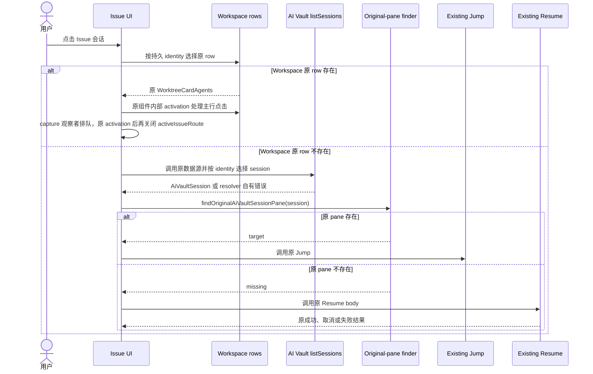
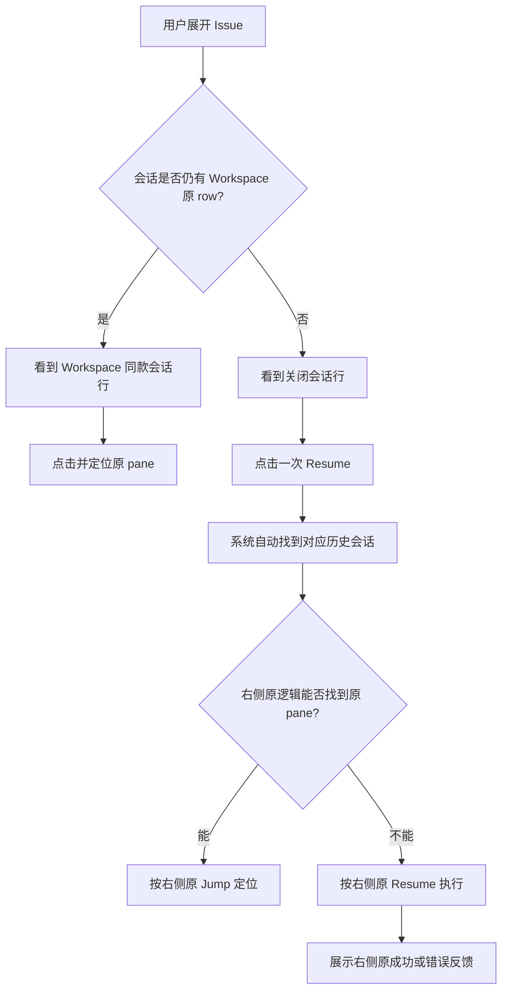

# 改动方案 · Issue 直接复用 Workspace / AI Vault 原生能力

技术方案修订 · 2026-08-30 · 当前有效

> 本文是 [`技术方案.md`](./技术方案.md) 的会话层实施子方案，按用户指定的历史目录保存。
> 产品范围以
> [`Issues-会话展示与关闭会话恢复需求.md`](../../docs/requirements/Issues-会话展示与关闭会话恢复需求.md)
> 为准。本版取代此前所有 Issue Resume 记账、native claim 扩展、Host observation、原生 Resume
> 幂等修复和 host 可验证性设计。
>
> **本版的评审基线是：右侧 AI Vault 当前已有的查找、Jump、Resume 行为连同其现有缺陷一起复用。**
> 本需求不修右侧能力，也不要求 Issue 比右侧更正确、更幂等或覆盖更多 Host 场景。

## 0. 结论

本次会话层只做两件事：

1. **活会话展示对齐 Workspace**：Issue 从目标 Workspace 已生成的 agent rows 中精确选择同一条
   **可激活**会话，原样复用 `WorktreeCardAgents`、原 row 内容和原 activation；Issue 不复制样式、
   状态或点击逻辑。原生 inert 的 `retained` 完成证据不冒充活行，改走 AI Vault 降级链。
2. **关闭会话调用右侧原生能力**：Issue 使用已持久化的 provider identity，从 AI Vault 现有
   `listSessions` 数据源中选出对应历史会话，然后调用右侧已有的原 pane 查找、Jump 或 Resume。

Issue 内新建不再另造 Starting/Retry 展示链：原 Workspace tab 照常创建并聚焦，首条可信
Hook 通过现有 `attachProviderIdentity` 建立 identity 前，预分配 Conversation 对 Issues 不可见。

固定调用顺序只有一条：

```text
Conversation 已有 provider identity
  → AI Vault 原 listSessions
  → 按持久 identity 精确选择 AiVaultSession
  → 原 findOriginalAiVaultSessionPane
      → 找到：原 Jump
      → 找不到：原 Resume
```

Issue 不拥有这条链路的运行状态，也不判断右侧是否恢复正确。现有
`conversation_provider_identities → conversations.issue_id` 已经表达 provider session 与 Issue 的归属，
不新增表、列、migration、RPC method、store slice、Map、TTL、timer、Hook、Host observer、PTY callback
或 remote wire 字段。

## 1. 范围

### 1.1 本次做什么

- Issues Sidebar 与 Issue 详情中的活会话复用 Workspace 原生 row；
- pane/tab 关闭后保留 Conversation、provider identity、原 Workspace 和 `issueId`；
- 用户在 Issue 中点击一次，由系统自动找到对应 AI Vault session；
- 已有原 pane 时调用右侧原 Jump；没有原 pane时调用右侧原 Resume；
- 复用右侧现有 target validation、prepare、launch、toast、错误与取消语义；
- 当前 Promise 执行期间使用组件局部 pending，防止同一个按钮重复提交；
- 保持现有 bind/rebind/unbind 数据契约，不新增映射；
- Issue 新建后继续立即进入原 Workspace tab，provider identity 到达后才在 Issues 显示；
- 关闭行标题优先使用 `Conversation.title`，缺失时对当前可见 identity 调用现有
  `aiVault.resolveSessionTitles`。

### 1.2 本次明确不做什么

- 不修 AI Vault 右侧已有的重复 Resume、启动空窗、原 pane 识别或 Host 问题；
- 不承诺 Issue 在右侧本身失败时仍能定位、恢复或避免新增 tab；
- 不扩读 `pendingStartupByTabId`、`agentLaunchConfigByPaneKey` 或
  `automaticAgentResumeClaimsByTabId`；
- 不给 existing-session Resume 创建 Issue claim、launch token、`prepareResume` 或恢复状态机；
- 不新增 fingerprint 投影、renderer correlation、Host liveness 或 route-verifiable 判定；
- 不新增 Hook、observer、certified exit、synthetic status 或进程退出推断；
- 不在 Issue 中复制 AI Vault scanner、缓存、target resolver、Resume controller 或错误处理；
- 不修改右侧 Jump、Resume、Continue 的行为、状态条件和用户语义；
- 不修改 Workspace row 的默认 DOM、样式、状态或交互；
- 不为 provider identity 到达前的新建记录展示 Issue 专属 Starting/Retry，不在 renderer
  根据 claim 推导启动结果；
- 不延长 15 分钟 launch claim TTL，也不让过期 token 重新获得绑定原 Issue 的权限；
- 不把 Workspace row 上的“绑定到 Issue”快捷入口并入本方案；
- 不为远端 host（包括 SSH 与 WSL）上的 Pi/Prime 新增 Issue 专属 transcript-path 规范化链；无法得到既有强
  identity 时安全不展示、不误绑，完整支持后续单独立项。

### 1.3 验收边界

本需求验收的是**复用一致性**，不是修复原生能力：

- 右侧能找到并定位的会话，Issue 调用同一能力后得到同一目标；
- 右侧能 Resume 的会话，Issue 使用同一 session 与 target 调用同一 Resume body；
- 右侧返回取消、失败、Workspace 不可用或其它错误时，Issue保留同一错误与结果；
- 如果右侧自身在某个窗口重复 Resume、无法 Jump 或不支持某类 Host，Issue 允许表现一致；
- 只有 Issue 复制、改写或绕开右侧行为造成差异，才属于本需求缺陷。

## 2. 设计原则与复用结论

### 2.1 复用候选

| 需求           | 已有能力                                              | 复用方式                                                      | Issue 只允许新增的胶水                                                                       |
| -------------- | ----------------------------------------------------- | ------------------------------------------------------------- | -------------------------------------------------------------------------------------------- |
| 持久归属       | `Conversation` + provider identity + `issueId`        | 直接读取现有记录                                              | identity 转换                                                                                |
| 活会话展示     | `useWorktreeAgentRows` + `WorktreeCardAgents`         | 选择并原样渲染原 row                                          | Issue 侧选择器                                                                               |
| 活会话点击     | `WorktreeCardAgents` 内部原 activation                | 原组件自行处理；Issue 组合层只在主行点击完成后关闭 Issue 页面 | 不导出、不复制原 handler                                                                     |
| 历史数据源     | `window.api.aiVault.listSessions` 与现有 scanner      | 直接调用同一数据源和 Host scope                               | 按持久 identity 选择一条结果                                                                 |
| 原 pane 查找   | `findOriginalAiVaultSessionPane`                      | 直接调用原 matcher/index                                      | 把 Conversation identity 转为其输入                                                          |
| 原 pane 定位   | 右侧 `jumpToOriginalPane` 函数体                      | 抽出并由右侧、Issue 共用                                      | 返回是否找到，供调用方决定是否 Resume                                                        |
| 已关闭会话恢复 | 右侧 `resumeAiVaultSession` 函数体                    | 抽出 Promise-returning 公共函数                               | 无业务状态，仅 await 结果                                                                    |
| 关闭行标题     | `Conversation.title` + `aiVault.resolveSessionTitles` | 仅对当前可见 identity 定点/分批解析                           | 页面局部结果，无全局 cache/timer                                                             |
| 提示与错误     | 右侧 Jump/Resume 现有 toast/错误处理                  | 进入原动作后原样保留                                          | identity resolver 自己负责 scan failed/cancelled、not-found-or-ambiguous、not-resumable 提示 |
| Issue 新建     | 原 Workspace launcher + `attachProviderIdentity`      | 启动后聚焦原 tab，identity 到达后再显示                       | 同一可见性过滤，不新增状态                                                                   |

右侧人工搜索是 UI 文本过滤；Issue 已经有 provider identity，因此需要一个 identity selector 从同一批
`listSessions` 结果中选出目标。这是新的薄胶水，但不是新的 scanner、数据源、缓存或恢复链路，文档不得
把它表述成“main 已经有完整的按 identity 公共搜索 API”。

活行只复用 `rowSource` 为 live / subagent 的 Workspace 行。retained 行是“已从 live map 消失的 done
快照”，在 Workspace 里点击它的语义是 dismiss；Issue 侧对这类会话走 resolve → Jump，Jump 会自己检查
retained 记录并定位仍存在的 tab，所以不把它当作活行渲染。

### 2.2 AI Vault 恢复允许的三个中性 seam

AI Vault 恢复公共热点只允许以下三个无 Issue 语义的接口抽取：

1. **identity resolver**：调用原 `listSessions`，按输入的 execution host、agent 与完整 provider
   identity 选择 `AiVaultSession`；不持久化、不缓存、不 import Issue；
2. **Jump action**：把右侧已有 Jump 函数体抽成可直接调用的函数；右侧仍调用它，默认 toast、activation
   与聚焦行为不变；
3. **Resume action**：把右侧已有 Resume 函数体抽成 Promise-returning 函数；右侧仍调用它，target
   validation、prepare、launch、toast 与失败行为不变。

这三个 seam 只改变可调用性，不增强功能。AI Vault 模块不得接收 `issueId`、`conversationId` 或 Issue
状态，也不得反向 import `@/issues/*`。

Workspace row 不增加 activation/trailing-action seam。`WorktreeCardAgents` 的 activation handler 是组件
内部实现，并未导出；Issue 只渲染原组件，不能自行调用或复制 handler。main 组件根节点会
`stopPropagation()`，因此普通外层冒泡 `onClick` 无效：Issue 组合层只能在 capture 阶段用 main 已有的
`.worktree-agent-row-hover`（full 与 compact 原行均已有）识别主行点击、排除嵌套按钮和
send-target 模式，再用 `setTimeout(0)` 排到本次 click 的 bubble handler 完成后清除
`activeIssueRoute`。这段胶水不得激活 Workspace/tab/pane，也不得修改 `WorktreeCardAgents`。

### 2.3 不复用的分支实现

| 当前分支实验实现                           | 结论 | 原因                                          |
| ------------------------------------------ | ---- | --------------------------------------------- |
| Issue pending-tab Map/TTL                  | 删除 | 形成第二份 destination 状态                   |
| Issue Resume bookkeeping / `prepareResume` | 删除 | 形成第二条 Resume 主链                        |
| provider-resume observation                | 删除 | 为 Issue 修改 PTY/Host 生命周期               |
| certified-process-exit                     | 删除 | 右侧原能力不依赖它                            |
| native resume claim 扩展                   | 删除 | 本需求接受右侧现状，不补其启动窗口            |
| `OriginalPaneState` 扩读 startup/config    | 不做 | 属于右侧原生缺陷修复，不是复用接入            |
| host/route 可验证 gate                     | 不做 | 右侧 target/Resume 链已有自己的成功与失败行为 |
| Workspace trailing action                  | 删除 | 本方案不提供 Workspace 行绑定快捷入口         |

## 3. 数据与身份边界

### 3.1 现有映射足够

本方案只读取以下既有事实：

```text
Conversation.issueId
Conversation.workspaceRef / execution host
Conversation provider identity
```

关闭 pane 只会让 Workspace live row 消失，不应删除上述记录。恢复前后仍是同一个 Conversation 和同一个
Issue 归属；Resume 创建 pane 是 AI Vault 原生行为，不需要 Issue 保存 pane/tab destination。

### 3.2 自动选择使用持久 identity

Issue 不能模拟用户输入搜索词，也不能用标题、prompt、cwd、branch、更新时间或相似度猜测。identity
selector 使用持久记录中已有的 execution host、agent 与 provider metadata，从 AI Vault 原结果中选择
唯一目标；找不到或不唯一时展示 resolver 自己的错误提示，不自行降级到另一条会话。

原 pane 查找、Jump 与 Resume 内部如何处理 identity、prompt fallback、Host 和 Folder Workspace，均保留
右侧当前实现。Issue 不复制 matcher，也不为其增加更强语义。

### 3.3 关闭行标题来源

标题不依赖当前分支新建的全局 `ai-vault-session-title-cache`：

1. 活会话直接使用 Workspace 原 row 的标题；
2. 关闭行优先使用已持久的 `Conversation.title`；
3. 标题缺失且 provider identity 存在时，`conversation-session-titles.ts` 仅对当前可见行
   按 execution host 分批调用现有 `window.api.aiVault.resolveSessionTitles`；
4. 解析结果只存在当前 Issue 页面生命周期，不注册 timer、不周期扫描、不改
   `ai-vault-tab-title-sync.ts`；无结果时回退现有 agent label。

### 3.4 Issue 不维护恢复状态

Issue 不把“已点击 Resume”解释成 attached、live、Starting、failed 或 exited。Promise 结束后只解除当前
组件的局部 pending；下一次点击重新执行相同原生调用顺序。最终显示何时回到 Workspace 原 row，继续由
Workspace/现有运行事实决定。

## 4. 系统交互与用户动线

### 4.1 系统交互图



读图重点：Issue 只选择已有对象并调用已有动作；不存在 Issue Resume 状态机、Host gate 或结果记账。

### 4.2 用户动线图



验收关注点：用户不需要打开右侧、输入搜索词或点击第二次；内部执行结果与右侧原入口一致。

### 4.3 点击规则

1. 渲染时只决定是否存在 Workspace 原 row，不扫描 AI Vault；
2. 用户点击关闭会话后才调用 AI Vault 原数据源；
3. 找到 session 后调用原 pane finder；
4. 找到 target 就调用原 Jump，不调用 Resume；
5. finder 返回 missing 才调用原 Resume；
6. Promise 期间只禁用当前按钮；成功、失败、取消或 throw 都解除；
7. Promise 结束后不写 Issue 状态，后续点击重新走第 2—5 步；
8. 不在 Issue 层增加“右侧应该已经恢复成功”的推断。

活会话的第 1 步同样不复制 activation：`WorktreeCardAgents` 内部 handler 先完成原有激活；Issue
组合层的 capture 观察者只针对主行点击，用下一任务清除 `activeIssueRoute`。这里不能用 microtask，
否则 React 可能先卸载原行，使 bubble activation 来不及执行。嵌套按钮、send target、展开/收起等交互
不得触发页面关闭。

## 5. 与其它 Issue 功能的边界

### 5.1 绑定、改绑与解绑

现有 `Bind existing`、bind/rebind/unbind mutation 和 `Conversation.issueId` 数据语义保持不变。本方案不为
Workspace row 新增绑定按钮，也不修改 Workspace、Dashboard 或 Host header。以后若仍需要 Workspace
快捷绑定，应作为独立需求单独评审。

### 5.2 新建会话的可见性

Issue 新建会话继续调用现有 prepare/claim/Workspace launcher，创建真实 tab 后立即聚焦原
Workspace。只收缩 Issues 展示和 renderer 行为：

1. `build-issue-rows.ts` 与 `IssueConversationList.tsx` 共用“存在 active provider identity”条件；
2. identity 到达前，预分配 Conversation 不进入 Sidebar、详情列表或标题解析请求；
3. `directConversationCount` 与 `runningConversationCount` 使用同一可见会话集，不出现“计数
   为 1 但列表为空”；
4. 删除 Issue renderer 中 `recordLaunchFailure` / `prepareRetry` 调用、Retry 分支与对
   `executionState` / `launchFailure` 的启动 UI 消费；数据层既有字段和 claim 契约不因本次重写；
5. 首条可信 Hook 继续通过现有 `attachProviderIdentity` 建立 identity 与 Issue 归属，之后
   行才出现并复用 Workspace 原 row。

现有 `CONVERSATION_LAUNCH_CLAIM_TTL_MS` 是 **15 分钟**。首条可信 Hook 在 TTL 内到达时，仍消费
claim 并把 provider identity 绑定到预分配的 Issue Conversation；如果首条可信 Hook 在 TTL 后才到达，
`conversation_launch_claim_expired` 必须与 `conversation_launch_claim_not_found` 一样进入现有
`resolveOrdinaryIdentity`：按真实 provider identity 创建或复用 `issueId = null` 的未归属 Conversation，
并记录 Runtime Attachment。这样 Workspace 中真实运行的会话不会从 Issues 数据源凭空消失，用户可再用
现有 `Bind existing` 绑定它。

这个降级**不改变 claim 语义**：过期 token 不能重新绑定原 Issue；`invalid`、`ambiguous` 仍 fail closed。
原预分配且无 identity 的 Issue Conversation 继续隐藏，自动清理仍是后续数据卫生工作。本次只修改
`src/main/issues/conversation-hook-identity-ingestor.ts` 的错误分流，不改 TTL、claim repository、表结构、
timer、PTY 或 Hook server。

### 5.3 SSH、paired runtime 与 Folder Workspace

Issue 不新增连接状态或可验证性判断。AI Vault 原 scanner、target resolution 和 Resume 在这些场景当前
如何成功、失败或降级，Issue快捷入口就保持相同表现。连接丢失不得由 Issue 写成 exited 或删除持久映射。

当前分支为远端 Pi/Prime transcript path 增加的 `agent-session-claim-identity.ts` 与
`local-worktree-filesystem.ts` path-access 校验不是 main 原能力，也不属于三个 seam，因此回退。
main 的同步 `canonicalizeAgentSessionIdentity` 只读取 main 进程本机文件系统，所以降级范围是所有远端
host（包括 SSH 与 WSL），不是只有 WSL：无法得到强 identity 时不显示、不误绑，不猜测 transcript path。

## 6. 仓库改动面与冲突预算

### 6.1 目标改动

```text
src/renderer/src/issues/
  issue-conversation-navigation.ts            [修改] Workspace / AI Vault 原动作薄编排
  issue-conversation-resume.ts                [收缩] identity 转换与调用公共函数
  issue-conversation-presentation.ts          [收缩] 不维护 Resume/Host 生命周期
  conversation-session-titles.ts             [收缩] 可见 identity 定点调用原 title RPC

src/renderer/src/components/issues/
  IssueConversationList.tsx                   [修改] identity 可见性 + Sidebar/详情共用点击规则
  IssueConversationRowContent.tsx             [修改] 选择并复用 Workspace 原 row
  issue-conversation-launch-action.ts         [收缩] 只启动并聚焦原 Workspace tab，删除 Issue Retry/失败投影

src/renderer/src/components/sidebar/issues/
  build-issue-rows.ts                         [修改] 过滤无 provider identity 记录

src/main/issues/
  issue-query-projections.ts                  [修改] direct/running 计数使用同一可见 identity 集
  conversation-hook-identity-ingestor.ts      [修改] expired claim 降级到现有普通 identity 摄取

src/renderer/src/lib/
  launch-agent-in-new-tab.ts                  [最小保留] 仅 Issue 新建所需的可选 launchToken 透传
  launch-agent-web-host-tab.ts                [最小保留] web-host 新建的同一可选 token
  sidebar-worktree-activation.ts              [中性] 把激活结果返回给调用方；Workspace 调用方不读返回值，行为不变

src/renderer/src/components/right-sidebar/
  ai-vault-provider-session-resolution.ts     [薄胶水] 原数据源上的 identity selector
  ai-vault-original-pane-actions.ts            [中性抽取] 原 Jump body 可调用，右侧行为不变
  ai-vault-session-launch-actions.ts           [中性抽取] 原 Resume body 返回 Promise
```

### 6.2 明确零改动复用

以下模块只作为现有能力被调用，默认文件应回到 main 行为：

```text
src/renderer/src/components/sidebar/WorktreeCardAgents.tsx
src/renderer/src/components/sidebar/worktree-card-secondary-rows.tsx
src/renderer/src/components/sidebar/worktree-card-compact-agent-row.tsx
src/renderer/src/components/dashboard/DashboardAgentRow.tsx
src/renderer/src/components/sidebar/worktree-list/rows/folder-row.tsx
src/renderer/src/components/sidebar/worktree-list/rows/HostSectionHeader.tsx
```

`workspace-conversation-binding-rows.tsx` 不属于本方案，应删除其本需求实现。

### 6.3 必须撤回

- `issue-conversation-pending-tab.ts` 及其 Map/TTL；
- `issue-resume-bookkeeping.ts` 与 existing-session `prepareResume`；
- `issue-conversation-launch-observer.ts`；
- `provider-resume-observation.ts`；
- certified-process-exit API、测试和透传；
- 因 Resume 新增的 Issue launch token/claim，以及 `launch-ai-vault-session.ts` 中的 Resume token/类型
  扩张；`launch-agent-in-new-tab.ts` 与 `launch-agent-web-host-tab.ts` 只保留 Issue 新建归属所需的
  可选 token 透传，撤回 `runtimeLaunchResult`、失败 return shape 和其它扩张；
- 因本需求新增的 PTY、Hook server、OrcaRuntime、AppStore 和 remote wire 改动；
- 全局 `ai-vault-session-title-cache.ts` 及其 timer，并把 `ai-vault-tab-title-sync.ts` 恢复 main；
- Workspace/Dashboard trailing action 与绑定入口改动。
- AI Vault original-pane 重写：`ai-vault-original-pane.ts`、`ai-vault-original-pane-host-match.ts`、
  `ai-vault-original-pane-prompt-match.ts`、`ai-vault-original-pane-index.ts`、`ai-vault-session-identity.ts`；
  只保留§6.1 列出的 identity resolver / Jump action / Resume action 三个 seam；
- `agent-session-claim-identity.ts` 与 `local-worktree-filesystem.ts` 的 Issue-only 远端 Pi/Prime
  transcript-path path-access 扩展；同步回退以下四个 Issues 消费方，改回 main 的同步
  `canonicalizeAgentSessionIdentity`：`issue-feature-bootstrap.ts`、`issue-host-lifecycle.ts`、
  `issue-workspace-resolver.ts`、`conversation-hook-identity-ingestor.ts`；后者回退 path-access 后仍保留本方案
  唯一允许的 expired → ordinary identity 错误分流；
- renderer 中 `recordLaunchFailure` / `prepareRetry` 调用、Retry UI 和启动态消费。

`src/main/orcad/orcad-entry.ts` 启动 Hook server，以及 `src/shared/plugins/plugin-host-api.ts`、
`config/electron-builder.config.cjs`、`config/scripts/electron-builder-config.test.mjs`、
`src/renderer/src/runtime/runtime-rpc-environment-call.ts` 及其测试等非本需求改动必须从本功能变更中拆出，
是否保留由各自需求单独决定。

### 6.4 冲突预算

| 区域                      | 允许改动                                                                                    | 禁止改动                                               |
| ------------------------- | ------------------------------------------------------------------------------------------- | ------------------------------------------------------ |
| `renderer/issues`         | identity adapter、原 row 选择、调用编排、局部 pending                                       | Map、TTL、timer、第二套状态机                          |
| Issue components          | 组合原 Workspace row和关闭行                                                                | 复制 Workspace CSS、伪造 pane/tab/live                 |
| AI Vault                  | 三个中性 seam                                                                               | Issue import/参数、状态增强、改变右侧语义              |
| 新建 launcher             | 两个现有 launcher 仅可选 token 透传                                                         | Resume token、Issue import、失败 return shape/状态扩张 |
| Workspace / Dashboard     | **0**                                                                                       | trailing action、Issue RPC、默认 DOM/行为变化          |
| `main/issues`             | `issue-query-projections.ts` 对齐可见计数；ingestor 将 expired 降级到既有 ordinary identity | 新表/列/method/migration、TTL/claim 语义/fingerprint   |
| PTY/Hook/runtime/AppStore | **0**                                                                                       | observer、callback、marker、wire、生命周期修复         |

实现若需要超出预算，必须先回到方案评审。

### 6.5 实施顺序

1. 先执行§6.3 的纯减法，优先删除 `server.ts +60` 对应的 provider-resume observation、certified exit、
   PTY/Hook/runtime/AppStore 接线，再删除 pending Map、Resume bookkeeping、全局 title cache 与无关改动；
2. 再执行§6.2 的回退：Workspace/Dashboard 六个文件回 main；两个 path-access 文件与四个 Issues 消费方
   一起回同步 canonicalizer；
3. 在已回退的 `conversation-hook-identity-ingestor.ts` 上单独加入 expired → ordinary identity 分流；
4. 最后接三个 AI Vault seam、Workspace 原 row 组合、主行点击后的 Issue route 清理、identity 可见性过滤、
   计数与标题解析；
5. 每一步都先跑受影响单测和 diff ratchet，全部收口后再构建隔离 packaged App。

## 7. 状态与失败处理

| 场景                                      | Issue 行为                                                                       |
| ----------------------------------------- | -------------------------------------------------------------------------------- |
| Workspace 可激活原 row 存在               | 渲染原 row，由其内部 handler 激活                                                |
| 只匹配到 inert `retained` 完成证据        | 不渲染为活行；走 AI Vault finder → Jump / Resume                                 |
| AI Vault 找到 session 且原 pane 存在      | 调用原 Jump                                                                      |
| AI Vault 找到 session 且原 pane 不存在    | 调用原 Resume                                                                    |
| AI Vault scan 取消或失败                  | 展示 identity resolver 自有 scan 提示并解除局部 pending                          |
| session 找不到、不唯一或不可 Resume       | 不猜测，展示 identity resolver 自有提示并解除局部 pending                        |
| Resume target/prepare/launch 失败         | 展示原结果并解除局部 pending                                                     |
| 右侧原生链重复 Resume 或无法定位          | Issue 保持相同行为，不增加补偿状态                                               |
| SSH/paired/Folder 在右侧不支持或不可达    | Issue 保持相同行为，不推断 exited                                                |
| Conversation 没有 provider identity       | 不进入 Issues 列表/计数，不自动查找、Resume 或模糊匹配                           |
| 首条可信 Hook 在 15 分钟 claim TTL 后到达 | 不使用过期 token 绑定原 Issue；按现有 ordinary identity 进入未归属区，可手工绑定 |
| 关闭行无持久标题                          | 对当前可见 identity 调用原 `resolveSessionTitles`，无结果回退 agent label        |

## 8. 验证门槛

### 8.1 静态与单测

- diff 证明 Workspace、Dashboard、PTY、Hook、runtime、AppStore 没有本需求业务改动；
- AI Vault 三个公共 seam 不 import Issue，也不接收 Issue 参数；
- 右侧入口和 Issue 入口调用同一个 Jump/Resume 实现，不存在复制函数体；
- identity resolver 使用原 `listSessions` 数据源，不新建 scanner/cache；
- resolver 的 scan failed/cancelled、not-found-or-ambiguous、not-resumable 提示与 Jump/Resume 原生
  错误归属分开；
- Workspace 原 row 存在时，Issue 使用同一 row 数据和内部 activation；普通外层冒泡 `onClick` 不作为
  实现依据，Issue capture 观察者用下一任务在主行原 activation 后清 route，且不影响嵌套按钮/send
  target；`retained` inert row 必须走降级链；
- Workspace row 缺失时顺序严格为 resolve session →原 pane finder → Jump 或 Resume；
- finder 返回 target 时不得调用 Resume；只有 missing 才调用 Resume；
- Resume 不调 Issue RPC、不创建 claim/token、不保存 tab/pane destination；
- success、failure、cancel、throw 都解除当前组件局部 pending；
- Issue 新建后立即聚焦原 Workspace tab；identity 前 Sidebar/详情/direct/running 计数均不显示，
  identity 到达后行只出现一次；
- claim 在 15 分钟内时仍绑定预分配 Issue Conversation；过期后的首条可信 Hook 只创建/复用一条未归属
  Conversation，记录 attachment，后续同 identity hook 复用它；`invalid` / `ambiguous` 不降级；
- 回退 path-access 后，本机 Pi/Prime 仍走同步 canonicalizer；SSH/WSL 等远端 Pi/Prime 安全不展示、不误绑；
- renderer 不再调用 `recordLaunchFailure` / `prepareRetry`，不消费 Starting/Retry UI；
- 关闭行标题优先持久 title，其次仅对可见 identity 调原 title RPC，不启动全局 timer；
- bind/rebind/unbind/Forget 只做回归；
- 删除 provider-resume observation、certified exit、pending Map/TTL 和 Workspace trailing action。

### 8.2 独立 packaged App 真实验收

使用独立测试包和隔离 `userData/profile`，通过 Electron Playwright CDP 验证；不得操作或覆盖用户正在
使用的 `/Applications/Orca (local).app`。

必测动线：

1. 从 Issue 新建一条真实会话，确认立即进入原 Workspace tab；首条 Hook/identity 前
   Issues 行和计数不出现，identity 到达后只出现一条，刷新与重启后映射仍在；
2. 活会话在 Workspace、Issues Sidebar 和 Issue 详情中使用相同内容与点击目标；
3. 关闭 pane 后，Conversation、identity、原 Workspace 与 Issue 归属仍保留；
4. 从右侧对该 session 执行一次 Jump 或 Resume，记录调用目标、结果和反馈；
5. 重置到相同前置状态，从 Issue 点击同一 session，确认调用同一 scanner、同一 Jump/Resume body，并得到
   与右侧一致的目标、结果和反馈；
6. 分别覆盖 Jump/Resume 成功、失败、取消与 Workspace 不可用，Issue 进入原动作后必须与右侧一致；
   另独覆盖 resolver 的 scan failed/cancelled、not-found-or-ambiguous 与 not-resumable 自有提示；
7. 如果右侧原生链自身出现重复 tab、无法 Jump 或 Host 不支持，记录为原生基线问题；只要 Issue 没有
   额外调用、额外状态或不同结果，不阻塞本需求复用验收；
8. 回归 Workspace 原 row 的发送、dismiss、ack、lineage、pane focus，确认本方案没有改动默认行为；
9. 回归 bind/rebind/unbind/Forget，并用显式测试时钟覆盖 claim 到期前后：到期前绑定原 Issue；到期后
   原预分配记录隐藏，但真实 provider identity 只产生一条未归属可见记录，可用 `Bind existing` 绑定；
10. 分别点击活会话主行、send target、展开/收起和其它嵌套操作，确认只有主行激活后关闭 Issue route，
    原 Workspace handler 与次级操作均未被复制或改变；
11. 关闭一条未命名会话，确认仅调用现有 `resolveSessionTitles`得到原标题，不改
    tab title sync、不创建全局 cache/timer。

验收报告必须把“右侧原生结果”和“Issue 调用结果”成对记录，不能把右侧已存在的问题归因于 Issue，
也不能用 mock-only 断言替代真实 App 行为。

## 9. 变更记录

### 2026-08-31 · 按门禁复核清零 Issue 侧违规（Claude）

- 变更原因：架构门禁按正确基线（merge-base）复核后，Issue 代码仍有 33 条真实违规。
- 变更内容：整删 `livenessVerdict`/`unverifiable` 机制（shared 类型与 schema、attachment registry、
  forget 预检、bootstrap 证据探针、查询投影、摄取器 restoredUnconfirmed 分支，共 24 处及其测试）——
  删除后 Forget 预检只依据 live attachment / 未结算 claim / waiting 轮次，SSH 断联语义由 AI Vault
  原生错误表达；`rpc/errors.ts` 与其测试整体还原 main（渲染端从不消费 Issue 错误码，message 经
  `runtime_error` 兜底原样到达）；会话排序不再读 `executionState`，改用 `attachment.kind`；
  manifest 修正自相矛盾（hook-listener 的 `providerTurnId` 判为保留，移出 parity 清单）并补录
  `sidebar-worktree-activation`；`.docs` 杂物目录与 `mcp-gateway` 进 gitignore，
  `docs/requirements` 反向解禁以便需求基线入库。
- 复核结果：门禁 Issue 侧违规 33 → 0；剩余 81 条全部属于同分支承载的另两个功能
  （goal-mode 79、self-hosted artifact 2），交付拆分待定。
- 记录人：Claude。

### 2026-08-30 · 实现复核后的收尾（Claude）

- 变更原因：按本方案收敛后的代码复核发现三处实现问题。
- 变更内容：`not-modified` 轮询不再重造 partition 引用（此前关闭行标题每 5 秒清空重取一次）；
  标题 hook 只在 identity 集合变化时重新解析，并保留上一次结果直到新结果到达；关闭行增加可见的
  Resume 标识；Issue 依赖的 Workspace 行 DOM 选择器收进 `native-agent-row-selectors.ts` 并用测试钉住；
  补齐 resolver 四条提示的 locale 条目；§2.1 写明 retained 行的处理，§6.1 补记
  `sidebar-worktree-activation.ts`。
- 记录人：Claude。

### 2026-08-30 · 实施完成并通过独立打包 App 验证

- 代码已按§6.2/§6.3 收敛：Workspace/Dashboard、PTY/Hook/runtime/AppStore 与 original-pane 核心相对
  main 零业务改动；AI Vault 只保留 identity resolver、Jump action、Resume action 三个中性 seam。
- 真实 App 暴露并修复了一个组合层时序错误：capture 后使用 microtask 会先卸载原行，导致原 bubble
  activation 丢失；现改为 `setTimeout(0)`，让原 handler 先完成，再关闭 Issue route。
- 明确 `rowSource = retained` 是原生 inert 完成证据，不属于可激活 Workspace 行；Issue 对它使用 AI
  Vault 降级链，避免再次出现“看起来 attached 但点不开”。
- 隔离产物 `app.asar` SHA-256 为
  `836cd16789e06034963511e357dad9fc545e7b5e70f477a6b4b991ffbd3dfa7b`；真实 Codex 产品旅程
  `12/12`、完整 packaged App 16 步旅程、行一致性与路由专项均通过。
- 本轮没有操作 `/Applications/Orca (local).app`。真实 SSH / paired runtime 的成对 Resume 尚未执行；
  当前只证明本机、Git/Folder Workspace 与 authority 分区，不把它扩大为远端实机 PASS。
- 记录人：Codex。

### 2026-08-30 · 闭合 claim 过期降级与回退依赖

- 变更原因：identity 前隐藏后，首条可信 Hook 晚于 15 分钟会被 `expired` 分支丢弃，使真实 Workspace
  会话无法进入 Issues；同时原稿把远端 Pi/Prime 缩写成 WSL，并误写了可冒泡的外层点击。
- 变更内容：只在 Issue ingestor 将 `expired` 与 `not_found` 一样降级到现有 ordinary identity，生成或
  复用未归属 Conversation；不改变 TTL 或 claim 权限。回退清单补齐四个 path-access 消费方，并把降级
  范围改为 SSH/WSL 等全部远端 host。活行继续由 `WorktreeCardAgents` 内部 activation 处理；鉴于组件
  `stopPropagation()`，Issue 组合层使用主行限定的 capture 观察者，在原 handler 后只清 route。
- 影响范围：§1、§2.1—§2.2、§4、§5.2—§5.3、§6—§8。
- 验证状态：文档已修订；代码和独立 packaged App 尚未按本版验证。
- 记录人：Codex。

### 2026-08-30 · 收口 identity 前可见性、标题来源与回退清单

- 变更原因：上一版已确定右侧原生能力整体复用，但新建会话仍保留了 Issue
  Starting/Retry 投影，回退文件和关闭行标题来源也未闭合。
- 变更内容：新建会话在原 Workspace 启动，provider identity 到达前不进入 Issues
  列表或计数；删除 renderer Retry/失败投影；关闭行定点复用 `resolveSessionTitles`；
  点名回退 original-pane 重写、Resume token 透传和远端 Pi/Prime 两个 Issue-only 扩展；
  仅保留新建归属必需的两处 launcher 可选 token 透传。
- 影响范围：新建可见性、计数投影、标题解析、冲突预算、失败语义与真实 App 验收。
- 已知延后：无 identity 过期记录的自动清理，以及远端 Pi/Prime 的完整强身份支持。
- 验证状态：文档已修订；代码尚未按本版收敛，真实 packaged App 尚未重验。
- 记录人：Codex。

### 2026-08-30 · [已被上述方案补充] 以右侧当前行为为复用基线，删除原生缺陷修复设计

- 变更原因：需求方明确本次只解决复用问题，接受右侧 AI Vault 当前已有问题；Issue 不应为右侧补一套
  claim、Host 判断、幂等或生命周期逻辑。
- 变更内容：固定为 `listSessions → identity selector → original-pane finder → 原 Jump/原 Resume`；公共
  改动收敛为三个 AI Vault 中性 seam；删除 host-verifiable、fingerprint、native claim、startup/config
  扩读、重复 Resume 修复和 Workspace 绑定快捷入口设计。当时对新建可见性的表述已被上述方案修正。
- 影响范围：需求边界、复用定义、系统时序、改动预算、失败语义与验收标准。
- 验证状态：文档已修订；代码尚未按本版收敛，真实 packaged App 尚未重验。
- 记录人：Codex。

### 2026-08-30 · [已被上述方案取代] 删除 native claim/Hook 扩展，恢复为纯投影

- 旧版仍把原生重复 Resume、host 可验证与新建 Retry 作为本需求硬验收，因此不再指导实现。

### 2026-08-30 · [已被上述方案取代] 使用 native resume claim 跨越 startup 空窗

- 旧版计划扩展 native claim、pane bind 与 status lifecycle；本需求不再修复右侧原生启动窗口。

### 2026-08-28 · [已被上述方案取代] detached 行只打开右侧

- 旧版要求用户打开右侧后再搜索/点击 Resume；不符合一次点击复用原生能力的产品动线。
