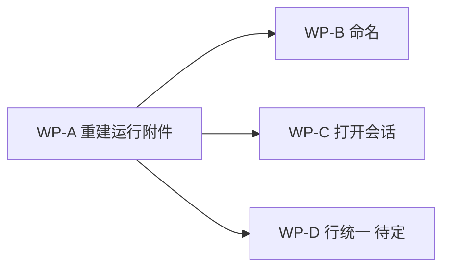

# 改动方案 · 问题清单

对应 [`调研-会话行六个问题.md`](./调研-会话行六个问题.md)。调研只回答「为什么」，本文只回答「改什么、
按什么顺序、怎么验」。

## 1. 问题清单

**当前 11 个。前 7 个是用户报的，后 4 个是排查过程中查出来的。**
清单未封闭——第 11 项的审计还没做完，做完之前不能说这就是全部。

### 用户报的（7）

| # | 问题 | 根因 | 状态 |
| --- | --- | --- | --- |
| 1 | 会话没有标题 | `conversations.title` 只有「用户手动重命名」一条写入路径，Orca 既有的命名链被整条绕过 | 改动已写未提交 |
| 2 / 3 | 两侧的行长得不一样 | 会话行有三处各自手写的实现 | Workspaces 已还原为 main，只剩两处；Issues 侧栏已统一到 `DashboardAgentRow` |
| 4 | 点不开任何会话 | `openConversation` 在「无 paneKey 且无 issueId」时直接 return | 改动已写未提交 |
| 5 | 满屏已关闭的会话 | (a) 补行没有保留边界；(b) 活着的会话被误判为 detached | (a) 已由「Workspaces 一行不改」消解；(b) 即问题 6 |
| 6 | 正在跑的会话显示 detached | 摄取器把 `restoredUnconfirmed` 事件整条丢弃 | **未修** |
| 7 | 改坏既有功能 | 方案条款本身要求替换 Workspaces | 已还原、三份方案条款已反转 |

### 排查中查出来的（4）

| # | 问题 | 性质 | 状态 |
| --- | --- | --- | --- |
| 8 | `transcript_path` 被无条件覆盖成 `null` | **正在丢数据，且不可恢复** | **未修**，一行改动 |
| 9 | 一条 Conversation 记成 `agent='claude'`，带的却是 codex 的 session 与 rollout | 身份错配 | 未归因 |
| 10 | 11 条轮次数为 0、从无 transcript 的空壳 Conversation | 脏数据 | 未归因 |
| 11 | 身份 / 运行附件 / 命名三层重算了 Orca 已有的结论 | **结构性，是 1、6、8 的共同根子** | 审计未完成 |
| 12 | `rounds.ingest` 给每一轮写永久幂等收据，且无任何清理 | 多余 + 无界增长 | 未修 |
| 13 | `resumeLocator` 全链路写入、迁移、投影，渲染层零消费 | 死数据 | 未修 |
| 14 | `executionState()` 声明了两个永远返回不了的值，下游判断成死分支 | 死代码 + 从「没数据」断言「已死」 | 未修 |
| 15 | 无 `turnId` 时用通用「user/assistant 交替」切分轮次，而 Orca 已有按 agent 区分的解码器被零引用 | 轻微重算 | 未修 |

### 第 14 项

`conversation-hook-identity-ingestor.ts` 末尾：

```
function executionState(state): 'launching' | 'running' | 'waiting' | 'stopped' | 'failed'
  working            → running
  waiting | blocked  → waiting
  其余（含 undefined）→ stopped
```

返回类型里的 `'launching'` 和 `'failed'` **函数体永远产不出来**，于是
`getDeleteState()` 里 `attachments.some(item => item.executionState === 'launching')`
和 `=== 'failed'` 两级判断是死分支。

更要紧的是 `state === undefined` 也落到 `stopped`——**从「没有数据」断言「已经结束」**，
与问题 6 同一类错误。

### 第 12 项：给一个不可能重试的调用写幂等收据

`'rounds.ingest'` 这个字符串**全仓只出现在一处**——`round-record-repository.ts:56`，作为
`executeIssueMutation` 的 `method` 参数。它不是 RPC 方法，没有任何客户端能调到它，
更无从重试。但每摄取一轮就写一条永久收据：

| 项 | 实测 |
| --- | --- |
| 收据总数 | 1164，其中 `rounds.ingest` 占 **1068** |
| 收据 `result_json` 合计 | **2.21 MB** |
| 库总大小 | 8.5 MB（其中 Issue 表 **0 行**——一个 Issue 都没建过） |
| 清理机制 | **无**。全仓无 `DELETE FROM issue_mutation_receipts`、无 TTL、无条数上限 |

幂等收据的用途是让**客户端发起的可重试变更**安全重放。内部 hook 摄取不属于这一类。

### 第 13 项：为一条没实现的动线维护字段

`resumeLocator` / `resume_locator` 出现在 9 个主进程与共享文件里——建表、写入、迁移、
经 `issue-query-projections.ts` 投影进线上类型送到渲染层——**渲染层一处都没读**。
「打开一个已结束的会话继续干」这条动线从未实现，但为它建的字段一直在写。

### 已核对、确认合理的（避免误伤）

| 项 | 结论 |
| --- | --- |
| `round_refs` 表（1058 行） | 有用，按 provider-turn 去重 |
| `shared/issues/types.ts` | 正确复用既有类型（`AgentProviderSessionMetadata` / `ExecutionHostId` / `WorkspaceScope` / `TuiAgent`），未重复定义 |
| `transcript-line-decoders-codex.ts` 加 `turnId` | 必要，被 `round-record-transcript-facts.ts` 消费 |
| `local-worktree-filesystem.ts` +53 行 | 纯新增导出，不改既有行为 |
| `AuthorityExecutionHostId` 与 `IssueRouteExecutionHostId` 并存 | 方案有明确理由（持久身份 vs 客户端路由） |

### 逻辑层审计结果（2026-08-27 补做）

约 5000 行的逻辑层已按「是否重算了 Orca 已有结论」过了一遍。**结论是重算并不普遍，问题是集中的。**
新增只有第 14、15 两项，且都不严重。核对下来复用得当的：

| 项 | 结论 |
| --- | --- |
| `issue-query-cursor.ts` + `issue-list-snapshot.ts`（84 行） | 合理。Orca 没有通用分页内核可复用，其余 cursor 都是 linear/MCP 专用 |
| `round-record-text.ts` 的文本截断 | 复用 `shared/utf8-byte-limits.ts` 的 `clampUtf8TextPrefix` |
| `issue-workspace-resolver.ts`（74 行） | 复用 `parseWorkspaceKey`、`splitWorktreeIdForFilesystem`、`toSshExecutionHostId`，本身只是适配器 |
| `round-record-transcript-facts.ts` | 消费 Orca 解码好的 `NativeChatMessage`，没有自己解析 transcript |
| `transcript-line-decoders-codex.ts` 加 `turnId` | 正当扩展：为了拿 turn 边界去扩展 Orca 的解码器，而不是另写一个 |
| 各 `*-repository.ts` 外部复用密度低 | 正常，它们在写 SQL，不是在算业务语义 |

**所以第 11 项的范围是明确的：只有身份、运行附件、命名这三层重算了，不是遍地都是。**
这三层恰好对应问题 1、6、8。

### 第 11 项是什么

同一个 `agentHookServer`，两个消费者，对同一条数据的理解相反：

| | Workspaces | Issues |
| --- | --- | --- |
| 拿到 `restoredUnconfirmed` | `agent-status.ts:2363` 保留行，只打标记 | `conversation-hook-identity-ingestor.ts:90` 整条丢弃 |
| 结果 | 重启后活会话正常 | 重启后活会话变 detached |

新代码没有去读 Orca 已经算好的结论，而是回到最原始的 hook 事件流自己重算一遍。语义就是在
重算过程中丢的。已确认被重算的三层：

| 关注点 | Orca 已有 | Issues 另建 | 造成 |
| --- | --- | --- | --- |
| 运行附件 | agent-status store | `ConversationRuntimeAttachmentRegistry` + 新摄取器 | 问题 6 |
| provider 身份 / transcript 路径 | `agent-session-resume.ts` | 自存一列 `transcript_path` | 问题 8 |
| 命名 | `getAgentRowConversationName` + aiVault | 只有手动重命名能写的 `title` 列 | 问题 1 |

规模：本需求在主进程新增 **65 个非测试文件、8393 行**（`src/main/issues` 7132 行 +
`src/shared/issues` 1261 行）。上表三项是被现象倒推出来的，**不是系统审计的结果**——
其余部分是否还有同类重算，尚未过一遍。

## 2. 改动清单

### WP-A · 重建运行附件（问题 6，连带 4、5b）

问题不在缺数据源——hook 快照重启后是有内容的——而在 Issues 自己把它挡在门外。所以改动集中在
守卫本身，不引入新的数据源。

| 序 | 文件 | 改什么 | 复用什么 |
| --- | --- | --- | --- |
| A1 | `issues/conversation-runtime-attachment-registry.ts` | `RuntimeAttachment` 增加一位证据强度：`evidence: 'live' \| 'restored'` | 无新数据源；这一位来自 hook 事件已有的 `restoredUnconfirmed` |
| A2 | `issues/conversation-hook-identity-ingestor.ts` | `restoredUnconfirmed` 不再整条 return，改走「只查不建」分支 | `ConversationIdentityRepository.findActiveForExecutionHost`（已存在） |
| A3 | `issues/conversation-runtime-attachment-registry.ts` | `getDeleteState` 对 `evidence: 'restored'` 且非 stopped 的附件按「可能还活着」从严 | 既有的 `ConversationRuntimeDeleteProbe` 契约 |
| A4 | `issues/issue-query-projections.ts` | 把 `restored` 表达出去，让 UI 说「上次见到在运行」而不是断言活着 | 既有的 `attachment` / `executionState` 字段 |

**A2 必须保留的边界**：现有守卫不是写错了，它挡住的是
`resolveObservedIdentityOrAllocate` —— 那个方法会**从未经证实的数据里凭空新建一条 Conversation**。
这一层必须保留，restored 分支只允许命中已有身份，命中不到就什么都不做。

**A1/A3/A4 为什么需要那一位**：按 Orca 既有的执行判定词汇
`live / unverifiable / exited`（[`ssh-execution-boundary.md`](../../docs/reference/ssh-execution-boundary.md)），
失联从来不是进程死亡的证据。硬映射成 `stopped` 会让 forget 删掉可能还活着的记录；
硬映射成 `running` 是撒谎，也会让删除守卫无谓阻断。

**不改**：`round-record-ingestor.ts:84` 对 `restoredUnconfirmed` 的跳过是对的——不能从未经证实的
数据写业务事实。`agent-hooks/server.ts` 一行不改。

### WP-B · 命名（问题 1）

| 序 | 文件 | 改什么 | 状态 |
| --- | --- | --- | --- |
| B1 | `issues/conversation-session-titles.ts` | 按 provider session id 批量取 Orca 会话历史标题 | 已写，未提交 |
| B2 | `issues/persisted-conversation-agent-row.ts` | `conversationDisplayName`：用户命名 → 会话历史标题 → **空** | 已写，未提交 |
| B3 | `components/issues/IssueConversationList.tsx` | 第三处渲染改用同一条命名链 | 已写，未提交 |

复用的是 Orca 既有的两套机制：`aiVault.resolveSessionTitles`（定点批量解析，不是全量扫描的
`listSessions`），以及会话历史自身的 `custom-title` → `ai-title` → 首条用户消息优先级。

**已知覆盖率（实测 26 条 Conversation）**：

| 情况 | 条数 | 结果 |
| --- | --- | --- |
| claude transcript 带 `ai-title` | 8 | 拿到真名 |
| codex rollout，走首条用户消息 | 4 | 有名字，可能是样板前言 |
| transcript 文件已被删除 | 2 | 取不到 |
| `transcript_path` 为空 | 12 | 取不到 |

取不到时返回空串，由 `DashboardAgentRow` 用状态标签兜底，**不回落成 agent 名**——
一整列都叫 `claude` 正是问题 1 的现象。

### WP-C · 打开会话（问题 4）

| 序 | 文件 | 改什么 | 状态 |
| --- | --- | --- | --- |
| C1 | `sidebar/issues/issue-virtual-row.tsx` | 激活 Workspace 提到无条件执行，不再被关在「有活 pane」分支之后 | 已写，未提交 |

复用同一函数内既有的 `activateAndRevealWorktree` / `activateAndRevealFolderWorkspace`。
A 做完之后，有附件的行还会恢复「直接跳到那个 pane」的能力。

### WP-D · 行统一（问题 2 / 3）

Workspaces 还原后，会话行从三处减为两处：

| 位置 | 现状 |
| --- | --- |
| `sidebar/issues/issue-virtual-row.tsx` | 已用 `DashboardAgentRow` |
| `components/issues/IssueConversationList.tsx` | 仍是手写卡片行 |

详情卡片和侧栏行的信息密度要求不同，是否也换成 `DashboardAgentRow` 需要先看实际效果，
列为待定，不阻塞 A/B/C。

## 3. 顺序



A 是前置：不做 A，行上没有 paneKey，B 的名字挂在一堆点不开的死行上，C 也只能退化成
「打开 Issue 详情」。A 单独做完就能同时改善 4、5b、6 三个现象。

## 4. 怎么验

不靠单测自证，每条都有可观察的实测口径。

| 项 | 验证方法 | 通过标准 |
| --- | --- | --- |
| A | 开着 agent 重启 App | 重启前 `working` 的会话，重启后仍显示运行中、可点开跳到原 pane |
| A | `last-status.json` 里 `state != done` 的条数 | 与重启后显示为运行中的行数一致 |
| A3 | 对一条 restored 且非 stopped 的会话执行 forget | 被拒绝，而不是静默删除 |
| B | 侧栏与详情两处 | 同一条会话名字一致；没有任何一行显示为裸 `claude` / `codex` |
| C | 点击「未归属」区里没有活 pane 的行 | 定位到所属 Workspace，而不是毫无反应 |
| 7 | `git diff origin/main -- worktree-card-secondary-rows.tsx` | 输出为空 |

回归面：`pnpm tc`、`pnpm test src/main/issues src/renderer/src/issues src/renderer/src/components/sidebar`、
`pnpm run check:code-quality:changed`。

## 5. 未决

按重要性排，前两条会影响 B 的实际效果。

1. **12 条 `transcript_path` 为空**（26 条里近一半）。已查清，是**两个不同的原因**：

   **(a) 1 条是被后续 hook 抹掉的 —— 确凿的代码缺陷。**
   `issues/conversation-identity-repository.ts` 的 UPDATE 里：

   ```
   transcript_path = ?     ← providerSession.transcriptPath ?? null    无条件覆盖
   resume_locator  = ?     ← input.resumeLocator ?? matching.resume_locator   有回退
   ```

   紧挨着的两列一个有回退保护、一个没有。任何一条不带 `transcript_path` 的后续 hook 都会把
   已经记下的路径抹成 NULL。`01a032e1` 磁盘上 rollout 文件还在、库里却是空的，就是这么来的。
   **而且不可恢复**：`agent-session-resume.ts:29-35` 的注释写明，新版 Claude Code 的 transcript
   文件名用的 UUID 与 hook `session_id` 不同，路径无法从 id 反推——丢了就是丢了。
   修法与相邻列对齐即可：`providerSession.transcriptPath ?? matching.transcript_path`。

   **(b) 11 条是从来就没有 transcript 的会话。**
   全盘扫描 `~/.claude/projects` 得到 241 个 sessionId，这 11 个**一个都不在其中**；其中 9 条
   轮次数为 0。即：Orca 收到一条带 `session_id` 的 hook 就建了 Conversation，而那个 session
   从未写过任何内容。

2. **一条数据自相矛盾**：Conversation `f56cdf5d` 的 `agent = 'claude'`，`session_id` 却是 codex
   形态的 `01a03e8d-…`，`transcript_path` 指向 `~/.codex/sessions/…/rollout-*.jsonl`，轮次数 0。
   该 rollout 文件的创建时间是 `2026-08-26 22:50:45`，而这条身份的 `observed_at` 是 `22:50:48`
   ——相差 3 秒，说明是同一次 codex 启动被记成了 claude。
   机制上的可疑点：`resolveOrdinaryIdentity(event, context, providerSession, event.payload.agentType)`
   里，agent 取自 `event.payload.agentType`，而 providerSession 由
   `extractAgentProviderSession(source, payload)` 独立提取——两者若不同源就会错配。

**(1b) 与 (2) 尚未归因，共同特征是轮次数为 0。** 已排除 goal-mode（8/25 之后无活动）；应用日志在
   10:21–10:33 那个窗口没有任何 agent 启动类事件。要坐实需要在 hook 入口加一条诊断：
   **首次为某 `session_id` 创建 Conversation 时，记录事件名、`source`、`payload.agentType`
   与是否带 `transcript_path`**。这条诊断本身也应进 WP-A。
3. **`IssueConversationList` 是否也统一到 `DashboardAgentRow`**（WP-D）。
4. hook 落盘的 7 天 TTL（`HYDRATE_MAX_AGE_MS`）意味着更久以前的会话本来就重建不出附件。
   这是既有设计，不改；但要确认 UI 对这批的表达是「已结束」还是「不确定」。

## 6. 变更记录

### 2026-08-27 · 初版

- 依据：调研文档六个问题 + 当日对 `agent-hooks/server.ts`、`conversation-hook-identity-ingestor.ts`
  与本机真实数据（`last-status.json` 10 条、`orca-issues.db` 26 条、14 个 transcript）的实测。
- 与调研文档的差异：问题 6 的根因在本方案成文当日被推翻重写，旧结论「hook 状态纯内存」错误，
  实际是 `restoredUnconfirmed` 守卫；因此 WP-A 不引入新数据源，只改守卫。
