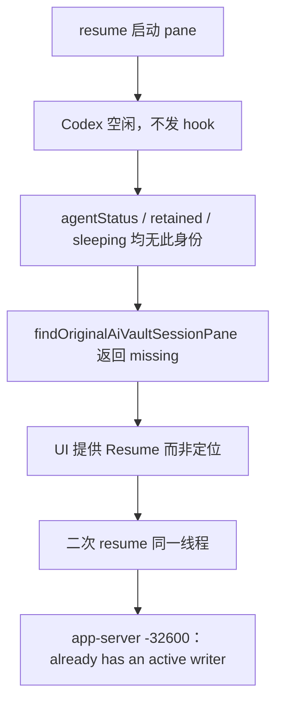
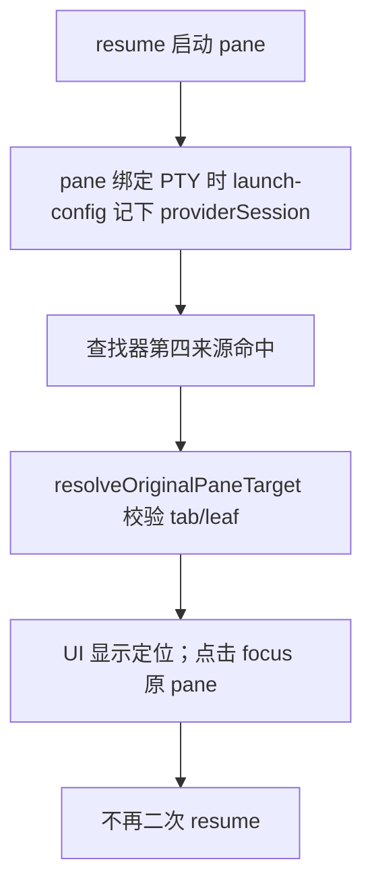

# 方案 · 原 pane 查找器纳入 launch-config 身份

落点：并入 `feat/self-hosted-artifact-backend`（2026-08-31 用户决策，收进 Issue 需求）· 原拟独立 main PR

## 1. 背景：一次真实事故

2026-08-31 实测复盘（本机证据）：

- 15:51 一个 codex 会话在 Orca pane 里被 resume（PID 4217，`codex -c features.hooks=true resume 01a0465a-…`，父进程链 `orca-t… → zsh → codex`），此后空闲 2 小时 22 分；
- Codex 空闲期间不发任何 hook（hook 在一轮完成时才发），`agentStatusByPaneKey` 里始终没有这条 provider 身份；
- 用户再次点击 Resume → 第二个 `codex resume` 同线程 → app-server 拒绝：
  `thread 01a0465a-… already has an active writer (code -32600)`。



右侧 Session History 面板与 Issues 快捷入口共用这条查找链，两处表现相同。这是 main 的既有行为。

## 2. 现状与缺口

`findOriginalAiVaultSessionPane`（`ai-vault-original-pane.ts`）与列表用的
`buildAiVaultOriginalPaneIndex`（`ai-vault-original-pane-index.ts`）只读三个来源：

| 来源 | 覆盖 | 缺口 |
| --- | --- | --- |
| `agentStatusByPaneKey` | hook 已确认的活 pane | 首条 hook 之前为空 |
| `retainedAgentsByPaneKey` | 已结束的保留行 | 同上 |
| `sleepingAgentSessionsByPaneKey` | 睡眠恢复记录 | resume 启动时即被清除（`resume-sleeping-agent-session` 启动路径调用 `clearSleepingAgentSession`） |

而 `agentLaunchConfigByPaneKey` 在 pane 绑定 PTY 时就建立、随原生生命周期清理
（command-finished：`parked-terminal-command-status.ts:90`；身份变更：`pane-agent-identity.ts:174`；
pane/tab 关闭与远端清理各有既有调用点），**不依赖 hook**——正是缺口所在的窗口。

一个关键实情：条目类型 `AgentLaunchConfigRegistrationMetadata` 已有 `providerSession?` 字段
（`agent-status.ts:94`），但 main 上没有任何注册点填它。所以本方案分两半：先把身份接进去，再让查找器读它。

## 3. 改动

### 3.1 注册时携带 resume 身份（填已有字段，不加新字段）

| 注册点 | 身份来源 | 改动 |
| --- | --- | --- |
| `pty-connection/sleeping-record-access.ts` 两处 `registerAgentLaunchConfig` | `session.paneStartup.resumeProviderSession`（启动载荷既有字段，`runtime-terminal-contracts.ts:233`） | 各加一行条件展开 |
| `pty-connection/deferred-cold-restore-and-snapshot.ts` 冷恢复注册 | 冷恢复 startup 对应的 sleeping 记录 `providerSession` | 一行透传（若 `ColdRestoreAgentResumeStartup` 未携带则补一个字段透传，仍是 renderer 内部类型） |
| `ipc-events/terminal-presentation-ipc-bridge.ts` 远端桥 | —— | **已核实 presentation 载荷不含身份：远端 v1 不覆盖，不改 wire** |

只填现有可选字段，未 resume 的普通启动不受影响（字段保持缺省）。

### 3.2 查找器与索引各加一个来源

- `ai-vault-original-pane.ts`：`OriginalPaneState` 的 Pick 增加 `agentLaunchConfigByPaneKey`；
  `findOriginalAiVaultSessionPane` 在 sleeping 循环之后、prompt 回退之前，按
  `identity.agentType === session.agent && identity.providerSession?.id === session.sessionId`
  匹配，命中后仍走既有 `resolveOriginalPaneTarget`（校验 tab/leaf 仍存在）；
- `ai-vault-original-pane-index.ts`：增加 `launchConfigByProvider` 一张索引，
  `findOriginalAiVaultSessionPaneInIndex` 同位置查一次；
- `ai-vault-original-pane-actions.ts`：`useShallow` 选择器多取一个 map（一行）。

匹配语义与既有来源完全一致（agent 相等 + session id 相等），不引入新的判定规则；
`findAiVaultSessionLiveState` 不改——launch-config 命中没有 hook 状态，行不显示运行状态点，只提供定位。



### 3.3 明确不做

- 不覆盖 `pendingStartupByTabId`（pane 尚未挂载的秒级窗口；无 paneKey，需要 tab 级 target 形态，收益小）；
- 不改 remote wire、schema、主进程、hook；
- 不改右侧 Resume 本体与错误处理；
- 不引入 prompt/标题模糊匹配的新路径。

## 4. 代码改动明细

以下片段以 origin/main 当前实现为基线逐处核对过；行号会漂移，锚点以代码为准。

### 4.1 填身份：`pty-connection/sleeping-record-access.ts`（两处，各 +1 行）

首次启动注册（`session.paneStartup.launchConfig` 分支）：

```ts
      .registerAgentLaunchConfig(session.cacheKey, session.paneStartup.launchConfig, {
        agentType: session.paneStartup.launchAgent ?? session.paneStartup.initialAgentStatus?.agent,
        ...(session.launchToken ? { launchToken: session.launchToken } : {}),
        ...(session.paneStartup.resumeProviderSession
          ? { providerSession: session.paneStartup.resumeProviderSession }
          : {}),
        tabId: session.deps.tabId,
        leafId: session.pane.leafId
      })
```

daemon reattach 注册（`effectiveLaunchConfig` 分支）——reattach 通常没有启动载荷，按现值 best-effort：

```ts
    useAppStore.getState().registerAgentLaunchConfig(session.cacheKey, effectiveLaunchConfig, {
      agentType: /* 原有三级回退不变 */,
      ...((metadata?.launchToken ?? session.launchToken)
        ? { launchToken: metadata?.launchToken ?? session.launchToken }
        : {}),
      ...(session.paneStartup?.resumeProviderSession
        ? { providerSession: session.paneStartup.resumeProviderSession }
        : {}),
      tabId: session.deps.tabId,
      leafId: session.pane.leafId
    })
```

`session.paneStartup` 即 pending startup 载荷，`resumeProviderSession` 是其既有字段
（`runtime-terminal-contracts.ts:233`），无需类型改动。

### 4.2 填身份：`pty-connection/deferred-cold-restore-and-snapshot.ts`（+1 行）

`ColdRestoreAgentResumeStartup` 本身就带 `resumeProviderSession`（`fresh-spawn-types.ts:19`）：

```ts
    state.registerAgentLaunchConfig(session.cacheKey, startup.launchConfig, {
      agentType: startup.agent,
      launchToken: startup.launchToken,
      providerSession: startup.resumeProviderSession,
      tabId: session.deps.tabId,
      leafId: session.pane.leafId
    })
```

### 4.3 读身份：`right-sidebar/ai-vault-original-pane.ts`

Pick 增加一个键：

```ts
export type OriginalPaneState = Pick<
  AppState,
  | 'agentStatusByPaneKey'
  | 'retainedAgentsByPaneKey'
  | 'sleepingAgentSessionsByPaneKey'
  | 'agentLaunchConfigByPaneKey'
  | 'tabsByWorktree'
  | 'terminalLayoutsByTabId'
>
```

`findOriginalAiVaultSessionPane` 在 sleeping 循环之后、`return promptMatchedTargets…` 之前追加
（与既有三个循环同构，身份判定逐字一致）：

```ts
  // Why: a resumed pane emits no hook until its first turn completes; the
  // launch-config registry is the only identity carrier in that window.
  for (const [paneKey, entry] of Object.entries(state.agentLaunchConfigByPaneKey)) {
    if (
      agentMatches(session, entry.identity.agentType) &&
      providerSessionMatches(session, entry.identity.providerSession?.id)
    ) {
      const target = resolveOriginalPaneTarget({
        state,
        paneKey,
        tabIdHint: entry.identity.tabId
      })
      if (target) {
        return target
      }
    }
  }
```

`findAiVaultSessionLiveState` 不改：launch-config 命中没有 hook 状态，行不显示状态点。

### 4.4 读身份：`right-sidebar/ai-vault-original-pane-index.ts`

```ts
type LaunchConfigEntry = { paneKey: string; entry: OriginalPaneState['agentLaunchConfigByPaneKey'][string] }

export type AiVaultOriginalPaneIndex = {
  // …既有五个索引不变…
  launchConfigByProvider: ProviderIndex<LaunchConfigEntry>
}
```

`buildAiVaultOriginalPaneIndex` 增加一段：

```ts
  const launchConfigByProvider: ProviderIndex<LaunchConfigEntry> = new Map()
  for (const [paneKey, entry] of Object.entries(state.agentLaunchConfigByPaneKey)) {
    if (entry?.identity.agentType && entry.identity.providerSession) {
      appendToIndex(
        launchConfigByProvider,
        providerKey(entry.identity.agentType, entry.identity.providerSession.id),
        { paneKey, entry }
      )
    }
  }
```

`findOriginalAiVaultSessionPaneInIndex` 在 sleeping 查询之后追加：

```ts
  for (const { paneKey, entry } of index.launchConfigByProvider.get(key) ?? []) {
    const target = resolveOriginalPaneTarget({
      state: index.state,
      paneKey,
      tabIdHint: entry.identity.tabId
    })
    if (target) {
      return target
    }
  }
```

### 4.5 订阅：`right-sidebar/ai-vault-original-pane-actions.ts`（+1 行）

```ts
  const originalPaneLookupState = useAppStore(
    useShallow((s) => ({
      agentStatusByPaneKey: s.agentStatusByPaneKey,
      retainedAgentsByPaneKey: s.retainedAgentsByPaneKey,
      sleepingAgentSessionsByPaneKey: s.sleepingAgentSessionsByPaneKey,
      agentLaunchConfigByPaneKey: s.agentLaunchConfigByPaneKey,
      tabsByWorktree: s.tabsByWorktree,
      terminalLayoutsByTabId: s.terminalLayoutsByTabId
    }))
  )
```

注意：该 map 的引用只在注册/清理时变化（`registerAgentLaunchConfig` / `clearAgentLaunchConfig`
都是整 map 替换），订阅它不会引入高频重渲染。

### 4.6 测试改动

- `ai-vault-original-pane.test.ts`：
  1. launch-config 身份命中 → 返回该 pane target；
  2. agent 不同或 session id 不同 → 不命中；
  3. 命中但 tab 已关闭（layout 缺 leaf）→ 返回 null；
  4. 条目无 `identity.providerSession` → 不参与（现状回归锚点）；
  5. hook 已确认的 live 行与 launch-config 同时在场 → live 行优先（顺序断言）；
  6. `findAiVaultSessionLiveState` 对 launch-config 命中仍返回 null。
- `ai-vault-original-pane-index.ts` 相应用例镜像一份（索引路径与直查路径行为一致）。
- 既有精确断言随之更新：`pty-connection-agent-session-resume.test.ts` 两处、
  `pty-connection-sleeping-resume-banner.test.ts` 一处的注册 metadata 期望补 `providerSession`
  ——这三个失败正是插桩在真实冷恢复链路生效的证明。
- 注册点用例（`pty-ipc` 套件或 pty-connection 既有测试就近补）：resume 启动后
  `agentLaunchConfigByPaneKey[paneKey].identity.providerSession` 在位；普通启动缺省；
  冷恢复注册携带 `startup.resumeProviderSession`。

## 5. 安全性论证

1. **误定位**：双重防护——身份精确相等 + `resolveOriginalPaneTarget` 复核 tab/layout 仍存在；
2. **指向已退出的 pane**：command-finished 清理点会移除条目；清理竞态下最坏结果是把用户带到显示已退出
   TUI 的 pane（用户看见现场，关掉后再 Resume 即可），且此时 writer 锁已释放，不会再触发 -32600；
3. **零回归面**：main 上该字段从未被填，未填时四号来源永不命中，行为与现状逐字节等价；只有携带
   resume 身份的启动才激活新路径。

## 6. 真机验收

单测见 §4.6。真机验收（隔离包）复刻本次事故：resume 一个 codex、不发消息，分别点右侧
Session History 与 Issues 快捷入口——两处都应定位原 pane，codex 进程数不变、不出现 -32600；
关闭该 pane 后再点，恢复为正常 Resume。

## 7. 规模与风险

| 项 | 估计 |
| --- | --- |
| 实现 | 约 40-50 行，5 个文件，全部在 renderer |
| 测试 | 约 60-80 行 |
| wire / schema / 主进程 | 0 |
| 冲突面 | `ai-vault-original-pane.ts` main 近 400 提交仅 4 次改动，低 |
| 风险 | 低——无身份时零行为差；受益方为右侧面板与 Issues 两个入口 |
