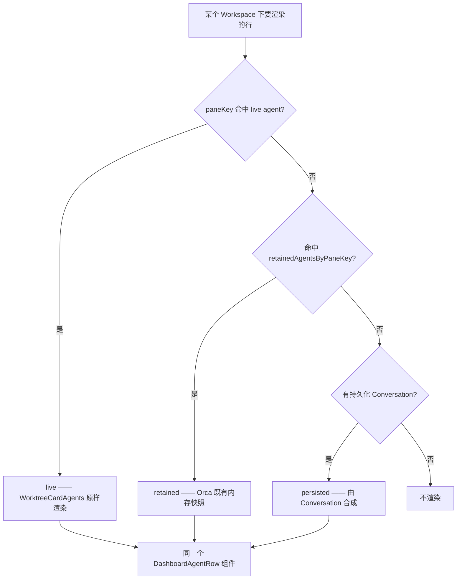

# 方案 · 持久 Conversation 行渲染，及 Issues 功能的复用与影响面审计

> **状态：已被 2026-08-28 方案替代，仅保留为历史审计证据。** 本文 §3 的 persisted row 合成、
> 假 `paneKey/tab`、向 Workspaces 补持久行及 Conversation/identity 依赖均不再实施。当前唯一方案是
> [`改动方案-会话层改为投影.md`](./改动方案-会话层改为投影.md)：沿用现有
> `conversation_provider_identities → conversations.issue_id`，关闭会话打开右侧 AI Vault 搜索/Resume，
> attached 行直接复用整个 `WorktreeCardAgents`，detached 行保留现有 Issue 降级展示。

## 0. 摘要

两部分：

1. **设计**（§3）：持久化的 Conversation 合成一份 `DashboardAgentRowData`，交给既有的
   `DashboardAgentRow` 渲染，不再另画一套行。
2. **审计**（§4–§6）：逐个核对 `bc0259af3` 改动过的 33 个既有文件，以及 119 个新增源文件中
   与 Orca 既有能力重复的部分。

结论先行：

- 改动既有代码 **6 处**，其中 **2 处已修、1 处待修、3 处属正当重构**
- 该复用没复用 **3 处**，其中侧栏零虚拟化影响最大（实测本机 591 条未归属会话）
- Conversation 真正新增的只有**跨 App 重启的持久化**与 **Issue 组织维度**

## 1. 问题

Workspaces 侧栏出现大量同名行：17 行都叫 `claude`，无法分辨。

实测数据（本机 `profiles/local-default/issues/orca-issues.db`）：

| 项 | 值 |
| --- | --- |
| Conversation 总数 | 19（17 claude + 2 codex） |
| 其中有标题的 | **0** |
| round_records | 627，其中 625 条有用户输入预览 |
| 创建时间 | 08-26 22:02 ～ 08-27 14:12，均为真实会话 |
| 「未归属」计数 | **19 / 591** |

### 1.1 直接成因

`conversations.title` 只有一条写入路径——用户手动重命名
（`conversation-record-repository.ts:181-192` ← `conversations.update` ← `ConversationRenameDialog`）。
新建的 Conversation 一律为 NULL，渲染回落到 `conversation.title ?? conversation.agent`。

### 1.2 更深的成因

WP7 把 Workspaces 的 agent 行整段替换掉了。原实现：只要该 Workspace 下存在任何 Conversation，
**连活着的 agent 行也一起换成手写 button**，`DashboardAgentRow` 那 328 行（状态点、模型、工具名、
耗时、发送目标、右键菜单、lineage）全部丢失。

这是回归，不是"新功能尚未完善"。

## 2. 调研结论

以下每条都在代码中核实过，标注了出处。

### 2.1 Orca 已有「行活过 agent」的机制

`store/slices/agent-status.ts:58` 的 `RetainedAgentEntry`：

```ts
export type RetainedAgentEntry = {
  entry: AgentStatusEntry
  worktreeId: string
  /** Snapshot of the tab at retention time; kept full (not just an id)
      because the tab may be gone from `tabsByWorktree` by render time. */
  tab: TerminalTab
  agentType: AgentType
  startedAt: number
}
```

对应 `DashboardAgentRowData.rowSource` 的 `'retained'` 档。

**结论**：agent 退出、tab 关闭后仍保留行，Orca 早就做了，只是内存态。
Conversation 唯一新增的是**跨重启**。

### 2.2 `DashboardAgentRow` 的实际依赖很轻

逐字段 grep 的结果，整个组件只读：

| 来源 | 字段 |
| --- | --- |
| `entry` | `interrupted` `lastAssistantMessage` `model` `toolInput` `toolName` `workingMode`，外加经 `getAgentRowPrimaryText` 读取的 `orchestration` / `prompt` |
| `tab` | 仅 `tab.id` |
| row 本身 | `paneKey` `entry` `tab` `agentType` `state` `startedAt` `rowSource` `activationPaneKey` `lineage` |

`entry` 的六个字段全部是可空展示字段，缺失时组件自行降级，`DashboardAgentRow.tsx:149-150` 有明确兜底：

```ts
// Why: prompt is '' when unknown, so fall back to the state label to keep the row labeled.
const displayLabel = prompt || agentStateLabel(asDotState(agent.state, agent.entry.workingMode))
```

### 2.3 tab 消失后的兜底路径已存在

`use-agent-row-conversation-name.ts:62-67`：

```ts
// Why: retained row snapshots need a fallback after their live tab disappears.
return getAgentRowConversationName(liveTab ?? agent.tab, agentType, generatedTitlesEnabled, paneLiveTitle)
```

`liveTab ?? agent.tab` 正是为快照准备的，持久化行走同一条即可。

### 2.4 交互完全由调用方注入

`DashboardAgentRow` 的 props：

```ts
onActivate: (tabId: string, paneKey: string) => void
sendTargetStatus?: 'eligible' | 'disabled' | 'sending'
sendTargetDisabledReason?: string
onSendTargetClick?: (paneKey: string) => void
```

持久化行可以传 `sendTargetStatus: 'disabled'` 并给出原因，`onActivate` 换成恢复/打开详情。
**组件本身不需要任何修改。**

### 2.5 会话名有现成来源

`conversation_provider_identities` 存了 `session_id` 与 `transcript_path`；
Orca 的 `aiVault.listSessions`（右侧 Agent Session History 面板一直在用）返回的会话带 `title`
（`src/shared/ai-vault-types.ts:89`）。

实测按 `session_id` 关联：**19 条命中 8 条**，取到的是
`Multica AI 产品设计与实现`、`实现 Codex Goal 模式的 orca 插件设计`、
`Auto-browser 测试用例沉淀和报告可视化` 这类。

未命中的 11 条全部是 **transcript 文件不存在**（多数路径为空），属于未真正落盘的会话。

## 3. 设计：持久行复用既有 agent 行

### 3.1 行来源的优先级



前两层信息更全（`entry` 是真的），命中就不合成第三层。

### 3.2 字段映射

| `DashboardAgentRowData` 字段 | persisted 行的来源 | 缺失处理 |
| --- | --- | --- |
| `paneKey` | 合成键，仅作 React key 与 lineage 映射，不当 pane key 解析 | — |
| `agentType` | `conversations.agent` | — |
| `state` | 由 `executionState` 映射 | — |
| `startedAt` | `conversations.created_at` | — |
| `rowSource` | 新增枚举值 `'persisted'` | — |
| `tab` | 由 `workspace_name_snapshot` / `workspace_id` 合成快照 | 组件仅用 `tab.id` |
| `entry.model` 等六项 | 无持久化来源，留空 | 组件自行降级 |
| `lineage` | 不提供 | 可选字段 |

### 3.3 名字的回落链，逐级说明来源

分两段：先走 Orca 既有的 tab 命名（`getAgentRowConversationName`），取不到再查会话历史。

#### 第一段：`getAgentRowConversationName(liveTab ?? snapshotTab, ...)`

实现在 `src/shared/agent-row-conversation-name.ts:113-149`，五级依次尝试：

| 级 | 字段 | 来源与写入时机 |
| --- | --- | --- |
| 1 | `tab.customTitle` | **用户手动给标签页改的名**。用户不改就是 `null`（`terminal-tab-creation.ts:101` 建标签页时初始化为 null） |
| 2 | `tab.quickCommandLabel` | **通过「快捷命令」启动时带上的标签**。普通启动没有；由 `tabs.ts:669,881` 在创建/水合标签页时写入 |
| 3 | 实时终端标题 | agent 通过 OSC 转义序列设置的终端标题。**要先过 `isMeaningfulOpenCodeTerminalTitle`**——只有"有意义"的才采用，避免把 shell 提示符之类当名字。分屏时读的是本行自己那个 pane 的标题，不是标签页标题 |
| 4 | `tab.generatedTitle` | **不是 AI 生成的**。由 `deriveGeneratedTabTitle(prompt)`（`src/shared/agent-tab-title.ts:71`）对启动 prompt 做确定性字符串处理：去 URL、去 markdown 标点、去 `issue/task/bug/feature/pr #N:` 前缀、按句子切分取第一句。受设置项 `tabAutoGenerateTitle` 开关控制 |
| 5 | `conversationNameFromLiveTitle(...)` | 由实时标题结合 agent 类型和 `tab.defaultTitle` 推导，去掉 `claude code` / `gemini cli` 这类 agent 自报名 |

子 agent 行和与父共用标签页的行会短路返回 `null`（`cannotOwnTabName`），因为标签页的名字不属于它们。

#### 第二段：`aiVault` 会话历史的 `title`

按 `conversation_provider_identities.session_id` 关联 `aiVault.listSessions` 的结果。
该 `title` 由 Orca 主进程的会话扫描器从 transcript 里解析出来
（`src/main/ai-vault/session-scanner-primary-parsers.ts`），自身也有优先级：

| 级 | 记录类型 | 说明 |
| --- | --- | --- |
| 1 | `custom-title` | 用户在 provider 侧给会话起的名 |
| 2 | `ai-title` | **provider 自己生成的标题**。例如 Claude Code 会用「Generate a concise, single-line task title...」给自己的会话命名——这条 prompt 不在 Orca 源码里，是 provider 的行为 |
| 3 | 首条用户消息 | 注入的 meta prompt 只作最后兜底，不抢占主标题 |

**这一段是持久行独有的价值**：它不依赖任何存活中的 tab，会话结束、标签页关闭、App 重启之后依然可取。

实测本机 19 条 Conversation 命中 8 条，取到的是「Multica AI 产品设计与实现」
「实现 Codex Goal 模式的 orca 插件设计」这类；未命中的 11 条全部是 transcript 文件不存在。

#### 第三段：agent 名

前两段都取不到时的最终兜底，即现状的表现。

#### 为什么不用轮次预览推标题

曾尝试用 `latestRound.userInput` 当名字，实测取到的是「重跑一下」「那就不行呗」这类续话——
`latestRound` 是**最近**一轮而非首轮。而即使改取首轮，也会撞上
`Continue work from the prior Orca session using the...` 这类样板前言。
`getAgentRowPrimaryText` 的注释对此有明确警告：

```
Never surface the lifecycle preamble itself — status prompts are single-line ~200-char
folds, and the first characters are boilerplate ("You are working inside Orca…").
```

所以回落链里不含这一步：provider 自己的 `ai-title` 已经解决了同一个问题，且解得更好。

**不把自动名字写入 `conversations.title`**：该列保持"仅用户显式命名"的语义。
自动名与用户命名混进同一字段后，将无法再区分二者，也无法在 Orca 更新会话名时跟随。

### 3.4 交互降级

| 动作 | live / retained | persisted |
| --- | --- | --- |
| 点击行 | 激活 tab 并聚焦 pane | 恢复会话或打开 Issue 详情（**待定，见 §7**） |
| 发送消息 | 可用 | `sendTargetStatus: 'disabled'` 并给出原因 |
| 右键菜单 | 既有行为 | 沿用，无 pane 的项自然不可用 |

## 4. 审计一：改动了既有代码的 6 处

`bc0259af3` 共修改 33 个既有文件。逐个读过 diff，按风险归类如下。

### 4.1 已修 · Workspaces 活行被 Conversation 接管

`worktree-card-secondary-rows.tsx` 把 `WorktreeCardAgents` 换成 `WorkspaceConversationRowsHost`，
后者原实现为：

```tsx
if (conversations.length === 0) {
  return <WorktreeCardAgents agents={unmappedAgents} />   // 没有 Conversation 才用原来的
}
return <自己画的一堆 button>                              // 有就整段接管
```

**修复**：活行一律交回 `WorktreeCardAgents`，只补没有活 pane 的会话。
判据从 `navigation?.paneKey` 改为 `attachment`（前者是可选的导航提示，快照里可能没有，
会把活着的会话误判成 detached——回归测试 `workspace-rows-regression.spec.ts` 就是这么抓到的）。

### 4.2 已修 · `Sidebar.test.tsx` 的 5 个用例被弄红

`sidebar/index.tsx:122,144` 新增了 `SidebarRootModeBar` 与 `IssueSidebar`，
而该测试用手写的局部 store mock，只 mock 了既有重组件、没 mock 这两个新的，
于是真组件渲染时 `useSidebarHostScopeOptions` 拿到 undefined 的 `sshTargetLabels`，
在 `buildSidebarHostOptions` 抛 `Cannot read properties of undefined (reading 'keys')`。

真实 store 有默认值（`slices/ssh.ts:87`），属测试侧问题，已按本文件既有模式补 mock。

**为什么一直没被发现**：验收只跑 `src/shared/issues`、`src/main/issues`、
`src/renderer/src/issues`，不含 `src/renderer/src/components/sidebar`——改了 sidebar 却不测 sidebar。

### 4.3 待修 · 会话恢复路径插入了 Issues RPC

`ai-vault-session-launch-actions.ts`，**−120 / +51**，是右侧「Agent Session History」的恢复按钮，
Orca 既有核心功能。改动做了两件事：

其一，大段逻辑外移到新文件 `ai-vault-session-launch-target.ts`——属正常重构。

其二，在恢复流程的关键路径上插入了一次 Issues 的 RPC：

```ts
await IssueRuntimeClient.forRoute(executionHostId).mutate('conversations.prepareResume', {...})
```

有兜底，但**只兜一种错**：

```ts
catch (error) {
  if (!(error instanceof IssueRuntimeUnsupportedError)) { throw error }
}
```

**风险**：不支持 Issues 的宿主会被正确跳过；但 Issues 库打不开、迁移失败、DB 损坏、
路由不可达等情况会**让恢复整个失败**。而"恢复会话"在 Issues 出现之前完全不依赖任何数据库。

这是 Issues 的故障传导到无关既有功能上。

**建议修法**：把 catch 放宽为「任何 Issues 侧错误都不阻断恢复，只记诊断」。
理由是这次 RPC 的目的只是让 Issues 记账，记不上不应该让用户恢复不了会话。
若确实需要在记账失败时阻断，应有明确的产品判断，而不是当前这种"恰好只兜了一种错"。

### 4.4 正当重构 · `orca-profiles.ts`

把 `transferProjectArgsFromUnknown` 抽到新模块
`orca-profile-project-transfer-admission.ts`（更名 `parseOrcaProfileProjectTransferArgs`），
并加 `issueProjectMoveGuard` 可选钩子。WP9 的正当改动，解析逻辑是搬移不是重写。

### 4.5 正当重构 · `agent-session-claim-identity.ts`

**+83**。把 `realpathSync` 的同步文件访问改成可注入的 `AgentSessionIdentityPathAccess`
（`platform` / `realpath` / `stat`），以便测试。

曾怀疑其中这段是回归：

```ts
if ((agent !== 'pi' && agent !== 'prime-agent') || !transcriptPath || ...) {
  throw new Error('agent_session_identity_required')
}
```

核实后不是：该函数只在 pi/prime-agent 分支内被调用（第 98、130 行先行 return），
括号内第一项是冗余防御。

### 4.6 正当重构 · `runtime-rpc-client.ts`

两处调用从 `window.api.runtimeEnvironments.call({selector,...})` 改为走既有的
`callRuntimeEnvironmentWithRevision({environmentId,...})`。该包装函数本身是既有的，
最终仍落到 `window.api.runtimeEnvironments.call`，**线上路径与线上字段均未改变**，
不涉及混版兼容。

`runtime-rpc-environment-call.ts` 在其开头插入了 E2E 钩子 `__runtimeEnvironmentCallE2E`，
以 `e2eConfig.enabled` 门控。属测试缝，非线上路径。

## 5. 审计二：纯加法、已核实无风险

| 文件 | 改动 | 核实结论 |
| --- | --- | --- |
| `local-worktree-filesystem.ts` | +54，新增 `getLocalWorktreeCanonicalPathAccess` | 未动既有函数；WSL 分支复用 `runWslCommand` / `quotePosixShell` / `toLinuxPath`，符合仓库 WSL 规范 |
| `transcript-line-decoders-codex.ts` | +28，转录条目加可选 `turnId` | 既有结构不变，仅在存在时附加；`codexCompletedTurnItem` 新增参数，typecheck 通过说明调用点已同步 |
| `agent-hook-listener.ts` / `listener-event.ts` | +4 / +2 | 仅对 codex 提取 `turn_id`，字段可选 |
| `launch-agent-in-new-tab.ts` / `launch-ai-vault-session.ts` / `launch-agent-web-host-tab.ts` | 各 +3~4 | 可选 `launchToken`，均以 `...(launchToken ? {launchToken} : {})` 展开 |
| `AiVaultSessionRow.tsx` | +1 | 加一个 `data-ai-vault-session-id` 属性 |
| `golden-stub-agent.js` | +50 | 以 `ORCA_E2E_ISSUES_HOOK !== '1'` 门控，其他 e2e 走不到；末尾定时器带 `.unref()`，**不吊住事件循环**，不影响 agent 退出时机 |

## 6. 审计三：该复用没复用的 3 处

### 6.1 侧栏零虚拟化，而组件名叫 `IssueVirtualRow`

Workspaces 侧有 `worktree-list/viewport/use-virtualizer.ts`（TanStack Virtual）。
Issues 侧 grep 不到任何 `useVirtualizer`——`issue-sidebar.tsx` 直接 `sections.map()`
全量渲染进一个滚动 div，而行组件却命名为 `IssueVirtualRow`，**名字与实现不符**。

**影响**：本机「未归属」为 `19 / 591`，展开即一次性渲染 591 个 DOM 行。

**建议**：复用 `worktree-list/viewport/use-virtualizer.ts`；若其与 worktree 行模型耦合过深，
则退而使用同一个 `@tanstack/react-virtual`，并把组件名改成与实现一致。

### 6.2 持久行自己画

见 §1.2 与 §3。修法即本文档的设计部分。

### 6.3 会话命名自己造

未使用 `getAgentRowConversationName` 与 `aiVault` 的 session title，
而是回落到 `conversation.title ?? conversation.agent`。

期间尝试过的错误修法：用 `latestRound.userInput` 当名字。实测取到的是
「重跑一下」「那就不行呗」这类续话，而**首轮**才是任务描述。
正确做法是 §3.3 的三级回落，其中不含"从轮次预览推标题"这一步。

## 7. 待定

**持久化行点击时的行为**，两个选项：

| 选项 | 优点 | 代价 |
| --- | --- | --- |
| 打开 Issue 详情 | 无新启动路径，风险低 | 用户想继续干活时还要多一步 |
| 用 `resume_locator` 直接恢复会话 | 一步到位，库里已存该字段 | 引入一条新的会话启动路径，需单独验证跨主机与凭证场景 |

## 8. 明确不做

- 不把自动生成的名字写进 `conversations.title`
- 不为持久化行提供发送消息（会话已不存在，禁用并说明原因，而非假装可用）
- 不改动 `DashboardAgentRow` 组件本身

## 9. 建议的处理顺序

1. **§4.3 恢复路径容错** —— Issues 故障不应连累既有功能，风险性质最严重
2. **§6.1 虚拟化** —— 591 行全量渲染是现实性能问题
3. **§3 持久行复用 `DashboardAgentRow`** —— 新功能自身的完整度
