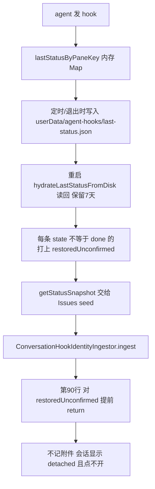

# 调研 · 使用中提出的六个问题

本文只回答「为什么」，每条都追到代码出处。修复方案在末尾统一列，不与成因混写。

调研对象：`bc0259af3`（Issues 首版）之后的分支状态。
实测数据来自本机 `profiles/local-default/issues/orca-issues.db`：

| 项 | 值 |
| --- | --- |
| Conversation 总数 | 23 |
| 有 provider 身份（未退休） | 23 |
| 有未处理轮次 | **8** |
| 有用户标题 | **0** |

## 问题一：为什么这么多会话没有标题

### 直接成因

`conversations.title` 只有一条写入路径——用户手动重命名：

```
ConversationRenameDialog → conversations.update → conversation-record-repository.ts:181-192
```

新建的 Conversation 一律为 NULL。三处渲染都写着 `conversation.title ?? conversation.agent`，
于是全部回落到 agent 名。

### 更深的成因：Orca 的命名逻辑被整条绕过

Orca 早有 `getAgentRowConversationName`（`src/shared/agent-row-conversation-name.ts:113-149`），
五级优先级：

| 级 | 字段 | 来源 |
| --- | --- | --- |
| 1 | `tab.customTitle` | 用户手动改的标签页名 |
| 2 | `tab.quickCommandLabel` | 走「快捷命令」启动时带的标签 |
| 3 | 实时终端标题 | agent 用 OSC 设置，需先过 `isMeaningfulOpenCodeTerminalTitle` |
| 4 | `tab.generatedTitle` | `deriveGeneratedTabTitle(prompt)`（`agent-tab-title.ts:71`）对启动 prompt 做的确定性字符串处理——**不是 AI 生成** |
| 5 | 由实时标题推导 | 结合 agent 类型与 `defaultTitle`，去掉 `claude code` 这类自报名 |

会话结束后这五级全部失效（tab 没了）。但 Orca 还有第二套：会话历史的 `title`，
由主进程扫 transcript 得出（`src/main/ai-vault/session-scanner-primary-parsers.ts`），
自身优先级为 `custom-title` → **provider 自己生成的 `ai-title`** → 首条用户消息。

关联键现成：`conversation_provider_identities.session_id` 与 `transcript_path` 都在库里。

### 一条走过的弯路

曾用 `latestRound.userInput` 当标题。实测取到「重跑一下」「那就不行呗」这类续话——
`latestRound` 是**最近**一轮而非首轮。即便改取首轮，也会撞上
`Continue work from the prior Orca session using the...` 这类样板前言，
`getAgentRowPrimaryText` 的注释对此有明确警告：

```
Never surface the lifecycle preamble itself — the first characters are boilerplate
("You are working inside Orca…")
```

### 接口也用错过

Orca 有两个接口，一步之遥：

| 接口 | 行为 |
| --- | --- |
| `aiVault.listSessions` | 全量扫描历史（本机 516 条），带 limit，可能被节流 |
| `aiVault.resolveSessionTitles` | 按 `{agent, sessionId, transcriptPath}` **定点批量解析** |

Conversation 三样都有，该用后者。

## 问题二 / 三：为什么两侧的行长得不一样

会话行有**三处**各自手写的实现（`grep -rl "data-conversation-id" src/renderer/src`）：

| 位置 | 形态 |
| --- | --- |
| `sidebar/workspace-conversation-rows.tsx` | Workspaces 侧 |
| `sidebar/issues/issue-virtual-row.tsx` | Issues 侧栏 |
| `issues/IssueConversationList.tsx` | Issue 详情卡片 |

而 Orca 既有的 `DashboardAgentRow` 有 328 行：状态点、模型、工具名、耗时、发送目标、
右键菜单、lineage。手写实现必然是它的残缺子集，三处还各缺各的。

其依赖其实很轻——逐字段 grep 的结果：

| 来源 | 字段 |
| --- | --- |
| `entry` | `interrupted` `lastAssistantMessage` `model` `toolInput` `toolName` `workingMode` |
| `tab` | 仅 `tab.id` |
| row | `paneKey` `entry` `tab` `agentType` `state` `startedAt` `rowSource` `activationPaneKey` `lineage` |

`entry` 六项全是可空展示字段，缺失时组件自行降级（`DashboardAgentRow.tsx:149`）。
交互也全部由调用方注入（`onActivate` / `sendTargetStatus` / `sendTargetDisabledReason`），
**组件本身无需任何修改**。

## 问题四：为什么点不开任何会话

`issue-virtual-row.ts` 的 `openConversation`：

```ts
const paneKey = conversation.navigation?.paneKey
const parsed = paneKey ? parsePaneKey(paneKey) : null
if (!paneKey || !parsed) {
  if (conversation.issueId) { setActiveIssueRoute(...) }
  return                       // ← 未归属 + 无 paneKey ⇒ 什么都不做
}
// 激活 Workspace 的两句被关在这个分支之后
```

「未归属」栏里的会话 `issueId` 为 null，又因问题五/六而没有 paneKey，
**两个条件同时成立，函数直接返回**，成为一行死行。

激活 Workspace 的 `activateAndRevealWorktree` / `activateAndRevealFolderWorkspace`
就在同一函数内，只是被关在「有活 pane」之后。

另注：`navigation.resumeLocator` 库里存着，但 `grep -rn "resumeLocator" src/renderer/src`
**零命中**——「打开一个已结束的会话继续干」这条动线在渲染端从未实现。

## 问题五：为什么这么多已经关掉的会话

Workspaces 卡片里 `2 agents` 之下挂着十几行 `Idle`。成因有两层。

### 表层：补行没有保留边界

实现对「该 Workspace 下每一条没有活 pane 的 Conversation」都补一行，**无条件、无上限**。
干一天几十条会话，就是几十行常驻。

Orca 原有的 `retainedAgentsByPaneKey` 是内存态、重启即清，天然有界；
持久化之后这个界限消失了，而方案只写了「pane 关闭后行仍在」，
**没有写「仍到什么时候」**。

实测 23 条里只有 **8 条**有未处理轮次，其余 15 条对用户没有当下价值。

**已定（2026-08-27）**：Workspaces 一行不改，持久行只属于 Issues。保留边界问题随之消解——
Workspaces 侧不再有持久行，也就不存在保留窗口。

### 里层：其中相当一部分其实还活着

见问题六。它们被误判为 detached，于是也进了补行。

## 问题六：为什么正在跑的会话显示成 detached

> 本节在 2026-08-27 被整体推翻重写。旧结论「hook 状态是纯内存、重启后为空」**是错的**，
> 见文末「被证伪的判断」。

### 链路



### 关键两行

`src/main/agent-hooks/server.ts:3181`

```ts
if (entry.payload.state !== 'done') {
  // 终止事件可能在没有接收方时就发生了,恢复成未经证实,绝不当作实时真相
  entry.restoredUnconfirmed = true
}
```

`src/main/issues/conversation-hook-identity-ingestor.ts:89`

```ts
if (event.restoredUnconfirmed || !event.providerSession || !isTuiAgent(...)) {
  return this.finish({ disposition: 'ignored', reason: 'identity-missing' }, event)
}
```

两者相乘的效果是**反的**：`done` 的会话不带标记，照常记附件；**还在跑的会话恰好全被丢弃**。

### 实测

`~/Library/Application Support/orca/agent-hooks/last-status.json` 共 10 条，全部带 `providerSession.id`：

| state | 条数 | 结果 |
| --- | --- | --- |
| `done` | 7 | 正常记附件 |
| `working` | **3** | **被丢弃** |

那 3 条正是当时开着的会话（本机 claude 会话 `2ea7a881`、`8ef3bea5`，codex `01a04341`）。

### 为什么 Workspaces 没这个问题

Workspaces 的行不经过 Issues 这条摄取链。它直接读 `agentStatus` store，而主进程把
hydrate 回来的状态**照发不误**（`main/index.ts:1741` 只是把 `restoredUnconfirmed` 透传给
renderer，并不拦截）。所以同一批数据，Workspaces 收得到，Issues 自己把它挡在门外。

## 问题七：不该改动既有功能

`worktree-card-secondary-rows.tsx` 被把 `WorktreeCardAgents` 换成了
`WorkspaceConversationRowsHost`。改动本身只有四行，但后果是 Workspaces 侧的 agent 行
换了一套实现。

这不是实现者自作主张：原产品方案 §2.1 要求「Workspace 下的 agent 对话行改为持久 Conversation
投影」，原技术方案 §12.3(1) 还把反面列为不得发布的半态。**是方案本身写错了方向。**

**已改（2026-08-27）**：两份方案的相应条款已反转——Workspaces 一行不改，改动它既有的行
本身才是不得发布的半态；持久 Conversation 的呈现收敛到 Issues Sidebar 与 Issue 详情。

代码已还原：`worktree-card-secondary-rows.tsx` 与 main **逐字节一致**，
`workspace-conversation-rows.tsx` 及其测试删除。

## 修复方向

按依赖关系排序，前一条不做后一条没有意义。

| 序 | 修什么 | 复用什么 |
| --- | --- | --- |
| 1 | 启动时用 `sleepingAgentSessionsByPaneKey` 回填运行附件，按 `providerSession` 与 `session_id` 关联 | Orca 既有的持久会话捕获，不引入新数据源 |
| 2 | 三处会话行统一到 `DashboardAgentRow` | 既有组件，零修改 |
| 3 | 命名走 `getAgentRowConversationName` → `aiVault.resolveSessionTitles` → 空 | 两套既有命名机制 |
| 4 | `openConversation` 的 Workspace 定位提到无条件执行 | 同函数内既有的两个激活函数 |
| 5 | ~~给持久行定保留边界~~ **已完成**：Workspaces 还原，持久行只属于 Issues | 方案条款已同步反转 |

## 附：本次调研中被证伪的判断

如实记录，避免下次重走。

| 判断 | 结论 |
| --- | --- |
| 「重启后附件不重建，是因为 replay 路径没写附件」 | **错**。replay 会写（`conversation-hook-identity-ingestor.ts:200`） |
| 「`lastStatusByPaneKey` 是纯内存、重启后为空，所以 replay 无物可放」 | **错，且错得最久**。它由 `AgentHookServer` 自己落盘到 `last-status.json` 并在启动时 hydrate。当初 grep 到「这个标识符只在 `server.ts` 内出现」，据此断定「没有持久化」——恰恰看反了：持久化就写在同一个文件里 |
| 「该从 `sleepingAgentSessionsByPaneKey` 回填附件」 | **不需要**。数据本来就在 hook 快照里，问题是被 `restoredUnconfirmed` 守卫挡掉，不是缺数据源 |
| 「那些 `Idle` 是已结束的会话，该给它们加恢复入口」 | **错**。相当一部分正在运行，只是附件丢了，不需要恢复 |
| 「`generatedTitle` 是 AI 生成的」 | **错**。是 `deriveGeneratedTabTitle` 的确定性字符串处理 |
| 「会话行有两处实现」 | **错**。三处 |
| 「`aiVault.listSessions` 是取标题的接口」 | **错**。应为 `resolveSessionTitles`，定点解析 |
