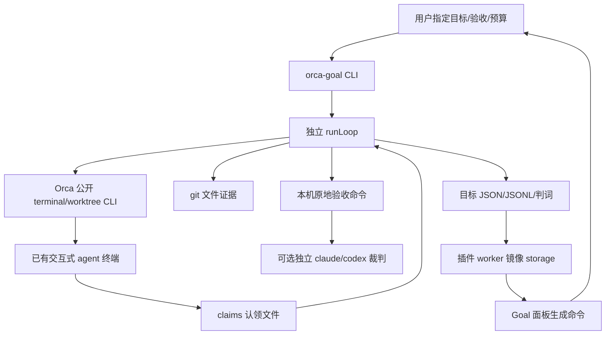

# Goal 目标模式技术说明

本文合并 Goal 历史设计、CLI/plugin 说明、评审和待决清单中仍有效的信息，以当前工作区源码为准。`ready` 仅表示文档现状核对完成，不是产品验收、发布或三平台运行证明。关联 [需求](../requirements/Goal目标模式.md) 与 [测试](../tests/cases/Goal功能测试.md)。

## 需求覆盖索引

| 关联需求 | 技术章节与边界 |
| --- | --- |
| REQ-101、REQ-106 | §1、§5：既有交互会话、轮次观察、等待与注入 |
| REQ-102、REQ-115 | §3、§4、§8：工作区 key、锁、迁移、恢复和当前身份限制 |
| REQ-103、REQ-104 | §6、§7：认领、独立验收与未经验证的完成 |
| REQ-105 | §5、§6：轮数、活跃时长与验收超时边界 |
| REQ-107 | §8：分阶段异常与恢复，不宣称持久阶段机已完整 |
| REQ-108 | §7：git 证据、门禁变更与缓存限制 |
| REQ-109 | §2、§9：bundled 资源、状态镜像、面板与命令边界 |
| REQ-110 | §3：参数、配置、后台路径及未统一的校验 |
| REQ-111 | §10：本机、Folder、Linux、Windows、SSH/WSL 支持边界 |
| REQ-112、REQ-113、REQ-114 | §10.1～§10.3：未实现或部分实现的旧提案目标 |

## 1. 当前架构与路线决策

Goal 的执行体是独立 Node CLI，驱动用户已经打开的 Orca agent 终端。独立验收裁判可使用 headless agent；干活的 agent 始终留在原交互会话。插件提供状态面板、命令入口和通知，不承载长时间运行循环。

| 历史路线 | 保留的取舍依据 | 最终位置 |
|---|---|---|
| 早期全部放入 worker | worker 有空闲回收、事件/命令超时；terminal.sendText 的工作区/长度约束不适合后台长循环 | worker 留作控制与观测 |
| v2 Stop hook 拦截 | 旧记录报告连续 block 上限、hook 超时与长验收冲突、配置/路径读取障碍 | 不安装额外 hook；借用 Orca 已有状态信号 |
| v3 headless 驱动干活 agent | 可获得结构化输出/成本，但不保留用户想要的交互式工作会话 | 仅裁判采用 headless |
| v4 外部驱动交互会话 | 符合用户可查看、插话、切工作区的使用方式 | 当前主路线；具体实现已超过并偏离 v4 草案 |

“不改 Orca 源码”是早期约束记录，不能描述整个当前集成：`storage.get` 的面板访问、bundled 插件资源和内容索引已有宿主侧改动。旧方案中的 `waiting → 注入` 映射被纠正；当前 waiting/blocked 都是需要用户。

## 2. 目录与运行资源

| 位置 | 职责 |
|---|---|
| [orca-goal.mjs](../../../../goal-mode/cli/orca-goal.mjs) | CLI 解析、目标选择、start/resume/stop/rebind/status/watch/forget |
| [goal-loop.mjs](../../../../goal-mode/cli/goal-loop.mjs) | 看门狗编排、证据、等待、验收、重试与判词 |
| [goal-decision.mjs](../../../../goal-mode/cli/goal-decision.mjs) | 纯决策，给出 verify/continue/finish/await-user |
| [round-wait-machine.mjs](../../../../goal-mode/cli/round-wait-machine.mjs) | 纯轮次等待状态机 |
| [orca-terminal.mjs](../../../../goal-mode/cli/orca-terminal.mjs)、[terminal-activity.mjs](../../../../goal-mode/cli/terminal-activity.mjs) | 公开 CLI 与 hook/PTY 状态解释 |
| [goal-state.mjs](../../../../goal-mode/cli/goal-state.mjs) | 工作区 key、原子状态写入、日志、迁移与锁 |
| [acceptance-gate.mjs](../../../../goal-mode/cli/acceptance-gate.mjs)、[acceptance-judge.mjs](../../../../goal-mode/cli/acceptance-judge.mjs) | 命令验收及独立 agent 裁判 |
| [cli/prompts](../../../../goal-mode/cli/prompts) | 实际运行提示词模板；必须保留原目录 |
| [bundled Goal 插件](../../../../resources/plugins/launch/stablyai.orca-goal) | 实际 manifest、worker.mjs、panel.html |
| [bundled-plugins.json](../../../../resources/plugins/launch/bundled-plugins.json) | `stablyai.orca-goal` 注册及 contentHash |
| [goal-mode/plugin](../../../../goal-mode/plugin) | 测试配置、插件测试与 CDP 验证脚本，已不是插件 runtime 目录 |

用户可直接用 `node goal-mode/cli/orca-goal.mjs` 调用 CLI 源码。面板生成的 `orca-goal`、`orca-goal-judge` 命令依赖 PATH 中的对应包装脚本；交互式 shell 也可自行配置 alias。bundled 插件存在不证明这些命令已自动安装；当前 bundle 未负责这一步。没有独立 Goal daemon RPC/scheduler；本机驱动调用 Orca 公开 CLI，不能把 Orca 主 daemon 的能力当作 Goal 已实现的远端执行能力。

## 3. CLI、参数与配置

| 命令 | 当前行为 |
|---|---|
| `start` | 解析配置、选择已有且 writable 的 terminal、确定工作区、确认 check、独占锁、归档旧轮次日志、写初始目标、进入循环 |
| `resume` | 按工作区找旧目标，拒绝仍在跑的驱动，保留累计轮数/耗时，清终局原因与取证基线；busy 时 attach，idle 时正常注入 |
| `rebind` | 要求先停止，指定工作区与新 terminal；拒绝明确属于其他工作区的 terminal；仅更换终端绑定 |
| `status` | 展示目标状态、PID 存活、原因、工作区、handle、当前及归档 JSONL 位置 |
| `watch` | 读取后台 `.out` 并增量跟随，锁 PID 不存活后返回 |
| `stop` | 停驱动并将 active 目标记为 aborted；保留记录，不等价于杀掉工作 agent |
| `forget` | 驱动 PID 不存活后只删 goals/KEY.json；并不清所有侧车 |
| `terminals` | 列可选终端和 agent 状态 |

目标定位优先 `--worktree`；也接受 `--terminal HANDLE` 并换算其工作区。终端消失时会从目标记录反查 handle；不能唯一确定时要求显式工作区。`--detach` 在父进程确定路径与 terminal 后启动后台子进程，stdout/stderr 写日志，父进程返回 PID；该返回不代表子进程完成了整个运行握手。

配置优先级：显式命令行 > JSON 文件 > 默认值。`--objective` 或 objective 字段给完整文本；数组会按换行拼接。文件允许整行 `//` 注释。check 是字符串数组，CLI `--check` 可重复。文件内 worktree 相对配置文件解析；转交后台的 `--file/--worktree` 在父进程先绝对化。未知字段与参数会报错。

| 参数 | 默认与约束 |
|---|---|
| `--max-turns` | 20；0 不限；start 校验非负数 |
| `--max-minutes` | 180；0 不限；start 校验非负数 |
| `--check-timeout` | 单条 900 秒；start 要求正数，0 不表示不限 |
| `--check-all` | 默认关闭；开启后所有 checks 执行并汇总 |
| `--on-blocked ask\|verify` | start 默认 ask；ask 等用户，verify 在有 check 时先核实 |
| `--prompt-file` | 默认关闭；写多行提示词文件，仅向终端发一行读取指针 |
| `--yes` | 跳过本 CLI 的验收命令确认；有 check 的非交互启动要求给出 |

边界：配置文件白名单没有 `onBlocked`/`checkAll`，虽然 resolveSettings 有读 onBlocked 的代码；应通过 CLI 设置当前支持的开关。resume 只覆盖 checks 与显式预算，不是重跑 start 的完整参数合并；预算仍用 Number(value)，judge timeout 也未复用 start 的数值校验。不能写成“所有命令参数已经统一校验”。

## 4. 工作区身份、存储与锁

`goalKey(worktreePath)` 使用 path.resolve、去末尾分隔符，再拼 basename 与 SHA-256 前 10 位。macOS/Windows 转小写；未调用 realpath，因此软链别名能形成不同 key。工作区不要求 Git，folder workspace 同样可以持久目标。

运行根目录是 `ORCA_GOAL_HOME || ~/.orca-goal`，内容以同一用户身份可读写，不是独立权限沙箱。

| 路径（相对根目录） | 内容 |
|---|---|
| `goals/KEY.json` | objective、worktreePath、terminalHandle、acceptance、budget、状态、累计值、快照与最近验收 |
| `lock/KEY.lock` | pid 与 startedAt；fs.open 的 wx 独占创建 |
| `claims/KEY.txt` | agent 本轮 complete/blocked 声明 |
| `log/KEY.jsonl` | 逐轮声明、改动摘要、验收结果、findings、动作与状态 |
| `log/KEY.jsonl.TIMESTAMP` | 同一工作区重新 start 时归档的上一代轮次 |
| `log/KEY.out` | 后台驱动 stdout/stderr |
| `verdict/KEY-turnN.md` | 每条验收命令的原始判词 |
| `gate-changes/KEY-turnN.diff` | 交裁判的验证方式改动 |
| `prompts/KEY-turnN.md` | prompt-file 模式的实际本轮指令 |

writeGoal 先写临时文件再 rename，并在每次实际落盘时更新 updatedAt；迁移使用 touch:false 保留原时间，避免改变“最新记录”的裁决。listGoals 只列 `.json`，不读取 `.tmp`。

旧 terminal key 自动迁移到工作区 key：最近 updatedAt 占工作区 key，较旧记录归档为 superseded；有存活驱动的工作区整组跳过；一并迁移固定侧车、归档日志与判词。该方案没有完整 runId；新 start 的 JSONL 归档不能推导所有派生文件都已按运行代际隔离。

锁文件 stale 判定主要依赖 PID 不存在或文件格式无效。POSIX `isOurDriver` 用 ps command 包含 `orca-goal` 和 key 来识别，Windows 返回未知。startedAt 未交叉核对实际进程启动时间；status/watch/forget/rebind、worker.driverAlive 与 acquireLock 等仍有仅 PID 判定。因此文档只能说有独占锁与部分身份检查，不能声称 PID 复用已彻底解决。

## 5. 轮次观察与注入

`runLoop` 的主要顺序为：采 baseline → 决定 attach/注入 → 注入后取 sentAt → 等本轮结束 → 记时 → 采集证据 → 读认领 → decide → 必要时验收并再次 decide → 写状态/日志 → 结束、等人或下轮。

### 5.1 终端活动

`observeAgent` 从 `terminal show` 取 connected、lastOutputAt、title；从 `worktree ps` 取 agents，按 `tabId:leafId` 对齐 paneKey。`classifyRound` 先使用晚于本轮 sentAt 的 hook 状态，再回退到标题 Braille 动画和 PTY 最近输出。

| 观察 | 当前分类 | 含义 |
|---|---|---|
| disconnected | disconnected | 本轮观察失败；主循环有恢复宽限，不能据此声称 agent 进程已退出 |
| 本轮 waiting/blocked | needs-user | 暂停注入，报告等待用户 |
| 本轮 working | busy | 等待 |
| 本轮 done | finished | 可作为本轮结束候选 |
| 无本轮 hook，标题旋转或最近输出不足 quietMs | busy | PTY 有活动 |
| 无本轮 hook，PTY 静默达到 quietMs | quiet | 只有先见过 busy 才认作本轮结束 |
| 以上均不满足 | unknown | 继续观察 |

新注入必须先看见 agent 活动，才采信 finished；attach 的 finished 可以直接采信，因为正在接手已有轮次。旧 working 不再无条件短路 PTY 回退；但 `sinceMs=0` 的“当前安全性”查询仍有不同时间语义，不能扩写成所有陈旧状态都有统一 TTL。

### 5.2 时间阈值

| 项目 | 默认 | 作用 |
|---|---:|---|
| settle | 5 秒 | 发送 Enter 到 agent 接管的缓冲 |
| quiet | 12 秒 | 无本轮 hook 时的静默判定 |
| poll | 3 秒 | 观察频率 |
| min round | 15 秒 | 防误判造成几秒内连续灌入多轮 |
| start | 5 分钟 | 注入后一直未观察到活动 |
| stuck | 20 分钟 | 已非 busy 且这一轮仍未结束 |
| observe grace | 3 分钟 | CLI 观察连续失败的宽限 |
| round error grace | 10 分钟 | 整轮持续异常后记 blocked 与 driverError |
| long run | 30 分钟 | agent 仍在活动时提醒一次，不因单轮长而直接砍掉 |

对应 ORCA_GOAL_* 环境变量在 goal-loop 中配置。needs-user 时暂停 start/stuck 计时；用户回应后返还等待段，防一次等待使整轮超时永久失效。目标时长 deadline 另行存在，并没有暂停所有预算。

### 5.3 注入与认领

默认 renderPrompt 替换变量后压成单行；sendText 拒绝 CR/LF，再调用 `terminal send --enter`。公开 CLI 返回 `ok:true` 仍可能 `accepted:false`，代码将其视为拒绝输入，避免移动端输入锁造成静默丢轮。压平并未删除 ESC/Ctrl-C/退格等控制字符，不能写成任意目标文本都已过滤安全。

TUI alt-screen 会原地重绘，read cursor 不等于持久轮次流；注入文本自身还可能回显 complete 哨兵。因此当前完成协议使用文件，不扫终端输出。claim 文件接受小写 `complete:`/`blocked:`，允许全角冒号和 Markdown 包装；64 KiB 上限，目录 malformed，mtime 早于 sentAt 为 stale，无有效行则不采信。实现遍历各行，不是严格只看第一行。

clearClaim 绑定实际注入；attach 不清旧文件而用 mtime 排除旧声明。prompt-file 将模板落盘后注入读取指针，agent 是否真正读取仍是额外依赖。模板由 [continuation-prompt.mjs](../../../../goal-mode/cli/continuation-prompt.mjs) 按同包 `prompts/` 首用读盘并缓存；它们是运行资源，不能随文档合并移动。

## 6. 决策、状态与预算

持久 state 是 `active | complete | blocked | budget_exhausted | stalled | aborted`。`await-user` 是动作，持久化为 active + awaitingUser；驱动生死和 driverError 是另外维度。

| 触发 | 当前动作 |
|---|---|
| 完成认领，无 checks | complete，action.verified=false，原因注明未经验证 |
| 完成认领，有 checks 但未验收 | verify |
| 验收通过 | complete；若本轮 gate 改动累计超阈值则 await-user |
| 验收 inconclusive | gateFailures 累加；未满 2 次发 gate-unavailable，满 2 次 finish blocked |
| 普通验收失败 | falseClaims 累加；满 3 次 finish blocked，否则回灌 rejected-completion；该计数当前不是连续重置 |
| 受阻认领 | blockedClaims 连续计数；满 2 次 ask 默认 await-user；verify 有 checks 时先验收，全绿发 blocked-but-passing 继续 |
| 普通轮次连续 tree+HEAD 相同 | stallCount 达 3 时 stalled；指纹 unavailable 不判空转 |
| 预算达到 | budget_exhausted，并尝试发送一次收尾提示 |
| 用户 stop/SIGINT/SIGTERM | active → aborted，保留记录 |

完成分支优先于预算：最后一轮通过验收可以 complete。无认领或失败继续前检查预算。`activeMs` 累加观察轮次及验收时间，驱动停着的时间不计；显式 waitForUser 等待段不计。goalDeadline 在轮次等待过程中检查，但验收命令只有单条 timeout，可能超过剩余目标预算；收尾发送并不再等待 agent 完成最后回应。

当前默认阈值为 falseClaims 3、blockedClaims 2、stallRounds 3、tamperChallenges 2、gateFailures 2。它们是代码默认值，不是用户可用的全部 CLI 开关。

## 7. 独立验收、裁判与证据

### 7.1 命令门禁

runAcceptance 在 acceptance.cwd 原地执行 check 字符串，使用 shell:true、CI=1、无 stdin/TTY；默认首失败短路，check-all 全跑。不是 v4 草案所写的 argv/execFile 形式，也没有干净验收 worktree。

退出码 0 表示通过；普通非零表示未通过；3 表示不能判定。超时或常规 spawn error 也记 inconclusive。同步 spawn 抛异常的独立 catch 没填 inconclusive，普通 shell “命令不存在”也可能只是非零退出码，因此不是所有环境错误都能被完整区分。门禁非空且全部成功才 passed；无 checks 的完成降级在 decide 中显式处理。

输出分别保头与真实尾部，失败摘要回灌下一轮，全文按命令写 verdict。超时在 POSIX 用进程组清理；Windows 有 taskkill 分支，但不代表全链路 Windows 已适配。不是严格的输出硬上限：采集实现按 chunk 到达处理。

### 7.2 独立模型裁判

judge 支持 `--criteria`/`--criteria-file`、`--agent claude|codex`、cwd、timeout、sandbox；默认 agent=claude，默认 600 秒。claude 用 `-p --output-format json`；codex 用 `exec --cd --output-last-message`。stdin 显式 ignore，避免 codex 等待额外输入。

裁判读取真实文件/命令，要求 PASS 或 FAIL，并提示不改文件。默认不强制沙箱；codex 显式 read-only 是其沙箱约束。claude read-only 只是禁 Edit/Write/NotebookEdit，并使用 bypassPermissions 允许运行检查，不是 OS 级只读保障。

契约意图为 0 通过 / 1 未通过 / 3 无法判定，2 用于参数用法。超时先 SIGTERM，再给 15 秒宽限，尽力读部分判词并退 3。当前仍有错误分类边界：claude JSON 的 is_error 被解析成错误文本，最终可退 1；顶层异常退 1；判断通过使用 PASS 前缀而非完整结构化 schema。不能以“有独立模型”证明验收标准完整或所有错误分类正确。

### 7.3 Git 证据与验证方式变更

[git-snapshot.mjs](../../../../goal-mode/cli/git-snapshot.mjs) 使用临时 GIT_INDEX_FILE 执行 add -A/write-tree，涵盖未跟踪内容与已跟踪内容变化，保留真实 index；HEAD 另存，提交本身视为进展。忽略文件不进入快照。linked worktree 的 `.git/info/exclude` 通过 git-common-dir 另做哈希；路径 diff 关闭 core.quotePath，避免中文路径误分类。

changed 当前只有 source/test 分类，没有旧稿的 acceptance/config/docs 多级分类。scanRound 通过正则识别净删断言、skip/only、门禁配置、ignore 变更；test-only-edit 仅记录。扫描是启发式，自定义检查与内联测试有盲区，不是完整测试集合或代码语义证明。

挑战类 findings 被记录，并将具体 diff 写 gate-changes，通过 ORCA_GOAL_GATE_CHANGES 交 bundled judge 阅读，由裁判按验收原意判断。普通 check 命令未必读取这个 env；因此不能写成所有验收都会审查“验证被改弱”。当前不再执行旧 tamper-challenge 一轮质证协议，也不自动恢复旧检查定义。

`lastAcceptance` 只用 tree 相等复用，无 git 时不缓存；缓存键不含 check 配置、HEAD、环境/外部状态，旧文“同轮持久阶段缓存”并不精确。按树复用适合内容未变的重试，但不能据此保证所有外部验收仍有效。

## 8. 故障恢复与观测

取证阶段失败会返回 unavailable/空 findings，并明确提示，避免昂贵验收因取证小故障整轮重跑。整轮仍用 try/catch 重试；已经注入的轮次尝试 attach，不立即发送第二遍。连续异常达到 10 分钟后写 blocked、finishReason、driverError 并记录终止轮。

验收后立即写 verdict，最近验收放入目标记录。已判终态时 while 顶部返回，避免日志落盘失败后将 complete 拉回 active。runLoop 并不是完整持久阶段机：pending 提示词在内存中，重启恢复不能等价为逐阶段 exactly-once。

未捕获异常由 [driver-crash-guard.mjs](../../../../goal-mode/cli/driver-crash-guard.mjs) 记录 driverError；不改 state，因为看门狗退出不证明 agent 停止。后台驱动 cwd 固定在日志目录，避免启动目录被搬走后 uv_cwd 崩溃；但首次读取未缓存模板仍依赖源码文件存在。

## 9. 插件面板与宿主约束

worker 激活后注册三命令、订阅 agent.status.changed、镜像状态；deactivate 停轮询。有 active 且 PID 存活的目标时每 5 秒轮询；内容不变时每 60 秒心跳写 storage，刷新宿主活动时间。无活动目标停表允许回收，事件/命令可重新唤醒。

镜像目标按 updatedAt 排序，优先第一个 active，否则最新目标；不是按当前工作区过滤。只给选中的主目标读取最近 20 条轮次，最多读 JSONL 尾部 128 KiB。镜像预算 200 KiB，低于 storage 单值 256 KiB；裁剪时间线而非任意目标字段，因此极大 objective 仍需留意。只有 storage.set 成功才记去重状态。

面板通过已开放的 storage.get 读取，调用自带超时，三次心跳以上过期提示为快照。静态骨架定点更新保留表单和命令提示。停止/接回等按钮只显示可复制 CLI；目标表单生成 POSIX heredoc 判据文件与 start --detach，定界符避碰。Cmd-J 的 goal.stop 仅当全局恰好一个 active 目标时执行 CLI；多个目标返回歧义提示。系统通知 delivered=false 会留日志，不能把通知当唯一结果反馈。

worker 经 `$SHELL -lc` 调 `orca-goal`，CLI timeout 20 秒，小于宿主命令 30 秒。原记录的 worker 空闲 5 分钟、事件处理 5 分钟回收/超时解释了为什么循环不能放在此处。修改 worker 后需重建 worker 实例才能加载新模块，manifest/能力变化走宿主正常刷新授权机制。

## 10. 支持边界与未完成目标

| 项目 | 当前结论 |
|---|---|
| 本机 CLI | 主实现路径；本次仅源码核对，未新跑真实 agent |
| Linux | 默认命令名已改 orca-ide；不等价于全面运行验收 |
| Windows | 已选择 orca.cmd，但直接 child_process、.cmd 调用、登录 shell、POSIX heredoc 等未完成完整适配 |
| SSH/WSL | 验收、git、claim、ROOT 都在驱动本机，无 remote authority/provider；不能宣称支持 |
| folder workspace | 目标/claim/check 可运行；无 git 快照、篡改证据、tree 缓存、空转判断 |
| 进程身份 | 部分 command 检查与 PID 存活，不是所有路径的同主机身份闭环 |
| 运行代际与清理 | JSONL 启动归档已做；runId 与完整侧车清理未做 |
| 原意与判据质量 | 提示词强调 fidelity，测试/裁判只验证其覆盖范围，不能自动证明用户全部目标 |

旧 v4 的通知风暴、首次工作自动分支命名、应用更新/退出影响 PTY 是宿主集成关注点；本次未验证这些历史具体行为是否仍相同，保留为后续真机观察项，不写成已复现当前故障。Git snapshot 当前用了 `--path-format=absolute`，尚未形成与项目 Git 2.25 基线配套的 capability fallback 证明。

### 10.1 删除空转熔断（REQ-112，未实现）

2026-08-21 提案的历史事故是：正常铺环境的短轮次没有文件改动，叠加不可靠轮次边界产生空转计数。当前代码仍有 maxStallRounds=3、sameFingerprint、stallCount 与 finish(stalled)，现有测试也要求它触发；不能把提案日期最新当作已经落地。

提案已经明确的改动边界是删除新空转判定及计数，保留 lastSnapshot/snapshotWorktree/diffTrees，因为它们仍服务 changed、scanRound 与验收缓存；保留 `stalled` 历史状态显示兼容。连续输出但没有进展的刷屏循环可能只能靠预算约束，不限预算时有该缺口。这是已有目标的记录，本文不额外实现或选择新检测算法。

### 10.2 无认领停止原因（REQ-113，未实现）

同提案将停因识别独立为下一阶段：循环采 terminal tail 传入纯 decide，仅明确权限/确认签名才 await-user，明确崩溃/退出签名才记录失败；其他保持 continuation。当前没有 obs.tail 与这些签名逻辑，既未新增纯状态机测试，也无真机误判率证据。

### 10.3 旧“全实现”摘要的修正（REQ-114/115）

41 A1 已实现门禁 inconclusive 与改进驳回提示，但没有“同批反复失败升级用户”，普通 falseClaims 仍累计满 3 次终止。A5 已实现 gate diff 输入裁判，但普通 check 和跨轮反复削弱判断不能扩大保证。B1 是阶段函数/取证降级/tree 缓存，不是完整持久阶段机。C1 进程身份与 C8 所有参数校验都只部分实现。C2 只修 Linux 命令名，Windows 未完成。

baseline 验收在 A6 已决定不做；完整 runId 在 B3 暂缓。旧版提出的验收文件硬锁、测试集合、requireDiff/source/TODO 开关、token 展示、clean worktree 等没有当前实现，不再混入现状规格。

## 11. 研究、历史证据与整理约束

Codex 研究的固定对象是 `openai/codex@2b5bdcf6`（2026-08-02）。其独立目标存储、idle 闸口、计量去重、fork 让位、提示词与硬机制分界，是设计参考；不能作为当前 Orca 实现或当前 Codex 的直接证据。完整研究已在 [Codex Goal 历史机制对照](../research/Codex-Goal历史机制对照.md) 中合并首版、精读修正、防敷衍分析与完整解读，作为唯一研究参考维护。

历史事故中应保留的工程结论已经映射至测试：原地重绘导致哨兵不可靠、accepted:false 输入锁、模板/cwd 迁移中断目标、attach 权限框、终态日志失败复活、claim 重试被清、输出保尾缺失、验收耗时漏记、linked worktree exclude 与中文路径失效。历史报告里的“全绿”不代表本次测试结果。

运行提示词原地保留；bundled runtime 文件受 contentHash 与插件测试路径约束；`goal-mode/plugin/verify/panel-check.mjs` 仍写 `goal-mode/docs/mockup/panel-light.png`/`panel-dark.png`，移动截图目录需另行同步脚本。`markdown-figma-verdict.md` 是其他项目的历史失败裁判样例，不能列为 Goal UI 验收报告。
