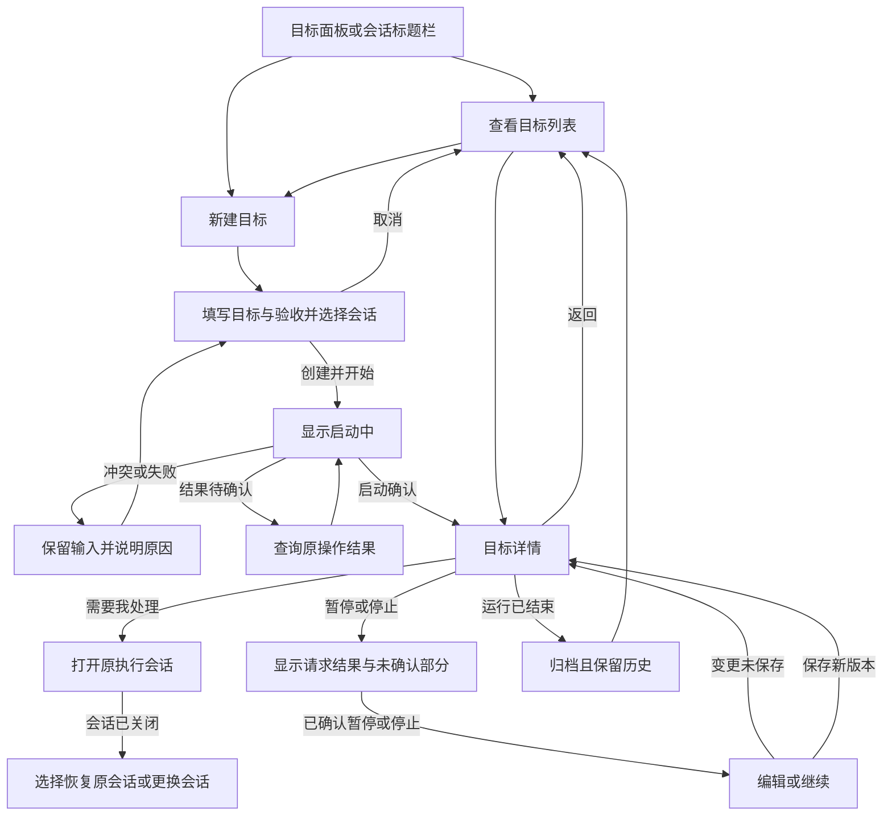
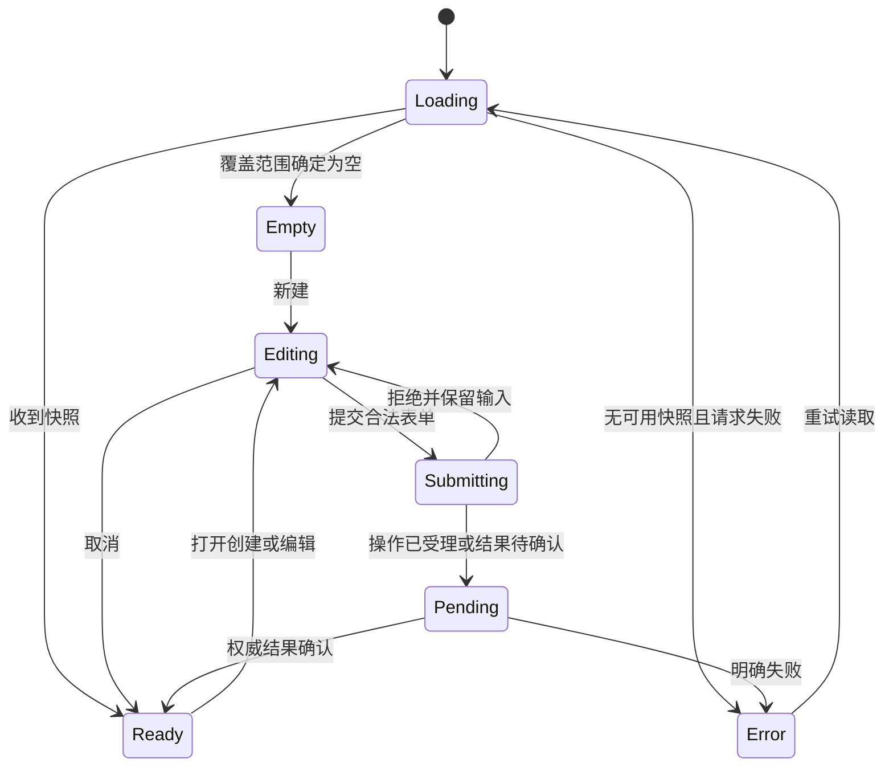
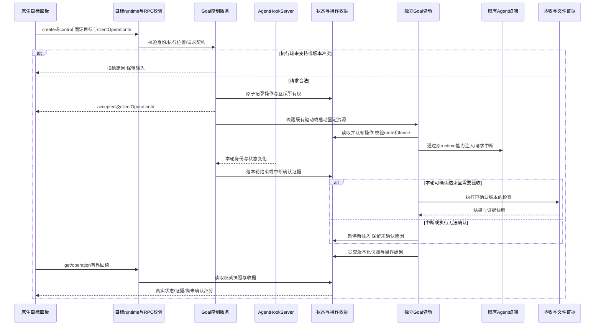
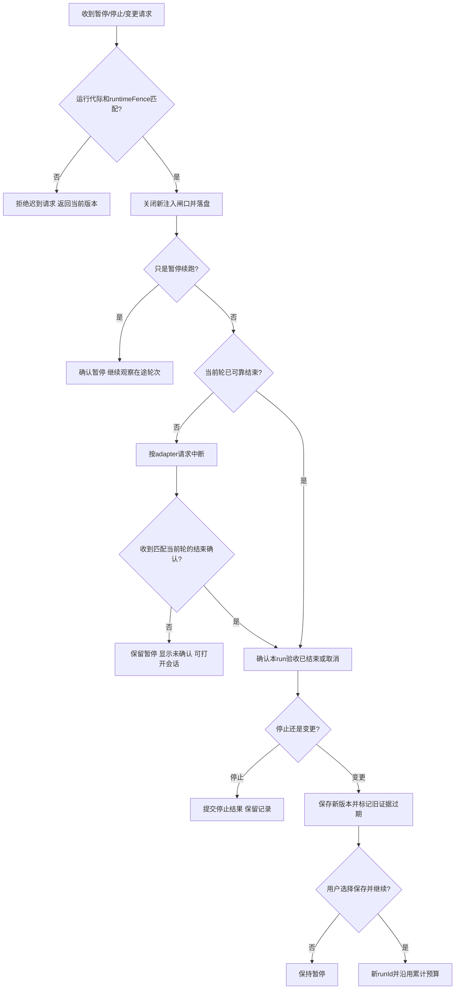

# Goal 目标管理与交互闭环方案

## 2026-09-13 文档文件入口（REQ-122）

验收文档默认显示宿主返回的本地文件路径，点击路径或查看按钮打开既有 `markdown-preview` 标签页，同时保存并收起 Goal 编辑器。编辑入口保留在 Goal 草稿内；生成候选同样通过文件查看，查看不等于采用。

宿主将当前稿原文投影为 `v2/editor-drafts/<id>/acceptance-<revision>.md`，不同修订保留独立文件，避免原文和候选、旧标签页相互覆盖；生成原文沿用 `v2/drafts/<attemptId>/acceptance.md`。RPC 的 `documentPath` 为可选字段，旧宿主无路径时继续提供文本编辑。查看前等待当前保存队列，再读取最新路径，并复用工作区激活入口把文档页面切到可见区域；本地路径打开显式固定本机，复用文件授权、现有标签页与 Markdown 渲染器，不创建第二套预览。

## 2026-09-12 异步草稿与生成恢复（REQ-122）

本节替代旧版“组件持有生成任务、关闭即取消”的生命周期。用户已确认按此实施并验证。

| 场景 | 当前交互 |
| --- | --- |
| 新建 | 选择本地工作区、填写目标与守卫即可起草；执行会话可在开始前再选择 |
| 生成较久 | 显示生成状态、已用时、最近真实活动及其距今时间；不展示推理内容，不编造完成百分比 |
| 关闭或切换 | 自动保存输入后收起；生成独立于编辑器和 App 生命周期 |
| 后台完成 | Goal 草稿列表显示待审阅并发应用内提醒，不自动打开编辑器、不启动执行 |
| 重新打开 | 从同一持久草稿恢复目标、工作区、守卫、预算、手工 Markdown、当前生成状态 |
| 原稿或目标已改 | 新生成结果作为候选；显式采用后仍需按变更后的上下文核对；不覆盖人工稿 |
| 停止或失败 | 只有“停止生成”写入停止请求；确认停止后显示已停止。失败显示原因，可重试，保留旧稿 |
| App 重启 | 从磁盘恢复；独立生成进程继续运行。进程无法核实时显示不可确认，确认退出且没有最终结果才显示中断 |
| 执行会话失效 | 文档、输入和生成任务保留；真正开始时重新解析并选择有效执行会话 |

持久草稿存在 Goal Home 的 `v2/editor-drafts/<editorDraftId>.json`，包含可编辑内容、上下文、修订号、操作 ID 和生成尝试引用。宿主原子保存并用修订号阻止旧编辑器覆盖新稿；丢失响应可幂等重试。每次重新生成使用独立 attempt ID，沿用 `v2/drafts/<attemptId>/`；未确认送达的开始请求使用原 ID 重试。

后台入口 `acceptance-draft.js` 与已有 Goal 驱动同目录打包，以 detached Node 进程执行。它复用 `runProcess` 的进程树终止、超时与输出限额；通过 Codex JSON / Claude stream-json 事件记录连接和工具活动类别。停止请求、owner PID、活动和结果均落盘；App 销毁服务不再终止生成。状态恢复复用 `inspectGoalDriver` 的 live / unverifiable / exited 语义，最终结果优先于退出观察。

RPC 新增 `goals.listEditorDrafts/getEditorDraft/saveEditorDraft`。原有生成结果状态枚举保留，新增进度字段均可选，旧客户端可以继续读取；旧宿主不支持新草稿 RPC 时明确提示不可用。工作区由宿主解析，复用本地文件夹与工作树路由，SSH 工作不在本机代跑。

验证记录见 [异步草稿验证](../tests/runs/2026-09-12-异步草稿验证.md)，本轮不自动替换用户运行中的 App。

## 2026-09-08 验收文档流程实施修订

本节是 REQ-121 的当前实施依据，替代下文初版表单中“直接填写验收项/说明后开始”的创建流程；旧目标读取与控制协议继续兼容。

1. 填写目标、选已有执行会话、选择守卫（新建默认 Codex，也可选 Claude Code）。守卫选择位于主表单。
2. 点击生成，守卫在宿主解析出的工作区读取源码、需求及目标引用的资料，返回 Markdown 文档。已有说明和上次文档作为修订上下文，不覆盖新目标。生成阶段不创建 Goal、不启动驱动、不注入执行会话。
3. 查看、编辑或预览文档；也可粘贴已有文档。目标、守卫或会话改变后要求重新核对。命令检查折叠为可选高级设置。
4. 点击“按此文档开始执行”，将最终文档保存在 `spec.acceptanceDocument`、版本记录和 `judge-criteria.md`。执行提示与整体裁判取同一份文档原文；`acceptanceText` 同步保留文本供旧读取方兼容。
5. 守卫独立验收文档，具体缺口沿用既有判词与续跑链路返回；默认沿用 Agent 权限配置，不强制只读沙箱。详情及版本列表可查看文档。

技术接入：`goals.draftAcceptance` 启动短操作，`goals.getAcceptanceDraft` 查询，`goals.cancelAcceptanceDraft` 取消；生成任务与结果存于 Goal Home 的 `v2/drafts/`。宿主通过既有 `runProcess` 管理生成进程及取消，生成与 CLI 裁判共享 `goal-agent-provider.ts` 中的 Agent 参数及输出解析。当前仍仅支持本地交互式执行会话；远程终端不会由本机代跑。

验证边界：本轮类型、自动化、构建、真实 Codex 宿主/CLI 和隐藏 Electron 界面结果见 [Test Run](../tests/runs/2026-09-08-验收文档闭环.md)。UI 使用独立 CLI 测试替身，真实守卫另行补证；全分支架构门禁的既有差异单独记录，不宣称发布完成。

## 0. 摘要

把 Goal 从“CLI 续跑器附带一个观测面板”改为用户能在 Orca 内完成新建、查找、查看进度、暂停、停止和变更的功能。最先解决三个问题：**新建入口常驻、所有目标可选择、按钮真的执行且准确反馈结果**。

推荐采用 **原生 React 目标面板 + 宿主 Goal 控制服务 + 复用现有独立驱动**。会话标题栏提供快捷入口，两个入口使用同一份表单、列表和详情；不另建一套 Issue 看板，不替换用户已有 Agent 会话。后台续跑继续独立于面板挂载和 plugin worker 生命周期。原生面板可用后，同一发布直接替换现有内置 Goal 插件，不保留两套 UI 并存。

宿主侧不新造基础设施：可用性探测照 Issues 的 `issues.status` 模式，本轮结束证据取自 main 进程已有的 `AgentHookServer`，进程判定沿用 `PtyLivenessVerdict` 的三态词汇，控制围栏与 `MutationEnvelope` 同名同义，独立驱动入口沿用 relay 的 esbuild 单文件打包，渲染层状态同步照搬 Issues 的同步门与 domain store。

以下正文保留 2026-09-05 初版方案及当时分期，当前实现以本页最新实施修订、需求状态和 Journal 为准。先读 §4 看初版界面，再读 §5 看基础机制。

## 1. 状态与结论

| 项目       | 结论                                                                                                                    |
| ---------- | ----------------------------------------------------------------------------------------------------------------------- |
| 当前阶段   | implemented；WP1～WP4 已于 2026-09-06 全部落地，真实 App 验证结果见 journal 同日记录                                    |
| 主需求     | [Goal 目标模式需求](../requirements/Goal目标模式.md)，增量 REQ-116～REQ-120，关联既有 REQ-101～REQ-115                  |
| 旧方案处理 | [技术说明](Goal目标模式技术说明.md)保留为历史实现基线，已标 superseded；不是删除旧事实或宣称新方案已经替换运行系统      |
| 旧插件处理 | 原生面板可用的同一发布移除内置 `stablyai.orca-goal`，旧持久路由归一到新页签；不做两套 UI 共存层                         |
| 上游意图   | 待确认：仅 Fork 使用，还是回推 stablyai/orca。回推意味着上游要接受一个新的 goals 领域和 RPC 命名空间，评审门槛高于行数  |
| 门禁       | 新增路径必须同步写入 `config/architecture-policies.jsonc` 两条 change-scope 白名单，见 §5.10；否则 `pnpm lint` 直接失败 |
| 创建入口   | 右侧“目标”面板常驻“＋新建目标”；已有 Agent 会话标题栏“设置目标/查看目标”                                                |
| 查看入口   | 目标列表 → 目标详情 → 返回列表；当前工作区/全部范围。首个交付执行端只有本机                                             |
| 核心边界   | Goal 状态、自动续跑开关、Agent 当前轮状态和验收有效性分别表达                                                           |
| 最大风险   | 停止请求不等于停止确认；旧驱动与新控制端并发写；目标变更后旧判词被错用；执行端选错                                      |
| 评审重点   | 是否采用原生宿主服务路线；是否接受按实际 adapter 能力开放“停止执行”；直接替换旧插件是否接受；历史迁移与分期是否合适     |
| 外部同步   | 未要求，不创建飞书文档或外部 Issue                                                                                      |

## 2. 需求输入与范围

### 2.1 来源与已确认方向

- [主需求](../requirements/Goal目标模式.md)：原有持久目标、独立验收与恢复能力，以及本轮新增用户管理流程。
- 当前对话：用户连续询问 UI 的创建位置，以及全部目标、进度、停止和变更；随后确认调整方向，再明确“先写方案”。
- [STYLEGUIDE](../../../STYLEGUIDE.md)：高频操作可发现、主操作语义真实、异步结果不夸大、复用 shadcn 与现有侧栏模式。

需求追踪：

| 需求                      | 本方案对应位置                                        |
| ------------------------- | ----------------------------------------------------- |
| REQ-116                   | §4.1～4.2、§5.3：常驻新建、会话快捷入口、UI 直接创建  |
| REQ-117                   | §4.3、§5.3～5.4：列表/详情、范围与执行端隔离          |
| REQ-118                   | §4.4、§5.7：验收项、证据、阶段与预算分离              |
| REQ-119                   | §4.5、§5.5～5.6：暂停、停止、继续和确认语义           |
| REQ-120                   | §4.6、§5.5～5.8：修改目标、改绑、版本与归档           |
| REQ-101～REQ-108、REQ-110 | §5.5～5.7：复用驱动、预算、取证和验收，不重写业务算法 |
| REQ-109、REQ-115          | §4、§5.8：替代旧 UI 完成标准，保留旧状态和历史        |
| REQ-111                   | §5.9：平台、执行端与混合版本边界                      |
| REQ-112～REQ-114          | §6：仍为独立未完成目标；本次 UI 方案不将其冒充已修复  |

### 2.2 范围

纳入：既有交互会话上的 Goal、新建/列表/详情/控制、验收证据展示、正文与预算变更、同工作区改绑、归档、旧数据兼容、实际发包所需的驱动资源定位。

不纳入：自动创建工作区或新 Agent、一个 Goal 调度多个 Agent、定时调度、同工作区多个自动驱动并跑、自动解析所有测试框架、token/金额预算、强制绑定 Issue、关闭 PTY 代替取消当前轮、自动安装 hook。SSH/WSL 完整执行适配不因增加 UI 自动完成。

首个交付单元面向当前驱动支持的本机交互终端。目标态契约保留执行端身份；执行端选择器复用 AI Vault 的 host scope 组件，但首个交付只列本机，其余端显示不支持原因，不做跨端聚合和分端覆盖统计。peer 只有在拥有相同服务、资源和执行 adapter 时才开放操作，直接 SSH/WSL 未支持时给出明确不可用原因。此分期是推荐，不是已获用户逐项批准的发布范围。

### 2.3 评审问题与处理方式

| 问题                                       | 本稿推荐                                                                      | 状态 / 下一步                                         |
| ------------------------------------------ | ----------------------------------------------------------------------------- | ----------------------------------------------------- |
| 继续扩展插件 UI，还是原生管理功能？        | 原生面板与宿主控制，独立驱动复用；理由见 §3.2                                 | 待方案评审；用户确认技术路线后开发                    |
| 旧内置插件是否与新面板并存？               | 不并存。原生面板可用的同一发布移除该插件；插件只在本分支存在，main 上没有用户 | 方案建议；若要回推上游或保留插件路线，此条重议        |
| 未提供可靠中断确认的 Agent 怎么办？        | 可暂停续跑；中断只显示请求及确认状态，永不伪造“已停止”                        | 能力规则已写明；具体 adapter 的证明在开发验证阶段补齐 |
| 验收标准自由文本是否自动变成多个已完成项？ | 不自动推断。用户列明的条目才有稳定 ID；无条目级证据时只展示整体验收结论       | 方案建议；不引入自动测试发现                          |
| 没有独立验收是否禁止启动？                 | 沿用允许启动的取舍，创建前明示“完成将未经独立验证”                            | 延续既有 REQ-104，不默默新增强制门禁                  |
| 历史驱动正在跑时是否自动接管？             | 只读显示，不热迁移、不杀进程；停止并确认执行边界后再迁移                      | 方案建议；不牺牲用户正在运行的目标                    |

## 3. 当前事实与复用评估

### 3.1 当前事实

源码参考 HEAD：`4f53f01dcd54766ce833359ac9fc8e1870624aae`。旧 CLI/面板主链详见[实现基线 §1～§9](Goal目标模式技术说明.md)，此处只列影响路线选择的核对结论。

| 核对对象                | 当前事实                                                                                                                                                                                                                                                 | 对方案的影响                                                                                 |
| ----------------------- | -------------------------------------------------------------------------------------------------------------------------------------------------------------------------------------------------------------------------------------------------------- | -------------------------------------------------------------------------------------------- |
| 旧 Goal 插件            | iframe 面板只生成命令，只显示一个全局自动选择的目标，active/orphaned 时隐藏表单；worker 的 `goal.start`/`goal.stop` 命令通过 login shell 在 PATH 里找 `orca-goal` 真正执行，mac 默认 `/bin/zsh`，直接 `spawn`，CLI 未打包                                | 现状的问题是执行依赖用户 PATH、未打包、不跨平台，不是“不能执行”；不把旧 UI 行为当需求        |
| sandbox panel bridge    | 仅有 workspace.readContext、terminal.sendText、notifications.show、storage.get 等已开放动作，没有 commands.invoke                                                                                                                                        | 不能在 iframe 内直接调用 native renderer 的接口                                              |
| trusted renderer 命令链 | `window.api.plugins.invokeCommand({ pluginKey, commandId, args })` 已透传 args；runtime 也有 `plugins.invokeCommand`                                                                                                                                     | “宿主不能带参数”不是事实；若选插件路线，不必另造透传 RPC                                     |
| runtime 选择            | `callRuntimeRpc(target, …)` 的 target 只有 local 与 environment 两种，固定配对修订且不失败回落本机                                                                                                                                                       | 沿用现有路由，Goal 不另建连接/鉴权系统                                                       |
| Issues 可用性探测       | `issues.status` 返回 ready/degraded/unavailable 加原因；handler 用 `admitSelector(authorityExecutionHostId)` 拒绝配对设备再跳一次 SSH；渲染层 `issue-runtime-client.ts` 把 method_not_found 归为 unsupported                                             | `goals.status` 照此模式，不另设 describe/ownerRuntimeId                                      |
| 本轮结束证据            | main 的 `AgentHookServer` 提供 `subscribeStatusChanges`/`subscribeEnrichedStatus`/`getStatusSnapshot`；Issues 的 `round-record-ingestor.ts` 已从 hook 事件拿到 providerTurnId、promptInteractionKey、working/blocked/waiting/done 状态和最后一条助手消息 | 宿主服务直接消费它作为“匹配本轮身份的结束事件”；驱动不再靠 `terminal.wait --for tui-idle` 猜 |
| 进程判定词汇            | `src/shared/pty-liveness-verdict.ts` 已定义 live/unverifiable/exited；门禁 `issues-do-not-own-runtime-liveness` 禁止领域再造第二份判词                                                                                                                   | Goal 只自持驱动进程判定；Agent 终端状态投影 `terminal.agentStatus` 和现有 PTY 判词           |
| 终端与工作区身份        | `TerminalHandle` 是 terminal 加可选 `expectedIncarnationId`，后者是新宿主识别、旧宿主忽略的 PTY 代际围栏；`WorktreeSelector` 在 worktree-schemas.ts                                                                                                      | 绑定必须带代际；不再自定义裸字符串 handle                                                    |
| 变更围栏                | `MutationEnvelope` 有 clientOperationId、expectedRuntimeFence、payloadFingerprint 三字段；`agentSession.cancel` 参数是 envelope 加 turnId                                                                                                                | Goal 控制围栏同名同义；取消时 turnId 取自 hook 证据                                          |
| Goal 循环               | 独立进程内持有目标对象，并在每轮整体写回；pause/amend 协调及完整 runId 未实现                                                                                                                                                                            | UI 不能直接改 JSON，变更需要单写者和运行代际约束                                             |
| 普通终端中断            | `terminal.send(interrupt:true)` 写 Ctrl+C，accepted/bytesWritten 仅证明输入送达                                                                                                                                                                          | 与“本轮已停止”分开；不能用 terminal.close 替代                                               |
| structured cancel       | `agentSession.cancel` 有 session/turn/fence/operation，但 provider 确认强度不同；现有 adapter 有 local/非 WSL 限制                                                                                                                                       | 是可复用候选，不是现有 TUI Goal 已支持的取消接口                                             |
| 打包                    | 内置插件目录只有 worker、panel、manifest 三个文件，`extraResources` 没有 goal 条目，CLI 完全没打包；`build-relay.mjs` 用 esbuild 把 relay 打成无外部依赖的单文件放到 `out/relay` 再复制                                                                  | 驱动入口沿用 relay 的打包形态；不能依赖用户 PATH、源码目录或 asar 内文件                     |
| 模板读取                | `continuation-prompt.mjs` 每轮从模块旁的 prompts 目录读 7 个模板，用户覆盖在数据目录                                                                                                                                                                     | 单文件内联模板即可消除“升级删掉下一轮模板”问题，不需要版本化执行缓存                         |
| 渲染层同步              | Issues 的 `IssueDomainSyncGate.tsx` 用 setInterval 按路由刷新，以递增序号丢弃迟到响应，状态在 zustand domain store                                                                                                                                       | Goal 状态层照搬，不另设计查询缓存                                                            |
| 验收                    | gate 有逐命令结果；judge 目前主要以文本 PASS 和退出码表达整体结论                                                                                                                                                                                        | 无法直接把整体验收 PASS 拆成所有语义条目已通过                                               |
| 架构门禁                | `feature-branch-scope` 只要 Issues 文件相对 base 有改动就生效，所有变更文件必须在白名单内；依赖边界禁止 `src/main/**` 非 Issues 模块 import Issues 领域                                                                                                  | 新路径要加白；Goal 不能直接 import Issues 模块，只能照模式或抽中性模块                       |

### 3.2 候选路线与决定依据

按直接复用 → 增量扩展 → 抽共享内核 → 新增评估：

| 候选                                            | 能复用的部分                                                                          | 缺口 / 本稿结论                                                                                                                                         |
| ----------------------------------------------- | ------------------------------------------------------------------------------------- | ------------------------------------------------------------------------------------------------------------------------------------------------------- |
| 只给旧 HTML 面板加列表和按钮                    | 旧布局、storage 镜像、worker 已能执行 CLI                                             | iframe 无带参 worker 调用，且不能直接复用 React/shadcn、精确会话上下文；CLI 仍依赖 PATH 与 login shell，未打包、不跨平台；不足以完成全部流程            |
| 原生 React + 现有 plugins.invokeCommand         | 带参调用、插件授权、worker 唤醒均已存在                                               | 最少控制通道改动；但依赖插件总开关/授权/worker，缺少绑定宿主 runtime 的驱动启动资源与会话取消所有权。适合插件能力，不作为本稿首选的原生 Goal 控制所有者 |
| 原生 React + 宿主 Goal 控制服务                 | runtime RPC 框架、执行端路由、会话导航、进程启动设施、AgentHookServer、原有 Goal 算法 | **推荐**：新增的是 Goal 业务控制契约，不是新通用 RPC/调度系统；将既有循环抽出可调用入口，CLI 与 UI 共用，不复制第二套循环                               |
| 把 Goal 变成 Issue/Automation/Orchestration Run | 这些域有自己的列表、状态与任务管理                                                    | 现有 Goal 是持续推动已有交互会话，不等于 Issue 组织、定时任务或多 Agent 调度；直接映射会改变产品语义，不复用其领域状态机                                |

选择宿主服务不以“插件不能带参数”为理由。它的新增职责是 **锁定执行端、协调目标版本和驱动控制、核对启动/停止结果**；插件命令已有的透传并不能代替这些业务职责。现有 `PluginService`、RPC dispatcher、连接缓存和 PTY daemon 均不复制。

### 3.3 主要复用候选

| 现有路径 / 符号                                                                                                                                                       | 复用结论                                                                                                    |
| --------------------------------------------------------------------------------------------------------------------------------------------------------------------- | ----------------------------------------------------------------------------------------------------------- |
| `src/main/issues/issue-feature-readiness.ts`、`rpc/methods/issues.ts` 的 `admitSelector`                                                                              | 照模式写 `goal-feature-readiness.ts` 与 `goals.status`；门禁禁止直接 import，若两边要共用则抽成领域中性模块 |
| `src/main/agent-hooks/server.ts`                                                                                                                                      | 宿主服务订阅状态变化作为本轮身份与结束证据；不重复解析 hook                                                 |
| `src/shared/pty-liveness-verdict.ts`、`src/shared/agent-status-types.ts`                                                                                              | 直接复用判定与状态词汇，不定义 GoalProcessVerdict                                                           |
| `rpc/methods/structured-agent-session-schemas.ts` 的 `MutationEnvelope`、`terminal/unary-schemas.ts` 的 `TerminalHandle`、`worktree-schemas.ts` 的 `WorktreeSelector` | Goal 契约字段同名同义；实现时把需要跨 main/shared 的 schema 抽到 shared                                     |
| `components/right-sidebar/AiVaultPanel.tsx`、`ai-vault-host-scope.ts`                                                                                                 | 复用 host scope 选项组件与列表模式；首个交付只列本机；不把 Goal 塞入 AI Vault 历史数据                      |
| `right-sidebar-panel-content.tsx`、`use-right-sidebar-activity-items.ts`、`store/right-sidebar-route.ts`                                                              | 增量注册内置 goals tab；沿用 lazy render、显隐和路由恢复；旧插件路由在 `normalizeRightSidebarRoute` 归一    |
| `TerminalPaneHeaderOverlay.tsx`、`TerminalPaneSurface.tsx`                                                                                                            | 在实际会话标题栏接入精确 pane 操作；不改左侧 sidebar/index.tsx                                              |
| `pane-agent-session-id.ts`、`ai-vault-original-pane-actions.ts`、`activate-tab-and-focus-pane.ts`                                                                     | 复用会话身份解析与原 pane 跳转，缺失时明确提示；不静默创建替代会话                                          |
| `components/cmd-j/native-chat-split-quick-actions.ts`                                                                                                                 | 原生命令面板条目照此注册 `goal-quick-actions.ts`                                                            |
| `runtime/runtime-rpc-client.ts`、`src/main/runtime/rpc/core.ts`                                                                                                       | 复用目标 runtime、schema 校验、错误信封和已有认证；新增领域方法                                             |
| `src/renderer/src/issues/IssueDomainSyncGate.tsx`、`issues-domain-store.ts`                                                                                           | 照搬路由驱动刷新、序号防迟到、domain store 结构                                                             |
| `rpc/methods/client-events.ts` 的 `runtime.clientEvents.subscribe`、`automationsChanged` 事件                                                                         | 首版不用；后续把轮询升级为失效通知时沿用，新增事件 type 是加法变更                                          |
| `goal-mode/cli/goal-loop.mjs`、`goal-decision.mjs`、`round-wait-machine.mjs`                                                                                          | 抽注入式 I/O 和合作式控制检查点，复用算法；不是在 main 再写一个 while 循环                                  |
| `goal-mode/cli/goal-state.mjs`、`goal-claim.mjs`                                                                                                                      | 复用原子落盘、workspace lock 与认领校验；增量加入目标/运行身份及迁移                                        |
| `acceptance-gate.mjs`、`acceptance-judge.mjs`、`git-snapshot.mjs`                                                                                                     | 复用验收/证据算法，补 item 身份、取消与证据版本；不用 UI 输出替代真实验收                                   |
| `src/shared/child-process/run-process.ts`、`process-tree-termination.ts`                                                                                              | 复用跨平台启动/回收与确认机制；旧直接 child_process 调用不能原样升级为三平台承诺                            |
| `src/main/daemon/daemon-launched-child.ts`、`config/scripts/build-relay.mjs`、`src/cli/runtime-client.ts`                                                             | 复用 detached 启动握手、esbuild 单文件打包与显式 runtime 客户端；不把 Goal 放进 PTY daemon，也不扩展其协议  |

表内未写 `src/renderer/src/` 前缀的组件路径均相对于该目录；完整证据入口见 §7。

## 4. UI 与用户动线

### 4.1 常驻入口及发现方式

- 右侧活动栏增加内置“目标”页签，使用 lucide 的 `Target` 图标和 Tooltip。打开后标题旁始终有“＋新建目标”，详情页也保留。无活动工作区时仍可打开列表，新建时显式选择工作区。
- 不要求用户先去插件设置找功能。原生服务不可用时，面板显示原因和恢复入口，不显示空白面板或假成功按钮。
- Agent 会话标题栏加入 `GoalSessionAction`：未绑定时“设置目标”，已绑定时“查看目标”。捕获被点击的 workspace/tab/leaf/provider 身份，之后切换焦点不改变目标。
- 普通 shell、已退出会话、未知执行端、未支持的 structured/SSH/WSL 会话不允许误启动；显示具体原因。不会为了让按钮成功而自动创建工作区、会话或切换执行位置。
- 不新增固定键位。命令面板新增原生“目标：新建/查看目标”，照 `native-chat-split-quick-actions.ts` 的注册方式；旧插件的 goal.start/goal.stop/goal.status 命令随插件一起移除。

### 4.2 新建表单

| 字段     | 控件                                      | 默认与规则                                                            |
| -------- | ----------------------------------------- | --------------------------------------------------------------------- |
| 目标     | 多行文本，默认焦点                        | 必填；Enter 换行不提交                                                |
| 验收标准 | 条目列表加整体说明                        | 用户列明的条目才有稳定 ID；可只填整体说明                             |
| 工作区   | 选择器，合并 worktree 与 folder workspace | 默认当前工作区；无活动工作区时必选                                    |
| 执行位置 | 只读                                      | 首个交付固定“本机”                                                    |
| 执行会话 | 选择器，仅列该工作区的可信现有会话        | 会话入口预填并锁定；列表入口手动选                                    |
| 高级设置 | 折叠：轮次/时长预算、裁判、额外命令、超时 | 默认 20 轮/180 分钟，0 显式标“不限”；额外命令提交前展示执行位置与内容 |
| 操作     | 取消、创建并开始                          | 主按钮可键盘激活；Esc 关闭走现有离开确认                              |

表单使用较宽的 Sheet 承载多行内容。未保存修改使用项目现有离开确认模式，不叠加第二套确认逻辑。执行会话必须是选中工作区的可信现有会话，不以当前 cwd/标题字符串猜身份。高级命令不能把任意 shell 内容隐藏成普通文本字段。

“创建并开始”立即禁用重复提交，显示“启动中”。后台确认驱动就绪后进入详情；目标工作区已被占用时显示冲突目标并提供“查看目标/修改执行位置”，表单输入保留。请求超时显示“启动结果待确认”，查询同一 clientOperationId，不能换 ID 再创建。

### 4.3 列表与详情导航

| 区域     | 内容                                                                     |
| -------- | ------------------------------------------------------------------------ |
| 顶栏     | 标题“目标”与常驻“＋新建目标”                                             |
| 范围     | 当前工作区/全部；默认当前工作区，没有工作区时显示全部                    |
| 执行端   | 复用 host scope 组件；首个交付只有本机可选，其余端显示不支持原因         |
| 分组     | 进行中、待处理、历史，带计数；搜索框按目标摘要过滤                       |
| 行       | 目标摘要、工作区、执行端、有效状态、最近证据时间；需要用户处理时单独标出 |
| 覆盖提示 | 显示本机快照时间；执行端不可达时标“运行状态无法核实”，不显示为零个目标   |

- 列表行不把轮次当标题。不自动跳到最近 active，不因刷新改变选中目标。
- 进行中包含启动、执行和验收；待处理包含等待用户、人工暂停、预算耗尽、驱动异常与需恢复连接；历史包含已完成、已停止及归档。筛选只是投影，不改 Goal 状态。
- 列表有界返回，不分页；条目按最近证据时间排序。执行端不可达时保留旧快照并标记，不把部分失败降为空；空态只在已覆盖范围确定为空时显示。
- 点击行进入详情，顶部“返回列表”恢复搜索、筛选与滚动位置。返回、关闭面板、切换工作区都不停止目标。

### 4.4 详情与真实进度

| 区域           | 内容                                                                                            | 数据来源                          |
| -------------- | ----------------------------------------------------------------------------------------------- | --------------------------------- |
| 头部           | 目标标题、有效状态与当前阶段、暂停续跑/更多操作、返回列表、＋新建目标                           | phase、continuation、最近操作收据 |
| 绑定           | 工作区/执行端/会话，“打开执行会话”                                                              | binding                           |
| 验收标准       | 每条：尚未验证/验证中/通过/未通过/无法判定/证据已过期，附“查看证据”；只有整体判词时显示整体结论 | 当前 specRevision 的 evidence     |
| 最新结果与改动 | 文件、Diff、判词原文                                                                            | 最近一轮 evidence 与快照          |
| 执行记录       | 折叠：轮次、累计时长、逐轮事件                                                                  | events                            |
| 版本与变更记录 | 折叠：specRevision 列表与差异                                                                   | versions                          |

详情优先展示：状态/阻塞 → 已定义验收项及证据 → 最新产物/会话 → 折叠日志和消耗。

验收项状态只使用当前目标版本与相应证据快照的结果。自由文本裁判只提供整体验收时，展示“整体验收通过/失败”和原文，不生成并不存在的逐项通过数。需要用户授权或回答时，按钮打开原会话处理，不在 Goal 面板复制权限对话或新的审批工作流。

文件和 Diff 使用现有工作区文件导航；不存在、非 Git 或执行端不可达时显式降级。日志只能作为辅助，不用日志活动次数估算需求百分比。

### 4.5 控制与反馈

| 操作          | 生效语义                                                                   | UI 完成条件 / 失败表现                                                     |
| ------------- | -------------------------------------------------------------------------- | -------------------------------------------------------------------------- |
| 暂停续跑      | 关闭后续注入，不强行终止已在执行的 Agent/验收                              | 驱动确认注入闸口关闭后显示“已暂停续跑”；本轮仍执行时另列说明               |
| 停止执行      | 先关闭续跑，再取消当前轮与本次运行拥有的验收进程                           | 全部对应执行边界确认后显示“已停止”；仅发送中断时显示“中断已请求，尚未确认” |
| 继续          | 重新开启原目标，沿用累计预算；已有当前轮时先接回观察                       | 确认目标版本/绑定/锁与驱动就绪后才显示运行；预算不足先提示调整             |
| 打开执行会话  | 定位精确原 pane                                                            | missing/workspace-unavailable 给出恢复或改绑入口，不默认新建               |
| 编辑目标      | 仅在续跑已暂停且当前轮已结束或中断确认后可用；运行中按钮禁用并显示“先暂停” | 展示影响预览、保存状态、失败原因；不能假装在后台热改成功                   |
| 更换会话      | 暂停并确认旧绑定不再执行本目标，选同工作区现有会话                         | 改绑结果确认后再允许继续；不沿用异步时的全局焦点                           |
| 归档/取消归档 | 改变列表归档标记，保留目标/版本/运行/判词                                  | 活动或无法核实的执行不能直接归档；无 UI 永久删除入口                       |

“停止执行”不是终端关闭，也不是“杀掉所有后代进程”。停止结果逐边界记录：自动注入、当前 Agent turn、本轮验收。UI 不扩大实际 adapter 能证明的范围；Agent 自行启动的独立后台任务未被覆盖时需说明。

### 4.6 编辑与变更

编辑表单复用创建表单，另外展示当前版本、变更内容和影响。首个交付里运行中不可编辑：按钮禁用并说明需先暂停并等当前轮结束或中断确认。“运行中起草、保存前再走确认”的草稿能力留到 WP3，不在首版实现。

- 修改目标正文或验收标准：`goals.amend` 只带 spec，`specRevision` 增加，旧判词保留但不计入新版本。首版保守地将原验收汇总全部标为“需重新验证”，不自动判断两个目标语义相同。
- 只改预算：`goals.amend` 只带 budget，`runtimeFence` 增加而 `specRevision` 不变，保留有效验收证据和已消耗轮次/时长；不把已花额度清零。预算低于已消耗值时，保存前说明不能继续。
- 更换会话：保留 Goal ID、工作区和历史，记录旧/新绑定；不允许改挂到另一个工作区后沿用原取证结果。
- 明确提供“保存修改”和“保存并继续”，默认不在保存后偷偷恢复执行。

### 4.7 用户动线图



覆盖重点：已有目标不阻断新建；异步失败保留输入；关闭界面不停止执行；没有独立永久删除动作。

## 5. 技术方案

### 5.1 原则与仓库约束

1. 宿主控制服务负责短请求、身份核对、操作收据与驱动协调；独立进程执行循环。React、插件 worker、Electron 窗口都不拥有长循环。
2. 复用已有 runtime RPC 和 `RuntimeClientTarget`。同一请求从创建到回读锁定 execution authority；失联不回退本机。
3. 目标身份与 workspace 排他锁分离。一个工作区可以保留多条历史目标，但同一执行范围只能有一个驱动，而且 Agent 仍在执行时不能因驱动退出就放开冲突闸口。
4. [SSH 执行边界](../../../reference/ssh-execution-boundary.md)：执行主机拥有文件、Git、进程和验收；进程判定只使用 `live / unverifiable / exited`。
5. [远端协议兼容](../../../reference/remote-wire-compatibility.md)：现有 RPC envelope 不变，不新增 stream opcode；新方法需探测，未知字段/旧服务有明确降级。
6. 遵守 [STYLEGUIDE](../../../STYLEGUIDE.md) 和 `src/renderer/src/assets/main.css`；复用 Button、Sheet、Select/Command、Badge、Tooltip 等，不新增颜色或阴影体系。跨平台修饰键和实际绑定保持一致。
7. 子进程用 `src/shared/child-process/`；Windows 不使用裸 `.cmd` 或 `shell:true`，需要 shell 语法的验收显式选平台 shell 并走既有封装。Git 操作遵守 [Git 兼容约束](../../../reference/git-compatibility.md)，不扩大旧 snapshot 的版本假设。
8. 门禁：所有新增/修改路径先写入 `config/architecture-policies.jsonc` 的两条 change-scope 白名单；Goal 模块不 import `src/main/issues/**` 与 `src/shared/issues/**`，需要共用的模式抽成领域中性模块。见 §5.10。
9. i18n：所有用户可见文案从第一个组件起就走 i18n catalog。`verify:localization-coverage` 与 `verify:localization-runtime-catalog` 是 `pnpm lint` 的一部分，不允许先写硬编码再补。

### 5.2 改动总览与模块

以下均为**计划路径**，本轮没有创建这些代码文件；`[复用]` 表示调用而不要求修改。实际实现应按职责拆文件，不用 max-lines disable 规避上限。

```text
src/shared/
  goals/goal-control-contract.ts                  [WP1 已建] TypeScript/Zod 业务契约（status/list/get/create/control/operation）
  goals/goal-store-records.ts                     [WP1 已建] v2 记录、意图、收据与 v1 记录的 Zod 形状
  goals/goal-store-layout.ts                      [WP1 已建] 宿主与驱动共用的目录布局
  goals/goal-workspace-key.ts                     [WP1 已建] v1 工作区键的逐字节移植，配平行性测试
  goals/goal-rpc-results.ts                       [WP2 已建] 渲染层对响应的 Zod 校验（宽松，允许新字段）
  ui-chrome-types.ts                             [WP2 已改] RightSidebarTab 联合加 goals
  pty-liveness-verdict.ts、agent-status-types.ts   [复用] 判定与状态词汇
  child-process/                                 [复用] 跨平台进程生命周期
src/main/
  goals/goal-control-service.ts                   [WP1 已建] list/get/create/control/operation 的短操作入口
  goals/goal-continuation-control.ts              [WP1 已建] 暂停/恢复与驱动接回
  goals/goal-run-commit.ts                        [WP1 已建] 启动运行与续跑闸口的落盘，递增 runtimeFence
  goals/goal-binding-admission.ts                 [WP1 已建] 终端/代际/工作区校验与单驱动冲突
  goals/goal-operation-receipts.ts                [WP1 已建] 收据构造、重放、驱动缺席时的结算
  goals/goal-summary-projection.ts                [WP1 已建] 记录 + v1 运行状态 + 终端事实 → GoalSummary
  goals/goal-turn-evidence.ts                     [WP1 已建] AgentHookServer 面板快照 → 本轮状态投影
  goals/goal-revision-control.ts                  [WP3 已建] 编辑/换会话/归档/版本，静止态前置检查
  goals/goal-legacy-adoption.ts                   [WP4 已建] v1 CLI 目标只读列出与显式导入
  goals/goal-evidence-projection.ts               [WP5 已建] 命令结果与条目级判词 → 证据行(source command/judge)
  goals/goal-driver-liveness.ts                   [WP1 已建] pid + 命令行核对 → live/unverifiable/exited
  goals/goal-driver-launch.ts                     [WP1 已建] 定位单文件驱动、fork + ready 握手
  goals/goal-store.ts                             [WP1 已建] v2 记录/意图/收据与 v1 记录、锁的原子读写
  goals/goal-feature-readiness.ts                 [WP1 已建] 照 issue-feature-readiness 模式
  startup/main-process-goals.ts                   [WP1 已建] 本机服务组装/释放；在 index.ts 与 Issues 同一钩子接入
  runtime/rpc/methods/goals.ts                    [WP1 已建] 薄 RPC handler，含 admitSelector 同款准入
  runtime/rpc/methods/goals.test.ts               [WP1 已建] handler 与契约测试
  runtime/rpc/methods/index.ts                    [WP1 已改] 注册 Goal 方法
  runtime/rpc/core.ts                            [复用] schema/权限/错误信封
  agent-hooks/server.ts                          [复用] getStatusSnapshotForPane
src/renderer/src/
  goals/
    goal-runtime-client.ts                       [WP2 已建] typed facade，复用 callRuntimeRpc
    goals-domain-store.ts                        [WP2 已建] 照 issues-domain-store 结构
    GoalDomainSyncGate.tsx                       [WP2 已建] 照 IssueDomainSyncGate 结构
    goal-client-operation.ts                     [WP2 已建] clientOperationId 与 sha256 指纹
    goal-session-target.ts                       [WP2 已建] 会话候选与 terminal.resolvePane 绑定解析
    goal-status-copy.ts                          [WP2 已建] 阶段/状态文案
  components/goals/
    GoalsPanel.tsx                               [WP2 已建] 列表/详情/表单容器
    GoalList.tsx                                 [WP2 已建] 筛选与列表；WP4 加 CLI 目标只读行与导入
    GoalDetail.tsx                               [WP2 已建] 状态、证据、会话、执行记录；WP3 加版本列表
    GoalEditor.tsx、goal-editor-draft.ts、GoalCriteriaEditor.tsx [WP2 已建] 创建/编辑共用表单，WP3 加编辑模式
    GoalTargetPicker.tsx                         [WP2 已建] 工作区与精确会话选择
    GoalControls.tsx                            [WP2 已建] 暂停/继续；WP3 加停止确认、编辑、换会话、归档
    GoalRebindDialog.tsx                         [WP3 已建] 换会话对话框
    GoalProgress.tsx                            [WP2 已建] 验收项和证据
    GoalSessionAction.tsx                        [WP2 已建] 会话标题栏快捷入口
  runtime/runtime-rpc-client.ts                  [复用] authority 与 pairing fence
  store/right-sidebar-route.ts                   [WP2 已改] 路由白名单；旧插件页签归一到 goals
  components/right-sidebar/
    use-right-sidebar-activity-items.ts           [WP2 已改] 注册原生 Goal 页签，导入 Target 图标
    right-sidebar-panel-content.tsx              [WP2 已改] lazy 加载 GoalsPanel
    AiVaultPanel.tsx、ai-vault-host-scope.ts       [复用] 范围与列表模式参考，不复用领域数据
    ai-vault-original-pane-actions.ts            [复用] 打开原会话
  components/terminal-pane/
    TerminalPaneHeaderOverlay.tsx                [WP2 已改] 接入 GoalSessionAction（tabId/worktreeId/leafId 已在 overlay 内，TerminalPaneSurface 未改）
    pane-agent-session-id.ts                     [复用] 可信会话身份
  components/cmd-j/goal-quick-actions.ts          [WP2 已建] 原生命令面板条目；quick-actions.ts 注册
  app-shell/AppBackgroundServices.tsx            [WP2 已改] 挂载 GoalDomainSyncGate
  components/ui/、assets/main.css                [复用] 原组件与 token
  i18n/                                          [WP2 已改] 全部文案入 en/zh catalog（goals.* 命名空间）
goal-mode/cli/
  orca-goal.mjs                                  [未改] CLI 路径原样保留；其源码被 goal-ergonomics 测试按文本断言，不抽公共函数
  goal-loop.mjs                                  [WP1 已改] 注入前/等轮次/等人/重试四处合作式检查点
  orca-terminal.mjs                              [WP1 已改] 可注入传输后端，默认仍走 CLI
  continuation-prompt.mjs                        [WP1 已改] 可注入内联模板；无 import.meta 时不读盘
  goal-driver-control.mjs                        [WP1 已建] 读意图文件、写收据；WP3 加 stop/reload 与确认
  goal-driver-entry.mjs                          [WP1 已建] 打包用入口：v2 记录 → v1 目标对象，锁、握手、循环
  goal-runtime-terminal.mjs                      [WP1 已建] RuntimeClient 直连 socket 的后端；WP3 加中断透传
  goal-record-projection.mjs                     [WP3 已建] v2 记录 → v1 目标对象，reload 共用
  （旧数据导入改在宿主侧 goal-legacy-adoption.ts 实现，不新增 CLI 迁移脚本）
  goal-decision.mjs、round-wait-machine.mjs       [复用] 原决策/等待逻辑
  acceptance-gate.mjs                              [WP5 已改] 摘出裁判判词行,挂到该条命令结果的 items 上
  acceptance-judge.mjs                             [WP5 已改] --items-file 条目模式:固定 id 进,经校验的 JSON 判词出
  judge-item-verdicts.mjs                          [WP5 已建] 判词解析/校验/退出码/标记行,纯函数
  goal-record-projection.mjs                       [已改] 选了裁判就追加裁判命令:还有没带命令的项走条目模式,一条都没有走整体文本模式(只读沙箱)
  judge-whole-verdict.mjs                          [已建] 整体判词解析:只认第一行 PASS/FAIL,其余一律无法判定
  goals/goal-judge-contract.ts                     [已建] 模式判定、保留 id 与目标正文拼装,宿主/驱动/面板共用一份
  prompts/、git-snapshot.mjs、tamper-scan.mjs      [复用] 模板构建时内联；取证逻辑不变
config/
  scripts/build-goal-driver.mjs                   [WP1 已建] 仿 build-relay.mjs 的 esbuild 单文件打包，输出 out/goal-driver
  electron-builder.config.cjs                    [WP4 已改] out/goal-driver 进 extraResources
  scripts/electron-builder-runtime-resources.test.mjs [WP4 已改] Goal 资源断言单独成组
  architecture-policies.jsonc                    [WP1 已改] 两条 change-scope 白名单，见 §5.10
package.json                                    [WP1/WP4 已改] 新增 build:goal-driver 并挂进 build:desktop/build:release
resources/plugins/launch/bundled-plugins.json     [WP2 已改] 移除 stablyai.orca-goal 条目
resources/plugins/launch/stablyai.orca-goal/      [WP2 已删] 与原生面板同一改动移除
goal-mode/plugin/                                [WP2 已删] 插件源码与测试随之移除；vitest include 同步清理
src/main/plugins/plugin-bundled-bootstrap.ts     [WP4 已改] 退役锁文件里来源为 bundled 但已不在内置清单的安装（先停 worker 再卸载）
src/main/plugins/plugin-bundled-bootstrap-coordinator.ts [WP4 已改] 有退役时同样触发一次插件刷新
src/main/startup/main-process-plugins.ts         [WP4 已改] 退役前经 PluginService.deactivatePlugin 停掉 worker
```

| 模块             | 职责与输入输出                                                          | 扩展方式 / 依赖                                                |
| ---------------- | ----------------------------------------------------------------------- | -------------------------------------------------------------- |
| 原生 UI          | 工作区/会话与用户输入 → 查询/操作 → 权威快照                            | goals 组件、右侧路由及会话标题栏；复用 shadcn、会话导航        |
| 领域契约与客户端 | typed params → 固定 runtime → typed result                              | 新增 Goal schema/facade；复用 RPC envelope、配对修订和错误分类 |
| 宿主控制         | 目标身份/操作 → 校验、收据、启动协调；订阅 AgentHookServer 产出本轮证据 | main/goals 与薄 handler；不复制 PluginService 或 PTY daemon    |
| 独立驱动         | 操作日志/目标版本 → 续跑、取证、验收、快照                              | 在原 goal-loop/state 上增加控制检查点，共用 CLI 内核           |
| 证据与迁移       | 旧/新日志、判词 → 带来源和版本的结果                                    | gate/judge 增量；旧数据迁移独立于正常运行                      |
| 发包与兼容       | 源码/模板 → 单文件固定运行资源                                          | build-goal-driver + builder；三平台启动和升级回归是上线门禁    |

### 5.3 前端组件与状态

`GoalsPanel` 持有页面导航，组合 `GoalList / GoalDetail / GoalEditor`；表单与详情不复制状态源。Goal 专属组件不塞入通用 ui 目录。现有 AI Vault 组件不能直接渲染 Goal，因为其对象是 provider session 历史，但其范围选择和原会话导航可复用。

状态层照搬本分支 Issues 的结构，不另设计查询缓存：

| 层           | 对应 Issues 现有实现                     | Goal 内容                                                                                 |
| ------------ | ---------------------------------------- | ----------------------------------------------------------------------------------------- |
| 宿主持久状态 | issue-runtime-service                    | Goal、specRevision、运行、收据、证据；唯一事实源，客户端不据 UI 操作自行推进执行状态      |
| domain store | `issues-domain-store.ts` 与 zustand hook | 列表、详情、请求状态、selection；按 runtime target 分区，换配对丢弃旧缓存                 |
| 同步门       | `IssueDomainSyncGate.tsx`                | 按路由与面板可见性刷新，递增序号丢弃迟到响应，旧响应不得覆盖新选择                        |
| 页面         | Issues 侧栏同款                          | scope、filter、搜索、返回位置、当前详情 ID；只影响查看，不修改运行                        |
| 表单组件     | `ConversationRenameDialog` 等现有表单    | 未提交输入、字段错误、dirty、固定 clientOperationId；刷新不冲掉输入，取消后不自动重新提交 |

首版用有界轮询，与 Issues 同步门一致：可见列表每 5 秒，选中详情有 pending 操作时每 1 秒；面板隐藏后停止常规轮询，重新打开立即取最新。待确认的变更请求保留 clientOperationId，刷新或重连先查 `goals.operation`。失联只标快照陈旧，不自动 resume。控制按钮不使用“乐观已停止”。

升级路径：仓库已有 `defineStreamingMethod` 与 `runtime.clientEvents.subscribe`，以及 `automationsChanged` 这种“失效通知后客户端重取”模式。后续把轮询换成 `goalsChanged` 事件只是往现有事件联合里加一个 type，是加法变更，不需要新 stream opcode；首版不做。



状态机由页面与 domain store 维护；Pending 的重试是查询同一收据，不是重新发起目标。目标“未支持/需要升级/缺少执行资源”是持久内联状态，不用转瞬即逝的 toast 作为唯一反馈。

### 5.4 RPC 契约与宿主路由

复用仓库 TypeScript + Zod 的声明方式，不引入 Thrift/Protobuf 或新传输。新增领域契约在 `src/shared/goals/goal-control-contract.ts`；handler 在 `src/main/runtime/rpc/methods/goals.ts`，通过现有 `defineMethod` 注册，并用与 `issues.ts` 相同的 `admitSelector` 规则准入。以下为可评审目标定义，所有新类型/方法均尚未实现。

```ts
import { z } from 'zod'
import type { AgentStatusState } from '../agent-status-types'
import type { PtyLivenessVerdict } from '../pty-liveness-verdict'

// [复用] 与 worktree-schemas.ts 的 WorktreeSelector、terminal/unary-schemas.ts 的
// TerminalHandle 同形；实现时抽到 shared 共用，不手写第二份。绑定必须带 PTY 代际。
const GoalBinding = z.object({
  worktree: z.string().min(1),
  terminal: z.string().min(1),
  expectedIncarnationId: z.string().min(1),
  providerSessionId: z.string().min(1).optional()
})
// [新增] 条目级命令/裁判关联；未知条目结果不得推导为通过。
const GoalCriterion = z.object({
  id: z.string().uuid(),
  description: z.string().min(1).max(8000),
  command: z.string().min(1).max(16000).optional()
})
// [新增] spec 与 budget 分开：改 spec 递增 specRevision，只改 budget 只递增 runtimeFence。
const GoalSpec = z.object({
  objective: z.string().min(1).max(32000),
  criteria: z.array(GoalCriterion).max(100),
  acceptanceText: z.string().max(32000),
  judge: z.enum(['none', 'codex', 'claude']),
  extraChecks: z.array(z.string().min(1).max(16000)).max(20),
  checkAll: z.boolean()
})
const GoalBudget = z.object({
  maxTurns: z.number().int().nonnegative(),
  maxMinutes: z.number().finite().nonnegative(),
  checkTimeoutSeconds: z.number().finite().positive()
})
// [复用] 字段与 structured-agent-session-schemas.ts 的 MutationEnvelope 同名同义，
// 只把 sessionId 换成 goalId 并加运行代际。
const GoalMutationEnvelope = z.object({
  goalId: z.string().uuid(),
  clientOperationId: z.string().min(1).max(128),
  expectedRuntimeFence: z.number().int().nonnegative(),
  expectedRunId: z.string().uuid().nullable(),
  payloadFingerprint: z.string().regex(/^[0-9a-f]{64}$/)
})
// [复用] 与 issues.* 相同的执行端准入参数；handler 用同样的 admitSelector 规则。
const ExecutionHost = z.object({
  authorityExecutionHostId: z.union([z.literal('local'), z.string().regex(/^ssh:.+/)])
})
export const GoalRpcParams = {
  'goals.status': ExecutionHost,
  'goals.list': ExecutionHost.extend({
    worktree: z.string().min(1).optional(),
    filter: z.enum(['running', 'attention', 'history', 'all']),
    query: z.string().max(200).optional()
  }),
  'goals.get': ExecutionHost.extend({ goalId: z.string().uuid() }),
  'goals.events': ExecutionHost.extend({
    goalId: z.string().uuid(),
    runId: z.string().uuid().optional(),
    afterSequence: z.number().int().nonnegative().optional(),
    limit: z.number().int().min(1).max(100).default(50)
  }),
  'goals.versions': ExecutionHost.extend({ goalId: z.string().uuid() }),
  'goals.artifact': ExecutionHost.extend({
    goalId: z.string().uuid(),
    artifactId: z.string().min(1).max(200),
    cursor: z.string().max(2048).optional()
  }),
  'goals.create': ExecutionHost.extend({
    clientOperationId: z.string().min(1).max(128),
    payloadFingerprint: z.string().regex(/^[0-9a-f]{64}$/),
    binding: GoalBinding,
    spec: GoalSpec,
    budget: GoalBudget,
    acknowledgeUnverifiedCompletion: z.boolean()
  }),
  'goals.control': ExecutionHost.merge(GoalMutationEnvelope).extend({
    action: z.enum(['pause', 'stop', 'resume'])
  }),
  'goals.amend': ExecutionHost.merge(GoalMutationEnvelope).extend({
    spec: GoalSpec.optional(),
    budget: GoalBudget.optional(),
    resumeAfterSave: z.boolean()
  }),
  'goals.rebind': ExecutionHost.merge(GoalMutationEnvelope).extend({ binding: GoalBinding }),
  'goals.archive': ExecutionHost.merge(GoalMutationEnvelope).extend({ archived: z.boolean() }),
  'goals.operation': ExecutionHost.extend({ clientOperationId: z.string().min(1).max(128) })
} as const

// [新增] 与现有 runtime RPC 外层 ok/result/error 信封分离。
export type GoalOperation = {
  clientOperationId: string
  goalId: string | null
  status: 'accepted' | 'applying' | 'applied' | 'rejected'
  code:
    | 'ok'
    | 'conflict'
    | 'target_changed'
    | 'unsupported'
    | 'budget_exhausted'
    | 'confirmation_pending'
    | 'driver_error'
  message: string
  runtimeFence: number | null
  runId: string | null
  continuationPaused: boolean | null
  turnStopped: boolean | null
  acceptanceStopped: boolean | null
}
// [复用] 驱动进程判定与 PtyLivenessVerdict 同形，只是没有 ptyIds。
export type GoalDriverVerdict =
  { status: 'live' } | { status: 'unverifiable'; reason: string } | { status: 'exited' }
export type GoalSummary = {
  goalId: string
  objectivePreview: string
  workspace: { selector: string; path: string; executionHostId: string }
  binding: z.infer<typeof GoalBinding>
  runtimeFence: number
  specRevision: number
  runId: string | null
  continuation: 'enabled' | 'paused'
  phase:
    | 'starting'
    | 'executing'
    | 'verifying'
    | 'waiting_user'
    | 'idle'
    | 'complete'
    | 'budget_exhausted'
    | 'interrupted'
  reason: string | null
  completion: 'not_complete' | 'claimed' | 'verified' | 'unverified'
  stopSupport: 'request_only' | 'confirmable' | 'unsupported'
  // Goal 自持的只有驱动进程。
  driver: GoalDriverVerdict
  // 以下是对现有终端事实的投影：PTY 判定与 terminal.agentStatus，不是第二份判词。
  terminal: PtyLivenessVerdict
  agentStatus: AgentStatusState | null
  // 由 AgentHookServer 的本轮身份推导；无 hook 证据时为 unknown。
  turn: 'running' | 'finished' | 'unknown'
  archived: boolean
  turns: number
  activeMs: number
  observedAt: number
}
export type GoalEvidence = {
  id: string
  runId: string
  specRevision: number
  turn: number
  criterionId: string | null
  scope?: 'goal' // [新增] 只挂在整体判词上;它是整个目标的结果,不属于任何一条验收项。
  status: 'passed' | 'failed' | 'inconclusive' | 'not_run' | 'stale'
  source: 'command' | 'judge' | 'legacy'
  artifactId: string | null
  snapshotTree: string | null
  summary: string
}
export type GoalDetail = GoalSummary & {
  spec: z.infer<typeof GoalSpec>
  budget: z.infer<typeof GoalBudget>
  // 只含当前 specRevision 的证据，有界；更早的经 goals.events 读取。
  evidence: GoalEvidence[]
  latestOperation: GoalOperation | null
}
// [新增] 操作/轮次/变更事件不与验收证据混成一种列表。
export type GoalEvent = {
  sequence: number
  runId: string | null
  specRevision: number
  kind: 'phase' | 'round' | 'control' | 'amend' | 'binding' | 'archive' | 'evidence'
  at: number
  message: string
  changedFiles: string[]
  evidence: GoalEvidence[]
}
export type GoalSpecRevision = {
  specRevision: number
  savedAt: number
  spec: z.infer<typeof GoalSpec>
}
// [复用] 与 issues.status 的 ready/degraded/unavailable 同义。
export type GoalStatus = {
  status: 'ready' | 'degraded' | 'unavailable'
  reason: string | null
  supports: { localTerminal: boolean; structured: boolean; ssh: boolean; wsl: boolean }
}
export interface GoalRpcResults {
  'goals.status': GoalStatus
  'goals.list': { items: GoalSummary[]; observedAt: number }
  'goals.get': GoalDetail | null
  'goals.events': { items: GoalEvent[]; nextAfterSequence: number | null }
  'goals.versions': { items: GoalSpecRevision[] }
  'goals.artifact': { text: string; mediaType: string; nextCursor: string | null }
  'goals.create': GoalOperation
  'goals.control': GoalOperation
  'goals.amend': GoalOperation
  'goals.rebind': GoalOperation
  'goals.archive': GoalOperation
  'goals.operation': GoalOperation | null
}
```

响应也在同文件以 Zod 实现并校验，以上类型是其目标语义；API 不把未经验证的子进程 JSON 原样发给 renderer。UUID、字段上限和分页上限是本稿建议值，不是当前限制。renderer/main/独立入口消费同一份契约，不手写三份验证规则。

尺寸约束都是建议值：

| 约束                  | 建议值                                                    |
| --------------------- | --------------------------------------------------------- |
| 单请求聚合 UTF-8 字节 | 128 KiB，不只检查单字段                                   |
| 单响应                | 256 KiB；事件与判词超出时按条目/块继续读，不截断合法 JSON |
| `goals.artifact` 分块 | 64 KiB，游标绑定文件版本，UTF-8 不截在半个字符            |
| `objectivePreview`    | 200 字符，详情才读完整定义                                |
| `goals.versions`      | 最近 20 个版本，有界不分页                                |
| `goals.list`          | 有界不分页；超出时按最近证据时间截断并提示                |

客户端只传服务发出的 artifactId，服务依据目标证据清单检查归属，不接受任意绝对路径。事件按不可变 sequence 翻页。目标状态映射使用 phase、completion、turn 与最近操作结果，不能只看到 phase=complete 就显示“独立验收通过”。

服务组装从拥有 runtime 的 composition root 注入，生命周期模式参考 `main-process-plugins.ts` 与 Issues 的 `issue-main-process-lifecycle.ts`；不是把业务塞进通用 dispatcher 或 UI。本机与 peer 都经 `callRuntimeRpc` 指向实际拥有服务的 runtime；handler 再核对 selector、terminal 与 incarnation、provider identity 与 executionHostId。客户端传来的路径/handle 不是执行授权或身份结论。

`goals.status` 是特性探测，与 `issues.status` 同模式：旧端 method_not_found 归为 unsupported；服务未注入或资源未就绪返回 unavailable 及原因；hook 证据不可用返回 degraded。结果按 runtime 身份、配对修订和版本缓存，重连/升级后失效。其余方法不通过时不得悄悄转调本机。首版不新增推送协议，仍遵守现有 RPC 鉴权与可见性约束，不扩大 mobile-scope token 的方法权限。

### 5.5 目标身份、单写者与驱动生命周期

#### 身份及存储

- `goalId`：一次目标的持久身份，与工作区路径解耦，归档/改绑/编辑不变。
- `specRevision`：目标正文或验收定义版本。
- `runId`：每次启动/继续的运行代际；迟到回调、认领和控制不得跨代生效。
- `runtimeFence`：目标配置、绑定、控制意图的 CAS 版本，对应 envelope 的 `expectedRuntimeFence`；普通状态观察只更新 `observedAt`，不递增它，避免按钮持续误报冲突。
- workspace lock：仍按执行主机上的规范化工作区定位，而不是按 goalId。首次验证真实存在的目录时记录 canonical path；目录删除后使用已保存的锁身份，不重新猜路径或切回本机。

新数据建议置于原 Goal 根目录的 `v2/` 子树，沿用原子落盘/JSONL 的轻量基础，不新增数据库服务。每个目标保存定义版本、运行快照、不可变事件、操作收据；大判词/文件证据独立存放。所有侧车带 goalId/runId/specRevision。敏感正文、命令和证据不写应用遥测。

v2 目标记录另带稳定 authorityKey（拥有它的 profile/执行端身份），进程启动实例不是持久归属 ID；查询先按 authority 过滤。相同机器上的不同 profile 仍须共享物理工作区排他约束，不能只按 UI 的 runtimeId 加锁。旧记录没有可靠归属时只显示为待认领，不按当前窗口猜归属。

不把异步 UI 直接写 JSON 当控制。运行中的唯一状态写者是驱动。控制通道只有两条，各有唯一理由：宿主到驱动走请求文件，原子写 durable intent 再确认受理，文件通道存在的唯一理由是宿主重启期间意图不能丢；驱动到宿主走既有 RuntimeClient RPC，观察终端、注入与请求中断。收据只存一处，即目标目录下的操作收据文件，宿主和 UI 都从它回读，RPC 不另存一份。无驱动时，控制层先在同一互斥域拿到写权限，再完成静态变更或启动新驱动；独占转交后不再整体覆盖快照。

clientOperationId + payloadFingerprint 去重：同 ID 不同指纹拒绝，同 ID 重试返回原收据；未知超时不能凭成功 toast 收口。收据和版本历史随目标保留，不在普通查询中自动清理。

#### 原循环扩展

`goal-loop.mjs` 保持业务循环，增加显式 terminal/state/control I/O 参数；CLI 默认适配与 app 驱动适配共用算法。合作式控制检查点至少包括：注入前、等待轮次期间、验收前/后、重试退避期间、等待用户期间。否则长验收或等待权限会使暂停按钮长期无效。

暂停确认必须发生在“关掉注入闸口”之后；若注入已跨过提交点，则将这一轮记为在途，继续观察，而不是承诺从未发送。暂停不取消已经开始的验收；停止则取消本 run 拥有的验收进程并记录结果。暂停期间正在执行的本轮/验收仍计耗时，完全停着等待时不计；已有累计值不归零。

每次注入在发送前持久化 prepared 阶段，发送结果带回后再记 accepted。进程若在发送与结果落盘之间退出，恢复时属于“注入结果无法核实”，必须暂停并查证原轮次，不能仅凭缺少 accepted 记录自动重发。clientOperationId 去重只能保证控制操作不重复受理，不能据此宣称跨 PTY 的输入 exactly-once。

宿主关闭或 worker 回收不带走独立驱动。驱动短暂联系不到 runtime 时关闭新注入、记录 unverifiable 并等待恢复，不据断联重开 Agent。新宿主启动时通过已保存 runId、进程启动身份和控制握手接回；不是只用 PID 是否存在判断。插件 worker 不参与新循环的存活条件。

#### 系统交互图



覆盖重点：外层请求成功不等于运行成功；执行位置和版本校验在宿主，长循环独立运行，本轮证据来自宿主已有的 hook 服务，UI 从收据回读结果。

### 5.6 暂停、停止与变更的并发边界



关键规则：

- 终端 Ctrl+C 被接受只能记“中断请求已发送”。匹配本轮身份的 hook 完成事件或执行端正面终止证据才能确认结束；标题安静、没有输出、旧 done 都不够。
- 本轮身份来源：宿主服务从 `AgentHookServer` 的状态事件取 providerTurnId 与 promptInteractionKey，与 Issues 的 round-record-ingestor 用的是同一份数据。structured adapter 的 `agentSession.cancel` 需要 envelope 加 turnId，turnId 就取这里，不复用裸 sessionId 取消。不同 provider 的 cancelled 含义仍需翻译为可证明的边界。
- 无可靠确认的 TUI 仍可暂停；停止操作保持 confirmation_pending，可打开原会话观察和处理。不能通过“我确认停止”按钮把未经证明的进程状态写成 exited。
- 状态显示可以是“续跑已暂停；终端 live；当前轮 unknown”。进程退出、当前轮结束和停止续跑是不同事实。
- 首版 `goals.amend` 只在 continuation=paused 且 turn 不为 running 时受理，否则返回 conflict 并说明先暂停。
- stop/amend/rebind 同时到达时在同一 runtimeFence 上串行；迟到 stop 不能命中新 run，旧判词不能覆盖新 spec。归档遇到在途操作/无法确认执行时拒绝并保留证据。
- resume 前除 workspace lock 外还检查旧 Agent/验收是否在途。暂停驱动退出不自动释放“工作区仍有人在执行”的冲突条件。

### 5.7 验收、进度与证据版本

复用现有 gate 的命令结果和 judge 的原文判词。每条新证据绑定 goalId/runId/specRevision/turn/criterionId，以及可取得的 git tree 或证据快照身份。

| 来源                | 可展示内容                                    | 不可推断内容                      |
| ------------------- | --------------------------------------------- | --------------------------------- |
| 普通命令结果        | 对应命令通过/失败/超时/无法判定及原文         | 命令未映射的所有需求均完成        |
| 整体 judge 判词     | 整体验收结论、理由与原文                      | 自行拆出每条 criterion 的通过结果 |
| 新条目级 judge 输出 | 经 schema 验证的已声明 criterionId 结果与证据 | 未返回、重复、未知 ID 自动记通过  |
| Agent 认领          | 自报完成/受阻与时间                           | 独立验证已经完成                  |
| 文件快照            | 本轮实际变动文件与可用 Diff                   | 文件数越多进度越高                |

条目级 judge 为显式的新输出模式：由输入给出固定 criterionId，输出对应结果/理由/证据引用；校验失败记 inconclusive，不用正则扫自然语言拼装。旧文本 PASS 模式保留兼容，条目仍显示尚未验证。2026-09-08 已实现：选了裁判就一定追加一条验收命令——还有没带命令的验收项时走条目模式，一条都没有时驱动改用 `--criteria-file`，宿主随记录把目标正文与验收说明写成 `judge-criteria.md`；整体判词走同一条判词行、占用保留 id `orca-goal:whole`，落成**一条** `criterionId` 为 null 的 `scope: 'goal'` 证据行，面板显示“整体验收 · 通过/未通过/无法判定”与判词原文；整体判词为 FAIL 时各条验收项仍显示尚未验证，不拆条目、不生成逐项通过数。额外回归命令单列“检查”，避免误计为需求验收项。2026-09-07 已实现：`GoalSpec.judge`（none/claude/codex，默认 none）；宿主随记录写 `judge-items.json`（无命令的验收项 + 验收说明）；驱动在验收命令末尾追加 `acceptance-judge.js --items-file … --sandbox read-only`；裁判把经校验的判词以 `ORCA_GOAL_JUDGE_ITEMS {json}` 一行打头，gate 摘出挂到该命令结果的 `items`，宿主投影成 `source: 'judge'` 的证据行；裁判起不来、超时、判词无法解析时每条都记 inconclusive 并带原因。

目标正文/验收定义变更时旧证据全部退出当前汇总；同版本后续代码变化也应标出证据快照与当前工作区不一致，不长期悬挂旧绿色。非 Git 工作区显示“缺少版本化文件快照”，不宣称具备相同证据新鲜度。

### 5.8 历史、迁移与兼容

1. 首次打开只读列出旧 `goals/*.json` 和日志代际。损坏记录单独提示，不因一条坏 JSON 把全部列表清空。
2. 活跃或无法核实的旧驱动不迁移、不改其 claim/lock/日志路径。显示“旧版运行，尚未接管”，保留原 CLI 入口。
3. 静止记录可显式迁移：先建立可恢复备份和迁移清单，再生成稳定 legacy→goalId 映射；重复执行不产生第二条 Goal。旧日志、原判词和找不到原目标正文的历史代际都如实保留来源，不猜造元数据。
4. 新 v2 控制与升级后的 CLI 使用同一 workspace 排他锁，并探测旧锁/执行状态；不能因状态目录不同而允许两套驱动并跑。旧 CLI 与新驱动混用造成的退出也必须走 runId 和进程身份核对，不能仅 PID 探测。
5. 归档只写 archived 标记。原 forget 语义不改变为递归删除；本次管理 UI 不暴露永久删除。回滚新 UI 不应删除 v2 数据或回写给不认识它的旧驱动。
6. 原生 Goal 服务可用的同一发布，从 `bundled-plugins.json` 移除 `stablyai.orca-goal` 并删除其 launch 资源与 `goal-mode/plugin/`。`normalizeRightSidebarRoute` 已有“已卸载插件页签回退”逻辑，在此把持久化的 `plugin:stablyai.orca-goal/goal` 归一到 goals 页签而不是回退到 Explorer。旧版本 App 自带旧插件资源，不受新宿主影响；v2 状态不做 v1 镜像投影。旧版本首次启动时引导安装到用户数据目录 `plugins/stablyai.orca-goal` 的副本不会因为清单删项自动消失，所以内置插件引导在装完清单项后再退役锁文件里来源为 bundled、但已不在清单的安装：先 `deactivatePlugin`，再删安装目录、数据目录与锁条目，并触发一次插件刷新；`disabledPlugins`/`pluginConsents` 里的残留键不动，内置插件本来不走同意流程。

### 5.9 发包、平台与执行端

`goal-driver-entry.mts` 按 `build-relay.mjs` 的方式用 esbuild 打成无外部依赖的单文件，连同 7 个 prompts 模板一起内联为字符串，输出到 `out/goal-driver`，再由 `electron-builder.config.cjs` 的 extraResources 复制。驱动启动时一次性加载完毕，之后不再读取应用包内任何文件，应用升级删掉旧包也不影响正在跑的运行；因此不需要版本化执行缓存和回收。用户在数据目录的自定义模板照旧按需读取，不受升级影响。

开发态从源码路径直接起驱动，生产态解析固定资源路径；两者都不依赖 `orca-goal`/`node` 在 PATH，也不依赖源码 cwd。启动方式复用 `launchDaemonChild` 的 ELECTRON_RUN_AS_NODE、detached 与 ready 握手，必须确认 ready 及绑定 runtime 后才报告启动完成。

驱动内部通过已核对的 `RuntimeClient` 及显式宿主连接配置调用原 terminal/worktree 能力；启动配置由宿主 composition root 提供，不从“当前聚焦窗口”推导。旧 `orca-terminal.mjs` 的 CLI 适配可保留，但新 app 入口不得无上下文调用 PATH 中的另一个生产/开发 Orca。连接凭据不进入 Goal 正文、日志、操作收据或 UI 响应。

Windows 需要把所用 gate/driver 的直接 spawn、shell:true 和任务回收接到项目 child-process 封装；不是只改命令名。三平台均验证资源内空格/中文路径、无全局 Node/CLI、detached 存活与异常回读。缺资源/缺 adapter 的端返回 unsupported，不显示运行中。

直接 SSH 的文件和进程由远端拥有，现有本机驱动不具备完整适配；不在客户端执行远端路径的验收。peer runtime 的新 RPC、驱动资源和组合根必须同时可用才开放；本轮没有证据证明 headless 已注入 Goal 服务。WSL 同样不能用 Windows 本机路径/进程结果冒充 guest 结果。

列表覆盖首个交付只有本机；不支持/断联端在选项里标明原因，不计作“零个 Goal”。进程判断的固定 vocabulary 为 live/unverifiable/exited；连接失败保持 unverifiable，重连只刷新/接回，不默认再 start。

### 5.10 门禁与依赖边界

`config/architecture-policies.jsonc` 的 `implementation-worktree-scope` 与 `feature-branch-scope` 两条 change-scope 规则在本分支上始终生效。以下路径要同时写入两条规则的 allowedPaths，建议以“2026-09-05: goal management UI”注释成组：

```text
src/main/goals/**
src/shared/goals/**
src/main/runtime/rpc/methods/goals.ts
src/main/runtime/rpc/methods/goals.test.ts
src/main/startup/main-process-goals.ts
src/main/startup/main-process-runtime-service.ts
src/shared/ui-chrome-types.ts
src/renderer/src/goals/**
src/renderer/src/components/goals/**
src/renderer/src/store/right-sidebar-route.ts
src/renderer/src/components/right-sidebar/use-right-sidebar-activity-items.ts
src/renderer/src/components/right-sidebar/right-sidebar-panel-content.tsx
src/renderer/src/components/terminal-pane/TerminalPaneHeaderOverlay.tsx
src/renderer/src/components/terminal-pane/TerminalPaneSurface.tsx
src/renderer/src/components/cmd-j/goal-quick-actions.ts
src/renderer/src/i18n/**
config/scripts/build-goal-driver.mjs
config/scripts/electron-builder-runtime-resources.test.mjs
docs/issue/Goal目标模式/**
```

`package.json`、`config/electron-builder.config.cjs`、`src/main/runtime/rpc/methods/index.ts`、`src/main/index.ts`、`main.css`、`goal-mode/**`、`resources/plugins/launch/**` 已在白名单内。`docs/issue/**` 目前不在白名单，这套 Goal 文档本身已经触发 worktree 门禁，所以上表把文档目录一并列入。

依赖边界：`main-native-modules-do-not-depend-on-issues` 与 renderer 侧同名规则禁止 Goal 模块 import `src/main/issues/**`、`src/shared/issues/**` 及 renderer 的 Issues 目录。可用性探测、同步门、domain store 都是照模式实现；若两边确实要共用代码，先抽成领域中性模块并把 Issues 侧改为引用它，这属于 Issues 文件改动，本身在白名单内。建议同时给 Goal 加一条与 `issues-do-not-own-runtime-liveness` 同形的 forbidden-content 规则，禁止 Goal 目录出现第二份终端存活判词。

## 6. 实施拆分、风险与验证建议

### 6.1 实施工作包

仅为后续实施顺序，不代表本轮已获开发授权。

| 工作包                    | 内容                                                                                                                           | 交付闸口                                                                        |
| ------------------------- | ------------------------------------------------------------------------------------------------------------------------------ | ------------------------------------------------------------------------------- |
| WP1：控制内核             | 契约、`goals.status`、宿主服务、单写者、运行身份、AgentHookServer 证据接入、创建/暂停/继续；开发态从源码路径起驱动；门禁白名单 | 可回读的启动/控制结果；无重复驱动；旧运行不受影响；`pnpm lint` 通过             |
| WP2：完整 UI 入口         | 常驻新建、会话快捷入口、列表/详情、范围、真实控制、i18n 文案、移除旧插件与路由归一                                             | 从 UI 完成创建与管理；运行目标不会隐藏新建；错误输入保留；localization 门通过   |
| WP3：停止与变更           | 能力化取消确认、暂停态编辑/改绑/归档、版本和证据失效、运行中草稿                                                               | 未确认中断不报停止；迟到操作不影响新运行；历史不丢                              |
| WP4：打包、验收与平台回归 | 单文件驱动打包与 extraResources、条目证据、产物导航、旧数据迁移、三平台/混合版本回归                                           | 三平台无 PATH 依赖启动；执行场景及证据范围明确；旧测试更新后再建立真实 Test Run |

WP1/2 是可演示的先行单元，但不能据此宣称 REQ-118/REQ-120 或整个 Goal 完成。REQ-112～REQ-114 的决策算法缺口保持独立记录，不能通过新 UI 文案掩盖。

### 6.2 风险与观测

| 风险                                              | 防线                                                             | 可观察信号                                              |
| ------------------------------------------------- | ---------------------------------------------------------------- | ------------------------------------------------------- |
| 点击一次启动多次/超时重复创建                     | clientOperationId、同指纹重放、workspace lock、启动握手          | operation replay/conflict、driver ready latency         |
| 暂停后仍偷偷注入                                  | 驱动所有注入入口检查控制闸口                                     | pause ack 后的 send 计数必须为 0；在途发送单列          |
| 中断请求误报成功                                  | 逐边界 receipt、turn/run fence、无确认不收口                     | interrupt requested/confirmed/unconfirmed、证据来源     |
| 改目标被旧整对象写回覆盖                          | 单写者、runtimeFence、specRevision、旧回调拒绝                   | stale control/evidence rejection                        |
| 远端操作跑在本机                                  | 服务端解析 execution host、客户端目标锁定                        | 记录非敏感 runtime/host ID 和路由失败，不记录凭据       |
| 旧数据丢失或重复导入                              | 备份清单、稳定映射、活跃记录不迁移                               | migration conflict/count、sidecar missing               |
| UI 看似实时实则旧快照                             | observedAt、重连刷新、序号防迟到                                 | snapshot age、query failure、unsupported host           |
| 两条意图在驱动一次轮询间隔内连发（如两个客户端）  | 单一 `control.json` 不排队，后写覆盖先写；已知限制，首版不做队列 | 前一条收据停在 accepted，直到驱动退出才由缺席结算       |
| 验收命令执行期间收到 stop                         | 驱动只在检查点看意图，验收命令不可中断；已知限制                 | 收据 applying 持续到命令结束或 checkTimeoutSeconds 超时 |
| Windows 上 tmp+rename 写记录被杀毒/索引器短暂占用 | `goal-store` 未加重试；已知限制，出现时复用 `writeFileDurable`   | 写记录抛 EPERM/EBUSY，操作以 driver_error 拒绝          |
| `acceptanceStopped`/`stopSupport` 为固定值        | 契约保留字段，等验收中断与 provider 取消能力落地后再填真值       | 界面不据此做分支，只展示                                |

日志仅记录 clientOperationId/goalId/runId、修订、操作类型、耗时、结果码及非敏感错误分类；目标文本、验收命令、路径正文和判词保留在用户本地证据中，不默认上传遥测。不新增外部监控服务。

### 6.3 验证建议

以下是方案中的验证要求，不是已执行结果，也不替代正式 Test Case：

- 创建：空态、已有活动目标、跨工作区另建、同目录竞争、双击、请求超时后刷新、输入错误、缺少 Agent/资源、用户取消。特别验证已有 Goal 时“＋新建”始终可见。
- 列表：多 Goal、坏历史 JSON、切换范围后旧响应迟到、关闭再打开、工作区删除、Folder/no-Git、执行端不可达时的提示。
- 进度：未执行项、首失败导致后续未跑、无法判定、无验收、旧文本 judge、未知 criterionId、旧版本判词、后续代码变更、来源失联。预算 50% 不得显示目标完成 50%。
- 控制：注入前/提交中/等待 Agent/等待用户/验收中/退避中分别暂停；停驱动但终端仍 live；Ctrl+C accepted 但未结束；旧 done 事件；provider 改变；迟到 stop 命中新 run 的反例。
- 变更：运行中编辑按钮禁用且原因正确；仅改预算不清零；正文/验收变更使旧证据失效；两个窗口并发修改；改绑到其他工作区拒绝；归档不删历史。
- 兼容：新版 UI/旧 runtime、新 runtime/旧客户端、旧插件路由归一到新页签、v1 活跃目标、迁移崩溃重试、Windows 路径与进程回收、直接 SSH/WSL 明确不支持且没有本机 fallback。
- 回归：既有 Goal 决策/等待/认领/重试、AI Vault 原会话跳转、terminal 输入锁、原生侧栏持久状态、插件隔离、资源构建约束、架构门禁与 localization 门。

开发后的验证顺序：定向单测 → 对受影响包运行 `pnpm tc`/代码质量检查 → `pnpm lint` 的门禁与 localization 检查 → 打包资源检查 → Electron 真实 UI 验证。真实 UI 按 AGENTS 的 electron skill 与 Playwright CDP 执行；若当时该 skill 不可用，明确记录限制，不能用静态 HTML 或 computer-use 冒充 Orca UI 验收。CDP 必须交由 subagent，证据写 `.docs/goal-ui-validation/DATE/`。本轮不运行这些功能检查，不新增 PASS。

## 7. 附录与引用

### 当前事实与规范

- [主需求](../requirements/Goal目标模式.md)、[Journal](../journal.md)、[旧实现基线](Goal目标模式技术说明.md)、[既有测试规格（待更新）](../tests/cases/Goal功能测试.md)。
- [STYLEGUIDE](../../../STYLEGUIDE.md)、[SSH 执行边界](../../../reference/ssh-execution-boundary.md)、[远端协议兼容](../../../reference/remote-wire-compatibility.md)、[Git 兼容约束](../../../reference/git-compatibility.md)。
- [架构门禁](../../../../config/architecture-policies.jsonc)、[门禁检查脚本](../../../../config/scripts/check-architecture-policies.mjs)。
- [Issues 可用性探测](../../../../src/main/issues/issue-feature-readiness.ts)、[Issues RPC 与准入](../../../../src/main/runtime/rpc/methods/issues.ts)、[Issues 同步门](../../../../src/renderer/src/issues/IssueDomainSyncGate.tsx)、[Issues domain store](../../../../src/renderer/src/issues/issues-domain-store.ts)、[hook 轮次证据](../../../../src/main/issues/round-record-ingestor.ts)。
- [AgentHookServer](../../../../src/main/agent-hooks/server.ts)、[PTY 判定词汇](../../../../src/shared/pty-liveness-verdict.ts)、[Agent 状态词汇](../../../../src/shared/agent-status-types.ts)。
- [MutationEnvelope](../../../../src/main/runtime/rpc/methods/structured-agent-session-schemas.ts)、[TerminalHandle](../../../../src/main/runtime/rpc/methods/terminal/unary-schemas.ts)、[WorktreeSelector](../../../../src/main/runtime/rpc/methods/worktree-schemas.ts)、[客户端事件流](../../../../src/main/runtime/rpc/methods/client-events.ts)。
- [插件宿主 API](../../../../src/shared/plugins/plugin-host-api.ts)、[插件 worker 协议](../../../../src/shared/plugins/plugin-host-protocol.ts)、[插件 RPC](../../../../src/main/runtime/rpc/methods/plugins.ts)、[插件启动组装](../../../../src/main/startup/main-process-plugins.ts)。
- [runtime 客户端](../../../../src/renderer/src/runtime/runtime-rpc-client.ts)、[RPC 契约框架](../../../../src/main/runtime/rpc/core.ts)、[CLI RuntimeClient](../../../../src/cli/runtime-client.ts)。
- [右侧面板](../../../../src/renderer/src/components/right-sidebar/right-sidebar-panel-content.tsx)、[内置 tab 类型](../../../../src/shared/ui-chrome-types.ts)、[路由恢复](../../../../src/renderer/src/store/right-sidebar-route.ts)、[AI Vault 面板](../../../../src/renderer/src/components/right-sidebar/AiVaultPanel.tsx)、[原生命令面板条目示例](../../../../src/renderer/src/components/cmd-j/native-chat-split-quick-actions.ts)。
- [会话标题栏](../../../../src/renderer/src/components/terminal-pane/TerminalPaneHeaderOverlay.tsx)、[原会话跳转](../../../../src/renderer/src/components/right-sidebar/ai-vault-original-pane-actions.ts)、[host 范围](../../../../src/renderer/src/components/right-sidebar/ai-vault-host-scope.ts)。
- [目标循环](../../../../goal-mode/cli/goal-loop.mjs)、[状态/锁](../../../../goal-mode/cli/goal-state.mjs)、[终端适配](../../../../goal-mode/cli/orca-terminal.mjs)、[模板读取](../../../../goal-mode/cli/continuation-prompt.mjs)、[验收 gate](../../../../goal-mode/cli/acceptance-gate.mjs)、[独立裁判](../../../../goal-mode/cli/acceptance-judge.mjs)、[现有插件 worker](../../../../resources/plugins/launch/stablyai.orca-goal/worker.mjs)。
- [结构化会话协议](../../../../src/shared/agent-session-wire.ts)、[structured 取消](../../../../src/main/native-chat/agent-session-wire/structured-agent-session-turns.ts)、[Codex 中断](../../../../src/main/codex/codex-structured-turn-cancellation.ts)、[Claude 中断](../../../../src/main/claude/claude-structured-control-actions.ts)。
- [独立进程启动参考](../../../../src/main/daemon/daemon-launched-child.ts)、[relay 打包脚本](../../../../config/scripts/build-relay.mjs)、[child-process 封装](../../../../src/shared/child-process/run-process.ts)、[打包配置](../../../../config/electron-builder.config.cjs)。

### 仍需运行证据的事项

实际安装 App 的资源布局、各 provider 的停止确认强度、headless/peer 服务组装、三平台启动与升级存活、真实 UI 可见性都未在本轮执行。源码存在只证明复用候选；本方案不把这些未知项写成当前已支持。judge 只输出文本 PASS、goal-loop 每轮整体写回目标对象这两条沿用原稿，本次评审未重新核实。

## 8. 变更记录

### 2026-09-08：整体文本裁判落地

- 变更原因：WP5 只实现了条目模式，`judgeCommandOf` 在「没有无命令的验收项」时直接返回 null。用户选了 codex 却只写了目标正文，于是验收命令列表为空，8 轮下来 `lastAcceptance` 一直是 null——选了裁判等于没选。§5.4 第 199 行与 §5.7 早已写明整体模式要保留并如何展示，是实现漏了这一半。
- 变更内容：新增 `src/shared/goals/goal-judge-contract.ts`（模式判定 `judgeRunsWholeGoal`、保留 id、目标正文拼装），宿主/驱动/面板共用同一份判断；`GoalStore.writeRecord` 增写 `judge-criteria.md`；`judgeCommandOf` 不再早退，按模式选 `--items-file` 或 `--criteria-file`；`acceptance-judge.mjs` 的整体模式改为也吐判词行，并把「读不到输入、不认识的裁判、不认识的沙箱、裁判起不来、超时、判词无法解析、自身异常」全部从退 1 改为退 3；新增 `judge-whole-verdict.mjs` 只认第一行 PASS/FAIL；`acceptance-gate.mjs` 让同步 spawn 失败与异步 error 路径一致地记为无法判定；证据加 `scope: 'goal'`；`projectCompletion` 只采信当前定义版本的证据；面板新增「整体验收」一行并把额外检查改为首行精确匹配；编辑器里选了裁判就不再要求勾选「无独立验证」。
- 已知限制：裁判 CLI 需在驱动进程的 PATH 上；只读沙箱会挡住需要构建才能核实的判据（裁判可回答 INCONCLUSIVE）；整体模式现在也会在 `onBlocked: verify` 时跑；源码模式下 `.mjs` 导入 `.ts` 会让 Node 打一条 MODULE_TYPELESS_PACKAGE_JSON 警告并被 gate 并进回灌文本（打包后的裁判没有）；未用真实 claude/codex 裁判在真机跑过。
- 验证：goal-mode/cli node:test 163 例（新增整体模式 11 例并改写投影用例）；goal 相关 vitest 14 文件 76 例（新增契约 6 例、面板 6 例、宿主 4 例）；`tc:node`/`tc:web`、本地化三项门禁、架构门禁、功能清单与文档门禁通过；打包后的 `acceptance-judge.js` 真跑整体模式退 0 并吐出判词行。
- 记录人：Claude Code。

### 2026-09-07：WP5 条目级 judge 落地

- 变更原因：没有命令的验收项此前永远显示“尚未验证”，整体 PASS 判词拆不到条目。
- 变更内容：契约 `GoalSpec.judge`（none/claude/codex，`.default('none')` 保证老记录可解析）；`GoalStore.writeRecord` 同时写 `judge-items.json`；驱动 `acceptanceOf` 在选了裁判且存在无命令的项时追加一条裁判命令（同一可执行文件、同目录的 `acceptance-judge.js`、只读沙箱、超时沿用检查超时）；`acceptance-judge` 新增 `--items-file` 条目模式与 `ITEM_TEMPLATE`，判词由 `judge-item-verdicts.mjs` 解析校验（只认声明的 id，缺失/重复/非法 status/JSON 解析失败一律 inconclusive；退出码 0/1/3 按条目汇总；裁判起不来或超时也逐条给出 inconclusive 及原因）；gate 单独保存 stdout 第一行，摘出判词行挂到 `items`，回灌文本不含标记；记录 schema 的 results[] 加 `items`；宿主 `goal-evidence-projection.ts` 把 items 投影成 `source: 'judge'` 证据，未声明的 id 不挂 criterionId；编辑器高级设置加“独立裁判”选择，选了裁判后无命令的项不再要求“采信 agent”勾选；进度行对 judge 证据显示裁判理由；打包脚本多产出 `acceptance-judge.js`。
- 已知限制：裁判 CLI 需在驱动进程的 PATH 上；codex 的只读沙箱会挡住需要写文件的核对；未在真机跑过真实裁判。
- 验证：CLI node:test 149 例（新增 11 例：解析契约、假裁判端到端、gate 摘取、裁判命令构造）；主进程/渲染层 goal vitest 54 例（新增清单文件与判词投影两例）；`tc:node`/`tc:web`、本地化三项门禁、架构门禁与功能清单门禁通过。
- 记录人：Claude Code。

### 2026-09-06：代码评审修复

- 变更原因：对 WP1～WP4 全部改动做了一轮独立代码评审（高强度，19 条正确性候选 17 条确认、2 条可能，0 条被否决），按确认项修复。
- 变更内容：驱动拉起改走 `spawnProcess`（直接 import `child_process` 会撞仓库 ratchet 测试，也绕过 windowsHide）；空 goalId 不再匹配任何命令行（pid 复用不会被当成驱动）；宿主所有控制路径改为“先落 accepted 收据、再写意图”，驱动在检查点改写的 applied 不会被宿主覆盖；resume 重新拉起驱动前先写本次 resume 意图，新驱动不会读到上一次的 stop；渲染层指纹与操作 id 改用纯 JS sha256 与 `createBrowserUuid`，非安全上下文的 LAN Web 客户端也能用；同一工作区只允许一个未归档目标（驱动每个工作区只有一份 v1 运行记录），v1 记录只在 `goalId` 与本目标一致时才被采信；终端句柄解析失败一律判 `unverifiable`（重启/重载后句柄失效不是观察到的退出）；暂停期间驱动在等待循环里就套用 reload 并确认，消除“保存挂在 applying、恢复按钮又被挂起操作禁用”的死锁；驱动 resume 统一走 `applyRecordToGoal`，驱动不在时改过的目标正文也生效；编辑草稿只在目标 id 或定义版本变化时重载，5 秒轮询不再冲掉输入；导入 v1 目标前先过 `GoalRecordSchema`，放不下的（如超过 20 条检查）明确拒绝为 unsupported 且不盖章；`goals.*` 的 admitSelector 删掉不可达分支；驱动命令行读取加 2 秒缓存，列表轮询不再每目标每次 `ps`。
- 未修（已知限制，已记入 §6.2 风险表）：单一 `control.json` 不排队，两个客户端在驱动一次轮询间隔内连发两条意图时前一条会被覆盖；验收命令执行期间的 stop 要等命令超时；`goal-store` 的 tmp+rename 没有 Windows 重试；`acceptanceStopped`/`stopSupport` 目前是固定值。
- 验证：`pnpm tc:node`/`tc:web` 通过；goal 相关 vitest 与 ratchet 测试通过；goal-mode/cli node:test 138 例通过（新增暂停期 reload 一例）；新增单测覆盖空 goalId、同工作区第二目标、导入 schema 拒绝、句柄失效判 unverifiable。
- 记录人：Claude Code。

### 2026-09-06：WP2～WP4 落地

- WP2 界面：原生“目标”页签、面板（列表/详情/新建）、会话标题栏入口、命令面板条目、Issues 式同步门与 domain store、中英文案；内置 Goal 插件及其源码、资源、vitest include 同一改动移除，旧插件页签路由归一到 goals。
- WP3 停止与变更：`goals.control` 加 stop，驱动在等轮次检查点发一次中断并等本轮结束证据，宽限（默认 60 秒）内没有证据则收据为 confirmation_pending；`goals.amend`（spec/budget 分开，改 spec 递增版本并写 versions.jsonl）、`goals.rebind`（限同工作区）、`goals.archive`、`goals.versions`；驱动在注入前套用 reload 的新定义并确认；宿主对缺席驱动按意图种类结算收据。
- WP4 打包与兼容：`out/goal-driver` 进 extraResources 并加打包契约测试；`build:goal-driver` 挂进 build:desktop/build:release；v1 CLI 目标只读列出并可显式导入（`goals.adoptLegacy`），导入要求旧驱动已退出且原终端仍在。
- WP4 补充（真机发现）：安装包已删内置插件，但命令面板仍出现旧插件三条命令，来源是用户数据目录里早先引导安装的 bundled 副本；内置插件引导新增退役步骤（§7 第 6 条），带单测。
- 未做：Windows/Linux/SSH/WSL 真实回归；SSH/peer 执行端仍 unsupported。（条目级 judge 于 2026-09-07 在 WP5 落地，见下。）
- 验证：`pnpm tc`、goal 相关 vitest 161 例、goal-mode/cli node:test 137 例、本地化 extraction/catalog、架构门禁（本次路径）全部通过；真实 App 验证见 journal。
- 记录人：Claude Code。

### 2026-09-06：WP1 控制内核落地

- 变更内容：契约、v2 存储布局、宿主服务、RPC、启动接入、驱动检查点、单文件打包脚本、门禁白名单全部按 §5.2 落地；文件树里标注 `[WP1 已建]`/`[WP1 已改]`。与原稿的差异：`goals.control` 首版只收 pause/resume；`orca-goal.mjs` 未抽公共函数，因为 goal-ergonomics 测试按源码文本断言；宿主接入放在 `src/main/index.ts` 与 Issues 同一个 `afterTerminalRuntimeStartup` 钩子，没有改 `main-process-runtime-service.ts`；驱动入口是 `.mjs` 而非 `.mts`，与 goal-mode/cli 其余文件一致。
- 验证：`pnpm tc` 通过；goal 相关 vitest 与 goal-mode/cli 的 node:test 全部通过；`out/goal-driver/goal-driver.js` 打包成功并被真实 fork 一次完成 ready 握手；架构门禁对本次路径无违规。未做真实 App 内的端到端验证，`goals.*` 还没有渲染层调用方。
- 记录人：Claude Code。

### 2026-09-05：评审修订

- 变更原因：对照仓库核出门禁未纳入、三处已有基础设施未复用、契约与现有 schema 形状不一致，以及若干可删减的设计。
- 变更内容：新增 §5.10 门禁与依赖边界；`goals.describe` 改为照 `issues.status` 的 `goals.status`；本轮结束证据改为宿主订阅 `AgentHookServer`；删除 `GoalProcessVerdict`，Agent 终端状态改为投影现有 PTY 判定与 `terminal.agentStatus`；`GoalBinding` 对齐 `WorktreeSelector` 与带代际的 `TerminalHandle`；控制围栏对齐 `MutationEnvelope`，`controlRevision` 改名 `runtimeFence`；`goals.amend` 拆 spec 与 budget；删除列表/版本游标分页与跨端聚合，首个交付执行端只有本机；状态层改为照搬 Issues 同步门与 domain store；删除版本化执行缓存，驱动改为 esbuild 单文件内联模板；运行中不可编辑；打包从 WP1 挪到 WP4；旧插件改为同一发布直接移除，不做共存层；i18n 与门禁列为硬约束；修正 §3.1 对旧插件“只生成命令”的描述；三个文本界面图改为字段表；验证证据路径改为 `.docs/`。
- 未采纳：功能开关。用户明确不需要。
- 待用户确认：上游意图；直接移除旧插件。
- 记录人：Claude Code。

### 2026-09-05：新增目标管理方案，停在评审阶段

- 变更原因：用户无法在 UI 中发现和完成新建，并追问全部 Goal、进度与控制；确认调整方向后明确要求“先写方案”。
- 变更内容：定义常驻创建、列表/详情、进度证据、暂停/停止/变更；给出原生宿主路线、复用候选、RPC/状态/迁移与分期。
- 影响范围：REQ-109、REQ-116～REQ-120、Journal 主方案入口、旧技术基线与待更新测试标记；不修改实现代码。
- 记录人：Codex。
- 通知范围：当前用户评审；未发送外部消息、未同步飞书、未创建外部 Issue。
