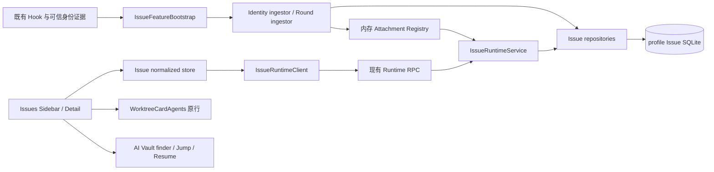

# Issues 看板与会话技术说明

这是现有实现的合并说明，依据 2026-09-05 工作树及已暂存的标题稳定化改动，不是待实施的新设计。`ready` 表示文档核对完成，不表示代码已提交、当前 App 已更新或验收通过。

上位[需求](../requirements/Issues看板与会话.md)定义 REQ-001～REQ-029，[测试规格](../tests/cases/Issues功能测试.md)定义可重复执行的断言。旧产品方案、数据模型、历次技术改造、会话行/恢复/标题补丁方案的有效合同统一收录于此；历史执行结果留在 Test Run，不作为本文现状证据。

## 需求覆盖索引

| 关联需求                                    | 技术章节与边界                                              |
| ------------------------------------------- | ----------------------------------------------------------- |
| REQ-001、REQ-006、REQ-010                   | §1、§2、§5、§6：身份、可信物化与运行投影                    |
| REQ-002、REQ-003、REQ-008、REQ-020          | §4、§11：外部引用、树、绑定、归档与原生 Project transfer    |
| REQ-004、REQ-017、REQ-019、REQ-022          | §8：查询、刷新、虚拟列表与原 Workspace 行；容量缺口见 §11   |
| REQ-005、REQ-007、REQ-009、REQ-024、REQ-028 | §5：claim、可见性、重试/忘记与辅助会话；未接线边界见 §11    |
| REQ-011、REQ-023、REQ-027                   | §9：AI Vault 恢复和 launch-config 原 pane 身份窗口          |
| REQ-012、REQ-013                            | §6：Round 义务、去重、后续输入与重开                        |
| REQ-014、REQ-016、REQ-026                   | §3、§10：事务、receipt、revision、schema v4 与标题分槽      |
| REQ-015、REQ-018                            | §7、§11：host/RPC 合同、readiness 和未完成的 Node-only 装配 |
| REQ-025                                     | §10：各 UI 按身份键消费同一标题优先级                       |
| REQ-021、REQ-029                            | §11、§12：当前限制、后续目标与分层验收                      |

## 1. 模块与数据所有权



- [src/main/issues](../../../../src/main/issues/issue-repository.ts)拥有 Issue/Conversation/Round 仓储、迁移、mutation 与投影；`IssueRepository` 组合领域仓储。
- [src/shared/issues/types.ts](../../../../src/shared/issues/types.ts)与 schemas 是数据/RPC 合同；`runtime:*` 只作为 transport route。
- [src/renderer/src/issues](../../../../src/renderer/src/issues/issues-domain-store.ts)维护按 route 划分的 normalized entity、view、scope 和 generation。
- Issues 专属组件消费投影；Workspaces/AI Vault 继续拥有原生运行行和恢复动作。
- 不让 `issueId` 穿透 terminal 启动模型；现有 `launchToken` 是启动关联缝，不是持久 provider identity。

## 2. 稳定记录与运行投影

| 对象                         | 关键字段/责任                                                                                                          | 不承担的责任                                      |
| ---------------------------- | ---------------------------------------------------------------------------------------------------------------------- | ------------------------------------------------- |
| IssueRecord                  | ID、host partition、local/external source、标题/type/note、parent/order、active/archived、recordRevision               | provider 原生工作项状态同步、运行进程身份         |
| ConversationRecord           | ID、唯一 WorkspaceScope 与 name/path snapshot、agent、可空 issueId、人工 title、providerTitle、launchFailure、revision | pane/PTY 生命周期、自动生成新标题                 |
| ConversationProviderIdentity | agent、session key/id、可选 transcript path、fingerprint、resume locator、observed/retired 时间                        | 标题搜索、用 cwd 猜身份                           |
| ConversationLaunchClaim      | token fingerprint、Conversation、pane/process/connection 辅助信息、TTL 与 settlement                                   | 永久恢复映射、令牌明文存储                        |
| RoundRecord                  | completion/waiting、waiting reason、source/time、dedupe、三类有界预览、read/resolve                                    | transcript 正文仓库、execution-chain supersession |
| Runtime Attachment           | 当前 pane/tab、identity/authority evidence、execution state 与内存 revision                                            | 跨 profile 稳定事实、远端死亡判据                 |
| ConversationSummary          | 上述稳定字段 + attachment、navigation、resumability、executionState、unresolved/latestRound                            | 保证原 Workspace 当前可用的完整探测结果           |

`WorkspaceScope` 为 `worktreeId` 或 `folderWorkspaceId`，不能默认有 repo/Git。记录的 workspace snapshot 供目标缺失后展示，不可单独证明目标可启动。

持久 execution host 只允许 `local` 或 `ssh:<target>`。`ConversationSummary.navigation` 携带 active Provider identity，供标题与恢复选择；`attachment.paneKey` 只描述当前附着。不能把可选 navigation paneKey 当作唯一去重依据。

来源：[types](../../../../src/shared/issues/types.ts)、[record schemas](../../../../src/shared/issues/record-schemas.ts)、[query projections](../../../../src/main/issues/issue-query-projections.ts)中的 `readIssueSummaries/readConversationSummaries`。

## 3. SQLite、迁移与并发

### 3.1 存储布局

[IssueDatabase.open](../../../../src/main/issues/issue-database.ts)按 profile 路径打开 `issues/orca-issues.db`。每个 owning runtime 一个数据库，内部按 local/direct SSH partition 隔离。authority ID 随数据库持久保存，不以 profileLabel 作为身份键。

九张领域表保留：

| 表                               | 责任                                             |
| -------------------------------- | ------------------------------------------------ |
| issue_authority_meta             | authority ID 与 profile 元信息                   |
| issue_host_state                 | local Issue number、facts/tree revision          |
| issues                           | Issue 树、外部快照、生命周期                     |
| conversations                    | Workspace 强归属、绑定、人工标题与 Provider 快照 |
| conversation_provider_identities | provider 会话身份与恢复信息                      |
| conversation_launch_claims       | 一次性关联 claim                                 |
| round_records                    | 有界轮次事实与处理状态                           |
| round_refs                       | provider-turn/transcript-fact 等引用和去重       |
| issue_mutation_receipts          | caller/mutation 幂等结果                         |

DDL 见[core schema](../../../../src/main/issues/issue-database-core-schema.ts)、[round schema](../../../../src/main/issues/issue-database-round-schema.ts)。host/workspace/关联约束由 schema、repository、FK/trigger 分层约束；不是只靠 UI 过滤。

数据库启用 WAL、synchronous=NORMAL、busy_timeout=5000、foreign_keys=ON 并读回。POSIX 目录 0700，DB/WAL/SHM 0600，文件加固见[权限处理](../../../../src/main/issues/issue-database-file-permissions.ts)。Windows 不套用 POSIX chmod 语义。

### 3.2 当前 schema v4

[migrateIssueDatabase](../../../../src/main/issues/issue-database-migrations.ts)在 BEGIN IMMEDIATE 中迁移，全部成功后 bump user_version，失败 ROLLBACK。

- v1：九张核心表。
- v2：修复存在后续用户输入却仍未解决的历史 completion，并清理旧 reconciler receipt。
- v3：增加 title_source；历史无 source 非空标题按当时人工写入路径归类。
- v4：增加 provider_title；旧 provider 标题移入快照，旧 minted 清空，user 保留；未分类非空 title 保留为 user。
- 受影响 Conversation record revision 与 partition facts revision 推进；不删除 Conversation、Issue、identity、Round 或绑定。
- fresh DB 同样最终为 v4。高于当前支持的 schema 被拒绝，不自动删库重建。

旧二进制可能拒绝 schema v4；不能把 wire optional 兼容等同于数据库降级兼容。二进制回滚应使用支持 v4 的版本或对应备份，不反向套用 v1“开发库随意重置”说明。

### 3.3 Revision 与 receipt

[executeIssueMutation](../../../../src/main/issues/issue-mutation-receipt.ts)以 callerFingerprint + mutationId 定位 receipt，同 method/payload 回放结果，不同 payload/method 返回 `mutation_receipt_conflict`。pending receipt、领域写入和 completed result 位于同一事务，失败一起回滚。

recordRevision 保护单实体编辑/绑定；treeRevision 保护 reparent；factsRevision 驱动持久投影；Runtime Attachment revision 独立于数据库变化。典型 stale 错误为 `issue_record_revision_stale`、`conversation_record_revision_stale`、`issue_tree_revision_stale`。

[ConversationForgetService.forget](../../../../src/main/issues/conversation-forget-service.ts)先检查内存 preflight grant，再进入 receipt。成功后 grant 被移除；因此“同 token 删除成功后可直接 receipt replay”不能从通用 receipt 合同推导为已通过，保留专项验证项。

### 3.4 长度边界

[constants](../../../../src/shared/issues/constants.ts)：title 512 bytes、note 32 KiB、Round 每段 preview 8 KiB、单页最多 500 records/1 MiB、cursor 2 KiB、launch token 32～256 字符。部分 Zod 使用字符长度，repository 另作 UTF-8 bytes 校验；测试必须包含中文/emoji，不能把“512 字符均合法”作为承诺。

## 4. Issue 树、生命周期与绑定

[IssueHierarchyMutation](../../../../src/main/issues/issue-hierarchy-mutation.ts)处理 reparent/order；[hierarchy validation](../../../../src/main/issues/issue-hierarchy-validation.ts)拒绝自身、循环、第四级和跨主机目标。删除采用 prepare/commit 计划，显式列明 children 和 direct Conversations 的去向，防止隐式级联删除工作历史。

[IssueLifecycleRepository](../../../../src/main/issues/issue-lifecycle-repository.ts)：

- archive 只影响当前 Issue，不级联父子。
- direct unresolved waiting 阻止 archive。
- 成功 archive 同事务解决 direct unresolved completion，resolution=archive。
- 新事实按 Round repository 规则重开；普通延迟历史不应因晚到改变已归档结果。
- `isRuntimeWaiting` 有注入点，但当前 `IssueRepository` 未注入 attachment probe；纯内存 waiting 尚未落 Round 的归档防护不能宣称完整。

[ConversationRecordRepository.bindIssue](../../../../src/main/issues/conversation-record-repository.ts)在一次 revision-checked mutation 内改变 issueId。换绑不先解绑，也不改变 Workspace、provider identity、历史 ID。runtime service 在新目标非空绑定成功后异步 schedule title refresh；标题读取失败不改变绑定结果。

## 5. 会话启动与可信纳管

### 5.1 Issue 显式启动

[prepareAndLaunchIssueConversation](../../../../src/renderer/src/components/issues/issue-conversation-launch-action.ts)：

1. 调 `conversations.prepareLaunch`，携带 host、WorkspaceScope/snapshot、agent、issueId、launchToken、mutationId。
2. 服务端 `ConversationAllocator.prepareLaunch` 校验目标并原子创建 Conversation/claim。
3. 调原 `launchAgentInNewTab`，只传既有 launchToken。
4. 聚焦目标 Workspace；launcher 未返回 tab 或 Workspace 激活失败则返回错误。

当前 renderer 不调用 `recordLaunchFailure` / `prepareRetry`。后端保留这些 RPC 和 retry blocker，不能因此描述 UI 仍有 Retry/Starting 流程。

### 5.2 Identity 前不可见

[shouldShowIssueConversation](../../../../src/renderer/src/issues/issue-conversation-presentation.ts)要求 providerSession.id；详情列表也按 identity 过滤。[readIssueSummaries](../../../../src/main/issues/issue-query-projections.ts)只把有 active identity 的 Conversation 计入 direct/running/unresolved 汇总。

API 可读到无 identity 预分配事实，但 Issues 普通 UI 隐藏它。首条 Hook 后才出现真实行。没有 Hook 不代表业务可以伪造 running/closed/provider identity。

### 5.3 Claim 与普通启动

[ConversationHookIdentityIngestor.ingest](../../../../src/main/issues/conversation-hook-identity-ingestor.ts)先解析可信 authority/Workspace/provider identity：

- 有有效 claim：attach identity 到预分配 Conversation，记录 runtime attachment。
- claim_not_found 或 claim_expired：按普通可信 identity 创建/复用 issueId=null Conversation。
- invalid/ambiguous/其他无法结算 claim：忽略并留诊断，不猜测关联。
- hydrated/replay 证据不能在空 profile 单独物化历史；只可匹配既有 identity 恢复 attachment。
- 首次 identity 附着触发同一个 title refresh；不再把 minted title 写库。

[ConversationAllocator](../../../../src/main/issues/conversation-allocator.ts)与[claim repository](../../../../src/main/issues/conversation-launch-claim-repository.ts)维护 15 分钟 TTL 与 attached/failed/expired/retired settlement。token fingerprint 不能承担后续 session 的永久绑定权。

TTL 后真实会话可在未归属区再次 Bind existing；原无 identity 预分配记录仍隐藏。孤儿自动清理尚未实现。

### 5.4 Forget 与 retry

[ConversationForgetService](../../../../src/main/issues/conversation-forget-service.ts)返回 identity/Round 数、unresolved 数、transcript locator、attachment 状态、blockers 和 60 秒内存 token。commit 重查 record revision、attachment generation、running/waiting、pending claim。只级联删除 Orca facts，不操作 transcript。

后端 retry 只允许没有 identity、Round、attachment、未过期 claim 的失败预分配记录，复用 Conversation ID 并建立新 claim。此合同保留为 backend 测试，不再作为正常 Issue UI 动线。

## 6. Attachment 与 Round

[ConversationRuntimeAttachmentRegistry](../../../../src/main/issues/conversation-runtime-attachment-registry.ts)持有有界内存 overlay。pane clear 只 detach；transient connection clear 只清目标 connection；trusted status/provider/authority 快照用于裁剪和恢复。无 attachment 的稳定记录仍能查询。

[RoundRecordIngestor](../../../../src/main/issues/round-record-ingestor.ts)按 pane 串行 ingest；先排除 Codex 标题生成 utility 和不构成 turn 的 pathless SessionStart，再解析 Conversation。providerSessionOnly、restoredUnconfirmed、sessionBoundary 只更新身份证据，不生成用户 Round。

- done→completion；waiting/blocked→waiting，保留 question/approval/blocked/other。
- working 或 done 可解决较早 waiting，resolution=resumed。
- explicit prompt 可解决最新较早 completion，resolution=new-input。
- mark-read 与 resolve 分离；等待不会因关闭 pane/断连被清除。
- Round ref/dedupe 合并同一事实；不保留 execution-chain/superseded 状态。
- settled 状态调度 reconciliation 和 title refresh；working 不额外重复读 Provider 标题。

[RoundRecordReconciler](../../../../src/main/issues/round-record-reconciliation.ts)读现有 native transcript，按 turn/ref 合并、补强预览，且可根据后续用户输入解决历史 completion。新输入解决历史义务不同于“仅因为后来出现另一 completion 就 supersede 前一条”。

当前非 local partition 返回 `remote-transcript-unavailable`；direct SSH 的 Round 正文补强不在本地读远端文件。若远端宿主完成 Issues 装配，paired runtime 合同使用远端 local partition；这一分区语义不能证明当前 Node-only orcad 已完成装配。

## 7. Host、RPC 与 readiness

### 7.1 路由拓扑

| Renderer route      | RPC target                                | authority selector / DB partition | 数据 owner                                                             |
| ------------------- | ----------------------------------------- | --------------------------------- | ---------------------------------------------------------------------- |
| local               | 本地 runtime                              | local                             | 当前 profile 的本地 runtime                                            |
| ssh:target          | 本地 runtime，经受管 SSH 目标执行所需读取 | ssh:target                        | 本地 authority DB 中的该 SSH partition                                 |
| runtime:environment | 对应 paired runtime                       | 远端 local                        | 协议目标为远端 runtime profile DB；当前 Node-only 服务装配未见生产调用 |

[resolveIssueRuntimeRoute](../../../../src/renderer/src/issues/issue-runtime-client.ts)将 paired route 映射为远端 local，缓存仍按客户端 runtime route 隔离。[resolveIssueAuthorityRoute](../../../../src/main/issues/issue-authority-route.ts)校验受管 SSH target；[route guard](../../../../src/main/issues/issue-runtime-route-guard.ts)在读取/mutation 前确认记录位于请求分区。

协议使用现有 request/response RPC，不新增 stream opcode。[shared RPC schemas](../../../../src/shared/issues/runtime-rpc-schemas.ts)和[query schemas](../../../../src/shared/issues/query-rpc-schemas.ts)定义 status/list/get/listRounds 及 mutation。paired caller 不允许选 ssh 形成二跳；新增字段保持 optional。

### 7.2 支持与健康

`orca-issues.v1` 表示协议支持，不表示数据库/Hook/网络当前健康：

| 状态        | 行为                                                                                    |
| ----------- | --------------------------------------------------------------------------------------- |
| ready       | storage/hook ready，正常读取与 mutation                                                 |
| degraded    | storage ready，Hook disabled/failed；CRUD/显式 prepare 可用，普通启动无可信 Hook 不物化 |
| unavailable | storage open/migration 失败；status-only registry 可读，其他 Issue 操作失败，不删库     |
| unsupported | paired host 不含 capability；client 在 list/write 前拒绝                                |
| offline     | route 不可用，禁写；不提供离线 mutation queue                                           |

[IssueFeatureReadinessRegistry](../../../../src/main/issues/issue-feature-readiness.ts)保存 readiness，客户端还检验返回 authority selector。当前 `IssueDomainSyncGate.refreshRoute` 把所有非 Unsupported 异常归为 offline；类型中有 error，尚不能据此宣称独立 error/retry 流程完成。

### 7.3 已装配的 Electron 生命周期与 Node-only 缺口

[main-process lifecycle](../../../../src/main/issues/issue-main-process-lifecycle.ts)等待 local PTY startup，再调用 `startIssueFeatureForHost`；desktop 异步安装，Electron serve 等待 readiness。composition root 位于[main/index.ts](../../../../src/main/index.ts)，will-quit dispose。

[host lifecycle](../../../../src/main/issues/issue-host-lifecycle.ts)向 bootstrap 注入现有 Hook source、Workspace resolver、managed SSH resolver 和 host-routed session title resolver；失败降为 unavailable，不另起 Hook server。[IssueFeatureBootstrap](../../../../src/main/issues/issue-feature-bootstrap.ts)组织 snapshot/live coordinator、identity/round ingestor、attachment 对账和 provider/status/clear 订阅，dispose 时取消订阅并关库。

全量搜索当前 src/main 生产调用，`startIssueFeatureForHost` 仅由 `issue-main-process-lifecycle` 调用，再由 Electron `main/index.ts` 注入；没有发现 Node-only orcad 的对应装配调用。共享 host/bootstrap 类和 RPC manifest 存在不能证明独立 Node 宿主服务可用。三类宿主都能提供 Issues 是保留的后续目标，Node-only 启停、readiness、标题 resolver 与远端 DB 的完整链须另行实施/验收。

## 8. 查询、同步与 UI

### 8.1 分页合同及现状

[IssueQueryService](../../../../src/main/issues/issue-query-service.ts)返回 snapshot-page/not-modified/stale。cursor 固定 scope hash、facts/tree/runtime revision；继续页时 revision 漂移返回 stale。页面受 record 数和 byte budget 双限额约束。

[IssueDomainSyncGate](../../../../src/renderer/src/issues/IssueDomainSyncGate.tsx)：

- Issues Sidebar/详情可见时 5 秒刷新；否则 15 秒。
- 非 Issues 模式仍拉 authority Conversations，以提供标题等中性投影；不向 Workspaces 添加持久行。
- 每页请求 200 条，stale 最多重启 3 次。
- entities 在 partitionsByRouteExecutionHostId 内归一化，filter/scope 只引用 IDs，authorityId 改变清 generation。
- 当前使用 setInterval 和全局 sequence；不是 route 独立串行队列。慢请求可重叠，旧 sequence 响应被丢弃。
- 当前 repository 全量 list 后过滤、聚合、内存分页；没有实现 SQL 先分页/聚合。

### 8.2 Sidebar 与详情

[buildIssueRows](../../../../src/renderer/src/components/sidebar/issues/build-issue-rows.ts)复用树投影，搜索当前已加载 Issue 标题、external identifier 和最终 Conversation display name，不检索 Round 正文。未归属区是平铺排序附 Workspace 名，不再增加 Workspace 分组层。

[IssueSidebar](../../../../src/renderer/src/components/sidebar/issues/issue-sidebar.tsx)使用现有虚拟列表，多个有内容 host 在行上显示 host 标签；空 host 只留在 selector 中。不存在旧文描述的必备 host/profile header 三棵 region。

[IssueConversationList](../../../../src/renderer/src/components/issues/IssueConversationList.tsx)显示 direct Conversations、Rename、bind/rebind/unbind 与 Forget；Round timeline 单独读取。Issues 的管理动作不是 Workspace 行新增职责。

### 8.3 原行复用

[IssueConversationRowContent](../../../../src/renderer/src/components/issues/IssueConversationRowContent.tsx)先确认 Workspace 当前 host 等于 route，再用 `selectIssueConversationWorkspaceRows` 按 agent/provider identity 精确选择原行。attachment paneKey 优选命中，但缺失或滞后不阻止 identity 命中；retained 根行被排除。

命中后直接渲染整个 `WorktreeCardAgents`，保留 lineage 子树、compact/full、状态点、model/preview、focus/unvisited、send target、ack/dismiss 和内部 activation。外层只在主体点击后用 setTimeout(0) 清 activeIssueRoute；次级按钮不触发这一步，避免在原生 bubble handler 前卸载组件。

没有原行时显示中性 fallback：标题、agent、原 Workspace、unresolved badge 和 Resume。不能构造假 paneKey/tab 或把 retained 假装可点击 live 行。

## 9. 一键恢复与原 pane 身份窗口

[resumeIssueConversationWithAiVault](../../../../src/renderer/src/issues/issue-conversation-resume.ts)复用同一现有链：

1. 从 navigation.providerSession 读取持久身份；缺失则失败。
2. [resolveAiVaultSessionByProviderIdentity](../../../../src/renderer/src/components/right-sidebar/ai-vault-provider-session-resolution.ts)调用既有 listSessions，限制原 Workspace paths 和当前 executionHostScope，然后按 host+agent+sessionId 筛到唯一结果；Pi/Prime 额外匹配 transcript path。
3. scanner cancelled、找不到/歧义、无可恢复内容时用原有错误提示结束。
4. 调原 `jumpToAiVaultOriginalPane`；focused 则清 Issue 页面并结束，workspace-unavailable 则失败。
5. missing 才调用原 `resumeAiVaultSession`，指定原 Workspace target，复用校验、prepare、launch、提示与错误处理。
6. 成功启动后进入 Workspace；可信运行证据再把 pane 附着到原 Conversation。

Issue 没有新增历史 scanner/cache，也未给 AI Vault 原 Resume 加 `conversations.prepareResume` 前置门禁。旧稿的 `resume_workspace_mismatch`、跨 Workspace 强制 Continue、Issue 继承自动化不是当前实现合同。按钮 pending 只覆盖一次 Promise，不是对原生 tab 幂等的全程承诺。

[findOriginalAiVaultSessionPane](../../../../src/renderer/src/components/right-sidebar/ai-vault-original-pane.ts)与[index](../../../../src/renderer/src/components/right-sidebar/ai-vault-original-pane-index.ts)已纳入 `agentLaunchConfigByPaneKey.providerSession`；注册时从既有 resumeProviderSession 透传，匹配后仍校验真实 tab/leaf。这覆盖 pane 已建立但尚无首条 Hook 的恢复窗口，不把 launch-config 当 live 状态。

边界：尚无 paneKey 的 pendingStartup 秒级窗口、旧远端 presentation wire 缺 identity 仍未由此扩展覆盖；未新增 stream frame 或进程生命判断。

## 10. 标题稳定化：当前暂存实现

### 10.1 来源与优先级

[resolveSessionDisplayTitle](../../../../src/shared/session-display-title.ts)是无 I/O 纯函数：

```text
userTitle
→ current providerTitle（非 identity fallback）
→ providerTitleSnapshot（非 identity fallback）
→ generatedTitle
→ meaningful liveTitle
→ identityFallbackTitle
```

空白候选跳过；人工名即使恰好等于 identity fallback 也仍是人工选择。fallback 由 agent/sessionId 纯派生，不落库。

`ConversationRecord.title` 只保存用户 override；`providerTitle` optional 保存最后有意义 Provider 快照；`titleSource` 保留 minted/provider/user 兼容枚举，但新写只 user/null。当前 Provider、持久快照与不同 UI 已有候选并非保证同时存在；统一的是优先级，而不是所有显示面强制共用一个字符串。

### 10.2 写入与触发

[applyConversationTitleAuthority](../../../../src/main/issues/conversation-title-authority.ts)与[writes](../../../../src/main/issues/conversation-title-writes.ts)分别裁决 user/provider：

- Rename/Clear 只动 title/title_source，保留 provider_title。
- Provider refresh 只动 provider_title，不覆盖人工名；同值 no-op。
- 所有实际写入检查 recordRevision，推进记录与 facts；冲突不盲写。
- prepareLaunch 调用方显式提供的初始 title 属 user；普通创建不 mint。

[ConversationTitleRefresh](../../../../src/main/issues/conversation-title-refresh.ts)复用 host-routed AI Vault resolver，触发来自首次 identity attach、绑定到非空 Issue、settled Round 和一次启动 backfill。backfill 只取无快照且有 active identity 的支持 agent，按 host 分组并按 resolver 上限分批；不访问其他主机私有路径。

inFlight 合并重复调用，期间新 trigger 记 pending，当前请求完成后再读一次。没有后台无限 poller/退避链。空值、identity fallback、conversation-override 不写快照；超长结果按 UTF-8 bytes 截断；disposed 后不回写。没新事件时不承诺 Provider late-title 立即收敛。

### 10.3 四处消费

| 显示面          | 当前接入                                                                                             |
| --------------- | ---------------------------------------------------------------------------------------------------- |
| Issues detached | issueConversationDisplayName 使用人工名→resolver 结果→providerTitle 快照→fallback                    |
| Workspace row   | 逐行 identity 查询人工 override，校验 tab aiVaultTitle 属于该 session；split sibling 不借用错误槽    |
| Terminal Tab    | 既有 active/priority pane 候选写入 aiVaultTitle，optional source 区分 provider/conversation-override |
| 右侧 History    | canonical 只投影人工 override；无 override 用原 session.title；搜索保留人工名和原生名                |

关键代码：[conversation-canonical-titles](../../../../src/renderer/src/issues/conversation-canonical-titles.ts)、[conversation-session-titles](../../../../src/renderer/src/issues/conversation-session-titles.ts)、[Workspace title hook](../../../../src/renderer/src/components/dashboard/use-agent-row-conversation-name.ts)、[tab-title-resolution](../../../../src/shared/tab-title-resolution.ts)、[tab sync](../../../../src/renderer/src/lib/ai-vault-tab-title-sync.ts)、[右侧 title hook](../../../../src/renderer/src/components/right-sidebar/use-canonical-session-titles.ts)。

Tab 既有 customTitle/quickCommandLabel/OpenCode 有意义标题优先；清人工覆盖时清理 source=conversation-override 的旧槽，旧无 source 值按兼容策略重新 reconcile。未认识 optional source/providerTitle 的版本按原生链处理，不增加 stream opcode。

当前 Issues 标题请求 hook 以 identity 集合 requestsKey 变化触发解析，不是持续 resolver 轮询；展示新鲜度还依赖持久 provider snapshot 与已有原生刷新。不能把“统一来源优先级”写成每次 Provider 改名四处必然同步即时完成。

### 10.4 已核实缺陷：resolver 依赖存储路径，右侧不依赖

10.1–10.3 的优先级链本身成立，但**它上游的取数方式有缺陷**，导致 providerTitle 快照在真实库里大面积为空，展示链因此落到 liveTitle（agent 每帧改写的 OSC 串）。

同一份 transcript，两条取数路径：

| 路径                     | 实现                                                                                                                                | 是否依赖存储的 transcript_path |
| ------------------------ | ----------------------------------------------------------------------------------------------------------------------------------- | ------------------------------ |
| 右侧 History             | [scanner roots](../../../../src/main/ai-vault/session-scanner-roots.ts) 遍历 `~/.claude/projects`、`~/.codex/sessions` 全目录后解析 | **否**——路径是遍历得到的       |
| Issues / Tab / Workspace | [readOneTitle](../../../../src/main/ai-vault/session-title-file-reader.ts) 按 `request.transcriptPath` 点查                         | **是**                         |

`readOneTitle` 的四条出口里，只有“无 `transcriptPath`”一条回落到进程内 titleIndex（由 `listSessions` 扫描顺带填充）；**路径存在但不可用的三条——`!stats.isFile()`、解析结果 agent/sessionId 不匹配或 title 为空、`catch`——都直接 `return null`，均不回落缓存**。因此“存了一个失效路径”比“没有存路径”更差。

实测（2026-09-06，`local-default` profile，151 条 conversation）：

| 分组                                                       | 条数 | 有 providerTitle |
| ---------------------------------------------------------- | ---- | ---------------- |
| identity 带有效 `transcript_path`                          | 62   | **62（全部）**   |
| 无 `transcript_path`                                       | 78   | 0                |
| 路径指向已不存在的文件                                     | 10   | 0                |
| agent 与路径宿主错配（claude 记录指向 `.codex/sessions/`） | 1    | 0                |
| 无 active identity                                         | 2    | 0                |

按 agent：codex 19 条有路径 / 70 条无路径，有快照的恰好是那 19 条；claude 54 条有路径中 10 条为死链。相关性为 1，不是概率问题。

**但路径不是根因。** 对上述 89 条无快照会话按 `(agent, sessionId)` 直接搜盘（`~/.claude/projects`、`~/.codex/sessions`、Orca 托管 CODEX_HOME 的 `sessions`，共 2829 个 codex `.jsonl` 加全部 claude 项目目录），**命中 0 条**；同一方法对有快照的会话逐条命中（claude 5/5、codex 3/3，作为正向对照）。结论修正为：

> `provider_title IS NULL` ⟺ **transcript 已不在磁盘上**。identity 的路径缺失或失效是同一件事的症状，不是原因。

因此任何取数策略（按路径点查、按 sessionId 定位、整库扫描）都救不回这 89 条——事实源本身没了。已实施的 [resolver 扫描回退](../../../../src/main/ai-vault/session-title-resolver.ts)只是把“路径失效但文件仍在”这一类补上（防御性、有单测），对本机实测**救回 0 条**。

由此得到两条必须分开处理的结论：

1. **展示侧**：transcript 消失后 Provider 名不可得，唯一能止住 liveTitle 抖动的是稳定兜底名。当前 `title`/`title_source` 全表为 NULL——**附着时铸兜底名从未实现**，`mintAgentSessionFallbackTitle` 在 main 侧仅被 refresh 用作拒绝比较，没有任何写入调用。这是止血的必要改动，与取数无关。
2. **数据侧**：transcript 并未丢失——这 89 条里 **88 条不是用户会话**，是 Orca 自身发起的一次性内部调用（见 10.5），本就不落 rollout 文件。

附带结论：`provider_title` 是派生值缓存，事实源是 transcript。右侧不缓存却始终正确，说明该缓存并非正确性必需。是否保留应在铸造补齐后单独评估，不作为止血前置。

### 10.5 已核实缺陷：内部调用被当作用户会话纳管

对 10.4 的 89 条无快照会话按首轮输入分类（2026-09-06 实测）：

| 条数  | 首轮输入                                                               | 性质                    |
| ----- | ---------------------------------------------------------------------- | ----------------------- |
| 47    | `Write a brief catch-up for a user returning to this Codex task…`      | Orca 回归摘要调用       |
| 40    | （零轮次）                                                             | 内部调用，无可记录轮次  |
| 4     | `Generate a concise, single-line task title of at most 36 characters…` | Codex thread title 生成 |
| 2     | `You are an expert at upholding safety and compliance standards…`      | 安全合规调用            |
| 1     | `# Overview Generate 0 to 3 hyperpersonalized suggestions…`            | 建议生成调用            |
| **1** | 用户中文提问                                                           | **唯一的真实会话**      |

对照组 62 条有快照会话的首轮输入全部为真人输入（如「继续」「改」「跑啊 你在干嘛」）。即 **88/89 不是用户会话**。这些调用一次性执行、不落 rollout 文件，因而永远取不到 Provider 名；它们同时进入 Issues 行与 conversation 计数。

现有过滤 [isCodexThreadTitleGenerationEvent](../../../../src/main/issues/round-record-ingestor.ts) 是**只覆盖一种 prompt 的白名单**：要求 `agentType === 'codex'`、`providerSession` 存在且**无** transcriptPath、且 prompt 同时匹配 [前缀与 imperative-verb 标记](../../../../src/shared/codex-thread-title-generation.ts)。因此：

- claude 的内部调用完全不被覆盖（本次 21 条）；
- 回归摘要、安全合规、建议生成三类 prompt 不在白名单内（本次 50 条）；
- 即便是标题生成，仍有 4 条漏入——事件级判定还要求 `providerSession` 非空且无路径，首个到达的 hook 事件未必满足。

按 prompt 文本匹配追不上不断新增/改写的内部 prompt。修复方向：由**发起端**在启动内部调用时打标（Orca 自己发起，掌握该事实），hook 事件透传该标记，ingestor 按标记忽略，不再在接收端猜测 prompt。此改动不在标题链范围内，但它同时消除 10.4 的“无快照”主因与假会话进入 Issues 列表/计数的问题。

## 11. 当前限制、撤回方案与风险

| 项目                    | 已核实的边界                                                                                                             | 文档处理                                                                 |
| ----------------------- | ------------------------------------------------------------------------------------------------------------------------ | ------------------------------------------------------------------------ |
| SQL 容量                | 多处全量 list 后再过滤/聚合/分页                                                                                         | 后续目标，不写成已优化                                                   |
| 刷新调度                | 全局 sequence + setInterval；非 Issues 仍拉 Conversations                                                                | 保留真实周期，不宣称串行/零后台读取                                      |
| 错误分类                | 非 unsupported 异常统一 offline                                                                                          | 独立 error/retry 保留待实现测试                                          |
| Workspace 可用性        | query 默认 effectiveProject=null、workspaceAvailable=true，service 未注入真实 resolver                                   | 最终动作靠原生 target 校验；不要信其为在线证明                           |
| Archive runtime waiting | repository 默认 probe=false                                                                                              | unresolved waiting Round 有防护；纯运行态窗口另测                        |
| Forget replay           | grant 先检查且成功即消费                                                                                                 | 通用 receipt 不能证明该路径可 replay                                     |
| Project move guard      | 当前 src 无旧 guard/错误码接线                                                                                           | 撤回，保留原 transfer 回归                                               |
| 原生恢复                | 承接原 AI Vault 能力与错误边界                                                                                           | 不承诺第二套恢复状态机或全程幂等                                         |
| Codex daemon 隔离旧方案 | 当前 src 未发现 `-c features.hooks=true` 注入或 codexHookDaemonIsolation 开关                                            | 历史候选原因留简述，不能列已实现                                         |
| 标题输出                | refresh 日志当前包含 title JSON；隐私检查需按真实候选数据执行                                                            | 不先行宣称全日志无用户文本                                               |
| Provider 快照覆盖率     | 实测 151 条 conversation 中仅 62 条有 providerTitle；缺口 89 条的 transcript 已不在磁盘（搜盘命中 0，见 10.4）           | 不能把 10.1 的优先级链写成“四处已一致”；缺快照时实际显示 liveTitle       |
| 附着铸造                | `title`/`title_source` 全表 NULL；main 侧无任何 mint 写入调用，兜底名仅用作 refresh 的拒绝比较                           | 不能把“可见即有名”写成已实现；这是 liveTitle 抖动的直接原因              |
| 内部调用纳管            | 89 条无快照会话中 88 条为 Orca 自身内部调用（回归摘要/标题生成/合规/建议），现有白名单只覆盖一种 codex prompt（见 10.5） | 不能把 conversation 计数与 Issues 行当作纯用户会话；按 prompt 匹配追不上 |
| 远端装配与验证          | Node-only orcad 未见生产 bootstrap 调用，本轮也未连接 SSH/paired runtime 或执行 CDP                                      | 分开协议路由、宿主接线和真实成功；不能写 paired 已可用                   |
| 真实 App                | 暂存 v4/标题代码未在本轮构建验收                                                                                         | 历史截图/包 hash 不能代表该工作树                                        |

旧 `_历史稿` 中的介入卡强分类、自报模板、收件箱出队、diff 快照、整理稿自动起草、Forge 同步、Dashboard 换底、移动端窄路径已不属于本需求当前产品范围。其有用原则归并为 Issue/会话分工、可下钻和明确 read/resolve；不保留平行需求口径。

## 12. 验证说明

当前源码提供 Issue repository/allocator/ingestor/query/readiness、renderer store/row/resume、title migration/lifecycle/refresh、original pane finder/index 等定向测试。它们是可执行验证入口，本次整理没有重新运行。

建议按[测试规格](../tests/cases/Issues功能测试.md)记录实际执行集。真实 App 使用项目要求的 Electron + Playwright CDP；local/folder、真实 SSH、paired runtime、profile、混合版本分别列环境与未覆盖项。historical Test Run 保留原日期、包 hash、命令、截图索引；旧截图目录可能被后续运行复用，不能据文件仍存在就证明原始运行内容未变。
