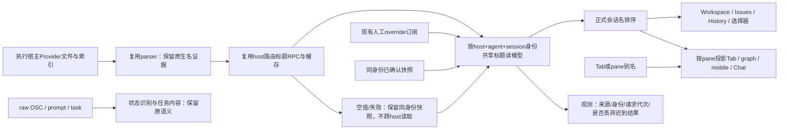
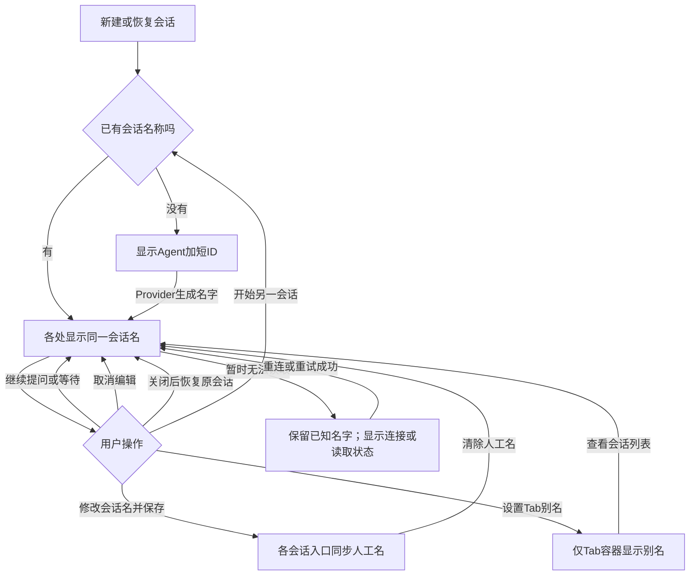
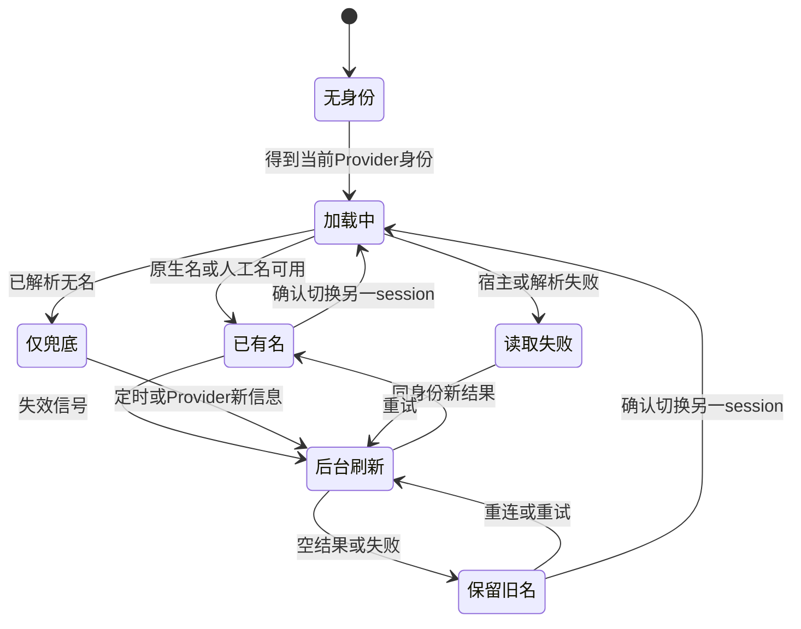

# 会话命名统一方案

> 已于2026-09-08被[Provider优先的会话命名统一方案](Provider优先的会话命名统一方案.md)替代。原因：用户明确Provider第一、保留派生/实时回退、Agent Tab与左侧严格同名、Issues退出命名逻辑和存储。以下保留为历史初稿，不是当前实施依据；其中人工名第一、Tab别名例外、Issues快照扩建均已撤回。

## 0. 摘要

目标是**同一宿主、同一 Provider 会话，在所有“会话标识”位置读同一个名字**，而不是让任务标题、Tab别名、进程标签也全部一样。

Claude/Codex 的目标排序：**Orca 会话人工名 → 当前明确的 Provider 原生名 → 同身份最后一次已确认的 Provider 原生名 → Agent 加短 sessionId**。首prompt、Orca generatedTitle、运行中OSC不再作为这两种Agent的正式会话名。Tab/pane别名继续存在，但只命名各自的界面容器，不冒充会话级改名。

这是一份待实施设计；本轮只有源码调研和文档，没有产品代码、构建、重启或功能测试。基线、完整消费者与现状冲突见[现状调研](../research/会话命名现状调研.md)。

## 1. 状态与结论

| 项目 | 本方案决定 |
| --- | --- |
| 已具备且保留 | 原生parser、host路由、批次与缓存、人工override、独立快照、稳定fallback、Workspace真实行及恢复动作 |
| 主要改造 | 来源可识别；按session统一读模型与刷新；按pane/当前身份正确投影；覆盖旁路和跨端消费者 |
| 不做 | 新建命名LLM、冻结第一个自动名、按prompt猜主/辅助调用、写minted冒充人工名、修改Provider原始文件、全局覆盖raw title |
| 实施边界 | 首先实现Claude/Codex正式会话名；OpenCode等现有语义OSC和普通terminal行为保持；其他Provider以后按明确字段接入 |
| 仍需实证 | 历史某次identity变化的真实来源；混合版本、SSH/WSL、headless、移动端、structured Chat的真实行为 |

“稳定”不是永远不改：同一session的Provider确实改名后各处一起更新；新session一定换到自己的名。仅工作状态、后续“继续”、等待授权变化不构成改名依据。

## 2. 需求与使用预期

来源：用户要求理清名称来源、优先级、使用面与修改计划；承接现有REQ-025与REQ-026，不把本文的目标态标为已实现。

| 用户看到的位置 | 目标行为 |
| --- | --- |
| Workspace、普通Dashboard、Issues列表/详情/绑定、History主行 | 同身份同正式会话名；搜索至少包含显示名、当前Provider原名及稳定ID |
| 顶部Tab、分组、浮窗、Cmd+J、最近切换、拖拽、关闭确认 | 无Tab别名时用当前活跃pane的会话名；有别名时Tab仍显示别名，tooltip/搜索保留会话名，两者作用域明确 |
| 同Tab多个pane | 每行按自己的session取名；父Tab随活跃pane投影，不能把获胜pane的slot广播给其他pane |
| Dashboard弹出窗口、runtime graph、移动端单/多pane | 接入同一解析结果与identity，不再自行用不同fallback重命名；headless由host进行等价投影 |
| History删除确认、拖拽、接续弹窗及展示性接续文本 | 显示同一个最终会话名；操作定位仍用原ID/path，不能因改名改变恢复目标 |
| Goal目标选择、Notes发送对象 | 会话标识使用正式名，仍保留Provider、运行状态、位置等辅助信息 |
| structured Chat | 用现成providerHandleChain定位当前Provider session后取同名；没有Provider identity前保留Claude Chat/Codex Chat |
| Activity、通知 | 保留任务/事件文案与最新内容；凡呈现会话标识的字段用正式名，不把任务内容替换成名字 |
| Pane小标题、资源管理器、Issue/Goal/workspace自身标题 | 保留各对象本来的语义；不承诺与会话名相同 |

### 人工改名的作用域

- **会话改名**：复用现有Conversation Rename；影响同host同Provider session的会话标识。清空后恢复最新自动名，不覆盖/清空Provider快照，不扩散给lineage子会话。
- **Tab别名**：保留现有顶部/分组/浮窗及mobile terminal.rename。当前模板/自动化创建的customTitle也原样保留；不再把父Tab别名自动当作每个Workspace会话行的会话名。
- **Pane别名**：保留layout作用域，不写入session名称。
- 本方案不新增“从任意History行创建人工override”的持久化流程；没有现成Conversation记录的会话仍走自动名。若产品要全局Rename入口，需要另行明确记录生命周期。

## 3. 技术调研摘要与复用评估

现状已确认：parser混入首prompt且来源丢失；Tab单slot与row身份不一致；Issues多个局部map有旧名遮挡新快照的路径；多个旁路不消费人工override。细节只引用现状调研，不将旧§10.4/10.5诊断作为设计前提。

| 候选代码 | 复用结论 | 增量/不能直接复用的原因 |
| --- | --- | --- |
| main/ai-vault parser、parse-cache、session-title-resolver | 增量扩展 | 保留发现/解析/缓存，仅增加可验证原生名证据，统一新投影的冷热排序；不造第二套文件scanner |
| session-display-title、agent-session-fallback-title | 增量扩展/直接复用 | 新增明确的会话名策略入口或显式policy，不静默改变其他Agent/普通terminal的现有排序 |
| canonical-session-titles | 直接复用人工override接口 | 它只有人工名；不能把Issues providerTitle塞入人工索引冒充权威 |
| ai-vault-tab-title-sync、conversation-session-titles | 抽取共同请求/订阅内核 | 现有实现分别是tab写入器和组件局部map，生命周期都不能承担跨界面session缓存；替换局部请求链，不并存两套轮询 |
| Conversation快照与workspace持久slot、parse-cache落盘 | 增量扩展 | 继续使用既有持久化；补来源和identity证据，不新增独立标题数据库，不持久化可计算fallback |
| Workspace行/Tab/History等现有组件 | 直接复用组件，修改输入适配 | 不重写真实运行行，不改resume/停止/绑定的操作身份 |
| structured ownership、pane/launch/worker关联 | 按各自已证明的边界复用 | 没有通用primary/auxiliary字段；不能仅靠agent名、cwd、prompt或有无标题判别主会话 |

## 4. 目标交互链路



验收重点：统一的是按身份解析后的显示值，不把Provider原始title或OSC字段原地改成最终名；宿主失败只影响该host。



“清除人工名”恢复自动链，可能是最新Provider名、旧快照或身份兜底；“开始另一会话”绝不沿用上一session名。

## 5. 详细设计

### 5.1 原则、规范与改动总览

- 遵守AGENTS的先复用、feature-owned路径与seam登记。实现前登记标题一致性slice的owned/seams/dependsOn/checks，关联本目录REQ-025/026；在独立功能分支/worktree实施，不在本轮直接修改integration源码。
- 依`remote-wire-compatibility`仅增加可选JSON字段；保留旧字段原语义。依`ssh-execution-boundary`由执行host读文件，断线不可等同会话退出；folder workspace不要求Git身份。
- UI复用原组件及STYLEGUIDE的Input/Dialog/Tooltip/状态文案，不引入新颜色/字号；现有keyboard平台规则不变。
- 新中立模块不放Issues专属路径。以下新增是抽出重复请求/投影职责，不是另一套Provider读取器。

```text
config/fork-features.jsonc、architecture-policies.jsonc        [修改] 实施前登记归属与接缝
src/shared/session-titles/session-title-identity.ts            [新增] 标准显示身份key
src/shared/session-titles/session-title-projection.ts          [新增] 跨端显示名投影契约，复用排序
src/shared/ai-vault-session-title.ts、ai-vault-types.ts        [修改] 可选原生名证据
src/shared/session-display-title.ts                           [修改] 显式Claude/Codex正式名策略
src/shared/tab-title-resolution.ts、agent-row-conversation-name.ts [修改] 容器名/会话名分开适配
src/shared/workspace-session-schema.ts                        [修改] 新证据可选保留
src/shared/issues/types.ts、record-schemas.ts                 [修改] 快照证据可选投影
src/main/ai-vault/                                            [修改] 现有parser/cache/reader/validator
src/main/issues/                                              [修改] 既有快照列的证据、迁移与回写核验
src/renderer/src/session-titles/session-title-cache.ts         [新增] session-key缓存、订阅与失效
src/renderer/src/session-titles/session-title-requests.ts      [新增] 抽出已有host批次/去重/刷新内核
src/renderer/src/lib/ai-vault-tab-title-sync.ts                 [修改] 仅将会话值投影给当前pane/tab
src/renderer/src/issues/conversation-session-titles.ts         [修改] 改为共享订阅适配，移除局部请求map
src/renderer/src/lib/canonical-session-titles.ts               [复用] 人工名独立提供者
src/renderer/src/components/与lib/现状索引中的消费者            [修改] 同一会话名输入；原组件复用
src/renderer/src/runtime/sync-runtime-graph/                    [修改] 按pane投影
src/main/runtime/mobile-session-terminal-projection.ts        [修改] headless等价投影
src/shared/runtime-types.ts及其session-tab子类型/validator     [修改] 可选sessionDisplayTitle投影
src/main/runtime/orca-runtime-restore-structured-agent-session-tabs-once.ts [修改] Chat显示名接缝
mobile/src/session/、mobile/src/agent-history/                  [修改] 消费新显示投影；兼容旧字段
src/shared/agent-session-fallback-title.ts                     [复用] 不落库的稳定兜底
docs/issue/Issues看板与会话/                                   [修改] 用例与每轮Journal
```

### 5.2 原生名证据与协议

| 模块 | 输入→输出 | 核心变化 |
| --- | --- | --- |
| parser/finalize/cache | Provider记录→legacy title加可选nativeTitle | 保留原始title兼容旧读者；新字段只接纳明确命名字段，不接纳首prompt/meta注入/身份兜底 |
| reader/resolver/validator | 同host请求→带证据结果 | 直读、index、scan、worker返回与验证均保留新字段；缺路径继续复用现有scan |
| 持久快照 | 已核验identity的结果→provider_title及证据 | 成功结果和identity核验同事务；空结果不降级已有有效值 |

新客户端的原生名规则明确选择：Claude custom-title→ai-title→明确agent-name；注入prompt不是agent-name。Codex最新有效index.thread_name→metadata.title/thread_name/threadName。Codex把名称索引视作当前名、metadata作回退是**本方案的选择**，不是声称当前代码已如此。冷热、完整/增量、本地/SSH都使用同一候选规则；Provider删除custom覆盖后重算，不冻结首次名字。

实际契约语言是TypeScript，不引入Thrift/Protobuf。拟修改`src/shared/ai-vault-session-title.ts`并由`ai-vault-types.ts`复用新增类型：

```ts
// [新增] 明确命名字段的证据；不包含首prompt、OSC或identity fallback。
export type NativeSessionTitle = {
  title: string
  source:
    | 'claude-custom'
    | 'claude-ai'
    | 'claude-agent-name'
    | 'codex-index'
    | 'codex-metadata'
}

// [修改] 原字段保持兼容，新增字段可选。
export type AiVaultSessionTitle = {
  agent: Extract<AiVaultAgent, 'claude' | 'codex'> // [复用]
  sessionId: string // [复用]
  title: string // [复用] legacy展示值，旧端可能依赖其首prompt回退
  source?: 'provider' | 'conversation-override' // [复用]
  nativeTitle?: NativeSessionTitle | null // [新增]
}

export type AiVaultSessionTitleRequest = { // [复用]
  agent: AiVaultSessionTitle['agent']
  sessionId: string
  transcriptPath?: string
}
export type AiVaultSessionTitlesArgs = { // [复用] 客户端host路由包装
  executionHostScope?: ExecutionHostId
  requests: AiVaultSessionTitleRequest[]
}
export type AiVaultSessionTitlesResult = { // [复用] 返回元素增量扩展
  titles: AiVaultSessionTitle[]
}
// [复用] wire方法aiVault.resolveSessionTitles：host已由transport选定。
type ResolveSessionTitles = (params: {
  requests: AiVaultSessionTitleRequest[]
}) => Promise<AiVaultSessionTitlesResult>

// [新增] 嵌入既有AiVaultSession，供listSessions与History消费。
export type AiVaultNativeTitleFields = {
  nativeTitle?: NativeSessionTitle | null
  sessionDisplayTitle?: SessionDisplayTitleProjection // [新增] host已有可选人工名提供者时参与解析
}

// [新增] 嵌入既有ConversationRecord/Summary与record schema；
// title/providerTitle仍沿用现有字段，不另存一份名称文本。
export type ConversationProviderTitleEvidenceFields = {
  providerTitleEvidence?: {
    agent: 'claude' | 'codex'
    sessionKey: 'session_id' | 'conversation_id'
    sessionId: string
    source: NativeSessionTitle['source']
  } | null
}

// [新增] src/shared/session-titles/session-title-projection.ts。
// host由既有响应/transport上下文确定，客户端接收时再映射到route。
export type SessionDisplayTitleProjection = {
  agent: 'claude' | 'codex'
  sessionKey: 'session_id' | 'conversation_id'
  sessionId: string
  title: string
  source: 'user' | 'provider' | 'provider-snapshot' | 'identity-fallback' | 'legacy'
}
// [新增] 组合进既有terminal/agent-session tab publication；旧title原样保留。
export type SessionTabDisplayTitleFields = {
  sessionDisplayTitle?: SessionDisplayTitleProjection
}
```

`nativeTitle`三态：对象=已确认原生名，null=本次已解析但无原生名，缺字段=旧端/旧cache尚未分类。不从字符串“看起来像人话”推定来源。旧字段不删、不改名；请求结构和64条上限不变，无新stream opcode。

影响落点包括scanner service传输、parse-cache持久序列化、result validation、workspace schema、Issues record schema及现有list/resolve投影；这些都是手写TS/运行时验证，没有额外IDL生成步骤。DB只为既有provider_title增加nullable证据列，旧行默认null，不伪造来源；新写同步填证据，消费前核对当前identity与record host。旧peer忽略新字段，新peer对缺字段走明确legacy兼容，不宣称跨旧版本已满足严格统一。

旧客户端读新宿主的legacy title行为保持；新客户端连旧宿主可继续展示legacy值但标记为未分类兼容结果，不能覆盖已确认native快照。严格“只用原生名”的验收以两端支持新证据为条件。缓存schema升级后重解析受影响条目，不把旧title整批标native。

### 5.3 共享读模型与状态归属

| 模块 | 输入/输出与状态归属 | 策略 |
| --- | --- | --- |
| session-title-identity | route host、agent、Provider key/id→标准key | 复用route解析；客户端route与authority内部local不可混拼；不以tabId、cwd、title认同一session |
| session-title-cache | key→原生当前值/最后已知值/来源/加载状态/请求代次 | renderer级服务状态，最多4096条，活动订阅不可淘汰；人工override独立读取。UI组件只订阅，不各存一份RPC结果 |
| session-title-requests | 可见/活跃identity集合→host批次 | 抽取现有64条分批、去重、并发失败隔离；一个key最多一个在途请求，不让每个组件各起poller |
| 持久化与恢复 | parse-cache、workspace slot、Issues快照→按证据播种 | 不新增标题DB。旧slot/快照没有来源证据时进入legacy路径，不压过已确认native值 |
| 展示组件 | 同key解析值→主名、tooltip、搜索 | 组件局部只管编辑草稿/hover/展开；不拥有第二套命名规则 |
| session-title-projection | host上的identity、nativeTitle、可选人工名/快照→sessionDisplayTitle | 复用shared排序，在既有graph/list/session-tab publication增加可选字段；不是第二套扫描器 |

刷新复用20秒缺名、5分钟活跃已有名的有界调度，新增消费共享失效信号：首次订阅、同身份path变更、手动刷新、重连、Provider索引/解析新结果、稳定轮次与已确认快照更新。人工Rename/Clear立即使相关订阅重算。各请求带本地递增代次；更早请求晚到不能覆盖后发的新结果。快照新内容到达时使旧“当前值”失效并重读，不让旧map永久压住新快照；旧wire没有可靠版本时不拿跨host墙钟强行比较新旧。

失败只标该key/host状态：有名继续显示同身份旧名；无名用稳定fallback。新session不能借前一session的名字过渡。缺Provider identity用Agent/Terminal默认值，不假造ID。长期关闭的会话不持续轮询，在重新出现/手动刷新时更新。



状态机由共享标题cache维护；“已有名”可由人工override覆盖，不改变后台Provider状态。部分host失败时其他host正常更新。读取错误/连接状态用现有状态区反馈，不把错误字符串写进标题。

### 5.4 身份与异步投影

1. 每个pane用同一个当前Provider identity输入，Workspace、Tab、snapshot和mobile不得各猜一套。父Tab只负责挑活跃pane；保留现有非活动候选fallback，不把单slot当所有pane的名字。
2. 异步结果先写请求自身identity的cache；只在当前host/tab/pane/session与请求仍一致时投影给界面。否则留下A的cache供将来恢复，但不把A名写到已切到B的界面。
3. tab关闭/重新创建、pane切换、host路由变化均核验绑定代次；仅`tabId仍存在`不足以授权回写。
4. Issues快照写事务同样重核当前identity；保留revision门禁，避免未来同Conversation多identity演进污染快照。
5. 本方案不把“名称解析成功”当主会话归属证据。当前身份链如果把辅助session当作主session，这是上游身份问题；标题层不能凭“这串prompt像内部调用”拒绝它，也不能永远锁住第一次slot来掩盖它。

**身份问题的独立验收门槛**：对争议切换记录host、pane、launchToken、Provider identity、事件顺序及已有structured/worker归属，证明是辅助调用后再改对应入口。现有代码没有覆盖所有CLI的主/辅助字段，通用判别尚未完成设计；本轮不声称这个问题已经被统一标题cache解决。

### 5.5 消费者接入与保留边界

按§2矩阵逐一修改输入适配，保留`WorktreeCardAgents`、Tab组件、History行和原生操作。Dashboard snapshot调用与普通row相同的无React选择器；搜索复用最终显示值及别名，不独立重跑旧规则。History删除/接续等对话框只更换显示参数，raw session.title继续用于原有匹配兼容链。

移动端和headless不能依赖桌面renderer cache：标题读取仍在host，复用相同shared策略，既有publication增量携带上面定义的`sessionDisplayTitle`，旧title继续用于旧客户端。host侧通过composition root注入可选人工名/快照读取函数（复用现有Issues仓储，不让parser import Issues）；没有该提供者仍能独立解析Provider名。renderer已有canonical人工索引继续作为可选本地覆盖。正式实现需在实际session-tab/History类型及validator保留投影，并分别验证新旧双向兼容；不能仅传nativeTitle就声称移动端人工改名已同步。

structured Chat通过现成durable session及当前provider handle关联，而不是从Chat默认字符串猜ID。Provider identity尚未建立前继续用默认名。多handle历史只用于恢复/lineage，当前显示绑定明确当前handle，不能把父/旧会话人工名广播给整条链。

Activity保持当前任务主标题；新增或已有的会话导航标识使用共享名字。通知保持事件主标题/内容，本轮不扩展为新通知模板。资源管理器维持PTY标签。原始OSC、prompt、taskTitle不改写，避免Agent状态识别、恢复和发送目标选择回归。

## 6. 实施顺序、风险与验证

### 6.1 工作包

| 顺序 | 工作包 | 完成证据 |
| --- | --- | --- |
| 1 | 登记归属，补来源契约与冷热一致的native投影 | Claude/Codex真名/首prompt/空值、缓存命中、增量、索引改名的精确断言；legacy字段行为不变 |
| 2 | 共享key/cache/请求内核，替换Tab与Issues重复请求 | 同身份更新、旧请求晚到、失败、重连、清人工名；无第二poller，旧map不遮新快照 |
| 3 | Tab/Workspace/Issues/History及其搜索和操作旁路 | 同identity对照，同名可搜索，所有操作仍指向同一ID；双pane不串名 |
| 4 | Dashboard snapshot/graph、选择器、mobile/headless/structured | 按§2逐处验收；双向旧协议兼容，脱离桌面renderer也可工作 |
| 5 | 对争议identity切换单独采证并归因 | 区分新session、恢复、明确worker、未知角色；无证据不得宣称辅助调用已修复 |

标题一致性和上游identity识别是两个验收项。第5项若证明身份错误，修复必须在已定位的身份入口实施并另列测试，不能靠本方案第2项的缓存策略代替。

### 6.2 回归矩阵

| 场景 | 预期断言 |
| --- | --- |
| Provider还没名字，用户连续发“继续” | 全部会话标识保持同身份fallback，不变成“继续” |
| Claude晚到ai-title/改custom/清custom | 同session所有消费者更新到同一个原生候选；人工override仍优先 |
| Codex索引晚生成或改名，transcript不变 | 冷/热结果一致；无需靠重启才更名 |
| 人工会话名与Tab别名同时存在 | 会话列表显示会话人工名；Tab显示明确容器别名，搜索可命中两者 |
| 切B时A请求晚到、split切焦点、关闭重建Tab | A结果只留A cache；B及兄弟pane不出现A名 |
| 清人工名、重启、只剩持久快照 | 回到同身份最新已知Provider名；无有效证据时兼容态明确或稳定fallback，不mint写库 |
| 三个Issues组件不同时间挂载 | 对相同key订阅同一结果，快照更新能失效旧当前值 |
| local/SSH/paired同名ID | 按execution scope隔离；不可达不读本地代替、不清其他host名 |
| WSL或多个account home具有相同Provider ID | 先核实当前host路由能否区分；不能区分时禁止合并结果，这一请求scope扩展在跨端工作包设计完成前不列已解决 |
| 默认设置关闭/打开；OpenCode/普通终端 | 非Claude/Codex旧行为保留；目标Agent正式名不受generatedTitle开关影响 |
| History改名后拖拽、删除确认、接续、Goal/Notes选择 | 显示可对上，实际session/terminal操作目标不变 |
| structured Chat、headless、mobile、新旧端交叉 | 默认→原生名可更新；旧端不拒包，兼容名不冒充已分类原生名 |

计划验证：定向单测、`pnpm tc`、feature checks、三项localization gate、architecture/fork-features/fork-docs；本轮未执行。实现后的UI验证按AGENTS使用后台`ORCA_BACKGROUND_LAUNCH=1`与Electron/Playwright CDP，由subagent采集隐藏renderer证据，不能抢焦点；缺skill/隔离环境时明确暂停UI验收，不用computer-use顶替。

### 6.3 风险与观测

- 原生名缺失时从首prompt退到短ID会更稳定，但信息量减少；提示词仍可在内容预览中看到，不充当正式名。
- `customTitle`含模板/自动化值，禁止清空或批量迁移；移出会话行只是显示作用域调整，需要按矩阵核验。
- 新证据会被旧validator丢弃，必须检查每个跳点；旧cache/快照不做猜测式迁移。不得宣称旧端已经严格统一。同host下WSL/account-home身份歧义尚需补齐scope设计，不能用transcript字符串或sessionId猜归属。
- 监测title resolve命中/无原生名/失败/延迟、请求去重数、缓存失效、迟到结果拒绝、同identity消费者差异；日志默认只记录scope、脱敏ID、来源、代次、错误码，不记录完整prompt或标题。
- 现有Issues日志会打印title；实现观测时需一并评估并收紧该输出，而非宣称当前已经脱敏。

## 7. 附录与引用

- [现状调研及源码索引](../research/会话命名现状调研.md)、[需求](../requirements/Issues看板与会话.md)、[Journal](../journal.md)。
- [UI规范](../../../STYLEGUIDE.md)、[wire兼容](../../../reference/remote-wire-compatibility.md)、[SSH边界](../../../reference/ssh-execution-boundary.md)、[fork维护](../../../reference/fork-maintenance.md)。
- 未请求飞书归档；本地Markdown为主稿。此稿含跨端实施范围，wire消费者的逐文件落点须在对应工作包展开后再标可开工，不将本文未展开的跨端实现细节伪装成已完成设计。

## 8. 变更记录

### 2026-09-08：建立现状与目标分离的命名合同

- 原因：当前多处用名、来源混装和刷新分歧，旧文包含未成立的根因归属。
- 内容：明确七类来源、正式会话名四层目标、容器别名作用域、复用与分批接入、来源/身份/异步/兼容边界。
- 影响：REQ-025/026相关展示与派生缓存；本轮未改变运行中应用行为，也未更新需求“已实现”状态。
- 未决：真实异常identity来源、非目标Provider后续范围；跨端工作包具体类型/validator改动清单在实施前展开。无需外部通知。
