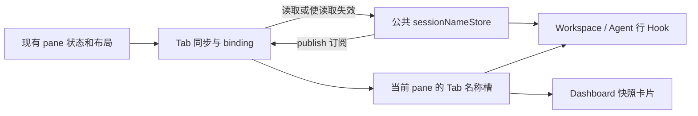
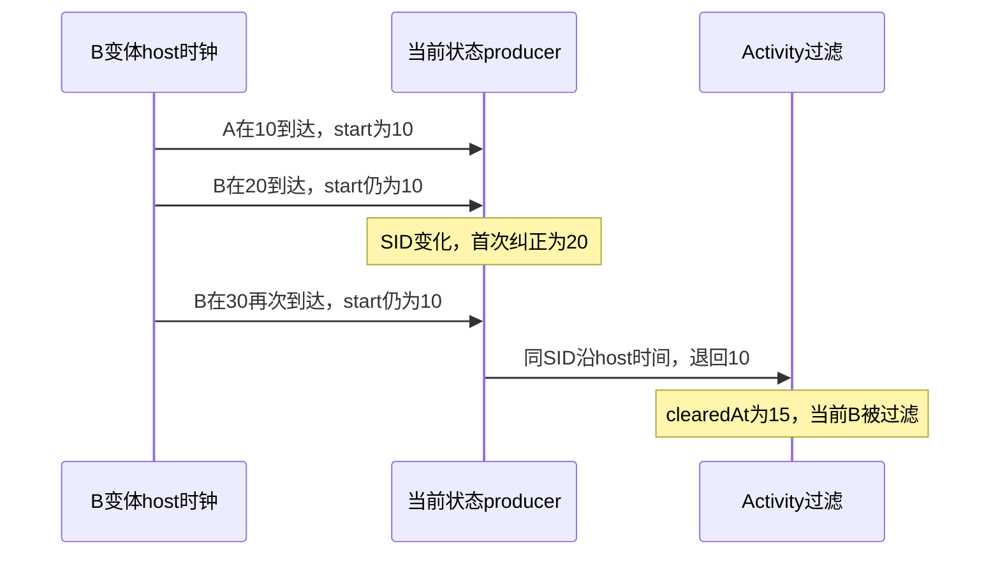

# 会话命名接缝逐文件评审

| 项目 | 内容 |
| --- | --- |
| 对象与目的 | 回应 Claude 对 §4.1/§4.2 的评审第 4 节；逐文件衡量核心能力与上游差异，验证 B/D 原提案 |
| In scope | 69 个上游已有产品文件的保留/缩小/撤回表，A 范围选项，B/F 与 D 加载时变体反例 |
| Out of scope | 产品删除/修改、提交、合入、打包、启动 App、完整精简版交付 |
| 产品快照 | `754c1efff6dd9e8d9917b99585ea129d800712d9` → `d34fa3697b393e252c0b88bb4fa4f973c58b2960` |

## 1. 结论先行

1. 接受 Claude 要求把文件数落到逐文件表，并把 **A“通知不显示会话名”作为范围选项**。原完整需求明确列过通知；它不在用户最近指定的首验核心入口内，不等于已经获得移除授权。
2. **B 原撤回清单有两项核心失败**：Provider-only 改名被 Activity projection 缓存吞掉；撤 host 新 SID 重置后，同版本 B 的重复帧把当前时钟退回 A，清除线之后的 B 消失。不能只保留 renderer 首帧重置就撤掉 main。
3. **D 原提案不是只放弃 ABA。**原 38 例中 22 通过、16 失败：核心 5、边界 10、退出实现合同 1。另一个普通 A→B 探针证实旧 A 成功响应会写回，随后 reconcile 纠正；没有把 store 写入说成已看到屏幕闪烁。
4. 本文提出的修正方向是 **42 保留、9 缩小、18 有条件撤回**；18 = A 通知 7 + B 历史/消费者 7 + E History 边界 4。全部条件成立才对应 69→51；保留通知则 58；再保留 E 则 62。**这些是可审计目标数，不是已通过验证的精简版。**
5. C 的 parser 原位保留可减少删除块，但不减少接缝文件数；直接恢复旧英语 TERSE 不是纯搬家，会改变中文短回复过滤。新增 metadata 副本可复用上游，不把自有文件删行当作上游接缝减少。

最新代码级复核见 §2.3：上述数量仍是条件式候选，不是删减指标。维护负担集中在事件准入、解析缓存和 Tab/公共缓存生命周期；另确认 Dashboard 卡片缺少非活动会话的公共名称候选，不能把“保留”标记读成已经完整验收。

2026-09-11 后续实施：用户改选“完全保留功能的等价整理”。worker 副本和重复打包排除已去重，原位状态搬回未实施，A/B/D/E 不执行删减；§2.3 中的重复实现描述是改前快照，结果见[等价去重回归](../tests/runs/2026-09-11-等价去重回归.md)。本轮没有修复 Dashboard 缺口。

## 2. 计数、快照与比较口径

固定命名 diff 中 98 个产品文件，按 `git cat-file -e <upstream>:<file>` 分类为 69 个上游已有文件、29 个上游不存在的文件。上一轮 §4.1 的 origin/main 为 `34790ce0843affb73bb6340c9189b5b77e04a06b`；本次观察值为 `2bf298d1dc1a41c03a270e89eca08834c36f13e0`。两个冻结 ref 的 69 项集合相同。

当前与 HEAD 的上游 merge-base 仍为 `aac38d698ff75ac4c8658addab48ef5a83617619`；到本次上游共 8 个提交，涉及这 69 个文件的交集为 0。这里说的是未来维护面，**没有在本轮发现或制造合并冲突**。未 fetch、merge 或移动分支。

三个不能混用的口径：

- “撤回”只指撤掉相对 754c1efff 的本轮命名 hunk，不是拿 origin/main 整文件覆盖。该文件可能保留更早的 fork 改动。
- “缩小”仍占一个接缝文件，不能在 69 中减一。C parser、D sync 即属于此类。
- 第 38 项 AiVaultVirtualRow 本轮只有注释归属改写，没有新增行为；29 个自有文件虽无同路径上游删除块，仍有 import/API 的语义兼容成本，不应称为绝无维护风险。

| 原职责分组 | 上游已有文件 | 本次 diff 新增/删除行 |
| --- | ---: | ---: |
| 身份准入与活动记录 | 9 | +95/-40 |
| Provider 文件读取与缓存证据 | 16 | +259/-98 |
| 显示排序及跨层字段接入 | 15 | +166/-92 |
| 公共名称与 Tab 读取投影 | 5 | +192/-119 |
| Activity 与历史身份时钟 | 10 | +69/-49 |
| 通知身份与名称快照 | 7 | +74/-23 |
| History 消费接入 | 6 | +33/-17 |
| 分屏选择附带修复 | 1 | +7/-0 |
| 合计 | 69 | 文件分组互斥，但功能依赖不互斥 |

Activity 的历史发布与相等判断另有两个文件被原统计分到“显示排序”，所以 B 实际涉及 12 个上游已有文件。按本文保留 host 时钟和 slot projection、缩小 context/display/entry 的方向，B 是有条件撤 7 项，不是把“10→2”直接作为减量。

### 2.1 安装后复核：当前版本与最新 main 的冲突面

2026-09-10 按用户“再回头看看”的要求重新 fetch 上游，冻结当前 `HEAD=4f8b0d75d26f6f9c2d373eeb8aab1bafbdcce544`、`origin/main=e74c22a0e770eb844995f32645b031f9a27b63e8`。这里的 main 指最新上游 remote-tracking ref，不是较旧的本地 main；本轮没有把它实际合入。

**判断：长期维护面中等偏大，当前文本合并成本低。**69 个上游已有产品文件仍有本轮命名差异，但大多数是小改；复杂度集中在已有同步/解析流程，不是 69 个独立的大改写。

| 核对项 | 当前结果 |
| --- | --- |
| `git merge-tree --write-tree --name-only HEAD origin/main` | exit 0，0 个文本冲突；只生成合并树，不修改工作区、索引或分支 |
| merge-base 之后上游变更 | 9 个提交，与 69 个命名产品接缝的文件交集为 0 |
| 整个 fork 的同文件交集 | 仅 English locale catalog，模拟也自动合并；不属于本轮命名产品接缝 |
| 相对最新集成 `831bde8f7` 的命名产品差异 | 97 文件：69 个上游已有、28 个 fork 自有；未把 Goal/Issues/Artifact 的全部既有差异算入命名 |
| 69 个接缝的修改行数（新增+删除） | 35 个 ≤10 行；20 个 11～30 行；12 个 31～60 行；2 个 >60 行；合计 +896/-406 |
| 最大两处 | Tab title sync +110/-89；Codex parser +43/-61 |

与上文历史口径 98/29 的差别来自比较基线改变：旧 Claude intrusion 模块在当前分支和最新集成两边都已不存在，不再构成两者差异；不是本轮执行了删减。此前清单中的产品源码在 `d34fa3697→4f8b0d75d` 未改变。

回读确认：`startAiVaultTabTitleSync` 的差异涉及绑定观察、异步回包准入、共享缓存即时发布和回退投影，不只是加一个字段；Codex parser 同时改变 name reader 契约、finalize 证据处理，并把状态构造移出原文件。即使 Git 自动合并，这两处在上游调整相同流程时仍需要语义回归。其余显著语义接点还包括共享标题排序、远端 Hook 准入和当前状态时钟；小 hunk 不等于无行为耦合。

验证边界：模拟的是已提交 HEAD，未提交的需求拆分文档/配置不在树中；产品工作区 diff 为空。没有对模拟合并树运行类型检查、测试或 App，0 文本冲突不等于合并后功能验收通过，也不能预测未来 main 的修改。原始数值见 [main 冲突面快照](../../../../.docs/session-name-merge-ui-validation/2026-09-10/evidence/main-conflict-surface-4f8b0d75d.json)。

### 2.2 整个 feat/claude-owner-window 需求的口径

用户进一步明确询问整个分支，而非只报产品接缝。本节覆盖 `831bde8f7→4f8b0d75d` 全部分支差异，排除集成基线早已包含的其他 fork 功能；同时单列当前未提交的需求归属拆分。

| 已提交差异类别 | 全部文件 | 上游已有文件 | 其中本需求新增的上游修改面 |
| --- | ---: | ---: | ---: |
| 产品代码 | 97 | 69 | 55 |
| 测试及夹具 | 56 | 12 | 9 |
| 文档 | 21 | 0 | 0 |
| 构建/功能登记配置 | 4 | 2 | 1 |
| 合计 | 178 | 83 | 65 |

“新增上游修改面”指该文件在集成 `831bde8f7` 相对共同上游基线仍未修改，而本需求改变了它；不是仓库新增文件。69 个产品接缝中，14 个原本已被 fork 修改，55 个是本需求新增加的维护点。全分支 83 个上游已有文件中，18 个延续原有 fork 差异、65 个新增修改面。

全部差异为 +10130/-658，其中产品代码 +2354/-526；新增行约 71% 来自测试与文档，不能把总新增行当作一万行产品重写。两个上游配置修改分别是打包忽略规则 +2 行和 CLI 编译清单 +1 行；大块功能登记增量在 fork 自有配置内，不直接制造同路径的上游冲突。

当前未提交拆分也纳入时，总计 184 文件、84 个上游已有文件；额外的上游文件仅 `.gitignore`，产品代码仍是相同的 97/69。文件数是本次写入前的冻结快照，未提交文档继续编辑不等于产品范围变化。

**整体判断：这是中等偏大的横向改造，不是分支名暗示的单点 Claude 活跃窗口修补。**它同时覆盖 Claude/Codex 身份准入、Provider 解析、公共名称缓存与投影、Workspace/Dashboard/Activity/History/通知、恢复字段及本地/远端链路。55 个新增产品接缝使后续同步上游时的语义回归范围明显扩大；仅指出两个大 hunk，不能概括整个需求的维护负担。另一方面，当前冻结 HEAD 与最新 main 的文本合并模拟仍为 0 冲突，说明眼下无需解决大面积 Git 冲突，不证明未来维护无成本或模拟树功能已通过。

原始分类与未提交差异统计见 [整个分支冲突面快照](../../../../.docs/session-name-merge-ui-validation/2026-09-10/evidence/whole-owner-window-conflict-scope.json)。本轮仅补齐审查口径，没有收敛产品代码。

### 2.3 结合逐文件表的代码级复核

本节继续使用 §2.2 的三个冻结 SHA，检查完整相关函数、调用方和公共模块，不以文件数替代语义审查。产品源码未改；本节补充候选的维护权重与证据，不把任何范围选项变成删除授权。

#### 2.3.1 真正的上游维护热点

| 部位 | 当前代码事实 | 对同步 main 的意义 |
| --- | --- | --- |
| Claude/Codex 准入 | shared listener 在 Provider 事件归一化之前拒绝异会话；Claude 不仅拦 SessionStart，也拦该身份的后续事件。remote ingest 另有旧 relay prompt 修正和准入 | 这是新增事件路由策略，不是只保护标题。上游改会话替换、子任务清理、事件来源或重放时，需要语义核对 |
| Provider 读取 | Codex finalize 和 warm cache 均读 index；保留旧 title 的同时独立计算 providerName。共享 parse cache 仅在已知尺寸严格增长时增量读取 | 不只是字段透传；同长度/非增长重写修复有依据，但增量选择影响全部 resumable provider，并非仅 Claude/Codex 命名 |
| Tab 与公共 store | Tab sync 保留自己的定时 reconcile、绑定观察和回包准入；公共 store 同时管理 watcher、TTL、inFlight 和发布。绑定变化还会使公共读取失效 | 最大负担是两层生命周期相互影响。自有 store 没有同路径文本冲突，也仍依赖上游的 Tab、pane、host 生命周期 |
| Activity | 新入口组装历史/当前身份并独立订阅名称；旧 getActivityThreadTaskTitle 已无产品调用者，仅测试仍使用 | 上游改旧入口不会自动进入当前产品路径。B 的流程收敛有真实维护意义，但现有反例确认的当前名称/时钟保护不能一起撤 |
| 通知 | dispatch 增加事件身份捕获、冷缓存取名及最长 1.5 秒等待，普通 Hook/direct SSH/paired 都须传身份 | A 的收益是移除一段异步生命周期，不仅是减七个文件；代价仍是明确取消通知会话名 |

三个 PTY 环境入口则是另一类：它们把同一个清理函数接入上游已有的初始/最终环境清理阶段，没有另建启动链。多数 list/worker/RPC/schema 字段接入也沿既有通道工作。把这些薄接入和上表流程修改等权计数，会误判收敛收益。

Claude 的 30 秒窗口是活动启发式，不是真实进程所有权证明；长静默后异会话可能获准。这是已选策略的边界，不是本次发现的新故障，也不能凭本轮测试宣称 subagent 在所有情况下绝不影响身份。

#### 2.3.2 C 和 E 的维护收益需要分开判断

**C 的确定性重复与状态搬家不是同一问题。**自有 codex-session-metadata 复制了上游 isCodexWorkerSession，parser 改走副本，上游 helper 已无生产调用者。以后 main 修正 worker 识别，本分支可能自动合并成功却继续使用旧规则。这一维护风险由调用关系直接支撑；当前未发现两个实现的结果已经不同。

worker helper 的复用与 metadata title 的精确 field 无依赖关系：前者不需要牺牲后者的来源精度。原文把整个 metadata 收缩和粗粒度 session_meta 来源放在一起，容易把两个独立事项误解成同一取舍。parser 状态搬回只缩小删除块，仍受 300 行门禁约束，收益不能与消除重复判定等同。

**E 的四项也不等重。**第 39/40 项接续标题、删除确认只增加 import 并替换一个显示取值，没有新订阅、状态或身份协议；删除目标没有变化。撤它们会恢复“列表是新名字、接续/确认是 scanner 旧名字”的差异，维护收益很小。它们不是优先减量项；第 8/37 项子日志/sidecar 是另外的范围取舍。原表的条件式 69→51 不能用作必须达到的数字目标。

另有一个不在 69 个产品文件内的小冗余：electron-builder 的 files 列表在第 179/192 行重复排除同一 `.docs` 路径；本需求新增的是前一处。它不改变命名流程，不能与真正的异步/身份成本等量计算。本轮未删除。

#### 2.3.3 “同一排序”不等于“候选和生命周期已经统一”

当前关系如下；边分别对应实际调用或订阅：

Tab sync 的 20 秒/5 分钟刷新策略与公共 store 的 watcher/TTL 并存，这是已确认的策略分布；公共 store 通过 host/agent/SID 的 inFlight 和 lastReads 合并请求，现有定向测试也覆盖重叠消费者去重。**没有证据把这描述成每轮两次网络读取或已出现请求风暴。**

确认的缺口在最后一个消费分支：useAgentRowConversationName 为自己的 SID 读取公共记录；rowConversationName 只从 row.tab.aiVaultTitle 取槽，并在槽属于兄弟 pane 时将其排除。共享排序函数没有收到 B 的 Provider 候选，无法把它排到第一。

最小探针构造活动 A、Tab 槽=A、同 Tab 非活动 B；真实行 Hook/store 已从 mock API 取得 B 原生名后，真实卡片函数仍返回 B 的实时标题：

| 入口 | 实际结果 |
| --- | --- |
| useAgentRowConversationName(B) | Provider B |
| rowConversationName(B) | Live task B |

buildDashboardSnapshot 的该字段同时供窗口内仪表盘和独立窗口使用。该链路归属由源码确认；本次没有挂载完整仪表盘或启动 App，所以不称为真实 UI 复现，也不推翻用户已确认正常的顶部/普通单会话路径。

对第 33/34 项的修正是：**防止借兄弟名成立，完整候选一致性尚不成立。**相对集成基线，旧行 Hook 也没有独立 Provider 读取；这是本需求新增能力漏接一个消费分支，不是证实上游原有能力被破坏。

#### 2.3.4 本次验证与结论边界

- 当前身份链 5 文件 35/35、Provider 文件链 2 文件 10/10、公共 store/Tab/绑定链 4 文件 46/46，共 11 文件 91 个现有测试通过；不与旧 B/D 集合累计成独立覆盖数。
- Dashboard 对照探针 1/1 通过，断言目标是“上述差异存在”，因此不是名称一致性功能 PASS。
- 当前源码 diff 为空；未删减、提交、合入或操作 App。本轮未跑全量类型检查、精简版、真实 SSH/Windows/Provider 或系统通知。
- 当前 main 的 0 文本冲突仍只适用于冻结提交的模拟结果。整个需求的长期维护面中等偏大，主要由少数深流程接点和广泛消费者组成；不是 69 处等量重写，也不是把代码放到自有目录就没有后续成本。

精确命令和探针边界见 [代码级复核验证记录](../../../../.docs/session-name-merge-ui-validation/2026-09-10/evidence/whole-feature-semantic-review.md)。

## 3. A/B/C/D 的用户取舍

| 选项 | 用户损失一句话 | 评审结论 / 接缝收益 |
| --- | --- | --- |
| A1：通知整组回到上游行为 | 通知保留工作区、Agent 状态和正文，但不再展示会话名 | **提交给用户选择，建议作为减范围选项。**不影响最近先验的 Top/左侧/Dashboard 名称链；减少本轮 7 个上游接缝和约 110 行自有通知捕获模块，普通 store 的 pending request 不能整文件删除 |
| A0：通知继续显示会话名 | 无新增产品损失；继续维护通知身份、冷读与统一排序 | 保留这 7 项；不能一面保留“带会话名”要求，一面把冷缓存通知的永久备用名当作无损 |
| B：Activity 最小取名接入 | 历史 A 不再精确恢复自己的名字，甚至会借当前 B 的容器名；退出 pane 不再独立追读原生名 | 接受缩小方向，**不接受原整撤清单**；至少保留 slot projection 失效和 host 新 SID 时间隔离；有条件减少 7 项 |
| C：撤搬家式抽取 | parser 类型/构造原位保留本身无功能损失；恢复旧 TERSE 则会放行中文“继续” | parser 方向成立，实施仍需通过现有 300 行门禁，不能增阈值；旧过滤直接恢复不采用。主要缩小 hunk，不减文件数 |
| D：binding 去代次增强 | 同 SID 重建或极短 ABA 可复用较旧名字，直至正常缓存刷新；库存暂失的保留策略还需明确 | 接受局部瘦身，**不接受 active+100 与仅有 eligible tab request 就写回**；保留当前 pane/已移除 leaf 排除、回包 host/agent/SID 比较。不承诺减少接缝文件数 |

A 是产品范围选择，不是用“没有名字不算不一致”自动宣告原 REQ-025 已满足。用户确认 A1 后，才更新需求、registry、policy、测试范围；本轮均不改。

E 的四个候选为子日志名称、接续标题、删除确认文案、Claude 子日志 sidecar 证据。若接受这些位置继续显示 scanner title，可少 4 项；列表行/搜索仍保留公共名称。F 的无槽恢复不再找历史最早 prompt，但首次绑定有有效 prompt 以及“继续”后再输入有效任务的投影已通过本轮探针。

关于 metadata：`field` 不参与显示优先级，但参与 named 证据校验与 equality，不能直接删字段。复用上游 string reader 后使用诚实的粗粒度 `session_meta` 来源常量是可评估收缩，损失是无法再区分 title/thread_name/threadName 的精确出处；本轮未实施/测试 C，不把它写成已等价通过。

§2.3 进一步区分：上述精度取舍仅涉及 title reader，不是复用上游 worker 判断的前提；接续/删除确认两项极薄的 E 接缝也不与子日志范围等权处理。

## 4. B/F 与 D 变体执行结果

所有变体只在 Vitest 加载模块时覆盖内容；`src/` 文件只读。B 用基线正文加指定最小接入，D 用精确 transform；移除的 helper 被导入会报错，没有空函数 stub。全部测试设置 `ORCA_BACKGROUND_LAUNCH=1`，没有运行 App 或真实 Provider。

### 4.1 B/F：原 12、退出接口与新入口分开计算

| 集合 | 当前代码 baseline | B/F | 口径 |
| --- | --- | --- | --- |
| 原始 12：公共刷新/时钟 3、分屏 4、Activity 历史 5 | 12/12 | 7 有效执行并通过；历史 5 所在 suite 因退出 helper 无法收集 | 不能写成 B 12/12，也不能把未收集的 5 个说成产品断言失败 |
| 原历史 5 例换到真实 paneTitleForEntry 入口，保留旧预期 | 5/5 | 0/5，全部失败 | 4 例历史/时间差异，1 例退出字段合同；下表逐条拆解 |
| 额外薄探针 7 | 7/7 | 3 通过、4 失败 | 核心 2、恢复首 prompt 边界 1、旧 host 重复时钟边界 1 |

B 的新 SID 重置按 `identityChanged ? updatedAt : hostTiming ?? 原逻辑` 解释，保留封存历史、当前时钟首帧重置和不继承 terminalTitle。它不依赖 history.sessionName，也没有暗中恢复重复帧纠偏。

适配原历史五例：

| 用例 | 实际差异 | 分类 |
| --- | --- | --- |
| `equivalent history: B='working', hostStart=undefined` | A 的历史 SID/agent 变成 B/codex，A 的实时名丢失，旧事件主名借 B 原生名；当前 B 和时钟仍正确 | 历史边界；实际损失不只是“不追溯改名” |
| `equivalent history: B='done', hostStart=undefined` | 身份数组从 [A,B] 变 [B,B]；当前/重复 B 时钟仍 20 | 历史边界 |
| `equivalent history: B='done', hostStart=10` | 历史借 B；首帧 B=20，重复帧降回 10 | 历史边界 + 旧输入时钟边界；同版本是否也出错另用真实 host 方法确认 |
| `equivalent history: B='done', hostStart=19` | 历史借 B；首帧从准确 host 19 改到 renderer 20，重复帧按 host 19 | 历史/精确时间边界；是本轮首帧重置优先解释的损失 |
| `exited history-field contract: paired equality and projection notice identity-only corrections` | equality 和 publication 不再响应 history.sessionName-only 变化 | 退出字段合同，不算额外独立产品缺陷 |

额外 7 例中失败的 4 例：

| 用例 | 实际结果 | 分类 |
| --- | --- | --- |
| `same mounted projection publishes a Provider-only rename into the real Activity row` | projection 复用旧对象，thread row 仍“原生名”，不是“新的原生名” | **核心**，普通当前会话改名不更新；第 29 项保留 |
| `same-version real host timing into renderer: A to B plus repeated B remains visible` | host 输出 10/10/10，renderer 为 10/20/10；clearedAt=15 后 B 消失 | **核心**，撤 main 重置导致，不是只有旧 host；第 2 项不能撤 |
| `F restart-after-history without stored slot projects a stable prompt` | 从最初任务“修复首次登录错误”变为当前“现在补充测试用例” | **恢复边界**，仍有有效名字；仅模拟恢复数据，未真实重启 App |
| `old host repeated A clock: first B resets and repeated same-SID B stays visible` | 首 B=20，重复 B=10，清除线后为空 | **混合版本已知退化**；不计核心同版本问题，但也不宣称 SSH/旧 host 兼容已通过 |

通过的 3 例：正常 Provider 槽经过 projector/context/events/thread row 且不同 SID 不借名；首次无槽投影当前有效 prompt；B 首句“继续”不投影 A 的历史，下一有效 prompt 在原有 20 秒 refresh 路径取得自己的名字。最后一例不证明真实 Hook 即时延迟。B 恢复旧英语 TERSE 使 Activity 无其他候选时可能显示中文“继续”，这是源码推断，未加测；F 的 Tab probe 通过不能覆盖这个入口差异。

当前时钟的失败链（真实 host 方法 + renderer producer，未跑真实传输）：

### 4.2 D：原 38 例失败逐条归类

基线 38/38；D 22 通过 / 16 失败。主流程发现首版模拟的 currentByTabId 错取 stored tabs，已要求改回 754 原写法的当前 `collectAiVaultTitleRequests` map，并重跑 D 38 例与 A→B 探针；**最终仍为同一 16 个失败**。所以以下不是用过度放宽的假 D 得出的结果。

D 的显式最小适配：slot 没有 host，只能比较 subscriber 相邻 previous/current 的 workspace host；去 request.paneKey 后，prompt 投影按当前 tab/agent/SID 查 entry、优先 active，不恢复 revision。无 request 直接清槽导致两个库存暂失用例失败，这两个结果依赖该已声明取舍，不代表所有可能的瘦身实现都必失败。Gate 的去 invalidate 覆盖已定义，但这组直接启动 sync，不挂 Gate；不把它算成实际入口覆盖。

| 编号 | 完整失败用例名 | 分类 | 首个失败 / 因果 |
| --- | --- | --- | --- |
| D01 | `session name binding lifetime does not borrow an inactive agent when the selected leaf is an unnamed shell` | 核心 | 预期无 request，实际选 inactive A；active+100 不限制资格 |
| D02 | `session name binding replacement boundaries rejects an in-flight response after host changes with the same session id` | 核心 | 旧 host 成功结果写回；eligible request 存在不等于 host 相同 |
| D03 | `session name binding replacement boundaries rejects and clears a removed leaf even if activeLeafId is temporarily stale` | 核心 | root 已移除 leaf，仍返回旧 A request；后续 slot 断言未执行 |
| D04 | `new split PTY registration and session-name ownership publishes the selected empty leaf when its local-child-pty arrives, without an extra click` | 核心 | active/PTY 已正确，槽仍是 inactive A 名；不是分屏初始化补丁失效 |
| D05 | `new split PTY registration and session-name ownership publishes the selected empty leaf when its remote:ssh-host@@child-pty arrives, without an extra click` | 核心 | 同一退化的远端 PTY 夹具；非真实 SSH |
| D06 | `session name binding lifetime observes leaf-pty replacement even when the provider id stays equal` | 边界 | 删除同 SID PTY 变化检测，inputsChanged 为 false |
| D07 | `session name binding lifetime observes generation replacement even when the provider id stays equal` | 边界 | 删除 generation 比较，inputsChanged 为 false |
| D08 | `session name binding lifetime rejects the first A response after an observed A to B to A round trip` | 边界 | 删除 revision 后接受极短 ABA 的旧 A 响应 |
| D09 | `session name binding replacement boundaries does not launder an old A response through the shared cache after A to B to A` | 边界 | 返回 Old A read 而非 Current A read，旧成功读取进入缓存并影响重读 |
| D10 | `session name binding replacement boundaries rejects an in-flight response after leaf-pty changes with the same session id` | 边界 | 未触发第二次 resolve；后续“不写旧名”断言未执行 |
| D11 | `session name binding replacement boundaries rejects an in-flight response after generation changes with the same session id` | 边界 | 同 SID generation 变化未触发第二次 resolve |
| D12 | `session name binding replacement boundaries does not choose an arbitrary pane when a split has no selected leaf` | 边界 | 无 active 的中间态仍选 A |
| D13 | `session name binding replacement boundaries retains a known name when inventory becomes unavailable without replacement evidence` | 边界 / 适配取舍 | 无 request 即清槽，Known name 变 undefined；不是已证实进程退出 |
| D14 | `session name binding replacement boundaries remembers ownership across missing inventory until a later explicit pane replacement` | 边界 / 适配取舍 | 第一处库存缺失保持名字已失败，后续明确替换断言未执行 |
| D15 | `keeps the cold event read separate from live binding invalidation (ABA=true)` | 边界 | live 复用旧 event 的 inFlight，未达到 Current A name；不能说通知实际发错 |
| D16 | `session name binding lifetime captures the owning leaf PTY instead of the tab primary PTY` | 退出实现合同 | D 已删 request.ptyId，直接字段断言失败；本身不证明显示退化 |

其中核心 5、边界 10、退出合同 1。另一个不在 38 分母中的用例：

`ordinary A to B rejects the completed old A read while the current B read is pending`：baseline 通过，D 失败。B 已准入 → 旧 A 成功响应写成 sessionId=A → 下一次 reconcile 恢复 B → 最终取得 Fresh B response。它是普通跨 SID 写回退化，不是 ABA。轨迹没有证明实际绘制错误名或持续多久。

“读取失败保留已确认名”与 D09 不是一回事：D09 接受的是旧**成功**读，并非 unavailable；named 普通重读 TTL 为 5 分钟，去 invalidate 后会影响当前重读。本例也**没有**证明旧结果覆盖了已经成功取得的更新 native 名，不能夸大为另一个未执行的时间线。

## 5. 证据边界与尚未放行项

- B/F 与 D 原案的反例已实际执行；“B 修正版 / D 修正版”是本文逐文件审查落点，尚未组成新实施版并重跑，不能写成缩减完成。
- B 原 history suite 的接口退出与 5 个适配断言分别记账；所有集合有重叠，不把 12+5+7+38 汇总为独立覆盖数。
- B probe 最终有效文件为 `*-probes-v3.json`；早期 import/路径草稿和 baseline 也失败的 `*-probes-final.json` 不纳入结果。D 首次 include 误合扩扫已停止，最终使用 4 个显式文件；修正 currentByTabId 后的同名 JSON 为最终结果。
- 测试只加载模块，不证明全仓物理删文件后的编译、旧端合同、真实 App/Provider/SSH、系统通知或安装包。没有改产品文件、registry、policy，没有提交、合入、用户数据删除。
- 本报告的逐文件集合和计数由审计脚本核对；Markdown/fork-docs/diff 检查只证明交付物一致，不能替代产品测试。

## 6. 关键文件索引

以下为 69 个上游接缝的完整逐文件表。

**表中“撤回”带条件，不是执行许可。**A 待用户选择；E 是可选范围；B/F 必须保留本报告确认的当前会话保护，D 只缩代次不撤基本资格。保留 42 + 缩小 9 + 有条件撤回 18 = 69。A0 保留通知时，改为保留 49 + 缩小 9 + 撤回 11；A0 且 E 保留时为保留 53 + 缩小 9 + 撤回 7。

| 序号 | 文件 | 建议 | 条件 | 逐文件边界及依据 |
| --- | --- | --- | --- | --- |
| 1 | `src/main/agent-hooks/server/server-ingest-remote.ts` | 保留 | 核心/新增准入 | 远端 envelope 复核 Claude 在位窗口和 Codex 内部任务，防旧 relay 旁路；归一化提前及旧 prompt 修正改变现有事件流程。 |
| 2 | `src/main/agent-hooks/server/server-status-application.ts` | 缩小 | B 修正版 | 保留 host 新 SID 的 stateStartedAt 重置；仅解除 history 模块依赖，不能按原 B 整撤。 |
| 3 | `src/main/agent-hooks/server/server-status-update.ts` | 保留 | 核心/既有语义 | 只在接受状态后 recordClaudeSessionActivity，主身份窗口需要该时钟。 |
| 4 | `src/main/ai-vault/remote-session-scanner-codex-index.ts` | 保留 | 核心/既有语义 | 远端 index 拒绝/不可读保留 unavailable，不能折叠成没有原生名。 |
| 5 | `src/main/ai-vault/session-list-result-validation.ts` | 保留 | 核心/既有语义 | list 校验保留 providerName/generatedTitle 可选字段，避免 paired 扫描丢证据。 |
| 6 | `src/main/ai-vault/session-parse-cache-persistence.ts` | 保留 | 核心/既有语义 | parse cache 版本 2→3，避免旧混合 title 缓存被当作原生名。 |
| 7 | `src/main/ai-vault/session-scanner-accumulator.ts` | 保留 | 核心/既有语义 | finalizeSession 发布原生证据与派生候选，保持旧 title 兼容。 |
| 8 | `src/main/ai-vault/session-scanner-claude-subagents.ts` | 撤回 | E 可选 | 撤 child sidecar 的 providerName 覆盖，子日志沿既有 description/title；不撤主会话解析。 |
| 9 | `src/main/ai-vault/session-scanner-codex-cached-title.ts` | 保留 | 核心/既有语义 | 未变 transcript 也重读 index 名；读取失败保留已确认原生名。 |
| 10 | `src/main/ai-vault/session-scanner-codex-message-records.ts` | 保留 | 核心/既有语义 | 三种 Codex 消息格式按首个有效 prompt 种下 generatedTitle。 |
| 11 | `src/main/ai-vault/session-scanner-codex-parser.ts` | 缩小 | C | 把 CodexSessionParseState/create/clone 留回 parser 原位；保留原生证据和首 prompt 增量，实施仍需过 300 行门禁。 |
| 12 | `src/main/ai-vault/session-scanner-codex-title-index.ts` | 保留 | 核心/既有语义 | 复用 index 缓存分清 named/absent/unavailable；保留旧字符串 reader 薄包装。 |
| 13 | `src/main/ai-vault/session-scanner-parse-cache.ts` | 保留 | 核心/共享解析语义 | 同长度重写不能从旧 EOF resume，否则 Provider 改名漏读；新准入条件影响全部 resumable provider，见 §2.3。 |
| 14 | `src/main/ai-vault/session-scanner-primary-parsers.ts` | 保留 | 核心/既有语义 | Claude custom-title/ai-title/agent-name 与首 prompt 分开，Provider 优先的来源依据。 |
| 15 | `src/main/ai-vault/session-scanner-types.ts` | 保留 | 核心/既有语义 | SessionAccumulator 两个可选字段承载独立证据，非新持久系统。 |
| 16 | `src/main/ai-vault/session-scanner-worker-entry.ts` | 保留 | 核心/既有语义 | worker 的 titleIndex 透传 providerName/generatedTitle，避免后台读取丢字段。 |
| 17 | `src/main/ai-vault/session-title-file-reader.ts` | 保留 | 核心/既有语义 | 精确文件读取带证据；失败按请求返回 unavailable，不误清名。 |
| 18 | `src/main/ai-vault/session-title-resolver.ts` | 保留 | 核心/既有语义 | 扫描回补整份命名候选而非只回 title，合并请求自己的 nameEvidence。 |
| 19 | `src/main/ai-vault/session-title-result-validation.ts` | 保留 | 核心/既有语义 | RPC 结果验证保留有界证据数组及来源，兼容独立升级 host。 |
| 20 | `src/main/codex/codex-hook-script.ts` | 保留 | 核心/既有语义 | managed Hook 在 stdin capture 后接嵌套调用守卫，避免副调用污染 pane。 |
| 21 | `src/main/daemon/pty-subprocess/spawn-environment.ts` | 保留 | 核心/既有语义 | daemon 新建/再次覆盖环境都清继承 CODEX_THREAD_ID，正常新会话不被误拦。 |
| 22 | `src/main/ipc/notification-options.ts` | 撤回 | A 待选 | 取消 formatNotificationSessionContext，通知回到工作区/Agent 状态文案，不再显示会话名。 |
| 23 | `src/main/providers/local-pty-spawn-environment.ts` | 保留 | 核心/既有语义 | local PTY 初始/最终环境清调用者身份，保留其他环境和跨平台路径。 |
| 24 | `src/relay/agent-hook-server.ts` | 保留 | 核心/既有语义 | relay 接受实时 Hook 后记录窗口，重放不续期。 |
| 25 | `src/relay/pty-handler.ts` | 保留 | 核心/既有语义 | SSH host 新 PTY 最终环境清继承调用者身份，避免跨主机假设。 |
| 26 | `src/renderer/src/components/AiVaultTabTitleSyncGate.tsx` | 缩小 | D 修正版 | 保留公共 store 读取、订阅和即时投影；代次失效接线可拆，不回到私有读取。 |
| 27 | `src/renderer/src/components/activity/activity-event-builder-context.ts` | 缩小 | B | 保留 aiVaultTitle/generatedTitle 和原始 label 透传；无新 resolver 后撤多余 export。 |
| 28 | `src/renderer/src/components/activity/activity-pane-events.ts` | 撤回 | B/F 条件 | 回到基线历史快照，无历史 SID 精确命名；必须明确旧事件可能借用当前容器名。 |
| 29 | `src/renderer/src/components/activity/activity-tab-projection.ts` | 保留 | B 修正版 | 两行 slot 相等性保证仅 Provider 改名也重建 Activity 投影，不能整撤。 |
| 30 | `src/renderer/src/components/activity/activity-thread-builder.ts` | 撤回 | B 条件 | 撤 resolveSessionTitle 注入，使用既有 paneTitleForEntry/Event；新入口 Provider 前置与基本回退先验证。 |
| 31 | `src/renderer/src/components/activity/activity-thread-presentation.ts` | 撤回 | B 条件 | 撤 getActivitySessionName 调用，回既有 getActivityThreadTaskTitle；其前置匹配在 48 保留。 |
| 32 | `src/renderer/src/components/activity/use-agent-pane-threads.ts` | 撤回 | B 条件 | 撤 Activity 私有订阅，当前名由 Tab 槽提供；接受非当前/退出 pane 不独立读精确名。 |
| 33 | `src/renderer/src/components/dashboard/dashboard-card-labels.ts` | 保留 | 核心/存在覆盖缺口 | 已拒绝子 Agent/兄弟 pane 的 Tab 名，但非活动会话缺独立公共名称候选；不能据此宣称与行 Hook 完全同源，见 §2.3。 |
| 34 | `src/renderer/src/components/dashboard/use-agent-row-conversation-name.ts` | 保留 | 核心/既有语义 | Workspace/Dashboard 行订阅自身 host/agent/SID 名称，不借 active sibling。 |
| 35 | `src/renderer/src/components/right-sidebar/AiVaultPanel.tsx` | 保留 | 核心/既有语义 | History 扫描结果供公共命名索引，列表/搜索仍同源。 |
| 36 | `src/renderer/src/components/right-sidebar/AiVaultSessionRow.tsx` | 保留 | 核心/既有语义 | History 行 seed/watch 并统一显示/拖拽名，独立刷新不依赖 Tab。 |
| 37 | `src/renderer/src/components/right-sidebar/AiVaultSessionSubagents.tsx` | 撤回 | E 可选 | 子日志行和 tooltip 回 session.title，不再按公共缓存追溯子名。 |
| 38 | `src/renderer/src/components/right-sidebar/AiVaultVirtualRow.tsx` | 保留 | 核心/既有语义 | 仅本轮注释归属纠正；getCanonicalTitle 接线在基线已存在，不把它计成新增语义。 |
| 39 | `src/renderer/src/components/right-sidebar/ai-vault-session-continuation.ts` | 撤回 | E 可选 | 接续 sourceTitle 回 scanner title；会话路径/接续身份逻辑不变。 |
| 40 | `src/renderer/src/components/right-sidebar/ai-vault-session-delete-action.ts` | 撤回 | E 可选 | 删除确认文案回 scanner title；不修改删除目标选择。 |
| 41 | `src/renderer/src/components/tab-bar/SortableTab.tsx` | 保留 | 核心/既有语义 | TabBar 最终文本/tooltip走统一排序，不再由 customTitle 覆盖 Provider。 |
| 42 | `src/renderer/src/components/tab-group/useTabGroupItemProjections.ts` | 保留 | 核心/既有语义 | group 项传 aiVaultTitle/launchAgent 给末端 TabBar，修实际漏字段。 |
| 43 | `src/renderer/src/components/terminal-pane/agent-completion-coordinator-types.ts` | 撤回 | A 待选 | 完成通知 snapshot 去 providerSession 类型扩展，状态与时间字段保持基线。 |
| 44 | `src/renderer/src/components/terminal-pane/pty-connection/direct-ssh-retry-status.ts` | 撤回 | A 待选 | 直接 SSH 通知 payload 不再补 providerSession；已有状态时间和生命周期保持。 |
| 45 | `src/renderer/src/components/terminal-pane/use-notification-dispatch.ts` | 撤回 | A 待选 | 撤会话名捕获/等名/dispatch sessionTitle，仅撤本轮通知 hunk。 |
| 46 | `src/renderer/src/components/terminal-pane/use-terminal-pane-layout-bindings.ts` | 保留 | 核心/既有语义 | 新分屏 PTY 到达同步已选 leaf；本地/远端 normal split 都依赖这 7 行。 |
| 47 | `src/renderer/src/hooks/ipc-events/agent-status-event-applicator.ts` | 撤回 | A 待选 | 完成通知 payload 不再复制 providerSession；主状态 identity 接入不动。 |
| 48 | `src/renderer/src/lib/activity-thread-display.ts` | 缩小 | B/C 修正版 | 复用原 Activity 取名入口加同身份 Provider 前置；保留低信息过滤语义，不直接恢复仅英语 TERSE。 |
| 49 | `src/renderer/src/lib/ai-vault-tab-title-batches.ts` | 保留 | 核心/既有语义 | 泛型化既有 host 分批，供公共 store 复用；不复制第二套分批器。 |
| 50 | `src/renderer/src/lib/ai-vault-tab-title-requests.ts` | 缩小 | D 修正版 | 可去 PTY/generation；保留当前 pane 选择及移除判据，不回仅 active+100 候选竞争。 |
| 51 | `src/renderer/src/lib/ai-vault-tab-title-sync-inputs.ts` | 缩小 | D 修正版 | 去同 SID 代次专用比较；保留 slot/开关/当前 pane 与布局移除相关触发。 |
| 52 | `src/renderer/src/lib/ai-vault-tab-title-sync.ts` | 缩小 | D 修正版 | 保留公共槽、publish 立即投影、fallback；可去 revision，但在途写回仍核对 host/agent/SID/当前 pane。 |
| 53 | `src/renderer/src/runtime/sync-runtime-graph/agent-status-projection.ts` | 撤回 | B 条件 | 不再发布 history.sessionName；仅影响历史身份精确追溯，需兼容回退。 |
| 54 | `src/renderer/src/runtime/web-session-tabs-sync/state-equality-core.ts` | 撤回 | B 条件 | 撤 history.sessionName 相等判断；其他 live identity 和字段比较不动。 |
| 55 | `src/renderer/src/runtime/web-session-tabs-sync/store-patch.ts` | 撤回 | A 待选 | paired 完成通知不再携带 providerSession；原 host-owned 状态同步不动。 |
| 56 | `src/renderer/src/store/slices/agent-status-live-entry-builder.ts` | 缩小 | B/F | 内联 identityChanged，保留历史封存、当前时间重置和旧实时名隔离，去历史命名快照/精确恢复。 |
| 57 | `src/renderer/src/store/slices/agent-status-pane-key-tab-binding.ts` | 保留 | 核心/既有语义 | 有效已有派生名才保护首 prompt，custom/command 标签不阻塞产生回退。 |
| 58 | `src/renderer/src/store/slices/terminal-tab-title-batch.ts` | 保留 | 核心/既有语义 | 批量 generated setter 复用质量门槛，首次有效任务写入后保持。 |
| 59 | `src/renderer/src/store/terminals/terminal-tab-presentation.ts` | 保留 | 核心/既有语义 | slot evidence 相等性、SID 换代清旧 generated 槽与首 prompt 保护。 |
| 60 | `src/shared/agent-hook-listener.ts` | 保留 | 核心/新增准入 | 当前集成基线已无旧 busy 守卫；本需求增加 Provider 归一化前的 Claude 活跃窗口/Codex 内部任务准入。 |
| 61 | `src/shared/agent-hook-listener/listener-state.ts` | 保留 | 核心/既有语义 | 窗口和内部任务集合沿 listener 原清理/移位生命周期，不建新身份库。 |
| 62 | `src/shared/agent-row-conversation-name.ts` | 保留 | 核心/既有语义 | Agent 行采用公共优先级，容器标签不广播给兄弟 pane。 |
| 63 | `src/shared/agent-status-types.ts` | 撤回 | B/F 条件 | 撤本轮可选 history.sessionName；旧数据不删除，读取兼容和首 prompt 替代需对应验收。 |
| 64 | `src/shared/agent-tab-title.ts` | 保留 | 核心/既有语义 | deriveGeneratedTabTitle 排除确认/注入提示并保持原清理和长度上限。 |
| 65 | `src/shared/ai-vault-session-title.ts` | 保留 | 核心/既有语义 | title/RPC 结果的可选来源字段；删掉会重现跨层证据丢失。 |
| 66 | `src/shared/ai-vault-types.ts` | 保留 | 核心/既有语义 | 扫描 session 的可选 Provider/generated 字段，旧 title 语义保持。 |
| 67 | `src/shared/notification-settings-types.ts` | 撤回 | A 待选 | NotificationDispatchRequest 不再生产 sessionTitle；通知无会话名为明确范围选择。 |
| 68 | `src/shared/tab-title-resolution.ts` | 保留 | 核心/既有语义 | 普通/统一 Tab 同用 Provider-first；仍保留非 Agent Tab 自定义名。 |
| 69 | `src/shared/workspace-session-schema.ts` | 保留 | 核心/既有语义 | 持久化两类 Tab 槽都使用相同可选 schema，恢复后来源不能丢。 |

### 6.1 代码级复核的补充索引

本表是 §2.3 的依赖/自有模块证据，不增加到上述 69 个修改文件中。

| 章节 | 文件 | 关键符号 / 用途 |
| --- | --- | --- |
| 2.3.1 | `src/shared/agent-hook-listener/providers/claude-events.ts` | 准入之前会阻断的上游会话替换逻辑 |
| 2.3.1 | `src/shared/claude-session-ownership/claude-session-activity.ts` | 当前 SID 的已接受活动时钟 |
| 2.3.2 | `src/main/session-names/codex-session-metadata.ts` | 当前实际调用的 worker 副本及 title field |
| 2.3.2 | `src/main/ai-vault/session-scanner-codex-session-meta.ts` | 上游原 worker/title reader |
| 2.3.2 | `src/main/session-names/codex-session-parse-state.ts` | 从 parser 搬出的状态类型与构造 |
| 2.3.2 | `config/electron-builder.config.cjs` | 重复的 `.docs` 排除项 |
| 2.3.1、2.3.3 | `src/renderer/src/session-names/session-name-store.ts` | TTL、inFlight、watch、publish、invalidate |
| 2.3.1、2.3.3 | `src/renderer/src/session-names/session-name-binding.ts` | Tab 绑定 revision 与 lastKnown |
| 2.3.1 | `src/renderer/src/session-names/session-name-read-snapshot.ts` | 事件读结果与后续实时投影分离 |
| 2.3.1 | `src/renderer/src/session-names/notification-session-name.ts` | 冷名称等待与候选冻结 |
| 2.3.1 | `src/renderer/src/session-names/use-activity-session-names.ts` | Activity 历史和当前身份订阅 |
| 2.3.1 | `src/renderer/src/session-names/activity-session-name.ts` | Activity 自己的候选组装 |
| 2.3.3 | `src/renderer/src/session-names/session-name-subscriptions.ts` | 行 Hook 的公共订阅 |
| 2.3.3 | `src/renderer/src/components/dashboard/build-dashboard-snapshot.ts` | 卡片 conversationName 调用方 |
| 2.3.3 | `src/renderer/src/components/dashboard/useLiveDashboardSnapshot.ts` | 窗口内快照入口 |
| 2.3.3 | `src/renderer/src/components/dashboard/AgentDashboardDrawer.tsx` | 窗口内仪表盘入口 |
| 2.3.3 | `src/renderer/src/components/dashboard/useDashboardPopoutBridge.ts` | 独立窗口快照发布 |

## 7. 关联文档与证据索引

- [独立需求](../requirements/会话命名与身份保护.md)、[原范围审查](会话命名改动范围审查.md)、[Journal](../journal.md)。
- [Claude 原评审稿](../../../../.docs/session-name-merge-ui-validation/2026-09-10/evidence/claude-review-of-reduction-plan.md)：只读保留，未改写其结论。
- [69 文件原始清单](../../../../.docs/session-name-merge-ui-validation/2026-09-10/evidence/upstream-name-seams.json)、[清单/文档校验脚本](../../../../.docs/session-name-merge-ui-validation/2026-09-10/scripts/audit-upstream-name-seams.mjs)：验证两个上游 ref、69 路径唯一性、表中动作合计。
- [B/F 完整执行报告](../../../../.docs/session-name-merge-ui-validation/2026-09-10/evidence/claude-b-review-results.md)：原始/适配/probe 三组命令、JSON、manifest 与覆盖源 SHA。
- [D 完整执行报告](../../../../.docs/session-name-merge-ui-validation/2026-09-10/evidence/claude-d-results.md)：16 个失败、普通 A→B 轨迹、忠实性修正、命令及覆盖文件。
- [整个需求代码级复核验证](../../../../.docs/session-name-merge-ui-validation/2026-09-10/evidence/whole-feature-semantic-review.md)、[Dashboard 双路径探针](../../../../.docs/session-name-merge-ui-validation/2026-09-10/evidence/consumer-name-paths-review-results.md)：本次当前代码定向测试，以及差异断言的证据边界。
