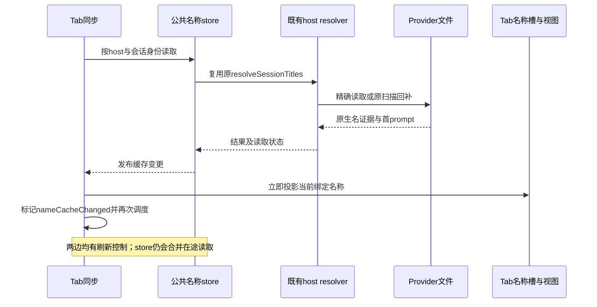

# 会话命名改动范围审查

| 项目 | 内容 |
| --- | --- |
| 调研对象 | 既有命名修复的代码差异与职责边界，机制型审查 |
| 调研目的 | 回答为何改动扩大、哪些直接对应需求、哪里存在重复和交叉依赖 |
| In scope | Hook 身份、Provider 名证据、公共读取/排序/投影、各消费者及附带修复 |
| Out of scope | 新实现方案、删除或修改产品代码、合入、打包、用户 App 和真实 Provider 测试 |
| 代码快照 | 功能工作树 `orca-claude-owner-window`；基线 `754c1efff6dd9e8d9917b99585ea129d800712d9` → `d34fa3697b393e252c0b88bb4fa4f973c58b2960`；未提交的需求拆分单独计算 |

## 1. 结论先行

1. **需求已足够明确，改动大不等于需求复杂。**三项要求是 Provider 优先及稳定回退、各入口一致、后台调用不顶替主身份。现有差异同时交付了身份修复、证据分层、公共刷新、全入口接入和分屏/历史状态修复；它不是一个局部标题补丁。
2. **有实际公共化，也有控制流程叠加。**Issues 的私有请求/map 被删掉，公共 store 复用原 resolver；但 store 与 Tab sync 同时保留刷新周期、批次和在途状态。后者是已确认的复杂度，不等于已量测到双倍文件 I/O。
3. **找到具体重复，而非按行数推测。**Codex metadata 旧文件无静态调用，新文件重复 worker 判断；两处旧 Activity 标题函数也只剩定义。公共 store、绑定和 prompt 投影的主要新增模块则有真实生产调用。
4. **顶部漏字段是局部缺口，通知和 Activity 不构成它的前提。**然而历史身份快照又被顶部首 prompt 回退使用，现有改动不能按目录整组删掉。职责可区分，不代表当前补丁已可独立撤销。
5. **重新 review 后撤回“轮询、分屏补丁可直接删”的建议，历史时钟也不能整组撤。**基线 12 个针对性用例通过；仅在测试加载时模拟删除，刷新 2 例、分屏 2 例、旧时钟输入 1 例失败。后者是候选删法的反例，不是当前产品失败或真实 App 验收。最新结论见 §4.2。

## 2. 差异口径与职责归属

固定上述两个 SHA，以 `git diff --numstat -z` 统计，避免中文路径转义导致分类错误。180 个变更文件中：98 个产品代码文件（+2353/-617），57 个测试及夹具文件（+4848/-220），21 个文档（+2335/-27），4 个配置（+593/-2）。此前“100 个产品文件”的口径混入了两个 `*-test-fixture.ts`，本次已剔除；这是统计纠正，不是代码已经缩减。

下表按每个文件的主要职责唯一归类，完整清单见过程证据；一个文件可能同时服务多条链，**数量不代表最小必要改动量或可直接删除量**。

| 现有职责组 | 产品文件数 | 与需求/截图缺口的关系 |
| --- | ---: | --- |
| 身份准入与活动记录 | 14 | 直接对应后台调用不顶替；含既有守卫替换和 main/relay/new PTY 生命周期接入 |
| Provider 文件读取与缓存证据 | 19 | 正式名与 prompt 区分、原生改名更新；主要扩展既有 scanner，不是新后端 |
| 公共名称/Tab 读取投影 | 16 | 多会话缓存、身份绑定、回退投影；其中包含通知与普通读取共用的 snapshot 文件 |
| 显示排序及跨层字段接入 | 16 | 既有排序器、顶部/行、序列化和相等判断透传，不是 16 个独立业务机制 |
| Issues 消费接入 | 2 | 私有读取改为公共订阅；这一组净减少逻辑，不拥有全局命名规则 |
| History 消费接入 | 8 | 列表、搜索、子日志、删除/接续文案一致；不是顶部字段透传的前提 |
| Activity 与历史身份时钟 | 13 | 历史事件不能借用当前会话名称；有一部分被核心 prompt 回退交叉依赖 |
| 通知身份与名称快照 | 8 | 事件属于 A 时不能因 pane 后来切到 B 而借 B 的名字；不是顶部修复前提 |
| 分屏选择附带修复 | 2 | 新 PTY 绑定后同步已选 leaf，修的是选择状态而非命名排序 |

配置的大部分增量来自接缝与检查登记；新文件中也有从原 parser 搬出的状态类型。文件数本身不能证明重新实现了同等数量的能力。

## 3. 核心技术链路与必要性

### 3.1 身份与名称是两条责任

`normalizeHookPayload` 先决定 pane 接受哪个 sessionId，随后名称请求才能取到这个会话的名字。Claude 活动窗口是同一 listener 的私有计时，main/relay 接受事件后记录，清理和 pane 移位沿原生命周期处理；基线旧 busy-state intrusion 守卫已被替换，不是再叠一个同类活跃守卫。

Codex managed Hook 复用 stdin capture/drain，在工具进程继承 `CODEX_THREAD_ID` 时阻止嵌套事件；新 Orca PTY 清理该继承值，避免正常新会话也被当作嵌套工具。内部标题任务另复用原严格模板识别并记住后续 Hook 所属 SID。30 秒窗口、pathless Start 判据仍是实现策略，不构成通用存活/角色证明。

### 3.2 Provider 正式名不是旧 scanner 的任意 title

旧 `title` 混有 Provider 名、首问与默认兜底。新的 `providerName` 和 `generatedTitle` 分开，才能实施 Provider → 旧人工 → 首个有效 prompt → 实时标题的排序。

这些字段经过 parser、accumulator、worker、精确文件读取/扫描回补、结果校验和恢复槽；任一层丢字段，末端仍会退回混合字符串。这是多个文件被修改的直接因果，不是另建文件库存、数据库或 RPC。Codex index 的已有 mtime/size 缓存和 transcript 不变时的重读路径继续复用；同长度文件重写改为完整解析，防止从 EOF 续读漏掉改名。

### 3.3 公共缓存到顶部的实际闭环

旧 `canonical-session-titles` 保持人工覆盖适配职责，不读取 Provider 文件；它不能直接充当完整公共名称缓存。Tab 的 `aiVaultTitle` 只代表当前容器选中的会话，公共 store 则容纳多个 SID，两者也不完全同责。

截图对应的直接缺口在 `useTabGroupItemProjections`：重建 Tab 项时没有继续传 `aiVaultTitle`，后一级 TabBar 再次解析名称时选中了 generated fallback。本处修复不调用 Activity 或通知读取。

## 4. 已确认的重复、扩展与耦合

| 项目 | 代码确认的事实 | 判断边界 |
| --- | --- | --- |
| Codex metadata 旧实现 | parser 只导入新 metadata 模块，旧模块无生产/测试静态引用；worker 判断重复 | 有明确的重复维护对象；新接口增加来源 field，并非全部无作用 |
| Tab/store 双调度 | 两边各有 20 秒/5 分钟策略与批次控制；缓存变更立即投影后又 schedule；store 有 pending/inFlight/lastReads 去重 | 控制职责重叠已确认；实际额外 I/O、性能影响及合并后的等价性未验证 |
| 容器触发全局读取失效 | Tab 绑定变化调用 store.invalidate，key 为 host/agent/SID；删除在途/节流记录但保留已确认名 | 容器生命周期与共享读取代次耦合；不是已证明的用户可见错误 |
| 旧 Activity 名称函数 | `getActivityThreadTaskTitle`、`paneTitleForEvent` 静态搜索仅剩定义 | 旧路径残留；不是这批增量的主要体积来源 |
| 通知 snapshot | 1.5 秒冷读与事件快照只用于通知；同文件的 pending request 构造又被普通 store 使用 | 通知链独立于顶部缺口，但不能按整文件撤销 |
| Activity 历史 | `firstSessionNamePrompt` 按历史条目的 agent/SID 筛选，顶部回退也调用它 | 历史身份并非 Activity 专用，存在实际交叉依赖 |
| 分屏 activeLeaf | 两文件修改把当前被选中新 pane 的 leaf 写回布局 | 属于验收中带出的选择状态修复；移出与否不改变它本身是否必要 |
| readCodexSessionIndexTitle | 旧入口只是调用新 reader 取字符串的薄包装 | 没有第二套磁盘缓存，不能误判为重复读取实现 |
| Provider cleared | 类型、校验、保留/撤销消费者分支存在，读取适配器仅构造 named/absent/unavailable | 属于预留的表达能力，不是已经完成原生清名检测 |

审查判断：大量变更不等于全部多余。实际问题是局部缺口、公共化和完整消费者语义一起交付，且刷新职责没有随公共化同步收敛。此判断由上表代码事实推导，不能替代缩减后的行为验证。

### 4.1 主流程优先、边界可接受、减少上游冲突的补查

> 本节保留上一轮待审候选，**不是当前删除清单**。用户要求重新 review 后，其中轮询、分屏及整组历史时钟建议已撤回；通知和 binding 的代价也已修正。以 §4.2 为准。

用户随后明确以上三项取舍。补查沿用同一 HEAD；本地 `origin/main` 为 `34790ce0843affb73bb6340c9189b5b77e04a06b`，与功能分支的上游 merge-base 为 `aac38d698ff75ac4c8658addab48ef5a83617619`。以下是删减依赖与后果，不是已执行的删除。

| 候选 | 已确认的删除边界或替代依赖 | 接受的行为损失/上游影响 |
| --- | --- | --- |
| 通知等名冷读 | 1500ms timeout、readSnapshot 与第二套 result Promise 只服务通知补名；普通 pending request 仍保留，事件 SID、缓存排序和 sessionTitle 透传仍有用途 | 冷缓存通知立即用已知兜底，不补发改名；主要减少 feature-owned 复杂度，不能整组撤销通知接缝 |
| Activity 历史身份与时钟 | main 状态时钟、历史字段发布/比较均为本轮额外支持；当前活动的公共 resolver 与历史展示可分开 | 旧事件不保证精确恢复会话名或追溯改名；旧 host 时钟不额外纠偏。通用状态构建器仅保留新 SID 不继承旧实时名的小保护 |
| 精确恢复首 prompt | 现有 slot.generatedTitle、tab.generatedTitle 及 setter 的不覆盖规则已承载稳定派生名；首次投影仍需薄逻辑补当前有效 prompt | 已有缓存/持久槽正常保持；历史证据全缺时不保证重新找到最早一轮，不再以此要求历史身份存储 |
| 全套绑定代次跟踪 | 上游已有按 host/agent/SID 比较当前请求的保护；本轮增加 PTY/generation、lastKnown、全局读取失效和 ABA 代次 | 基本同身份、活跃 pane 与 host 校验不能删；简化后极短 A→B→A 或同 SID 重建可能暂时看到旧名，等价性尚未运行验证 |
| 新增 store 周期轮询 | 上游 Tab 同步原有 20 秒/5 分钟刷新；公共 store 的 watch 又引入周期轮询 | 保留原 Tab 刷新和公共缓存通知时，活跃会话仍有刷新路径；无活跃 Tab 的历史会话需沿页面正常刷新取新名，不能再承诺独立自动追溯 |
| 分屏初始化选择补丁 | layout binding 的 activeLeaf 发布和 owned selection 函数仅服务该附带修复 | 回到原选择行为；刚分屏后可能需要再选择一次 pane 才对齐标题，不把它称为已保证自动恢复的短暂延迟 |
| metadata 重复 worker | 原上游 metadata 文件与当前 origin/main 完全一致；复制的是我们新文件里的 worker 判断 | 少冲突方向是保留上游文件、复用其导出，移除新增副本；删除旧上游文件反而制造删除冲突 |

旧历史字段停写与同步变化仍涉及混合版本内容合同，不能顺带迁移/删除用户旧数据。撤回只能针对本轮命名 hunk，不能用 origin/main 整文件覆盖集成基线里的其他 fork 功能。四态中的 cleared 分支、来源可选字段及同长度改名缓存修复体积很小；拿它们换少量行数不会显著减少上游接缝。

### 4.2 反向 review：主流程反例与修正结论

复核没有修改产品源码。独立审计挑战通知、binding、分屏和 metadata；主流程检查非 Tab 刷新、Activity 时钟并复核关键调用。上次判断的错误是把“不是顶部字段修复的前提”推成“可作为边界删掉”，没有先检查其他正常入口是否因此失去能力。

| 严重度 / 候选 | 反例与证据 | 当前结论 / 上游收益 |
| --- | --- | --- |
| P1：直接删 store watch 周期 | 非 Tab 消费者只在请求集合变化时建立 watch；首次读取后 Provider 才写名，或之后改名，没有 Tab 请求代刷就不会更新。本轮两个名称文字断言在删除模拟中失败；不是只测定时器数量 | **撤回直接删建议。**可以收敛两处调度责任，但必须保留所有消费者的自动刷新；直接删除省的是自有模块逻辑，并未减少上游接缝 |
| P1：撤分屏初始化选择补丁 | 普通 split 已把 manager 选中项设为 B，但 B 未有 PTY 时布局保存回退到 A；PTY 到达后若不纠正，标题请求仍跟 A。本地、远端 PTY 两例删除模拟均失败。重复点击 B 时 manager 的 changed=false，不触发选择变化回调 | **撤回删除和“再点一次即可”建议。**保留这一小补丁；删除仅省一个上游接缝内的 7 行，不值得破坏日常分屏 |
| P2：整组撤 Activity 历史与时钟 | 当前事件也按 stateStartedAt 去重和过 clearedAt，并非只有历史标题使用时钟。模拟取消 renderer 会话换代时钟处理，输入 B 沿用 A 时间；即使抹掉全部历史，清理线之后的新 B 事件仍消失 | **拆开处理。**历史追溯、旧 host 重放纠偏可作为让步候选，但新 SID 的当前状态时间隔离保留。该反例只证明旧时钟输入下整撤不安全，不证明同版本主流程必须保留全部旧 host 兼容层 |
| P2：删通知冷读与 snapshot | compact 多 Agent 初始收起时子行未挂载，Tab 只读取 active leaf，非选中 B 可长期没有精确缓存；B 完成时删冷读就发 fallback，展开侧栏后才读到 Provider 名。该端到端场景为代码推导；现有冷读用例通过，不是本轮真实系统通知证据 | **有明确产品代价的候选，不称无损删。**会接受“冷缓存通知永久显示备用名”；主要减少自有复杂度，事件 SID、统一排序及 sessionTitle 接缝仍要留。按当前各处同名要求，本轮不建议直接删除 |
| P2：整组撤 binding tracker | PTY/generation/ABA 的额外守卫主要挡同 SID 旧读，可以讨论让步；但 observeBindings 也清理切到无 SID shell、移除 leaf、换 host 后的旧标题。若一起撤缓存失效，旧 named 结果可被 5 分钟缓存复用 | **有条件瘦身，不整组撤。**保留 host/agent/SID/当前 pane 校验及普通替换清理；把代次保护单独评估。不能再称只会“极短闪旧名”；通常只是缩短现有接缝，并不减少接缝数 |
| 低风险：metadata worker 副本 | 两份 isCodexWorkerSession 语义相同，原上游文件与冻结 origin/main 相同；新 title reader 另有 field 返回值 | **明确可收敛的是新增 worker 副本，复用原导出。**不删除上游文件、不把新 title 来源接口当作重复。实施时同步 dependsOn 登记和对应测试 |

精确恢复最早 prompt 的历史依赖仍仅为有条件收缩候选：现有 generatedTitle 槽可承载已知值，但重启/首次绑定无槽时的替代尚未验证。不把它计作本轮已经确认的安全删除。旧 Activity 孤儿函数若属于上游既存代码，删除反而新增接缝，没有必要为少量行数顺带清理。

**收益结论：不能承诺把 98 个产品文件“大幅删掉”且主流程不变。**确实可先删重复副本；历史追溯和同 SID 代次增强可以分开收缩，但尚无实施版回归。减少冲突应优先减少上游语义改动，不能只按自有代码行数判断。

### 4.3 Claude 独立评审回应：69 项清单与 B/D 变体验证

最新逐文件结论、A/B/C/D 的用户损失及完整失败归类见[会话命名接缝逐文件评审](会话命名接缝逐文件评审.md)。§4.1/§4.2 保留原轮次证据，不把旧结论当作删除许可。

- 69 项已核对为保留 42、缩小 9、有条件撤回 18；后者包括待用户决定的通知 7 项。69→51 是全部条件成立后的目标，不是已经通过验证的精简版。
- B 原 12 例中 7 例有效执行通过，历史 5 例因退出接口不能收集；改用真实入口后 5 例均失败。额外 7 例为 3 通过、4 失败，其中 2 个核心反例要求保留 Activity 改名失效判断和 host 新 SID 时钟重置。
- D 原 38 例为 22 通过、16 失败（核心 5、边界 10、退出实现合同 1）；另有普通 A→B 旧响应写回反例。代次可单独瘦身，当前 pane 资格和回包身份检查不能一并撤回。
- A“通知不再显示会话名、恢复上游行为”列为范围选项，等待用户选择。本轮仅更新审查及加载时模拟证据，未改产品源码、未提交或合入；未运行 App。

## 5. 未知项与验证状态

- 未证明任何完整精简版的行为等价或精确可删行数；已用反例否定两项直接删除和整组撤时钟的安全性，也未证明现有 98 个产品文件必须全部保留。
- Codex 增量解析存在一条未运行的静态疑点：上一轮 index 新名只写入 finalize snapshot，resume state 可能仍持旧 metadata 名；随后 append 且 index 不可读时是否回退旧名，缺实测。该项记账，不扩成本轮修复或验收要求。
- 真实 Claude/Codex、SSH/WSL、系统通知、用户安装包的状态未在本轮重新检查；历史 PASS 不计作本轮结果。
- 已完成固定 SHA 差异清点、静态调用追踪及主流程抽读；初轮两项模块审计覆盖 Provider 读取和 renderer 消费链，本次新增独立反向审计。没有启动 App、Provider，没有修改 `src/`。
- 本次基线：新增 3 个反例探针、现有分屏 4 例、Activity 历史 5 例，共 12/12 通过；独立审计另跑 binding、binding transitions、split、notification 四文件 38/38 通过，含重复的分屏 4 例，不累加为 50 个独立用例。
- 删除模拟只由 ignored Vitest transform 改变加载内容：去 watch 为 2 失败 / 1 过滤跳过；撤 split 为 2 失败 / 2 通过；取消 renderer 时钟处理为 1 失败 / 2 过滤跳过。它们有意保持原预期，用于反驳删法；不是已修改工作区或删后修复完成。远端 PTY 用的是字符串/Hook 夹具，不是真实 SSH。
- 文档格式、路径索引和需求目录结构使用现有校验器核验；这些只能证明审查文档可追踪，不证明产品正确。

## 6. 关键文件索引

| 章节 | 文件 | 关键符号/职责 |
| --- | --- | --- |
| 3.1 | `src/shared/agent-hook-listener.ts` | normalizeHookPayload，main/relay 共享准入 |
| 3.1 | `src/shared/claude-session-ownership/claude-session-activity.ts` | 30 秒窗口及已接受事件计时 |
| 3.1 | `src/shared/agent-hook-listener/listener-state.ts` | 活动/标题任务的清理与移位 |
| 3.1 | `src/shared/session-names/codex-title-task-admission.ts` | pathless Start 与内部标题任务准入 |
| 3.1 | `src/main/codex/codex-hook-script.ts` | managed Hook 接入及 stdin 顺序 |
| 3.1 | `src/main/codex-session-ownership/codex-tool-caller-environment.ts` | 新 PTY 的调用者环境清理 |
| 3.1 | `src/main/agent-hooks/server/server-ingest-remote.ts` | 远端 envelope 准入复核 |
| 3.2 | `src/main/ai-vault/session-scanner-primary-parsers.ts` | Claude 原生名与 prompt 分层 |
| 3.2、5 | `src/main/ai-vault/session-scanner-codex-parser.ts` | metadata/index/finalize 的证据来源 |
| 3.2 | `src/main/ai-vault/session-title-file-reader.ts` | 精确读取和失败证据 |
| 3.2 | `src/main/ai-vault/session-title-resolver.ts` | 既有扫描回补 |
| 3.2、5 | `src/main/ai-vault/session-scanner-parse-cache.ts` | 同长度改名与增量 resume |
| 3.2 | `src/main/ai-vault/session-scanner-accumulator.ts` | accumulator 最终字段透传 |
| 3.2 | `src/main/ai-vault/session-scanner-worker-entry.ts` | worker titleIndex 字段透传 |
| 3.2 | `src/main/ai-vault/session-title-result-validation.ts` | 结果证据校验 |
| 3.3、4 | `src/renderer/src/session-names/session-name-store.ts` | 公共记录、刷新、去重、失效和 snapshot |
| 3.3、4 | `src/renderer/src/lib/ai-vault-tab-title-sync.ts` | Tab 绑定、投影、批次与刷新调度 |
| 3.3 | `src/renderer/src/lib/canonical-session-titles.ts` | 旧人工名 provider 适配 |
| 3.3 | `src/renderer/src/issues/conversation-session-titles.ts` | 删除原私有请求/map，改用公共订阅 |
| 3.3 | `src/renderer/src/components/tab-group/useTabGroupItemProjections.ts` | aiVaultTitle 透传缺口 |
| 4 | `src/main/ai-vault/session-scanner-codex-session-meta.ts` | 旧静态孤儿模块 |
| 4 | `src/main/session-names/codex-session-metadata.ts` | 新 metadata 来源与重复 worker 判断 |
| 4 | `src/main/ai-vault/session-scanner-codex-title-index.ts` | 原 index 缓存与兼容薄包装 |
| 4 | `src/renderer/src/session-names/notification-session-name.ts` | 通知事件名和 1.5 秒冷读 |
| 4 | `src/renderer/src/session-names/session-name-read-snapshot.ts` | 通知快照与共享 pending 类型混合 |
| 4 | `src/renderer/src/session-names/session-name-prompt-projection.ts` | 首 prompt 回退依赖历史身份 |
| 4 | `src/shared/session-names/session-name-history.ts` | 历史身份及状态时钟 |
| 4 | `src/main/agent-hooks/server/server-status-application.ts` | 同状态换 SID 重置时钟 |
| 4 | `src/renderer/src/lib/activity-thread-display.ts` | 旧标题函数残留 |
| 4 | `src/renderer/src/components/activity/activity-thread-presentation.ts` | 旧 paneTitleForEvent 残留 |
| 4 | `src/renderer/src/components/terminal-pane/use-terminal-pane-layout-bindings.ts` | 分屏选择接入 |
| 4 | `src/shared/session-names/session-name-contract.ts` | 四态与已确认名保留规则 |
| 4.1 | `src/renderer/src/store/terminals/terminal-tab-presentation.ts` | SID 切换清空旧 generatedTitle；已有有效派生名不覆盖 |
| 4.1 | `src/renderer/src/store/slices/terminal-tab-title-batch.ts` | 现有批量生成 setter 保留首个有效派生名 |
| 4.1 | `src/renderer/src/session-names/session-name-binding.ts` | 本轮增加的 bindingRevision、lastKnown 和代次关联 |
| 4.1 | `docs/reference/remote-wire-compatibility.md` | 停止发布既有字段同样需要混合版本审查 |
| 4.2 | `src/renderer/src/session-names/session-name-subscriptions.ts` | requestKey 变化才重建 watch，不能代替轮询 |
| 4.2 | `src/renderer/src/lib/pane-manager/pane-split-close.ts` | split 先选中尚无 PTY 的新 pane |
| 4.2 | `src/renderer/src/components/terminal-pane/use-terminal-pane-layout-persistence.ts` | 保存 activeLeaf 时回退到已有 PTY leaf |
| 4.2 | `src/renderer/src/lib/pane-manager/pane-manager.ts` | 重复选择当前 pane 不触发变化回调 |
| 4.2 | `src/renderer/src/components/sidebar/worktree-card-compact-agents.tsx` | 初始收起时不挂载子行 |
| 4.2 | `src/renderer/src/lib/ai-vault-tab-title-requests.ts` | Tab 读取只覆盖选中 leaf |
| 4.2 | `src/renderer/src/store/slices/agent-status-live-entry-builder.ts` | renderer 当前 SID 时间隔离和旧 host 时钟输入 |
| 4.2 | `src/renderer/src/components/activity/activity-pane-events.ts` | 当前事件同样使用状态时间过滤及去重 |

## 7. 关联文档与过程件

- [独立需求](../requirements/会话命名与身份保护.md)：产品规则与本轮核心验收范围。
- [Journal](../journal.md)：历史决策和执行边界，本轮没有重写原测试结果。
- 过程件与完整差异清单：`.docs/session-name-merge-ui-validation/2026-09-10/evidence/` 下的 `repo-profile.md`、`trace-log.md`、`open-questions.md`、`naming-change-inventory.json`。
- 可重复清点脚本：`.docs/session-name-merge-ui-validation/2026-09-10/scripts/audit-naming-change-scope.mjs`。
- 反向 review 复现入口：同一目录 `scripts/reduction-review.vitest.config.ts`、`scripts/reduction-review.test.ts`；命令与边界见目录 README，原始报告为 `evidence/reduction-review-{baseline,no-watch,no-split,no-activity-clock}.json`。
