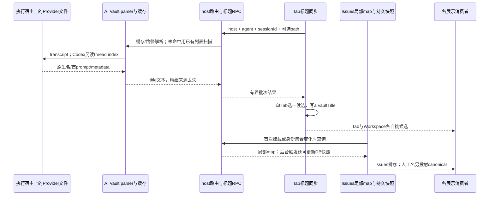
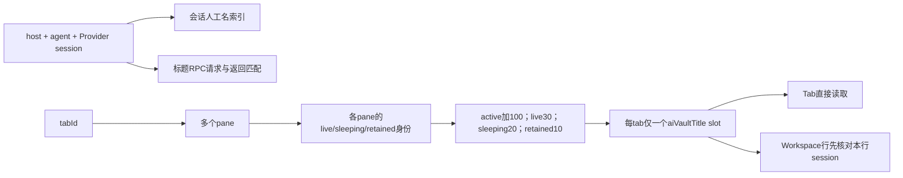

# 会话命名现状调研

基线：`cabf7f675e36af68ba95e7b095b695f38bee38f2`，`fork/integration`，调研开始时工作树干净。对象是 Claude/Codex 会话名称及其跨界面消费者；其他 Agent、普通终端、任务名只展开到语义分界。本文只记录现状，目标态单列于[Provider优先的统一方案](../solutions/Provider优先的会话命名统一方案.md)。

## 1. 结论先行

1. 现有公共函数只统一了**候选排序**，没有统一候选采集、身份归属、缓存与刷新。不能据此宣称所有地方同名。
2. 按语义归为七类来源：会话人工名、界面容器别名、Provider 原生命名、提示词派生名、终端实时标题、业务任务标签、默认兜底。解析缓存、Tab slot、Issues 快照是副本，不是新的命名作者。
3. `AiVaultSessionTitle.source='provider'` 不代表“Provider 明确命名”：其文本也可能来自首条用户消息、注入消息或 Agent 加短 ID。精细来源在 parser 输出处丢失。
4. 存在可由源码直接证明的分叉：Codex 冷/热解析优先级不同；Issues 局部标题 map 不随同身份的新名更新；Dashboard 快照与普通行输入不同；Activity、移动端、选择器、History 旁路各有取名路径。
5. 当前 Tab 标题同步保留身份不匹配的旧 slot，异步结果只检查 Tab 仍在候选集。Workspace 行却按当前 row identity 屏蔽不匹配 slot。这两条规则可以同时使顶部保留 A 名、左侧按 B 取名。某次 B 是否辅助调用，本轮没有运行时证据。

## 2. 术语与来源

| 类别 | 数据/作者 | 当前用途与边界 |
| --- | --- | --- |
| 会话人工名 | `Conversation.title`，`titleSource=user`；旧端 source 缺失按人工名兼容 | 按 route host、agent、当前 Provider session 投射到可选 canonical 索引；不修改 Provider 文件 |
| 界面容器别名 | Tab `customTitle/customLabel`；pane layout title | Tab/pane 作用域，不是会话身份。`customTitle` 也可由模板、自动化、CLI/API 创建写入，不能全部解释成人手改名 |
| Provider 原生命名 | Claude custom-title/ai-title；Codex metadata/thread index | 来源于 Provider 的命名字段；与 Orca 会话人工 override 分开 |
| 提示词派生名 | scanner 从首条消息提取；renderer `generatedTitle/generatedLabel` | 前者最多 96 UTF-16 units，后者由 `deriveGeneratedTabTitle` 清理、截取至 40 字符；后者受默认关闭的设置控制，不是额外调用 LLM |
| 终端实时标题 | OSC → `tab.title`、各 pane title、entry.terminalTitle | 可能是语义名，也可能是 spinner、状态、cwd；同时参与 Agent 检测等非显示逻辑 |
| 业务任务标签 | `quickCommandLabel`、orchestration displayName/taskTitle | 命名命令/任务，不必对应 Provider 会话；不同界面放在不同层级 |
| 默认兜底 | Agent 加 sessionId 前 8 位、Terminal N、Agent/Chat 等 | 前者身份确定就能纯函数推导，不要求写入数据库 |

这里的“七类”是语义口径，不是七个数据库字段。人工编辑入口也不止两种：会话 Rename、Tab Rename、pane Rename。移动端terminal.rename最终写父Tab的customTitle，包含headless持久化路径，不是Provider改名；操作某个split handle也会作用到父Tab。

## 3. 现状全景

下表的“Tab 链”指：容器别名 → 快捷命令名 → 特殊 OpenCode 语义 OSC → 会话排序函数的可用候选 → 调用方默认值。

| 使用位置 | 当前实际逻辑 |
| --- | --- |
| 顶部终端 Tab、分组、浮窗、拖拽提示 | Tab 链；terminal 与 unified 两个适配器的无 slot 回退也不完全相同 |
| 最近 Tab 切换、关闭 pinned Tab 确认、Cmd+J 打开 Tab 搜索 | terminal/unified resolver；Cmd+J 同一个解析值用于显示和搜索 |
| Workspace 左侧、普通 Dashboard compact/full 行 | row hook：Tab 别名 → quick → OpenCode → 会话人工名 →匹配本行身份的 Provider slot → generated → 本 pane 有意义 OSC →身份兜底；仍无名才取任务/消息与状态 |
| Issues 左侧和详情会话行 | 若找到同 host、agent、Provider identity 的 Workspace 真行则复用原行；否则走 Issues 链。不是单按 attachment.kind 分支 |
| Issues 绑定会话弹窗、左侧搜索 | Issues 链：人工名 → 当前组件 RPC 标题 map →持久 Provider 快照 →身份兜底；产品调用全部传 liveTitle=null。左侧搜索与附着行显示可能不同源 |
| 桌面 History 主行及搜索 | canonical 人工名优先，否则 session.title；不同名时原始 session.title 也作副标题；搜索二者 |
| History 子 Agent、拖拽 payload、删除确认、接续弹窗及接续文本 | 直接 session.title，未统一套主行 canonical 覆盖；子 Agent 本来有独立身份/描述，不能继承父名 |
| Dashboard 弹出看板 / Agent Map | 快照 `rowConversationName` 没有普通行的 canonical 查询、slot identity guard、identity fallback；卡片缺名回 workspaceName，Map 可回 task/agentType |
| Activity 列表、线程、搜索 | 任务语义：custom →仍匹配当前任务的 orchestration →generated →当前有效 prompt →历史最新有效 prompt →OSC/default。完全不读 Provider slot/canonical |
| 移动端终端 | 桌面在线发布：安全单 pane 用 Tab 链，split 用 leafTitle→Terminal；headless 发布为 custom→generated→OSC→default→Terminal N，不读 Provider slot |
| 移动端 History | session.title→Untitled session，不套桌面 canonical；移动端收到终端 title 后也不重新解析会话名 |
| Goal 目标选择器、Review Notes 发送对象菜单 | 前者 entry.terminalTitle；后者 provider 名加状态/时间/tab.title。不读统一会话名 |
| Runtime graph 的 terminal/leaf 标签 | 复用 Tab 链，leaf 也可能被 tab 级 slot 覆盖；另保留原始 paneTitle |
| structured `contentType=agent-session` Chat | 独立 host tab.title→unified label，没有 aiVault slot；和终端切换 chat viewMode 不是一个对象。新建/恢复发布及替换会话使用Claude Chat/Codex Chat，已有Tab仅更新激活信息，未见后续Provider/prompt更新title通路 |
| Pane 小标题、资源管理器、系统通知 | pane/PTY/任务事件语义，不都是会话名。通知主路径标题为 workspace+Agent+状态，正文为 assistant/tool 摘要；仅兼容 fallback 正文使用 terminalTitle |

Issue 自身的 localTitle/source.titleSnapshot、workspace/displayName、分支名、Goal 标题、任务标题不是会话名。不能用一个全局 `title` 替换来消除这些对象的正常差异。

## 4. 技术链路

### 4.1 Provider 内部的排序

| Provider | 当前路径 | 优先级 |
| --- | --- | --- |
| Claude | 首次与增量 finalize | 最后处理的有效 custom-title →最新有效 ai-title →第一条非注入用户消息 →metaTitle →Claude 短 ID |
| Codex | 首次/增量 finalize | session_meta.title/thread_name/threadName →session_index 最新有效 thread_name →首条可提取用户消息 →Codex 短 ID |
| Codex | transcript 未变的缓存复用 | 非空 index 名可以无条件覆盖已有 title，包括此前来自 metadata 的名；与上一行不同 |

Claude 空 custom-title 会清掉该覆盖，空 ai-title 不清已有生成名。metaTitle 可由最早可用 agent-name 或注入用户消息占位，last-prompt 不决定标题。Codex index 同 id 的后续有效记录覆盖前值。以上是 Orca 当前 parser 规则，不是对所有 Provider 版本的外部规范声明。

### 4.2 副本与刷新

| 副本 | 身份/生命周期 | 当前刷新逻辑 |
| --- | --- | --- |
| transcript parse cache | path/platform/mtime/size；最多 4096；可持久化 | Claude/Codex 增量解析；Codex缓存命中另读index |
| service titleIndex | 宿主内部 agent+sessionId，最多4096 | 成功直读/scan填充，无时间TTL；无path查询可直接返回旧值 |
| 列表缓存 | 扫描结果 | TTL 60秒；resolver仅补没有结果的identity，已有fallback也算命中 |
| Tab aiVaultTitle | 单tab slot，内部有agent/sessionId/source，没有pane或host字段 | live缺名20秒、有名5分钟；sleeping/retained匹配有名后不定时重扫；人工override独立通知 |
| Issues局部map | 三个组件各有一份 | effect只依赖route+agent+sessionKey+id集合，不依赖path、快照、轮次或时间 |
| Conversation.providerTitle | DB持久快照，和人工title分槽 | 首次身份、绑定非空Issue、稳定轮次、启动补缺；在途触发合并再读一次 |
| canonical索引 | route host+agent+当前navigation sessionId | 只收人工名，不收Provider快照，不遍历lineage |

Tab 的实际调度还经过 `scheduleAfterInputQuiet`：延迟1秒、quiet窗口1.5秒、idle timeout3秒；20秒/5分钟不是端到端实时保证。

## 5. 关键规则与语义

### 5.1 公共六层排序不等于七类来源

`resolveSessionDisplayTitle` 顺序是 user → provider → provider-snapshot → generated → live → identity-fallback。它 trim 空值，并把与 identity fallback 相同的 Provider 字符串降为兜底。人工输入即使恰好等于兜底仍是人工名。

Tab 外层的 custom、quick、OpenCode 会先返回；Tab没有传Provider快照，Issues没有传generated，History主行没有走这一函数。Workspace能直接查人工索引且会验证slot归属，Dashboard快照没有同等输入。

### 5.2 会话身份与Tab身份

当前 row/slot 比较只含 agent/sessionId；canonical 和 RPC 批次上下文带 host。请求集合会把pane优先级折叠成一个tab请求。`AgentProviderSessionMetadata`有key/id/path，没有通用primary/auxiliary角色。

有 incoming providerSession 时，live entry builder 优先采用它；`resolvePaneAgentOwnerRecord`解决的是AgentType，不是同Provider内的主/辅助session。structured providerHandleChain、原生worker标记和已知orchestration worker的精确关联各有适用范围，均不能据名字或prompt反推出任意调用的创建者。

### 5.3 写入、清空和恢复

- Conversation Rename只写title/title_source；清空恢复自动链，不清Provider快照、不改Provider文件。
- providerTitle后台仍可更新，不覆盖人工名。v4迁移已清旧minted值、把旧provider值搬到独立快照。
- 快照刷新拒绝空值、identity fallback和conversation-override，但目前无法拒绝已被包装为provider的首prompt。
- 异步Tab结果当前只检查tab仍有候选，不复核请求身份/host/pane；旧slot身份不匹配时也不清除。这是静态规则，不构成“确实是后台辅助调用”的证据。
- Issues快照写前只重读recordRevision，没有重核active identity。但正常allocator的新身份对应新Conversation；此处是多身份演进防护缺口，不是已复现事故。
- 原始OSC还参与Agent身份/状态识别、Notes发送对象可用性、通知去重；session.title还参与原pane弱匹配和路径猜测。它们不是可任意覆写的纯UI字段。

## 6. 面向后续方案的现状接口

| 现成能力 | 已具备的边界 | 当前未统一之处 |
| --- | --- | --- |
| AI Vault parser/resolver | 文件发现、增量、缓存、批次上限64、宿主路由 | 真实命名来源没有传出；冷/热路径和各缓存新鲜度不同 |
| session-display-title | 排序纯函数与身份兜底识别 | 调用方候选不一致；外层可绕过 |
| canonical-session-titles | 无Issues依赖的可选人工名provider | 不是Provider全量标题缓存 |
| Conversation title/snapshot仓储 | 人工名与自动快照隔离、revision、迁移 | 快照没有精细来源及显式session归属戳 |
| Workspace真行与各种Tab组件 | 原生状态/恢复/lineage交互可复用 | 快照投影、旁路对话框、搜索和移动端没有同一读模型 |
| host/worker/structured身份机制 | 执行host、launchToken、pane、已知worker、provider handle chain | 无任意独立CLI/辅助调用的通用主会话分类 |

SSH读标题走目标连接，不可达时不扫描本地代替；空结果保留已有快照。`runtime:*`是客户端route，authority内部可使用local，跨层拼key需要按现有路由转换，不能混用两个host标识。

## 7. 冲突与未知项

- 旧技术说明第10.4/10.5节的“provider_title为空等价文件丢失”“88/89为Orca内部调用”未被本轮证据支持；后者分类表相加为95而不是89。不能继续当已核实结论。
- 缺active identity、未支持Agent、读取失败、host不可达、只解析到兜底都可能没有快照；不要求文件消失。稳定兜底已可按身份计算，附着写minted不是唯一也不是必要条件。
- 本轮未实测当前Provider何时生成名、某个异常identity是谁创建、当前App是否实际触发这些静态分叉；不作运行时根因归属。
- 未核验本次 Node-only 独立host的Issues bootstrap、真实SSH/WSL/paired/mobile运行效果。
- 无精细来源的旧wire与旧cache，仅看字符串无法补回可靠provenance。

## 8. 自校验与验证状态

已对共享排序、Tab请求/回写、Issues局部map和快照、Claude/Codex冷热解析、通知模板进行源码回读；其他消费者由有界只读调研核实调用位置。全部结论是源码静态确认，缓存差异是可达规则推导，未标为实际App复现。

本轮不运行产品测试、CDP、构建或启动；文档结构/路径校验结果记录于Journal。不能以之前包启动或纯函数结果替代本轮全消费者验收。

## 9. 关键文件索引

| 范围 | 文件与符号 |
| --- | --- |
| 排序 | `src/shared/session-display-title.ts`：resolveSessionDisplayTitle；`src/shared/tab-title-resolution.ts`：两类Tab适配 |
| 行名与兜底 | `src/shared/agent-row-conversation-name.ts`；`src/shared/agent-session-fallback-title.ts` |
| 提示词派生 | `src/shared/agent-tab-title.ts`；`src/renderer/src/store/terminals/terminal-tab-presentation.ts` |
| 类型 | `src/shared/ai-vault-session-title.ts`；`src/shared/ai-vault-types.ts`；`src/shared/terminal-tab-types.ts` |
| Provider解析 | `src/main/ai-vault/session-scanner-primary-parsers.ts`；`src/main/ai-vault/session-scanner-codex-parser.ts`；`src/main/ai-vault/session-scanner-accumulator.ts` |
| Codex索引/热路径 | `src/main/ai-vault/session-scanner-codex-title-index.ts`；`src/main/ai-vault/session-scanner-codex-cached-title.ts`；`src/main/ai-vault/session-scanner-parse-cache.ts` |
| resolver/cache | `src/main/ai-vault/session-title-resolver.ts`；`src/main/ai-vault/session-title-file-reader.ts`；`src/main/ai-vault/session-scanner-service-entry.ts`；`src/main/ai-vault/cached-session-list.ts` |
| RPC与验证 | `src/main/runtime/rpc/methods/ai-vault.ts`；`src/main/ai-vault/session-title-result-validation.ts`；`src/main/ipc/ai-vault-session-title-routing.ts` |
| Tab同步 | `src/renderer/src/lib/ai-vault-tab-title-sync.ts`；`src/renderer/src/lib/ai-vault-tab-title-requests.ts`；`src/renderer/src/components/AiVaultTabTitleSyncGate.tsx` |
| 人工索引 | `src/renderer/src/lib/canonical-session-titles.ts`；`src/renderer/src/issues/conversation-canonical-titles.ts` |
| Workspace行 | `src/renderer/src/components/dashboard/use-agent-row-conversation-name.ts`；`src/renderer/src/components/sidebar/WorktreeCardAgents.tsx` |
| Issues显示/刷新 | `src/renderer/src/issues/issue-conversation-presentation.ts`；`src/renderer/src/issues/conversation-session-titles.ts`；`src/renderer/src/components/issues/IssueConversationRowContent.tsx` |
| 持久快照 | `src/main/issues/conversation-title-refresh.ts`；`src/main/issues/conversation-title-writes.ts`；`src/main/issues/issue-database-migrations.ts`；`src/shared/issues/types.ts` |
| Tab搜索/快照 | `src/renderer/src/lib/workspace-tab-palette-entry-builder.ts`；`src/renderer/src/components/dashboard/dashboard-card-labels.ts` |
| Activity | `src/renderer/src/lib/activity-thread-display.ts` |
| History主行/旁路 | `src/renderer/src/components/right-sidebar/AiVaultSessionRow.tsx`；`src/renderer/src/components/right-sidebar/AiVaultSessionSubagents.tsx`；`src/renderer/src/components/right-sidebar/ai-vault-session-continuation.ts` |
| 移动端/graph | `src/renderer/src/runtime/sync-runtime-graph/mobile-session-terminal-tabs.ts`；`src/renderer/src/runtime/sync-runtime-graph/graph-publication.ts`；`src/main/runtime/mobile-session-terminal-projection.ts`；`mobile/src/agent-history/agent-history-session-card.ts` |
| 选择器 | `src/renderer/src/goals/goal-session-target.ts`；`src/renderer/src/lib/notes-send-agent-targets.ts` |
| 其他名称 | `src/main/ipc/notification-options.ts`；`src/renderer/src/components/status-bar/mergeSnapshotAndSessions.ts`；`src/renderer/src/runtime/web-session-tabs-sync/terminal-surfaces.ts` |
| Mobile改名/Chat生产 | `src/main/runtime/orca-runtime-resolve-worktree-removal-target.ts`；`src/main/runtime/orca-runtime-persist-headless-terminal-title.ts`；`src/renderer/src/hooks/ipc-events/terminal-ui-routing-ipc-bridge.ts`；`src/main/runtime/orca-runtime-restore-structured-agent-session-tabs-once.ts` |
| 身份 | `src/renderer/src/store/slices/agent-status-live-entry-builder.ts`；`src/shared/pane-agent-owner.ts`；`src/main/runtime/orchestration/worker-provider-session.ts`；`src/shared/agent-session-record.ts` |

## 10. 关联文档与过程件

- [Provider优先的会话命名统一方案](../solutions/Provider优先的会话命名统一方案.md)：当前目标态，未实施；原初稿已替代。
- [原技术说明](../../Issues看板与会话/solutions/Issues看板与会话技术说明.md)、[需求](../requirements/会话命名与身份保护.md)、[Journal](../../Issues看板与会话/journal.md)。
- 过程件：`tmp/tasks/2026-09-08-session-names/repo-profile.md`、`tmp/tasks/2026-09-08-session-names/trace-log.md`、`tmp/tasks/2026-09-08-session-names/open-questions.md`。
