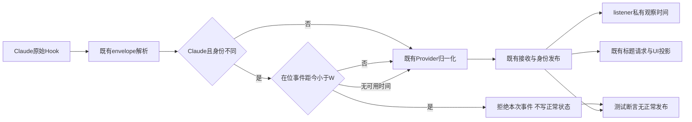
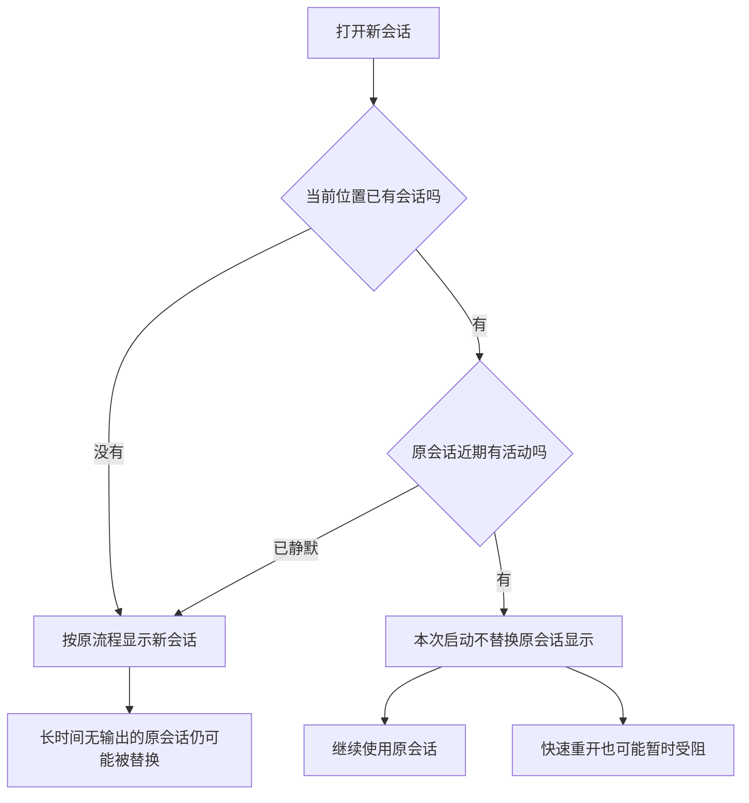

# Claude在位会话活跃窗口保护方案

## 0. 摘要与当前决定

用户确认采用 Cloud 活跃窗口路线，随后授权“改吧，改完验证，验证完有问题接着修”。**当前实现：Claude Hook 携带的 ID 与 pane 在位 session 不同，且在位者最近一次已接纳 Hook 距今不足 30 秒，则拒绝整次竞争事件；达到 30 秒、无在位者或没有本地计时证据时，交给既有逻辑。**

这是减少近期身份抢占的时间窗口策略，不是存活证明或主/子角色识别。30 秒为本次工程默认值，不是已测得的最优窗口，也不是用户指定值。初版仅拦 SessionStart 的生产函数回归仍在后续 UserPromptSubmit 失败；按继续修复的授权，同一规则扩至后续携带不同 ID 的事件及远端 ingest，未引入黑名单或新身份系统。实现与定向回归已完成；真实 App 结果以关联 Test Run 为准，reviewing 不等于全量命名验收通过。

本稿作为 [Provider优先命名主方案](Provider优先的会话命名统一方案.md) 的 **WP0a 首期实施依据**，替代其“所有入口可靠归属证据先闭合，才可开始任何身份保护实现”的前置顺序；不替代主方案的长期统一命名、可靠归属、候选来源及并发目标。关联 REQ-025、REQ-028、Journal D-004。当前代码核对基线为 `9899e7148023dae0fb5fab201e70944a384fd23f`。

## 1. 范围与非目标

| 项目 | 本期边界 |
| --- | --- |
| 目标 | 在活跃窗口内阻止不同 Claude session 的启动及后续 Hook 替换 pane 在位身份 |
| 入口 | 现有共享 Hook normalizer；不依赖 Workspace 是否为 git worktree，folder workspace 同样适用 |
| 数据与协议 | 不改数据库、Provider文件、RPC/wire字段，不新建会话中心或人工名系统；允许补 listener 内私有时间状态 |
| 保持 | Codex 现有 child 分支、Claude 现有 source/child 过滤、合法子 Agent 展示及原名称排序保持 |
| 未覆盖 | 同 ID 子路径/候选污染、缺 ID 事件、OSC 归属、标题异步乱序和全入口命名统一，不自动算作本期已修复 |
| 远端 | 共享代码可能同时影响 main/relay，必须分端验证；本地成功不代表 SSH/paired 已通过 |

## 2. 用户确认规则与参数

`A` 是当前 pane 缓存中的在位 session，`B` 是新事件的 session；`W` 为活跃窗口，`age` 为同一 listener 的本地单调时间减去 A 最近一次被接受事件的观察时间。

| 条件 | 首期决策 |
| --- | --- |
| 没有在位 A | 不拦截，交给现有 SessionStart 逻辑 |
| B 与 A 相同 | 不拦截；接受后更新本地观察时间，不创建新身份 |
| B 与 A 不同，且 `age < W` | 拒绝本次 Hook，包括启动后的 prompt/工具/Stop；不更新 A 的时间、不修改身份或正常状态缓存 |
| B 与 A 不同，且 `age >= W` | 不拦截，允许现有逻辑处理 B；这只是策略放行，不证明 A 已退出或 B 由用户发起 |
| 缺 session ID、非 Claude | 沿用现有逻辑，不猜测身份 |
| 已恢复 A，但无本地观察时间或时间记录不属于 A | 沿用现有逻辑；不把恢复/重放时间当新活动 |

上述“允许”不绕过当前 `source` / `agent_id` 校验；例如当前不接纳的 compact/未知 source/child-attributed SessionStart 仍由原逻辑处理。

**实施参数：** `W = 30_000ms`，由公共模块单一内部常量定义，不增加设置页，不复用标题轮询周期。以可控单调时钟分别验证 29,999 / 30,000 / 30,001ms；这证明边界实现，不证明该窗口适合所有任务。冷恢复缺时沿用旧准入，避免凭空保护旧身份；因此恢复后的第一段竞争仍可能被接纳。

“在位会话自己能改”在本期仅以上述 ID/时间规则近似实现，不表示已识别真正写入进程。共享父 ID 的子事件也可能使同 ID 的观察变新；本期不把该时间称为父进程心跳或存活证明。

## 3. 当前源码与证据边界

| 已检查实现 | 当前事实 | 本期复用结论 |
| --- | --- | --- |
| `src/shared/agent-hook-listener.ts` | 统一解析 raw Hook，提取 providerSession，再调用 Provider normalizer；Codex child 分支只抑制身份提取 | 在既有入口增量增加 SessionStart 准入，不复制一套 listener；不能只把 providerSession 设 null 就声称事件已拒绝 |
| `src/shared/agent-hook-listener/listener-state.ts`、`listener-event.ts` | `lastStatusByPaneKey` 保存 `AgentHookEventPayload`；共享类型没有事件时间戳；已有 pane 清理、迁移与全量清理路径 | 复用 pane 生命周期；时间需要 listener 私有状态，不能承诺“时间字段已经现成” |
| `src/shared/agent-hook-listener/providers/claude-events.ts`、`claude-roster-state.ts` | 已读取 SessionStart.source；UserPromptSubmit、Stop、工具等其他事件也能更新 owner | 复用原折叠；实测后将同窗准入放到这些写入之前，不新增角色分类 |
| `src/main/agent-hooks/server/server-status-update.ts` | main 后续富化接收时间并写缓存 | 接收时间语义可参考，但不是 shared/relay 均有的字段合同，不借新 wire 字段传时间 |
| `src/renderer/src/store/slices/agent-status-launch-config.ts`、`agent-status-live-reducer.ts` | token 匹配主要约束启动配置继承，不是所有状态的接收门 | 本期不依赖 token 是否消费来判断新旧归属，不下移或重建启动授权系统 |

现状输入为 [会话命名现状调研](../research/会话命名现状调研.md)、[用户提供的 G0 采样调研](../research/会话身份归属证据调研.md) 和既有隔离验证。采样调研中的“source 没人读”“compact 换 ID”未获本轮源码/样本复核支持，不作为本方案事实；其中顶替状态摘录缺少配套采样文件，不能将 41 条 Hook 记录当成完整 Hook→UI 证明。证据中的 compact_summary 尚未完全脱敏，不复制正文到本稿。

## 4. 目标交互



图中判定是新增目标态，不把 `source` 是否已解析与归属资格混为一谈。拒绝必须发生在 Provider normalizer 的 owner/lead/prompt 等写入之前。



用户动线同时列出策略收益和误判，不把活动间隔等同于进程结束；本期不新增提示框、设置入口或自动重启行为。

## 5. 接线与状态设计

遵循仓库复用/接缝规则及 [SSH执行边界](../../../reference/ssh-execution-boundary.md)、[wire兼容](../../../reference/remote-wire-compatibility.md)。静默判定只控制本次事件的身份替换资格，不发布 `exited`、不结束进程；断线不重置为“旧会话已死”，也不从客户端转去读本地数据替代远端。

```text
src/shared/agent-hook-listener.ts                              [修改] 既有入口增加早期准入
src/shared/agent-hook-listener/listener-state.ts                [修改] 私有时间状态与pane生命周期清理
src/shared/agent-hook-listener/providers/claude-events.ts       [复用] source/child及正常事件语义
src/shared/agent-hook-listener/providers/claude-roster-state.ts [复用] 原owner行为；在入口先做窗口准入
src/shared/claude-session-ownership/                           [新增] 公共策略、时间类型与生命周期测试
src/main/agent-hooks/server/server-status-update.ts             [修改] 已接纳真实Hook后记录本地时间
src/main/agent-hooks/server/server-ingest-remote.ts             [修改] 复用同一准入，覆盖旧relay绕过
src/relay/agent-hook-server.ts                                 [修改] 已接纳事件更新host本地时间，排除spool重放
src/main/claude-session-ownership/                             [新增] main接纳与relay HTTP集成测试
config/fork-features.jsonc、config/architecture-policies.jsonc  [修改] 实施前登记实际接缝/归属
docs/issue/Issues看板与会话/                                   [修改] 参数、实施差异、规格及Test Run
```

时间状态按现有 listener/pane 生命周期维护，并与记录的 session ID 配对，防止把 A 的时间拿来保护 B。它是进程内辅助状态，不持久化、不发 RPC、不改数据库。main 与 relay 各用自己的本地单调时钟，不比较跨 host 墙钟；恢复/重放不能刷新“新收到的在位活动”。测试使用可控时钟。

处理顺序为：解析 envelope 和候选身份 → 对符合范围的 SessionStart 检查 A 的观察年龄 → 若拒绝则整次正常事件不进入 Provider 状态折叠/正常发布 → 若放行则执行原归一化、接收和缓存路径。只有被接受的同身份活动才刷新对应观察时间；B 被拒绝不能续期 A 的窗口。诊断记录不等于正常状态发布。

**实施期窄扩展（D-005）：**初版只拦 SessionStart 后，5 条目标回归中仍有 1 条在 B 的下一次 UserPromptSubmit 失败。现对所有携带不同 Claude ID 的 Hook 复用同一窗口判断，因此 B 没有 SessionStart 也不能在窗口内直接接管；窗口到期仍能进入既有逻辑。不增加拒绝 ID 黑名单、全事件角色判定或绑定服务。公共策略放在 feature 登记的领域中立目录，不让 main/relay 依赖 Issues 业务。

main 在 `applyNormalizedStatus` 接纳后记录，relay 在已接纳并缓存时记录；不是 normalizer 只返回非空就刷新。`isReplay`（包括 relay spool 的独立 options）均不续期；OSC 没有 Hook 来源，不记活动。私有时间不序列化。新 relay 对旧客户端只减少竞争 Hook，保留旧身份与原帧形状；新 main 对旧 relay 重新准入。两端都旧仍无保护；本轮真实 HTTP 链路不等于部署过远端 SSH/paired 主机。

## 6. 风险、观测与验证要求

| 项目 | 本期必须说明/观察的结果 |
| --- | --- |
| 无在位者、同 ID | 沿用原流程；新增保护不阻止首次正常启动/恢复 |
| 不同 ID 且 age 在窗口内 | 启动与后续 Hook 均拒绝；owner/lastStatus/prompt/路径及该事件的正常发布均不改 |
| 不同 ID 且 age 到达/超过窗口 | 放行既有逻辑；覆盖 W 前、恰好 W、W 后边界，不把放行描述成存活证明 |
| 主会话刚有活动后启动 headless | 先验证事件准入，再观察完整事件序列、标题和 Issues attachment，不能只截图首个瞬间 |
| B 被拒绝后继续发 UserPromptSubmit/工具/Stop | 窗口内仍拒绝，不能续期 A；不得只验首事件 |
| 主会话长期推理/长工具/等待输入 | 无事件可能超过 W，B 将被放行；这是已知误放风险，测试不得删掉这个场景 |
| 用户退出 A 后立刻启动 B | A 近期事件可能导致 B 被拒绝；这是已知误拦风险，静默窗口不能同时消除两类误判 |
| 同 ID 子路径、OSC、迟到标题 | 本期不提供新保护；保留此前反例，单独报告未覆盖，不改为已通过 |
| pane重建/重映射、冷恢复、重放、SSH中断 | 时间不得跨实例继承或由重放续期；未知时间策略须先定案；本地结果不代表远端 |
| 正常子Agent、Codex、folder workspace | 既有 source/child 行为及非目标 Provider 不回退；没有git前提 |

本期不新增持久诊断日志；测试记录接纳/拒绝、身份与 age/W，不输出真实 prompt、工具输入或 compact_summary。此策略可减少近期抢占，但不能承诺彻底杜绝子调用改名。规则级断言与产品效果分别记录。

用户已授权实现与验证。本期规格见[窗口保护测试](../tests/cases/Claude活跃窗口保护测试.md)，结果见[本轮Test Run](../tests/runs/2026-09-08-Claude活跃窗口保护.md)。真机测试必须 `ORCA_BACKGROUND_LAUNCH=1`，CDP 由 subagent 执行，不抢焦点，不把原用户会话作为可修改测试夹具。隔离 headless Hook fixture 不是实际 Claude CLI，不宣称 Provider 全入口都已实测。

## 7. 实施成本与未决项

路线已由用户选定；W、冷恢复、main/relay 接缝及 fork 登记已在实施时落实。核心公共策略约 40 行，加上 5 处既有入口/生命周期接缝；测试独立于生产模块，不为“10 行”省略重放和清理规则。不能将计时解释成真正的 Provider 所有权证明。

本期没有协议/DB迁移成本，主要工作为小范围准入、私有时钟状态及生命周期回归。实际行数、远端接线和端到端效果以实现验证为准。更严格的主绑定/角色隔离仍属主方案 WP0 后续，而非活跃窗口验收通过就自然完成。

## 8. 引用与变更记录

- [主命名方案](Provider优先的会话命名统一方案.md)、[需求 REQ-028](../requirements/会话命名与身份保护.md#req-028-主会话绑定与内部辅助调用边界)、[Journal D-004](../../Issues看板与会话/journal.md#d-004-首期采用claude在位会话活跃窗口保护)。
- 2026-09-08，Codex：按用户“就按这个来吧。更新一下方案”新增本首期模块方案；用户确认的是时间窗口路线，不是所有安全性断言已通过。影响 WP0 顺序、REQ-028阶段边界及后续验收，未修改产品/运行数据；无需远端通知或飞书同步。
- 2026-09-08 23:20，Codex：按“改完验证，有问题接着修”实施。首个版本实测后续 prompt 绕过，已向用户说明并扩展同窗 Hook/远端准入；采用 30 秒工程默认、冷恢复缺时沿用旧逻辑，时间只在接受后更新，重放不续期。影响 REQ-028 首期与 TC-255～260，不扩展全量命名/角色目标，不需飞书或外部通知。
