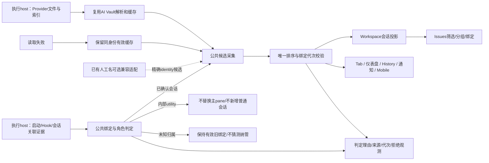
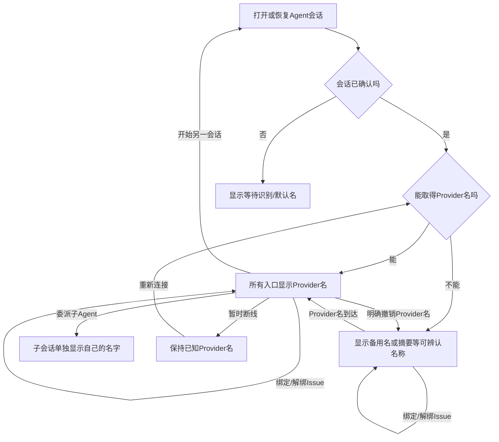
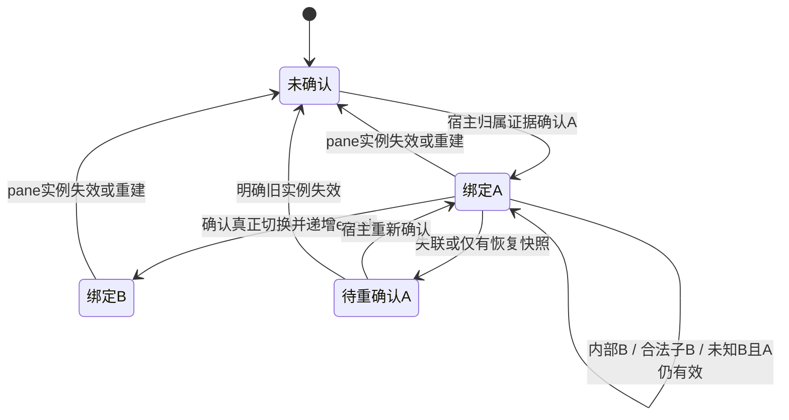

# Provider优先的会话命名统一方案

## 0. 摘要

**先解决“认错会话”，再统一“名字怎么排”。首期已由用户选定 Claude 在位会话活跃窗口保护（WP0a）：不同 ID 的 SessionStart 到达时，在位者近期仍有事件则拒绝，已静默则允许按原逻辑接纳，没有在位者则沿用原流程。**详细规则、时间状态及风险见[首期方案](Claude在位会话活跃窗口保护方案.md)。它是时间启发式保护，不是可靠存活/角色证明；长期目标仍为可信主绑定与防迟到串名，不能以删除异步守卫代替修复。

实施期更新：仅拦SessionStart的版本在后续prompt红测失败；当前已将相同规则扩至携带不同ID的后续Claude Hook，W采用30秒工程默认，无本地时间则沿旧逻辑。变更与验证见D-005及首期方案；并未启动完整命名工程。

2026-09-09更新（D-006）：真实Codex独立exec B无agent_id却继承父pane，已补managed Hook生产端的CODEX_THREAD_ID调用者上下文过滤，覆盖完整Hook序列而不推广Claude时间窗；local/daemon/relay新PTY先清理宿主继承的外层标识，避免正常新会话被误拦。带外层sentinel的隐藏App真实回归中，主A、原生subagent、独立B隔离、同pane合法新C四项通过，见[修复执行记录](../tests/runs/2026-09-09-Codex嵌套调用修复.md)。这是Codex 0.153.4工具继承链的已验证修复，不是通用授权/G0完成证明；旧版本缺标识、自定义wrapper及真实远端仍未覆盖。

**同一Agent会话在所有入口使用同一份名称结果：Provider名→已有Orca人工名→有效稳定提示词摘要→可信实时标题→归属label→身份兜底。**左侧、Tab、Issues、仪表盘、History、搜索、通知、移动端都不另排优先级。Issues目标上只筛选、组织、绑定；本期退出新显示链的专属命名，旧数据/旧端兼容适配暂留，不能宣称已完成全部存储退场。

**撤出本次公共人工名新系统。**不新增profile人工名字段、编辑RPC、迁移receipt/tombstone，不批量搬迁或删列；已有人工名和Rename/Clear仅兼容保留。复用AI Vault读取/缓存与公共排序，不建立第二套scanner或完整会话中心。

本稿收缩[上一版命名初稿](会话命名统一方案.md)之后的当前主方案，保留原目标和候选质量规则；变更留痕见§8。原命名基线为`cabf7f675e36af68ba95e7b095b695f38bee38f2`，身份入口基线为`9899e7148023dae0fb5fab201e70944a384fd23f`。截至2026-09-10，独立`feat/claude-owner-window`已实现WP0a及部分公共命名/消费链，Activity进入验证；代码与逐批证据以[全量Test Run](../tests/runs/2026-09-09-全量命名验收推进.md)为准。正式用例已同步，ready不代表通过；完整归属、消费矩阵和生产包验收仍未完成。

## 1. 状态与结论

| 决策 | 本轮结论 |
| --- | --- |
| 用户确认的方向 | Provider第一；无Provider名时保持可辨认的多层回退；所有入口一致；Issues不另造命名能力 |
| 实现取舍 | 先做用户选定的WP0a活跃窗口保护；G0/严格WP0继续作为全量身份/过滤目标，之后WP1来源/排序及WP3/WP4接线；原WP2仍撤出 |
| 保留/撤出 | 保留Provider证据四态、提示词质量规则及已有人工名回退；撤出新人工名持久化、编辑RPC、迁移；不恢复任何Tab/Issues排序特例 |
| 难度 | WP0a限定既有listener与私有时间状态，不改DB/wire，但不承诺10行；严格WP0仍取决于归属证据，跨端接线中高 |
| 完成边界 | WP0a规则级测试与完整headless效果分开；实测非SessionStart旁路后已扩展同窗准入，静默误放、快速重开误拦及同ID污染仍保留；长期身份/可见性/命名分别验收 |

## 2. 需求与目标行为

### 2.1 唯一排序

| 优先级 | 候选 | 准入规则 |
| --- | --- | --- |
| 1 | Provider名 | Provider明确命名字段，或同身份最后确认且未被明确撤销的缓存；经Provider适配器可靠确认的终端传输正式会话名也归此层，不按传输渠道降级；scanner首prompt不能冒充Provider名 |
| 2 | 已有Orca会话人工名 | 经精确identity读取的旧人工值，仅兼容输入；有Provider名时不主显。不新增公共写入或将旧Tab别名批量认作人工会话名 |
| 3 | 有效提示词派生名 | 优先Provider文件中首个通过质量门槛的真实任务请求摘要，其次同身份已捕获的首次有效请求/任务摘要；低信息、注入或清理后为空的候选直接跳过 |
| 4 | 可信终端实时标题 | 复用现有清理：排除状态、spinner、cwd、Agent自称、默认Terminal标签；只使用该会话自身的pane标题 |
| 5 | 已知任务/命令/历史容器标签 | 仅当有确定归属；旧customTitle或quick-command不得在链外抢占，父Tab标签不能赋给所有分屏会话 |
| 6 | 稳定默认名 | 有identity用Agent＋短sessionId；identity未建立用Agent/Terminal/Chat默认名 |

缓存是来源的副本，不是独立排序层。Provider读取失败/断线与Provider明确撤销名字不同：失败保留同身份有效缓存；只有适配器明确识别的撤销证据才使旧名失效。空结果、文件未找到、字段缺失都不能自动解释为撤销。

所有Agent适用同一排序；各Provider适配器只负责识别可用来源。Claude/Codex先补精细命名字段；其他Provider没有原生名证据时走同一回退链，不保留OpenCode等在公共排序外的特殊return。普通shell、资源管理器的PTY标签不是Agent会话，不受会话名策略强制改写。

### 2.2 使用面

| 位置 | 目标行为 |
| --- | --- |
| Workspace与Issues左侧、Issue详情/绑定弹窗 | 对同身份订阅同一结果；Issues只筛选/分组/绑定，不再请求或解析自己的标题 |
| 顶部Tab、分组/浮窗、Cmd+J、最近切换、拖拽、关闭确认 | 使用同一结果；Agent Tab的custom/quick不再抢占；无独立“Tab名称优先级” |
| 分屏 | 每个pane/行用自己的session；父Tab显示活跃pane的结果，焦点变化不改变各session自己的名称 |
| 普通Dashboard、弹出仪表盘、Agent Map | 同一显示名；任务、运行状态作为附加信息，不顶替会话主名 |
| History主行、子会话、搜索、删除/接续/拖拽旁路 | 同一session用同名；子会话按自身identity解析，不继承父名。操作目标仍为ID/path |
| Activity、通知 | 会话标识取相同结果；通知可以拼“名称＋已完成/等待输入”，Activity保留任务内容为另一字段 |
| Goal目标选择、Notes发送对象 | 用同一会话名辨认目标，保留Provider、状态、位置 |
| Mobile、headless、structured Chat | host提供相同投影，不要求桌面renderer运行；Chat通过现有provider handle关联，不能从默认字符串猜身份 |

本期不新增会话备用名入口，不把Agent Tab/pane Rename改接到新写入系统。已有Conversation Rename/Clear及其revision、失败处理保留兼容；只调整必要说明，明确保存的是备用名，Provider存在时主名不会改变，不暗示写回Provider。旧Tab/pane编辑仍是容器标签，不能在公共链外压过会话名；普通shell操作保持。任何后续统一编辑入口或停用旧入口，均不在本期默认实施。

本次不新增命名LLM；`tabAutoGenerateTitle`仍控制Orca renderer派生摘要能力。Provider文件首问摘要沿用现有scanner能力，不受该旧Tab设置控制；所有消费者读取同一个候选集合，不各自判断设置。后续“继续”、状态变化不重命名已有稳定派生名；明确新session重新选择。

### 2.3 提示词派生与实时标题的取舍

**有效的稳定任务摘要排在普通实时标题前。**摘要用于长期辨认会话，实时标题可能随任务步骤、状态和目录变化；后者作为无合格摘要时的回退。长会话换题后摘要可能过时，这是明确接受的取舍：最新任务放内容预览，不为每个新回合重写会话名；Provider正式改名或用户修改备用名仍按更高优先级更新。

采用确定性的“候选准入→固定排序”，不做运行时语义评分或额外LLM调用：

1. 先检查来源和原始输入，再清理截断，最后检查非空结果。排除已确认的注入上下文、纯确认/继续/寒暄输入；例：单独的“继续”“好的”“ok”“continue”不能生成会话摘要。
2. 不按子串或最短字符数粗暴拒绝：“继续修复登录超时”“运行测试”仍有任务含义，不因包含“继续”或很短而丢弃。已有过滤器不能保证任意语言的语义质量，未识别输入仍按有界确定性规则处理，不宣称完美理解任务。
3. 首条输入不合格时，在既有有界解析/增量消息链中寻找首个有效任务输入；当前没有就令prompt候选为空，允许可信实时标题顶上。后续首次有效任务到达可替换较低级回退，此后同session不被新的普通回合随意覆盖。
4. 普通实时标题复用现有状态/spinner/cwd/Agent自称过滤。只有适配器通过已知Provider标题协议及当前session归属确认的正式名称才归Provider层；“文字看起来像名字”或“来自某Agent进程”都不足以升级。
5. 本节质量过滤只约束prompt/live候选，不用“低信息词”规则否决Provider明确设置的名称或用户人工备用名；例如Provider明确命名为“继续”时仍尊重其原生名。

| 输入情形（未说明时无Provider/人工名） | 名称选择 |
| --- | --- |
| 有效摘要“修复登录超时”，普通实时标题“执行回归测试” | 保持“修复登录超时”，当前执行步骤放预览 |
| 只有提示词“继续”，实时标题为合格的任务描述 | 跳过派生名，使用实时标题 |
| 首条是注入上下文，后续首个任务为“运行测试” | 使用“运行测试”的派生名；不把注入文本或“继续”锁为首问 |
| 摘要已存在，后来经可靠适配确认终端传来Provider正式名 | 正式名进入Provider层，统一替换摘要 |
| 无有效摘要，实时标题只有thinking/spinner/cwd | 两类候选都跳过，进入归属label或身份兜底 |

实现成本限定为复用现有提示词清理、已知注入过滤、实时标题过滤，并将重复的短回复判定抽成共享纯函数；不新增数据库、消息总线或RPC。

## 3. 现状摘要与复用决策

完整现状见[会话命名现状调研](../research/会话命名现状调研.md)。当前公共函数排序不等于统一数据源；Issues三个局部map、独立快照刷新、Tab单slot与row的不同归属检查，是本次收敛对象。

| 候选实现 | 结论 | 理由 |
| --- | --- | --- |
| `src/main/ai-vault/session-title-resolver.ts`及parser/cache | 增量复用 | 已有文件发现、直读、增量、批次及host边界；补来源，不复制scanner |
| `src/shared/session-display-title.ts`与`agent-session-fallback-title.ts` | 修改排序／复用兜底 | 保留纯函数；所有Agent会话入口传同一候选，不在UI再拼优先级 |
| `src/shared/agent-tab-title.ts`、`harness-injected-user-turns.ts`、renderer的`activity-thread-display.ts` | 复用清理与注入判断，抽取短回复判定 | 现有derive仅清理/截断，Activity有英文短回复规则；抽到共享候选质量模块后补中文/反例，避免main导入renderer或复制两份正则 |
| `src/renderer/src/lib/canonical-session-titles.ts` | 复用可选兼容输入 | 只提供已有人工候选及变更通知，不再让调用者先行return；不为替换旧存储新建一套写服务 |
| `ai-vault-tab-title-sync.ts`、Issues `conversation-session-titles.ts` | 抽共同请求和订阅内核 | 前者是tab写入器，后者是组件map，均不适合直接充当所有session的持久事实层 |
| `src/main/persistence/loading-store/store.ts`与`src/shared/persisted-state-types.ts` | 不扩建人工名domain | 本次没有新人工名写入需求，不增加顶层字段、落盘屏障或迁移账本；现有profile隔离继续沿用 |
| `src/main/runtime/agent-session-record-store.ts` | 复用身份关联，不承载所有旧会话名字 | 该store围绕durable session、lease与操作账本；给纯历史/legacy CLI起名不应创建一个执行lease |
| Issues `conversation-title-writes.ts`及DB列 | 兼容保留，不扩建 | 旧人工值/旧端快照不直接删除或停写；新命名主链不能等待旧刷新器，不新增Provider证据列 |
| live-entry builder、`pane-agent-owner.ts`、既有launch/worker/structured身份链 | 增量复用身份接缝 | builder采用新上报身份；pane owner只解决AgentType。已知worker与provider handle链各有范围，不能当通用主/辅助证明 |
| `round-record-ingestor.ts`、`issue-conversation-presentation.ts` | 保留窄过滤，接入公共归属/角色决策 | REQ-028已有部分过滤，title_source还保护人工名；不删除保护，不扩建prompt黑名单来猜所有内部调用 |
| Workspace真实行、原生恢复及各消费组件 | 直接复用，修改名称输入 | 保留状态/附件/lineage/恢复/发送等行为；不重写整个会话列表模型 |

新增公共模块只补“已确认绑定→候选→统一投影”的薄层，不管理新的人工元数据。现有resolver可查名但不能确认pane归属，现有Tab同步只有一个slot，现有canonical只供人工值；因此不能把任一个现成模块直接当完整会话中心。内部调用的归属入口必须位于运行态身份覆盖和持久纳管之前，不只在标题UI补救。

静态代码支持A/B身份与标题分叉风险，但不证明某次B是谁发起。本轮不采信“172条中绝大多数内部调用”或“0人工名所以可删库”等未经重新核验的统计；不把删除异步守卫当根因修复证据。

## 4. 目标交互链路

本节图示仍是完整命名统一目标，不代表WP0a已达成。首期活跃窗口的系统图、用户动线和降级边界以[WP0a方案§4](Claude在位会话活跃窗口保护方案.md#4-目标交互)为准；不能将下面“后台调用不改名”的完整目标当作时间窗口策略的无条件保证。



验收重点：绑定与角色先于主名称投影，Issues新显示链没有另一条Provider请求线。兼容人工值可以缺席，不阻塞自动命名；旧存储尚未退场须单列，不能隐藏在“公共化完成”之下。



用户绑定/解绑Issue、普通轮次与后台调用不会使主会话换名；Provider正式改名仍会更新。合法子Agent独立展示；真正开始另一会话重新识别。旧Rename仅兼容存在，不再作为本期主用户动线。

## 5. 设计与兼容边界

### 5.1 原则与仓库落点

下方目录树是完整目标工作包；WP0a只按[首期接线目录](Claude在位会话活跃窗口保护方案.md#5-接线与状态设计)修改既有Hook入口、listener私有状态及必要测试，不以本树为由提前新建绑定/命名服务。

- 实现前按AGENTS在独立功能分支/worktree登记公共命名slice的ownedPaths、seams、dependsOn；下面是计划落点，不是已新增源码。Issues注册能力不得为过gate被删除。
- 遵循[SSH边界](../../../reference/ssh-execution-boundary.md)：执行host提供执行/身份事实，客户端维护UI投影；标题读不到不代表进程退出。固定使用live/unverifiable/exited；远端不可达不回本地读文件。folder Workspace与git worktree使用同一身份规则。
- 遵循[wire兼容](../../../reference/remote-wire-compatibility.md)：旧字段含义保留，新字段可选。停止旧快照生产、改变host发布内容也是兼容变更，不能仅凭JSON解码成功放行。
- 复用[STYLEGUIDE](../../../STYLEGUIDE.md)和原行/状态/弹窗组件；本期不创建新命名设置页或编辑系统，不改变窗口焦点和普通shell操作。

```text
config/fork-features.jsonc、architecture-policies.jsonc        [修改] 实施前登记owned/seams/dependsOn
src/shared/session-names/pane-session-binding.ts              [新增] 已确认绑定/代次与纯判定合同
src/main/session-names/session-identity-observation.ts         [新增] 组合既有宿主/启动/Provider角色证据
src/shared/session-names/session-name-contract.ts             [新增] 来源四态、候选、只读投影
src/shared/session-names/session-name-candidate-quality.ts    [新增] 抽共享短回复判定，复用注入/派生清理
src/main/session-names/session-name-service.ts                [新增] 抽公共采集/调度/结果，不做人工名持久化
src/main/agent-hooks/、runtime/既有身份归属接缝                 [修改] 原始观察先分类，再确认绑定/发布
src/renderer/src/store/slices/agent-status-live-*.ts           [修改] 消费确认后的绑定，不以最新Hook覆盖主身份
src/shared/agent-tab-title.ts、session-display-title.ts       [修改] 候选质量与唯一优先级
src/shared/harness-injected-user-turns.ts                     [复用] 不复制注入规则
src/renderer/src/lib/activity-thread-display.ts              [修改] 复用短回复内核，任务预览仍独立
src/shared/tab-title-resolution.ts、agent-row-conversation-name.ts [修改] 移除名称链外抢占
src/shared/ai-vault-session-title.ts、ai-vault-types.ts        [修改] 可选来源证据；旧title保留
src/main/ai-vault/                                           [修改] parser/cache/result验证保留来源
src/main/ipc/ai-vault-session-title-routing.ts                [修改] 透传新增证据，沿用host路由
src/main/runtime/rpc/methods/ai-vault.ts、preload、SSH relay对应桥 [修改] 原读取入口及validator透传
src/main/issues/round-record-ingestor.ts                     [修改] 普通纳管前消费公共角色判定，保留窄过滤
src/main/issues/conversation-hook-identity-ingestor.ts        [修改] 只按确认的归属纳管/附着
src/renderer/src/issues/issue-conversation-presentation.ts    [修改] 公共显示与角色适配，保留旧人工保护
src/renderer/src/session-names/session-name-store.ts          [新增] session级只读订阅/投影
src/renderer/src/lib/ai-vault-tab-title-sync.ts                [修改] 薄pane/tab投影，保留有效异步守卫
src/renderer/src/lib/canonical-session-titles.ts              [修改] 已有人工值只作为公共候选
src/renderer/src/issues/conversation-canonical-titles.ts      [复用/窄修改] 显式旧数据适配，不另排序
src/renderer/src/issues/conversation-session-titles.ts        [修改] 退出组件私有请求/map
src/main/issues/conversation-title-*.ts、旧DB与改名RPC        [复用] 兼容保留，不新增人工字段/迁移
src/renderer/src/components/、lib/现状索引中的消费者          [修改] 统一名称输入，复用原交互
src/renderer/src/runtime/sync-runtime-graph/、main/runtime/   [修改] graph/headless/Chat/通知只读投影
src/shared/runtime-types.ts及publication类型/validator        [修改] 可选新投影，保留旧raw字段
mobile/src/session/、mobile/src/agent-history/                [修改] 消费相同名称投影
docs/issue/Issues看板与会话/                                   [修改] 方案/需求/Journal；旧规格标记待同步
```

不创建`session-name-persistence.ts`、`conversation-name-migration.ts`、`agentSessionNames`顶层字段或`sessionNames.setManualName`；本稿也撤回新建`sessionNames.resolve`，优先扩展现有AI Vault读入口与已有runtime publication。未知的host装配差距不得通过另起第二套RPC服务掩盖。

### 5.2 主会话绑定：先确定请求应该问谁

**当前首期实施依据为[Claude在位会话活跃窗口保护方案](Claude在位会话活跃窗口保护方案.md)，由Journal D-004选定，D-005记录实施差异。**初版仅拦SessionStart后实测prompt仍覆盖身份，因此同窗规则扩至后续不同ID的Claude Hook及main远端入口；工程默认W=30秒，冷恢复无时间则沿用旧逻辑，只有已接纳live Hook刷新私有时间，重放不刷新。不改DB/RPC/wire，不拿source或launch token作新主判据，不创建黑名单或角色中心。长静默误放、快速重开误拦及同ID候选污染仍是边界。

以下保留为**后续严格归属目标**，不冒充WP0a现有能力；其中“已确认绑定”“角色识别”“binding epoch”不由活跃窗口自动证明或生成。

| 概念 | 权威/用途 | 不可混用 |
| --- | --- | --- |
| 原始观察 | 某次Hook/Provider事件带来的session、pane、host、启动上下文 | 最新观察不等于主会话绑定 |
| 已确认pane绑定 | 归属判定通过后的host/pane运行实例→Provider session映射，带binding epoch | 不能由“名字可解析”“同一launchToken”或首次到达自动建立 |
| 会话角色 | 普通会话、合法委派worker、内部utility、unknown的证据判定 | 角色与主pane归属分开；worker可见不等于可顶替父pane |
| 名称缓存/结果 | 按完整session identity存来源与结果revision | 名称读取不创建Conversation、绑定或执行lease |

归属判定复用现有启动、PTY实例、launch claim、已知worker关联和structured provider handle链，结果维护在既有运行身份生命周期，不新建另一套会话注册中心。renderer只消费确认结果；正常状态、sleeping/retained、标题请求与Issues纳管均使用同一绑定规则，不能只修标题slot而让其他路径继续把B写成主身份。

**G0仍是后续严格WP0的前置，不再阻止用户选定的WP0a先行。**完整归属需要为Claude/Codex及受影响运行入口，记录“哪个实际字段、由谁产生、如何证明归属、何时失效”，并取得后台B插入与用户真实切B的对照序列。现有`AgentProviderSessionMetadata`没有通用主/辅助标记；launchToken、paneKey或进程实例可被子调用继承，单独出现均不充分。协议需要扩展时，先补具体可选字段、producer/validator、旧端降级及跨版本断言；这些不是WP0a的隐含扩建。

| 情形 | 绑定决策 | 名称/纳管决策 |
| --- | --- | --- |
| 明确启动/恢复目标A，宿主证据确认与当前pane实例对应 | 首次建立A，递增epoch | 按A请求名称；普通会话按原规则纳管 |
| A中出现经证据识别的内部B | 保持A；B不得覆盖主状态、恢复身份或生成摘要 | B不进入普通用户会话/轮次；A的合法在途结果仍可投影 |
| A中出现合法委派worker B | 父pane保持A；B使用自身关联/身份，若有独立pane则绑定自己的pane | 按原lineage展示B自己的名字，不把它当utility隐藏 |
| B归属未知，A绑定仍有效 | 保持A，B只保留原始观察/待判定信息；不新建一套可见“待确认会话中心” | 不因unknown批量隐藏既有行，不把B自动纳管为新普通会话，不使用B的prompt/OSC替换A候选 |
| 宿主/启动/Provider边界证据确认A真正切到B | 结束A当前绑定，建立B并递增epoch，即使复用相同paneKey | 改查B；A晚到结果仅可留A缓存 |
| pane实例已失效或重建，尚无可信新目标 | 旧绑定不能冒充当前主会话，进入未确认 | 当前显示Agent/Terminal默认名；旧A只保留在历史/恢复上下文 |
| SSH失联/旧端证据缺失 | 不伪造新绑定；已有绑定作为未重新确认的历史投影 | 可保留已知名字但状态为unverifiable；无可信绑定走默认，不报exited |

无显式启动目标的手工CLI首会话、Provider内原地新建会话、共享daemon、多窗口、重启恢复是G0必须单列的边界。若某入口无法区分，标记该适配未覆盖并补协议/证据，不能永久钉住首个ID，也不能用“每次切换都放行”回避问题。命名全量完成依赖这些边界闭合；排序纯函数可单独开发，但不算事故修复。



### 5.3 REQ-028与幽灵过滤的衔接

本节是完整公共角色/纳管目标。WP0a拒绝的竞争Hook不进入正常下游；但“因近期活动被拒绝”不等于已确认utility，不据此新增持久角色或批量隐藏历史行。窗口内B完整序列及Issues attachment单独验证；同ID/缺ID/窗口外及其他纳管入口仍不由首期保证。

当前耦合是`titleSource/title → isManuallyNamedConversation → isCodexThreadTitleGenerationConversation → shouldShowIssueConversation`。现有保护以`titleSource === 'user'`为人工；旧wire字段为undefined才回退检查非空title，null与undefined不能合并。

- 保留TC-200的人工名保护以及既有绑定/恢复等例外。Provider名存在不等于用户手工保留，不能拿最终displayName或Provider证据代替旧人工判断。
- 现有Codex标题生成prompt/pathless SessionStart窄过滤暂留兼容；它不是“所有内部调用都已过滤”。公共角色判断在运行身份覆盖和普通持久纳管之前执行，不能只从Issues行上隐藏B而继续污染pane。
- 新增过滤仅依据可靠角色证据。名称来源四态、是否有transcript、prompt文本相似都不能反向确定角色；不扩建关键词黑名单。
- 对既有历史行不批量删除。公共可见性决策须保留旧人工/显式绑定保护；证据冲突保留并诊断，不在这次命名改造中偷偷改变用户保留行为。无保护且已确认内部utility的历史行可按同一规则从普通列表排除，但不删原始记录。
- Issues仍负责自己的筛选/组织条件；“内部utility不是普通用户会话”的分类归公共会话层，Workspace/Issues共用，不新增Issue专属角色表或名称字段。

### 5.4 Provider证据与只读公共合同

名称key使用已解析profile/authority＋执行scope＋Provider＋session key/id；同host的WSL distro/account home按真实执行上下文隔离，不能用默认local折叠。已有人工名仅在旧身份可精确对应时输入，歧义不猜。Provider适配只读目标host的数据，保留缓存来源及自身有序读取代次。

| 模块 | 输入→输出 | 复用与失败边界 |
| --- | --- | --- |
| AI Vault parser/cache | Provider记录→原生名证据、有效首问摘要 | 冷热/完整增量同规则；旧title语义保留 |
| 公共候选质量 | 原始输入/来源→有效或跳过 | 复用注入/派生/实时清理，§2.3约束不变，不新增LLM |
| session-name-service | 已确认identity＋Provider/合法运行候选＋可选旧人工值→统一结果 | 抽现有resolver/调度，不依赖Issues是否加载；一个host失败不影响其他host |
| session-name-store | 结果/失效信号→共享只读订阅 | 无组件私有标题map；不承载新人工名持久化，不成为第二个运行身份权威 |
| 显示适配器 | identity＋binding epoch→name | 所有入口同结果；非会话对象仍用自己的标题语义 |

Provider缓存继续扩展AI Vault现有parse-cache/titleIndex，不新建标题DB。旧Issues providerTitle只有文本、无法证明是原生名，不提升至Provider层，也不作为新自动链的另一份权威；旧存储和旧端消费暂留兼容。Claude明确原生字段内部顺序维持本稿custom-title→ai-title→明确agent-name，注入文本不算agent-name；Codex新证据按有效index名→metadata名，并统一冷热路径。两者仅改变新证据投影，旧`title`仍保持旧读者约定。

以下是**拟修改**的TypeScript读合同，非已存在API；使用现有`aiVault.resolveSessionTitles`/`aiVault:resolveSessionTitles`及host路由，不新增人工名mutation。共享来源定义落`src/shared/session-names/session-name-contract.ts`，结果增量落`src/shared/ai-vault-session-title.ts`；TS与运行时validator一起修改，无代码生成步骤。

```ts
// [新增] 缺字段表示旧端未分类，不能等同于四态中的任一已确认结论。
export type ProviderNameEvidence =
  | { kind: 'named'; title: string; field: string }
  | { kind: 'absent' }
  | { kind: 'cleared' }
  | { kind: 'unavailable' }

// [新增] 可选组合进既有AiVaultSession列表项，旧缓存/旧端可缺省。
export type AiVaultNameEvidenceFields = {
  providerNameEvidence?: ProviderNameEvidence
  promptDerivedName?: string | null
}
// [新增] 独立记录允许“无旧title”也返回absent/cleared/unavailable。
export type AiVaultSessionNameEvidence = {
  agent: AiVaultSessionTitle['agent'] // [复用] 此点查入口当前为Claude/Codex
  sessionId: string
  providerNameEvidence: ProviderNameEvidence
  promptDerivedName?: string | null
}
export type AiVaultSessionTitlesResult = { // [修改] 既有结果
  titles: AiVaultSessionTitle[] // [复用] 不重写旧title/source语义
  nameEvidence?: AiVaultSessionNameEvidence[] // [新增] 每批最多64，按请求identity对应
}
// [复用] AiVaultSessionTitlesArgs与requests/host路由不变。
// aiVault.resolveSessionTitles(args): Promise<AiVaultSessionTitlesResult>

// [新增] 嵌入既有session/tab/graph发布载体，不能取代raw title/prompt。
export type SessionNameProjection = {
  agent: TuiAgent
  providerSession: AgentProviderSessionMetadata
  title: string
  source: 'provider' | 'orca-manual' | 'prompt' | 'terminal-live' | 'label' | 'fallback'
  resultRevision: number
  freshness: 'current' | 'cached'
}
export type SessionNamePublicationFields = {
  sessionName?: SessionNameProjection
}
```

外层既有publication提供authority/scope和pane实例，内部投影的identity必须与绑定一致；binding epoch是独立于name resultRevision的运行事实，不以名称revision代替它。G0若发现旧载体不能可靠携带该关联，补完具体wire契约后才能放行该适配，不把上面的可选name字段当归属证明。

`absent`只表示未发现原生名，不撤销先前确认缓存；`unavailable`表示读不到；仅适配器实际识别的撤销事件返回`cleared`。多原生字段存在时先重新评估：清掉custom后仍有ai-title，应返回新的named，不误撤销所有原生候选。缺字段、空数组或旧cache无provenance不生成cleared；可读取时重解析补证据，无法读取时不猜原生来源。adapter未识别撤销语义就不能发布cleared。

`nameEvidence`透传覆盖resolver、service/worker、缓存、IPC/preload、runtime RPC、SSH relay及result validator；每条结果核对请求identity，拒绝重复冲突项。其他Provider继续复用各自既有session数据，按相同候选排序；此改动不假装Claude/Codex点查入口已经支持全部Agent。正式Provider名经OSC传输的识别也须有实际协议证据，否则仍是live候选。

旧host缺新证据时明确按legacy降级，不能把旧`source='provider'`解释为原生名；旧客户端沿用旧链，不计入新优先级验收。新投影只附加在已有载体；若改host既有内容/流事件，则需能力协商和双向验证，不能因本次没有人工名RPC而省掉兼容审计。

### 5.5 Issues旧数据兼容：本期做什么、不做什么

| 对象 | 本期处理 | 不得宣称 |
| --- | --- | --- |
| 已有人工title/title_source | 保留旧存储与Rename/Clear；可选适配按精确identity提供公共第2级候选，不单独排序 | 已迁入公共存储、无Issues也能编辑旧人工值 |
| 旧provider_title与刷新器 | 新显示链不再依赖；旧端仍需要的字段生产者暂留隔离，后续停写须核验内容兼容 | “兼容留列”就可直接停写、旧文本天然是原生名 |
| Issues局部map/轮询 | 新显示路径退出，改订阅公共结果；bind/unbind不另触发标题刷新 | 旧端适配仍运行等于新UI也可沿用两套请求 |
| 无Issues运行 | Provider/有效prompt/live/fallback照常工作，旧人工适配缺席不阻塞 | 旧人工值缺席仍与具备该兼容数据的端完全同名 |
| 历史Tab custom/quick | 保留容器字段；有确定归属才作第5级label，不在公共链外抢占 | 所有custom都由用户命名、可批量升级为第2级 |
| 删列/迁库/新人工写系统 | 均不在本期；不碰运行数据 | 首期已经实现Issues零名称存储终态 |

兼容适配在公共服务装配时可选注册，不依赖Issues页面是否挂载；headless/paired没有该旧数据源时明确标出兼容覆盖缺口。主机已有旧人工源的场景需接到所有新消费面，不能只有Issues读得到。兼容编辑仍遵守现有revision/失败合同，成功后让共同候选失效，不新增迁移账本。

无需复制/核验/切换/停写四阶段迁移，不做自动名称回填或批量删除。原有v4迁移回归、旧RPC与人工保护继续保留。未来如决定完整退场，须独立明确编辑能力、历史值归属和混合版本保留策略；不是本期隐含工作包。

### 5.6 前端、刷新和并发

主服务从**已确认绑定**收集运行候选，History按自己的显式session identity读取；live/sleeping/retained仅是库存线索，不能再把最高优先级原始观察当主会话。renderer共用一个store，组件只保留展开/hover和已有编辑草稿。Workspace/Issues复用原行，其他组件只改名称输入；搜索使用同一结果，并索引可用旧人工名、Provider原名与session ID。

复用既有有界批次、缺名20秒/活跃已有名5分钟调度作为初始预算，不承诺实时刷新。首次订阅、重连、path/index更新、确认绑定变化和兼容人工编辑使结果失效；关闭无订阅会话不持续扫描。稳定prompt与live候选也需确认归属，不能让后台B污染A后再按A缓存。

异步规则明确拆成两层：

1. **缓存层**：响应只能写请求自身identity；按该key的请求代次/结果revision拒绝更旧结果，读失败保留有效缓存。
2. **投影层**：校验authority/scope、pane运行实例、已确认session及binding epoch。后台B观察没有改变A绑定，A结果可正常落地；真正切B或pane重建已改变epoch，A结果只留A缓存，不写当前Tab/行。请求采集须保留pane身份，不先压成tabId后只检查“Tab还在”。

分屏各pane订阅自身结果，父Tab仅取活跃pane；行、顶部和Dashboard不得分别使用“无条件保留slot”与“按原始最新ID屏蔽slot”两套规则。服务结果到达不创建新会话，也不把可见性决策反写成主pane身份。

加载/错误保留有归属依据的已有名称；无确认身份用Agent/Terminal默认名，错误沿用现有状态区，一个host失败不抹掉其他结果。断线保留名字不代表状态live。通知捕获发送当时的统一结果和identity，历史通知不追溯改写；raw OSC/prompt/taskTitle保留用于原状态检测、预览与判旧，不原地覆写。

Activity行以当前会话身份命名，任务/工具/回复保持独立。历史事件记录自身可选命名身份（沿用原20条history上限），不从当前pane借ID；legacy缺证据只保留其原始事件内容。明确换SID但状态未变也构成新的事件时间边界；paired equality/publication须保留可选字段变化。该增量不是新增名称数据库、RPC或provider身份权威。关闭自动生成时，不从Hook prompt自行派生，但文件reader已提取的首问证据仍有效。

状态时钟边界必须在接受身份的main入口落实，不能只改renderer无timing分支。旧host继续携带A起点时，renderer只依据已知A/B身份及封存历史纠正碰撞，重复B不能再退回A起点；没有明确身份不猜换代。未新增wire字段/opcode；新host改变的是既有stateStartedAt的同会话语义修正，旧客户端直接消费，新客户端保留旧host回退。跨端实机兼容仍单独验收。

## 6. 实施成本、风险与验收

### 6.1 工作包与前置条件

| 顺序 | 范围 | 难度/放行条件 |
| --- | --- | --- |
| WP0a（当前首期） | Claude在位会话活跃窗口保护 | 已实现W=30秒、冷恢复缺时沿用旧逻辑、main/relay接受后计时及全序列同窗准入；测试及后台App结果见首期Test Run，不承诺绝对隔离 |
| G0（继续） | 可靠归属证据闭环与改动评估 | 不阻止WP0a先行；严格WP0仍需按Provider/入口核对实际字段、producer、失效和冲突，不把时间窗口或prompt分类当角色证明 |
| WP0（后续严格目标） | 主会话绑定、REQ-028内部调用/合法worker边界 | 不因WP0a通过而自动完成；公共判定先于全事件主状态覆盖/纳管，A/B、重建、未知和旧人工保护反例通过 |
| WP1 | Provider四态、公共排序、候选质量及缓存 | 中；复用AI Vault读入口，冷热一致；无原生名的摘要不冒充Provider；可单独做纯函数，但未过WP0不算身份问题已修复 |
| WP2（撤出） | 公共人工名存储、编辑RPC与迁移 | 不实施；保留编号说明范围收缩，不建新profile字段、receipt/tombstone或迁移模块 |
| WP3 | Workspace/Tab/Issues/History及搜索、弹窗旁路 | 中；WP0/WP1先通过，同身份同结果；新显示链的组件map/独立请求/外层抢占退出，旧人工值显式兼容 |
| WP4 | Dashboard、通知、Activity、选择器、graph、mobile/headless/Chat | 中高；逐消费面/host装配接线，旧字段内容与新投影分开，不能前三处相同就宣布全部完成 |
| 后续独立决策 | 完整Conversation模型合并、人工名能力是否继续扩展、旧字段/刷新器完全退场 | 不作为本期隐含工程；不自动删除既有数据/功能 |

当前先执行WP0a的小范围准备、实现和验证，不要求先完成全部Provider的G0。完整命名统一仍走G0→严格WP0→WP3/WP4，并满足WP1来源/排序合同；WP1纯函数可独立推进。若完整目标需要扩展协议，另补IDL、兼容和估算，不把该工程塞进WP0a，也不把“某次标题没跳”当全量验收。

正式实现前登记feature owned/seams/dependsOn，不改动本轮只修订文档的授权范围。以下问题不是让用户猜答案，由后续G0/WP承担核验：

| 未闭合项 | 负责人/下一步 | 放行边界 |
| --- | --- | --- |
| Claude/Codex辅助调用是否有可靠主/父会话证据 | WP0实施者：采集启动/事件对照，列协议字段与反例 | 无证据的入口明确未覆盖，不盲目取首个或最新session |
| 共享daemon、手工CLI、原地新会话与重启恢复 | WP0实施者：核对会话、连接、pane实例和失效事件 | 不把同pane/token或持久快照当当前主身份 |
| Node-only/paired/SSH/WSL/account home与旧人工源 | WP4实施者：核对实际装配和scope，列端到端覆盖 | 不读本地替代远端，不宣称缺旧数据源的端已满足人工名一致 |
| 旧端依赖的title/provider_title与status内容 | WP3/WP4实施者：双向兼容对照，隔离旧生产路径 | 未放行不得停写旧端仍读取的内容 |

### 6.2 验收矩阵

WP0a以[首期方案§6](Claude在位会话活跃窗口保护方案.md#6-风险观测与验证要求)及[TC-255～260](../tests/cases/Claude活跃窗口保护测试.md)为当前验证范围；执行结果见[首期Test Run](../tests/runs/2026-09-08-Claude活跃窗口保护.md)。无在位/同ID、W内拒绝/W边界放行、完整headless后续事件、静默误放、快速重开误拦、生命周期及远端分别记录；fixture HTTP不冒充真实Provider CLI或SSH部署。

以下保留为**完整目标**的验收边界，不是已执行结果，不要求WP0a单独宣称全部达成，也不替代后续正式Test Case同步。

| 场景 | 核心断言 |
| --- | --- |
| A请求在途时出现内部B | 绑定/请求目标仍是A；A响应可落地；B不覆盖A的摘要、状态、恢复身份，不新增普通用户会话/轮次 |
| B也有合法Provider名字 | 可解析名字不构成主pane归属证据，B仍不能抢占A |
| A真正切B，A响应晚到 | binding epoch更新；A仅留自己缓存，即使B读名失败也不能让A冒充B |
| paneKey复用/分屏/切焦点 | 重建实例使旧绑定失效；各pane有独立名字，父Tab只取活跃pane |
| 合法委派worker/subagent | 保留独立身份、名字与原lineage展示，不隐藏成utility，不继承父名或替换父pane |
| 角色unknown | 不凭prompt/cwd/无文件推断；不批量隐藏已有行，不自动创建新普通会话或替换有效主绑定；无有效绑定显示默认 |
| 旧人工保护与窄过滤 | titleSource=user及undefined非空title的旧兼容保护保持；null不误当undefined；Provider名不能代替人工保护；绑定/恢复等例外保留 |
| 既有内部utility历史记录 | 仅在明确角色且无旧保护时从普通列表排除；不批量删库，不改变合法会话计数/用户保留语义 |
| 所有候选并存/逐级缺失 | Provider→已有人工→有效稳定prompt→可信OSC→归属label→fallback；所有同scope、同候选revision消费面一致 |
| scanner只有首prompt | 归prompt而非Provider；有旧人工值则人工优先；无旧人工源也能自动命名 |
| 低信息与短有效任务 | “继续/好的”跳过，“继续修复登录超时/运行测试”不误删；首个有效任务稳定，普通后续轮次只改预览 |
| 明确Provider/人工名恰为“继续/好的” | 不被prompt质量规则否决；可靠Provider正式名经终端传输仍归第一层，普通OSC不升级 |
| named→absent/unavailable→cleared | 前两种保留同身份确认缓存；明确撤销后重排，旧named迟到不复活；清掉一个字段后仍有其他原生名则返回named |
| Provider晚生成/索引改名/冷热路径 | 同identity订阅收敛，Codex transcript不变仍能更新，旧端title内容合同不被偷换 |
| 旧人工Rename/Clear | 沿用旧写入与revision合同，不改Provider/身份；变更使公共候选失效，不要求新公共入口或迁移tombstone |
| Issue绑定/解绑/删除与页面未挂载 | 新显示结果不因组织关系改变，不另请求名字；旧人工适配按session身份工作，不依赖Issues页面是否打开 |
| Issues功能未装配、无旧人工数据源 | Provider/prompt/live/fallback可独立使用；不创建DB或补公共人工系统；旧人工跨端缺席明确列为兼容限制 |
| 旧人工值/旧provider快照/模糊custom | 数据保留，不批量迁移或升级provenance，不把容器label变成人工会话名；普通shell改名保持 |
| 关闭/恢复/profile/host切换与断线 | 身份与scope隔离；名字缓存不证明live，失联不报exited；旧实例不能冒充新实例 |
| 所有消费旁路及通知 | Dashboard/Activity/选择器/graph/mobile/headless/Chat按矩阵逐一接线；通知比事件时结果；ID/path和执行操作不受名字改变影响 |
| 新旧客户端/host双向组合 | 新字段可选，旧读路径内容不变；新端缺证据显式降级，旧端不计新排序通过；不提前停旧快照生产 |

[原命名验收](../tests/cases/Provider优先命名验收.md)TC-231～254保留编号并标记needs-update；TC-236～241等人工名新系统要求已退出本期，TC-243/244等身份断言需按此矩阵修订。TC-200人工保护和TC-212/213历史v4回归必须保留。用户本轮仅要求改方案，因此不新增/重写正式用例、不生成Test Run；进入测试阶段前完成规格同步。

实施后的验证分层：定向来源/绑定/过滤/竞态测试→`pnpm tc`及feature checks、localization gates、architecture/fork-features/fork-docs→后台Electron/Playwright CDP与真实local/folder/SSH/paired验证。按AGENTS使用`ORCA_BACKGROUND_LAUNCH=1`，CDP交subagent，不抢焦点；没有实际覆盖的端单列，不以测试总数代替验收。

### 6.3 风险与观测

- **首期窗口边界**：记录age/W及竞争Hook拒绝/放行；活动时间不是liveness，长静默、快速重开、缺ID和同ID污染仍可使策略失效。规则测试通过与整段headless标题/attachment稳定分开报告，不修改原始状态来制造成功。
- **绑错与漏切都要观测**：记录scope、pane实例、旧/新session、绑定epoch、判定依据及拒绝原因；不能通过永远不切身份制造“稳定”。原始观察与已确认绑定分开记录。
- **误隐藏与错误纳管**：按utility/worker/unknown及保护原因计数；没有名字、没有文件与进程退出不混用，不依据旧统计批量清理。
- **命名新鲜度**：记录来源、缓存命中/失效、按identity的请求代次、延迟/批次数、迟到拒绝、同revision投影差异；Provider撤销与读失败必须可区分。
- **兼容债务显式化**：旧人工适配可用性、旧端内容生产依赖与未覆盖host列入交付，不把旧列尚在或旧输入缺席隐藏成“全部一致”。
- 默认日志不输出完整标题/prompt。高频Provider/OSC不新增profile持久化；本期没有人工迁移任务、迁移指标或新全局消息总线。

## 7. 附录与引用

- [Claude在位会话活跃窗口保护方案](Claude在位会话活跃窗口保护方案.md)：用户当前选定的WP0a首期方案；严格归属与全量命名仍由本主稿管理。
- [现状调研](../research/会话命名现状调研.md)、[需求](../requirements/会话命名与身份保护.md)、[Journal](../../Issues看板与会话/journal.md)。
- [被替代的初稿](会话命名统一方案.md)：人工名第一、Tab例外、Issues快照扩建均不再作为实施依据。
- [Provider优先命名验收](../tests/cases/Provider优先命名验收.md)：已同步的正式规格，逐消费链定义入口与反例；执行结果见Test Run。
- 本地Markdown为主稿；用户未要求飞书归档。后续实施的源码、隔离验证与未安装边界逐批记录于Journal/Test Run，不以方案文字代替实测。

## 8. 变更记录

### 2026-09-10：Activity实现与验收边界

- 内容：接公共命名订阅，明确事件自身身份、同状态SID替换、可选历史字段和生成设置边界。保持原始预览，不扩建人工名存储。
- 验证：实际producer/挂载Hook反例先失败再修复；正式Sidebar与legacy整页分开采证，当前隐藏App验证中，不宣称全量完成。

### 2026-09-08：用户确认先采用Claude在位会话活跃窗口保护

- 原因：用户看过Cloud方案及时间窗口/后续事件评审后，明确“就按这个来吧。更新一下方案”。
- 变更：新增WP0a模块方案，近期在位活动拒绝不同ID的SessionStart，静默或无在位者沿用原逻辑；不依赖新的角色/launch-token协议，不改DB/wire。取消“完整G0先通过才允许首期保护”的顺序，保留严格归属作为后续目标；W和冷恢复缺时策略仍待定。
- 影响：REQ-028阶段边界、工作包顺序、两类目标图的适用范围和验证要求；原正式Test Case保持needs-update，本轮不执行产品测试或真机操作，不调整名称优先级。
- 记录人：Codex；本地文档为主稿，无外部同步或通知。

### 2026-09-08：评审后前置身份归属并收缩人工名范围

- 原因：用户确认先解决主会话被后台调用顶替、再统一命名，撤出不必要的公共人工名工程；保留有效异步守卫，不能承诺身份修复必然很小。
- 内容：新增G0与WP0，将原始观察、已确认绑定、角色可见性分开；接入REQ-028与title_source人工保护；原WP2、新人工存储/读写RPC/迁移receipt/tombstone撤出。复用AI Vault现有读入口扩展四态证据，旧数据/旧端内容兼容单列；Provider优先与§2.3质量规则不变。
- 影响：REQ-025/026/028、用户动线、目录/接口/并发、工作包和§6.2矩阵；正式Test Case仅标记needs-update，本轮不推进产品实现或测试阶段。此前下方记录中的“公共profile保存/迁移纳入本次”不再有效。
- 未闭合：每个Provider/运行入口的绑定证据表与真实对照序列仍须G0完成，不能仅凭本稿概念合同开全量实现。
- 通知：本地方案与Journal更新；用户未要求外部同步，不发送飞书/PR消息。
- 记录人：Codex。

### 2026-09-08：明确有效摘要优先与实时标题准入

- 原因：用户询问提示词派生和实时标题的合理顺序，并确认有效摘要优先的取舍。
- 内容：补充先准入后排序、低信息输入跳过、短有效任务反例、首个有效任务捕获及稳定性；可靠Provider正式名不因终端传输降级。复用已有过滤，不增加LLM/数据库/RPC。
- 影响：REQ-025，WP1，TC-245及新增TC-251～254；本轮仅修订方案与规格，未实现质量过滤。
- 记录人：Codex。

### 2026-09-08：按用户确认重定优先级与所有权

- 原因：用户明确Provider name第一、保留可辨认回退、Issues只作会话筛选，并要求评估实现难度与合理性。
- 内容：改为全局同一优先级；Agent Tab不留custom抢占；公共profile保存备用名；迁移并退出Issues命名职责；仪表盘/通知等明确纳入；整体会话存储重构另列。
- 影响：REQ-025/026的目标及命名验收规格；现有已实现状态不等于新目标完成。
- 记录人：Codex。
