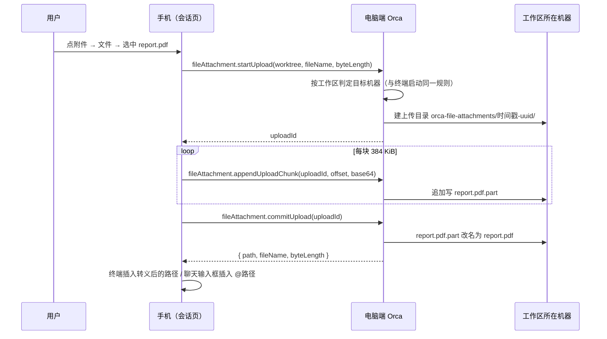

# 移动端文件附件上传方案

需求见 [requirements/移动端上传任意文件.md](../requirements/移动端上传任意文件.md)，现状见 [research/移动端附件上传现状与技术链路.md](../research/移动端附件上传现状与技术链路.md)。

## 1. 一句话方案

手机按块把文件发给电脑端；电脑端按工作区判定文件该落在哪台机器，边收边写进那台机器的上传临时目录，最后返回绝对路径；手机再把路径交给终端或 agent。新增一组专用 RPC `fileAttachment.*`，图片的旧通道原样保留，只在旧电脑端上兜底图片。

## 2. 总体流程

失败或中断时手机调 `fileAttachment.abortUpload`，电脑端删掉整个上传目录；连不上就由过期清扫兜底。

## 3. 每件事在哪台机器上

规则只有一条：**文件和上传目录都在工作区所在的机器上**。工作区在本机时就是运行 Orca 的电脑；在 SSH 主机上时就是那台远程机器，电脑端只是转发。

| 事项 | 所在机器 | 说明 |
| --- | --- | --- |
| 选择文件、按块读取 | 手机 | 原生会话页用 `expo-document-picker` + `expo-file-system`；网页版会话页经手机壳桥接接口 |
| 判定目标机器 | 电脑端 | `runtime.showTerminalWorkspaceLaunchScope(worktree)`，与该工作区终端 PTY 的启动位置一致；git worktree、文件夹工作区、浮动终端都适用 |
| 上传槽位（uploadId、偏移、过期计时） | 电脑端内存 | 不落盘，最多 4 个并发，5 分钟无活动过期 |
| 上传目录与文件 | 工作区所在机器 | 本机：`{系统临时目录}/orca-file-attachments-{uid}/{时间戳}-{uuid}/{文件名}`，根目录 0700；SSH：`{远程临时目录}/orca-file-attachments/{时间戳}-{uuid}/{文件名}`，远程临时目录取自 relay `fs.tempDir` |
| 过期清扫 | 工作区所在机器 | 电脑端在每次 `startUpload` 时对该机器发起，按目录名里的时间戳判断，同一机器 1 小时最多一次 |
| 端口、环境变量、配置 | 无 | 不新增任何端口、环境变量或配置项 |

SSH 主机未连接时 `startUpload` 直接返回「远程主机未连接」，不触发重连；上传中途断开时当前块失败，手机提示失败，残留目录由下次清扫删除。`runtime:` 托管的工作区不在本方案范围：手机直接与那台运行时配对，对它来说就是本机。

## 4. 电脑端：`fileAttachment.*`

### 4.1 方法

| 方法 | 参数 | 返回 | 行为 |
| --- | --- | --- | --- |
| `fileAttachment.startUpload` | `worktree`、`fileName`、`byteLength`、`mimeType?` | `{ uploadId, maxChunkBase64Chars }` | 校验大小 ≤ 100 MiB；判定目标机器；清洗文件名；建上传目录；建空的 `.part` 文件 |
| `fileAttachment.appendUploadChunk` | `uploadId`、`offset`（已收字节数）、`contentBase64` | `{ receivedBytes }` | 偏移必须等于已收字节；块按 4 字符对齐校验；追加写；刷新过期计时 |
| `fileAttachment.commitUpload` | `uploadId` | `{ path, fileName, byteLength }` | 已收字节必须等于声明大小；`.part` 改名为最终文件名；释放槽位 |
| `fileAttachment.abortUpload` | `uploadId` | `{ aborted }` | 删除上传目录；槽位不存在时也返回成功 |

- 参数 schema 用 `z.strictObject` 以外的普通对象，新增可选字段对旧主机安全；返回值用对象而不是裸字符串，便于以后加字段。
- 槽位按移动端 clientId 绑定归属，别的客户端拿着 uploadId 也无法续写或提交（与 `clipboard.*` 一致）。
- 同一槽位的追加串行执行，避免重发的块交错写入。
- 每块最大 512 KiB base64（384 KiB 字节），与剪贴板图片上传一致，不改变现有帧大小上限。

### 4.2 文件名

- 去掉路径分隔符、控制字符和 Windows 保留字符（`\ / : * ? " < > |`），首尾的空格和点去掉，Windows 保留名（`CON`、`NUL` 等）加下划线前缀，UTF-8 超过 120 字节时截断主名、保留扩展名。
- 清洗后为空或手机拿不到原名时，按 MIME 生成 `attachment.{扩展名}`（如 `application/pdf` → `attachment.pdf`），未知类型为 `attachment.bin`。
- 每次上传独占一个目录，所以同名文件不会互相覆盖（REQ-002 验收 3）。

### 4.3 写入

- 本机：`fs.appendFile`，根目录用 `src/main/window/owned-temp-staging-root.ts` 的 `getOwnedTempStagingRoot / ensureOwnedTempStagingRoot` 保证是当前用户私有目录。
- SSH：`requireSshFilesystemProvider(connectionId)` 后用 `createDir`、`writeFileBase64Chunk(path, chunk, append)`、`rename`、`deletePath(dir, true)`。
- 内存：任何时刻只持有一个块；100 MiB 文件不会在电脑端内存里成形（REQ-004 规则 1）。

### 4.4 过期清扫（REQ-006）

- 保留期 7 天（需求 Q-1 待确认，单一常量）。
- 本机复用 `sweepExpiredOwnedDirectories`；SSH 用 `readDir` 列出根目录下名字形如 `{时间戳}-{uuid}` 的子目录，时间戳早于保留期的 `deletePath(recursive)`。其他名字一律不碰。
- 清扫失败只记日志，不影响上传。

### 4.5 注册

- 方法定义放在 `src/main/runtime/rpc/methods/file-attachment-upload.ts`（参数目录生成器只收录 `rpc/` 下文件引用的 shared 模块），实现放 `src/main/file-attachment-upload/`。
- 接缝：`src/main/runtime/rpc/methods/index.ts` 展开方法组；`runtime-rpc-mobile-method-allowlist.ts` 放行 4 个方法；重新生成 `rpc-params-catalog.generated.ts`。

## 5. 手机端

### 5.1 入口（REQ-001）

- 终端输入栏和聊天输入框的附件按钮改为回形针图标，点按弹出底部菜单「Photo / File」。
- 「Photo」走现有相册流程，不改。
- 「File」走新流程；终端输入栏原来的「长按选文件」保留为同一新流程的快捷方式。
- 菜单用现有 `ActionSheetModal`，选项设 `closeBeforePress`，先关菜单再开系统选择器（iOS 不能在弹层上再叠选择器）。

### 5.2 选择与读取

| 会话页形态 | 选择 | 读取 | 文件名 | 上限 |
| --- | --- | --- | --- | --- |
| 原生会话页 | `DocumentPicker.getDocumentAsync({ type: '*/*' })`，终端单选、聊天多选 | `expo-file-system` 文件句柄按 384 KiB 读，读一块发一块 | 系统给的原名 | 100 MiB |
| 网页版 + 新手机壳 | 新桥接接口 `native.file.pick` | `native.file.read` 按偏移读 | 手机壳返回原名 | 100 MiB |
| 网页版 + 旧手机壳 | 现有 `native.media.pick({ source: 'files' })` | 现有 `native.media.read` | 按 MIME 生成 | 约 18 MiB（手机壳暂存上限），超出时提示更新 App |

### 5.3 上传客户端

- `mobile/src/file-attachment-upload/` 下用 `defineRpcOperation` 定义 4 个操作，回复用 schema 校验。
- 上传前就检查大小，超过 100 MiB 直接提示，不发请求（REQ-004 验收 2）。
- 任何一步失败都调用 `abortUpload` 并忽略其结果，再把原因给到界面。
- 旧电脑端识别：`startUpload` 返回 `forbidden` / `method_not_found` 时（`isMobileMethodUnavailableError`）：
  - 选中的是可作为图片附件的图片（`.png .jpg .jpeg .gif .webp`）且不超过 18 MiB：改走现有 `saveMobileClipboardImageAsTempFile`；
  - 其余：提示 "Update Orca on your computer to attach files"，**绝不**把非图片送进图片通道（REQ-005）。

### 5.4 交给终端或 agent（REQ-003）

| 场景 | 可作为图片附件的图片 | 其他文件 |
| --- | --- | --- |
| 终端 | 与现在的图片一致：bracketed paste 包裹 `formatAgentImagePath(agent, path)` | `shellEscapePath(path, 目标 shell) + ' '`，`enter: false`；目标 shell 由路径形态判断（Windows 绝对路径用 Windows 规则） |
| 聊天 | 进「待发图片」，与相册图片一样随消息发送 | 在输入框草稿末尾插入 `formatNativeChatFileReference(path) + ' '`（`@路径`），不进附件列表 |

- 「可作为图片附件」只认结构化 Claude 能读的五种扩展名，HEIC、SVG 等按普通文件处理，避免发送时报 `unsupportedType`。
- 路径转义函数在桌面 renderer 里，手机无法引用；在 `src/shared/file-attachment-upload/` 放一份同样规则的实现，并加一个对照测试，逐例比对桌面版输出，防止两份漂移。
- 聊天的「待发图片」需要一个能把已上传图片放进去的入口：在 `use-mobile-native-chat-image-attachments.ts` 的返回值里暴露已有的 `addUploadedImages`（接缝，一行）。

### 5.5 进度与状态

- 上传中复用现有的发送中转圈（终端按钮、聊天附件按钮），期间按钮不可再点。
- 失败提示用现有 toast：超限、旧电脑端、远程主机未连接、断网、其他失败分别给出可读文案。

## 6. 手机壳：新桥接接口

| 接口 | 参数 | 返回 | 说明 |
| --- | --- | --- | --- |
| `native.file.pick` | `{ multiple }` | `{ items: [{ handle, name, mime, byteLength }] }` | `DocumentPicker` `*/*`；单个文件超过 100 MiB 整次拒绝 |
| `native.file.read` | `{ handle, offset, length }` | `{ base64, eof }` | 偏移上限 100 MiB，单次长度上限与 `native.media.read` 相同 |
| `native.file.release` | `{ handle }` | `{ released }` | 删除暂存文件 |

- 句柄管理复用 `MediaHandleRegistry`（独立实例，各自 8 个句柄、5 分钟过期），文件名在功能侧按句柄另存。
- 选择器返回的不是本 App 缓存里的文件时直接拒绝，不做整文件拷贝（现有 `copyIntoCache` 会把整个文件读进内存，100 MiB 不可接受）。`copyToCacheDirectory: true` 下两个平台都返回缓存副本，这一分支只是兜底。
- 会话路由在 `mobile-web-page-routes.mjs` 的 `optionalGrants` 加这三个接口：旧手机壳不支持也照常渲染网页版，页面据 `getShellSession().grants.native` 选择新旧接口。
- 新接口名字遵守 `native(?:\.[a-z][a-z0-9]*){2,}`。

## 7. 新旧版本组合

| 手机壳 | 会话页（随电脑端） | 电脑端 | 结果 |
| --- | --- | --- | --- |
| 新 | 网页版新 | 新 | 完整功能：原名、100 MiB |
| 旧 | 网页版新 | 新 | 文件可传，约 18 MiB，名字按类型生成；超限提示更新 App |
| 新 | 网页版旧 | 旧 | 与现在一致（旧页面不认识新接口，也不会调用） |
| 新 | 原生页新 | 旧 | 图片照旧；非图片提示更新电脑端 |
| 旧 | 原生页旧 | 新 | 与现在一致 |

## 8. Fork 登记

- 功能 id：`mobile-file-attachment-upload`；策略 id 同名。
- 自有路径：`src/shared/file-attachment-upload/**`、`src/main/file-attachment-upload/**`、`src/main/runtime/rpc/methods/file-attachment-upload*.ts`、`mobile/src/file-attachment-upload/**`、`docs/issue/移动端上传任意文件/**`。
- 上游接缝（每个都只做注册或一处替换）：

| 文件 | 改动 |
| --- | --- |
| `src/main/runtime/rpc/methods/index.ts` | 展开 `FILE_ATTACHMENT_UPLOAD_METHODS` |
| `src/main/runtime/runtime-rpc/runtime-rpc-mobile-method-allowlist.ts` | 放行 4 个方法 |
| `src/shared/rpc-contract/rpc-params-catalog.generated.ts` | 重新生成 |
| `mobile/src/session/use-mobile-session-attachments.ts` | 调用功能 hook，把结果并进返回值 |
| `mobile/src/session/MobileSessionCommandDock.tsx` | 附件按钮改为打开菜单，挂载菜单 |
| `mobile/src/session/MobileTerminalInputActions.tsx` | 图标与无障碍标签 |
| `mobile/src/session/MobileNativeChatOverlay.tsx` | 附件按钮改为打开菜单，挂载菜单 |
| `mobile/src/session/MobileNativeChatComposer.tsx` | 图标与无障碍标签 |
| `mobile/src/session/use-mobile-native-chat-image-attachments.ts` | 返回值暴露 `addUploadedImages` |
| `mobile/src/session/mobile-session-route-parity.test.ts` | 重新固定基线 |
| `mobile/src/mobile-web-shell/bridge/bridge-native-verbs.ts` | 登记 3 个新接口 |
| 手机壳接口分发处 | 把新接口交给功能侧处理器 |
| `config/scripts/mobile-web-page-routes.mjs` | 会话路由 `optionalGrants` |
| 网页包门禁脚本与测试 | 重新测量 |

实际接缝以实现为准，落地后同步更新 `config/fork-features.jsonc` 与本节。

## 9. 测试

- 电脑端单测：本机写入、SSH（假 provider）写入、文件夹工作区、浮动终端；偏移乱序、超限、归属校验、过期、abort 清理、提交时大小不符；文件名清洗；过期清扫只删自有目录。
- 手机端单测：大小预检、按块上传与 abort、旧电脑端回退两支、终端与聊天交付文本、路径转义与桌面对照、网页版新旧接口选择。
- 门禁：`pnpm tc`、`mobile-rpc-allowlist.test.ts`、参数目录生成校验、`check:fork-features`、`check:fork-docs`、`check:architecture-policies`、网页包门禁。
- 真机：本机工作区与 SSH 工作区（本机 `127.0.0.1:2222` sshd）各跑一遍；Claude Code 终端会话上传 PDF 并让其总结；普通 shell 上传 ZIP 并 `unzip -l`；90 MiB 文件；断网中断；旧电脑端回退。用例写入 `tests/cases/`，执行记录写入 `tests/runs/`，证据放 `.docs/mobile-file-attachment-upload-ui-validation/{日期}/`。

## 10. 风险

| 风险 | 应对 |
| --- | --- |
| Claude Code 读取工作目录外文件时弹权限确认（Q-2） | 真机验证；若影响明显，把目录改到工作区内被忽略的位置，只改电脑端一处 |
| 网页版会话页在旧手机壳上只有 18 MiB 与生成名 | 明确提示更新 App；需求 REQ-005 规则 3 已覆盖 |
| 远程为 Windows 主机时路径风格 | 拼接按返回的临时目录风格选择 `posix` / `win32`，单测覆盖 |
| 会话路由文件被上游频繁修改，接缝冲突 | 接缝只做「替换一个回调」级别的改动，`mustContain` 兜底 |

## 11. 工作包

1. 登记：功能清单、策略、`.gitignore`、本目录文档。
2. 电脑端：shared 契约与文件名、上传槽位与写入、清扫、RPC 注册与白名单、单测。
3. 手机端核心：RPC 操作、上传客户端、交付文本、原生选择器、hook、菜单与接缝、单测。
4. 网页版：页面侧选择器、手机壳新接口、路由授权、门禁重测。
5. 验证：门禁全套、本机与 SSH 真机、journal 与测试记录。
