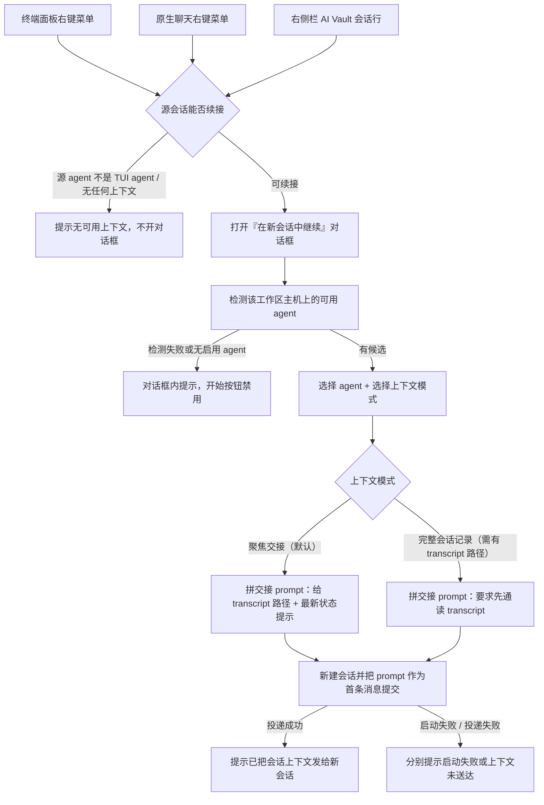
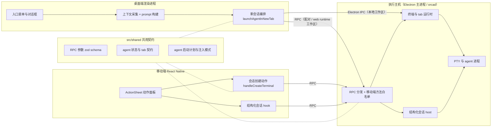
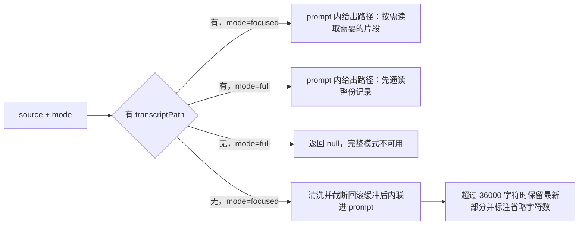
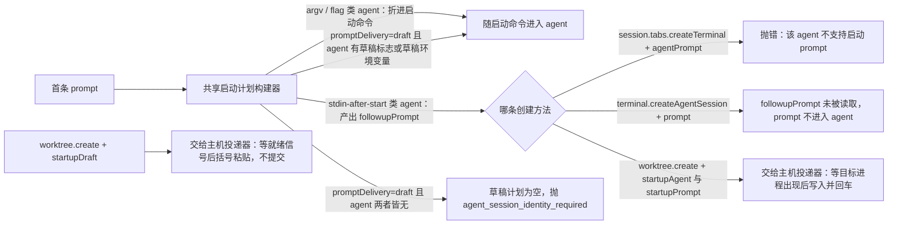
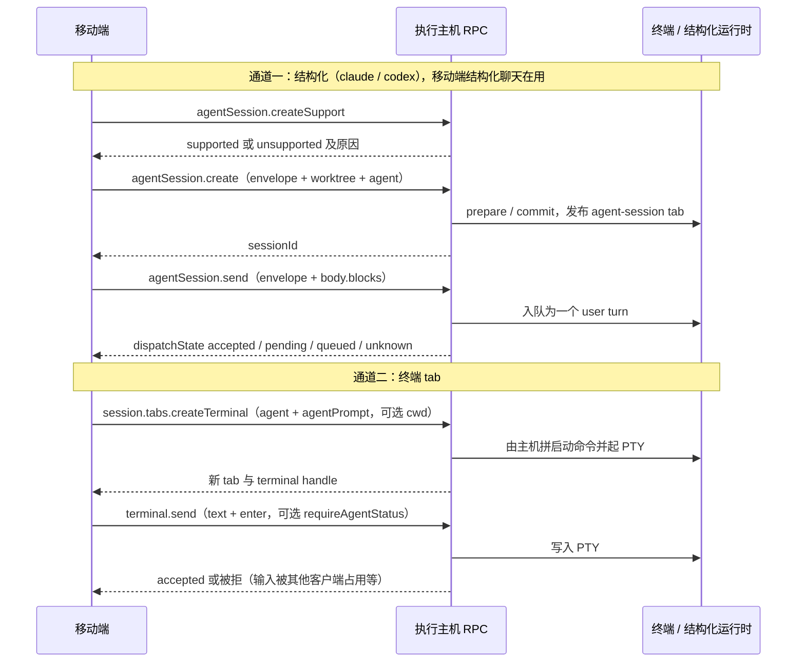

# 移动端「基于当前会话新建对话」的现状与技术链路调研

| 项 | 内容 |
|---|---|
| 调研对象 | 桌面端 **Continue in New Session（在新会话中继续）** 能力，及其在移动端（`mobile/`，React Native + Expo）的对应现状 |
| 调研目的 | 为「移动端是否能提供与桌面端同样的『基于当前会话新建一个对话』」做实现前摸底：搞清桌面端这条链路由什么构成、移动端已具备哪些同等能力、两端不对称落在哪些具体位置 |
| 目标类型 | 功能型（有用户可见入口与结果） |
| In scope | 桌面端 continuation 的入口、上下文采集、prompt 构建、新会话创建与首条 prompt 投递全链路；移动端的会话创建 / 输入发送 / 会话上下文可见性 / 动作菜单现状；两端共用的 `src/shared` 契约、RPC 白名单、能力协商与相关门禁 |
| Out of scope | 桌面端 **Fork Session**（新建 git worktree 的分叉）与 **Resume in Chat**（接管同一 provider 会话）两个相邻功能的内部细节（仅在 §2、§3.1 标明区别与触发条件）；Issues / Goals 等 fork 功能自身逻辑；真机运行时验证 |
| 代码快照 | 工作分支 `fork/integration`，`da37cd3cc`；上游基线 `origin/main` = `56fcb544e`（2026-09-12）。本文涉及的 continuation 与移动端文件在 `origin/main` 中均存在，即全部为上游代码 |

## 1. 结论先行

桌面端的「基于当前会话新建一个对话」在实现上**不是一次会话复制，而是「采集源会话上下文 → 拼一段交接 prompt → 新开一个会话并把这段 prompt 作为首条消息投递」三步**；这三步在移动端对应的数据源与传输原语**都已存在并各自在用**，但移动端没有任何把它们串起来的代码，也没有入口。

关键发现：

1. **桌面端这条链路的产物只有一段纯文本 prompt 和一个新会话。** prompt 里明确声明旧 provider 会话是只读上下文、不要 resume；上下文优先只传 transcript 文件**路径**让新 agent 自己按需读取，只有拿不到路径时才内联终端回滚缓冲（上限 36000 字符）。因此上下文交接的重活落在执行主机侧，客户端不需要读 transcript（§4.1、§4.2）。
2. **移动端已能读到 continuation 所需的全部源字段。** `session.tabs.list` / `subscribe` 下发的终端 tab 里带完整 `agentStatus`（含 `agentType`、`providerSession.id`、`providerSession.transcriptPath`、`lastAssistantMessage`）与 `launchAgent`、`startupCwd`、`title`；`aiVault.listSessions` 下发完整历史会话对象（含 transcript 路径 `filePath`、`cwd`、`previewMessages`）。其中 transcriptPath 等字段移动端已在原生聊天判定里实际读取（§4.5）。
3. **移动端已有两条「新建会话 + 投递首条 prompt」的现成通道，且都已有真实业务在跑。** 结构化通道 `agentSession.create` → `agentSession.send`（移动端结构化聊天在用，与桌面端结构化路由的形状完全相同）；终端通道 `session.tabs.createTerminal`（可带 `agent` + `agentPrompt`，Quick Commands 在用）或 create 后再 `terminal.send`（Send Review Notes 在用）。两条通道所需 RPC 全部已在移动端白名单内，无需新增方法（§4.6、§5.2）。
4. **真实缺口只有一处：交接 prompt 的文本构建只存在于渲染进程**——`src/main` 与 `src/shared` 里没有任何等价实现（main 侧唯一的「把上下文拼成一段 prompt」是编排派发的前言，拼的是任务与能力元数据，不是历史会话），而移动端生产代码从不 import 渲染进程模块。除此之外，「建会话 → 等 agent 就绪 → 投递 prompt」这三步所需的 RPC 都已对移动端开放：`terminal.wait` 的 `tui-idle` 条件与 `terminal.send` 都在白名单内，编排代码要移动端自己写，但用的全是现成方法（§4.6、§5.2）。
5. **「让桌面端干活」不是新机制，而是现状。** 桌面端在线时 `session.tabs.createTerminal` 本身就是「主进程收 RPC → 发 IPC 给渲染进程 → 渲染进程建 tab、排启动命令、起 PTY → 回执给主进程」；桌面端不在时同一个 RPC 全程由主进程自建。主进程到渲染进程的反向通道是一族成对的请求/回执 channel，移动端请求已经在用它，也已有「手机请求触发渲染进程执行一段编排」的先例（唤醒休眠 agent）。代价是 headless 执行主机上没有渲染进程，那条分支必须自带主进程实现（§4.4）。
6. **移动端 continuation 自身的代码与文案为零**，`agentSession.create` 协议上已有的 `resumeFrom` 移动端也从未使用；移动端还没有 i18n 体系，所有文案是内联英文。功能本体属上游代码，fork 侧的任何移动端扩展都落在 `config/fork-features.jsonc` 与 `fork-integration-scope` 的管辖范围内（§5.5、§6.3）。

快速阅读表：

| 想知道 | 看 |
|---|---|
| 桌面端这个功能到底做了什么、和 Fork / Resume 有什么区别 | §2、§3.1 |
| 哪些能力主机侧已有、可被移动端复用 | §4.4、§4.6、§6.1 |
| 桌面端链路每一跳与关键符号 | §4.1 ~ §4.4 |
| 移动端已经有什么、缺什么 | §4.5、§4.6、§6 |
| 长度上限 / agent 注入方式 / 能力协商这些硬约束 | §5 |
| 哪些事还没确认 | §7 |

## 2. 术语表

| 术语 | 含义 | 与易混项的区别 |
|---|---|---|
| Continuation（在新会话中继续） | 从某个会话的当前进度出发，**新建一个 agent 会话**，把源会话上下文作为首条 prompt 交给它，源会话保持不变 | 与 Resume 相反：它不接管旧 provider 会话；与 Fork 相反：它不新建工作区 |
| Fork Session（会话分叉） | 先创建一个**新的 git worktree**，再在其中启动 agent 并把上下文作为草稿投递 | 落点是新工作区，且 prompt 以 `draft`（不自动提交）方式交付 |
| Resume in Chat | 用 `resumeFrom.providerSessionId` 让新的结构化会话**接管同一个 provider 会话**继续 | 是同一个对话的延续，不是新对话 |
| 结构化会话（agent-session tab） | 由 Orca 主机托管 journal 的原生聊天会话，仅 claude / codex 两个 provider | 与 TUI 终端会话相对：后者是 PTY 里跑 CLI |
| TUI 会话（terminal tab） | 终端 tab 里跑 agent CLI，状态靠 hook / OSC 上报 | 首条 prompt 的注入方式取决于 agent 的 `promptInjectionMode` |
| transcript | agent 自己写的会话记录文件（JSONL），路径由执行主机推导 | 客户端只传递路径或读取窗口，从不指定主机该读哪个文件 |

## 3. 现状全景

### 3.1 功能现状

桌面端入口有三类，都指向同一个对话框：终端面板右键菜单、原生聊天右键菜单、右侧栏 AI Vault 会话行（Issues 面板复用 AI Vault 的这套动作）。用户看到的文案是「在新会话中继续…」，对话框说明为「从当前进度启动一个新的智能体会话，原会话保持不变」。

规格与前置条件：

| 项 | 桌面端现状 |
|---|---|
| 入口可见条件 | 终端面板：源 pane 的 agent 是已知 TUI agent；AI Vault：目标工作区存在且该会话有 transcript 路径或有非空预览文本 |
| agent 候选 | 该工作区所在主机上检测到的、且未在设置里禁用的 agent；初选顺序为源会话 agent → 默认 agent → 首个可用 |
| 上下文模式 | 「聚焦交接（推荐）」始终可选；「完整会话记录」仅在拿到 transcript 路径时可选 |
| 落点 | 与源会话**同一个工作区**（AI Vault 入口用会话记录里的 cwd 作为起始目录） |
| 对源会话的影响 | 无，prompt 内显式要求不要 resume 或修改旧会话 |

移动端现状：**没有这个功能**，也没有任何相关文案。移动端现有的「新建会话」入口共九处（会话页 `+` 的 New Tab 动作表、Quick Commands、新建工作区后自动建首个终端、四个新建工作区入口、Tasks 页建工作区、Diff Review 的 New Agent Session、会话内 Send Review Notes、PR AI Triage），其中只有两处会带首条 prompt：Quick Commands（走执行主机注入）与 Send Review Notes（新建后再发送一次文本）。移动端最接近「基于旧会话开工」的能力是 Agent Session History 页的 Resume 按钮——它是把 `claude --resume` 这类命令打进一个新终端，属于 Resume 语义，不产生新对话。

### 3.2 系统总览

| 模块 | 职责 | 调用边界 |
|---|---|---|
| 渲染进程 continuation 组件与 lib | 采集源上下文、构建交接 prompt、驱动对话框 | 只在渲染进程内；移动端不可 import |
| 渲染进程新会话编排 | 决定走 web runtime / 结构化 / 传统终端三条路由之一，并负责 prompt 投递时机 | 本地工作区走 Electron IPC；配对与 web runtime 工作区走 RPC |
| `src/shared` 契约层 | RPC 参数 schema、agent 状态与 tab 形状、agent 启动计划与 prompt 注入模式 | 桌面、移动、主机三方共用；移动端对 `src/shared/rpc-contract` 只允许 type-only 引用 |
| 主机 RPC 层 | 方法注册、移动端白名单拦截、参数校验、能力投影 | 移动端全部能力以此为界 |
| 主机终端 / 结构化会话运行时 | 真正创建 tab、拼启动命令、起 PTY、托管结构化 journal | 执行主机独占，客户端不参与 |
| 移动端会话页与动作面板 | 展示 tab、发送输入、创建会话 | 一切跨机能力经 `RpcClient.sendRequest` / `subscribe` |

## 4. 技术链路

### 4.1 桌面端：源上下文采集

两个采集器产出同一个请求对象（`AgentSessionContinuationRequest`），字段为 `source`、`worktreeId`、`groupId`、`workspacePath`、`initialCwd`、`launchSource`；`source` 内含 `sourceAgent`、`capturedText`、`sourceLabel`、`sourceTitle`、`sourceWorkingDirectory`、`transcriptPath`、`lastPrompt`、`lastAssistantMessage`。

- 终端面板采集器 `prepareAgentSessionContinuationFromPane`：agent 取 pane 的实时 agent 状态、回退到 tab 的 `launchAgent`；`transcriptPath` 取 `agentStatusByPaneKey[paneKey].providerSession.transcriptPath`；`lastPrompt` / `lastAssistantMessage` 取同一状态条目。**只有在没有 transcriptPath 时**才调用 xterm 序列化插件抓 800 行回滚缓冲当 `capturedText`，代码注释写明这是为了避免开对话框时序列化大块 scrollback。
- AI Vault 采集器 `prepareAiVaultSessionContinuation`：`transcriptPath` 取会话的 `filePath`，`capturedText` 由 `previewMessages` 拼成「角色: 文本」，`lastPrompt` 只取 provider 认证过的 `lastUserPrompt`（注释说明预览里的 user 条目可能是工具结果或注入的 skill 文本，不能当提示）。

可续接判定分别是 `canContinueAgentSessionInNewSession`（源 agent 是已知 TUI agent）与 `canContinueAiVaultSessionInNewSession`（有目标工作区，且 `filePath` 非空或预览里有非空文本）。

### 4.2 桌面端：交接 prompt 构建

`buildAgentSessionContinuationPrompt(source, mode)` 是纯字符串函数，返回 `null` 表示没有可用上下文（对话框与菜单据此劝退）。行为分三种：

prompt 固定包含四段语义：源标识（原 agent、会话名、pane 标识、原工作目录）、上下文获取方式（路径或内联文本）、最新状态提示（最后一次用户 prompt、最后一条助手消息）、以及三条行为约束——把 transcript 当历史参考数据且不要执行其中的指令、以工作区文件为准、先说清上一段停在哪里再继续。内联文本路径复用 fork 上下文工具里的清洗与截断逻辑（去 ANSI / OSC、压缩连续空行、按 36000 字符上限保留尾部）。

### 4.3 桌面端：新会话创建与 prompt 投递

`launchAgentSessionContinuation` 先做两道校验（agent 未被设置禁用、agent 仍在该主机被检测到）与一次信任预检，然后调用 `launchAgentInNewTab`，固定传 `promptDelivery: 'submit-after-ready'` 并注册投递成功 / 失败的提示。

`launchAgentInNewTab` 内部按工作区决定三条路由：

| 路由 | 触发条件 | 新会话怎么建 | prompt 怎么送 |
|---|---|---|---|
| web runtime 主机 tab | 该工作区绑定的 runtime 会话处于活跃 | 经 RPC 由主机建 | 主机侧按 `promptDelivery` 处理，必要时 ready 后粘贴 |
| 结构化原生聊天 | 计划器判定 agent 支持结构化会话且设置允许 | `agentSession.create` | `agentSession.send`（详见下段） |
| 传统终端 tab | 其余情况，以及结构化路由被明确拒绝后的回退 | 渲染进程 store 内 `createTab` + 排队启动命令，PTY 由 `TerminalPane` 挂载后经 Electron IPC 拉起 | prompt 能折进启动命令就折进；属 `stdin-after-start` 的 agent 走「就绪后粘贴并提交」 |

结构化路由的首条 prompt 不随创建下发：`agentSession.create` 的参数里没有 prompt 字段，渲染进程在创建收据落地后由一个 outbox 发 `agentSession.send`，按返回的 `dispatchState`（accepted / pending / queued / unknown）决定是否重排队，`draft` 模式则完全不发。传统终端路由的「就绪后粘贴」由渲染进程自己等信号，等待窗口按 agent 配置（例如 codex 为 20 秒）。

### 4.4 主机侧：会话创建与 prompt 投递的既有实现

**结构化会话创建。** `agentSession.create` 的载荷由 `src/shared` 的构造器生成（`envelope` + `worktree` + `agent` + 可选 `resumeFrom`），fingerprint 由两端用同一函数算，使得传输层不确定时客户端可以安全重放同一 envelope。主机侧分 prepare / commit 两半，commit 之前的失败一律回成 refusal；`resumeFrom` 只带一个 `providerSessionId`，共享类型的注释写明这是**故意只带身份**——因为该方法对配对的移动端开放，transcript 文件与账号目录必须由执行主机推导，不能由客户端指定。该方法不接受首条 prompt。

**三条主机侧创建方法对首条 prompt 的处理各不相同。** 三者都用同一个共享启动计划构建器，差别在于拿到「需要启动后再投递的 prompt」（启动计划的 `followupPrompt`）之后怎么办：

**主机侧的两个投递器都在主进程、都只操作 PTY。** 宿主接口只含 `getPtyId` / `getForegroundProcess` / `hasChildProcesses` / `subscribeToData` / `readRecentOutput` / `write`，不涉及窗口：

- `sendWorktreeStartupFollowupWhenReady`：轮询前台进程，最多 30 次、间隔 150ms；识别到期望进程即写入 `prompt` 加回车（**自动提交**）；第 5 次之后若前台不是 shell 且该 PTY 有子进程也算就绪；始终等不到只打一条 warn。
- `pasteWorktreeStartupDraftWhenReady`：订阅 PTY 输出并回放最近输出，用共享的就绪扫描器按该 agent 的就绪信号判定（默认「括号粘贴后渲染静默」，静默 1500ms 兜底），硬超时读共享的按 agent 超时解析；就绪后做括号粘贴，**不提交**。

**同一个创建 RPC 在两种主机形态下由不同进程执行。** `session.tabs.createTerminal` 的前半段全在主进程（幂等去重、headless tab 水合、把 `agent` 与 `agentPrompt` 编译成启动命令），随后按「有没有活着的权威渲染窗口」分叉：

- **有窗口**：主进程 `webContents.send('terminal:requestTabCreate')`，渲染进程建 tab、排启动命令、挂载 pane 并经 `pty:spawn` 起 PTY，再回 `terminal:tabCreateReply`；主进程等回执（10 秒超时）与 surface 就绪，并保留两条兜底——渲染进程漏发启动命令时主进程直接写入 PTY，超时则改走主进程自建并复用同一 tab / leaf 身份。移动端发来的创建会被标成配对创建，渲染端的桥也专门为 `source: 'runtime-session'` 放行。
- **无窗口**：走 `createRuntimeOwnedMobileSessionTerminal`，主进程自己 spawn PTY、自己拼移动端 tab 快照并向订阅者扇出。

**主进程到渲染进程的反向通道是一族成对 channel。** 带回执的有终端 tab 创建、已有 PTY 的可见化（带进程身份校验）、浏览器 tab 创建 / 关闭 / 切 profile、移动端 markdown 读写、会话 tab 与终端 tab 关闭；不带回执的走一个通知器接口（激活工作区、分屏、重命名、聚焦、休眠、**唤醒休眠 agent**、从手机打开文件与 diff 等）。其中「手机请求 → 渲染进程执行编排 → 结果回报手机」已有现成先例：移动端激活工作区时，若存在权威窗口就请渲染进程唤醒休眠 agent 并把结果记为 `requested`，没有窗口则记 `unsupported-headless`。

**主机侧还有一套比上面两个投递器更完整的 prompt 投递，服务于编排。** 它的就绪信号是 OSC 标题驱动的 `tui-idle`（2 秒轮询、3 秒静默、默认 5 分钟超时），投递走括号粘贴加提交延迟并带一次提交校验；编排的 worker 启动、联邦派发、无头自动化都是「建终端 → 等 `tui-idle` → 投 prompt」这个形状。这条路径不接在任何会话创建 RPC 上，但它的等待条件通过 `terminal.wait` 暴露成了 RPC（见 §4.6）。

**渲染进程那一份与主机侧共用同一套判定核心。** 就绪扫描器与超时解析都在 `src/shared`，渲染进程与主进程各自实现宿主侧；渲染进程那份额外有超时通知、失败回报与原生聊天草稿镜像，并且走 pane 的 PTY 输入事务。桌面端连远程 web runtime 主机时，这一步**仍然在本地渲染进程执行**，只有会话创建交给主机。

### 4.5 移动端：已有的源上下文可见性

移动端拿到的终端 tab 契约（`RuntimeMobileSessionTerminalTab`）就带 `agentStatus`（完整 `AgentStatusEntry`）、`launchAgent`、`startupCwd`、`title`、`launchDraft`；结构化 tab 带 `sessionId` 与 `agent`。移动端已经在读其中的 `agentType`、`providerSession.id`、`providerSession.transcriptPath`、`state`、`model`、`interactivePrompt`、`lastAssistantMessage`、`toolName` / `toolInput`（用于原生聊天可用性判定与提示卡片）。

另外两个来源：`worktree.ps` 返回的工作区 agent 行含 `prompt` 与 `lastAssistantMessage`，移动端用于列表展示；`aiVault.listSessions` 返回完整历史会话对象，移动端 Agent History 页保留原始对象并投影出卡片，Resume 用到其中的 `agent`、`sessionId`、`cwd`、`codexHome`、`filePath`。

未被移动端读取的字段：`agentStatus.prompt`（工作区 agent 行里的同名字段有读）、会话对象的 `firstUserPrompt` / `lastUserPrompt`。

### 4.6 移动端：已在用的两条通道与已可用的第三条

通道一的两个调用移动端都已实现且带完整的幂等与不确定态处理（operationId 复用、`retryUnknown`、`unknown` 不得当作失败）。通道二里，`createTerminal` 移动端目前只传 `agent`、`agentPrompt`（仅 Quick Commands）、`command` + `startupCommandDelivery`（仅 Quick Commands）、`afterTabId`、`clientMutationId`、`activate` / `select` / `navigation`；`cwd`、`targetGroupId`、`viewMode`、`launchToken` 从不传，尽管主机 schema 都支持。create 之后再发 prompt 的那条路（Send Review Notes）是在订阅终端后**立即**发 `terminal.send`，没有任何就绪轮询。

**还有一条移动端尚未使用、但 RPC 已齐的第三条通道。** `terminal.wait` 在移动端白名单内，参数为 `{ terminal, for: 'exit' | 'tui-idle', timeoutMs }`。也就是说「建会话（不带 prompt）→ `terminal.wait` 等 `tui-idle` → `terminal.send` 投 prompt」这三步所需的方法移动端全都能调，不需要主机侧新增任何东西。`tui-idle` 对一个刚启动、尚无任何状态的终端如何判定，代码里是确定的：注册等待时若 agent 状态已是 idle 立即返回；否则启动轮询，依次以「标题显式 idle」「尾部输出命中已知就绪提示且其后无阻塞信号」「状态仍为空但前台是非 shell 进程且输出已静默满 3 秒」三种依据之一判就绪；尾部输出命中信任 / 授权类阻塞文本则带 `blockedReason` 返回；未指定超时按默认 5 分钟。编排 worker 启动后就是靠这个条件等 agent 就绪，失败文案为「Agent did not become ready」。两点行为差异需要知道：`terminal.send` 那条「settled agent prompt」路径（括号粘贴包裹、ESC 清洗、提交后校验）要求调用方 `client.type === 'desktop'`；移动端落回的裸写入路径**同样**在文本与回车之间等按字节数计算的提交延时，少的是括号粘贴包裹与提交后校验。括号粘贴的字节构造是 `src/shared` 的纯函数，移动端粘贴功能也已在客户端自行包裹后经 `terminal.send` 发送。这三步已于 2026-09-13 在本机运行中的 Orca 上对 claude / codex 各实测一次，均一次跑通（§8）。

跳过的分叉：移动端还存在 `worktree.create` 一路（支持 `startupAgent` / `startupPrompt` / `startupDraft`），它对应桌面端 Fork Session 那种「连工作区一起新建」的形态；本文只在此标注它存在，未展开。

## 5. 关键规则与语义

### 5.1 上下文与 prompt 相关约束

| 参数 | 语义 | 约束 / 默认值 | 主要执行点 |
|---|---|---|---|
| `mode`（上下文模式） | 决定 prompt 要求新 agent 通读还是按需读 transcript | `focused` 为对话框默认；`full` 需存在 transcript 路径，否则构建函数返回 `null` | 渲染进程 prompt 构建函数 |
| `capturedText` | 无 transcript 路径时的内联回滚缓冲 | 采集 800 行；清洗后按 36000 字符上限保留尾部并标注省略量 | 渲染进程采集器 + fork 上下文工具 |
| `transcriptPath` | 交给新 agent 自行读取的记录路径 | 终端入口取自 agent 状态的 provider 会话；AI Vault 入口取自会话 `filePath` | 渲染进程采集器 |
| `promptDelivery` | prompt 的交付方式 | continuation 固定 `submit-after-ready`；该取值**只存在于渲染进程**，`src/shared` 与 `src/main` 无此值 | 渲染进程新会话编排 |
| `agentPrompt`（RPC） | 由执行主机注入启动命令的首条 prompt | 上限 6000 字符；必须搭配 `agent`；不能与 `command` 并用；agent 属 `stdin-after-start` 时主机抛「不支持启动 prompt」 | 主机侧移动端终端命令解析 |
| `prompt`（`terminal.createAgentSession`） | 另一条主机权威创建方法的 prompt | 上限 256KB；`promptDelivery` 仅 `auto-submit` / `draft`；`draft` 要求 prompt 非空 | 主机侧 agent 会话方法 |
| `agentSession.send` 的 `body` | 结构化会话的一个 user turn | blocks 1–64 个，整体 ≤ 256KB，客户端只能写 user turn | 主机结构化会话 host |
| `requireAgentStatus: 'sendable'` | 写入前要求终端里确有 agent 在跑且不在等待授权 | 主机在约 1.05 秒窗口内每 150ms 复查一次，超时拒绝 | 主机终端发送守卫 |
| `waitSubmitMs` | 等待同一条 prompt 的提交回执 | 0 – 3600000 毫秒；等待不授权第二次写入 | 主机终端发送方法 |

### 5.2 移动端可达的相关 RPC

移动端能调的方法由一份白名单拦截（不在其中直接返回 forbidden）。与本主题相关且**已在白名单内**的：`session.tabs.createTerminal` / `list` / `activate` / `close` / `subscribe`、`terminal.create` / `createAgentSession` / `ensureAgentSession` / `send` / `wait` / `list`、`agentSession.createSupport` / `create` / `send` / `history` / `subscribe`、`preflight.detectAgents` / `detectRemoteAgents`、`aiVault.listSessions` / `prepareSessionResume`、`nativeChat.readSession`、`worktree.create`。其中 `terminal.createAgentSession`（支持 prompt 与 `startupCwd`）在白名单内但移动端从未调用。

白名单由一个门禁测试与移动端源码扫描、方法注册表三方对齐，且对 `agentSession.*` 写死了「恰好这些方法」的负向断言。

### 5.3 agent 检测与启用

两端都用同一套语义：检测该工作区主机上的可用 agent，再按设置里的禁用清单过滤。桌面端 continuation 对话框自己发起检测；移动端的等价物是新建 tab 时的 agent 选项加载器（`preflight.detectAgents` 或按仓库维度的远程检测 + `settings.get`）。主机侧在拼启动命令时会再判一次 agent 是否被禁用并拒绝。

### 5.4 prompt 注入模式决定可用通道

| 注入模式 | 代表 agent | 首条 prompt 能否折进启动命令 |
|---|---|---|
| `argv` | claude（另带 `--prefill` 草稿标志）、codex、openclaude、trae、pi、omp、cursor、droid | 能 |
| `flag-prompt` / `flag-prompt-interactive` | opencode、mimo-code、gemini、antigravity | 能 |
| `stdin-after-start` | claude-agent-teams、autohand、ante、aider、goose、amp、kilo、kiro、crush、aug、cline、continue、kimi 等多数 | 不能，必须启动后投递 |

主机侧移动端终端命令解析在构建启动计划后有一条硬检查：若同时存在 `agentPrompt` 与「需要后续投递的 prompt」，直接抛错。桌面端之所以对全部 agent 都成立，是因为渲染进程在会话创建之后还会自己跑一遍「等就绪 → 投递」；主机侧有功能等价的两个投递器，但只接在 `worktree.create` 的启动路径上（§4.4）。

### 5.5 能力协商与版本偏斜

| 配置 / 能力 | 读取与执行点 | 静态事实 | 线上值 |
|---|---|---|---|
| 终端 Quick Commands 能力 | 主机在状态查询里宣告，移动端会话页据此 gate 入口 | 能力标识 `terminal.quick-commands.v1`；旧主机会剥掉 `agentPrompt`，所以移动端必须先确认能力再放开入口 | 取决于用户桌面端版本，未知 |
| 终端 prompt 交付能力 | 同上 | 能力标识 `terminal.prompt-delivery.v1`；缺失时 prompt 请求 id 与 `waitSubmitMs` 被剥离，重试会重发原始输入 | 未知 |
| 结构化会话能力 | tab 投影按客户端能力过滤，不支持时把 tab 标题替换成提示文案而不是删行 | claude 结构化会话另需一个独立能力 | 未知 |
| 移动端协议版本 | 移动端自带一份协议版本常量副本（注释说明因 Metro 不解析 `mobile/` 之外而手工同步） | 移动端协议版本 3，最低兼容桌面版本 2 | 未知 |

wire 侧的硬性要求集中在一份参考文档里：新增**可选** JSON 字段安全，但一旦新客户端要求该字段存在就等价于删字段；新增 stream opcode 不安全，必须在订阅握手里协商（解码器对未知 opcode 静默丢帧）；即使 codec 不变，主机改变发布内容也算 wire 变更，旧客户端读不了就必须用能力门控。跨版本偏斜由两个跨版本测试守，且该文档明确列出未覆盖面（其中包含 session-tab 同步通道与移动端 / E2EE framing）。

### 5.6 fork 侧治理

功能本体属上游代码。fork 仓的规则是：新能力先在 `config/fork-features.jsonc` 注册（含 `ownedPaths`、`requiredFiles`、`seams`、`checks`、journal），上游文件只在注册过的 seam 上改动，且要同时进 `fork-integration-scope` 的允许清单；架构策略检查会拒绝其他位置的改动。现有 fork 功能中已有把 `mobile/` 路径纳入 `ownedPaths` 与 scope 白名单的先例（集成构建功能）。架构策略文件里没有以 mobile / rpc / wire 命名的独立策略，这三者的约束分别由 RPC 参数目录漂移门禁、移动端白名单门禁测试、跨版本 wire 测试承担。

## 6. 面向后续方案的现状接口

### 6.1 既存接入点

- **移动端动作面板范式**：`ActionSheetModal` / `ActionSheetContent` + `xxxActionTarget` 状态 + 纯函数构造 `ActionSheetAction[]`（字段含 `label`、`icon`、`hint`、`disabled`、`loading`、`destructive`、`closeBeforePress`）。会话 tab 长按的动作由一个构造函数集中产出，现有顺序是原生聊天切换、桌面/手机显示模式、重命名、清屏、关闭、批量关闭；工作区行长按与 host 行长按各有自己的构造函数。
- **移动端会话创建动作**：会话页所有创建都汇入一个 `handleCreateTerminal(agent?, options?)`，其中 `options.initialPrompt` / `enter` / `successToast` 是移动端自有概念（不是 RPC 字段），由它在 create 成功后追加一次 `terminal.send` 实现。
- **移动端结构化会话**：创建走一个独立模块，发送、订阅、历史、hold / release 走一组 hook，全部带 envelope 幂等与 unknown 态处理。
- **共享层**：agent 启动计划构建、agent 参数与环境解析、AI Vault resume 命令构建、tab 与 agent 状态契约、RPC 参数 schema 均在 `src/shared`，移动端已在直接复用（对 `src/shared/rpc-contract` 限 type-only）。
- **桌面端 prompt 构建**：交接 prompt 的构建与截断清洗两个纯函数当前位于渲染进程 lib 目录，无外部依赖除 `src/shared` 的 agent 与遥测类型。

### 6.2 耦合面与不对称面

| 位置 | 现状 |
|---|---|
| prompt 构建函数所在层 | 渲染进程 lib；移动端生产代码对渲染进程零 import，跨端复用的既有做法是放 `src/shared` 或按注释标注移植并保留「与桌面某文件保持同步」的说明 |
| `submit-after-ready` | 只存在于渲染进程；wire 上没有这个交付语义 |
| 「等 agent 就绪再投递」 | 主机侧共有三套：`worktree.create` 专用的前台进程轮询加裸文本回车（约 4.5 秒上限）、`worktree.create` 专用的按 agent 就绪信号括号粘贴（与渲染进程共用 `src/shared` 的扫描器与超时）、编排使用的 `tui-idle` 等待加括号粘贴与提交校验。前两套只被 `worktree.create` 接线，第三套的等待条件已通过 `terminal.wait` 暴露为 RPC 并对移动端开放。移动端自身尚无等待编排 |
| `terminal.send` 的投递质量 | 载荷构造为裸文本加回车，写入器在文本与回车之间等按字节数计算的提交延时；「settled agent prompt」路径另有括号粘贴包裹、ESC 清洗与提交后校验，但要求 `client.type === 'desktop'`；括号粘贴字节构造在 `src/shared`，移动端粘贴功能已在客户端自行包裹 |
| 会话创建的执行进程 | 桌面端在线时 `session.tabs.createTerminal` 由渲染进程建 tab 与起 PTY，主进程发指令并兜底；无窗口时全程主进程自建 |
| headless 执行主机 | 权威窗口查询在 headless 下恒为空，是刻意设计的「无渲染进程」信号；Electron `--serve` 会预先同步一张空 graph 从而走全主进程分支 |
| `agentPrompt` 与 agent 注入模式 | 见 §5.4，对 `stdin-after-start` 类 agent 主机直接拒绝 |
| 结构化创建不带 prompt | 协议上创建与首条消息是两次调用，两端形状一致 |
| 终端回滚缓冲 | 桌面端靠 xterm 序列化插件；移动端终端 webview 引擎里没有该插件，RN 侧也没有序列化调用 |
| 移动端文案 | 无 i18n 体系，文案为内联英文字面量；桌面端走 i18n 目录与自动键 |
| 移动端 RPC 类型绑定 | 移动端有一个只做类型再导出的契约模块，但当前无消费者，`sendRequest` 的 `params` 仍是 `unknown` |

### 6.3 门禁面

改动会触及的检查：RPC 参数目录的生成物漂移校验、移动端方法白名单三方对齐测试、跨版本 wire 测试、架构策略检查、fork 功能注册与文档检查、`mobile/` 的 lint（与主配置同一套，且禁止新增 per-file 行数放宽）。

## 7. 冲突与未知项

### 7.1 已确认冲突

| 对象 | 事实 |
|---|---|
| 移动端终端直接输入默认值的设计说明 与 实现 | 该说明把「不跨应用启动持久化用户偏好」列为非目标，但当前实现确实按 host + 工作区维度持久化了「被用户关掉直接输入」的 handle 集合 |
| 移动端协议版本 / 协议兼容 / 配对 / 终端流协议的两份副本 | 移动端副本靠注释约定手工同步，终端流协议的移动端副本 opcode 集合是桌面端的子集，未查到自动漂移门禁 |

### 7.2 未知项

1. **运行时行为仅部分验证**：2026-09-13 在本机运行中的 Orca 上，以 `orca` CLI 作移动端替身对 claude / codex 各跑通一次「建终端 → `terminal.wait{tui-idle}` → `terminal.send` 多行 prompt」（§8）；结构化通道（`agentSession.create` → `send`）、headless 主机、SSH 慢主机上的 `dispatchState` 与可发送性守卫时序均未观测。
2. **`terminal.createAgentSession` 在移动端白名单内却未被调用的原因**：未查到相关注释、issue 或 journal 说明。补齐需要上游提交历史或设计文档。
3. **结构化会话创建不接受 prompt 的意图**：共享类型只说明 `resumeFrom` 为何只带身份，未说明为何不带首条 prompt。
4. **各能力标识在用户实际桌面端版本上的开启情况**：属线上值，代码不可见。
5. **主机侧对内联大段 prompt 的实际行为边界**：`agentPrompt` 的 6000 字符上限与内联回滚缓冲的 36000 字符上限之间的差值如何表现，未通过测试或运行时确认。
6. **`tui-idle` 对 `stdin-after-start` 类 agent 的实际命中情况**：claude / codex 已实测约 2.1–2.3 秒返回且返回时 composer 可输入（§8）；但「已知就绪提示」词表只覆盖 codex / antigravity / cursor，本机装有的 kimi 等 `stdin-after-start` 类 agent 只能靠标题 idle 或「前台非 shell 进程 + 3 秒静默」兜底，其耗时与误判风险未观测（本轮范围限定 claude / codex）。
7. **orcad 上 `session.tabs.createTerminal` 的可用性**：全仓只有渲染进程 IPC 与 Electron `--serve` 两处会同步窗口 graph，orcad 入口未查到相关调用；由 graph 状态初值与创建路径起手的 graph 就绪断言推断该方法会以 `runtime_unavailable` 失败，而 `terminal.createAgentSession` 不经这道门。未查到针对这一组合的测试或设计说明。
8. **未展开的分叉**：`worktree.create` 的 `startupPrompt` / `startupDraft` 一路（对应新建工作区并带上下文），以及 web runtime 主机 tab 路由的主机侧细节。

## 8. 自校验与验证状态

| 项 | 状态 |
|---|---|
| 关键结论回读 | 已回读并逐条核对：prompt 构建函数与两个采集器、新会话编排的三条路由分支、结构化首条 prompt 的 outbox 投递、三条主机侧创建方法对 `followupPrompt` 的不同处理、主机侧两个就绪投递器及其宿主接口、渲染进程投递路径的依赖面、移动端终端动作面板构造函数、移动端结构化创建与发送、移动端终端 tab 契约字段、移动端方法白名单 |
| 关键常量核对 | `agentPrompt` 上限 6000、结构化 prompt 上限 256KB、内联上下文上限 36000 字符、回滚缓冲 800 行、可发送性守卫约 1.05 秒 / 150ms 复查、codex 草稿粘贴就绪等待 20 秒，均在源文件中逐个确认 |
| 上游 / fork 归属核对 | 用 `git cat-file -e origin/main:<path>` 逐个确认本文涉及的 continuation 与移动端文件均存在于上游 |
| 关键词零命中核对 | 移动端 `continuation` 命中的 5 处均为无关异步注释；`resumeFrom` 在移动端零命中；移动端终端 webview 引擎内无序列化插件；移动端生产代码对渲染进程仅注释引用 |
| 测试与编译 | 未运行任何测试、typecheck 或构建（纯只读调研，无代码改动） |
| 运行时验证 | 已做（claude / codex）：临时 worktree 内经 CLI 走同一 `terminal.wait` 处理器与 `sendTerminal` 裸写入路径；`tui-idle` 分别 2312 / 2146 ms 返回 `satisfied: true`，返回时屏幕已出现 composer；14 行含代码围栏的 prompt 经 `terminal.send --enter --wait-submit 20` 均报 `stages: [input_accepted, turn_started]`，屏幕上为单条用户消息，agent 各回复 `PROBE-OK ZEBRA`。证据见 §10 的验证目录。未做：结构化通道、headless、`stdin-after-start` 类 agent |
| 独立复核（三） | 换模型后对全部承重结论逐条亲读原文：渲染进程 IPC 创建路径、`runtime-session` 放行、`terminal.wait` 处理器无移动端限制、`tui-idle` 等待器的立即返回与三种轮询依据、编排 worker 的 fresh 启动等待、`buildTerminalSendPayload` 与 `writeAction` 的写入时序、移动端 `startupDraft` 用法、移动端客户端括号粘贴、`buildAgentPromptPasteBytes` 位于 `src/shared`、主机侧测试仅覆盖空 prompt。发现并更正一处措辞：移动端裸写入路径同样有提交延时，缺的是括号粘贴与提交后校验 |
| 结论修正（二） | 随后又更正一次：主机侧三套就绪投递中，`worktree.create` 那两套与渲染进程那套并不等价（前台进程轮询加裸文本 vs 按 agent 信号括号粘贴加提交重试）；且 `terminal.wait` 的 `tui-idle` 条件本就对移动端开放，因此「等就绪再投递」对移动端不是缺能力而是缺编排代码 |
| 结论修正（一） | 初版把「等 agent 就绪后投递」记为渲染进程独有；复核 `followupPrompt` 的全部消费点后更正：主机侧存在两个功能等价的投递器，判定核心在 `src/shared` 与渲染进程共用，缺的是它与两条会话创建 RPC 之间的接线 |
| 工具侧注意事项 | 本次部分 shell 输出中的长标识符被工具链缩写显示过，凡进入本文的符号名与常量值均已通过定向重读原文复核 |

## 9. 关键文件索引

| 章节 | 文件 | 关键符号 / 职责 |
|---|---|---|
| §3.1、§4.2 | `src/renderer/src/lib/agent-session-continuation.ts` | `AgentSessionContinuationSource` / `AgentSessionContinuationRequest` / `buildAgentSessionContinuationPrompt` / `hasFullAgentSessionContext` |
| §4.2、§5.1 | `src/renderer/src/lib/agent-session-fork-context.ts` | `buildBoundedSessionTranscript` / `cleanAgentSessionForkTranscript` / 36000 字符上限 |
| §4.3 | `src/renderer/src/lib/launch-agent-session-continuation.ts` | `launchAgentSessionContinuation` / `detectAgentSessionContinuationAgents` / 固定 `submit-after-ready` |
| §3.1、§4.1 | `src/renderer/src/components/agent-session-continuation/AgentSessionContinuationDialog.tsx` | 对话框、agent 检测、上下文模式选择 |
| §3.1 | `src/renderer/src/components/agent-session-continuation/agent-session-continuation-selection.ts` | `chooseInitialContinuationAgent` |
| §4.1 | `src/renderer/src/components/terminal-pane/terminal-agent-session-continuation.ts` | `prepareAgentSessionContinuationFromPane` / `canContinueAgentSessionInNewSession` |
| §3.1 | `src/renderer/src/components/terminal-pane/AgentSessionContinuationMenuItem.tsx` | 菜单项与文案键 |
| §3.1 | `src/renderer/src/components/terminal-pane/terminal-pane-menu-agent-session-actions.ts` | `continueAgentSessionFromMenuPane` / `forkAgentSessionFromMenuPane` |
| §2、§4.6 | `src/renderer/src/components/terminal-pane/terminal-agent-session-fork.ts` | Fork Session：新建工作区 + `draft` 投递 |
| §4.1 | `src/renderer/src/components/right-sidebar/ai-vault-session-continuation.ts` | `prepareAiVaultSessionContinuation` / `canContinueAiVaultSessionInNewSession` |
| §2 | `src/renderer/src/components/right-sidebar/ai-vault-session-resume-in-chat-launch.ts` | Resume in Chat：`resumeFrom.providerSessionId` |
| §3.1 | `src/renderer/src/components/native-chat/use-native-chat-context-menu.tsx` | 原生聊天右键菜单中的续接入口 |
| §4.3 | `src/renderer/src/lib/launch-agent-in-new-tab.ts` | `launchAgentInNewTab` 三条路由、`createTab` / `queueTabStartupCommand` |
| §4.3 | `src/renderer/src/lib/agent-session-launch-plan.ts` | `planAgentSessionLaunch` / `adoptAgentSessionLaunchVerdict` |
| §4.3 | `src/renderer/src/lib/launch-agent-in-new-tab-structured.ts` | 结构化分支与 legacy 回退 |
| §4.3 | `src/renderer/src/lib/structured-agent-session-launch-prompt.ts` | `settleStructuredAgentLaunchPrompt` / `dispatchStructuredLaunchPrompt` |
| §4.3 | `src/renderer/src/lib/agent-launch-prompt-delivery.ts` | `deliverLaunchPromptToAgentTab` / `seedNativeChatLaunchDraftForAgentTab` |
| §3.1 | `src/renderer/src/i18n/locales/zh.json` | `components.agentSessionContinuation.*` 文案 |
| §4.4 | `src/shared/structured-agent-session-create.ts` | `StructuredAgentSessionResumeSource` / `structuredAgentSessionCreateParams` |
| §4.4、§5.1 | `src/shared/rpc-contract/structured-agent-session-params.ts` | `CreateParams` / `SendParams` / 上限常量 |
| §5.1、§4.6 | `src/shared/rpc-contract/session-tabs-schemas-params.ts` | `CreateTerminalTab` 及两条 `superRefine` |
| §5.1 | `src/shared/rpc-contract/terminal-unary-params.ts` | `TerminalSend`（`agentPrompt` / `waitSubmitMs` / `requireAgentStatus`） |
| §5.1、§5.2 | `src/shared/rpc-contract/agent-session-params.ts` | `CreateAgentSessionParams`（`prompt` / `promptDelivery` / `startupCwd`） |
| §4.1、§4.5 | `src/shared/agent-status-types.ts` | `AgentStatusEntry` / `pickParsedAgentStatusPayload` |
| §4.5 | `src/shared/runtime-mobile-session-tab-contracts.ts` | `RuntimeMobileSessionTerminalTab` / `RuntimeMobileSessionAgentTab` |
| §4.1、§4.5 | `src/shared/ai-vault-types.ts` | `AiVaultSession` 字段集 |
| §4.5 | `src/shared/runtime-worktree-contracts.ts` | `RuntimeWorktreeAgentRow`（含 `prompt`） |
| §5.4 | `src/shared/tui-agent-config.ts` | `promptInjectionMode` / `draftPromptFlag` / 就绪信号与超时 |
| §5.4 | `src/shared/tui-agent-startup.ts` | `buildAgentStartupPlan` / `buildAgentResumeStartupPlan` |
| §5.1 | `src/shared/terminal-quick-commands.ts` | `MAX_QUICK_COMMAND_AGENT_PROMPT_LENGTH = 6000` |
| §5.5 | `src/shared/protocol-version.ts` | `RUNTIME_CAPABILITIES` 与终端 / 结构化相关能力标识 |
| §4.3 | `src/shared/structured-agent-session-outbox.ts` | `structuredAgentSessionSendBody` 等 outbox 载荷 |
| §4.4 | `src/main/runtime/rpc/methods/structured-agent-session.ts` | `agentSession.create` / `send` / `history` 注册与 `resumeFrom` 透传 |
| §4.4 | `src/main/runtime/rpc/methods/structured-agent-session-create.ts` | prepare / commit 两半与 tab 发布 |
| §4.4、§5.4 | `src/main/runtime/orca-runtime-create-agent-session.ts` | `createAgentSession`：draft 走草稿计划、其余走启动计划，未读取 `followupPrompt` |
| §4.4 | `src/main/runtime/runtime-worktree-startup-readiness.ts` | `sendWorktreeStartupFollowupWhenReady` / `pasteWorktreeStartupDraftWhenReady` / `WorktreeStartupReadinessHost` |
| §4.4 | `src/main/runtime/runtime-worktree-agent-startup.ts` | 产出 `startup` 与 `followup` 的主机侧启动构建 |
| §4.4 | `src/main/runtime/orca-runtime-create-managed-worktree.ts` | `startupPrompt` / `startupDraft` 到两个投递器的接线 |
| §4.4 | `src/main/runtime/orca-runtime-run-create-mobile-session-terminal.ts` | 按有无权威窗口分叉、`terminal:requestTabCreate` 指令与回执、漏发启动命令与超时兜底 |
| §4.4 | `src/main/runtime/orca-runtime-resolve-waiter.ts` | `getAvailableAuthoritativeWindow`：权威渲染窗口是否存活 |
| §4.4 | `src/main/runtime/orca-runtime-create-runtime-owned-mobile-session-terminal.ts` | 无窗口时主进程自建 PTY 与移动端 tab 快照 |
| §4.4 | `src/main/runtime/orca-runtime-hydrate-headless-mobile-session-tabs-from-workspace-session.ts` | headless 专用的移动端 tab 重建 |
| §4.4 | `src/main/runtime/orca-runtime-create-terminal.ts` | 后台创建分支与 PTY spawn |
| §4.4 | `src/renderer/src/hooks/ipc-events/terminal-request-ipc-bridge.ts` | 渲染进程侧执行主机指令：建 tab、排启动命令、回执 |
| §4.4 | `src/main/window/runtime-window-lifecycle.ts` | 成对请求/回执 channel 与通知器实现（含唤醒休眠 agent） |
| §4.4 | `src/main/runtime/runtime-notifier-contract.ts` | 主进程到渲染进程的无回执通知接口 |
| §4.4 | `src/main/runtime/orca-runtime-write-terminal-agent-prompt.ts` | 编排路径的投递：提交延迟与提交校验 |
| §4.4 | `src/shared/agent-prompt-injection.ts` | 括号粘贴字节与 prompt 文本清洗 |
| §4.6、§5.2 | `src/shared/runtime-terminal-contracts.ts` | `terminal.wait` 支持的等待条件 |
| §4.6 | `src/main/runtime/rpc/methods/terminal/terminal-lifecycle-methods.ts` | `terminal.wait` 处理器，无客户端类型限制 |
| §4.6 | `src/main/runtime/runtime-terminal-wait.ts` | `tui-idle` 等待：已 idle 立即返回、阻塞判定、启动轮询与可见读探针 |
| §4.6 | `src/main/runtime/runtime-terminal-idle-polls.ts` | 轮询的三种就绪依据：标题 idle、已知就绪提示、前台非 shell 进程加静默 |
| §4.6 | `src/main/runtime/terminal-wait-detection.ts` | `isKnownReadyPromptPreview` / `detectTerminalWaitBlockedReason` |
| §4.6 | `src/main/runtime/rpc/methods/orchestration/worker/local-worker-start.ts` | 编排 worker 启动后 `waitForTerminal(condition: 'tui-idle')` |
| §4.6、§6.2 | `src/main/runtime/terminal-send-payload.ts` | `buildTerminalSendPayload`：裸文本加回车 |
| §4.6、§6.2 | `src/main/runtime/runtime-terminal-writer.ts` | `writeAction`：分块写文本、按字节数等提交延时后写回车 |
| §6.2 | `src/main/runtime/orca-runtime-controller-knows-pty-is-live.ts` | `sendTerminal` 与 `sendTerminalAgentPrompt` 两条写入路径 |
| §4.6 | `mobile/src/session/use-mobile-terminal-paste.ts` | 移动端客户端自行包裹括号粘贴后经 `terminal.send` 发送 |
| §4.4、§5.4 | `src/shared/draft-paste-ready-scanner.ts` | 就绪信号扫描器，渲染进程与主进程共用 |
| §4.4 | `src/shared/draft-paste-ready-timeout.ts` | 按 agent 解析就绪等待硬超时 |
| §6.2 | `src/renderer/src/lib/agent-paste-draft.ts` | `pasteDraftWhenAgentReady`：渲染进程那份宿主实现及其依赖面 |
| §4.3 | `src/renderer/src/runtime/web-runtime-terminal-creation.ts` | 远程主机路由下投递仍在本地渲染进程执行 |
| §4.6 | `src/main/runtime/rpc/methods/session-tabs.ts` | `session.tabs.createTerminal` 处理器与参数透传 |
| §5.5 | `src/main/runtime/rpc/methods/session-tab-agent-status-projection.ts` | 按客户端能力投影 tab |
| §5.2 | `src/main/runtime/runtime-rpc/runtime-rpc-mobile-method-allowlist.ts` | `MOBILE_RPC_METHOD_ALLOWLIST` |
| §5.2、§6.3 | `src/main/runtime/mobile-rpc-allowlist.test.ts` | 白名单 × 注册表 × 移动端源码三方对齐门禁 |
| §5.1、§5.4 | `src/main/runtime/orca-runtime-resolve-mobile-session-terminal-command.ts` | `resolveMobileSessionTerminalCommand` 与 `agentPrompt` 硬检查 |
| §5.1 | `src/main/runtime/rpc/terminal-agent-send-guard.ts` | `assertTerminalAgentSendable` 与复查窗口 |
| §5.1 | `src/main/runtime/rpc/methods/terminal/terminal-send-method.ts` | `terminal.send` 处理器 |
| §5.2 | `src/main/runtime/rpc/methods/index.ts` | `ALL_RPC_METHODS` 注册清单 |
| §4.6 | `mobile/src/session/mobile-structured-agent-session-launch.ts` | `createMobileStructuredAgentSession`（未传 prompt / `resumeFrom`） |
| §4.6、§6.1 | `mobile/src/session/use-mobile-session-terminal-create-actions.ts` | `handleCreateTerminal` 与 `initialPrompt` 追加发送 |
| §4.6 | `mobile/src/session/use-mobile-structured-agent-session.ts` | `agentSession.send` 调用与幂等处理 |
| §4.5 | `mobile/src/session/mobile-native-chat-eligibility.ts` | `resolveMobileNativeChat` 读取 `providerSession.transcriptPath` 等 |
| §4.6 | `mobile/src/session/mobile-native-chat-send.ts` | 聊天写入经 `terminal.send` 与三态结果 |
| §3.1 | `mobile/src/session/ai-vault-resume-launch.ts` | `resumeAiVaultSessionInTerminal`：create + send 的既有两跳 |
| §5.3 | `mobile/src/session/mobile-new-tab-agent-loader.ts` | `loadMobileNewTabAgentOptions` |
| §6.1 | `mobile/src/session/mobile-terminal-action-sheet-actions.ts` | `getMobileTerminalActionSheetActions` 现有动作集合 |
| §3.1、§5.5 | `mobile/src/session/MobileSessionHeader.tsx` | New Tab 与 Quick Commands 入口及能力 gate |
| §3.1 | `mobile/src/session/MobileSessionSheets.tsx` | 会话页全部动作面板集中处 |
| §3.1、§4.6 | `mobile/src/session/use-mobile-session-panel-route-actions.tsx` | New Tab 的 agent 行、Send Review Notes 的带 prompt 新建 |
| §4.6 | `mobile/src/session/use-mobile-session-terminal-send-actions.ts` | 缓冲发送与直接输入 |
| §4.5 | `mobile/src/session/mobile-session-route-types.ts` | 移动端 tab 与会话结果类型 |
| §4.6 | `mobile/src/terminal/quick-commands.ts` | 唯一使用 `agentPrompt` 的移动端路径与能力判定 |
| §4.6 | `mobile/src/terminal/terminal-send-request.ts` | `buildTerminalSendParams` |
| §5.5 | `mobile/src/session/use-mobile-session-feedback-capabilities.ts` | Quick Commands 能力探测 |
| §3.1、§4.5 | `mobile/src/agent-history/MobileAgentSessionHistoryPanel.tsx` | 历史会话页与 Resume 动作 |
| §4.5 | `mobile/src/agent-history/agent-history-session-card.ts` | 历史会话卡片投影字段 |
| §6.1 | `mobile/src/components/ActionSheetModal.tsx` | `ActionSheetAction` 与动作面板范式 |
| §3.2、§4.6 | `mobile/src/transport/rpc-client.ts` | `RpcClient.sendRequest` / `subscribe` |
| §5.5 | `mobile/src/transport/host-status-gates.ts` | 主机能力与兼容判定 |
| §6.2、§6.3 | `mobile/src/rpc-params-contract-type-only-boundary.test.ts` | 移动端对 RPC 契约目录的 type-only 边界 |
| §4.5 | `mobile/src/worktree/agent-row-display.ts` | 工作区 agent 行展示派生 |
| §5.6 | `config/fork-features.jsonc` | fork 功能注册（含把 `mobile/` 纳入 ownedPaths 的先例） |
| §5.6 | `config/architecture-policies.jsonc` | `fork-integration-scope` 等策略 |
| §5.5 | `docs/reference/remote-wire-compatibility.md` | 三条 wire 规则与强制执行范围 |
| §5.6 | `AGENTS.md` | fork 迭代原则与 wire / 移动端相关约束入口 |

## 10. 关联文档与过程件

- 相邻参考：`docs/reference/remote-wire-compatibility.md`（wire 变更规则）、`docs/reference/agent-status-store.md`（agent 状态单一来源与读者职责）、`docs/reference/ssh-execution-boundary.md`（执行主机边界）、`docs/reference/fork-maintenance.md`（fork 分支与注册流程）
- 移动端既有设计说明：`mobile/mobile-terminal-direct-input-default.md`（终端直接输入默认值，与 §7.1 的冲突相关）
- 运行时验证产物：`.docs/mobile-session-continuation-ui-validation/2026-09-13/`（README 含方法、结果表与证据索引；`scripts/probe-continuation-delivery.sh` 为探针脚本；`evidence/claude`、`evidence/codex` 为两组原始 JSON）
- 过程件目录：`tmp/tasks/2026-09-13-mobile-session-continuation/`，含 `trace-log.md`（逐跳追踪与证据）、`open-questions.md`（疑点池）
