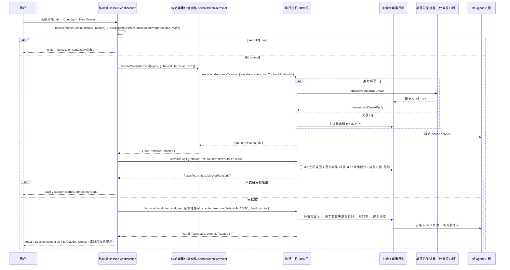
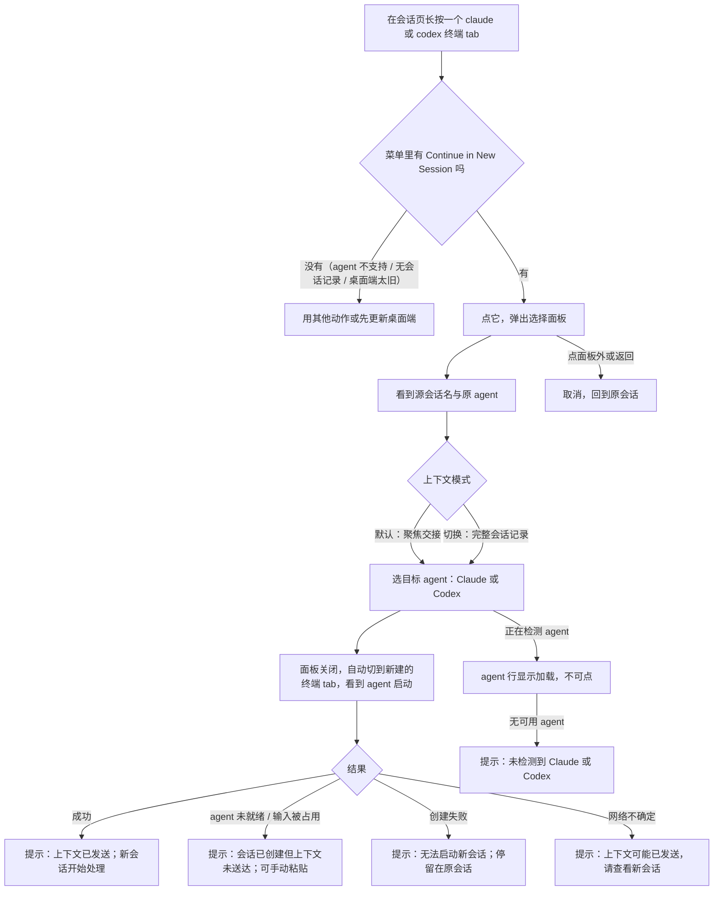
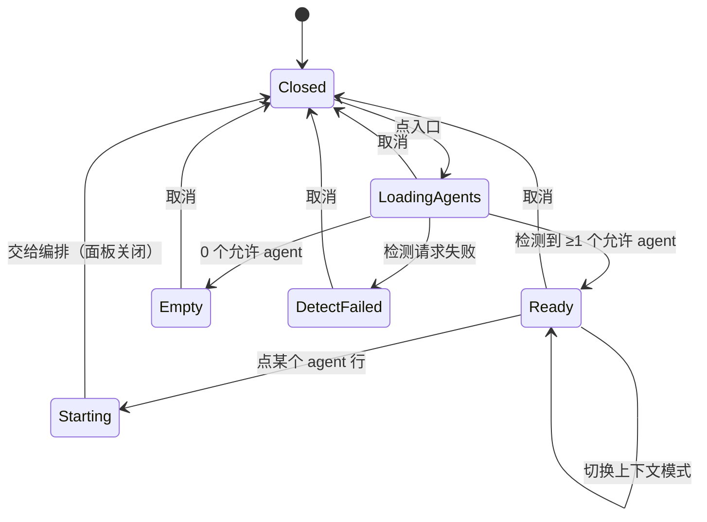
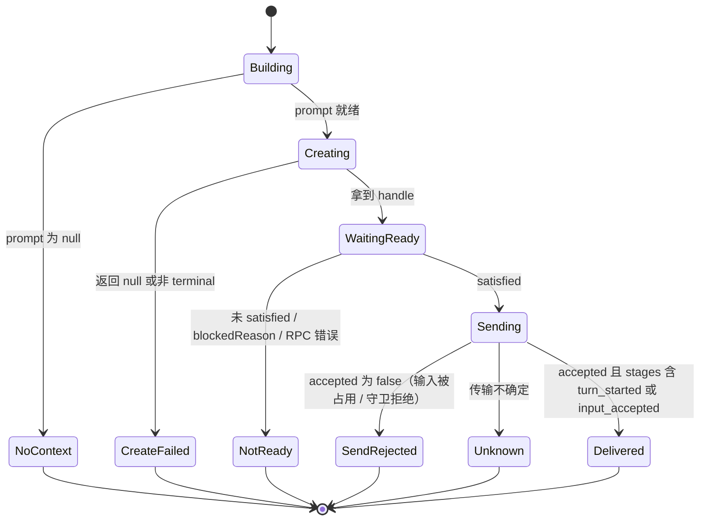

# 移动端在新会话中继续：终端通道方案（第一期 claude / codex）

## 0. 摘要

桌面端的「在新会话中继续」本质是三步：采集源会话上下文 → 用一段固定模板拼成交接 prompt → 新开一个 agent 会话并把这段 prompt 作为首条消息提交。调研确认移动端缺的只有两样：交接 prompt 的构建函数物理上在渲染进程（移动端取不到），以及一个入口和一段「建会话 → 等就绪 → 投递」的编排；会话创建、就绪等待、投递、agent 检测所需的 RPC 都已对移动端开放，且 2026-09-13 已在真机上对 claude / codex 各跑通一次。

推荐方案：把两个纯函数迁入 `src/shared/agent-session-continuation/`（桌面端原文件改为转发导出，调用方零改动）；在移动端终端 tab 长按菜单新增「Continue in New Session…」（唯一入口），弹一个基于既有 `ActionSheetModal` 的选择面板（上下文模式：聚焦交接 / 完整会话记录；目标 agent：Claude / Codex），然后复用既有 `handleCreateTerminal` 建终端（新 tab 自动成为当前 tab），再 `terminal.wait{tui-idle}` → `terminal.send`（括号粘贴 + 回车 + 提交观测）。不新增 RPC、字段或 opcode；入口按主机能力 `terminal.prompt-delivery.v1` 门控。

当前状态：评审结论已吸收（D-005、D-006）：单一长按入口、两种上下文模式都提供、创建后自动切换、Agent History 页不加入口；无开放问题，待进入 WP0 注册与实现。已完成：代码调研、真机验证、需求与决策记录。未完成：fork feature 注册、实现、Test Case 与 Test Run。读者重点：§4 复用决策、§7.5 编排状态机、§9 失败语义、§11 工作包。

## 1. 状态与结论

| 项目 | 当前结论 |
| --- | --- |
| 关联需求 | [REQ-001 ~ REQ-006](../requirements/移动端在新会话中继续.md) |
| 当前状态 | 已按本方案实现（WP0–WP4）；真机 UI 验收未做 |
| 推荐方案 | 共享 prompt 内核 + 终端长按单一入口 + 「建终端 → `terminal.wait` → `terminal.send`」移动端编排（D-001 ~ D-003） |
| 评审结论 | 入口只在长按菜单，Agent History 页不加；两种上下文模式都提供；新会话创建后自动切换（D-005、D-006） |
| 第一期范围 | claude / codex 终端通道（D-004） |
| 不做的事 | 新增 RPC / 字段 / opcode；改桌面端行为；`stdin-after-start` 类 agent；Agent History 页入口；结构化通道 |
| 关键风险 | 括号粘贴包裹后的投递未在真机验证（本轮真机用的是裸文本）；投递窗口内 App 失联导致「会话已建、上下文未送达」；`startupCwd` 是否透传到移动端 tab 对象需单测确认 |
| 前置条件 | 实现前先在 `config/fork-features.jsonc` 注册 feature 并在 `feat/mobile-session-continuation` 工作树开发（AGENTS.md 迭代原则 1、2） |

## 2. 输入与范围

- Requirements：[移动端在新会话中继续](../requirements/移动端在新会话中继续.md)（REQ-001 ~ REQ-006，status ready）。
- Design：`not-required`——以桌面端既有对话框为交互基线，移动端按现有 ActionSheet 范式落地。
- Research：[现状与技术链路调研](../research/移动端「基于当前会话新建对话」的现状与技术链路调研.md)（含 §4.6 第三条通道与 §8 真机验证）。
- 运行时证据：`.docs/mobile-session-continuation-ui-validation/2026-09-13/`（README、探针脚本、claude / codex 两组原始 JSON）。
- Journal 决策：D-001（投递通道）、D-002（prompt 内核迁入 shared）、D-003（入口与三重门控）、D-004（第一期范围）、D-005（评审结论：两种模式、自动切换）、D-006（Agent History 页不加入口，单一长按入口）。
- In Scope / Out of Scope：见需求 §3；本方案不重复。

### 调研未知项的处置

| 调研未知项 | 处置 |
| --- | --- |
| `tui-idle` 对刚启动 agent 的判定 | 已澄清：代码为「已 idle 立即返回，否则轮询三种依据」；claude / codex 真机 2.1–2.3 s 返回。转为前提事实 |
| 多行 prompt 经裸写入是否会被切碎 | 已澄清：真机两 agent 均为单条消息；本方案改用括号粘贴包裹以对齐桌面端，需在 Test Run 复验 |
| `stdin-after-start` 类 agent 的就绪命中 | 仍待确认；第一期不覆盖（D-004） |
| orcad 上 `session.tabs.createTerminal` 可用性 | 仍为推断（会 `runtime_unavailable`）；本方案用主机能力门控兜底，不依赖该推断 |
| 结构化创建不接受首条 prompt 的意图 | 与第一期无关，转二期 |

## 3. 设计原则、仓库规范与当前逻辑

### 设计原则

1. **主机能力只复用不新增**：只用移动端白名单内已有方法与既有字段；wire 零变更（`docs/reference/remote-wire-compatibility.md` 规则 1–3 自然满足）。
2. **一份 prompt 实现**：桌面与移动端共用同一函数，保证「同源会话、同模式 → 同一段 prompt」（REQ-001 验收 2、REQ-003）。
3. **与桌面端同一投递语义**：桌面端 `submit-after-ready` = 裸启动后粘贴并提交（`launch-agent-startup-prompt-plan.ts` 注释：多行生成 prompt 太大不进 shell argv）；移动端对位为「建终端 → 等就绪 → 括号粘贴 + 回车」，而不是 argv 注入。
4. **不产生幽灵会话**：创建复用既有 `clientMutationId` 幂等；投递的不确定结果只提示不重试（沿用 `mobile-native-chat-send.ts` 的 `unknown` 语义）。
5. **入口宁缺毋滥**：源 agent 不在允许集、无 transcript 路径、主机能力未探明，三者任一不满足就不显示入口。

### 仓库规范（来源可核验）

| 规范 | 来源 | 本方案落点 |
| --- | --- | --- |
| 新能力先注册 feature、代码放 feature-owned 路径、上游文件只在 seam 改 | `AGENTS.md` Fork Maintenance / Iteration Principles；`config/fork-features.jsonc` 既有条目形状 | §11 工作包 0；§5 目录树中每个 `[修改]` 均为 seam |
| 移动端不 import 渲染进程；共享走 `src/shared` | 移动端生产代码现状（所有 `src/renderer` 引用均为注释）；`quick-commands.ts` 直接从 `src/shared/protocol-version` 取能力常量 | prompt 内核迁入 `src/shared` |
| 移动端对 `src/shared/rpc-contract` 只允许 type-only import | `mobile/src/rpc-params-contract-type-only-boundary.test.ts` | 本方案不引用 rpc-contract 值 |
| 移动端 RPC 字面量必须在白名单且已注册 | `src/main/runtime/mobile-rpc-allowlist.test.ts` | `terminal.wait` / `terminal.send` / `session.tabs.createTerminal` 均已在白名单 |
| 主机能力门控范式 | `use-mobile-session-tab-reconciliation.ts` 的 `startRuntimeCapabilityProbe` 回调 + `use-mobile-session-feedback-capabilities.ts` 的布尔状态 | 新增 `sessionContinuationSupported` |
| 终端长按动作的注入式扩展 | `mobile-terminal-action-sheet-actions.ts` 已有 `bulkCloseActions?: (...) => ActionSheetAction[]` 注入参数 | 新增 `sessionContinuationActions` 同形注入 |
| 动作面板范式 | `ActionSheetModal` / `ActionSheetAction`（`label / icon / hint / disabled / loading / skipAutoClose / closeBeforePress`） | 选择面板不新增 UI 原语 |
| 文件行数上限 300（mobile 不加 per-file 放宽） | `.oxlintrc.json` `max-lines` 300；`AGENTS.md` Lint Rules | §5 拆分为多个小文件 |
| 文案 | 移动端无 i18n，内联英文；桌面端 i18n 目录不动 | 面板与 toast 文案见 §8.3 |
| 验证产物位置 | `AGENTS.md` Validation artifacts；`.docs/<topic>-ui-validation/<date>/` | 复用 2026-09-13 目录与探针脚本 |

### 当前逻辑摘要（详见调研文档）

- 桌面端：入口 → `AgentSessionContinuationRequest` → 对话框选 agent / 模式 → `buildAgentSessionContinuationPrompt` → `launchAgentInNewTab({ promptDelivery: 'submit-after-ready' })` → 三条路由之一。
- 移动端：终端 tab 已携带 `agentStatus`（`agentType` / `providerSession.transcriptPath` / `lastAssistantMessage` / `prompt`）与 `launchAgent`、`title`；`handleCreateTerminal(agent, options)` 走 `session.tabs.createTerminal`，`options` 存在即走终端通道；`terminal.wait` 与 `terminal.send`（含 `waitSubmitMs` 提交观测）已开放。

## 4. 复用与扩展策略

按「直接复用 → 增量扩展 → 抽共享内核 → 新增」逐项评估：

| 能力 | 候选实现 | 相似点 | 关键差异 | 结论 |
| --- | --- | --- | --- | --- |
| 交接 prompt 构建 | `src/renderer/src/lib/agent-session-continuation.ts`、`agent-session-fork-context.ts` | 正是要用的逻辑，纯函数 | 位置在渲染进程 | **抽共享内核**：迁入 `src/shared/agent-session-continuation/`，原文件转发导出（D-002） |
| 建 agent 终端 | `use-mobile-session-terminal-create-actions.ts::handleCreateTerminal` | 已处理幂等键、结构化/终端分流、订阅、激活、toast | 不返回创建结果（调用方拿不到 handle） | **增量扩展**：返回 `{ kind, handle }`；不新建创建路径 |
| 建终端后再投文本 | 同上的 `initialPrompt` 分支（Send Review Notes）；`ai-vault-resume-launch.ts::resumeAiVaultSessionInTerminal` | 都是「create → terminal.send」两跳 | 都是立刻发送，无就绪等待；resume 发的是 shell 命令 | **不直接复用**：中间必须插 `terminal.wait`；发送参数构造复用 `buildTerminalSendParams` |
| 发送结果判定 | `terminal-send-rpc-response.ts::isTerminalSendRpcAccepted`；`mobile-native-chat-send.ts` 的 accepted / rejected / unknown 三态 | 结果形状相同 | 需额外读 `prompt.stages` | **直接复用** + 读取 `prompt.stages` |
| agent 候选 | `mobile-new-tab-agent-loader.ts::loadMobileNewTabAgentOptions` | 检测 + 设置过滤 + 标签 | 需再按允许集过滤 | **直接复用** + 过滤 |
| 主机能力门控 | `supportsMobileQuickCommands` + 探测回调 | 同一探测源 | 能力标识不同 | **增量扩展**：新增一个布尔状态 |
| 动作面板 | `ActionSheetModal` / `getMobileNativeChatToggleActions` | 同一范式 | — | **直接复用** |
| 主机注入 prompt | `createTerminal` 的 `agentPrompt`（Quick Commands） | 原子、无需等待 | 上限 6000 字符，交接 prompt 中 `lastAssistantMessage` 单项可达 8000；桌面端也不走 argv | **不采用**为主路径（D-001）；作为二期可选快路径 |
| 结构化通道 | `createMobileStructuredAgentSession` + `agentSession.send` | 桌面端结构化路由同形 | 创建不带 prompt；受 `createSupport` 限制；发送 hook 绑定在已打开的会话视图 | **二期** |

新增代码只有：移动端的入口构造、选择面板、编排状态机与眼前这份契约的小型胶水；每一项都以现有候选无法覆盖为前提（上表）。

## 5. 仓库改动总览

```text
config/
├── fork-features.jsonc                                   [修改] 注册 mobile-session-continuation（§11 工作包 0）
└── architecture-policies.jsonc                           [修改] 新增 policy + fork-integration-scope 允许清单
docs/issue/移动端在新会话中继续/**                          [新增] 本需求目录
src/shared/agent-session-continuation/
├── continuation-prompt.ts                                [新增] 自渲染进程迁入：类型、buildAgentSessionContinuationPrompt、hasFullAgentSessionContext
├── bounded-session-transcript.ts                         [新增] 自渲染进程迁入：buildBoundedSessionTranscript、cleanAgentSessionForkTranscript、buildAgentSessionForkPrompt
├── continuation-prompt.test.ts                           [新增] focused / full / 无上下文 / 围栏转义 / 与桌面端快照一致
└── bounded-session-transcript.test.ts                    [新增] 自渲染进程既有测试复制并指向 shared
src/renderer/src/lib/
├── agent-session-continuation.ts                         [修改] 仅保留转发导出（seam）
├── agent-session-fork-context.ts                         [修改] 仅保留转发导出（seam）
└── agent-session-fork-context.test.ts                    [复用] 不改；经转发导出继续通过
mobile/src/session-continuation/
├── continuation-agents.ts                                [新增] 允许集常量、supportsMobileSessionContinuation(capabilities)
├── continuation-source.ts                                [新增] resolveMobileContinuationSource(tab)、canContinueMobileSession(...)
├── continuation-actions.ts                               [新增] getMobileSessionContinuationActions(...) → ActionSheetAction[]
├── MobileSessionContinuationSheet.tsx                    [新增] 选择面板（ActionSheetModal 组合）
├── continuation-delivery.ts                              [新增] 投递编排纯函数与结果联合类型
├── use-mobile-session-continuation.ts                    [新增] 面板状态、agent 加载、调用建终端与投递
└── *.test.ts                                             [新增] 门控、源采集、动作构造、编排状态机（伪 RpcClient）
mobile/src/session/
├── mobile-terminal-action-sheet-actions.ts               [修改] 注入 sessionContinuationActions（同 bulkCloseActions 范式）
├── MobileSessionSheets.tsx                               [修改] 挂载面板；把注入函数传给终端长按动作
├── use-mobile-session-terminal-create-actions.ts         [修改] handleCreateTerminal 返回创建结果；options 增 channel 说明
├── use-mobile-session-feedback-capabilities.ts           [修改] 新增 sessionContinuationSupported 状态
├── use-mobile-session-tab-reconciliation.ts              [修改] 能力探测回调设置该状态
└── mobile-session-route-types.ts                         [修改] terminal tab 补 startupCwd?（运行时对象已携带）
复用不改：mobile/src/components/ActionSheetModal.tsx、mobile/src/transport/rpc-client.ts、
mobile/src/terminal/terminal-send-request.ts、mobile/src/terminal/terminal-send-rpc-response.ts、
mobile/src/session/mobile-new-tab-agent-loader.ts、mobile/src/session/mobile-new-tab-agent-options.ts、
mobile/src/tasks/mobile-tui-agents.ts、mobile/src/platform/haptics.ts、
src/shared/agent-prompt-injection.ts（buildAgentPromptPasteBytes）、src/shared/protocol-version.ts
```

| 模块 | 职责 | 仓库落点 | 改动类型 | 复用基础 | 扩展方式 | 输入 → 输出 | 依赖 |
| --- | --- | --- | --- | --- | --- | --- | --- |
| 共享 prompt 内核 | 交接 prompt 与有界 transcript 构建 | `src/shared/agent-session-continuation/` | 新增（迁入）+ 2 处转发导出 | 渲染进程既有纯函数 | 物理迁移，接口不变 | `AgentSessionContinuationSource` + mode → prompt 文本或 null | `src/shared/tui-agent`、`telemetry-events` |
| 源上下文采集与资格判定 | 从移动端 tab 拼 source；判定入口可用 | `mobile/src/session-continuation/continuation-source.ts`、`continuation-agents.ts` | 新增 | tab 既有字段 | — | `MobileSessionTab` + capabilities → source / boolean | 共享内核类型、`protocol-version` |
| 入口与门控 | 长按菜单动作项 | `continuation-actions.ts` + 2 个 seam | 新增 + 修改 | `bulkCloseActions` 注入范式、能力探测回调 | 注入函数 + 新布尔状态 | tab + supported → `ActionSheetAction[]` | ActionSheetModal 类型 |
| 选择面板 | 选上下文模式与目标 agent，触发开始 | `MobileSessionContinuationSheet.tsx` + `use-mobile-session-continuation.ts` + Sheets seam | 新增 + 修改 | `ActionSheetModal`、`loadMobileNewTabAgentOptions` | 组合，不新增原语 | 用户选择 → 调用编排 | `MOBILE_TUI_AGENT_LABELS` |
| 续接编排 | 建终端 → 等就绪 → 投递 → 结果分类 | `continuation-delivery.ts` + `handleCreateTerminal` seam | 新增 + 修改 | `handleCreateTerminal`、`buildTerminalSendParams`、`isTerminalSendRpcAccepted`、`buildAgentPromptPasteBytes` | 建终端动作返回结果 | request → `MobileSessionContinuationOutcome` | `RpcClient` |
| fork 注册与门禁 | 让所有门禁认识这个 feature | `config/*.jsonc` | 修改 | 既有条目形状 | 新条目 | — | — |

## 6. 系统交互与用户动线

### 系统交互图（目标态）



读图重点：移动端只发三个既有 RPC；「有窗口时由渲染进程建 tab」是主机现状而非本方案新增；观测点为 `create` 响应中的 handle、`wait` 结果的 `satisfied / blockedReason`、`send` 结果的 `accepted / prompt.stages`。验收关注点：`prompt.stages` 含 `turn_started`，新 tab 屏幕上只有一条用户消息。

### 用户动线图（目标态）



读图重点：三个前置条件任一不满足时用户看不到入口，而不是点了才报错；创建失败与投递失败的提示明确区分「会话有没有建出来」。验收关注点：REQ-001 验收 4、REQ-005 验收 1。

## 7. 方案设计

### 7.1 共享 prompt 内核

- 目标：让桌面与移动端调用同一份 `buildAgentSessionContinuationPrompt` 与 `buildBoundedSessionTranscript`。
- 落点与改动：`src/shared/agent-session-continuation/continuation-prompt.ts`（`[新增]`，内容即现渲染进程 `agent-session-continuation.ts` 全文，import 改为 shared 相对路径）；`bounded-session-transcript.ts`（`[新增]`，内容即 `agent-session-fork-context.ts` 全文）；渲染进程两个原文件改为 `export * from '../../../shared/agent-session-continuation/...'` 加 `export type` 转发（`[修改]`，seam）。
- 遵循的既有逻辑：这两个文件只依赖 `src/shared/tui-agent` 与 `src/shared/telemetry-events`，本来就可放 shared；仓库里 `src/shared/session-names/**`、`src/shared/document-preview-size/**` 即 feature-owned shared 目录先例。
- 输入 → 输出：不变。
- 测试：新增 `continuation-prompt.test.ts` 覆盖 focused 有路径 / full 有路径 / focused 无路径内联 / full 无路径返回 null / 路径含反引号时围栏加长 / 状态提示为空时省略段落；`bounded-session-transcript.test.ts` 复制自渲染进程既有测试并指向 shared；渲染进程既有测试不改（经转发导出通过，REQ-003 验收 1）。
- 与其他模块关系：移动端 7.2 / 7.5 直接 import shared 路径。

### 7.2 源上下文采集与资格判定

- 目标：从移动端终端 tab 得到 `AgentSessionContinuationSource`，并回答「这个 tab 能不能续接」。
- 落点：`mobile/src/session-continuation/continuation-source.ts`、`continuation-agents.ts`（`[新增]`）；`mobile-session-route-types.ts` terminal 变体补 `startupCwd?: string`（`[修改]`，运行时对象来自 `result.tabs` 透传，已携带该字段；实现时以单测确认，若被映射丢弃则在同一处补透传）。
- 核心规则：
  - `sourceAgent = isTuiAgent(agentStatus?.agentType) ? agentType : launchAgent`（与桌面端 `resolveSourceAgent` 同序）。
  - 可续接 ⇔ `sourceAgent ∈ MOBILE_SESSION_CONTINUATION_AGENTS`（第一期 `['claude','codex']`）∧ `providerSession.transcriptPath` 非空 ∧ `sessionContinuationSupported === true`。
  - source 字段映射：`capturedText: ''`（移动端无回滚缓冲，靠 transcriptPath 非空保证 prompt 非 null）；`sourceTitle: tab.title`；`sourceWorkingDirectory: tab.startupCwd ?? null`；`transcriptPath`；`lastPrompt: agentStatus.prompt`；`lastAssistantMessage: agentStatus.lastAssistantMessage`；`sourceLabel` 不填（pane key 是桌面概念）。
  - `hasFullAgentSessionContext(source)` 决定「完整会话记录」模式是否可选；在第一期的可续接条件下恒为 true。
- 输入 → 输出：`MobileSessionTab`（terminal）+ `capabilities` → `{ source, sourceAgent } | null`。
- 异常：字段缺失一律判为不可续接，不抛错。

### 7.3 入口与门控

- 目标：在终端 tab 长按菜单展示「Continue in New Session…」，且只在可续接时展示。
- 落点：`continuation-actions.ts`（`[新增]`）导出 `getMobileSessionContinuationActions({ tab, supported, onDismiss, onOpen })`；`mobile-terminal-action-sheet-actions.ts` 增加可选参数 `sessionContinuationActions?: (tab: Tab, dismiss: () => void) => ActionSheetAction[]`，在聊天切换行之后、显示模式行之前展开（`[修改]`，与 `bulkCloseActions` 同形）；`use-mobile-session-feedback-capabilities.ts` 增加 `sessionContinuationSupported` 布尔状态（`[修改]`）；`use-mobile-session-tab-reconciliation.ts` 在 `startRuntimeCapabilityProbe` 回调里 `setSessionContinuationSupported(supportsMobileSessionContinuation(capabilities))`，断开与重连时置 `null`（`[修改]`，与 `quickCommandsSupported` 同一段）。
- 能力标识：`TERMINAL_PROMPT_DELIVERY_RUNTIME_CAPABILITY`（`terminal.prompt-delivery.v1`）。选它的原因：本方案依赖 `terminal.send` 的 `waitSubmitMs` 与 `prompt.stages` 提交观测来区分「输入被接受」与「已开轮」；旧主机会剥离 `waitSubmitMs`，此时投递结果不可判读。它同时是「主机具备 `terminal.wait`」的充分代理。
- 动作项：`label: 'Continue in New Session…'`，`icon: MessageSquarePlus`（lucide-react-native 与桌面端同名图标），`closeBeforePress: true`，`onPress` 打开选择面板。
- 考虑过的替代：由 feature 自行再发一次 `status.get` 探测能力以避开两个 seam——会形成第二条探测通路，且与既有布尔状态不一致，不采用。

### 7.4 选择面板

- 目标：对位桌面端对话框的两个选择（agent、上下文模式）与一个开始动作，用移动端既有范式表达。
- 落点：`MobileSessionContinuationSheet.tsx` + `use-mobile-session-continuation.ts`（`[新增]`）；`MobileSessionSheets.tsx` 挂载 `<MobileSessionContinuationSheet visible={continuationTarget != null} …/>` 并向 `getMobileTerminalActionSheetActions` 传入 `sessionContinuationActions`（`[修改]`）。
- 组件拆分：面板本体 = `ActionSheetModal`（`title` 为源会话标题或 'Current session'，`message` 为 'Original agent: Claude' 一行）+ 动作行由纯函数 `buildContinuationSheetActions(state)` 生成：
  1. 上下文模式行：`label: 'Context: Focused handoff'` ↔ `'Context: Full session transcript'`，`skipAutoClose: true`，点击切换；`hint` 为对应说明（对位桌面端两段描述的短版）。
  2. agent 行（每个允许集内且被检测到的 agent 一行）：`label: 'Continue with Claude'`，`hint: 'Starts a new session in this workspace'`；加载中 `loading: true` 且 `disabled`；`onPress` → 关闭面板并调用编排。
  3. 无可用 agent 时一行 `disabled` 提示 `'No Claude or Codex detected on this host'`；检测失败时 `'Could not detect agents on this host'`。
- 状态管理（hook 内局部状态）：`target: MobileSessionTab | null`、`agents: 'loading' | { ready: MobileNewTabAgentOption[] } | 'failed'`、`contextMode: 'focused' | 'full'`、`starting: boolean`。打开面板时用 `loadMobileNewTabAgentOptions({ client, worktreeId })` 加载并按允许集过滤；关闭时重置。不进全局 store，不进 URL。
- 交互状态机：



- 两种上下文模式第一期都提供（D-005）；在终端入口的可续接条件（要求 transcript 路径）下「完整会话记录」恒可用，仍按 `hasFullAgentSessionContext(source)` 判定以与桌面端同源。
- 与桌面端差异（有意为之）：桌面端先选后点「Start」，移动端「点 agent 行即开始」以符合本地 New Tab 面板习惯；模式选择作为可切换行而非下拉。

### 7.5 续接编排

- 目标：把「建终端 → 等就绪 → 投递」做成可测的纯函数，并把结果映射为用户可感知的三类结论。
- 落点：`continuation-delivery.ts`（`[新增]`，纯函数，依赖注入 `RpcClient['sendRequest']` 与建终端函数）；`use-mobile-session-terminal-create-actions.ts`（`[修改]`）：`handleCreateTerminal` 返回 `Promise<{ kind: 'terminal'; handle: string } | { kind: 'structured'; sessionId: string } | null>`，现有调用方忽略返回值即可；`options` 类型增加 `channel?: 'terminal'` 与 `cwd?: string` 并透传 `cwd` 到 `createTerminal`。复用 `handleCreateTerminal` 顺带获得既有的激活新 tab、订阅、toast 行为，满足「创建后自动切换」。
- 核心流程：



- 步骤参数：
  1. 建终端：`handleCreateTerminal(agent, { channel: 'terminal', cwd })`；`cwd` 仅在 `source.sourceWorkingDirectory` 非空时传入（schema 已支持，旧主机静默忽略 → 落到工作区根，属可接受降级）。
  2. 等就绪：`client.sendRequest('terminal.wait', { terminal, for: 'tui-idle', timeoutMs: 60_000 }, { timeoutMs: 65_000 })`；`result.wait.satisfied !== true` 或存在 `blockedReason` → `NotReady`。
  3. 投递：`text = buildAgentPromptPasteBytes(prompt)`（shared；括号粘贴 + ESC 清洗），参数 = `buildTerminalSendParams({ terminal, text, enter: true, deviceToken })` 展开后追加 `waitSubmitMs: 20_000`；用 `isTerminalSendRpcAccepted` 判 accepted；读 `result.send.prompt.stages`。
  4. 结果映射与提示见 §9。
- 并发与幂等：`handleCreateTerminal` 已有 `creatingTerminalRef` 单飞守卫与 `clientMutationId`；编排层再加 `inFlightRef`，双击无效。投递失败不自动重试；`Unknown` 只提示。
- 与其他模块关系：由 7.4 触发；结果经 scope 的 `showToast` / `triggerSuccess` / `triggerError` 呈现（复用）。

### 7.6 fork 注册与门禁

实现前先落以下注册（工作包 0），否则 `fork-integration-scope` 会把所有改动判为越界：

```jsonc
{
  "id": "mobile-session-continuation",
  "title": "移动端在新会话中继续：claude / codex 终端通道",
  "goal": "移动端对当前 claude / codex 会话新建续接会话，复用主机既有 RPC，不改 wire",
  "journal": "docs/issue/移动端在新会话中继续/journal.md",
  "dependsOn": [
    "mobile/src/components/ActionSheetModal.tsx",
    "mobile/src/platform/haptics.ts",
    "mobile/src/session/mobile-new-tab-agent-loader.ts",
    "mobile/src/session/mobile-new-tab-agent-options.ts",
    "mobile/src/session/mobile-session-route-types.ts",
    "mobile/src/tasks/mobile-tui-agents.ts",
    "mobile/src/terminal/terminal-send-request.ts",
    "mobile/src/terminal/terminal-send-rpc-response.ts",
    "mobile/src/transport/rpc-client.ts",
    "mobile/src/transport/types.ts",
    "src/shared/agent-prompt-injection.ts",
    "src/shared/agent-status-types.ts",
    "src/shared/protocol-version.ts",
    "src/shared/telemetry-events.ts",
    "src/shared/tui-agent.ts",
    "src/shared/tui-agent-config.ts"
  ],
  "policyId": "mobile-session-continuation",
  "ownedPaths": [
    "src/shared/agent-session-continuation/**",
    "mobile/src/session-continuation/**",
    "docs/issue/移动端在新会话中继续/**"
  ],
  "requiredFiles": [
    "src/shared/agent-session-continuation/continuation-prompt.ts",
    "mobile/src/session-continuation/continuation-delivery.ts",
    "mobile/src/session-continuation/MobileSessionContinuationSheet.tsx"
  ],
  "seams": [
    { "file": "src/renderer/src/lib/agent-session-continuation.ts", "mustContain": "shared/agent-session-continuation/continuation-prompt", "why": "desktop keeps its import paths while the builder lives in shared" },
    { "file": "src/renderer/src/lib/agent-session-fork-context.ts", "mustContain": "shared/agent-session-continuation/bounded-session-transcript", "why": "fork and continuation share one bounded transcript implementation" },
    { "file": "mobile/src/session/mobile-terminal-action-sheet-actions.ts", "mustContain": "sessionContinuationActions", "why": "the long-press menu takes the continuation entry by injection, like bulk close" },
    { "file": "mobile/src/session/MobileSessionSheets.tsx", "mustContain": "MobileSessionContinuationSheet", "why": "the picker mounts beside the other session sheets" },
    { "file": "mobile/src/session/use-mobile-session-terminal-create-actions.ts", "mustContain": "kind: 'terminal'", "why": "the create action returns the handle the orchestration waits on" },
    { "file": "mobile/src/session/use-mobile-session-tab-reconciliation.ts", "mustContain": "supportsMobileSessionContinuation", "why": "host capability gate rides the existing probe" },
    { "file": "mobile/src/session/use-mobile-session-feedback-capabilities.ts", "mustContain": "sessionContinuationSupported", "why": "capability state lives with its siblings" },
    { "file": "mobile/src/session/mobile-session-route-types.ts", "mustContain": "startupCwd", "why": "the source cwd already rides the tab payload" }
  ],
  "tests": [
    "src/shared/agent-session-continuation/continuation-prompt.test.ts",
    "mobile/src/session-continuation/continuation-delivery.test.ts"
  ],
  "checks": [
    "pnpm exec vitest run --config config/vitest.config.ts src/shared/agent-session-continuation src/renderer/src/lib/agent-session-fork-context.test.ts src/renderer/src/lib/launch-agent-session-continuation.test.ts src/renderer/src/components/agent-session-continuation",
    "pnpm --dir mobile exec vitest run src/session-continuation src/session/mobile-terminal-action-sheet-actions.test.ts"
  ]
}
```

配套：`config/architecture-policies.jsonc` 新增 `mobile-session-continuation-worktree-scope`（`change-scope`，`whenChanged` = 三个 ownedPaths，`allowedPaths` = ownedPaths + 上表 8 个 seam 文件 + `config/fork-features.jsonc`、`config/architecture-policies.jsonc`、`docs/issue/README.md`），并把 8 个 seam 文件加入 `fork-integration-scope` 允许清单；`pnpm generate:issue-index` 重新生成 `docs/issue/README.md`。`dependsOn` 以实现后 `pnpm check:fork-features` 的 import 审计为准修订。

## 8. 接口、数据与状态

### 8.1 RPC 契约：无新增、无修改

本方案不涉及服务端 API / RPC 的新增或修改，因此无 IDL 变更。使用的既有方法与字段：

| 方法 | 使用字段（均为既有） | 说明 |
| --- | --- | --- |
| `session.tabs.createTerminal` | `worktree`、`agent`、`cwd?`、`afterTabId`、`clientMutationId`、`activate: false`、`select: true`、`navigation: 'caller'` | 经 `handleCreateTerminal` 发出；`cwd` 为移动端首次使用的既有可选字段 |
| `terminal.wait` | `terminal`、`for: 'tui-idle'`、`timeoutMs` | 移动端首次使用；已在白名单 |
| `terminal.send` | `terminal`、`text`、`enter`、`client{ id, type: 'mobile' }`、`waitSubmitMs` | `waitSubmitMs` 为移动端首次使用的既有字段，受能力门控保护 |
| `preflight.detectAgents` / `settings.get` | — | 经 `loadMobileNewTabAgentOptions` |

### 8.2 移动端内部契约

```ts
// mobile/src/session-continuation/continuation-source.ts
type MobileContinuationEligibility =
  | { eligible: true; sourceAgent: 'claude' | 'codex'; source: AgentSessionContinuationSource }
  | { eligible: false; reason: 'unsupported-agent' | 'no-transcript' | 'host-capability' }

// mobile/src/session-continuation/continuation-delivery.ts
type MobileSessionContinuationRequest = {
  worktreeId: string
  targetAgent: 'claude' | 'codex'
  prompt: string
  cwd: string | null
}
type MobileSessionContinuationOutcome =
  | { kind: 'delivered'; handle: string; stages: string[] }
  | { kind: 'no-context' }
  | { kind: 'create-failed'; message: string }
  | { kind: 'not-ready'; handle: string; status: string; blockedReason?: string }
  | { kind: 'send-rejected'; handle: string; message: string }
  | { kind: 'unknown'; handle: string }

// mobile/src/session/use-mobile-session-terminal-create-actions.ts（seam）
type MobileTerminalCreateResult =
  | { kind: 'terminal'; handle: string }
  | { kind: 'structured'; sessionId: string }
  | null
```

### 8.3 文案

| 场景 | 文案（内联英文，桌面端对应键） |
| --- | --- |
| 菜单项 | `Continue in New Session…`（`continueInNewSession`） |
| 面板标题 / 副标题 | 源会话标题或 `Current session` / `Original agent: Claude`（`untitledSession` / `originalAgent`） |
| 模式行 | `Context: Focused handoff` / `Context: Full session transcript`（`modeFocused` / `modeFull`） |
| 成功 | `Session context sent to Claude in a new session.`（`sent`） |
| 创建失败 | `Could not start a new Claude session.`（`launchFailed`） |
| 未送达 | `The new Claude session started, but its context could not be sent.`（`deliveryFailed`） |
| 无上下文 | `No session context is available to continue in a new session.`（`noContext`） |
| 不确定 | `The context may have been sent. Check the new session.`（移动端新增，对位 `unknown` 语义） |

## 9. 错误、重试、恢复与降级

| 失败类型 | 触发 | 用户可见 | 是否重试 | 恢复 / 降级 |
| --- | --- | --- | --- | --- |
| 无上下文 | prompt 构建返回 null（理论上被门控排除） | `noContext` toast | 否 | 停留原会话 |
| 创建失败 | `createTerminal` 报错 / 未返回 handle | `launchFailed` toast，原会话不变 | 用户手动再点；`clientMutationId` 保证传输重放不重复 | — |
| 未就绪 | `wait` 超时 60 s、`blockedReason`（信任 / 授权对话框）、RPC 错误 | `deliveryFailed` toast；用户已在新 tab，可看到阻塞原因 | 否 | 新会话保留；用户可手动粘贴（prompt 不落草稿——移动端无 launchDraft 写入口） |
| 输入被拒 | `send.accepted === false`（其他客户端占用输入、守卫拒绝） | `deliveryFailed` toast | 否 | 同上 |
| 传输不确定 | `isRpcDeliveryUnknown` / cutover | `unknown` toast | 否（避免重复消息） | 用户查看新会话 |
| 旧主机 | 能力缺失 | 入口不显示 | — | 用户更新桌面端 |
| `cwd` 被旧主机忽略 | 主机 schema 早于 `cwd` 字段 | 新会话从工作区根启动 | — | 可接受降级，prompt 内仍写明原工作目录 |
| App 在投递窗口失联 | 建完终端后连接中断 | 重连后新 tab 存在但无 prompt；无自动补发 | 否 | 视为「未送达」；二期可评估主机侧 `agentPrompt` 快路径 |

## 10. 监控、风险与测试关联

- 观测信号：`terminal.wait` 结果的 `satisfied / status / blockedReason` 与耗时；`terminal.send` 结果的 `accepted / prompt.stages`；三类 toast 出现次数。移动端无遥测管道，第一期以 `console.warn` 进入既有 diagnostics 日志，字段为 `{ outcome.kind, agent, waitMs, sendMs }`；主机侧沿用既有 agent prompt 生命周期日志。
- 风险与缓解：
  - 括号粘贴包裹后的投递未真机验证 → Test Run 首项；若异常，退回裸文本（真机已验证可用）。
  - `startupCwd` 未透传到移动端对象 → 单测断言；缺失则在 tab 应用处补透传（同一 seam 文件）。
  - `terminal.wait` 60 s 上限对慢速 SSH 主机不够 → 记录 `status` 并在 Test Run 观测；必要时按主机类型放宽。
  - 投递窗口失联 → §9 已定义为未送达；二期评估 `agentPrompt` 快路径。
  - 上游合并冲突 → seam 收敛为 8 个文件且均为追加式改动。
- 自测场景：① claude 源 → claude 目标 / codex 目标；② codex 源 → 两目标；③ 完整记录模式；④ 源 tab 无 transcript（入口不显示）；⑤ 非允许 agent（入口不显示）；⑥ 断开主机（入口不显示，重连后出现）；⑦ 建终端后立刻断网（未送达提示）；⑧ 双击 agent 行（只建一个会话）。
- 关联 Test Case：待编写（`tests/cases/`，需用户启动测试用例阶段）；预期覆盖 REQ-001 ~ 006 各至少一条。
- 回归范围：桌面端「在新会话中继续」与 Fork Session（REQ-003）；移动端 New Tab、Quick Commands、Send Review Notes（共用 `handleCreateTerminal`）；移动端终端长按菜单其余动作；`mobile-rpc-allowlist.test.ts`、`rpc-params-contract-type-only-boundary.test.ts`、`check:fork-features`、`check:fork-docs`、`check:architecture-policies`、三项 localization 门禁（桌面 i18n 无改动）。

## 11. 子方案

无需拆分。实施工作包（每包对应 §5 目录树与 REQ）：

| 工作包 | 内容 | 关联 REQ | 完成判据 |
| --- | --- | --- | --- |
| WP0 注册 | `feat/mobile-session-continuation` 工作树；fork-features 条目与 policy；`generate:issue-index` | 全部 | `check:fork-features`、`check:fork-docs`、`check:architecture-policies` 通过（requiredFiles 可先落空实现） |
| WP1 共享内核 | 迁入两文件 + 转发导出 + 新测试 | REQ-001、003 | 桌面既有测试不改通过；shared 测试通过；`pnpm tc` |
| WP2 采集与门控 | `continuation-source` / `continuation-agents` / 能力状态两 seam / `startupCwd` 类型 | REQ-001、004、006 | 单测：资格判定矩阵、能力三态 |
| WP3 入口与面板 | `continuation-actions` / Sheet / hook / Sheets seam / 动作注入 seam | REQ-001、006 | 单测：动作构造、面板状态机；`pnpm --dir mobile exec vitest` |
| WP4 编排 | `continuation-delivery` + `handleCreateTerminal` 返回值 | REQ-001、002、005 | 单测：六种结局 + 双击单飞；`mobile-rpc-allowlist.test.ts` 通过 |
| WP5 验证 | 复用探针方法在真机跑 §10 自测 ①②③⑦⑧；Test Case / Test Run 文档（需用户启动） | 全部 | Test Run 记录 + `.docs` 证据；Journal 开发记录 |

## 12. 变更记录

| 日期 | 变更原因 | 变更内容 | 影响范围 | 关联决策 |
| --- | --- | --- | --- | --- |
| 2026-09-13 | 初始化 | 依据调研、真机验证与 D-001 ~ D-004 完成首版方案，进入评审 | 全文 | D-001、D-002、D-003、D-004 |
| 2026-09-13 | 方案评审 | 吸收结论：长按菜单入口确认；两种上下文模式都提供；创建后自动切换。曾误读为需在 Agent History 页加入口并扩成双入口设计 | §0、§1、§7.4、§7.5 | D-005 |
| 2026-09-13 | 用户澄清 | 「只在长按里加」：撤回 Agent History 页入口与可注入创建器设计，恢复单一入口；seam 回到 8 个 | §0、§1、§2、§4、§5、§6、§7、§8、§9、§10、§11 | D-006 |
| 2026-09-13 | 代码评审修正 | 评审发现七项并逐条核实后修正：① `terminal.send` 与 `terminal.wait` 补 `TERMINAL_INPUT_SEND_OPTIONS`，断线时干净放弃而非重连后补投（#6713 的同类风险）；② **去掉 `waitSubmitMs` 与提交阶段读取**——核实 `terminal-send-method.ts` 后确认提交回执要求 `agentPrompt: true` 且 `client.type === 'desktop'`（回执兜底还额外要求编排上下文），对移动端恒为空，测试里伪造的 `send.prompt.stages` 是假信心；`delivered` 语义相应收窄为「主机已接受粘贴与回车」；③ **去掉主机能力门控**——其依据本是②中那个不存在的读取，且核实 `terminal.wait` 自 2026-07-04 起就在移动端白名单内，`cwd` 被旧主机剥离只是降级，故连带撤回 `feedback-capabilities`、`tab-reconciliation` 两个 seam 与 parity 名单改动，seam 回到 8 个；④ 编排改持 `client` 对象而非解引用的 `sendRequest`（`DirectRpcClient` 的同名方法读 `this`）；⑤ 新增 `created-without-handle` 终态，区分「tab 已建但无 handle」与「创建失败」；⑥ 忙碌或无连接时给 toast 与振动，不再静默吞掉点击；⑦ 模式行改为「切换到另一种模式」并删掉不可达的禁用分支。另补一项评审未提的缺口：按源 tab 复用创建幂等键（REQ-005「复用既有幂等键」此前只覆盖传输层重放，手动重试会产生第二个会话） | §7.5、§8.1、§8.2、§8.3、§9、§5、§7.3、§7.6 | - |
| 2026-09-13 | 实现落地偏离 | 五处按实现事实修正：① 不建 `MobileSessionContinuationSheet.tsx`——`ActionSheetModal` 直接在 `MobileSessionSheets.tsx` 挂载与其他 sheet 一致，`requiredFiles` 改列 `continuation-actions.ts`；② `handleCreateTerminal` 不需要 `channel` 字段，传 `options` 即走终端通道是既有约定，只新增 `cwd`；③ 面板按下即关闭以便立刻看到新 tab，故无 loading 态，防重入用 ref；④ seam 由 8 个增至 10 个，新增 `use-mobile-session-controller.ts`（hook 接入点）与 `mobile-session-route-parity.test.ts`（基线随会话路由改动移动，并把新门控纳入其 capability 名单）；⑤ 新增 `continuation-copy.ts` 集中文案、`use-mobile-session-continuation-scope.ts` 作 controller 适配层 | §5、§7.4、§7.5、§7.6 | - |
