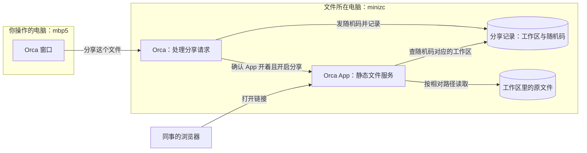
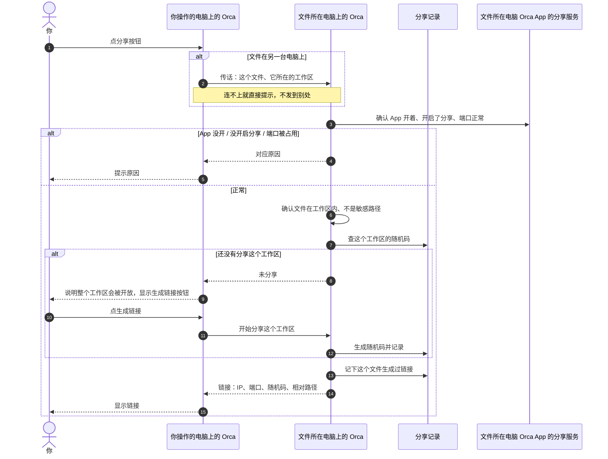
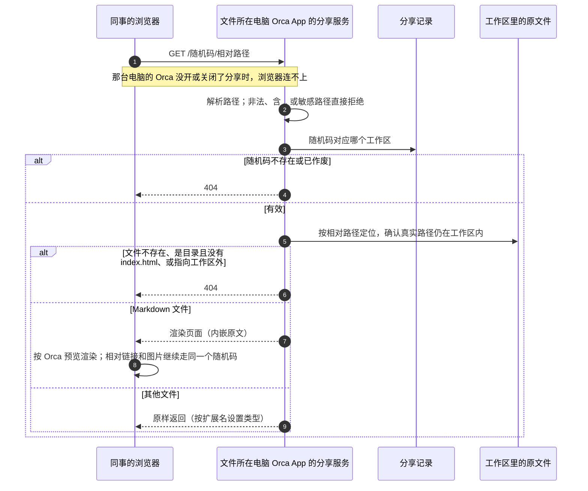
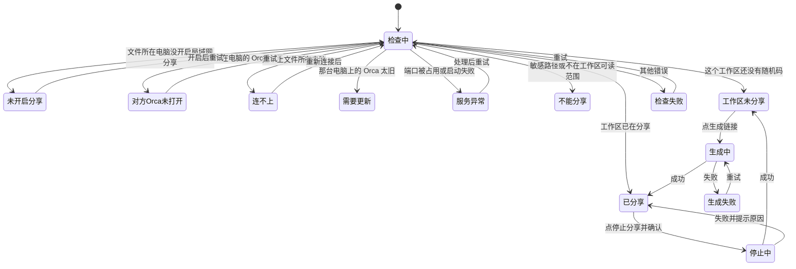
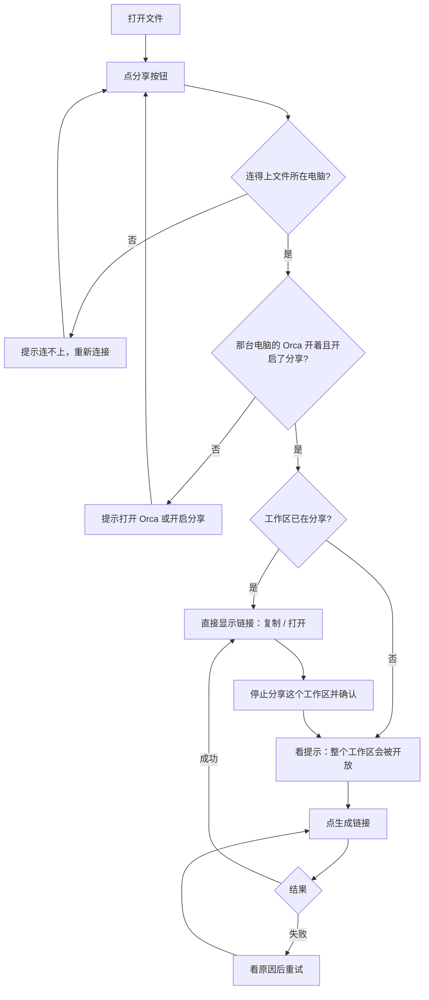
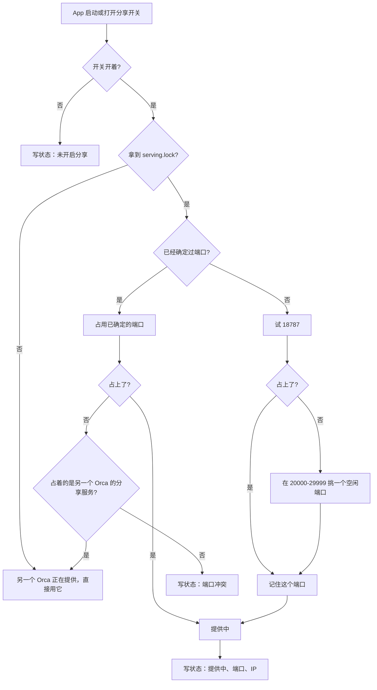

# Orca 内置局域网 Artifact 分享服务重构方案

> 最后更新：2026-09-17
> 本地主稿：本文件
> 飞书归档：未创建

## 0. 摘要

**一条规则：文件在哪台电脑上，就由那台电脑上的 Orca 提供链接。**

现在的分享依赖一个外挂服务（`~/dev/orca-artifact-server`，端口 8787），Orca 把文件内容复制一份发给「自己这台电脑的 8787」。你在 mbp5 上打开 minizc 上的文件点分享时，内容被发给了 mbp5 的 8787——那里是 llm-proxy，文档正文连同 Orca 账号 token 被转发到了内部上游服务，分享失败。

重构后：

- **分享服务是 Orca App 里的静态文件服务**，跟着 App 走：文件所在电脑上的 Orca 开着、并且开启了局域网分享，就提供链接；退出就停止，再打开自动恢复。
- **不复制文件**：链接直接指向原文件，形如 `http://文件所在电脑的局域网IP:18787/随机码/tmp/tasks/…/调研.md`。随机码代表「这个工作区」，后面是文件在工作区里的相对路径。文件保存后，链接里立刻是最新内容；文档里的相对路径图片、互相引用的文档都能直接打开。
- **拿到链接的人能打开这个工作区里的所有文件**（不列目录，`.git`、`.env` 这类敏感路径除外）；停止分享就作废随机码，这个工作区的所有链接一起失效。
- 分享时不走网络接口、不需要登录 Orca 账号；同事打开链接直接访问文件所在电脑，和你是否还连着那台电脑无关。外挂服务下线，旧链接不保留。

2.6 节的待确认问题已全部确认。方案已在分支 `feat/self-hosted-artifacts-lan-share` 实施，通过自动化测试、本机浏览器冒烟，并用独立构建在 minizc 上起两个实例经 SSH 互连完成了 6.3 节的大部分真机用例（mbp5 经局域网访问链接返回 200）；和本文原稿不同的实现细节记在第 8 节变更记录。

## 1. 状态与结论

| 项目     | 结论                                                                                                             |
| -------- | ---------------------------------------------------------------------------------------------------------------- |
| 当前状态 | `ready`：已实施，自动化测试、本机浏览器冒烟与双实例 SSH 真机验证通过；升级与重启、配对远程 Orca 未验证           |
| 目标     | 任何在 Orca 里打开的文件都能生成局域网链接，链接始终显示已保存的最新内容                                         |
| 方案     | Orca App 内置静态文件服务，按工作区发随机码，链接 = 随机码 + 相对路径；Markdown 在访问者浏览器里按 Orca 预览渲染 |
| 主要风险 | 拿到链接的人能打开整个工作区；文件所在电脑的 Orca 退出后链接打不开（设计如此）；系统防火墙首次弹窗               |
| 待确认   | 无（2.6 节全部确认）                                                                                             |

## 2. 需求

### 2.1 一条规则

文件在哪台电脑上，就由那台电脑上的 Orca 提供链接。

- 文件在你正在操作的这台电脑上：这台电脑的 Orca 提供链接。
- 文件在另一台电脑上（比如在 mbp5 的 Orca 里打开 minizc 上的文件）：minizc 的 Orca 提供链接，mbp5 只负责把「分享这个文件」这句话传过去。

### 2.2 目标

1. 点一下就能生成局域网链接，不需要装外挂服务、写启动脚本、登录 Orca 账号。
2. 链接直接读原文件：保存后立刻是最新内容，文档里的相对路径资源能正常打开。
3. 只要文件所在电脑上的 Orca 开着，链接就能打开；你操作的那台电脑关掉 Orca、断开连接、关机都不影响。
4. 出问题时说清楚原因（对方 Orca 没开、没开启分享、端口被占用、连不上那台电脑），而且绝不把内容发给别的程序。
5. 可以随时停止分享一个工作区；局域网里的人只能读取文件，不能列目录、修改或删除任何东西。

### 2.3 背景

| 时间       | 发生了什么                                                                                                                                               | 证据                                               |
| ---------- | -------------------------------------------------------------------------------------------------------------------------------------------------------- | -------------------------------------------------- |
| 2026-09-10 | 分享地址被写死为「本机 `127.0.0.1:8787`」，由外挂服务提供；只在装了外挂服务的 minizc 上验证过                                                            | `src/main/artifacts/artifact-cloud-service.ts:280` |
| 2026-09-16 | 在 mbp5 的 Orca 里打开 minizc 上的 `octo 画布草稿服务设计调研.md`，点 Generate link 报「Could not share artifact」                                       | 用户截图                                           |
| 2026-09-16 | mbp5 的 8787 是 llm-proxy，它在 20:19 和 21:37 前后共收到 7 次分享请求，原样转发给内部上游服务（含文档正文和 `authorization` 头），均返回 404 | mbp5 `~/Library/Logs/llm-proxy/proxy.log`          |
| 2026-09-16 | minizc 上的外挂服务被 `//`、`//..%252f…etc%252fpasswd` 这类扫描请求打崩两次；它对列出、覆盖、删除分享都不做任何校验                                      | minizc `~/dev/orca-artifact-server/server.log`     |

根本问题：内容被发到「你操作的电脑」而不是「文件所在的电脑」；每台电脑都得单独装外挂服务；Orca 不确认对面是谁就发；外挂服务本身不安全；失败原因被吞掉。

### 2.4 范围

**要做**：Orca App 内置静态文件服务；Markdown 页面渲染（含 Mermaid、表格、代码高亮、公式）；HTML 及其相对资源原样提供；分享弹层、Artifacts 页、设置页、命令行和 Agent 指南；撤回旧实现并下线外挂服务。

**不做**：公网访问、HTTPS、账号级访问控制（随机码就是凭证）；目录列表；没有运行 Orca 的电脑上提供分享；Orca 退出后继续提供链接；断点续传（Range 请求，影响视频拖动进度，后续再议）；自动发现其他电脑；迁移旧链接；技能分享（skills）保持上游原样。

### 2.5 已确认结论

| 编号 | 结论                                                                                 | 来源             |
| ---- | ------------------------------------------------------------------------------------ | ---------------- |
| C1   | Artifact 是局域网服务，文件在哪台电脑就由哪台电脑提供                                | 用户，2026-09-16 |
| C2   | 链接能否打开，和你是否连着那台电脑无关                                               | 用户，2026-09-16 |
| C3   | 由 Orca 自己实现，不再外挂服务                                                       | 用户，2026-09-16 |
| C4   | 外挂服务里的旧链接不保留                                                             | 用户，2026-09-16 |
| C5   | 分享服务跟着 Orca App：App 开着就提供，退出就停止，下次打开自动恢复                  | 用户，2026-09-16 |
| C6   | 链接使用文件所在电脑的局域网 IP                                                      | 用户，2026-09-16 |
| C7   | 分享服务是静态文件服务：不复制文件，直接读取原文件，链接指向文件在工作区里的相对路径 | 用户，2026-09-16 |
| C8   | 一个链接能访问所在工作区内的全部文件（不列目录，拒绝 `.git`、`.env` 这类敏感路径）   | 用户，2026-09-16 |
| C9   | 链接带随机码；停止分享就作废随机码                                                   | 用户，2026-09-16 |
| C10  | 默认端口 18787；首次被占用时在 20000～29999 自动选一个并记住                         | 用户，2026-09-16 |

由此带来的结果：

- 没有运行 Orca 的电脑（例如只用来远程登录、自己不开 Orca 的服务器）上的文件无法分享，界面会说明原因。
- 链接显示的是磁盘上已保存的内容，编辑器里未保存的修改保存后才会出现。
- 停止分享以工作区为单位：不能只停掉工作区里的某一个文件。

方案确认后，需求文档按下表重写（替代 REQ-201～REQ-205）；每条都同时适用于「文件在本机」和「文件在另一台电脑」：

| REQ     | 需求                                                                                                                               |
| ------- | ---------------------------------------------------------------------------------------------------------------------------------- |
| REQ-301 | 由文件所在电脑的 Orca 提供链接；链接为「那台电脑的局域网 IP + 端口 + 工作区随机码 + 相对路径」；你操作的电脑上不留记录、不开端口   |
| REQ-302 | 分享服务跟着 App：文件所在电脑的 Orca 开着且开启了局域网分享时提供；退出或关闭后暂时打不开，恢复后自动可用；与你是否连着它无关     |
| REQ-303 | 不复制文件、不走网络接口、不需要 Orca 账号，不向任何其他程序发送内容；链接始终读取磁盘上的最新内容                                 |
| REQ-304 | 端口：首选端口被占用时自动换一个并记住；之后被占用则明确报错；端口只能在那台电脑自己的 Orca 里修改                                 |
| REQ-305 | 访问范围为随机码对应的工作区；不列目录；拒绝敏感路径和指向工作区外的符号链接；只接受读取请求；恶意请求不会让服务出错               |
| REQ-306 | 分享弹层显示由哪台电脑提供、这个文件的链接、复制、打开、停止分享这个工作区，以及所有失败的真实原因（含对方 Orca 没开、没开启分享） |
| REQ-307 | Artifacts 页按电脑分组，列出正在分享的工作区和生成过链接的文件；其他电脑的服务状态只读显示                                         |
| REQ-308 | 命令行 `orca artifacts share` 由命令运行所在电脑的 Orca 提供链接                                                                   |
| REQ-309 | 停用旧的 `127.0.0.1:8787` 地址和官方云端分享接口，下线外挂服务                                                                     |

### 2.6 待确认问题

| 编号 | 问题                                                                  | 建议 / 结论                                                                                                                                 |
| ---- | --------------------------------------------------------------------- | ------------------------------------------------------------------------------------------------------------------------------------------- |
| Q1   | 电脑重启后分享服务何时恢复？                                          | **已确认（C5）**：跟着 Orca App，打开 Orca 即恢复，不单独做开机自启                                                                         |
| Q2   | 默认端口用 18787？（实测 minizc、mbp5 都空闲；8787 在两台上都被占用） | **已确认（C10）**：用 18787；首次被占用时在 20000～29999 自动选一个并记住                                                                   |
| Q3   | 链接里用 IP 还是电脑名？                                              | **已确认（C6）**：用局域网 IP，自动选择；电脑有多个网卡时可在那台电脑的设置里选用哪个 IP。IP 变化后已复制的链接会失效，界面总是显示当前链接 |
| Q4   | Markdown 分享是否包含编辑器里未保存的修改？                           | **已确认（C7）**：不包含。链接读磁盘上的文件，保存后即可见；弹层在有未保存修改时提示                                                        |

## 3. 逻辑：它是怎么工作的

### 3.1 四个名词

- **分享服务**：Orca App 里的静态文件服务。这台电脑的 Orca 开着、并且在设置里开启了局域网分享时，它就在监听端口；Orca 退出或关闭开关，它就停止，分享记录保留，重新打开后链接恢复。一台电脑同一时间只有一个 Orca 在提供分享服务。
- **工作区**：文件所属的工作区根目录（git worktree 或文件夹工作区）。文件不在任何工作区里时（比如按绝对路径打开的文件），以文件所在目录代替。
- **随机码**：开始分享一个工作区时生成，代表「允许通过链接读取这个工作区」。同一个工作区只有一个随机码；停止分享就作废，再次分享会生成新的随机码。
- **分享记录**：`~/.orca-artifact-share/` 里记录这台电脑上哪些工作区正在分享、对应的随机码、生成过链接的文件，以及端口等设置。**不保存任何文件内容。**

### 3.2 谁做什么

| 步骤                                   | 谁来做                                            |
| -------------------------------------- | ------------------------------------------------- |
| 点分享、看弹层                         | 你操作的电脑上的 Orca                             |
| 把「分享这个文件」传给对方             | 你操作的电脑上的 Orca（文件就在本机时跳过这一步） |
| 确认 Orca 开着且开启了分享             | 文件所在电脑上的 Orca                             |
| 确认文件在工作区里、不是敏感路径       | 文件所在电脑上的 Orca                             |
| 给工作区发随机码（已有就沿用）并记下来 | 文件所在电脑上的 Orca                             |
| 监听端口、按请求读取原文件             | 文件所在电脑上的 Orca App                         |
| 给出链接                               | 文件所在电脑（它的局域网 IP、端口）               |
| 同事打开链接                           | 同事的浏览器直接访问文件所在电脑                  |

### 3.3 跨电脑时怎么传话

文件在另一台电脑上时，Orca 用你打开这个文件时已经在用的那条连接把请求传过去——通常就是 SSH 连接（如果是配对的远程 Orca，就用配对连接）。这条连接只在点按钮的那一刻用到：

- 点按钮时连接是断的：提示「连不上 minizc」，不会改发到本机或其他地方。
- 连上了，但 minizc 上的 Orca 没开或没开启分享：提示原因，不记录任何东西。
- 链接生成之后：同事直接访问 minizc，与这条连接无关。

### 3.4 整体图



文件就在你操作的电脑上时，左边的 Orca 窗口和右边处理请求的 Orca 是同一个。处理请求的可能是 minizc 上的 Orca App 本身，也可能是你连过去时 Orca 在 minizc 上用来处理请求的组件；两者写同一份分享记录，提供文件的始终是 minizc 上的 Orca App。

### 3.5 生成链接的过程



同一个文件，不管从哪台电脑的 Orca 里分享，得到的都是同一个链接；同一个工作区里的其他文件，直接复用同一个随机码。

### 3.6 同事打开链接



### 3.7 分享服务跟着 App

- **开始**：Orca App 启动时，如果这台电脑开启了局域网分享，就开始监听；在设置里打开开关时立即开始。电脑重启后，打开 Orca 即恢复。
- **停止**：Orca App 退出，或在设置里关闭开关。分享记录保留，重新开始后原链接恢复。
- **端口**：第一次开始时用 18787；被占用就在 20000～29999 里挑一个空闲的并记住。以后一直用这个端口，保证链接不变；如果它后来被别的程序占了，就报「端口被占用」，由你在这台电脑的设置里决定是否更换（更换后旧链接失效）。
- **确认是自己**：端口被占用时，先确认占着的是不是另一个 Orca 的分享服务（比如同时开着正式版和开发版），是就直接用它，不是就报冲突。
- **升级**：Orca 更新重启后，分享服务随之重新开始，端口、随机码和链接都不变。

## 4. 交互：你会看到什么

### 4.1 分享入口

| 入口                          | 何时出现                             |
| ----------------------------- | ------------------------------------ |
| Markdown 编辑器右上角分享按钮 | 打开 Markdown 文件时（和现在一样）   |
| 浏览器里打开本地 HTML 文件    | 工具栏分享按钮（和现在一样）         |
| 工作区 HTML 文档预览工具栏    | **新增**，无论文件在哪台电脑上都显示 |

按钮提示文字改为「Share on local network / 分享到局域网」。

### 4.2 分享弹层

弹层顶部固定显示：

- 标题：Share on local network / 分享到局域网
- 托管行：Served by {computer} · {ip}:{port}，前面一个状态点（提供中 / 异常 / 无法确认）。本机显示「This computer / 本机」，其他电脑显示电脑名。

下面按状态变化：



| 状态           | 显示                                                                                                                                                                                                                               | 操作                           |
| -------------- | ---------------------------------------------------------------------------------------------------------------------------------------------------------------------------------------------------------------------------------- | ------------------------------ |
| 检查中         | Checking… / 正在检查…                                                                                                                                                                                                              | 无                             |
| 未开启分享     | 本机：Local network sharing is off on this computer. / 这台电脑没有开启局域网分享。其他电脑：Turn on local network sharing in Orca on {computer}. / 请在 {电脑名} 的 Orca 设置里开启局域网分享。                                   | 本机：打开设置；其他电脑：重试 |
| 对方Orca未打开 | Orca isn't open on {computer}. Open it there to share this file. / {电脑名} 上的 Orca 没有打开，打开后再分享。                                                                                                                     | 重试                           |
| 连不上         | Can't reach {computer}. Links it already serves keep working. / 连不上 {电脑名}，它已经提供的链接不受影响。                                                                                                                        | 重新连接                       |
| 需要更新       | Orca on {computer} needs an update. Reconnect to update it. / {电脑名} 上的 Orca 需要更新，重新连接即可。                                                                                                                          | 重新连接                       |
| 服务异常       | Port {port} on {computer} is used by another program. / {电脑名} 的端口 {port} 被其他程序占用。或启动失败原因                                                                                                                      | 本机：更换端口…；都可：重试    |
| 不能分享       | This file can't be shared: {reason}. / 这个文件不能分享：{原因}（如 `.env`、`.git` 下的文件）。                                                                                                                                    | 无                             |
| 工作区未分享   | Anyone with the link can open every file in {workspace} (except .git, .env and similar). The link always shows the saved file. / 拿到链接的人可以打开 {工作区名} 里的所有文件（`.git`、`.env` 等除外）。链接显示的是已保存的内容。 | 生成链接                       |
| 生成中         | Generating… / 正在生成…                                                                                                                                                                                                            | 按钮禁用                       |
| 已分享         | 只读链接框；下面一行小字：Sharing all of {workspace}. / 正在分享整个 {工作区名}。编辑器有未保存修改时再加一行：Save to show your latest changes. / 保存后链接里才能看到最新修改。                                                  | 复制、打开、停止分享这个工作区 |
| 生成失败       | 行内显示真实原因（连接断开、写入分享记录失败等）                                                                                                                                                                                   | 重试                           |
| 检查失败       | Couldn't check sharing: {reason} / 无法检查分享状态：{原因}                                                                                                                                                                        | 重试                           |

- 停止分享前确认：Stop sharing {workspace}? Every link to files in it will stop working. / 停止分享 {工作区名}？这个工作区下的所有链接都会失效。
- 成功时的小提示：Link created / 已生成链接；Sharing stopped / 已停止分享。
- 所有失败都在弹层里写明原因，不再只弹一句「Could not share artifact」。

**分享一个文件的完整路径**



### 4.3 Artifacts 页

- 入口不变：侧边栏按钮，或设置页里的「Open Artifacts」。
- 顶部：搜索框（工作区名、文件路径）、刷新按钮。
- **按电脑分组**：第一组是本机；后面是当前连着的其他电脑，以及你曾经在上面分享过、但现在没连着的电脑。
- 每组的标题行：电脑名、状态（提供中 / 未开启分享 / Orca 未打开 / 端口被占用 / 启动失败 / 未连接，状态无法确认）、`IP:端口`。本机分组有菜单（更换端口…、链接 IP），其他电脑的分组只读，提示「在 {电脑名} 的 Orca 里修改」。
- 组内列出**正在分享的工作区**：工作区名、路径、开始分享时间、生成过链接的文件数；操作：停止分享（确认后这个工作区的所有链接失效）。
- 展开一个工作区，列出**生成过链接的文件**：相对路径、类型、最近一次生成链接的时间；操作：复制链接、在浏览器打开、打开源文件（那台电脑连着时可用）。点一行打开详情预览（复用现有预览；本机访问不到该地址时显示「预览不可用」）。
- 去掉原来的「大小」「过期时间」列：不再保存文件副本，链接也不会过期。
- 没连着的电脑：Can't confirm sharing on {computer} while it's not connected. Its links keep working while Orca is open there. / 没连着 {电脑名}，无法确认它的分享状态；只要那台电脑的 Orca 开着，它提供的链接照常可用。
- 空状态：还没有分享。打开一个文件，选择「分享到局域网」。

### 4.4 设置页 Artifacts

- 开关：Share on local network from this computer / 允许这台电脑在局域网提供分享（默认关闭）。说明：开启后，这台电脑的 Orca 开着时，拿到链接的人可以打开对应工作区里的文件；关闭后所有链接暂时打不开，分享记录保留。
- 保留「Show Artifacts Button」。
- 本机分享服务：状态、链接 IP（自动，或从这台电脑的局域网 IP 中选择）、端口（修改时提示旧链接会失效）。
- 去掉「登录后才能分享」的区块，账号设置页里关于 Artifacts 的描述一并去掉。

### 4.5 命令行

| 命令                                 | 行为                                                                                                                                       |
| ------------------------------------ | ------------------------------------------------------------------------------------------------------------------------------------------ |
| `orca artifacts share 文件`          | 由命令运行所在电脑的 Orca 提供链接（在 Orca 里打开的是哪台电脑的终端，就是哪台）；工作区第一次分享时输出提醒「整个工作区已开放」；输出链接 |
| `orca artifacts unshare 文件或目录`  | 停止分享它所在的工作区（沿用现有危险命令的确认方式）                                                                                       |
| `orca artifacts list`                | 按电脑列出正在分享的工作区和生成过链接的文件                                                                                               |
| `orca artifacts delete 链接或随机码` | 停止分享该随机码对应的工作区                                                                                                               |
| `orca artifacts service status`      | **新增**：查看命令运行所在电脑的分享服务状态                                                                                               |

- 去掉 `update`：链接直接读文件，不需要更新；调用时提示原因。
- 去掉 `--api-url`，传了就报错说明原因。
- 在另一台电脑的终端里运行时，只传路径，由那台电脑自己判断工作区和文件，不再有 800 KiB 的大小限制。

## 5. 技术方案

### 5.1 现状

- **发布**：弹层先要求登录 Orca 账号 → 主进程 `ArtifactCloudService` 刷新账号会话 → `fetch` POST `http://127.0.0.1:8787/v1/artifacts`，把内容和 Bearer token 一起发出（`artifact-cloud-service.ts:276-316`、`artifact-publisher.ts`）。发请求的永远是你操作的电脑，内容是复制出去的副本。
- **在另一台电脑的终端里运行命令行**：那台电脑读文件（≤800 KiB），内容传回你操作的电脑，再由你操作的电脑发请求（`src/relay/remote-artifact-cli-input.ts`、`src/main/ssh/ssh-remote-cli-host-passthrough.ts`）。
- **界面**：弹层有登录、开关、检查链接、生成、已有链接（复制 / 打开 / 更新）等状态，没有停止分享；Artifacts 页有列表、搜索、预览、删除；设置页有开关和登录区块。
- **fork 对上游的改动**：`artifact-cloud-config.ts` 及其测试、`artifact-cloud-service.ts:280` 的默认地址、`src/main/self-hosted-artifacts/local-artifact-backend.test.ts`。功能登记 `config/fork-features.jsonc` 以 `http://127.0.0.1:8787` 作为校验文本。

### 5.2 为什么这样设计

**分享服务放在哪**

| 方案                                      | 问题                                                                                                 | 结论 |
| ----------------------------------------- | ---------------------------------------------------------------------------------------------------- | ---- |
| 继续外挂服务，加地址配置                  | 每台电脑都得装；不确认对面是谁；外挂服务不安全；与 C3 冲突                                           | 否   |
| 每台电脑一个独立后台进程                  | App 退出后仍在运行，与 C5 不符；还要额外管理启动、版本接替、升级时的程序副本                         | 否   |
| 放在 Orca 在对方电脑上的远程组件 relay 里 | relay 跟着连接走，没有终端时空闲 15 分钟就退出（`src/relay/relay-launch-options.ts:14`），与 C2 冲突 | 否   |
| **放在 Orca App 里**                      | 文件所在电脑必须开着 Orca；没运行 Orca 的服务器上的文件无法分享（C5 的结果）                         | 采用 |

这里的「Orca App」指这台电脑上运行的 Orca 运行时：桌面 App，或服务器上的 `orca serve` / orcad。

**提供什么内容**

| 方案                                       | 问题                                                           | 结论 |
| ------------------------------------------ | -------------------------------------------------------------- | ---- |
| 复制一份内容到分享目录（之前的方案）       | 内容会过期、要手动更新；相对路径资源打不开；与 C7 冲突         | 否   |
| **静态文件服务，按工作区随机码读取原文件** | 拿到链接的人能打开整个工作区（C8，已确认）；未保存的修改不可见 | 采用 |

**Markdown 在哪里渲染**

| 方案                   | 问题                                                                       | 结论 |
| ---------------------- | -------------------------------------------------------------------------- | ---- |
| 分享服务在 App 里渲染  | 监听局域网的进程要解析外来内容；Mermaid 仍得在浏览器画；多出第二套渲染代码 | 否   |
| **访问者浏览器里渲染** | 分享页脚本需要随 App 打包（预计 2～3 MB，待实测），不需要传到其他电脑      | 采用 |

你的调研文档里有 4 个 Mermaid 图、206 行表格，只有在浏览器里用 Orca 预览同一套组件渲染，效果才能和 Orca 里看到的一致。

**开关在哪台电脑上生效**

开关在文件所在电脑上生效：只有那台电脑自己的 Orca 能决定是否对局域网提供分享。这和上游现有的限制一致——分享开关不能通过远程接口打开（`src/main/runtime/rpc/methods/artifact-sharing-capability-grant.test.ts`）。

### 5.3 复用的已有代码

| 需要的能力                         | 复用对象                                                                                                                                                                               | 方式                                                                                                                                                                            |
| ---------------------------------- | -------------------------------------------------------------------------------------------------------------------------------------------------------------------------------------- | ------------------------------------------------------------------------------------------------------------------------------------------------------------------------------- |
| 工作区内的路径安全判断             | `src/main/browser/doc-preview-grant-registry.ts`：`resolveDocPreviewCandidatePath`（分段检查 `..`、空字节、反斜杠）、`resolveCanonicalDocPreviewPath`（realpath 复核，防符号链接逃出） | 照同样的规则在本功能目录内实现（`server/artifact-share-request-path.ts`、`artifact-share-owner-paths.ts`），不抽共享内核，原因见第 8 节（WP0 取消） |
| 按文件所在电脑分发请求             | `src/main/goals/goal-ssh-routing.ts`（`routeGoalRequest`）                                                                                                                             | 照同样的规则在 `artifact-share-routing.ts` 实现：连不上报错、不回退本机，配对远程里不再嵌套另一台电脑                                            |
| 文件类型                           | `src/main/browser/doc-preview-file-reader.ts:74`（`docPreviewContentType`）                                                                                                            | 直接复用，Markdown 另走渲染页面                                                                                                                                                 |
| 同一台电脑上多个 Orca 进程共用目录 | `src/shared/goals/goal-store-layout.ts`（`~/.orca-goal`）                                                                                                                              | 分享记录用同样约定 `~/.orca-artifact-share`                                                                                                                                     |
| 跨进程锁                           | `src/main/runtime/agent-session-store-transaction-lock.ts`、`proper-lockfile`                                                                                                          | 分享记录与端口设置加锁写入；服务锁保证一台电脑只让一个 Orca 提供分享服务                                                                                                        |
| 设置开关变化时启停服务             | `src/main/startup/main-process-ready-foundation.ts:204`（`store.onSettingsChanged`）                                                                                                   | 同样方式随开关启停                                                                                                                                                              |
| App 退出时停止服务                 | `src/main/startup/main-process-quit.ts:149`（`agentHookServer.stop()`）                                                                                                                | 同一位置停止分享服务                                                                                                                                                            |
| 在远程组件上注册方法               | `src/relay/relay-agent-hook-runtime.ts`（`registerRelayGoals`）                                                                                                                        | 直接复用注册点；不另外声明能力，对方没有这些方法（`-32601` / `method_not_found`）即判为过旧                                                                                     |
| 局域网 IP                          | `src/main/runtime/pairing-network-interfaces.ts`（只依赖 Node 内置模块）                                                                                                               | 直接复用，局域网分享的排序在新模块里做                                                                                                                                          |
| 安全响应头                         | `src/main/orca-profiles/profile-cloud-callback-page.ts`、`src/main/browser/doc-preview-protocol.ts`                                                                                    | 沿用同样的头部约定                                                                                                                                                              |
| Markdown 渲染                      | `src/renderer/src/components/editor/MarkdownPreviewBody.tsx`、`MermaidBlock.tsx`                                                                                                       | 分享页直接使用这两个组件                                                                                                                                                        |
| 分享页脚本单独打包                 | `config/scripts/build-goal-driver.mjs` + `config/electron-builder.config.cjs:88-89`（独立 esbuild 打包 + extraResources）                                                              | 照同一方式打包分享页脚本                                                                                                                                                        |
| 界面零件                           | `ArtifactPublishedLinkPanel`、`artifact-link-actions`、`ArtifactListToolbar`、`ArtifactsPageSkeleton`、`ArtifactsPageStates`                                                           | 直接复用；`ArtifactPublishedLinkPanel` 传 `sharingEnabled=false`，不显示「更新内容」                                                                                            |
| 分享开关                           | `src/shared/artifact-sharing-gate.ts`、设置项 `artifactSharingEnabled`                                                                                                                 | 直接复用，只改文案与生效含义                                                                                                                                                    |

**看过但不复用的**

| 候选                                                     | 不复用的原因                                                                                                                                                                                                                                                     |
| -------------------------------------------------------- | ---------------------------------------------------------------------------------------------------------------------------------------------------------------------------------------------------------------------------------------------------------------- |
| `src/main/runtime/rpc/static-web-client-handler.ts`      | 为网页客户端写死了路径白名单（`/web-index.html`、`/assets/`）和 9 种文件类型，内部函数未导出；路径安全规则由上面的共享内核提供                                                                                                                                   |
| 上游 `ArtifactPublishButton`、`ArtifactsPage` 列表与分页 | 和账号登录、云端链接查询绑在一起（`ArtifactPublishButton.tsx:167-290`）；列包含大小和过期时间、分页依赖云端 cursor（`ArtifactListTableHeader.tsx:16`、`useArtifactPagination.ts:126-131`）；在上游组件里加「按电脑、按工作区分组」会把 fork 逻辑散到多个上游文件 |

### 5.4 设计原则与仓库规范

| 原则                                                   | 依据                                                                      |
| ------------------------------------------------------ | ------------------------------------------------------------------------- |
| 文件所在电脑负责一切；连不上就报错，不回退             | `docs/reference/ssh-execution-boundary.md`                                |
| 分享服务跟着 App；只读原文件，不保存副本               | C5、C7                                                                    |
| 随机码是唯一凭证；作废即失效；不列目录                 | C8、C9                                                                    |
| 写入分享记录只在文件所在电脑本机发生；记录格式带版本号 | `docs/reference/remote-wire-compatibility.md`（新能力要声明、不破坏旧端） |
| 开关只能在本机设置                                     | `artifact-sharing-capability-grant.test.ts`                               |
| 新代码放 fork 自有目录，上游文件只改注册点             | `AGENTS.md` Fork Maintenance、`docs/reference/fork-maintenance.md`        |
| 覆盖文件在本机和在另一台电脑两种情况                   | `docs/reference/fork-maintenance.md` 日常规则第 7 条                      |
| Windows 子进程统一走 `src/shared/child-process/`       | `AGENTS.md` Cross-Platform Support                                        |
| 界面只用 `components/ui` 原语和现有 token              | `docs/STYLEGUIDE.md`                                                      |
| 新文案走 i18n，英文为默认值，同步中文                  | 三个本地化门禁 `verify:localization-*`                                    |

### 5.5 仓库改动总览

```text
orca/
├── config/
│   ├── fork-features.jsonc                                  [修改] 功能登记：目录、接缝、测试、依赖
│   ├── architecture-policies.jsonc                          [修改] 改动范围白名单
│   ├── electron-builder.config.cjs                          [修改] 接缝：打包分享页脚本
│   └── scripts/
│       ├── build-artifact-share-viewer.mjs                  [新增] 打包分享页脚本
│       └── orca-cli-skill-guidance.test.mjs                 [修改] 接缝：指南断言改为局域网分享
├── package.json                                             [修改] 接缝：构建脚本
├── skill-guides/orca-cli.md、orca-cli/references/publishing.md [修改] Agent 指南改为局域网分享
├── src/cli/
│   ├── handler-group-manifest.ts                            [修改] 接缝：artifacts 命令指向新处理器
│   ├── specs/artifacts.ts                                   [修改] 接缝：去掉 --api-url，新增 service status
│   ├── bundled-skill-guides.ts                              [修改] 随指南重新生成
│   ├── index.test.ts                                        [修改] 接缝：列表方法名改为 artifactShare.list
│   └── self-hosted-artifacts/                               [新增] 命令行处理、终端所在工作区判断、输出格式
├── src/shared/
│   ├── artifact-sharing-gate.ts                             [复用] 不改
│   ├── rpc-contract/rpc-params-catalog.generated.ts         [修改] 随接口重新生成
│   └── self-hosted-artifacts/
│       ├── artifact-share-contract.ts                       [新增] 接口契约（zod）
│       ├── artifact-share-denied-paths.ts                   [新增] 敏感路径规则
│       ├── artifact-share-errors.ts                         [新增] 错误码与跨电脑结果信封
│       └── artifact-share-url.ts                            [新增] 链接拼装与路径段检查
├── src/main/
│   ├── artifacts/artifact-cloud-config.ts、.test.ts          [修改] 恢复上游原样
│   ├── artifacts/artifact-cloud-service.ts                  [修改] 恢复上游原样
│   ├── browser/doc-preview-file-reader.ts                   [复用] 不改：文件类型
│   ├── runtime/pairing-network-interfaces.ts                [复用] 不改
│   ├── runtime/rpc/methods/index.ts                         [修改] 接缝：注册 artifactShare 方法
│   ├── runtime/rpc/methods/artifact-share.ts                [新增] artifactShare 方法（M5）
│   ├── runtime/rpc/dispatcher-error-response.ts             [修改] 接缝：artifactShare 方法保留分享错误码
│   ├── startup/main-process-runtime-service.ts              [修改] 接缝：不再注册云端分享，App 启动时开始分享服务
│   ├── startup/main-process-quit.ts                         [修改] 接缝：App 退出时停止分享服务
│   └── self-hosted-artifacts/
│       ├── local-artifact-backend.test.ts                   [删除]
│       ├── store/                                           [新增] 分享记录、端口设置、服务状态文件（M1）
│       ├── server/                                          [新增] 静态文件服务、端口与服务锁、局域网 IP、服务日志（M2、M4）
│       ├── artifact-share-owner-paths.ts                    [新增] 文件所在电脑上判断工作区并复核路径（M5、M6）
│       ├── artifact-share-owner-service.ts                  [新增] 文件所在电脑上的查询、分享、停止、列表（M5、M6）
│       ├── artifact-share-routing.ts                        [新增] 按文件所在电脑分发（M5）
│       ├── artifact-share-rpc-error.ts                      [新增] 分享错误码经 RPC 原样返回（M5）
│       ├── artifact-share-runtime-registry.ts               [新增] RPC 方法可用的 App 侧能力，不含 Electron 依赖（M5）
│       ├── artifact-share-known-hosts.ts                    [新增] 记住分享过的其他电脑（M5）
│       ├── artifact-share-main-process.ts                   [新增] 跟着 App 启停并注册上面的能力（M4）
│       └── artifact-share-relay-service.ts                  [新增] 对方电脑上的处理（M6）
├── src/relay/
│   ├── remote-artifact-cli-input.ts、.test.ts                [修改] 接缝：只传路径，不再搬运文件内容
│   └── relay-agent-hook-runtime.ts                          [修改] 接缝：注册分享方法
├── src/renderer/src/
│   ├── app-shell/AppWorkspaceShell.tsx                      [修改] 接缝：Artifacts 页换成新页面
│   ├── hooks/settings-navigation-workflow-sections.ts       [修改] 接缝：设置搜索与描述
│   ├── hooks/useSettingsNavigationMetadata.test.ts          [修改] 接缝：描述断言
│   ├── i18n/locales/en.json、zh.json、en-runtime-required.json [修改] 新文案
│   └── components/
│       ├── editor/EditorPanelHeader.tsx、.test.tsx           [修改] 接缝：换成新分享按钮
│       ├── browser-pane/assemble-chrome/browser-page-toolbar.tsx [修改] 接缝：换成新分享按钮
│       ├── browser-pane/workspace-doc/doc-preview-toolbar.tsx [修改] 接缝：HTML 预览加分享按钮
│       ├── settings/settings-setup-workflow-section-renderers.tsx [修改] 接缝：设置面板换成新面板
│       ├── settings/OrcaAccountSettingsPane.tsx、.test.tsx     [修改] 接缝：去掉 Artifacts 账号描述
│       ├── orca-profiles/OrcaProfileSignOutConfirmDialog.tsx、.test.tsx [修改] 接缝：退出登录不再提 Artifacts
│       ├── UnexpectedSignoutCard.tsx、settings/orca-account-settings-search.ts [修改] 接缝：意外登出与设置搜索不再提 Artifacts
│       ├── editor/MarkdownPreviewBody.tsx、MermaidBlock.tsx  [复用] 不改
│       ├── artifacts/ArtifactPublishedLinkPanel.tsx 等       [复用] 不改
│       └── self-hosted-artifacts/                           [新增] 弹层、页面、设置、分享页脚本（M3、M7）
└── docs/issue/自托管产物后端/                               [修改] 需求、方案、测试用例、Journal
```

### 5.6 模块设计

| 模块                   | 做什么                                                         | 位置                                                                 |
| ---------------------- | -------------------------------------------------------------- | -------------------------------------------------------------------- |
| M0 共享内核（已取消）  | 原计划抽出路径安全判断和分发请求；改为在本功能目录内实现       | 无，见第 8 节                                                        |
| M1 分享记录            | 工作区、随机码、生成过链接的文件、端口设置，加锁写入           | `src/main/self-hosted-artifacts/store/`                              |
| M2 静态文件服务        | 在 App 里监听端口，按随机码和相对路径读取原文件                | `src/main/self-hosted-artifacts/server/`                             |
| M3 分享页脚本          | 在访问者浏览器里渲染 Markdown                                  | `src/renderer/src/components/self-hosted-artifacts/share-viewer/`    |
| M4 跟着 App 启停       | App 启动、退出、开关变化时开始或停止                           | `src/main/self-hosted-artifacts/server/` + 启动与退出接缝            |
| M5 分发与接口          | `artifactShare.*` 方法；判断文件所属工作区；决定由哪台电脑处理 | `src/main/self-hosted-artifacts/`、`rpc/methods/artifact-share.ts`   |
| M6 对方电脑上的处理    | 确认那台电脑的 Orca 开着且开启分享，再发随机码、记录           | `src/main/self-hosted-artifacts/artifact-share-relay-service.ts`     |
| M7 界面                | 弹层、Artifacts 页、设置页                                     | `src/renderer/src/components/self-hosted-artifacts/`                 |
| M8 命令行与 Agent 指南 | `orca artifacts` 命令                                          | `src/cli/self-hosted-artifacts/`、`skill-guides/`                    |
| M9 撤回与登记          | 恢复上游、停用云端分享、登记、下线外挂服务                     | `src/main/artifacts/`、`config/`、`docs/issue/`                      |

#### M0 共享内核（已取消）

原计划从文档预览和 Goal 抽出路径安全判断与分发请求。实施时取消：抽取要改动文档预览的 `doc-preview-grant-registry.ts`（不在 fork 改动白名单内的上游文件）和 Goal 功能自有的 `goal-ssh-routing.ts`，违反「一个功能一个分支、上游文件只改注册点」。改为在本功能目录内按同样的规则实现，并由本功能的测试覆盖：

- 路径安全：`server/artifact-share-request-path.ts` 分段拒绝空段、`.`、`..`、空字节、反斜杠；`artifact-share-owner-paths.ts` 和请求路径都先取根目录与目标的真实路径再判断包含，符号链接逃出工作区一律拒绝。
- 分发请求：`artifact-share-routing.ts` 本机直接处理；另一台电脑经已有连接转给对方，连不上报错、不回退本机；配对的远程 Orca 里再嵌套另一台电脑时拒绝。

#### M1 分享记录

目录 `~/.orca-artifact-share/`（Windows 为 `%USERPROFILE%\.orca-artifact-share`；测试可用 `ORCA_ARTIFACT_SHARE_HOME` 覆盖），目录权限 0700、文件 0600。**只保存记录，不保存任何文件内容。**

| 文件             | 谁写                    | 内容                                                                                 |
| ---------------- | ----------------------- | ------------------------------------------------------------------------------------ |
| `shares.json`    | 这台电脑上的 Orca       | 正在分享的工作区：随机码、工作区根目录、显示名、开始时间、生成过链接的文件；格式版本 |
| `config.json`    | 这台电脑的 Orca App     | 首选端口、已确定的端口、链接 IP 选择方式、格式版本                                   |
| `serving.json`   | 正在提供服务的 Orca App | 状态（提供中 / 未开启分享 / 端口冲突 / 失败）、进程号、实例号、端口、IP、最近错误    |
| `serving.lock`   | 正在提供服务的 Orca App | 保证一台电脑只有一个 Orca 在提供分享服务                                             |
| `store.lock`     | 这台电脑上的 Orca       | 写入锁                                                                               |
| `logs/serve.log` | 正在提供服务的 Orca App | 请求日志，滚动保留 3 个 1 MB 文件                                                    |

`shares.json` 中每个工作区一条：

| 字段          | 说明                                                                               |
| ------------- | ---------------------------------------------------------------------------------- |
| `token`       | 22 位随机码（128 位，base64url）                                                   |
| `rootPath`    | 工作区根目录的真实路径（realpath）；同一根目录只有一条                             |
| `label`       | 显示名，默认取根目录名                                                             |
| `createdAt`   | 开始分享时间                                                                       |
| `linkedFiles` | 生成过链接的文件：`relativePath`、`lastLinkedAt`（只用于界面列表，不影响访问范围） |

写入流程：加锁 → 读记录 → 修改 → 先写临时文件再改名 → 释放锁。读取不加锁。停止分享 = 删除这一条（随机码随之作废）；再次分享生成新随机码。`shares.json` 版本高于本进程支持的版本时只读不写，并提示需要更新 Orca。

#### M2 静态文件服务

**启动与端口**



- 在 App 主进程里运行，监听 `0.0.0.0:端口`。连接数上限 256、请求头 16 KB、请求超时 10 秒。

**请求处理**

| 请求                                | 处理                                                                                                                                                                  |
| ----------------------------------- | --------------------------------------------------------------------------------------------------------------------------------------------------------------------- |
| GET/HEAD `/随机码/相对路径`         | 按下面的检查顺序定位文件：Markdown（`.md`、`.markdown`）返回渲染页面；其他文件按 `docPreviewContentType` 设置类型、流式返回；目录下有 `index.html` 时返回它，否则 404 |
| GET `/随机码/相对路径?raw=1`        | Markdown 原文（`text/plain; charset=utf-8`）                                                                                                                          |
| GET/HEAD `/_share/assets/文件`      | 分享页脚本和样式，文件名带哈希，长期缓存                                                                                                                              |
| GET `/_share/identity`              | `{"service":"orca-artifact-share","protocol":1,"instance":"随机实例号"}`，用来确认端口上是不是 Orca                                                                   |
| `/`、其他路径 / 其他方法 / 格式错误 | 404 / 405 / 400；不列目录；所有解析都在异常保护内，单个请求出错不影响服务                                                                                             |

**检查顺序**（任何一步不通过都返回 404，不区分原因，避免被用来探测）：

1. 解析 URL 并解码；失败返回 400。
2. 随机码在 `shares.json` 中存在。
3. 相对路径通过 M0 的分段检查。
4. 路径中任何一段命中敏感路径规则（`artifact-share-denied-paths.ts`）：目录 `.git`、`.hg`、`.svn`、`.ssh`、`.gnupg`、`.aws`、`.docker`、`.kube`；文件 `.env`、`.env.*`、`.npmrc`、`.netrc`、`.pypirc`、`id_rsa*`、`id_ecdsa*`、`id_ed25519*`、`*.pem`、`*.key`、`*.p12`、`*.pfx`。
5. 拼出绝对路径后用 M0 的 realpath 复核，真实路径必须仍在工作区根目录内（挡住指向工作区外的符号链接），且真实路径也不能命中第 4 步的规则。
6. 是文件，或是含 `index.html` 的目录。

**响应头**

| 页面          | 头                                                                                                                                                                                                                    |
| ------------- | --------------------------------------------------------------------------------------------------------------------------------------------------------------------------------------------------------------------- |
| 全部          | `X-Content-Type-Options: nosniff`、`Referrer-Policy: no-referrer`、`Cache-Control: no-cache`（静态资源除外）                                                                                                          |
| Markdown 页面 | `Content-Security-Policy: default-src 'none'; script-src 'self'; style-src 'self' 'unsafe-inline'; img-src 'self' data: http: https:; font-src 'self' data:; connect-src 'none'; base-uri 'none'; form-action 'none'` |
| 其他文件      | 不加 CSP、不加沙箱：HTML 页面和它的相对脚本、样式、数据文件按普通静态网站工作                                                                                                                                         |

- 链接 IP：复用网卡枚举，过滤虚拟网卡和代理假 IP，按「默认路由上的内网 IPv4 → 其他内网 IPv4 → tailnet → 其他」排序取第一个；电脑有多个网卡时可在设置里固定选用其中一个。链接不存进记录，每次展示时用当前 IP、端口、随机码、相对路径拼出来，相对路径每段做 URL 编码。
- 日志只记时间、请求类别（页面 / 文件 / 资源 / 身份 / 拒绝）、状态码、耗时，不记随机码和路径。

#### M3 分享页脚本

- 照 `build-goal-driver.mjs` 的方式单独打包成 `viewer.哈希.js` / `viewer.哈希.css`，作为 App 资源分发，不进 Orca 主界面的包，也不需要传到其他电脑。
- 服务端把 Markdown 原文以 JSON 内嵌进页面（小于号转义为 `<`），页面脚本直接渲染 `MarkdownPreviewBody`（和 Orca 预览同一套插件和净化规则），`mermaid` 代码块交给 `MermaidBlock`；打包时把 `@/i18n/i18n` 换成只带英文默认值的替身，不打入全部语言包。
- 相对链接和图片保持相对地址，浏览器自然解析到同一个随机码下：点另一个 `.md` 会打开它的渲染页，图片直接加载。`file:` 链接显示为普通文字。
- 跟随访问者系统的浅色 / 深色；浏览器禁用脚本时显示原文。
- 页面：标题（文件名）、正文、页脚「Shared from Orca on {电脑名}」。

#### M4 跟着 App 启停

- **开始**：App 就绪后（不阻塞启动），开关开着就按 M2 开始；设置里打开开关时立即开始（沿用 `main-process-ready-foundation.ts:204` 的 `onSettingsChanged` 方式）。
- **停止**：App 退出时在 `main-process-quit.ts` 与 agent hooks 服务同一位置停止，释放 `serving.lock`、写状态为已停止；设置里关闭开关时同样停止。
- **一台电脑开了多个 Orca**（正式版和开发版）：拿不到 `serving.lock` 的一方不监听，读 `serving.json` 使用正在提供的那一个；提供者退出后，另一方在下次需要时（开关变化、分享、打开 Artifacts 页）接手。
- **升级**：新版本 App 启动后按 M2 重新开始，沿用已确定的端口和 `shares.json` 里的随机码，链接不变。

#### M5 分发与接口

- 界面和命令行只调用本机 Orca 的 `artifactShare.*` 方法，主进程按文件所在电脑分发：

| 文件所在电脑                      | 处理                                                                                                                                       |
| --------------------------------- | ------------------------------------------------------------------------------------------------------------------------------------------ |
| 本机（`local`）                   | 本机 M1 + M2 的当前状态                                                                                                                    |
| 另一台电脑（`ssh:目标`）          | 经已有连接调用对方远程组件；连不上报 `artifact_share_host_unreachable`；对方没有这些方法报 `artifact_share_host_outdated`                  |
| 配对的远程 Orca（`runtime:环境`） | 调用对方 Orca 的同名方法；对方没有这些方法同样报过旧                                                                                       |

- **判断工作区**：界面在你操作的电脑上取文件所属 worktree 或文件夹工作区的根目录传给对方；文件不在任何工作区里时不传。命令行取终端所在工作区（`ORCA_WORKSPACE_ID`、`ORCA_WORKTREE_ID`，本机终端另读 `ORCA_WORKSPACE_ROOT`），文件不在其中时不传。没传根目录时，文件所在电脑先找已经在分享、且包含这个文件的最深的文件夹，找不到就只分享文件所在目录（不往上找 Git 根目录，避免把家目录这类大仓库整个开放）。文件所在电脑收到后复核文件确实在根目录内。
- 开关检查在文件所在电脑上做：本机文件看本机开关；其他电脑的文件由那台电脑的 `serving.json` 判断。查看、列表、停止分享不受开关限制，关闭分享后仍能清理。
- `artifactShare.list` 不指定电脑时，返回本机、当前连着的其他电脑、以及 `userData/artifact-share-known-hosts.json` 里记住但没连着的电脑（后者状态为「无法确认」，列表为空）。成功分享到其他电脑时记住它。
- 端口与链接 IP 只能改本机（`artifactShare.configureLocal`）。
- 接口契约（仓库用 zod 定义接口参数）：

```ts
// src/shared/self-hosted-artifacts/artifact-share-contract.ts  [新增]
import { z } from 'zod'

// 文件所在电脑：local | ssh:编码后的目标 | runtime:编码后的环境（与 src/shared/execution-host.ts 相同）
export const ArtifactShareHostRef = z.object({
  executionHostId: z.string().min(1).max(1_024)
})

// 分享服务状态；unverifiable 只在连不上那台电脑时由本机给出
export const ArtifactShareServiceStatus = z.discriminatedUnion('state', [
  z.object({
    state: z.literal('serving'),
    port: z.number().int().min(1).max(65_535),
    ip: z.ipv4(),
    ipCandidates: z.array(z.ipv4()),
    ipChoice: z.union([z.literal('auto'), z.ipv4()]).optional() // 只有提供服务的 App 自己知道
  }),
  z.object({ state: z.literal('sharing-off') }),
  z.object({ state: z.literal('orca-not-running') }),
  z.object({ state: z.literal('port-conflict'), port: z.number().int().min(1).max(65_535) }),
  z.object({ state: z.literal('failed'), reason: z.string(), logPath: z.string().nullable() }),
  z.object({ state: z.literal('unverifiable'), reason: z.enum(['disconnected', 'host-outdated']) })
])

const Token = z.string().regex(/^[A-Za-z0-9_-]{22}$/)
const HostPath = z.string().min(1).max(32_768)

// 正在分享的工作区；服务不在提供中时 urlBase 为 null
export const ArtifactSharedWorkspace = z.object({
  token: Token,
  rootPath: HostPath,
  label: z.string().min(1).max(512),
  createdAt: z.string(),
  urlBase: z.string().nullable(),
  linkedFiles: z.array(
    z.object({ relativePath: HostPath, lastLinkedAt: z.string(), url: z.string().nullable() })
  )
})

// 这个文件的分享情况；rootPath、workspaceLabel 在分享前就给出，弹层据此写明会开放哪个工作区
export const ArtifactShareFileLink = z.object({
  workspace: ArtifactSharedWorkspace.nullable(), // null：工作区还没有分享
  rootPath: HostPath,
  workspaceLabel: z.string().min(1).max(512),
  relativePath: HostPath,
  url: z.string().nullable()
})

// 一个文件请求：文件所在电脑上的工作区根目录（文件不在工作区里时省略）与文件路径
const FileRequest = ArtifactShareHostRef.extend({
  workspaceRoot: HostPath.optional(),
  sourcePath: HostPath
})

export const ArtifactShareRpcParams = {
  'artifactShare.hostStatus': ArtifactShareHostRef,
  // 查询：不产生任何记录
  'artifactShare.lookup': FileRequest,
  // 分享：工作区没有随机码时生成；记下这个文件
  'artifactShare.share': FileRequest,
  // 停止分享：作废随机码
  'artifactShare.stopWorkspace': ArtifactShareHostRef.extend({ token: Token }),
  'artifactShare.list': z.object({
    executionHostIds: z.array(z.string().min(1).max(1_024)).max(64).optional()
  }),
  // 只作用于本机；ip 必须是这台电脑当前的局域网 IPv4 之一
  'artifactShare.configureLocal': z.object({
    port: z.number().int().min(1_024).max(65_535).optional(),
    ip: z.union([z.literal('auto'), z.ipv4()]).optional()
  })
} as const

const HostLabel = z.object({ executionHostId: z.string(), label: z.string() })

export const ArtifactShareLookupResult = z.object({
  host: HostLabel,
  service: ArtifactShareServiceStatus,
  file: ArtifactShareFileLink
})

export const ArtifactShareShareResult = z.object({
  host: HostLabel,
  service: ArtifactShareServiceStatus,
  workspaceCreated: z.boolean(),
  file: ArtifactShareFileLink
})

export const ArtifactShareListResult = z.object({
  hosts: z.array(
    z.object({
      host: HostLabel,
      service: ArtifactShareServiceStatus,
      workspaces: z.array(ArtifactSharedWorkspace)
    })
  )
})

// 对方电脑上的同名方法（不含 configureLocal）：参数去掉 executionHostId（对方处理的就是它自己）
// 结果装在 { ok, value } 或 { ok: false, code, message } 里，跨电脑时错误码不会丢
```

- 错误码（`artifact-share-errors.ts`；`artifactShare.*` 方法经 `dispatcher-error-response.ts` 接缝原样返回，`errors.ts` 被其他功能锁定为上游原样，不改）：`artifact_share_host_unreachable`、`artifact_share_host_outdated`、`artifact_share_orca_not_running`、`artifact_share_port_conflict`、`artifact_share_serve_failed`、`artifact_share_path_denied`（敏感路径或不在工作区内）、`artifact_share_not_found`，沿用 `artifact_sharing_disabled`（错误信息里带上是哪台电脑没开启）。
- 兼容：全部是新方法，不改动任何已有方法；不另外声明能力，对方没有这些方法即判为过旧。契约里的新增字段都是可选或只在本功能内部使用。

#### M6 对方电脑上的处理

- 在 Orca 的远程组件里注册和 M5 同名的方法（不含 `configureLocal`，参数不带 `executionHostId`），做法和 Goal 的 `registerRelayGoals` 一样。远程组件在 SSH 主机上以纯 Node 运行，引用链里不能带 Electron（`artifact-share-relay-bundle.test.ts` 守住）。
- `share` 前先确认这台电脑的 Orca 在提供分享：读 `serving.json`，确认进程还在，再访问 `http://127.0.0.1:端口/_share/identity` 核对实例号。
  - 没有 `serving.json` 或进程不在 → `artifact_share_orca_not_running`
  - 状态为未开启分享 → `artifact_sharing_disabled`
  - 状态为端口冲突或失败 → `artifact_share_port_conflict` / `artifact_share_serve_failed`
  - 以上情况都不写记录。
- 确认通过后：复核 `sourcePath` 的真实路径在工作区根目录内、是文件、不是敏感路径（否则 `artifact_share_path_denied`）；工作区没有随机码就生成；记下这个文件。
- `lookup`、`list`、`stopWorkspace` 直接读写分享记录，不要求 Orca App 开着。
- 错误跨电脑传递时 Node 的字符串错误码会丢（`docs/reference/remote-wire-compatibility.md:210-226`），所以把 `code` 放进消息体，由本机还原。

#### M7 界面

```text
src/renderer/src/components/self-hosted-artifacts/        [新增]
├── share-button/
│   ├── LanArtifactShareButton.tsx          分享按钮和弹层
│   ├── lan-artifact-share-machine.ts       弹层状态机（纯函数，可单测）
│   ├── LanArtifactShareHostLine.tsx        托管行：电脑名、IP 端口、状态点
│   ├── LanArtifactShareStatusNotice.tsx    未开启分享 / 对方 Orca 未打开 / 连不上 / 需要更新 / 服务异常 / 不能分享 / 检查失败
│   ├── LanArtifactShareLinkBox.tsx         链接框、复制、打开（内部用 artifact-link-actions）
│   ├── StopWorkspaceSharingDialog.tsx      停止分享工作区确认
│   └── lan-artifact-share-target.ts        从当前文件解析：文件所在电脑、工作区根目录、文件路径、是否有未保存修改
├── page/
│   ├── LanArtifactsPage.tsx                页面：工具栏和分组
│   ├── LanArtifactHostSection.tsx          电脑分组标题行（本机带菜单，其他电脑只读）
│   ├── LanSharedWorkspaceRow.tsx           工作区行：名称、路径、开始时间、文件数、停止分享
│   ├── LanLinkedFileRows.tsx               文件行：相对路径、类型、时间、复制、打开、打开源文件
│   ├── LanArtifactDetailDrawer.tsx         详情（内部复用 ArtifactPreview）
│   ├── ChangeSharePortDialog.tsx           更换本机端口（提示链接会失效）
│   └── use-lan-artifact-hosts.ts           加载、刷新、分组内报错
├── settings/
│   ├── LanArtifactsSettingsPane.tsx        设置面板
│   └── LanArtifactLocalServiceSettings.tsx 本机分享服务：状态、链接 IP、端口
├── client/lan-artifact-share-client.ts     调用 artifactShare 方法，错误码转文案
└── share-viewer/                           分享页脚本（M3）
```

- 状态放哪：弹层状态在组件内部（`useReducer`，打开时 `lookup`、关闭即丢弃）；Artifacts 页数据在页面自己的 hook 里，每个电脑分组各自加载和报错；分享开关沿用全局设置；记住的其他电脑由主进程保存。
- 弹层状态机的事件：打开、查询成功（工作区已分享 / 未分享）、查询失败、生成、生成成功、生成失败、停止、停止成功、停止失败、重试。错误码对应状态：`artifact_sharing_disabled` → 未开启分享；`artifact_share_orca_not_running` → 对方 Orca 未打开；`artifact_share_host_unreachable` → 连不上；`artifact_share_host_outdated` → 需要更新；`artifact_share_port_conflict`、`artifact_share_serve_failed` → 服务异常；`artifact_share_path_denied` → 不能分享；其他 → 生成失败或检查失败。
- 解析当前文件（`lan-artifact-share-target.ts`）：文件所在电脑优先用 `operationProvenance.generation.route.executionHostId`，再看 `externalSshTargetId`、`runtimeEnvironmentId`，都没有就是本机；工作区根目录取文件所属 worktree 或文件夹工作区的路径，文件不在其中时取文件所在目录；路径为 `filePath`；「是否有未保存修改」取编辑器的脏状态，只用于提示。浏览器里的本地 HTML 是本机，根目录取所属工作区，否则取文件所在目录。工作区 HTML 预览取文档所在工作区，路径为 `DocPreviewDocumentIdentity.absolutePath`。
- 样式：宽度、间距、字号沿用现有弹层；状态点用现有的成功、destructive、muted token，不新增颜色和字号。

#### M8 命令行与 Agent 指南

- 新处理器 `src/cli/self-hosted-artifacts/artifact-share-cli-handlers.ts`，在 `src/cli/handler-group-manifest.ts:34` 换指向；`src/cli/specs/artifacts.ts` 去掉 `update` 与 `--api-url`、加 `service status`。
- 命令运行所在电脑：本机终端 → 本机 + `path.resolve(文件)`；在 Orca 里打开的另一台电脑的终端 → 那台电脑 + 那台电脑上的路径（沿用现有透传通道，改为只传路径，不再读内容）。
- 输出格式沿用现有；`list` 按电脑、工作区分组；错误输出错误码和下一步提示。
- 改写 `skill-guides/orca-cli/references/publishing.md`（局域网分享、由文件所在电脑的 Orca 提供、该电脑的 Orca 需开着、分享以工作区为单位、链接即凭证），重新生成 `src/cli/bundled-skill-guides.ts`。

#### M9 撤回与登记

- 撤回：`artifact-cloud-config.ts`、`artifact-cloud-config.test.ts`、`artifact-cloud-service.ts` 恢复上游原样（`git checkout origin/main -- 文件`）；删除 `src/main/self-hosted-artifacts/local-artifact-backend.test.ts`。技能分享随之恢复上游的地址规则。
- 停用云端分享：`main-process-runtime-service.ts` 不再向 runtime 注册云端 Artifact 服务（该调用换成启动局域网分享），`artifacts.*` 返回上游已有的 `Artifact service is unavailable.`，防止内部文档被旧入口发到公网。
- 登记（先改登记再删代码）：`config/fork-features.jsonc` 的 `self-hosted-artifacts` 更新标题、目标、自有目录、接缝及校验文本、测试、依赖的上游模块；`config/architecture-policies.jsonc` 同步白名单。
- 文档：按 2.5 节重写需求；按 6.3 节重写测试用例；旧技术说明标记为被本方案替代；Journal 记录决策和开发记录。
- 下线外挂服务（真机验证通过、并经你确认后执行，不在代码仓库内）：`launchctl unload ~/Library/LaunchAgents/dev.orca.artifact-server.plist`，删除该 plist，归档或删除 `~/dev/orca-artifact-server`。

### 5.7 实施顺序

| 步骤 | 内容                                                                  | 前置     |
| ---- | --------------------------------------------------------------------- | -------- |
| WP0  | 已取消，见 M0 与第 8 节                                               | 无       |
| WP1  | M1 分享记录、M2 静态文件服务、M3 分享页脚本及打包；实测分享页脚本体积 | 无       |
| WP2  | M4 跟着 App 启停、M5 本机分发与接口、M9 撤回与停用云端                | WP1      |
| WP3  | M6 对方电脑上的处理、跨电脑分发                                       | WP2      |
| WP4  | M7 界面与多语言                                                       | WP2、WP3 |
| WP5  | M8 命令行与 Agent 指南                                                | WP3      |
| WP6  | 登记、门禁、需求与测试文档                                            | 贯穿     |
| WP7  | 真机验证（6.3），通过后下线外挂服务                                   | 全部     |

完成标准沿用 `AGENTS.md` Iteration Principles 第 4 条：`pnpm tc`、功能检查、三个本地化门禁、`check:architecture-policies`、`check:fork-features`、`check:fork-docs` 全部通过；Journal 有开发记录；真机证据放在 `.docs/artifact-lan-share-ui-validation/日期/`。

## 6. 风险与测试

### 6.1 出问题时看哪里

| 看什么       | 在哪                                                   |
| ------------ | ------------------------------------------------------ |
| 服务状态     | 文件所在电脑的 `~/.orca-artifact-share/serving.json`   |
| 分享了什么   | 文件所在电脑的 `~/.orca-artifact-share/shares.json`    |
| 请求日志     | 文件所在电脑的 `~/.orca-artifact-share/logs/serve.log` |
| 界面上的原因 | 分享弹层托管行、Artifacts 页分组标题行                 |
| 端口上是谁   | 访问 `http://IP:端口/_share/identity`                  |

### 6.2 风险

| 风险                                             | 影响 | 应对                                                                                                                                                   |
| ------------------------------------------------ | ---- | ------------------------------------------------------------------------------------------------------------------------------------------------------ |
| 拿到链接的人能打开整个工作区（源码、文档、配置） | 高   | C8 已确认；开关默认关闭且只能在本机打开；第一次分享工作区前弹层写明范围；随机码 128 位；不列目录；敏感路径和工作区外符号链接一律拒绝；停止分享立即作废 |
| 敏感路径规则挡不全（比如自定义名字的密钥文件）   | 高   | 规则集中在一个文件便于扩充；弹层和 Agent 指南提醒「工作区里的所有文件都可被读取」；Artifacts 页随时可停止分享                                          |
| 分享的 HTML 页面在分享服务的地址上运行脚本       | 中   | 页面只能读到同一随机码下的文件（这本来就是分享范围）；读不到其他工作区，因为不知道它们的随机码；不列目录                                               |
| 文件所在电脑的 Orca 退出后链接打不开             | 中   | 设计如此（C5）；弹层、Artifacts 页、Agent 指南都说明；重新打开 Orca 自动恢复                                                                           |
| 系统防火墙第一次监听时弹窗（macOS、Windows）     | 中   | 真机验证时确认；Windows 复用手机配对已有的防火墙检查（`src/main/runtime/windows-mobile-firewall.ts`）                                                  |
| 同一台电脑上两个不同版本的 Orca                  | 中   | 分享记录带格式版本；只由一个 Orca 提供；旧版本只读并提示更新                                                                                           |
| IP 变化导致已复制的链接失效                      | 中   | 界面总是显示当前链接；多网卡时可固定选用的 IP；按 C6 接受此限制                                                                                        |
| 大文件、视频不能拖动进度（不支持 Range）         | 低   | 文件照常流式下载；需要时再加 Range 支持                                                                                                                |
| 同步上游时接缝冲突                               | 中   | 接缝全部登记；新代码都在 fork 目录                                                                                                                     |

### 6.3 测试用例

测试电脑：minizc（有桌面 Orca）、mbp5（有桌面 Orca，8787 被 llm-proxy 占用）。

| 编号  | 场景                   | 操作                                                                                                           | 期望                                                                                   |
| ----- | ---------------------- | -------------------------------------------------------------------------------------------------------------- | -------------------------------------------------------------------------------------- |
| TC-01 | 分享本机文件           | minizc 开启分享；在 minizc 的 Orca 里分享调研文档；在 mbp5 的浏览器打开链接                                    | 链接形如 `http://minizc的局域网IP:端口/随机码/tmp/tasks/…`；4 个 Mermaid 图和表格正常显示 |
| TC-02 | 分享另一台电脑上的文件 | 在 mbp5 的 Orca 里打开 minizc 上的同一文档并分享                                                               | 得到和 TC-01 相同的链接；mbp5 上没有分享记录、没有新占用的端口                         |
| TC-03 | 不复制、读最新内容     | 修改文档并保存后刷新链接；再修改但不保存                                                                       | 保存后立刻显示新内容；未保存时不显示，弹层提示保存后可见；分享记录目录里没有文件内容   |
| TC-04 | 相对路径               | 文档里放同目录图片、`../` 上级目录图片、指向同工作区其他 `.md` 的链接                                          | 图片都能显示；点链接打开另一个文档的渲染页                                             |
| TC-05 | 同一工作区复用随机码   | 分享同一工作区里的第二个文件                                                                                   | 不再弹「整个工作区」提示；链接用同一个随机码                                           |
| TC-06 | 敏感路径与越界         | 把链接路径改成 `.git/config`、`.env`、`../` 越界、指向工作区外的符号链接、目录（无 index.html）                | 全部 404；服务不出错                                                                   |
| TC-07 | 停止分享               | 在 Artifacts 页停止分享该工作区，再打开之前的所有链接；然后重新分享                                            | 旧链接全部 404；重新分享得到新随机码                                                   |
| TC-08 | 跟着 App               | 分享后退出 mbp5 的 Orca、断开与 minizc 的连接；再退出 minizc 的 Orca；再打开 minizc 的 Orca                    | 第一步后链接可打开；退出 minizc 的 Orca 后打不开；重新打开后恢复，链接不变             |
| TC-09 | 对方 Orca 没开         | 退出 minizc 的 Orca（保持 mbp5 连着 minizc），在 mbp5 上分享 minizc 的文件                                     | 提示 minizc 上的 Orca 没有打开；分享记录没有新写入                                     |
| TC-10 | 对方没开启分享         | minizc 关闭分享开关，在 mbp5 上分享 minizc 的文件                                                              | 提示请在 minizc 的 Orca 里开启；没有写入                                               |
| TC-11 | 连不上时不乱发         | 断开 mbp5 与 minizc 的连接后，在 mbp5 上对 minizc 的文件点分享                                                 | 提示连不上 minizc；mbp5 的 llm-proxy 日志没有新请求                                    |
| TC-12 | 端口                   | mbp5 开启分享；人为占用已确定的端口后重启 mbp5 的 Orca；再在设置里更换端口                                     | 第一次自动确定端口；被占用后显示端口冲突；更换后新链接可打开、旧链接失效               |
| TC-13 | 关闭开关               | minizc 关闭分享开关后打开已有链接；再打开开关                                                                  | 关闭后打不开、端口释放；打开后原链接恢复                                               |
| TC-14 | HTML 站点              | 分享一个带相对 CSS、JS、图片和 `fetch` 本地 JSON 的 HTML 页面（本机和经 minizc 工作区预览入口各一次）          | 页面完整显示、脚本和数据正常加载                                                       |
| TC-15 | 命令行                 | minizc 本地终端和 mbp5 里打开的 minizc 终端各执行 `orca artifacts share`（文件大于 800 KiB）；再执行 `unshare` | 都输出 minizc 提供的链接；大文件成功；`unshare` 后链接失效                             |
| TC-16 | 恶意请求               | 对分享端口发 `//`、`//..%252f…`、超长地址、POST、非法编码、随机猜测的随机码                                    | 返回 400 / 404 / 405；服务不出错；日志有记录                                           |
| TC-17 | 升级与重启             | 升级 minizc 的 Orca；另测重启 minizc 后打开 Orca                                                               | 两种情况下原链接都恢复，端口和随机码不变                                               |
| TC-18 | 同时开两个 Orca        | minizc 同时打开正式版和开发版 Orca                                                                             | 只有一个在监听；两个里分享都得到可用链接；关掉提供者后另一个接手                       |
| TC-19 | 链接 IP                | minizc 有两个网卡和一个 VPN 地址；查看默认链接后，在 minizc 设置里改选另一个 IP     | 默认使用物理网卡上的局域网 IP，不选 VPN 地址；改选后界面显示的新链接可打开             |
| TC-20 | 云端分享已停用         | 调用 `artifacts.publish`                                                                                       | 返回 `Artifact service is unavailable.`，没有任何对外网络请求                          |
| TC-21 | 配对的远程 Orca        | 通过配对连接打开远程电脑上的文件并分享（优先级较低）                                                           | 由那台远程电脑的 Orca 提供链接                                                         |

自动化测试覆盖：路径安全共享内核（沿用文档预览现有用例）、敏感路径规则、分享记录（并发写、原子写、格式版本、停止分享作废）、静态文件服务（各种请求、响应头、身份、端口选择、锁、index.html、Markdown 渲染页）、跟着 App 启停（开关变化、退出、多实例）、分发（本机 / 另一台电脑 / 连不上 / 过旧 / 对方未打开 / 对方未开启 / 路径被拒）、工作区判断、弹层状态机、命令行参数与透传。

### 6.4 回归

- 文档预览：WP0 已取消，文档预览代码未改；回归工作区文档预览的工具栏测试（新增了分享按钮）。
- Goal：WP0 已取消，Goal 代码未改；回归远程组件启动（新增了分享方法注册）。
- 远程连接：远程组件部署、握手、重连、在另一台电脑终端里执行其他 `orca` 命令。
- 技能分享：`staging-skill-sharing.spec.ts`、`ssh-skill-installation.spec.ts`、`paired-skill-installation.spec.ts`。
- Markdown 预览和导出 PDF（分享页复用预览组件，确认预览本身不受影响）。
- App 退出流程（`main-process-quit.ts` 新增停止步骤后退出不变慢、不卡住）。
- 浏览器页和工作区文档预览的工具栏；设置页搜索；侧边栏 Artifacts 按钮。

## 7. 附录与引用

- 需求：[自托管产物后端](../requirements/自托管产物后端.md)（将按 2.5 节重写）
- 现状技术说明：[自托管产物后端技术说明](自托管产物后端技术说明.md)
- Journal：[自托管产物后端 Journal](../journal.md)
- 功能约束：`docs/reference/fork-maintenance.md` 日常规则第 7 条
- 仓库参考：`docs/reference/ssh-execution-boundary.md`、`docs/reference/remote-wire-compatibility.md`、`docs/reference/orcad-operations.md`、`docs/STYLEGUIDE.md`
- 排查记录（本地，不入库）：`.docs/artifact-share-failure-ui-validation/2026-09-16/README.md`
- mbp5 llm-proxy 日志：mbp5 `~/Library/Logs/llm-proxy/proxy.log`
- minizc 外挂服务日志：minizc `~/dev/orca-artifact-server/server.log`

## 8. 变更记录

| 时间       | 变更原因                                                                       | 变更内容                                                                                                                                                                                                                                                                     | 影响范围                                     | 记录人       |
| ---------- | ------------------------------------------------------------------------------ | ---------------------------------------------------------------------------------------------------------------------------------------------------------------------------------------------------------------------------------------------------------------------------- | -------------------------------------------- | ------------ |
| 2026-09-16 | 分享时内容被发给无关程序；用户要求重构                                         | 新建方案草稿                                                                                                                                                                                                                                                                 | 自托管产物后端全部需求                       | zhangchao.zc |
| 2026-09-16 | 用户反馈初稿看不懂，SSH 被写成了单独的功能                                     | 按「文件在哪台电脑就由哪台电脑提供」一条规则重写；SSH 只在 3.3 节「跨电脑时怎么传话」出现；交互、逻辑、技术方案分开写                                                                                                                                                        | 全文结构与表述                               | zhangchao.zc |
| 2026-09-16 | 用户确认 Q1：分享服务应跟着 App                                                | 分享服务改为在 Orca App 里运行，App 开着且开启分享时提供、退出即停止；去掉独立后台进程、版本接替与程序副本；开关在文件所在电脑上生效；新增「对方 Orca 未打开」「对方未开启分享」状态与测试                                                                                   | 2、3、4、5、6 节；接口契约；M2、M4、M6       | zhangchao.zc |
| 2026-09-16 | 用户确认 Q3：链接使用 IP                                                       | 去掉 `.local` 电脑名与手填地址选项，保留自动选择与多网卡时选用 IP                                                                                                                                                                                                            | 2.5、2.6、4.3、4.4、M2、接口契约、风险       | zhangchao.zc |
| 2026-09-16 | 用户确认：分享服务应是静态文件服务，不复制文件；范围为整个工作区；链接带随机码 | 去掉内容副本与「更新内容」；链接改为「随机码 + 工作区相对路径」，直接读原文件；新增敏感路径与符号链接越界检查、`index.html`；停止分享以工作区为单位；Q4 随之确定为不含未保存修改；路径安全判断改为从文档预览抽共享内核，更正「直接复用 static-web-client-handler」的错误说法 | 全文；接口契约；M0、M1、M2、M3、M5～M8；测试 | zhangchao.zc |
| 2026-09-16 | 用户确认 Q2：默认端口 18787                                                    | 新增 C10；2.6 节问题全部确认，文档状态改为 ready                                                                                                                                                                                                                             | 0、1、2.5、2.6 节                            | zhangchao.zc |
| 2026-09-17 | 实施时发现 WP0 要改动白名单外的上游文件和 Goal 自有文件 | 取消 M0 共享内核；路径安全与分发请求按原规则在本功能目录内实现并由本功能测试覆盖 | 5.3、5.5、5.6、M0、5.7、6.4 | zhangchao.zc |
| 2026-09-17 | `errors.ts` 被 Issues 功能的上游一致性规则锁定 | 分享错误码改为经 `dispatcher-error-response.ts` 接缝只对 `artifactShare.*` 原样返回 | M5、5.5 | zhangchao.zc |
| 2026-09-17 | 上游 `runtime-artifact-controller` 在未注册服务时已拒绝请求 | 不新增 `ArtifactCloudDisabledService`；不注册云端服务，`artifacts.*` 返回 `Artifact service is unavailable.` | M9、TC-20、5.5 | zhangchao.zc |
| 2026-09-17 | 不另外声明能力也能判断对方过旧 | 去掉 `artifact-share-v1` 能力声明，对方没有方法（`-32601` / `method_not_found`）即判为过旧；`skill-install-handler.ts`、`ssh-remote-cli-host-passthrough.ts` 不改 | M5、M6、5.3、5.5 | zhangchao.zc |
| 2026-09-17 | 回归测试发现远程组件引用分享服务时带进了 Electron，SSH 主机上启动即崩溃；runtime 依赖图也新增了 Electron 模块 | 服务标识常量拆成独立模块；RPC 方法只依赖不含 Electron 的注册表，服务器与远程 Orca 调用由主进程启动时注入；新增远程组件打包测试守住 | M4、M5、M6、5.5 | zhangchao.zc |
| 2026-09-17 | 按 Git 根目录猜工作区可能把家目录这类仓库整个开放；命令行与界面范围不一致 | 文件不在工作区时只分享文件所在目录或已分享的上层文件夹；命令行取终端所在工作区；查询结果在分享前给出会开放的工作区名，弹层写明 | M5 判断工作区、接口契约 | zhangchao.zc |
| 2026-09-17 | 设置页 IP 下拉框无法显示已固定的 IP | 服务状态新增可选的 `ipChoice` | 接口契约、4.4 | zhangchao.zc |
| 2026-09-17 | 首版界面先交付核心操作 | 与 4.2～4.4 节的差异：弹层托管行不显示状态点，「连不上」「需要更新」「服务异常」「不能分享」统一提供重试；Artifacts 页本机分组用设置按钮代替端口与 IP 菜单，文件行只提供复制与在浏览器打开，不做展开、详情预览和打开源文件，不显示开始分享时间与文件数 | 4.2、4.3、4.4 | zhangchao.zc |
| 2026-09-17 | 用户确认去掉账号页里的 Artifact 描述 | 账号设置页未登录提示与权益列表、退出登录确认框、意外登出提示卡、设置搜索里的账号描述不再把 Artifact 分享说成需要登录的功能 | 4.4、5.5 | zhangchao.zc |
| 2026-09-17 | 双实例真机测试发现：minizc 开着全隧道 VPN，所有探测地址都走 utun4，链接自动选了 VPN 隧道地址，本机浏览器都打不开 | 链接 IP 按网卡类型排序：物理网卡上的局域网地址优先（探测到的默认路由在物理网卡上时排第一）；探测结果落在 VPN 隧道网卡上时忽略；Tailscale 地址其次；VPN 隧道上的私网地址再后 | M2、TC-19 | zhangchao.zc |
