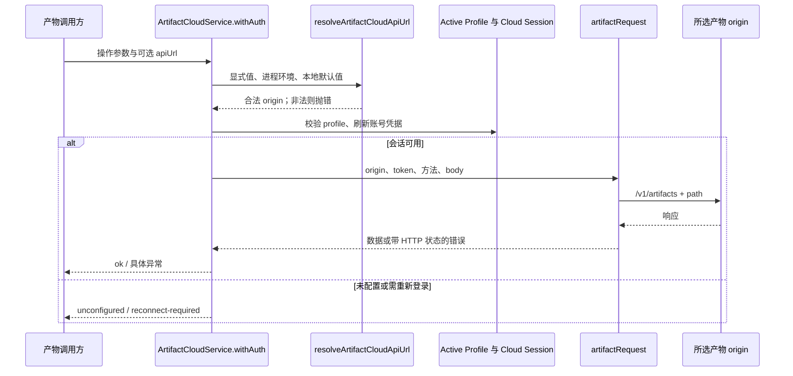
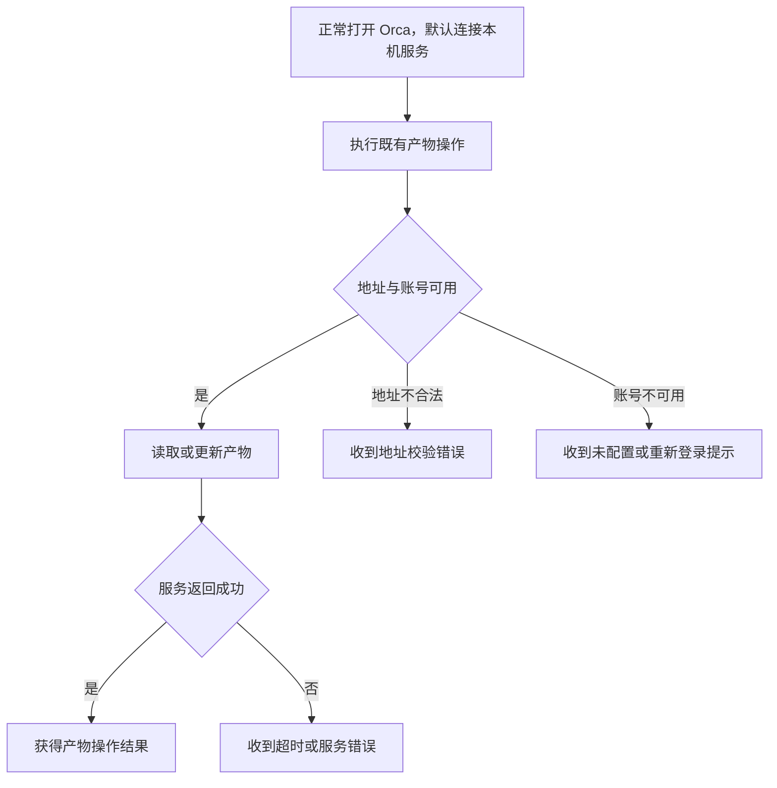

# 自托管产物后端技术说明

## 1. 摘要与状态

2026-09-10 修复：`ArtifactCloudService.withAuth` 为既有 resolver 传入固定默认值 `http://127.0.0.1:8787`。显式参数和环境变量仍可覆盖，缺少环境变量不再让 Artifact 请求走官方云。解析器接受可选默认值，其他调用方（例如 Skills）仍保留第一方默认值。没有增加持久配置文件、launchctl 读取或用户启动脚本。

现有 origin 白名单保持：私有 IPv4 和 `.local` 可使用 HTTP/HTTPS，公网仍限第一方 HTTPS。URL 解析、鉴权、Profile 隔离、发布器和网络请求继续走原服务。核对基线与目标见 [主需求](../requirements/自托管产物后端.md)；本文件记录现有实现及本轮默认地址修复。

关联需求：REQ-201、REQ-202、REQ-203、REQ-204、REQ-205。当前已验证配置、客户端回归、本机后端部署和包内运行时；当前用户 App UI、第二台设备及 SSH/paired runtime 环境未验收。

## 2. 系统链路与用户动线





## 3. 模块与复用

| 模块                                | 变更归属   | 输入与输出                           | 复用结论                                               |
| ----------------------------------- | ---------- | ------------------------------------ | ------------------------------------------------------ |
| `artifact-cloud-config.ts`          | 本需求修改 | override/env/default → origin                | 复用原 resolver 的私有主机判断，增加可选默认值 |
| `artifact-cloud-config.test.ts`     | 本需求修改 | origin 样例 → 精确结果或错误         | 扩展原测试，覆盖私网边界和伪造域名                     |
| `ArtifactCloudService.withAuth`     | 本需求修改   | origin + active profile → 操作上下文 | 传入本地默认值；沿用登录、刷新、profile fence 和显式 override 限制     |
| `artifactRequest`                   | 既有能力   | origin/token/path → HTTP 结果        | 沿用 20 秒超时、禁止 redirect 和错误类型               |
| publisher、share record 与 recovery | 既有能力   | 产物写入/恢复                        | 本需求未新建发布或重试机制                             |

```text
src/main/artifacts/
├── artifact-cloud-config.ts       [修改] URL 策略
├── artifact-cloud-config.test.ts  [修改] 策略回归
├── artifact-cloud-service.ts      [修改] 本地默认值；复用 profile 与登录
└── artifact-cloud-request.ts      [复用] HTTP、超时与错误
```

职责边界遵循仓库的 [SSH 执行边界](../../../reference/ssh-execution-boundary.md) 和 [远端兼容规则](../../../reference/remote-wire-compatibility.md)。本改动没有新增 RPC 字段或 opcode；作用点在服务进程内部。没有依赖工作区必须为 Git worktree 的判断。

## 4. URL 与鉴权契约

| 项目          | 当前行为                                                                             |
| ------------- | ------------------------------------------------------------------------------------ |
| 优先级        | 显式 `apiUrl` > `ORCA_ARTIFACTS_API_URL` > Artifact 本地默认值；其他 resolver 调用方默认第一方 origin |
| 地址解析      | 先 `new URL`，再按 `url.hostname` 分类，最后返回 `url.origin`                        |
| loopback      | 精确允许 `127.0.0.1`、`localhost`、`[::1]`                                           |
| 私有 IPv4     | 四段十进制、各段不超过 255；首段 10，或 192.168，或 172.16–31                        |
| 本地名称      | `hostname.endsWith('.local')`；这是字符串分类，没有查询 DNS 或验证路由               |
| 第一方        | 主机恰为 `onorca.dev` 或以 `.onorca.dev` 结尾，必须 HTTPS                            |
| origin 纯度   | 无 username/password/search/hash，pathname 必须 `/`                                  |
| auth override | `NODE_ENV !== 'production' && !packaged`                                             |
| 网络请求      | `authorization: Bearer ...`；可选 edit token 与 idempotency key；`redirect: 'error'` |

四段数值检查避免把 `10.0.0.1.evil.com` 当私网。代码注释中“不能从链路外访问”只解释选型意图，不能据此宣称客户端建立了网络隔离保证。实际可达性、DNS、路由、后端身份校验属于部署环境，当前源码没有这些事实。

## 5. 错误、恢复与限制

非法 URL 由 `URL` 或 resolver 抛错，发生在远端请求之前。未配置 Cloud Auth 返回 `unconfigured`；账号恢复失败返回 `reconnect-required`；HTTP 非成功响应转为 `OrcaCloudRequestError(status, code)`。204 作为无内容成功，其余成功响应解析 JSON。

URL 扩展未增加重试；需要恢复的发布行为仍由既有 publisher/recovery 处理。不要通过给 URL 添加路径前缀挂载服务，resolver 只接受 origin，实际接口路径由请求层拼接。

在 SSH 或 paired runtime 场景中，需以实际执行该服务的主机作为环境和网络事实源。本轮没有运行远端服务，因此不声明客户端设置会自动传给所有主机。失联不能用于判定工作进程 `exited`。

## 6. 验证与源码索引

URL 分类与 auth override 的现有测试对应 [TC-401～TC-409](../tests/cases/自托管产物后端功能测试.md)；执行记录集中到 `tests/runs`，不在技术文档重复维护通过数。

| 文件                                                                                          | 关键符号与职责                                                                                    |
| --------------------------------------------------------------------------------------------- | ------------------------------------------------------------------------------------------------- |
| [artifact-cloud-config.ts](../../../../src/main/artifacts/artifact-cloud-config.ts)           | `isPrivateIpv4`、`isPrivateHost`、`resolveArtifactCloudApiUrl`、`allowsArtifactCloudAuthOverride` |
| [artifact-cloud-config.test.ts](../../../../src/main/artifacts/artifact-cloud-config.test.ts) | 私网/第一方/伪造域名/越界/auth override                                                           |
| [artifact-cloud-service.ts](../../../../src/main/artifacts/artifact-cloud-service.ts)         | `withAuth`、active profile、operation scope                                                       |
| [artifact-cloud-request.ts](../../../../src/main/artifacts/artifact-cloud-request.ts)         | `artifactRequest`、URL 拼接、headers、超时、HTTP 错误                                             |

## 7. 变更记录

2026-09-05：据原提交和当前源码建立唯一技术说明，区分 origin 校验、鉴权限制与未知部署事实；未更改运行代码。

## 2026-09-10 单端口 HTTP 部署

独立后端位于 `/Users/bytedance/dev/orca-artifact-server`，其源码和部署不包含在本 Orca 仓库的 MR 中。在一个 `0.0.0.0:8787` HTTP 监听中复用现有 Artifact 路由及存储；API 与分享页面共用端口。分享链接使用服务器 LAN IPv4，客户端本机默认请求 loopback。现有内容文件和 slug 保留。

客户端使用固定本地默认值后不需要 `dev.orca.artifact-env` 或 `launch-orca.sh`。本机服务的 LaunchAgent 继续负责服务保活，不作为用户启动 Orca 的额外步骤。部署、包构建和实际运行状态以本轮 Test Run 为准。
