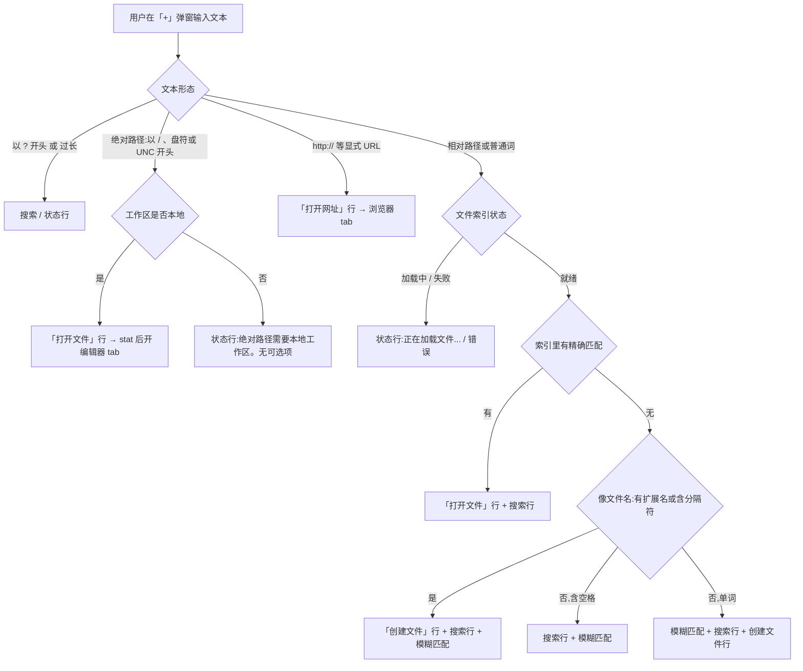
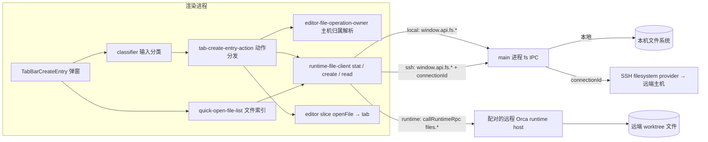
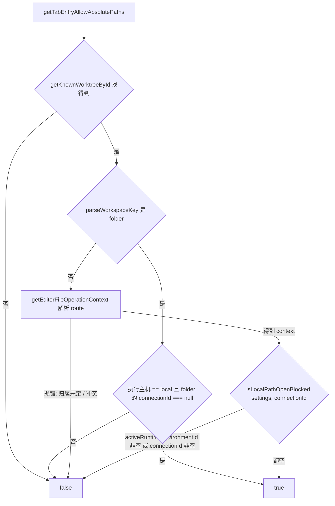
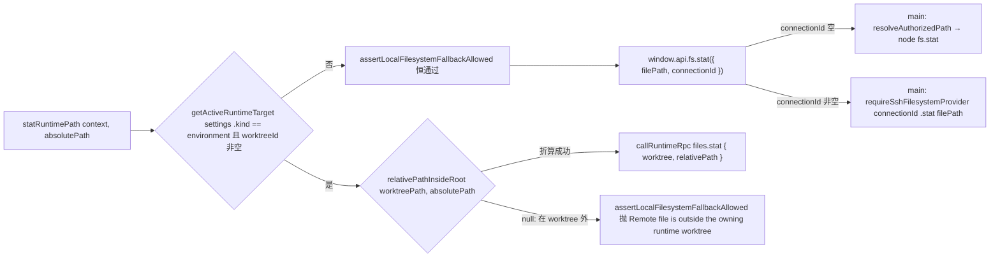

# 标签栏新建Tab弹窗打开文件路径链路调研

| 项 | 内容 |
|---|---|
| 调研对象 | 标签栏「+」弹窗(`TabBarCreateEntry`,即 omnibox)输入文本后「创建文件 / 打开文件 / 打开网址 / 搜索」的分类与执行链路,重点是"输入文件路径 → 新建 tab 打开该文件"在本地工作区与远程工作区(SSH、配对的远程 Orca runtime)下的分流 |
| 调研目的 | 为"在该弹窗中支持输入文件地址直接打开对应文件(本地项目开本地、远程项目开远程)"的方案写作摸底 |
| 目标类型 | 功能型 |
| In scope | 弹窗输入分类器、路径校验、动作分发、文件 RPC 客户端的主机分流、编辑器 `openFile` 落 tab、main / runtime host 侧对应的文件系统边界、其他已能在远程打开绝对路径的入口 |
| Out of scope | 浏览器 tab、智能体启动、历史记录行的实现细节;编辑器面板加载后的保存/监听细节;移动端 |
| 代码快照 | `fork/integration` @ `754c1efff`(2026-09-11) |

## 1. 结论先行

弹窗已经支持"输入文件路径 → 新建 tab 打开文件",但按路径形态与工作区主机分成三种截然不同的现状:

1. **工作区内相对路径在本地、SSH、远程 runtime 三种主机下都已能打开或创建。** 文件索引(`useRuntimeFileListForWorktree`)和 stat/create/read 都按工作区归属主机分流,弹窗里的「打开文件」「创建文件」行对远程工作区同样生效(§4.3、§4.4)。
2. **绝对路径只在本地工作区放行,远程工作区被 `isLocalPathOpenBlocked` 一刀切封死。** 分类器一旦判定输入是绝对路径且 `allowAbsolutePaths === false`,只返回一条状态行"绝对路径需要本地工作区。",不给任何可点选项(§4.1、§4.2)。这是 2026-07 上游 PR #10222 的明确设计:"remote and SSH workspaces stay blocked"。
3. **SSH 主机的文件系统 IPC 本身不限制绝对路径。** main 侧 `fs:stat` 带 `connectionId` 时直接把绝对路径交给 SSH 文件系统 provider,不经过本地路径授权;编辑器 `OpenFile` 也已有 `externalSshTargetId` 字段表示"SSH 主机上 worktree 之外的绝对路径"(§4.4、§4.5)。封禁点只在渲染层的弹窗入口。
4. **配对远程 runtime 的文件 RPC 是 worktree 作用域的。** `files.stat / files.read / files.createFile` 的参数是 `(worktree selector, relativePath)`,客户端在 `getRemoteFileArgs` 里把绝对路径折算成 worktree 内相对路径,折不出来就抛"Remote file is outside the owning runtime worktree";host 侧另有 `files.resolveTerminalPath` 能把绝对路径解析到已知的兄弟工作区(§4.4、§7.2)。
5. **最大未知**:远程 runtime 下 worktree 之外的绝对路径当前没有任何 RPC 可 stat/读取;是否要为它引入新方法,受 `docs/reference/remote-wire-compatibility.md` 的版本混用约束。

| 想知道 | 看 |
|---|---|
| 用户现在输入什么会看到什么行 | §3.1 |
| 输入被分成哪些类、顺序如何 | §4.1 |
| "本地 / 远程"在哪一层、用什么字段判定 | §4.2、§5 |
| stat / create / read 怎么分到本地 IPC、SSH、runtime RPC | §4.4 |
| 打开后的 tab 记录了什么主机信息 | §4.5 |
| 别的入口(终端链接、拖拽、CLI)怎么在远程打开绝对路径 | §4.6 |
| 改动会触及的既有接口与硬约束 | §6 |

## 2. 术语表

| 术语 | 含义 | 与易混项的区别 |
|---|---|---|
| 工作区(worktreeId) | git worktree 或 folder workspace 的统一标识;folder 类 id 由 `parseWorkspaceKey` 识别 | 不是所有工作区都是 git worktree |
| 执行主机(executionHostId) | `local` / `ssh:` + targetId / `runtime:` + envId 三种(形如 `ssh:my-host`);由 `resolveWorktreeOperationRoute` 解析 | 与"客户端平台"(macOS/Windows)无关 |
| SSH 工作区 | 工作区归属 `ssh:` 前缀主机,文件操作带 `connectionId` 走 main 侧 SSH 文件系统 provider | 不经过 runtime RPC |
| 远程 runtime 工作区 | 工作区归属某个配对的远程 Orca 服务(`settings.activeRuntimeEnvironmentId`),文件操作走 `callRuntimeRpc('files.*')` | RPC 参数只有 worktree + 相对路径 |
| external SSH file | `OpenFile.externalSshTargetId` 标记的"SSH 主机上 worktree 之外的绝对路径"文件 | 与 worktree 内文件的区别是读取时要校验 `expectedExternalSshTargetId` |
| 本地路径授权(authorizeExternalPath) | main 侧对**客户端本机**文件系统 worktree 之外路径的显式放行 | 只对本地 fs 生效,web 客户端里是空操作 |

## 3. 现状全景

### 3.1 功能现状

用户点击标签栏「+」,弹出 omnibox。输入框下方的行由输入文本决定;提交(回车或点击)后新建对应 tab 并关闭弹窗,失败则在输入框下方显示红色状态行,弹窗保持打开。

用户截图中输入 `known-pitfalls.md` 只出现「创建文件」和「使用 Google 搜索」,对应上图的 K 分支:该名字在当前工作区文件索引里没有精确匹配,且带扩展名被判为"新文件意图"。

规格与限制(黑盒可观察):

| 项 | 现状 |
|---|---|
| 绝对路径判定 | 以 `/` 开头、`\\` 开头(UNC)或 `X:\` / `X:/` 驱动器形态 |
| 绝对路径的平台一致性 | 根形态必须与**客户端**平台一致:macOS/Linux 客户端只认 POSIX 根,Windows 客户端只认驱动器/UNC 根;不一致时状态行"Enter an absolute path for this computer." |
| `~/` 家目录路径 | 绝对与相对两条校验都拒绝:"Home-relative paths are not supported here." |
| 目录 | 尾斜杠拒绝;stat 到目录拒绝:"Cannot open a directory: …" |
| 相对路径 | 禁 `.`、`..`、`~` 段与空段;创建时逐级建父目录 |
| 已打开的文件 | 如果同一相对路径已在编辑器里打开,「打开文件」行被"切换到标签页"行取代 |
| 打开位置 | 新 tab 落在弹窗所属的 pane group(`groupId`),非预览模式 |
| 远程工作区 + 绝对路径 | 唯一一条状态行"绝对路径需要本地工作区。",不可提交 |

### 3.2 系统总览

| 模块 | 职责 | 调用边界 |
|---|---|---|
| `components/tab-bar/TabBarCreateEntry*` | 弹窗 UI、选项聚合、提交 | 同步调用 classifier;通过 `onOpenEntry` 回调进入 action |
| `components/tab-bar/tab-create-entry-*` | 输入分类、路径校验、动作分发、绝对路径放行判定 | 调用 runtime-file-client(async)、store `openFile`(同步)、`window.api.fs.authorizeExternalPath`(IPC) |
| `lib/editor-file-operation-owner`、`lib/worktree-operation-route`、`lib/local-path-open-guard` | 解析工作区归属主机,生成 `RuntimeFileOperationArgs`;判定"本地路径打开是否被封" | 纯 store 读取 |
| `runtime/runtime-file-*-client` | stat / create / read / list 的三路分流 | `window.api.fs.*`(preload → main IPC)或 `callRuntimeRpc('files.*')` |
| `components/quick-open-file-list` | 弹窗用的文件索引;远程时改为按 query 远端搜索 | 同上 |
| `store/slices/editor` | `openFile` 落 tab、去重、记录主机 provenance | 同步 |
| `main/ipc/filesystem/*` | 本地 fs 授权与读取;`connectionId` 时转 SSH provider | 进程边界 |
| `main/runtime/rpc/methods/files.ts` | 远程 runtime host 侧 `files.*` 方法(worktree 作用域) | RPC 边界 |

## 4. 技术链路

### 4.1 输入与分类

弹窗组件 `TabBarCreateEntrySession` 每次打开重置状态(以 `menuOpen` 作 key 重建)。它把三个来源并成一张 `activeOptions` 列表:已打开 tab 的搜索结果(`useTabCreateEntrySearchResults`)、静态菜单/智能体项、以及 `getTabEntryOptions(query, fileList, 4, { allowAbsolutePaths, localPlatform, searchEngine })` 产出的文件/URL/搜索行,再把历史记录行插到文件匹配下方。提交时把选中行的 `classification` 原样传给 `onOpenEntry`,不重新分类。

`getTabEntryOptions` 的判定顺序是硬编码的:

1. query 过大 → `blocked('query-too-large')`。
2. `?` 前缀强制搜索 → 只给 `search`。
3. `isTabEntryAbsolutePathLike(trimmed)` → 若 `!context.allowAbsolutePaths` 返回单条 `blocked('absolute-path-blocked')`;否则 `validateNewTabEntryAbsolutePath(trimmed, localPlatform)` 通过则给 `{ kind: 'absolute-file', filePath }`,失败给 `blocked('invalid-absolute-path')`。**绝对路径分支先于 URL 与文件索引判断,且不与其他行并列。**
4. 显式 URL(`classifyExplicitUrl`)。
5. 相对路径校验 `validateNewTabEntryRelativePath` 得到候选 `new-file`;文件索引 loading/error 时优先返回状态行。
6. 文件索引就绪后 `findExistingFileMatches` 分精确/模糊;精确匹配有则给 `existing-file` 行;无则按"新文件意图 / 含空格 / 单词"三档排列 `new-file`、`search`、模糊匹配。

`TabEntryClassification` 的 8 个 kind 中,只有 `existing-file`、`new-file`、`absolute-file` 三种最终落到编辑器 tab;`explicit-url`、`host-url`、`search` 走浏览器 tab;`empty`、`blocked` 只渲染状态行。

`localPlatform` 取自 `getRendererAppPlatform()`,即客户端平台;分类器没有任何输入描述工作区主机的平台。

### 4.2 主机归属与绝对路径放行判定

`allowAbsolutePaths` 在 UI 侧由 `createTabEntryAllowAbsolutePathsSelector(worktreeId, { skip })` 提供,只在输入像绝对路径时才真正解析(`skip = !isTabEntryAbsolutePathLike(query)`),并对 12 个 store 切片做引用比较缓存。它最终调用 `getTabEntryAllowAbsolutePaths(state, worktreeId)`:

`isLocalPathOpenBlocked` 的实现只有一行:`Boolean(settings?.activeRuntimeEnvironmentId?.trim() || context?.connectionId?.trim())`。同一个函数也被 `shouldBlockEditorTabLocalOpen`(编辑器 tab 右键"在本机打开/显示")复用,配套的 toast 文案是"Opening remote paths in the local OS is not available.";注释写明其语义是"本地 OS 的 reveal/open 动作接收的是客户端文件系统路径,远程路径属于另一台机器"。弹窗入口把这个"本机 OS 打开远程路径"的守卫直接用作"是否允许输入绝对路径"的开关。

执行阶段再做三次同样的判定(`assertAbsolutePathAllowed` 在授权前、授权后、stat 后各一次),PR #10222 的说法是"fail closed":授权期间工作区归属变化则中止。

`getEditorFileOperationContext` 产出的 `RuntimeFileOperationArgs` 是后续所有文件操作的路由依据:

| 字段 | 来源 | 语义 |
|---|---|---|
| `settings.activeRuntimeEnvironmentId` | `settingsForWorktreeOperationRoute(state.settings, route)` | 非空即"远程 runtime 工作区" |
| `connectionId` | route 是 `ssh:` 且 `runtimeEnvironmentId === null` 时为 `host.targetId` | 非空即"SSH 直连工作区" |
| `expectedExecutionHostId` | `'local'` 或 `ssh:` + targetId | 变更类 IPC 用它校验主机未漂移 |
| `expectedSshTargetId` / `expectedSshConnectionGeneration` | SSH 时填 | 连接代际校验;SSH 但拿不到 generation 时直接抛 `OWNER_CHANGED_MESSAGE` |
| `worktreePath` | 传入或 folder workspace 的 `folderPath` | runtime RPC 折算相对路径的根 |

folder workspace 有一条独立分支:`getTabEntryFileOperationContext` 在"执行主机为 local 且 connectionId 为 null"时不走 `getEditorFileOperationContext`,而是直接构造 `{ settings: { ...settings, activeRuntimeEnvironmentId: null }, expectedExecutionHostId: 'local' }`。

### 4.3 执行:打开、创建与 stat

`openTabBarEntry(args)` 是 `onOpenEntry` 的唯一实现(`use-terminal-create-actions.ts` 里的 `handleOpenEntry`)。它从 store 取工作区、构造 `runtimeContext`、计算 `allowAbsolutePaths` 与 `localPlatform`,再调用纯函数 `openTabEntryWithOperations`,把 `createRuntimePath / statRuntimePath / openFile / openWorkspaceBrowserTab / authorizeExternalPath / assertAbsolutePathAllowed` 作为 `operations` 注入(测试用同一入口打桩)。

三条落编辑器的分支:

| classification | 步骤 | 传给 `openFile` 的 `relativePath` |
|---|---|---|
| `existing-file` | `joinPath(worktreePath, relativePath)` → `statRuntimePath` → 目录则拒绝 → `openFile` | 输入的相对路径 |
| `new-file` | 逐级 `createRuntimePath(dir)`(EEXIST 容忍并 stat 确认是目录)→ `createRuntimePath(file)`(EEXIST 容忍)→ 同 `existing-file` | 输入的相对路径 |
| `absolute-file` | `validateNewTabEntryAbsolutePath` → `assertAbsolutePathAllowed` → `authorizeExternalPath({ targetPath })` → assert → `statRuntimePath` → 目录则拒绝 → assert → `openFile` | `toWorktreeRelativePath(filePath, worktreePath) \|\| filePath`:在 worktree 内则为相对路径,否则用绝对路径本身当标签 |

三者都以 `{ preview: false, targetGroupId: groupId }` 打开,`language` 用 `detectLanguage` 按扩展名推断,`mode: 'edit'`。`absolute-file` 分支没有向 `openFile` 传 `externalSshTargetId` 或 `runtimeEnvironmentId`。

### 4.4 文件 RPC 的三路分流

客户端 `runtime-file-*-client` 对每个操作用同一模式分流,以 `statRuntimePath(context, absolutePath)` 为例:

三条路径的边界事实:

- **本地**:main 侧 `fs:stat` 经 `resolveAuthorizedPath(filePath, store)` 校验路径在已知工作区内或已被 `authorizeExternalPath` 放行。
- **SSH**:main 侧 `fs:stat` 在 `args.connectionId` 非空时直接 `requireSshFilesystemProvider(connectionId).stat(filePath)`,**不调用 `resolveAuthorizedPath`**,绝对路径不受 worktree 限制。`createRuntimePath` 同理,只是多带 `withSshMutationExpectation` 生成的 `expectedExecutionHostId / expectedSshTargetId / expectedSshConnectionGeneration`。
- **远程 runtime**:RPC 方法 `files.stat` 的参数 schema 是 `FileTreePath = { worktree, relativePath }`,host 侧 `runtime.statRuntimeFile(worktree, relativePath)`;客户端在 `getRemoteFileArgs` 折算失败即抛错,不发请求。读取端 `readRuntimeFileContent` 的规则相同:environment 时要求 `relativePath` 存在且非绝对路径,否则同样抛"Remote file is outside the owning runtime worktree";`files.read` 返回 `truncated` 时拒绝作为可编辑内容打开。

`listRuntimeFiles` 与 `searchRuntimeFilePaths`(弹窗文件索引)也按同一规则分流;远程时 `useRuntimeFileListForWorktree` 不再全量列表,改为按 query 远端搜索(limit 32、120 ms 防抖),其 `requestContext` 由 `getFileExplorerOperationOwnerFromState` → `getFileExplorerOperationRoute` 生成,与 §4.2 的 `getEditorFileOperationContext` 是两套独立但同源的归属解析。

浏览器版客户端(`web/preload-api/web-filesystem-api.ts`)没有 main 进程:`window.api.fs.stat / readFile / listFiles` 全部先经 `resolveRuntimeFilePath(filePath)` 反查所属 worktree 并折算相对路径,折不出来抛"File is outside runtime worktree";`authorizeExternalPath` 在该实现里是 `() => Promise.resolve()`。

runtime host 侧另有一条与绝对路径相关的方法 `files.resolveTerminalPath`(`RuntimeFileCommandsWithResolveTerminalPath.resolveTerminalPath`):输入 `(worktreeSelector, pathText, cwd?, …, crossWorkspace?)`,在 host 上把文本解析为绝对路径,`relativePathInsideRoot` 折算失败且 `crossWorkspace` 时调用 `resolveKnownWorkspaceFileTarget` 尝试匹配**已知的其他工作区**,stat 时按归属 route 选 SSH provider 或本地 `resolveAuthorizedPath`。它的调用方在渲染层的终端链接链路(§4.6)。

### 4.5 落 tab 与后续读取

`openFile` → `applyOpenFileToState`:

- `mode === 'edit'` 且非只读时调用 `captureEditorFileOperationProvenance(s, worktreeId, file.runtimeEnvironmentId, file.runtimeEnvironmentId !== undefined)` 记录归属快照;失败仅 toast,不阻断打开。
- `runtimeEnvironmentId` 取 provenance 的 route;没有 provenance 时回落到 `settings.activeRuntimeEnvironmentId`。
- 去重键是 `(可复用的 mode, isSameEditorOwner(worktreeId, runtimeEnvironmentId), filePath)`;命中则复用已有 tab 并按需更新 `externalSshTargetId`(`file.externalSshTargetId ?? existing.externalSshTargetId`)。
- 新 tab id 由 `resolveEditorFileIdForOwner` 生成,追加到 `tabBarOrderByWorktree[worktreeId]` 末尾,再由 `openWorkspaceEditorItem` 在目标 group 建立 editor item。

`OpenFile` 中与主机相关的字段:`worktreeId`、`runtimeEnvironmentId`(注释:远程 untitled 清理要定位到创建时的环境)、`externalSshTargetId`(注释:"SSH target that owns an absolute path outside the worktree")、`operationProvenance`(注释:"mutations reject replacement owners")。`canUseChangesModeForFile` 用 `relativePath !== filePath && !isAbsolutePathLike(relativePath)` 判断一个 tab 是否 worktree 内文件,即 `relativePath` 等于绝对路径本身就是"worktree 外文件"的既有信号。

读取侧 `readRuntimeFileContent({ settings, filePath, relativePath, worktreeId, connectionId, expectedExternalSshTargetId })` 先执行 `assertExternalSshReadOwnership`:传了 `expectedExternalSshTargetId` 但当前是 environment 目标、或 `connectionId` 与之不等,抛"External SSH files are not available after the workspace host changes."。

### 4.6 其他入口对远程绝对路径的处理

同一个"绝对路径 → 编辑器 tab"的需求,仓内已有多个入口,各自的主机处理并不一致:

| 入口 | 触发 | SSH 工作区 + worktree 外绝对路径 | 远程 runtime 工作区 + worktree 外绝对路径 | 本地授权 |
|---|---|---|---|---|
| 终端链接(Cmd/Ctrl-click、OSC 8 `file://`) | `openDetectedFilePath` | **可打开**:`statRuntimePath` 带 `connectionId` 直达 SSH provider;`openFile` 时打上 `externalSshTargetId` | `statRuntimePath` 抛 "Remote file is outside the owning runtime worktree",被 catch 后静默返回 | 仅 `canClientOsOpenWorkspaceFile`(本地)时 `authorizeExternalPath`;注释:"remote paths don't need local auth — the relay/runtime is the security boundary" |
| Agent 消息里的文件链接 | `useNativeChatFileLinkClick` → `openDetectedFilePath` | 同上 | 同上 | 同上 |
| 「+」弹窗输入绝对路径 | `openAbsoluteTabEntryFile` | `isLocalPathOpenBlocked` 封禁,无选项行 | 同左 | 先 `authorizeExternalPath` 再 stat |
| Markdown 内 `file://` 链接 | `markdown-link-action` | `relativePath === undefined` 时 `isLocalPathOpenBlocked` + toast | 同左 | 通过后 `authorizeExternalPath` |
| 拖拽文件到窗口 | `useGlobalFileDrop` | 改道:`importExternalPathsToRuntime` 上传到 worktree 内 `.orca/drops` 再打开 | 同左 | 本地时 `authorizeExternalPath` |
| CLI `orca file open` | `files.open` → `openMobileFile` | `isSafeMobileRelativePath` 拒绝绝对路径(`invalid_relative_path`) | 同左 | 无 |
| 移动端 / 配对 Web 的终端点按 | `files.resolveTerminalPath` | 只放行 `/tmp`、`/private/tmp`、provider tempdir,且需终端输出溯源 + 一次性 grant | 同左 | host 侧 `resolveAuthorizedPath` |
| `orca://` deep link、OS open-file | main `open-url` / `open-file` | 无远端入口 | 无 | — |

终端链接入口是唯一一处写入 `OpenFile.externalSshTargetId` 的代码;它还会在"其他工作区已打开同一路径"时用 `findWorkspaceFileRoute` 把 tab 归到兄弟工作区。编辑器加载器 `useEditorPanelFileContentLoader` 对 `relativePath === filePath` 的 tab 按 `externalSshTargetId ?? connectionId` 推断 SSH 归属,再用 `findWorkspaceFileRoute` 做工作区迁移;远程 runtime 且找不到 route 时抛 "External local files are not available for remote workspaces.";没有 SSH 归属时重新 `authorizeExternalPath` 并以本地读取。保存侧 `editor-save-queue` 走 `getEditorFileOperationContext(state, liveFile, worktreePath)`,`externalSshTargetId` 与当前 route 不符即抛 `OWNER_CHANGED_MESSAGE`。

main 侧的本地授权模型:`authorizeExternalPath(targetPath)` 把 `resolve` 与 `realpathSync` 两种形态写入进程内存里的 LRU `Set`(上限 4096,无 TTL);`isPathAllowed` 先按前缀匹配该集合,再匹配 `getAllowedRoots(store)`(已注册 repo/worktree 根)。带 `connectionId` 的 `fs:readDir / readFile / stat / pathExists / writeFile / deletePath` 全部跳过这套校验;写操作另有 `assertSshMutationExpectation` 只校验"主机未变",不校验路径归属。SSH provider 经 relay 的 `fs.stat / fs.readFile` 在远端 `expandTilde` 后直接 stat,没有根白名单。

## 5. 关键规则与语义

| 参数 | 语义 | 约束/默认值 | 主要执行点 |
|---|---|---|---|
| `allowAbsolutePaths` | 弹窗是否把绝对路径转成可选项 | 本地工作区 true;SSH / runtime / 归属未定 false | `getTabEntryOptions`、`openTabEntryWithOperations`、`assertAbsolutePathAllowed` ×3 |
| `localPlatform` | 绝对路径根形态校验基准 | `getRendererAppPlatform() === 'win32' ? 'windows' : 'posix'`,即客户端平台 | `validateNewTabEntryAbsolutePath` |
| `limit` | 弹窗最多几条动作行 | UI 传 4;`toOptions` 截断 | `getTabEntryOptions` |
| `RuntimeFileOperationArgs.connectionId` | SSH 直连标识 | route 为 `ssh:` 且无 runtime env 时填 | `statRuntimePath`、`createRuntimePath`、main `fs:*` |
| `RuntimeFileOperationArgs.settings.activeRuntimeEnvironmentId` | 远程 runtime 标识 | 由 `settingsForWorktreeOperationRoute` 按 route 覆盖 | `getRemoteFileArgs`、`getActiveRuntimeTarget` |
| `OpenFile.relativePath` | tab 标签与"是否 worktree 内"的信号 | 绝对路径分支下 worktree 外时等于 `filePath` | `openFile`、`canUseChangesModeForFile`、`dropFileEntriesCoveredByTabResults` |
| `OpenFile.externalSshTargetId` | worktree 外 SSH 文件的归属 target | 弹窗三条分支都不设置 | `applyOpenFileToState`、`readRuntimeFileContent` |
| `crossWorkspace`(`files.resolveTerminalPath`) | host 侧允许把绝对路径重定向到兄弟工作区 | 可选,注释称老客户端不传 | `resolveTerminalPath` |

| 配置 | 读取/执行点 | 静态事实 | 线上值 |
|---|---|---|---|
| `settings.activeRuntimeEnvironmentId` | `getActiveRuntimeTarget`、`isLocalPathOpenBlocked` | 全局设置,按 route 被 `settingsForWorktreeOperationRoute` 覆盖 | 未知(用户环境) |
| `browserDefaultSearchEngine` | 弹窗 `search` 行 | 默认 `DEFAULT_SEARCH_ENGINE` | 未知 |
| 本地化目录 | `verify:localization-catalog / -runtime-catalog / -extraction / -coverage` 四个门禁 | 渲染层文案通过 `translate(key, fallback)`,key 形如 `auto.` + 文件路径段 + `.` + sha1 前 10 位 引用,6 个 locale(en/es/fr/ja/ko/zh);`config/scripts/localize-renderer-strings.mjs` 负责铸键 | — |

弹窗内与路径相关的错误文案(均来自代码常量或 `translate` fallback):

| 场景 | 文案 |
|---|---|
| 远程工作区输入绝对路径 | 绝对路径需要本地工作区。(`absolutePathRemoteBlocked`;执行阶段的同义常量 `TAB_ENTRY_ABSOLUTE_PATH_REMOTE_BLOCKED_MESSAGE` 未本地化) |
| 客户端平台与根形态不符 | Enter an absolute path for this computer. |
| `~` 路径 | Home-relative paths are not supported here. |
| 尾斜杠 | Enter a file path, not a directory path. |
| stat 失败 | File not found: …(绝对)/ File no longer exists: …(相对) |
| stat 到目录 | Cannot open a directory: … |
| runtime 工作区 worktree 外 | Remote file is outside the owning runtime worktree |
| 归属未定/漂移 | Couldn't verify which host owns this file. Reopen the file after the connection settles. |

## 6. 面向后续方案的现状接口

- **分类器是纯函数、上下文只有三个字段**:`TabEntryOptionsContext = { allowAbsolutePaths?, localPlatform?, searchEngine? }`,分类结果的 union 类型 `TabEntryClassification` 被 `TabBarCreateEntryRow`(图标与标签)、`open-tab-entry-dedupe`、`tab-create-entry-network-selection` 等按 `kind` 穷举消费。
- **放行开关与"本机 OS 打开远程路径"共用一个守卫**:`isLocalPathOpenBlocked` 同时服务弹窗绝对路径和编辑器 tab 的 reveal/open 菜单。
- **绝对路径打开的执行体只有 `openAbsoluteTabEntryFile` 一个函数**,依赖注入的 `operations` 接口固定为 6 个成员;测试 `tab-create-entry-action.test.ts` 与 `tab-create-entry-local-path.test.ts` 共 6 + 17 个用例覆盖本地放行、SSH/runtime 封禁、folder workspace 各种归属状态、平台不符等。
- **SSH 路径上 main 侧不做 worktree 约束**,授权语义(`resolveAuthorizedPath` / `authorizeExternalPath`)只作用于本地 fs。
- **runtime RPC 的 `files.*` 全部是 worktree 作用域**;host 侧存在能跨工作区解析绝对路径的 `files.resolveTerminalPath`,但它以"终端链接"为语义命名,且需要 host 支持 `crossWorkspace`。任何新增 RPC 方法或字段都落在 `docs/reference/remote-wire-compatibility.md` 的规则内(新增可选字段安全;新方法需要老 host 回退)。
- **编辑器已有 worktree 外文件的表示**:`relativePath === filePath` 与 `externalSshTargetId`;读取端已有 `expectedExternalSshTargetId` 校验。
- **弹窗以客户端平台校验路径根形态**,工作区主机平台在这条链路上没有任何输入(`Worktree.path` 只在 `toWorktreeRelativePath` 时参与)。
- **fork 约束**:`config/fork-features.jsonc` 与 `config/architecture-policies.jsonc` 里没有任何 `tab-bar` 相关的 seam 或 feature 登记;`src/renderer/src/components/tab-bar/**`、`src/renderer/src/lib/local-path-open-guard.ts`、`src/renderer/src/runtime/**` 都是上游文件。
- **文案门禁**:新增 `translate` 文案必须同步进 6 个 locale 文件并通过 4 个 `verify:localization-*` 门禁。

## 7. 冲突与未知项

### 7.1 已确认冲突

| 证据对象 | 现状 | 说明 |
|---|---|---|
| `TAB_ENTRY_ABSOLUTE_PATH_REMOTE_BLOCKED_MESSAGE`(action.ts)vs `absolutePathRemoteBlocked`(classifier.ts) | 同一句话两处定义,前者硬编码英文、后者 `translate` | 执行期抛出的错误未本地化 |
| `local-path-open-guard.ts` 的注释语义("本机 OS 打开动作")vs 弹窗用法("是否允许输入绝对路径") | 守卫被复用为不同语义的开关 | 改任一方会影响另一方 |
| `getEditorFileOperationContext`(弹窗动作)vs `getFileExplorerOperationOwnerFromState`(弹窗文件索引) | 两套归属解析,来源同为 `resolveWorktreeOperationRoute`,但 folder workspace 的处理分支不同 | 索引就绪与动作放行可能短暂不一致(仅推断,未复现) |

### 7.2 未知项 / 待运行时验证

1. **远程 runtime 下 worktree 之外的绝对路径**:没有任何 `files.*` RPC 接受绝对路径;`files.resolveTerminalPath` 的 `crossWorkspace` 只匹配已知工作区。host 侧 `resolveKnownWorkspaceFileTarget` 的实现与匹配范围未追(在 `this.host` 上的可选方法)。
2. **SSH filesystem provider 的能力边界**:`requireSshFilesystemProvider(connectionId).stat/readFile` 对远端任意绝对路径的行为(权限、符号链接、Windows 远端)未在仓内验证,需运行时证据。
3. **`getEditorFileOperationContext` 在 SSH 且 `expectedSshConnectionGeneration` 缺失时抛错**的触发时机(注释称"old/partial SSH publication")未追到发布方。
4. 工作区主机平台(远端是 Windows、客户端是 macOS 时)在文件路径校验上的既有处理:除 `isCaseInsensitiveRuntimeRoot(worktreePath)` 用于大小写折叠外,未见其他消费点。
5. **读写不对称**:编辑器读取用实时 `getConnectionIdForFile` 推断主机,不经 `operationProvenance`;保存则严格校验 provenance。未见注释说明是否有意。
6. **`findWorkspaceFileRoute` 的匹配范围**(只匹配已注册工作区的路径前缀?是否含 detected worktrees)未追。

## 8. 自校验与验证状态

- 回读确认:`tab-create-entry-classifier.ts`、`tab-create-entry-local-path.ts`、`tab-create-entry-action.ts`、`tab-create-entry-absolute-file.ts`、`local-path-open-guard.ts`、`editor-file-operation-owner.ts`、`runtime-file-routing.ts`、`runtime-file-metadata-client.ts`、`runtime-file-read-client.ts`、`open-file-apply.ts`、`filesystem-read-handlers.ts`(`fs:stat`)、`rpc/methods/files.ts`(`files.stat`)、`web-filesystem-api.ts`、`web-runtime-worktree-catalog.ts` 中所述逻辑均在文件中存在。
- 历史确认:`git log -S "Absolute paths require a local workspace"` 唯一命中 `bd45d705b`(上游 PR #10222,2026-07-23),提交说明原文"remote and SSH workspaces stay blocked"。
- 未运行任何测试或应用;§3.1 的用户可见行为由代码分支推出,未做真机截图。
- 子代理回传的"其他入口"结论,主流程已回读 `terminal-file-open-routing.ts`(`openDetectedFilePath` 主体)、`useEditorPanelFileContentLoader.ts`(external 分支)、`filesystem-auth.ts`(`authorizeExternalPath` / `isPathAllowed`)、`markdown-link-action.ts`(`isLocalPathOpenBlocked` 分支)、`workspace-file-host-routing.ts` 确认;拖拽、CLI、移动端 grant、deep link 四项来自子代理对相应文件的直接阅读,主流程未二次回读,标为子代理确认。

## 9. 关键文件索引

| 章节 | 文件 | 关键符号/职责 |
|---|---|---|
| 3, 4.1 | `src/renderer/src/components/tab-bar/TabBarCreateEntry.tsx` | `TabBarCreateEntrySession`:选项聚合、`allowAbsolutePaths` selector、提交 |
| 3, 4.1 | `src/renderer/src/components/tab-bar/TabBarCreateEntryRow.tsx` | 按 `classification.kind` 决定图标与「打开文件 / 创建文件 / 打开网址 / 搜索」标签 |
| 4.1 | `src/renderer/src/components/tab-bar/tab-create-entry-classifier.ts` | `getTabEntryOptions`、`TabEntryClassification`、`absolute-path-blocked` |
| 4.1 | `src/renderer/src/components/tab-bar/tab-create-entry-path-validation.ts` | `isTabEntryAbsolutePathLike`、`validateNewTabEntryAbsolutePath`、`validateNewTabEntryRelativePath` |
| 4.1 | `src/renderer/src/components/tab-bar/tab-create-entry-file-matches.ts` | `findExistingFileMatches`、`isLikelyNewFileIntent` |
| 3.1 | `src/renderer/src/components/tab-bar/open-tab-entry-dedupe.ts` | `dropFileEntriesCoveredByTabResults`:已开 tab 覆盖文件行 |
| 4.2 | `src/renderer/src/components/tab-bar/tab-create-entry-local-path.ts` | `getTabEntryAllowAbsolutePaths`、`getTabEntryFileOperationContext`、`createTabEntryAllowAbsolutePathsSelector` |
| 4.2, 6 | `src/renderer/src/lib/local-path-open-guard.ts` | `isLocalPathOpenBlocked`、`showLocalPathOpenBlockedToast` |
| 4.2 | `src/renderer/src/components/tab-bar/editor-tab-local-open-guard.ts` | `shouldBlockEditorTabLocalOpen`:同一守卫的编辑器 tab 用法 |
| 4.2 | `src/renderer/src/lib/editor-file-operation-owner.ts` | `getEditorFileOperationContext`、`captureEditorFileOperationProvenance`、`OWNER_CHANGED_MESSAGE` |
| 4.2 | `src/renderer/src/lib/resolved-worktree-execution-host.ts` | `getResolvedExecutionHostIdForWorktree` |
| 4.2 | `src/renderer/src/lib/folder-workspace-connection.ts` | `getFolderWorkspaceConnectionId` |
| 4.3 | `src/renderer/src/components/tab-bar/tab-create-entry-action.ts` | `openTabBarEntry`、`openTabEntryWithOperations`、`openExistingFile`、`createParentDirectoriesForNewFile` |
| 4.3 | `src/renderer/src/components/tab-bar/tab-create-entry-absolute-file.ts` | `openAbsoluteTabEntryFile` |
| 4.3 | `src/renderer/src/components/use-terminal-create-actions.ts` | `handleOpenEntry` → `openTabBarEntry` |
| 4.3 | `src/renderer/src/components/tab-bar/tab-bar-surface.tsx` | `TabBarCreateEntry` 挂载点(`!terminalOnly && onOpenEntry`) |
| 4.3 | `src/renderer/src/lib/terminal-links.ts` | `toWorktreeRelativePath` |
| 4.4 | `src/renderer/src/runtime/runtime-file-client-types.ts` | `RuntimeFileOperationArgs`、`RuntimeFileReadArgs` |
| 4.4 | `src/renderer/src/runtime/runtime-file-routing.ts` | `getRemoteFileArgs`、`assertLocalFilesystemFallbackAllowed`、`assertExternalSshReadOwnership`、`withSshMutationExpectation` |
| 4.4 | `src/renderer/src/runtime/runtime-client-target.ts` | `getActiveRuntimeTarget` |
| 4.4 | `src/renderer/src/runtime/runtime-file-metadata-client.ts` | `statRuntimePath` |
| 4.4 | `src/renderer/src/runtime/runtime-file-mutation-client.ts` | `createRuntimePath` |
| 4.4, 4.5 | `src/renderer/src/runtime/runtime-file-read-client.ts` | `readRuntimeFileContent`、`readRuntimeFilePreview` |
| 4.4 | `src/renderer/src/runtime/runtime-file-search-client.ts` | `listRuntimeFiles`、`searchRuntimeFilePaths` |
| 4.4 | `src/renderer/src/components/quick-open-file-list.ts` | `useRuntimeFileListForWorktree`、`RuntimeFileListState` |
| 4.4 | `src/renderer/src/components/right-sidebar/file-explorer-operation-owner.ts` | `getFileExplorerOperationOwnerFromState`、`getFileExplorerOperationRoute` |
| 4.4 | `src/main/ipc/filesystem/filesystem-read-handlers.ts` | `fs:stat`:connectionId → SSH provider,否则 `resolveAuthorizedPath` |
| 4.4 | `src/main/ipc/filesystem/filesystem-write-handlers.ts` | `fs:authorizeExternalPath` handler |
| 4.4 | `src/main/ipc/filesystem-auth.ts` | `authorizeExternalPath`、`resolveAuthorizedPath` |
| 4.4 | `src/main/runtime/rpc/methods/files.ts` | `files.stat`、`files.read`、`files.resolveTerminalPath` 等方法定义 |
| 4.4 | `src/main/runtime/runtime-file-commands-resolve-terminal-path.ts` | `resolveTerminalPath`:host 侧绝对路径 → (worktree, relativePath),`crossWorkspace` |
| 4.4 | `src/renderer/src/web/preload-api/web-filesystem-api.ts` | 浏览器版 `window.api.fs.*` 实现 |
| 4.4 | `src/renderer/src/web/preload-api/web-runtime-worktree-catalog.ts` | `resolveRuntimeFilePath` |
| 4.4 | `src/shared/cross-platform-path.ts` | `relativePathInsideRoot` |
| 4.6 | `src/renderer/src/components/terminal-pane/terminal-file-open-routing.ts` | `openDetectedFilePath`:终端链接打开,唯一写入 `externalSshTargetId` 处 |
| 4.6 | `src/renderer/src/lib/workspace-file-host-routing.ts` | `buildWorkspaceFileContext`、`canClientOsOpenWorkspaceFile` |
| 4.6 | `src/renderer/src/components/terminal-pane/terminal-link-remote-runtime-ssh-open.test.ts` | 用例:SSH 文件链接不经本地授权直接 stat |
| 4.6 | `src/renderer/src/components/native-chat/use-native-chat-file-link-click.ts` | Agent 消息文件链接复用 `openDetectedFilePath` |
| 4.6 | `src/renderer/src/store/slices/editor/actions/markdown-link-action.ts` | Markdown `file://` 链接的 `isLocalPathOpenBlocked` 分支 |
| 4.6 | `src/renderer/src/hooks/useGlobalFileDrop.ts` | 拖拽:远程改道上传 |
| 4.6 | `src/cli/handlers/file.ts` | CLI `orca file open` 的路径解析 |
| 4.6 | `src/main/runtime/runtime-file-command-host.ts` | `isSafeMobileRelativePath` |
| 4.6 | `src/main/runtime/runtime-file-commands-resolve-allowed-terminal-artifact-path.ts` | 移动端 worktree 外路径 grant |
| 4.6 | `src/renderer/src/components/editor/useEditorPanelFileContentLoader.ts` | external 文件读取:`externalSshOwnerId`、`findWorkspaceFileRoute` 迁移 |
| 4.6 | `src/renderer/src/components/editor/editor-save-queue.ts` | 保存侧 `getEditorFileOperationContext` |
| 4.6 | `src/main/providers/ssh-filesystem-provider.ts` | SSH provider `stat` / `readFile` → relay |
| 4.6 | `src/relay/fs-handler.ts` | relay 侧 fs 请求处理,无根白名单 |
| 4.5 | `src/renderer/src/store/slices/editor/types/open-file.ts` | `OpenFile`:`runtimeEnvironmentId`、`externalSshTargetId`、`operationProvenance` |
| 4.5 | `src/renderer/src/store/slices/editor/actions/open-file-action.ts` | `openFile` |
| 4.5 | `src/renderer/src/store/slices/editor/actions/open-file-apply.ts` | `applyOpenFileToState`:去重、provenance、tab 顺序 |
| 4.5 | `src/renderer/src/components/editor/editor-panel-file-mode.ts` | `isAbsolutePathLike`、`canUseChangesModeForFile` |
| 5 | `src/renderer/src/i18n/locales/zh.json` | `auto.components.tab.bar.TabBarCreateEntry.*`、`absolutePathRemoteBlocked` |
| 5 | `config/scripts/localize-renderer-strings.mjs` | `keyForCandidate`:以 `auto.` + 文件路径段 + sha1 前 10 位铸键 |
| 6 | `docs/reference/remote-wire-compatibility.md` | 客户端与 runtime host 混版规则 |
| 6 | `docs/reference/ssh-execution-boundary.md` | 执行主机拥有文件系统、禁止本地静默替代 |
| 6 | `config/fork-features.jsonc` | fork 功能登记(当前无 tab-bar 相关条目) |
| 8 | `src/renderer/src/components/tab-bar/tab-create-entry-local-path.test.ts` | 17 个放行/封禁用例 |
| 8 | `src/renderer/src/components/tab-bar/tab-create-entry-action.test.ts` | 绝对路径授权、远程拒绝、Windows 路径等用例 |
| 8 | `src/renderer/src/components/tab-bar/tab-create-entry-classifier.test.ts` | `blocks absolute paths for remote workspaces` 等 |

## 10. 关联文档与过程件

- 需求文档:[远程工作区绝对路径打开](../requirements/远程工作区绝对路径打开.md)(REQ-301～REQ-306);下游方案:[标签栏新建Tab弹窗远程工作区打开绝对路径方案](../solutions/标签栏新建Tab弹窗远程工作区打开绝对路径方案.md)。
- 相邻调研:`docs/research/orca-architecture/Orca 架构解读.md`、`docs/research/orca-architecture-overview/Orca架构全景解读.md`。
- 上游来源:PR #10222(`bd45d705b`,fix(tab-bar): open absolute local paths from worktree tab create entry)。
- 过程件:`tmp/tasks/2026-09-11-tab-create-open-file-path/{repo-profile.md,trace-log.md,open-questions.md}`。
