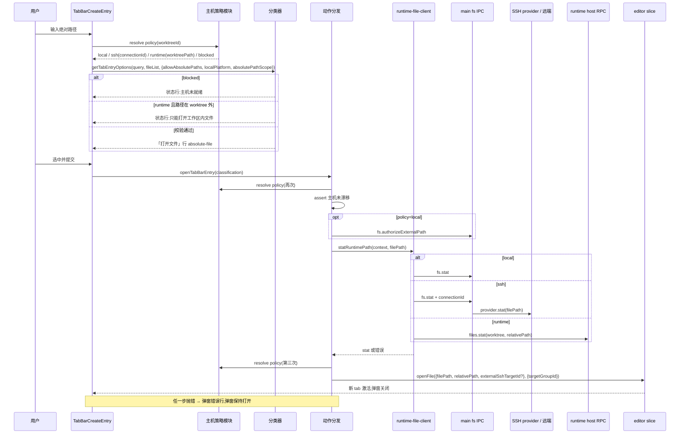
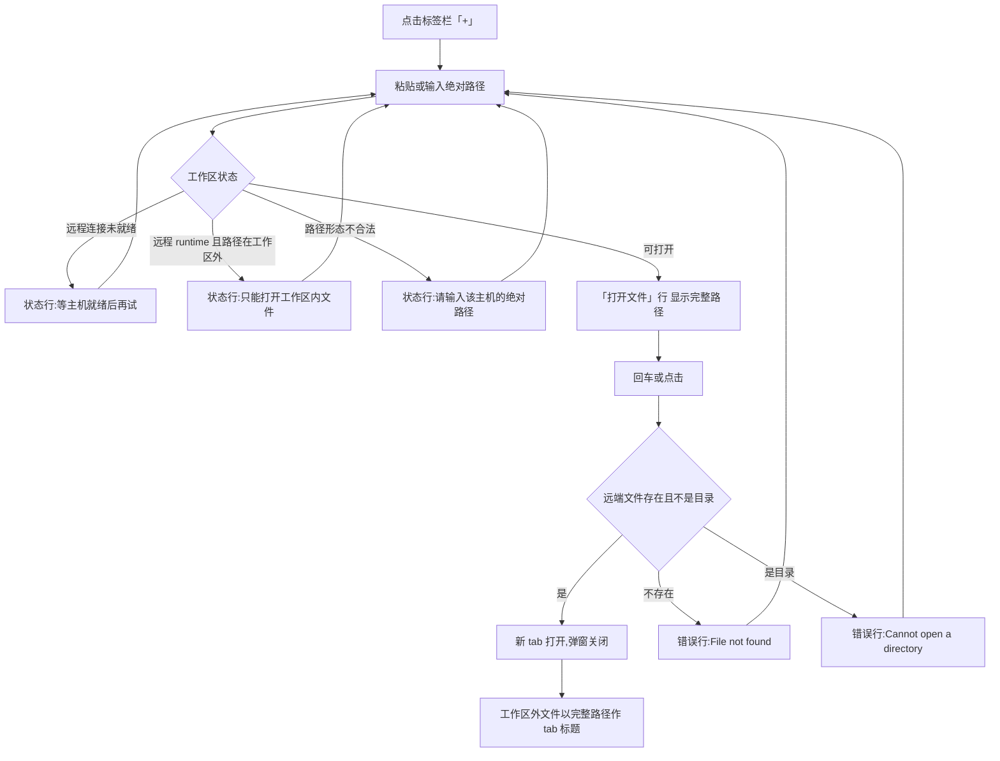
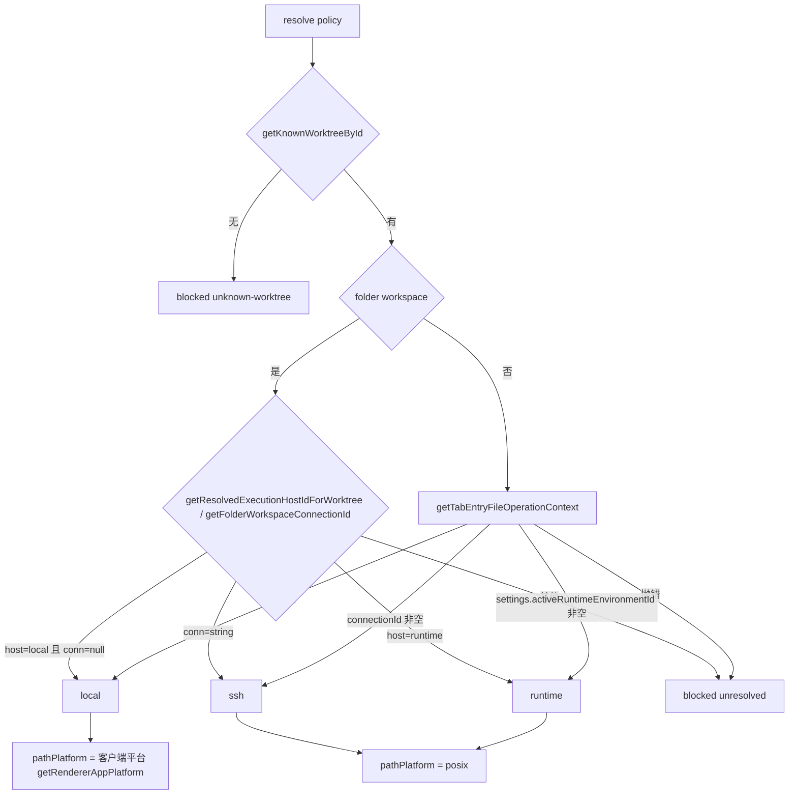
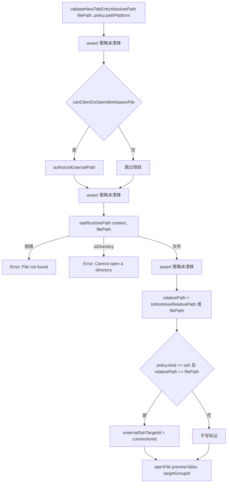
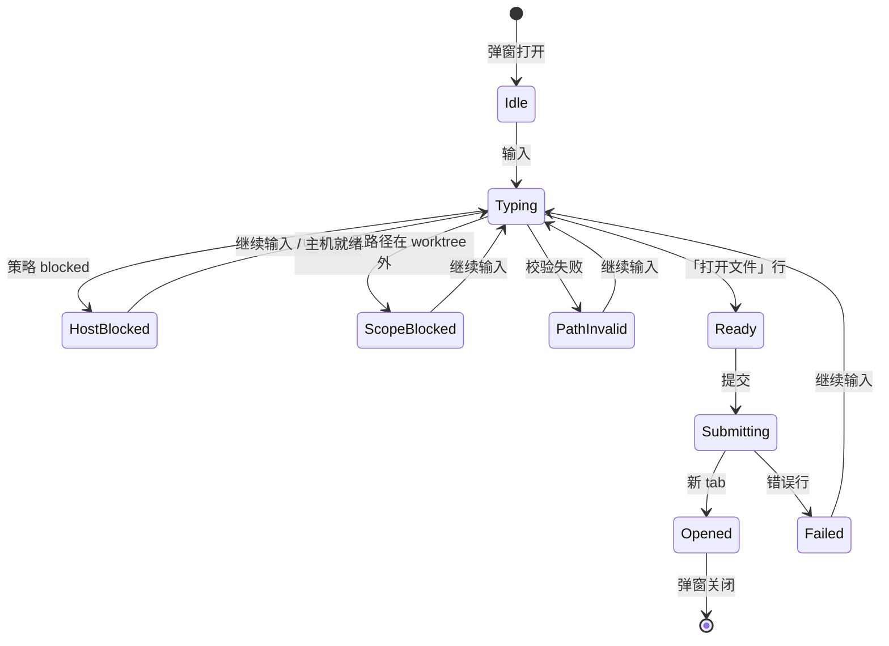

# 标签栏新建Tab弹窗远程工作区打开绝对路径方案

> 最后更新：2026-09-11（已吸收首轮批注）
> 本地主稿：`docs/issue/远程工作区绝对路径打开/solutions/`
> 飞书归档：待创建

## 0. 摘要

标签栏「+」弹窗今天已经能按路径打开或创建文件，但只有一个缺口：在 SSH 或远程 runtime 工作区里输入绝对路径时，弹窗一律显示「绝对路径需要本地工作区。」，不给任何可点的行。需求目标是"本地项目开本地、远程项目开远程"，也就是让这条入口和终端链接点击一样，把绝对路径交给工作区所属的主机去 stat 和打开。需求点见 [远程工作区绝对路径打开](../requirements/远程工作区绝对路径打开.md) 的 REQ-301～REQ-306。

推荐方案是在弹窗入口做增量扩展，不新起打开链路。核心是把现在的布尔开关 `allowAbsolutePaths` 升级为一个"主机策略"对象：它回答工作区归属是本地、SSH 还是远程 runtime，路径应按哪种平台校验，以及是否只能打开 worktree 内的路径。分类器、执行链和弹窗组件都改为消费这个策略。SSH 工作区据此放行，跳过本地授权，并给 worktree 外的文件打上既有的 `externalSshTargetId` 标记；远程 runtime 工作区受 `files.*` RPC 只接受 worktree 相对路径的协议边界限制，只放行 worktree 内的绝对路径，worktree 外在分类阶段就给出状态行，不引入新 RPC。

首轮批注已吸收：远端 Windows 主机不在范围，远程工作区一律按 POSIX 校验路径；runtime 外路径的降级保持现状的状态行形式；需求按 `docs/issue` 流程管理。

主机策略解析放在功能自有目录，五个上游文件只在登记的接缝处接入，符合本仓库 fork 维护规则。整个方案不新增后端能力，不改 IPC 和 RPC 协议。读者应重点关注 §3.3 的候选思路取舍、§5.5 的策略类型定义和 §6.2 的风险。

## 1. 状态与结论

| 项目 | 结论 |
| --- | --- |
| 当前状态 | `approved`：用户 2026-09-11 确认进入实现；代码与登记已落地，见 Journal 开发记录 |
| 需求目标 | REQ-301～REQ-306：本地不变；SSH 在远端打开；远程按 POSIX 校验；worktree 外 SSH 文件带归属标记；fail closed；runtime 只放行 worktree 内路径 |
| 推荐方案 | 增量扩展弹窗入口：新增功能自有的"绝对路径主机策略"模块，分类器、执行链、弹窗组件通过接缝消费它；复用终端链接入口已有的 SSH 打开约定 |
| 不做的事 | 不新增 runtime RPC；不改 `isLocalPathOpenBlocked` 本身；不改 main 进程 fs IPC；不改 UI 视觉；不支持 Windows 远端 |
| 关键风险 | 主机在授权和 stat 之间漂移导致打到错误主机；上游后续改动接缝文件时的同步冲突 |
| 飞书归档 | 待创建 |

## 2. 需求调研

### 2.1 需求目标

- 在标签栏「+」弹窗输入一个绝对文件路径，能新建 tab 打开该文件（REQ-302）。
- 工作区归属本地时打开本机文件（REQ-301），归属 SSH 主机时打开远端文件（REQ-302、REQ-304）；远程 runtime 工作区在协议允许范围内打开（REQ-306）。
- 远程工作区按 POSIX 校验路径（REQ-303）；归属未就绪或漂移时拒绝（REQ-305）。
- 不改变现有相对路径、URL、搜索、智能体启动等行为。

### 2.2 背景

用户在使用远程项目时，从终端输出、Agent 回复或其他地方复制到一个绝对路径，希望直接粘到「+」弹窗打开，而不是先在文件树里找。今天这个入口在远程工作区被整体封禁，用户只能退回终端链接点击。

### 2.3 来源与输入

| 来源 | 内容 |
| --- | --- |
| 需求文档 | [远程工作区绝对路径打开](../requirements/远程工作区绝对路径打开.md)：REQ-301～REQ-306、已确认结论 |
| 用户 2026-09-11 描述与批注 | "输入文件地址能新建 tab 打开；远程开远程、本地开本地"；"不管windows"；"原来是啥样的 就啥样的吧"；"按issue来" |
| 调研文档 | [标签栏新建Tab弹窗打开文件路径链路调研](../research/标签栏新建Tab弹窗打开文件路径链路调研.md) |
| 上游设计基线 | PR #10222（`bd45d705b`）：本地工作区放行绝对路径，"remote and SSH workspaces stay blocked" |
| 仓库规则 | `AGENTS.md`、`docs/reference/fork-maintenance.md`、`docs/reference/ssh-execution-boundary.md`、`docs/reference/remote-wire-compatibility.md` |

### 2.4 范围界定

In scope：

- 「+」弹窗对绝对路径的分类、校验、执行与落 tab，覆盖 git worktree 与 folder workspace，覆盖本地、SSH、远程 runtime 三种归属。
- 路径平台校验改为按工作区主机判定：远程一律 POSIX，本地按客户端平台。
- fork 功能登记、门禁、测试用例与 UI 验证证据。

Out of scope：

- 远端为 Windows 的 SSH 主机。
- 远程 runtime 工作区 worktree 之外的绝对路径（协议不支持，本方案只做明确降级）。
- `~/` 家目录路径展开。
- 编辑器 tab 右键"在本机打开"等复用同一守卫的其他入口。
- 打开后编辑器的读写、监听、保存行为。
- 新增 RPC、IPC 或 relay 能力。

### 2.5 未决问题

| 编号 | 问题 | 状态 | 负责人 | 结论 |
| --- | --- | --- | --- | --- |
| Q1 | 远端 SSH 主机是 Windows 时的路径校验 | closed | 用户 | 不考虑 Windows 远端；远程一律按 POSIX 校验（D-003） |
| Q2 | runtime worktree 外路径的降级用状态行还是可点行 | closed | 用户 | 保持现状的状态行形式（D-004） |
| Q3 | 功能登记的 id 与 `docs/issue/` 目录名 | closed | 用户 | 按 issue 流程：目录 `docs/issue/远程工作区绝对路径打开/`，功能 id `remote-workspace-absolute-path-open` |
| Q4 | 是否同时把编辑器 tab 右键"在本机打开"改为远程下载后打开 | closed | 用户 | 不在本方案范围，另立需求 |

### 2.6 已确认结论

| 结论 | 来源 |
| --- | --- |
| 相对路径在三种主机下都已能打开或创建，本方案只处理绝对路径 | 调研文档 §1、§4.3 |
| SSH 主机的 fs IPC 带 `connectionId` 时不做 worktree 范围校验，终端链接入口已经这样打开远端绝对路径 | 调研文档 §4.4、§4.6 |
| 远程 runtime 的 `files.*` RPC 只接受 worktree 相对路径 | 调研文档 §4.4 |
| 编辑器已有 worktree 外 SSH 文件的表示与读取校验：`externalSshTargetId`、`expectedExternalSshTargetId` | 调研文档 §4.5、§4.6 |
| 守卫 `isLocalPathOpenBlocked` 同时服务编辑器 tab 右键与 Markdown 链接，不能整体改动 | 调研文档 §6、§7.1 |
| 不考虑 Windows 远端；runtime 外路径保持状态行；按 issue 流程管理 | 用户 2026-09-11 批注 |

## 3. 技术调研

### 3.1 当前现状

完整链路见 [调研文档](../research/标签栏新建Tab弹窗打开文件路径链路调研.md)。与本方案直接相关的结论：

- 弹窗 `TabBarCreateEntry` → 分类器 `getTabEntryOptions` → 动作 `openTabBarEntry` → `openAbsoluteTabEntryFile` → `statRuntimePath` → `openFile`。分类器上下文只有 `allowAbsolutePaths`、`localPlatform`、`searchEngine` 三个字段。
- `allowAbsolutePaths` 由 `getTabEntryAllowAbsolutePaths` 计算，最终落在 `isLocalPathOpenBlocked`，即 `activeRuntimeEnvironmentId` 或 `connectionId` 非空就封禁。
- `localPlatform` 取客户端平台，绝对路径根形态与之不符时报「Enter an absolute path for this computer.」。
- `openAbsoluteTabEntryFile` 无条件先调 `window.api.fs.authorizeExternalPath`，再 stat，再 `openFile`，不写 `externalSshTargetId`；执行阶段三次 `assertAbsolutePathAllowed` 防止归属漂移。
- `statRuntimePath` 三路分流：本地 IPC；`connectionId` → main 侧 SSH provider，不限 worktree；`activeRuntimeEnvironmentId` → RPC `files.stat`，路径必须能折算成 worktree 相对路径，否则抛「Remote file is outside the owning runtime worktree」。
- 终端链接入口 `openDetectedFilePath` 已经实现"SSH 远端绝对路径打开"的全部约定：只在本地时授权、stat 带 `connectionId`、worktree 外文件打 `externalSshTargetId`。

### 3.2 已实现的相似代码与复用候选评估

| 候选 | 位置 | 相似点 | 关键差异 | 结论 |
| --- | --- | --- | --- | --- |
| `openDetectedFilePath` | `src/renderer/src/components/terminal-pane/terminal-file-open-routing.ts` | 同样把绝对路径按主机 stat 后 `openFile`；已处理 SSH 授权跳过与 `externalSshTargetId` | 签名是 `(filePath, line, column, deps)` 且返回 `void`，内部 `catch { return }` 吞掉错误，无法把失败回显到弹窗；目标 group 不是参数；附带 HTML 走浏览器、目录走 OS 打开、行号 reveal 等终端语义 | 不直接复用整函数。复用其**约定**（授权条件、标记规则）和它依赖的公开谓词 `canClientOsOpenWorkspaceFile` |
| `canClientOsOpenWorkspaceFile` | `src/renderer/src/lib/workspace-file-host-routing.ts` | 判定"客户端 OS 能否打开该路径"，即"是否需要本地授权" | 无 | **直接复用**，作为跳过 `authorizeExternalPath` 的判定 |
| `buildWorkspaceFileContext` | 同上 | 构造 `RuntimeFileOperationArgs` | 只填 `connectionId`，不带 provenance 与 SSH 代际校验 | 不采用；弹窗继续用更严格的 `getTabEntryFileOperationContext` |
| `getTabEntryFileOperationContext` / `getTabEntryAllowAbsolutePaths` / `createTabEntryAllowAbsolutePathsSelector` | `src/renderer/src/components/tab-bar/tab-create-entry-local-path.ts` | 现有归属解析与 12 切片记忆化 selector | 结果是布尔值，丢失主机种类 | **增量扩展**：selector 改为返回策略对象；`getTabEntryAllowAbsolutePaths` 保留为布尔包装 |
| `relativePathInsideRoot` | `src/shared/cross-platform-path.ts` | 判定路径是否在 worktree 内并折算 | 无 | **直接复用**，用于远程 runtime 的协议边界预判 |
| `useEditorPanelFileContentLoader` external 分支 | `src/renderer/src/components/editor/useEditorPanelFileContentLoader.ts` | 打开后的读取已支持 `externalSshTargetId ?? connectionId` | 无 | 不改，只保证弹窗按契约写入标记 |

### 3.3 候选技术思路

| 思路 | 做法 | 优点 | 缺点 | 结论 |
| --- | --- | --- | --- | --- |
| A. 直接去掉守卫 | `getTabEntryAllowAbsolutePaths` 恒真 | 改动最小 | Windows 客户端连 Linux 主机被平台校验拒绝；`authorizeExternalPath` 污染本地授权表；tab 缺 `externalSshTargetId`；runtime 外路径报错误导性的「File not found」 | 否决 |
| B. 增量扩展弹窗入口（推荐） | 布尔开关升级为主机策略对象；分类器加协议边界预判；执行链按策略跳过授权并打标记；平台按主机判定 | 只动接缝；复用既有 SSH 打开契约；runtime 降级在分类阶段明确 | 五个上游文件各有小改动，需登记 seam | 采用（D-001） |
| C. 弹窗改调 `openDetectedFilePath` | 绝对路径分支直接委托终端链接入口 | 一份实现 | 无法回显错误、无法指定 group、附带终端语义；要改造终端入口签名反而扩大上游改动 | 否决 |
| D. 为 runtime 新增绝对路径 RPC | 新增 `files.statAbsolute` 等 | 远程 runtime 也能开 worktree 外文件 | 触及 host 侧安全边界与混版兼容；与本需求主诉求（SSH）无关 | 不在本方案（D-002） |

### 3.4 依赖调研与依赖接口

| 依赖 | 接口 | 用途 | 状态 |
| --- | --- | --- | --- |
| `getEditorFileOperationContext` | 返回 `RuntimeFileOperationArgs`，含 `connectionId`、`settings.activeRuntimeEnvironmentId`、`expectedSshConnectionGeneration` | 归属与 SSH 代际 | 已有 |
| `getResolvedExecutionHostIdForWorktree`、`getFolderWorkspaceConnectionId` | folder workspace 归属 | 已有 |
| `statRuntimePath`、`window.api.fs.stat` | 按 `connectionId` 分流到 SSH provider | 远端 stat | 已有，不改 |
| `state.openFile` | 接受 `externalSshTargetId` | 落 tab | 已有，不改 |
| `canClientOsOpenWorkspaceFile` | 本地授权判定 | 跳过授权 | 已有，不改 |
| `relativePathInsideRoot` | worktree 内路径折算 | runtime 边界预判 | 已有，不改 |
| `translate` 与 6 个 locale | 新增/修改状态行文案 | 文案 | 已有；4 个 `verify:localization-*` 门禁 |
| `config/fork-features.jsonc`、`config/architecture-policies.jsonc` | 功能登记与 seam 白名单 | 门禁 | 需新增条目 |

### 3.5 关键约束

- 执行主机拥有文件系统，不得本地静默替代（`docs/reference/ssh-execution-boundary.md`）。归属未解析时必须继续封禁。
- 不改协议：远程 runtime 的 `files.*` 只接受 worktree 相对路径，本方案不新增 RPC（`docs/reference/remote-wire-compatibility.md`）。
- 上游文件只在接缝改动，新代码进功能自有目录（`AGENTS.md` Fork Maintenance）。
- 不改 `isLocalPathOpenBlocked`，它另有两个消费者。
- 文案改动需同步 6 个 locale 并过 `verify:localization-*`。

### 3.6 调研未知项的处置

| 调研未知项 | 处置 |
| --- | --- |
| 远程 runtime worktree 外绝对路径无 RPC | 转为本方案边界：分类阶段明确降级，不实现（D-002） |
| SSH provider 对远端任意路径的权限、符号链接行为 | 转为前提假设：与终端链接入口一致，依赖 provider 返回的错误回显 |
| SSH provider 对 Windows 远端的行为 | 不在范围（D-003） |
| `expectedSshConnectionGeneration` 缺失的触发时机 | 保持现状：`getEditorFileOperationContext` 抛错即策略为 blocked |
| 读写侧主机校验不对称 | 不在范围；本方案不改读写侧 |
| `findWorkspaceFileRoute` 匹配范围 | 保持现状：弹窗按当前工作区打开，加载器可能把属于兄弟工作区的 external 文件迁移过去，与终端链接一致 |

## 4. 交互链路

### 4.1 系统交互图



图覆盖范围：从输入到落 tab 的目标态主链，三种主机的 stat 分流，以及失败回显。读图重点：策略在三个时点解析（渲染、提交、stat 后），本地授权只在 local 分支出现，runtime 的 worktree 外路径在分类阶段就被拦下不发请求。验收关注点：SSH 分支不出现 `authorizeExternalPath` 调用；runtime 分支不出现绝对路径 RPC。

### 4.2 用户动线图



图覆盖范围：用户在弹窗内的全部可见反馈与重试路径。读图重点：所有失败都停留在弹窗内可继续编辑；成功后的 tab 标题规则与终端链接打开的一致。验收关注点：远程工作区不再出现「绝对路径需要本地工作区。」这条死路。

## 5. 方案设计

### 5.1 设计原则

- 主机归属决定一切：路径校验平台、授权与否、stat 走哪条线，都由同一个策略对象派生，不再散落在多处布尔判断。
- 不新增打开链路：沿用 `openAbsoluteTabEntryFile` → `statRuntimePath` → `openFile`，只改它们的输入。
- 与终端链接入口保持同一份 SSH 契约：只在本地授权；worktree 外 SSH 文件打 `externalSshTargetId`。
- 协议边界前置：远程 runtime 的 worktree 外路径在分类阶段拦下，不把协议错误伪装成「File not found」。
- fail closed 不退化：归属未解析仍封禁；提交过程中主机漂移即中止。
- 上游改动最小：新逻辑进功能自有目录，上游文件只在登记接缝处接入。
- 远程一律 POSIX：不引入远端平台探测，Windows 远端不在范围。

### 5.2 仓库规范与现有逻辑

| 规范 | 来源 | 本方案如何遵循 |
| --- | --- | --- |
| 新代码进功能自有路径，上游文件只在 seam 改动并登记 | `AGENTS.md` Fork Maintenance；`docs/reference/fork-maintenance.md` §2、§6 | 策略模块放 `src/renderer/src/components/tab-entry-remote-path/`；五个上游文件登记为 seams |
| Register before building | `AGENTS.md` Iteration Principles 1 | `docs/issue/远程工作区绝对路径打开/` 已建；实现前补 `fork-features.jsonc` 条目 |
| 执行主机拥有文件系统，禁止本地静默替代 | `docs/reference/ssh-execution-boundary.md` | blocked 策略继续拒绝；SSH 分支不调用本地授权 |
| 混版兼容 | `docs/reference/remote-wire-compatibility.md` | 不新增 RPC 方法与字段 |
| 文件命名用具体领域概念 | `AGENTS.md` File and Module Naming | `absolute-path-host-policy.ts`，不用 helpers/utils |
| 文案经 `translate`，同步 6 个 locale | `verify:localization-*` 门禁 | 新增 1 个 key、修改 1 个 key 的文案 |
| 平台判断走运行时检查 | `AGENTS.md` Cross-Platform Support | 本地按 `getRendererAppPlatform()`；远程固定 POSIX，不硬编码客户端平台 |
| 现有 fail-closed 模式 | PR #10222 的三次 `assertAbsolutePathAllowed` | 保留并升级为策略等价性断言 |

### 5.3 复用与扩展策略

- 复用 `getTabEntryFileOperationContext` 构造 `RuntimeFileOperationArgs`，从中读取 `connectionId` 与 `settings.activeRuntimeEnvironmentId` 判定主机种类；不另写归属解析。
- 复用 `createTabEntryAllowAbsolutePathsSelector` 的 12 切片记忆化骨架，只把结果类型从布尔改为策略对象。
- 复用 `canClientOsOpenWorkspaceFile` 决定是否授权，与终端链接入口共用同一谓词。
- 复用 `relativePathInsideRoot` 做协议边界预判。
- 复用 `OpenFile.externalSshTargetId` 契约与编辑器加载器，不改读写侧。
- 不新建平行的打开函数、平行的错误文案体系或平行的 selector。

### 5.4 仓库改动总览

```text
src/renderer/src/components/
├── tab-entry-remote-path/                                  [新增] 功能自有目录
│   ├── absolute-path-host-policy.ts                        [新增] 主机策略解析、平台规则、漂移比较
│   └── absolute-path-host-policy.test.ts                   [新增] 策略单测
└── tab-bar/
    ├── tab-create-entry-local-path.ts                      [修改] seam:selector 返回策略;布尔包装保留
    ├── tab-create-entry-classifier.ts                      [修改] seam:absolutePathScope 预判 + 文案
    ├── tab-create-entry-action.ts                          [修改] seam:按策略取平台/scope;漂移断言
    ├── tab-create-entry-absolute-file.ts                   [修改] seam:条件授权;写 externalSshTargetId
    ├── TabBarCreateEntry.tsx                               [修改] seam:消费策略 selector
    ├── tab-create-entry-path-validation.ts                 [复用] 不改
    ├── tab-create-entry-local-path.test.ts                 [修改] SSH/runtime 用例改为放行断言
    ├── tab-create-entry-action.test.ts                     [修改] 远程拒绝用例改为授权跳过与标记断言
    └── tab-create-entry-classifier.test.ts                 [修改] 远程封禁用例改为 scope 用例
src/renderer/src/i18n/locales/{en,es,fr,ja,ko,zh}.json      [修改] 1 个新 key,1 个改文案
src/renderer/src/lib/workspace-file-host-routing.ts         [复用] canClientOsOpenWorkspaceFile,不改
src/shared/cross-platform-path.ts                           [复用] relativePathInsideRoot,不改
config/fork-features.jsonc                                  [修改] 新功能条目
config/architecture-policies.jsonc                          [修改] 功能策略 + fork-integration-scope 白名单
docs/issue/远程工作区绝对路径打开/                            [复用] 已建;实现时补 tests/cases、tests/runs
docs/issue/README.md                                        [修改] pnpm generate:issue-index 生成
.docs/remote-workspace-absolute-path-open-ui-validation/DATE/ [新增] 真机验证证据(git 忽略)
```

| 模块 | 职责 | 仓库落点 | 改动类型 | 复用基础 | 扩展方式 | 输入 → 输出 | 依赖 |
| --- | --- | --- | --- | --- | --- | --- | --- |
| 主机策略解析 | 由 worktreeId 得到 local / ssh / runtime / blocked 策略与路径平台 | `tab-entry-remote-path/absolute-path-host-policy.ts` | 新增 | `getTabEntryFileOperationContext`、folder 归属函数 | 新模块，被四个 seam import | `(state, worktreeId)` → 策略对象 | store、lib/editor-file-operation-owner、lib/renderer-app-platform |
| 策略 selector | 记忆化地把策略交给 React | `tab-create-entry-local-path.ts` | 修改 | 现有 12 切片 memo | 结果类型改为策略 | store → 策略对象 | 主机策略解析 |
| 分类器接入 | 按平台校验；runtime 下 worktree 外路径给状态行 | `tab-create-entry-classifier.ts` | 修改 | 现有 absolute 分支 | `TabEntryOptionsContext` 增加可选 `absolutePathScope` | query + context → options | `relativePathInsideRoot`、`translate` |
| 执行链改造 | 条件授权、漂移断言、写标记 | `tab-create-entry-action.ts`、`tab-create-entry-absolute-file.ts` | 修改 | 现有 `openTabEntryWithOperations`/`openAbsoluteTabEntryFile` | 参数增加策略；`assertAbsolutePathAllowed` 改为策略等价断言 | classification + policy → 新 tab / Error | `canClientOsOpenWorkspaceFile`、`statRuntimePath`、`openFile` |
| 弹窗接线 | 消费策略 selector，把平台与 scope 传给分类器 | `TabBarCreateEntry.tsx` | 修改 | 现有 `allowAbsolutePathsSelector` | 换 selector 与三个派生值 | store → props 给分类器 | 策略 selector |
| 文案 | 新状态行与改写的封禁文案 | 6 个 locale | 修改 | 现有 key 体系 | 加 1 改 1 | — | localization 门禁 |
| fork 登记与门禁 | 功能条目、seam、策略、白名单、测试文档 | `config/*.jsonc`、`docs/issue/...` | 新增/修改 | 现有三个功能的条目格式 | 新条目 | — | `check:fork-features`、`check:fork-docs` |

### 5.5 模块：主机策略解析

- 目标：把"这个工作区的绝对路径应该交给谁、按什么平台校验、能否越出 worktree"收敛到一个纯函数。覆盖 REQ-301、REQ-302、REQ-303、REQ-305、REQ-306。
- 仓库落点与改动类型：`src/renderer/src/components/tab-entry-remote-path/absolute-path-host-policy.ts` [新增]；同名 `.test.ts` [新增]。
- 遵循的既有规范与逻辑：folder workspace 与 git worktree 的归属分支沿用 `getTabEntryAllowAbsolutePaths` 现有顺序；归属解析抛错即 blocked，保持 PR #10222 的 fail-closed。
- 复用基础与扩展方式：内部调用 `getTabEntryFileOperationContext`，不复制归属逻辑。
- 输入：`state`（`useAppStore.getState()` 的切片子集）、`worktreeId`。
- 输出：

```ts
export type TabEntryAbsolutePathHostPolicy =
  | { kind: 'blocked'; reason: 'unknown-worktree' | 'unresolved' }
  | { kind: 'local'; pathPlatform: TabEntryLocalPlatform }
  | { kind: 'ssh'; connectionId: string; pathPlatform: 'posix' }
  | { kind: 'runtime'; environmentId: string; worktreePath: string; pathPlatform: 'posix' }

export function resolveTabEntryAbsolutePathHostPolicy(state, worktreeId): TabEntryAbsolutePathHostPolicy
export function isSameTabEntryAbsolutePathHost(a, b): boolean
export function toTabEntryAbsolutePathContext(policy): Pick<TabEntryOptionsContext, 'allowAbsolutePaths' | 'localPlatform' | 'absolutePathScope'>
```

- 核心流程：



- 平台规则：本地沿用 `getRendererAppPlatform() === 'win32' ? 'windows' : 'posix'`；SSH 与 runtime 固定 `posix`（D-003）。`validateNewTabEntryAbsolutePath` 不改，远程工作区输入 Windows 形态路径会得到既有的「Enter an absolute path for this computer.」。
- 漂移比较：`isSameTabEntryAbsolutePathHost` 比较 `kind`，SSH 还比较 `connectionId`，runtime 还比较 `environmentId`。
- 依赖与失败处理：所有失败都归入 `blocked`，不抛出。
- 与其他模块的关系：被 selector、动作分发、执行链三处调用；测试直接构造 store 状态覆盖 7 条分支。

### 5.6 模块：分类器接入与协议边界降级

- 目标：远程 runtime 工作区在分类阶段就拦下 worktree 外路径（REQ-306）；平台校验按策略给出的平台进行（REQ-303）；blocked 策略给出新的状态行文案（REQ-305）。
- 仓库落点与改动类型：`tab-create-entry-classifier.ts` [修改]，`TabEntryOptionsContext` 新增可选字段 `absolutePathScope?: { worktreePath: string }`；6 个 locale [修改]。
- 遵循的既有规范与逻辑：新增字段可选，旧调用点和测试不受影响；分支顺序不变（绝对路径仍先于 URL）。
- 复用基础与扩展方式：`validateNewTabEntryAbsolutePath(trimmed, context.localPlatform)` 不改，只是 `localPlatform` 的取值改由策略提供；在其之后加一步 `relativePathInsideRoot(scope.worktreePath, filePath) === null` 判断。
- 输入：`query`、`fileList`、`context`。
- 输出：新增 blocked id `absolute-path-outside-workspace`；`absolute-path-blocked` 继续用于 blocked 策略。两者都是状态行，不可点选，与现状形式一致（D-004）。
- 文案：
  - 新 key `auto.components.tab.bar.tab.create.entry.classifier.absolutePathOutsideWorkspace`，英文「This remote workspace can only open files inside its worktree.」，中文「该远程工作区只能打开工作区内的文件。」。
  - 改 key `absolutePathRemoteBlocked` 文案为「Absolute paths are unavailable until the workspace host is ready.」，中文「工作区主机就绪后才能打开绝对路径。」。同步更新 `TAB_ENTRY_ABSOLUTE_PATH_REMOTE_BLOCKED_MESSAGE` 常量为同一英文，消除调研 §7.1 记录的双定义漂移。
- 异常处理：路径校验错误沿用现有 `invalid-absolute-path`。
- 与其他模块的关系：`TabBarCreateEntryRow` 无需改动，blocked 走既有状态行渲染。

### 5.7 模块：执行链改造

- 目标：按策略跳过本地授权、在正确主机 stat、写入 `externalSshTargetId`，并在主机漂移时中止（REQ-302、REQ-304、REQ-305）。
- 仓库落点与改动类型：`tab-create-entry-action.ts` [修改]、`tab-create-entry-absolute-file.ts` [修改]。
- 遵循的既有规范与逻辑：保留 `operations` 依赖注入形态，测试继续打桩；保留三个断言时点。
- 复用基础与扩展方式：
  - `openTabBarEntry` 在现有位置计算 `policy`，`allowAbsolutePaths = policy.kind !== 'blocked'`，`localPlatform = policy.pathPlatform`（blocked 时用客户端平台），`absolutePathScope` 仅 runtime 时传。
  - `assertAbsolutePathAllowed` 改为：重新解析策略，`isSameTabEntryAbsolutePathHost(policy, current)` 为假则抛与 `OWNER_CHANGED_MESSAGE` 同义的错误。
  - `openAbsoluteTabEntryFile` 新增参数 `hostPolicy`；授权改为 `if (canClientOsOpenWorkspaceFile(context, filePath))`；`openFile` 时按规则写标记。
- 输入：`classification.filePath`、`runtimeContext`、`hostPolicy`、`groupId`。
- 输出：新 tab 或 Error。
- 核心流程：



- 接口与数据：`openFile` 参数新增 `externalSshTargetId?: string`，字段本身已存在于 `OpenFile`。
- 异常处理：stat 抛错继续包装为「File not found: …」；SSH provider 的权限错误也会落到这里，与终端链接入口一致。
- 与其他模块的关系：策略由 §5.5 提供；测试改造见 §6.3。

### 5.8 模块：弹窗接线与前端状态

- 目标：弹窗组件用策略 selector 替换布尔 selector，把平台和 scope 交给分类器。
- 仓库落点与改动类型：`TabBarCreateEntry.tsx` [修改]、`tab-create-entry-local-path.ts` [修改]。
- 代码组织：不新增组件；`TabBarCreateEntry`、`TabBarCreateEntryRow`、`EntryStatusRow` 层级不变。
- 组件拆分与复用：状态行复用 `EntryStatusRow`；「打开文件」行复用现有 `absolute-file` 渲染分支，detail 仍显示完整路径。
- 状态管理：策略是从全局 store 派生的只读值，通过 `useAppStore(selector)` 订阅；selector 仍在输入不像绝对路径时 `skip`，避免每次按键解析归属。`pending`、`error` 等仍是组件局部状态。
- 交互状态机：



状态机由 `TabBarCreateEntrySession` 维护；`HostBlocked` 与 `ScopeBlocked` 只是 `statusOption` 的两种 blocked id，不新增组件状态。SSH 连接在弹窗打开期间从 connecting 变 connected 时，selector 依赖的 `sshConnectionStates` 切片变化会触发重算，状态行自动消失。

### 5.9 模块：fork 登记与门禁

- 目标：让功能在上游同步后不被丢失，让五个接缝受 `check:fork-features` 保护。
- 仓库落点与改动类型：`config/fork-features.jsonc` [修改]、`config/architecture-policies.jsonc` [修改]、`docs/issue/远程工作区绝对路径打开/` [已建]、`docs/issue/README.md` [生成]。
- 条目要点：
  - `id`：`remote-workspace-absolute-path-open`；`journal`：`docs/issue/远程工作区绝对路径打开/journal.md`。
  - `ownedPaths`：`src/renderer/src/components/tab-entry-remote-path/**`、`docs/issue/远程工作区绝对路径打开/**`。
  - `requiredFiles`：策略模块与其测试。
  - `seams`：`tab-create-entry-local-path.ts`（mustContain `resolveTabEntryAbsolutePathHostPolicy`）、`tab-create-entry-classifier.ts`（`absolutePathScope`）、`tab-create-entry-action.ts`（`isSameTabEntryAbsolutePathHost`）、`tab-create-entry-absolute-file.ts`（`externalSshTargetId`）、`TabBarCreateEntry.tsx`（策略 selector 名）、6 个 locale（新 key）。
  - `dependsOn`：`src/renderer/src/lib/editor-file-operation-owner.ts`、`src/renderer/src/lib/resolved-worktree-execution-host.ts`、`src/renderer/src/lib/folder-workspace-connection.ts`、`src/renderer/src/lib/renderer-app-platform.ts`、`src/renderer/src/lib/workspace-file-host-routing.ts`、`src/shared/cross-platform-path.ts`、`src/shared/workspace-scope.ts`。
  - `checks`：`pnpm exec vitest run --config config/vitest.config.ts src/renderer/src/components/tab-entry-remote-path src/renderer/src/components/tab-bar/tab-create-entry-local-path.test.ts src/renderer/src/components/tab-bar/tab-create-entry-action.test.ts src/renderer/src/components/tab-bar/tab-create-entry-classifier.test.ts`。
  - 策略文件新增 `remote-workspace-absolute-path-open-worktree-scope` 规则，并把 owned 路径与 seams 加入 `fork-integration-scope` 白名单；`es/fr/ja/ko` 四个 locale 目前不在任何白名单，需一并登记。
- 时序：`check:fork-features` 要求 `requiredFiles` 存在，因此 `fork-features.jsonc` 条目与策略模块在同一次提交中加入；`docs/issue` 文档已先行建立。
- 文档：`tests/cases/` 在实现时定义 TC-501 起（编号段 5xx 当前未被占用）。

## 6. 监控、风险与测试

### 6.1 埋点与监控

本功能是客户端本地交互，不新增埋点。可观测信号：

| 信号 | 位置 | 用途 |
| --- | --- | --- |
| 弹窗错误行文案 | `TabBarCreateEntry` 的 `error` 状态 | 区分 File not found / 目录 / 主机漂移 / 协议边界 |
| main 侧 `fs:stat` 的 `connectionId` 参数 | IPC 日志 | 验证 SSH 分支确实带连接而非本地 stat |
| `authorizeExternalPath` 调用 | 单测断言 + IPC 日志 | 验证远程分支未污染本地授权表 |
| `OpenFile.externalSshTargetId` | store devtools / 持久化快照 | 验证 worktree 外 SSH 文件被正确标记 |

### 6.2 风险评估

| 风险 | 等级 | 缓解 |
| --- | --- | --- |
| 授权与 stat 之间主机漂移，把请求打到错误主机 | 高 | 三次策略等价断言；策略比较包含 `connectionId` / `environmentId` |
| 本地授权表被远程路径污染 | 高 | `canClientOsOpenWorkspaceFile` 门控；单测断言远程分支不调用授权 |
| 上游后续改动五个接缝文件造成同步冲突 | 中 | seams 登记 + `report-upstream-seam-changes`；接缝改动保持最小 |
| 远端为 Windows 主机时路径被 POSIX 校验拒绝 | 低 | 已确认不在范围（D-003）；用户会看到既有的平台不符文案 |
| 远程 runtime 用户误以为能开任意路径 | 低 | 分类阶段明确状态行文案 |
| 文案门禁失败 | 低 | 6 个 locale 同步；跑 4 个 `verify:localization-*` |

### 6.3 自测方案

单元测试（vitest），实现时落为 `tests/cases/` 的 TC-501 起：

| 用例 | 关联需求 | 断言 |
| --- | --- | --- |
| TC-501 本地 worktree 策略为 local，平台为客户端平台 | REQ-301 | 行为与改动前一致 |
| TC-502 SSH worktree 策略为 ssh，平台为 posix，「打开文件」行出现 | REQ-302、REQ-303 | 不再出现远程封禁状态行 |
| TC-503 Windows 客户端 + Linux SSH 主机，输入 POSIX 路径通过校验 | REQ-303 | 不再报「for this computer」 |
| TC-504 SSH 分支不调用 `authorizeExternalPath`，stat 带 `connectionId` | REQ-302 | 对照终端链接既有用例 |
| TC-505 SSH worktree 外路径 `openFile` 带 `externalSshTargetId`；worktree 内不带 | REQ-304 | 与终端链接契约一致 |
| TC-506 归属未解析（SSH connecting、repo 未 hydrate、归属冲突）仍 blocked | REQ-305 | 状态行为新文案 |
| TC-507 runtime worktree 内绝对路径放行并经 `files.stat` | REQ-306 | RPC 参数为相对路径 |
| TC-508 runtime worktree 外路径分类为 `absolute-path-outside-workspace` | REQ-306 | 不发起 stat，状态行不可点 |
| TC-509 stat 期间策略从 ssh 变为 local 或 connectionId 变化，提交中止 | REQ-305 | 抛主机漂移错误，未调用 `openFile` |
| TC-510 folder workspace 的 SSH 归属得到 ssh 策略；混合归属 blocked | REQ-302、REQ-305 | 复用现有 folder 用例数据 |

真机验证（按 `AGENTS.md` Electron UI Validation，`ORCA_BACKGROUND_LAUNCH=1`，CDP 截图，不抢焦点）：

- 环境：一个本地 git worktree、一个已连接的 Linux SSH worktree；证据放 `.docs/remote-workspace-absolute-path-open-ui-validation/日期/`。
- 场景：SSH 工作区输入 worktree 内绝对路径 → 新 tab，标题为相对路径；输入 worktree 外路径 → 新 tab，标题为完整路径；输入不存在路径 → 错误行；本地工作区回归一次。

### 6.4 回归建议

- `pnpm tc`、`pnpm test src/renderer/src/components/tab-bar`、功能 `checks`。
- 四个 `verify:localization-*`、`check:architecture-policies`、`check:fork-features`、`check:fork-docs`。
- 手工回归：本地工作区绝对路径打开；相对路径打开与创建；URL 与搜索行；编辑器 tab 右键「在本机打开」在远程仍被拦；Markdown `file://` 链接在远程仍被拦；终端链接打开 SSH 文件不受影响。

## 7. 附录与引用

- 需求文档：[远程工作区绝对路径打开](../requirements/远程工作区绝对路径打开.md)
- 调研文档：[标签栏新建Tab弹窗打开文件路径链路调研](../research/标签栏新建Tab弹窗打开文件路径链路调研.md)
- 决策：[Journal](../journal.md) D-001～D-004
- 上游基线：PR #10222 `fix(tab-bar): open absolute local paths from worktree tab create entry`
- 仓库规则：`AGENTS.md`、`docs/reference/fork-maintenance.md`、`docs/reference/ssh-execution-boundary.md`、`docs/reference/remote-wire-compatibility.md`
- 同类契约实现：`src/renderer/src/components/terminal-pane/terminal-file-open-routing.ts`、`src/renderer/src/components/terminal-pane/terminal-link-remote-runtime-ssh-open.test.ts`
- 飞书归档：待创建

## 8. 变更记录

### 2026-09-11 14:30

- 变更原因：用户确认进入实现
- 变更内容：状态改为 approved；实现时把弹窗接缝收敛为 `useTabEntryAbsolutePathContext` hook（TabBarCreateEntry 触及 max-lines 400 上限），`tab-create-entry-local-path.ts` 保持不改（其布尔函数只剩测试引用）；seams 由 5 个文件减为 4 个代码文件加 2 个 locale
- 影响范围：§5.4、§5.8、§5.9
- 记录人：Claude

### 2026-09-11 12:10

- 变更原因：用户首轮批注（不管 Windows 远端；runtime 外路径保持状态行；按 issue 流程管理）
- 变更内容：删除远端平台探测与 worktree 路径根形态兜底，远程固定 POSIX；去掉 Windows 远端相关用例与风险；未决问题 Q1～Q4 全部关闭；文档迁入 `docs/issue/远程工作区绝对路径打开/solutions/`，补充 REQ 关联；功能 id 定为 `remote-workspace-absolute-path-open`
- 影响范围：§0、§1、§2、§3.2、§3.4、§3.6、§5.1、§5.2、§5.4、§5.5、§5.9、§6.2、§6.3
- 记录人：Claude

### 2026-09-11 11:30

- 变更原因：首次成稿
- 变更内容：基于调研文档提出思路 B（增量扩展弹窗入口）并完成模块设计
- 影响范围：全文
- 记录人：Claude
