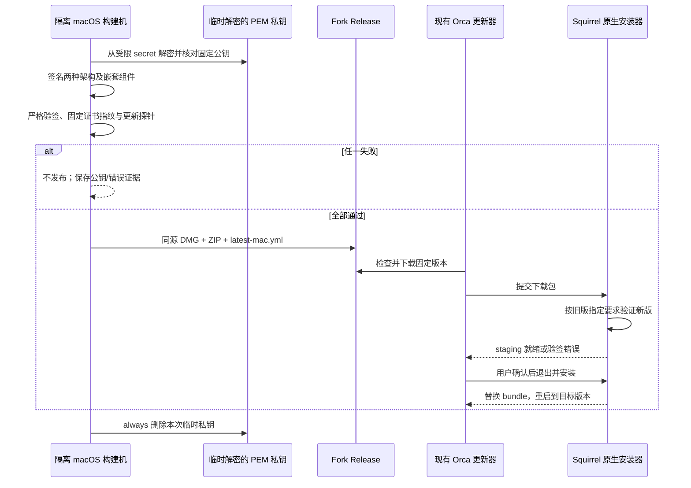
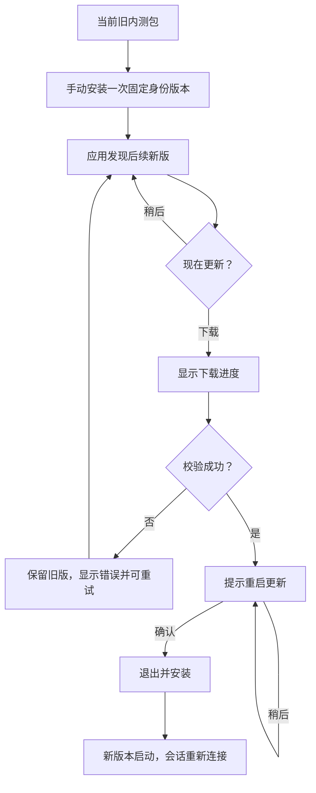

# macOS 自动更新签名修复方案

## 摘要与结论

当前阻塞来自集成包使用 `identity: '-'` 的 ad-hoc 签名，而不是 ZIP、GitHub 更新源或下载功能。两版包各自有效，但旧版的默认 designated requirement 绑定旧包 cdhash，不能接受新版内容。这一点已由 Electron 43.6.0 原生更新和独立交叉验签共同证实。

采用 **固定自签代码签名证书 + rcodesign PEM 签名 + 现有 Squirrel 原生更新器**。不建立 keychain、不修改构建机或客户端信任；签名仍由 Apple strict 校验和 Squirrel 原生指定要求校验。本机 Electron 43.6.0 已连续两轮通过同证书实际替换/重启、错证书拒绝和篡改拒绝，完整 Orca 与双架构 CI 仍在验证。

最小原生探针通过不等于完整 Orca 已验收。长期固定发布身份已生成并配置 Actions secrets，私钥不进入仓库；公开证书固定到源码。自签不是 Apple Developer ID、公证或免 Gatekeeper 提示；现有 ad-hoc 安装需要手动迁移一次，之后使用同身份自动更新。

## 1. 需求与已知事实

- 来源：用户要求 fork 检查、ZIP/清单和自动更新，并指出上一轮只报告阻塞、没有解决方案。对应 REQ-404。
- 目标：应用内发现新版本、下载、用户确认重启、新版本实际启动，沿用既有更新 UI 与终端恢复逻辑。
- 当前代码：继承原打包流程先完成 ad-hoc 签名，再通过 fork `afterSign` 使用固定 PEM 身份重签；发布缺少固定密钥时失败。上游 Developer ID 和公证配置不变。
- 已验证：[签名探针报告](../../../../.docs/integration-updates-ui-validation/2026-09-12/mac-signing-probe/final-report.md)。ad-hoc 两包严格验签通过；下载完成后 Squirrel 拒绝跨包指定要求。
- 新证据：`selfsigned-ci/local-rcodesign-20260913-0019/final-report.md` 记录 3/3 原生用例、9 张截图及前后信任设置摘要一致。两轮 CI 的 `add-trusted-cert` 都停在交互授权，已弃用该路线，未据此否定自签客户端更新。
- 约束：不退出用户正在运行的 App；测试在隔离目录/隐藏窗口或 CI，CDP 委派执行；不改变用户电脑的系统/用户证书信任；SSH、Android、Windows、Linux 和非集成更新不变。

## 2. 候选方案及复用评估

| 路线 | 改动与依赖 | 判断 |
| --- | --- | --- |
| 固定自签证书，保留原生更新 | 固定 PEM 公私钥；固定版本和摘要的 rcodesign；fork afterSign | 本机原生正反例已通过；不修改 trust/keychain，继续验完整 Orca |
| Apple Developer ID，保留原生更新 | 用户持有的 Apple Developer 账号、证书私钥；公证另需凭据 | 面向正式分发的成熟路线；现无凭据，不能代用户购买账号或假造身份 |
| 自建下载后替换 App 的安装器 | 重写退出协调、替换、恢复、权限、重启及签名认证 | 不推荐；重复现有 Squirrel，改动大且新增安装故障面 |
| 去掉验签、只检查 bundle ID 或修改 ad-hoc 要求 | 改弱现有签名校验 | 不采用；不能验证更新来自同一签名方 |

已检查的复用基础：

| 仓库路径 | 现有能力 | 本方案处理 |
| --- | --- | --- |
| `config/scripts/integration-builds/electron-builder.cjs` | 继承上游打包 hooks、资源、DMG/ZIP 目标 | 增量替换签名身份，不复制打包配置 |
| `.github/workflows/fork-integration-build.yml` | 同 SHA 双架构构建及完整发布 | 增量插入签名准备、验签与清理 |
| `src/main/updater/updater-release-feed.ts` 与自有 `integration-update-feed.ts` | fork feed、版本解析、原生更新器调用 | 复用；修复验签后不另建检查状态机 |
| `src/main/updater-mac-install.ts` | 等待原生 staging，再执行安装交接 | 不改；必须观察其真实完成条件 |
| `src/main/local-builds/local-build-switch.ts` | 本地包选择和兼容性检查 | 同样依赖有效同源签名，不是绕开当前问题的替代安装器 |
| `src/cli/runtime/mac-app-update-bundle.ts` | 观察 bundle 替换后的目标版本 | 复用作为完整替换验收证据，不把它误认为安装器 |
| 既有 `mac-signing-probe/scripts/` | 隔离 app、原生 feed、事件和截图 | 复用实验脚本，在 CI 补构建信任及正反例 |

## 3. 目标链路



验收看签名、原生就绪、磁盘版本、新进程版本四层，不以 ZIP 下载完成代替安装完成。



不新增前端页面、组件或状态库；继续使用现有 checking / available / downloading / downloaded / error 及安装交接状态。错误保持原错误态；不能提前显示“安装成功”。说明中区分旧 ad-hoc 首次手动迁移与同固定身份后续自动升级。

## 4. 改动范围与实施顺序

遵循 `AGENTS.md` 和 fork-maintenance 的复用、功能自有目录、最小接缝规则。仅扩展 integration-builds，不改上游正式签名配置、不新增 RPC/远程字段。

```text
config/scripts/integration-builds/
  signing-probe/                  [新增] 临时证书原生升级正反例
  orca-update-probe/              [新增] 真实 Orca 升级和终端恢复验收
  mac-signing.cjs                  [新增] 临时 PEM 生命周期、公私钥匹配及固定指纹核验
  mac-rcodesign.cjs                [新增] 固定版本/摘要的工具和原生严格验签
  mac-signing-metadata.cjs         [新增] 重签前后权限、flags、plist、asar 不变检查
  mac-after-sign.cjs               [新增] 继承原流程后的固定证书签名接缝
  mac-package-signature.mjs        [新增] 实际成品签名、版本和架构证据
  electron-builder.cjs             [修改] 显式固定签名身份，禁止发布时静默降为 ad-hoc
  publish-release.mjs              [修改] 如实标记签名种类和指纹，不宣称公证
  integration-builds.test.mjs      [修改] 签名必需条件、清理、禁止降级合同
.github/workflows/fork-integration-build.yml [修改] 发布密钥仅限 integration，PR 无生产私钥
src/main/integration-builds/integration-update-feed.ts [修改] 验证通过后修正过时的 ad-hoc 限制说明
src/main/updater-mac-install.ts    [复用，不改] 原生就绪与安装交接
src/cli/runtime/mac-app-update-bundle.ts [复用，不改] 观察目标版本
docs/issue/集成分支自动出包/       [修改] 需求、用例和验收记录
.docs/integration-updates-ui-validation/<date>/ [复用] 隔离实验、截图和原始日志
```

### P0：先验证固定身份，不创建长期发布密钥

- 将探针收敛到功能自有 `signing-probe/`，不依赖 CI 访问本机 `.docs`；通过 workflow 显式手动入口执行，不发布应用产物。
- 在隔离环境创建临时自签 PEM，用固定 rcodesign 0.29.0 签名，不添加任何证书信任。
- 同一身份签出 A/B 两版不同内容、相同 bundle ID 的最小 Electron App；另用另一身份签出 C。
- 签完删除临时私钥再启动客户端；只读核对 user/admin trust 与 keychain 搜索列表前后一致。
- A→B 必须 staging 成功并实际替换/重启；A→C、篡改 B 必须拒绝且 A 可继续启动。不得显式放宽成只有 identifier 的要求。
- arm64/x64 分别执行。若自签身份在当前 Electron/macOS 仍不被接受，记录原始原因，改走 Developer ID；不继续用文档推断替代实测。

### P1：验证通过后配置固定发布身份

- 一次性生成 fork 专用 RSA 2048 私钥及 10 年证书，私钥以 AES-256-CBC 加密 PKCS8 PEM 备份；同一身份签后续每个发布，不能每次 CI 重新生成。
- `ORCA_MAC_SIGN_PRIVATE_KEY_PEM` 与 `ORCA_MAC_SIGN_KEY_PASSWORD` 保存在 fork Actions secrets，只在可信 integration 发布准备步骤使用。公开证书 SHA-256 为 `e68916f17fa53bdae7b7408f8a0971979db2a49c2091f01e2a95d840b98cff61`。PR 普通打包沿用 ad-hoc；两套手动原生探针使用临时身份，不注入长期密钥。
- 签名脚本解密私钥并与固定证书公钥匹配，输出 0600 临时 PEM 路径；workflow `always()` 清理；失败退出，不退回 ad-hoc 发布。全过程没有 trust/keychain API。
- 包装器继续继承上游 hooks，主 App、helpers、frameworks 和相关原生 helper 使用同一长期身份；签完再生成 ZIP/YAML。
- `afterSign` 对比签名前后 entitlements、flags、Info.plist 和 asar 摘要，禁止以重签为由改变完整性或权限配置。Apple `codesign --verify --deep --strict` 必须通过；指定要求精确绑定证书，不接受只有 bundle ID 的要求。
- 发布器要求两架构验签证据均匹配固定证书、架构和本次版本，缺一不创建公开 release。
- `build-info.json` 只新增可选签名说明/公钥指纹，旧读取方忽略；现有更新清单的版本、文件大小和摘要契约不变。

### P2：真实 Orca 两版验收与一次性迁移

- 固定身份构建真实 Orca A/B，使用临时安装目录和独立 profile，原生隐藏窗口验证；不得操作用户正在使用的 App。
- 完成自动检查→下载→原生就绪→确认重启→磁盘 bundle 版本 B→新进程版本 B，验证已存在终端恢复。
- 现有 ad-hoc 旧版不能凭新服务端包改变其旧指定要求，所以首次迁移明确为手动替换，不伪装成无感升级。
- 最后发布带固定身份的初始版本，用户完成一次迁移；后续同身份包走自动更新。Developer ID 路线也需要这次迁移。

## 5. 风险、监控与验收门槛

| 风险/事实 | 处理与观测 |
| --- | --- |
| 最小探针不能覆盖完整产品 | P0 与 P2 为独立门槛；后者须验证真实 Orca 替换、重启和终端恢复 |
| 密钥轮换导致指定要求不匹配 | 固定身份、备份；轮换另做迁移，不自动换证书冒充兼容 |
| 首次 Gatekeeper/权限提示 | 明确未公证，不承诺免提示；不自动关闭 Gatekeeper |
| 无法替换/重启 | 记录原生错误与目标版本；旧 App 可启动，禁止只看下载完成 |
| 发布配置缺失 | 构建失败且不公开半套产物，不降级 ad-hoc 后继续发布 |
| 影响原渠道或平台 | 回归现有 updater、local build、Android、混合版本客户端；无新 wire 契约 |

每次实验记录：源 SHA、Electron/macOS/架构、证书指纹、旧/新 designated requirement、验签退出码、update-downloaded/native-ready 事件、旧/新进程 PID/版本、磁盘版本和清理结果。不记录私钥和密码。只有 P0 与 P2 都通过，才把 REQ-404 自动安装标为完成。

## 6. 引用

- [Apple Code Signing Tasks](https://developer.apple.com/library/archive/documentation/Security/Conceptual/CodeSigningGuide/Procedures/Procedures.html)：自签身份及客户端指定要求的验证边界。
- [Apple Code Signing Requirement Language](https://developer.apple.com/library/archive/documentation/Security/Conceptual/CodeSigningGuide/RequirementLang/RequirementLang.html)：`trusted` 与固定证书要求不同。
- [Apple TN3161](https://developer.apple.com/documentation/technotes/tn3161-inside-code-signing-certificates)：签名时身份查找和信任链要求。
- [Squirrel SQRLCodeSignature](https://raw.githubusercontent.com/Squirrel/Squirrel.Mac/master/Squirrel/SQRLCodeSignature.m)：旧 App 指定要求及新包验证。
- [本地更新测试记录](../tests/runs/2026-09-12-updates.md)、[需求](../requirements/集成分支自动出包.md)。

## 7. 变更记录

### 2026-09-13

- 原因：两轮临时 trust 授权均阻塞；PEM-only rcodesign 的本机真实原生正反例已连续通过。
- 内容：删除无效 trust 路线，采用不修改证书信任的固定身份签名；补 metadata 保持、双架构真实 Orca 验收、发布前指纹校验。
- 影响：仅 fork 签名/发布自有路径，原生安装器不改。长期密钥已配置，正式出包与 P2 仍待 CI，未宣称上线。
- 记录人：Codex。

### 2026-09-12

- 原因：上一轮只报告 ad-hoc 失败和本机无身份，未给出替代路线及执行验证门槛。
- 内容：区分构建机信任与客户端同源验证；新增固定自签优先验证、Developer ID 备选及三阶段验收。
- 影响：REQ-404 与 integration-builds 签名/发布配置；不影响 Android 已有实现，不执行用户 App 替换，不改变本机信任。
- 记录人：Codex。
