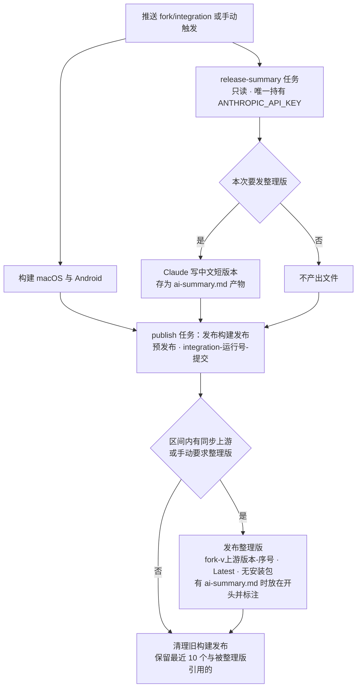

# 发布页分层与可读发布说明方案

对应需求：REQ-407（编号规则调整）、REQ-408～REQ-412；决策：D-006。

## 1. 现状与约束

- 每次推送 `fork/integration` 都发布一个预发布，正文是两次构建之间第一父提交标题的原样罗列，同步上游只剩一行合并标题，固定的签名与安装说明比变更还长。
- 已安装的桌面与 Android 集成包通过 `src/shared/integration-builds/release-catalog.ts` 找更新：GitHub API 列出 Release，筛选非草稿、预发布、tag 符合 `integration-运行号-提交`、带安装包的发布，读取其 `build-info.json`；被限流时读 Release 的 atom 订阅。旧客户端的这套规则改不了，因此构建发布的形式必须保持不变。
- 预览版编号原为「已发布构建数 + 1」。清理旧构建后数量变小，编号会倒退，已安装的集成包就不再提示更新。
- 上游 main 的 `package.json` 落后于官方发布（2026-10-06 main 为 1.4.214，官方已到 1.4.221）：官方版本从每日构建切出，不回写 main。不能用它说明同步带进了哪些版本。
- 发布任务有 `contents: write`；现有测试规定它不带任何密钥，也不安装依赖。
- 出包任务检出完整提交历史（`fetch-depth: 0`，`blob:none`）。

## 2. 方案

### 2.1 编号（`integration-releases.mjs`）

`latestPreviewNumber` 从构建发布的标题「Orca x.y.z-preview.N」读出 N，取最大值，再与已发布数量取较大者（兼容编号之前标题为「Orca Integration 提交」的旧发布）。出包身份与发布复核都改用「最大编号 + 1」。最新的构建总在保留的 10 个之内，所以清理不会让编号倒退。

### 2.2 改动整理（`release-notes.mjs`、`release-context.mjs`）

- 读取上一个构建发布到本次提交之间第一父提交的哈希、父提交和完整说明（最多 100 个）。
- 分类：
  - `Merge pull request #N from 分支`：PR，标题取说明首行；
  - 两个父提交、标题为 `Merge remote-tracking branch 'origin/main'`、`Merge upstream main` 等：同步上游，第二父提交即上游提交；
  - 其他合并：记账提交，不显示；
  - 其他提交：直接提交。
- 类型按约定式前缀判断：`feat`、`fix`、`perf`、`revert` 及无前缀的为用户可见（标错类型的修复宁可显示也不折叠）；`test`、`docs`、`ci`、`build`、`chore`、`style`、`refactor`、`release` 为工程改动。
- 归组：scope 对应到 `config/fork-features.jsonc` 的功能（`issues` 视为 `issues-board`），组名取功能标题冒号前的部分，按登记表顺序；对应不上的归「其他」并放最后。
- `build-info.json` 的合入列表：同步上游一条在前，然后是用户可见改动；最多 100 条、每条不超过 300 字，满足旧客户端的校验。
- `release-context.mjs` 把「上一个构建、本次改动、整理版计划、同步摘要」算成一份，摘要任务与发布任务共用，两边看到的范围一致。

### 2.3 同步上游摘要（`upstream-summary.mjs`）

- 上游旧端点取合并第一父与第二父的 merge-base，新端点取第二父；提交数用 `git rev-list --count --no-merges`。
- 官方 Release：`gh api repos/stablyai/orca/releases?per_page=100`，只留非草稿、非预发布、`vX.Y.Z` 的；发布时间落在两端上游提交时间之间的，即为「期间官方发布」，标题写成「同步上游（期间官方发布 v1.4.209 至 v1.4.220，1166 个提交）」。不显示 main 的 `package.json` 版本。
- 上游新功能提交：区间内 `feat(scope)` 按 scope 分组，每组最多 3 条、总数最多 20 条，按组内条数排序，并显示每组总数；其中混有基础设施提交，所以折叠展示。
- 降级：取不到官方 Release 时只写提交数与对比链接；读不到同步的提交历史时只写「同步上游」和上游提交链接。都不阻止发布。
- 输出量大（100 个 Release 的正文），命令输出缓冲上限设为 256 MB（`command-output.mjs`）。

### 2.4 构建发布正文（`publish-release.mjs`）

依次为：一句「集成分支内测包（非正式版）。」；「这一版变了什么」；「同步上游」（有时）；「工程改动 N 项」（折叠）；「安装、签名与校验」（折叠，原固定说明与两个证书指纹）；「构建信息」（折叠：版本、提交、构建链接、与上一个构建的对比链接）。

### 2.5 整理版（`milestone-release.mjs`）

- 触发：本次构建区间内有同步上游合并，或手动触发时打开了 `milestone`。同一提交已有整理版时不再发。
- 区间：自上一个整理版（当前提交的祖先中发布最晚的）起，最多 200 个第一父提交；还没有整理版时，从最近一次同步上游合并起，且至少覆盖本次构建区间。
- 上游版本：整理版区间内各次同步的「期间官方发布」中最新的正式版；区间内没有同步时沿用上一个整理版的；都没有时用 `package.json` 版本。
- tag 为 `fork-v上游版本-序号`，序号为该上游版本已有整理版的最大序号加一；标题「Orca 集成版 上游版本 · 第 N 版」；非预发布，`--latest`，不带安装包。它不符合构建 tag 的格式，不会成为更新候选。
- 正文：短版本（有时，带 AI 标注）、这一版变了什么、同步上游、工程改动（折叠）、安装（链接到本次构建发布，说明应用内更新照常；有上一个整理版时附链接与对比）。
- 在构建发布公开之后才发；失败只输出 `::warning::`，不影响构建发布。

### 2.6 AI 短版本（`ai-release-summary.mjs`，`release-summary` 任务）

- 独立任务、只读权限，是工作流里唯一拿到 `ANTHROPIC_API_KEY` 的任务；每一步都 `continue-on-error`，产物没有文件时上传也不报错。发布任务下载它的产物时同样 `continue-on-error`。
- 用 `release-context.mjs` 算出同一份整理版计划；不需要整理版时直接结束。
- SDK：官方 `@anthropic-ai/sdk`。它已是根依赖 `@anthropic-ai/claude-agent-sdk` 的 peer，由锁文件固定（0.122.0），`pnpm-workspace.yaml` 的 `shamefullyHoist` 把它放在根目录，所以不改上游的 `package.json`。上游移除它时，守护用例会让本功能的检查变红。
- 请求：`client.beta.messages.stream(...).finalMessage()`，模型 `claude-opus-5-5`，`max_tokens` 16000，`betas: ["server-side-fallback-2026-07-01"]` 与 `fallbacks: "default"`（被拒答时服务端换模型重试），不设 `thinking`（默认自适应）。
- 输入：按功能分组的用户可见改动；每个 PR 说明中「ELI5」与「What Changed」两节（各截 1200 字，最多 30 个 PR）；每次同步的提交数、最近 3 个官方 Release 的「The short version」一节（各截 4000 字）与上游新功能提交。
- 输出要求：简体中文 4～8 条要点，写使用者能感知的效果，不写实现细节和编号。只接受 `stop_reason` 为 `end_turn`、且 2～12 行全为「- 」开头的回复；否则（含拒答、出错、未配置 key）省略，整理版照常发布。整理版开头标注「以下短版本由 AI 生成，未经人工审阅」。

### 2.7 清理（`prune-releases.mjs`）

构建发布（含本次）按运行号从新到旧，保留前 10 个，以及任何整理版正文中出现的构建 tag；其余用 `gh release delete <tag> --cleanup-tag --yes` 删除。删除失败输出 `::warning::`，不让发布失败。

### 2.8 工作流

- `workflow_dispatch` 增加 `milestone` 布尔输入（默认关），沿用 `packages` 并发组，与推送出包串行。
- 新增 `release-summary` 任务（依赖 `identity`，只在 `fork/integration` 的非 PR 运行）；`publish` 依赖它，下载其产物，把 `milestone` 输入传给发布脚本，发布脚本第二个参数为摘要目录。

### 2.9 改动经 PR（REQ-412）

在 AGENTS.md 与 `docs/reference/fork-maintenance.md` 写明：除 `pnpm sync:upstream` 的同步合并及其随同修复外，改动以 PR 合入。这两份文件不在本功能的改动范围内，走单独的文档 PR。

## 3. 机器归属与 SSH

全部逻辑在 GitHub Actions 的出包任务中运行，只读写 Fartown/orca 的 Release 与 tag，并只读 stablyai/orca 的 Release 与 fork 的 PR。不改应用内更新逻辑：更新检查始终在 Orca 客户端所在的机器上读取 GitHub，本地与 SSH 场景相同，不涉及 SSH 主机或配对主机。

## 4. 验证

- 单测：`release-notes.test.mjs`（分类、分组、折叠、合入列表上限、同步摘要、AI 输入与回退、SDK 守护）、`release-lifecycle.test.mjs`（编号、清理、整理版计划与命名、带同步的完整发布、整理版失败、摘要任务）、`integration-builds.test.mjs`（原有发布与工作流接线，含密钥边界）。
- 真实历史预演：`.docs/integration-release-notes-review/2026-10-06/scripts/dry-run.mjs`，用保存的 37 个真实构建发布与本地历史预演 `c986a8309f`（同步上游）、`617f48da80`（PR 合入）、`617f48da80` 手动整理版，GitHub 写操作只记录；AI 一步用假客户端记录实际输入。产物在同目录 `evidence/`。
- 合入后核对：第一次出包的正文、清理结果与编号；手动触发一次整理版，核对 Latest 与正文；桌面与 Android 集成包仍能检测到新构建；用户配置 `ANTHROPIC_API_KEY` 后核对短版本。
