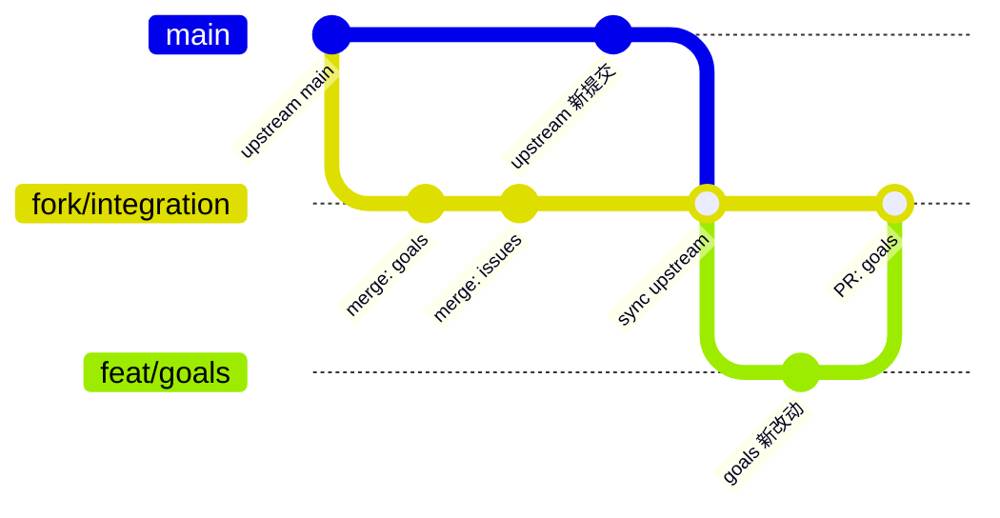

# Fork 维护约束

本仓库是 `stablyai/orca` 的 fork(`Fartown/orca`),要长期跟随上游、同时带着自己的功能。这份文档定义分支模型、功能登记和同步流程;`AGENTS.md` 的 Fork 一节是给 agent 的摘要,以本文为准。

## 1. 分支模型



| 分支                   | 作用                                          | 规则                                                                                                                                                |
| ---------------------- | --------------------------------------------- | --------------------------------------------------------------------------------------------------------------------------------------------------- |
| `main`                 | 上游镜像                                      | 永不直接提交;只由 `pnpm sync:upstream` 或周同步工作流 fast-forward 到 `origin/main`,再推到 `Fartown/main`                                           |
| `fork/integration`     | 上游 + 全部 fork 功能;**fork 仓库的默认分支** | 打包和发布从这里出;只接受 merge(上游同步或功能 PR),不 rebase,不 squash。设为默认分支是因为 GitHub 的定时/手动工作流只从默认分支读取,PR 也默认指向它 |
| `feat/<feature>`       | 一条功能一条分支                              | 从 `fork/integration` 切出;每条分支一个 worktree;以 PR 合回,PR 必须过门禁                                                                           |
| `sync/upstream-<日期>` | 周同步工作流开出的合并分支                    | 合并成功即开 PR;有冲突则开 issue,由人在本地解                                                                                                       |

远程:`origin` = 上游 `stablyai/orca`,`Fartown` = fork。这两个名字写在 `config/fork-features.jsonc` 里,脚本从那里读。

## 2. 功能登记:`config/fork-features.jsonc`

每个 fork 功能一条记录。它是“这个仓库比上游多了什么”的唯一清单,也是 agent 改代码前必须读的文件。

| 字段            | 含义                                                                | 门禁怎么用                                                  |
| --------------- | ------------------------------------------------------------------- | ----------------------------------------------------------- |
| `ownedPaths`    | 功能完全拥有的目录或文件 glob                                       | 每个 glob 至少匹配一个文件;所有匹配文件必须在上游差异预算里 |
| `requiredFiles` | 入口文件                                                            | 必须逐个存在                                                |
| `seams`         | 功能挂进上游文件的注册点,以及能证明注册仍在的文本                   | 文件存在且包含 `mustContain`;文件必须在预算里               |
| `tests`         | 必须存在的测试文件                                                  | 逐个存在                                                    |
| `checks`        | 同步上游之后要跑的命令                                              | `pnpm sync:upstream` 按顺序执行,失败即停                    |
| `journal`       | `docs/issue/<需求>/journal.md`                                      | 必须存在                                                    |
| `policyId`      | `config/architecture-policies.jsonc` 里管这个功能日常改动范围的策略 | 必须存在                                                    |

`pnpm check:fork-features` 检查以上全部;`pnpm check:fork-features --list` 打印清单。它挂在 `pnpm lint` 和 PR 检查里,任何一项消失都会让 CI 变红。这就是“功能不会被 AI 弄丢”的机制:删除是允许的,但必须先改清单、在 journal 写决策,不能顺手。

## 3. 门禁:`config/architecture-policies.jsonc`

- **`fork-upstream-diff-budget`**:`fork-integration-scope` 规则把分支相对 `origin/main` 的全部改动限制在一张白名单里。这张表就是 fork 对上游的改动预算:新功能只能新建自己的目录,碰上游文件只能碰表里列出的接缝。每次同步上游,冲突只会出现在这些接缝上。
- **每功能一个策略**(`goals-native-feature`、`issues-existing-capability-reuse`、`self-hosted-artifacts`):`comparison: worktree` 的规则只看当前未提交改动。改了某功能自己的文件,工作区里其余改动必须落在该功能的 owned 路径、接缝或 fork 基础设施文件里。这保证一个会话一次只动一条功能线。
- 依赖边界规则保证上游原生模块不 import fork 功能的领域模块;`forbidden-path` 保证已删除的旧实现(如内置 Goal 插件)不会被重新引入。

新增功能时,在 `fork-features.jsonc` 加记录,在策略文件加它的策略,并把它的 owned 路径与接缝加进 `fork-integration-scope` 的白名单;`check:fork-features` 会核对两边一致。

## 3a. 文档门禁:`pnpm check:fork-docs`

功能清单说“有什么”,`docs/issue/<需求>/` 说“为什么、到哪一步”。这个门禁让两边不漂移:

- journal 的 frontmatter `status` 必须是 task-leader 的需求整体状态之一(clarifying / designing / implementing / testing / done / blocked),`created`/`updated` 是日期;正文必须按顺序有“关键文档链接 / 决策点记录 / 开发记录”三段;关键文档链接表里的链接必须存在、状态必须是文档状态词汇;每条开发记录必须有“本轮目标”和“验证证据”。
- `requirements/*.md` 里的 `### REQ-<n>` 唯一、每条有“当前状态：”;标为“已实现”的 REQ 必须在 `tests/cases/*.md` 里被引用,否则就是没有验证就宣称完成。
- `docs/issue/README.md` 由 `pnpm generate:issue-index` 从清单(`goal` 字段)和各 journal(状态、更新日期、文档链接)生成,门禁校验它与事实源一致,不再手写。

它和 `check:fork-features` 一起挂在 `pnpm lint`、PR 检查和周同步里。

## 4. 同步上游

```
git switch fork/integration
pnpm sync:upstream            # fetch → ff main → merge → 门禁 + 各功能 checks
pnpm sync:upstream --push     # 全绿后推到 Fartown
pnpm sync:upstream --dry-run  # 只看落后多少
```

脚本拒绝脏工作区和非 integration 分支。合并冲突时它停在冲突处并打印下一步;解冲突的唯一原则是**保住 `fork-features.jsonc` 里的每一项**。解完先 `git add -A && git commit` 提交合并(worktree 规则会把未提交的合并当成一次巨大改动),再重新执行 `pnpm sync:upstream`,它会跳过合并、跑完全部门禁和各功能 checks。上游把接缝挪进新文件时,`fork-integration-scope` 会报该文件越界:把它登记为对应功能的 `seams` 并加进白名单,这就是预算在起作用。

`.github/workflows/sync-upstream.yml` 每周一自动做同样的事:ff `main`、把上游合到 `sync/upstream-<日期>` 分支,**在工作流里直接跑功能清单门禁、架构门禁、驱动打包和全部功能 checks**;全绿就把合并结果 fast-forward 到 `fork/integration`(结果写在 job summary 里),有失败则保留同步分支、开 issue 并让 job 变红;合并冲突同样开 issue。`GITHUB_TOKEN` 在这个 fork 里开不了 PR,所以失败时的 PR 只在配了 `FORK_SYNC_TOKEN` 时才会开。推送用的是仓库级的写 deploy key(secret `FORK_SYNC_DEPLOY_KEY`,2026-09-07 已配置):`GITHUB_TOKEN` 不能推带工作流文件改动的提交,而上游几乎每次都改工作流,所以 ff `main` 和推同步分支都走这把 key;开 PR / 开 issue 仍用 `GITHUB_TOKEN`。这条链不需要任何个人 token。`FORK_SYNC_TOKEN` 是可选项:默认 `GITHUB_TOKEN` 开出的 PR 不会再触发常规 PR 工作流,想让同步 PR 也跑完整 PR CI,才需要在 fork 仓库配一个细粒度 PAT(仅此仓库,contents 与 pull requests 写权限),PAT 只能由账号本人在浏览器里创建,创建后用 `gh secret set FORK_SYNC_TOKEN --repo Fartown/orca` 写入。换 deploy key:`ssh-keygen -t ed25519`,`gh repo deploy-key add <pub> --allow-write`,`gh secret set FORK_SYNC_DEPLOY_KEY < <私钥>`,再删掉旧 key。

## 5. 日常规则

1. 一条功能一个 worktree、一个分支、一个 `docs/issue/<需求>/`。不同 agent 会话不共用工作区。
2. 改上游文件前先问:能不能放进自己的目录?必须碰上游时,只碰接缝,并把接缝登记到 `fork-features.jsonc` 的 `seams`。
3. 提交要小、要按功能打前缀(`feat(goals)`、`fix(issues)`),不要把几条线攒成一个大提交。
4. 纯格式化不要带进上游文件的 diff:整仓 `oxfmt` 之后,用 `git checkout origin/main -- <文件>` 把只有格式差异的上游文件恢复原样。
5. 真机验证产物放 `.docs/<主题>-ui-validation/<日期>/{scripts,evidence,build}`,`.docs` 不进仓库;文档里引用完整相对路径。
6. 删除或替换一个 fork 功能:先改 `fork-features.jsonc` 和策略,在 journal 记决策,再删代码。反过来做会被门禁拦下,这是设计如此。
