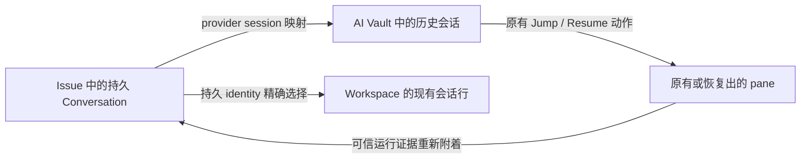
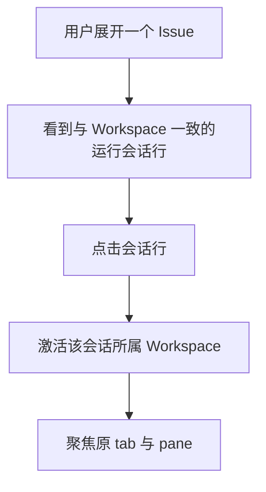
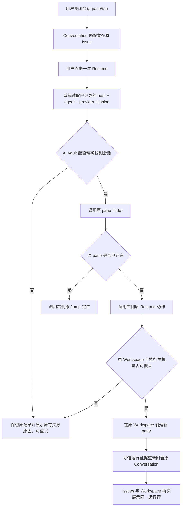

# Issues 会话展示与关闭会话恢复需求

需求基线 · 2026-08-30

> 本文只定义两个产品需求：Issues 中的会话展示，以及当前 pane/tab 关闭后的会话恢复。
> 本文不设计新的 Conversation 模型，也不替代完整的并行任务看板产品方案。
> 这两个需求后续的技术方案、实现和验收均以本文为准。

## 0. 结论先行

本次最终要做成下面两个结果：

1. **正在运行的会话展示对齐 Workspace**：同一条有真实 pane 的会话，在 Issues 和左侧
   Workspace 下使用同一套会话行内容、状态和主交互；点击后都进入同一个 pane。
2. **已关闭当前 pane/tab 的会话可从 Issue 一键恢复**：Issue 保留该会话；用户点击
   `Resume` 后，系统使用已经记录的 provider session 映射找到准确的 AI Vault 会话，并直接复用
   右侧 AI Vault 原有的原 pane 查找、Jump 和 Resume 动作。用户不需要再打开右侧、输入搜索词、
   找到结果并点击第二次。

恢复成功后必须还是原来的 Conversation、原来的 Issue 归属和原来的 Workspace：有原 pane
就定位它，没有才重新获得运行 pane；不能生成一条重复的 Conversation。

Issue 内新建会话与 Workspace 保持同一可见性语义：启动后立即进入原 Workspace 的真实 tab，
但 provider identity 到达前不在 Issues 列表中预先展示 `Starting` 或 `Retry`；首条可信 Hook 建立
identity 与归属后，再作为真实会话行出现。

现有 launch claim 的有效期为 15 分钟。首条可信 Hook 超过该时限才到达时，过期 token 不再有权绑定
原 Issue；但真实 provider identity 不能被丢弃，必须作为一条未归属 Conversation 出现，供用户通过
现有 `Bind existing` 重新绑定。

## 1. 背景与问题

当前实现存在两个用户可见问题：

- Issues 自己绘制了一套会话行，和 Workspace 下已经成熟的 agent row 在状态、信息密度和点击行为上
  不一致；用户看到的是同一条会话，却像两个不同对象。
- Issue 已经持久记录了 Conversation 与 provider session 的对应关系，但 Issues 又实现了一套独立
  Resume；此前方案还曾把流程描述为“打开右侧后由用户手动搜索并恢复”。这既重复已有能力，也让本来
  可以一次完成的操作变成多步操作。

本需求不是要新建一个会话系统，而是把现有三部分正确接起来：

## 2. 名词与状态边界

| 名词                    | 本文含义                                                                           |
| ----------------------- | ---------------------------------------------------------------------------------- |
| Conversation            | Orca 持久记录的一条会话事实；可以绑定一个 Issue，并且始终属于原 Workspace          |
| provider session        | Claude、Codex 等 provider 可恢复会话的稳定身份；AI Vault 用它发现和恢复历史        |
| attached                | Conversation 当前存在真实 Runtime Attachment，可定位到具体 pane/tab                |
| detached                | Conversation 当前没有 Runtime Attachment；不等于历史被删除，也不等于远端进程已退出 |
| Resume                  | 继续同一个 provider session，并在原 Workspace 创建新的运行 pane                    |
| Continue in New Session | 基于历史上下文开始另一条新会话；不属于本需求的“恢复”                               |

用户界面不需要新增 `attached`、`detached` 或 `unverifiable` 等术语。这些只是用于约束行为的内部状态。

## 3. 用户目标

用户应当能够：

1. 在 Issues 下看到一条与 Workspace 中一致的正在运行会话；
2. 从 Issues 直接进入该会话当前所在的 pane；
3. 关闭 pane/tab 后，仍在原 Issue 下找到该 Conversation；
4. 只点击一次 `Resume`，由系统完成准确查找和恢复；
5. 恢复后继续看到同一个 Conversation，而不是多出一条副本；
6. 在本机、SSH，以及 Git worktree、Folder Workspace 中获得相同语义。

## 4. 本次要做

### 4.1 正在运行的会话行与 Workspace 对齐

当目标 Workspace 能按 execution host、workspace、agent 与持久 provider identity 精确找到现有 row
时，Issues 必须复用 Workspace 的该会话行；不以可能滞后的 Issue attachment 投影作为硬门槛。

这里的“现有 row”必须是原组件当前可激活的 row。`rowSource = retained` 只是 hibernation 后保留的完成
证据，原 Workspace 行本身不执行 activation；它不能被 Issues 伪装成可点击活行，应继续显示 Issue
降级行，并在点击时走同一 AI Vault finder → Jump / Resume 链路。

对齐范围包括：

- 状态点与 agent 图标；
- 会话标题；
- model、tool/message preview、相对时间等当前 Workspace row 已展示的信息；
- focused、unvisited 和 lineage 等当前 Workspace row 已有状态；
- compact/full 展示模式；
- send target、dismiss、ack 等现有 row 已支持的交互；
- 点击后激活正确的 Workspace、tab 和 pane。

会话主体点击必须由 Workspace 原行组件自己的内部 activation 处理；Issues 不复制、导出或重写该
handler。原激活完成后，Issues 只关闭当前 Issue 页面状态；次级按钮和 send-target 操作不能因此被改写。

Issue 特有的重命名、解绑、忘记等管理操作可以保留在会话行之外或其独立操作区；这些操作不要求出现在
Workspace 中。所谓“对齐”指会话主体与运行态交互一致，不是取消 Issue 自己的管理能力。

### 4.2 关闭 pane/tab 后保留会话

用户关闭 pane/tab 后：

- 原 Conversation 仍留在原 Issue 下；
- Conversation 标题、agent、原 Workspace 和 provider session 映射仍保留；
- App 重启后仍能看到同一条记录；
- 不再展示只有真实 pane 才能提供的 live 状态和 pane 操作；
- 提供明确的 `Resume` 操作。

关闭 pane/tab 只改变当前运行附件，不等于删除 Conversation、解除 Issue 绑定或删除 provider transcript。

### 4.3 从 Issue 一键恢复

用户在已关闭会话上点击一次 `Resume` 后，系统必须按以下顺序完成：

1. 读取该 Conversation 已持久记录的执行主机、agent、provider session identity 和原 Workspace；
2. 在相同执行主机范围内，通过 AI Vault 现有会话数据源找到与该 identity 精确对应的会话；
3. 调用右侧已有的原 pane finder；如已有原 pane，调用原 Jump 定位并结束；
4. finder 明确返回 missing 时，使用原 Workspace 作为恢复目标，调用右侧 AI Vault 现有 Resume
   动作，沿用其目标校验、会话准备、启动参数构建、创建 pane、提示和错误处理；
5. Resume 成功时等待现有可信运行证据把新 pane 重新附着到原 Conversation；
6. 原生运行事实出现后，Issues 行自动恢复为与 Workspace 对齐的运行行。

这里的“复用右侧链路”指复用同一恢复能力和同一行为契约，不要求先把右侧面板展示给用户，也不通过
模拟点击右侧 DOM 完成。原有右侧 AI Vault 的手动搜索与 Resume 入口继续保留，行为不变。

本需求的验收边界是“Issue 调用与右侧入口共用同一实现并得到同一结果”。右侧当前已有的
原 pane 识别、重复 Resume、Host 支持或启动窗口问题按基线接受；Issue 不得为它们新增状态、
补偿或第二条恢复链。

### 4.4 恢复过程中的反馈

| 阶段                     | 用户可见行为                                                                    |
| ------------------------ | ------------------------------------------------------------------------------- |
| 未开始                   | 已关闭会话显示可用的 `Resume`                                                   |
| 正在查找或准备           | 当前按钮在这一次 Promise 结束前显示进行中，并防止同次重复提交                   |
| 启动成功                 | 进入原 Workspace 的新 pane，并给出 AI Vault 原有成功反馈                        |
| 恢复失败                 | 保留原 Conversation 和 Issue 绑定，恢复按钮可重试，并展示 AI Vault 原有失败原因 |
| 新 pane 已被可信证据确认 | Issues 行切换回与 Workspace 一致的运行行                                        |

启动请求成功不等于已经重新 attached。只有现有可信运行证据确认 pane 与 provider session 后，才把
Conversation 展示成真实运行行。

按钮局部 pending 只防止同一次调用在完成前被重复触发。Promise 结束后再次点击的原 pane 识别和
Resume 行为继续以右侧当前实现为准；本需求不另外承诺原生 tab 幂等性。

### 4.5 Issue 内新建会话的可见性

Issue 内新建会话保留现有 prepare/claim/launcher 数据链，但不在 Issues 中再造一套启动状态：

1. 用户点击新建后，在选定的原 Workspace 创建真实 tab 并立即聚焦；
2. 首条 Hook 到达前，预分配但没有 provider identity 的 Conversation 不进入 Issues Sidebar、
   Issue 详情会话列表、direct/running 计数；
3. 首条可信 Hook 通过现有 `attachProviderIdentity` 建立 identity 和 Issue 归属后，
   该 Conversation 才出现，并直接使用 Workspace 原会话行；
4. 没有 identity 的记录不展示 Issue 专属 `Starting` / `Retry`，也不由 renderer 调用
   `recordLaunchFailure` / `prepareRetry` 推导启动结果。

现有 claim TTL 是 15 分钟：

- TTL 内到达的首条可信 Hook 继续把 identity 绑定到预分配的 Issue Conversation；
- TTL 后到达的首条可信 Hook 不得重新使用过期 token 绑定原 Issue，而是按真实 provider identity 创建
  或复用一条 `issueId = null` 的未归属 Conversation；它应正常出现在未归属区并可用现有
  `Bind existing` 绑定；
- 原预分配且仍无 identity 的 Conversation 继续隐藏。自动清理该孤儿记录是后续数据卫生需求。

本次只补“过期后不丢真实 identity”的降级，不延长 TTL、不改变 claim 的一次性与防重放语义，也不把
`invalid` 或身份歧义降级成普通摄取。

## 5. 本次不做

以下内容明确不在本需求内：

- 不新增 Conversation 与 Issue 的映射表；
- 不新增 provider session 到 pane 的索引表；
- 不在 Issues 中再实现一套 AI Vault scanner、历史缓存或 session 搜索系统；
- 不保留一套与 AI Vault 平行的 Issue 专属 Resume 主链；
- 不让用户点击 Issue 的恢复入口后，再手动打开右侧、输入搜索词并点击第二次 Resume；
- 不按标题、prompt、cwd 等模糊信息猜测要恢复哪条会话；
- 不因为恢复而创建新的 Conversation、改变 Issue 归属或切换到其他 Workspace；
- 不把 `Continue in New Session` 当成 `Resume`；
- 不为已关闭会话伪造 pane、tab、live 状态、tool preview 或运行时间；
- 不新增 Issues 专属的 `unverifiable`、`ambiguous` 等用户可见状态；
- 不修改 Workspace 原有会话行的数据语义、样式或默认交互；
- 不删除 provider transcript，也不改变 AI Vault 原有手动搜索和恢复功能；
- 不自动把 AI Vault 扫描出的所有历史会话绑定到 Issue；
- 不修复右侧 AI Vault 已有的重复 Resume 或 Host 支持问题；原 pane 识别的 launch-config
  身份缺口按 2026-08-31 变更收进本需求（见变更记录）；
- 不为无 provider identity 的预分配 Conversation 新增 Starting/Retry UI 或自动清理机制；
- 不让过期 launch token 重新取得原 Issue 的绑定权限。

## 6. 用户动线

### 6.1 查看并进入正在运行的会话

用户不需要理解 Issues 和 Workspaces 的数据来源差异；同一条运行会话应当具有一致的视觉和点击结果。

### 6.2 关闭后从 Issue 恢复

### 6.3 原有 AI Vault 动线

用户仍可按原方式打开右侧 AI Vault，搜索任意历史会话并点击 Resume。本需求只增加 Issue 的快捷入口，
不移除或改变这条原有动线。

## 7. 查找与恢复规则

### 7.1 精确查找

Issue 恢复只能使用已经持久记录的身份信息。匹配至少受以下边界约束：

- 执行主机必须一致；
- agent 必须一致；
- provider session key/id 必须一致；
- 现有 transcript path 或 resume locator 如已记录，只作为现有链路支持的精确定位信息使用。

标题、prompt、model、cwd 和消息预览可以继续服务于 AI Vault 的人工搜索，但不能成为 Issue 自动恢复的
身份依据。

### 7.2 无法唯一找到

如果 AI Vault 当前找不到准确会话，或者现有身份不足以唯一确定目标：

- 不启动任何会话；
- 不尝试最相似结果；
- 不改变原 Conversation、Issue 绑定或 provider identity；
- 展示 identity resolver 自有的 scan failed/cancelled、not-found-or-ambiguous、not-resumable 提示；
  进入 Jump/Resume 后则保留 AI Vault
  原有错误，并允许用户重试；
- 用户仍可以进入原有 AI Vault 手动排查历史，但这不是成功路径的一部分。

### 7.3 Workspace 与主机边界

- Resume 只回到 Conversation 原来的 Workspace；不能静默回退到当前打开的其他 Workspace。
- Git worktree 与 Folder Workspace 都必须支持。
- 本机和 SSH 使用相同产品语义，但查找、校验和启动都在对应 execution host 范围内完成。
- SSH 失联时，对远端执行状态的判定是 `unverifiable`，不能当作 `exited`；这不要求在 Issues 行新增
  一个 `Unverifiable` 标签。映射和会话行继续保留，错误展示与重连后重试复用 AI Vault 现有能力。

## 8. 状态与对象不变量

无论经过关闭、重启 App、恢复成功或恢复失败，以下不变量必须成立：

1. 同一个 provider session 最多对应一个 active Conversation identity；
2. Resume 成功前后 `conversation.id` 不变；
3. Resume 成功前后 `issueId` 不变；
4. Resume 成功前后原 `workspaceRef` 不变；
5. 关闭 pane/tab 不删除 provider identity 或 transcript；
6. detached 会话不会与恢复后的 attached 会话同时显示成两条 Conversation；
7. Issues 记账失败不能阻断 AI Vault 本身原本能够完成的 Resume；
8. attached 只由真实 Runtime Attachment/可信运行证据确认，不能由“已发起 Resume”推断；
9. 没有 provider identity 的预分配 Conversation 不进入 Issues 行或计数；
10. claim 过期后到达的真实 provider identity 只能进入一条未归属 Conversation，不能消失、重复或误绑
    到原 Issue。

## 9. 验收标准

### 9.1 会话行对齐

- 同一条 attached 会话同时出现在 Workspace 与 Issues 时，状态点、agent icon、标题、model、preview、
  时间、focused/unvisited、lineage 和 compact/full 模式一致；
- 两侧点击后都聚焦同一个 Workspace、tab 和 pane；
- Workspace 现有行在视觉、交互和性能上没有回归；
- Issue 的重命名、解绑、忘记操作仍可用，且不污染 Workspace row。

### 9.2 关闭后的持久性

- 关闭 pane/tab 后，原 Conversation 仍位于原 Issue；
- 同一记录由 attached 变为 detached，不新增 Conversation；
- 重启 App 后仍能读到相同 `conversation.id`、`issueId` 和 provider identity；
- provider transcript 仍可由 AI Vault 扫描。

### 9.3 一键恢复

- 用户只点击一次 Issue 行上的 `Resume`；
- 系统自动准确找到对应 AI Vault session，不要求用户输入搜索词或二次点击；
- Workspace 原 row 缺失时先调用 AI Vault 原 pane finder/Jump，只有 missing 才进入原 Resume 目标
  校验、准备和 launch 链路；
- Jump 成功时定位已有 pane；Resume 成功时在原 Workspace 创建 pane；
- 可信运行证据到达后，同一 Conversation 重新 attached；
- 恢复前后 Conversation 数量不增加，`conversation.id`、`issueId`、provider identity 不变；
- Issue 入口不比右侧多发起一次 Jump/Resume，不新增 tab/claim/恢复状态；如右侧原生链
  自身产生重复 tab 或无法 Jump，Issue 表现与它一致即不视为本需求失败。

### 9.4 失败与边界

- provider identity 缺失的预分配记录不进入 Issues 行或计数，不发起恢复；
- 使用显式测试时钟覆盖 15 分钟 claim 边界：到期前绑定原 Issue；到期后原记录隐藏，真实 identity
  只进入一条未归属 Conversation，且可以通过现有 `Bind existing` 绑定；
- 对已有 identity 的可见记录，会话找不到、身份不唯一、agent 不支持、原 Workspace 不可用时
  均不猜测恢复；
- 失败后原记录和绑定不丢失，用户可以重试；
- Issues DB/route 记账失败时，如果 AI Vault 原链路本可恢复，恢复仍继续；
- SSH 断联时不把远端进程判成 exited，不删除映射；重连后可以再次 Resume；
- local/SSH、Git worktree/Folder Workspace 至少各覆盖一条组合旅程。

### 9.5 原有能力回归

- 右侧 AI Vault 手动搜索、Resume、Continue in New Session 行为不变；
- Workspace 的 agent row、send target、dismiss、ack、lineage 和 pane focus 行为不变；
- 活会话主行仍由 Workspace 原组件内部 handler 激活，随后关闭 Issue 页面；次级按钮和 send-target
  不得触发替代 activation；
- 普通 Workspace 启动、解绑和 Forget 行为不受影响；Issue 内新建会话在原 Workspace
  正常启动和聚焦，identity 到达前不在 Issues 展示 Starting/Retry 行或计数；
- 不出现同一会话在 Issues 内重复、恢复到错误 host 或错误 Workspace 的情况。

## 10. 实现约束与现状依据

本节只记录必须复用的现有边界，不展开技术实现方案：

- Conversation 到 Issue 的持久关系已经由 `conversations.issue_id` 表达；
- provider session 到 Conversation 的持久关系已经由 `conversation_provider_identities` 表达；
- attached Conversation 已提供真实 `attachment.paneKey`；
- Workspace 会话行已经由 `useWorktreeAgentRows`、`WorktreeCardAgents` 和 `DashboardAgentRow` 提供；
- AI Vault 已有 session 列表、原 pane finder/Jump、目标校验、prepare 和 Resume launch 链路；
- AI Vault Resume 的 Issues 记账已经是 best-effort，不应另起一条阻断式主链。

当前源码索引：

- [`src/main/issues/issue-database-core-schema.ts`](../../src/main/issues/issue-database-core-schema.ts)
- [`src/main/issues/issue-query-projections.ts`](../../src/main/issues/issue-query-projections.ts)
- [`src/renderer/src/components/sidebar/WorktreeCardAgents.tsx`](../../src/renderer/src/components/sidebar/WorktreeCardAgents.tsx)
- [`src/renderer/src/components/right-sidebar/AiVaultPanel.tsx`](../../src/renderer/src/components/right-sidebar/AiVaultPanel.tsx)
- [`src/renderer/src/components/right-sidebar/ai-vault-provider-session-resolution.ts`](../../src/renderer/src/components/right-sidebar/ai-vault-provider-session-resolution.ts)
- [`src/renderer/src/components/right-sidebar/ai-vault-session-launch-actions.ts`](../../src/renderer/src/components/right-sidebar/ai-vault-session-launch-actions.ts)
- [`src/renderer/src/issues/issue-conversation-resume.ts`](../../src/renderer/src/issues/issue-conversation-resume.ts)

## 11. 待技术方案回答的问题

需求已确定，后续技术方案只需要回答以下接线问题，不能重新改变用户动线：

1. Issues 如何按持久 provider identity 取得同一条现有 Workspace row，而不复制 row controller
   或以滞后 `attachment.paneKey` 作为硬门槛；
2. 如何把 AI Vault 的“按 identity 精确找到 session”、原 pane Jump 和现有 Resume 动作沉淀为
   可被 Issue 入口调用的公开能力；
3. 如何仅在一次 Promise 执行期间用按钮局部 pending 防重，结束后不为 AI Vault 原生行为
   增加第二份幂等状态；
4. 如何用集成测试证明 Issue 入口与右侧入口走的是同一条 Resume 主链；
5. 如何在不增加平行缓存或索引的前提下覆盖 SSH 与 Folder Workspace。

以上问题是实现接线问题，不是新的产品决策点。

## 12. 变更记录

### 2026-08-31 · 原 pane 识别的 launch-config 身份缺口收进本需求

- 触发：真实事故——resume 后空闲的 Codex 不发 hook，原 pane 查找器看不见它，二次 Resume 触发
  `already has an active writer (code -32600)`。
- 决策：pane 绑定时把启动载荷中已有的 resume 身份写入 launch-config registry，并让原 pane
  查找器把它作为第四个匹配来源；右侧 Session History 与 Issues 快捷入口同时受益。
- 详细方案见 `.docs/并行任务看板/方案-原pane识别-补launch-config.md`。

### 2026-08-30 · 明确可激活原行与完成验证边界

- 只有 Workspace 原组件当前可激活的 live/status row 才作为 Issue 活行复用；原生 inert 的
  `retained` 完成证据改走 AI Vault 降级链，不展示一个点不开的“活行”。
- Issue 组合层只观察主行点击，并在原组件 activation handler 完成后的下一任务清除 Issue route；
  不导出、复制或提前卸载原 handler。
- 本机隔离打包 App 已完成真实 Codex 与完整 16 步旅程验证；真实 SSH / paired runtime 的成对
  Jump/Resume 尚未执行，不把本机 authority 分区测试表述成远端实机验收。

### 2026-08-30 · 补齐 15 分钟 claim 过期后的用户可见降级

- 现有 claim 在 15 分钟内仍将首条可信 identity 绑定到预分配的 Issue Conversation。
- 首条可信 Hook 晚于 15 分钟时，过期 token 不恢复绑定权限；真实 identity 改为进入一条未归属
  Conversation，用户可用现有 `Bind existing` 重新绑定，不能整条会话消失。
- 原预分配无 identity 记录继续隐藏，自动清理延后；不改变 TTL、防重放语义或 `invalid`/歧义处理。
- 活会话点击由 Workspace 原组件内部 activation 处理，Issues 只在主行激活后关闭自身页面状态。

### 2026-08-30 · 同步原生复用边界与新建会话可见性

- 接受右侧 AI Vault 当前 Jump/Resume 行为及其已有缺陷；Issue 只保证调用同一实现、
  不放大或改写结果，不另外承诺原生 tab 幂等。
- Issue 内新建会话继续在原 Workspace 启动并聚焦；provider identity 到达前不进入
  Issues 列表、计数或 Starting/Retry UI，到达后再复用 Workspace 原行。
- 明确 identity resolver 的 scan failed/cancelled、not-found-or-ambiguous、not-resumable 提示是
  新的薄胶水；Jump/Resume 错误才沿用 AI Vault 原行为。
- 无 identity 超时记录的自动清理明确延后，本次只保证其对用户不可见。

### 2026-08-28 · 建立独立需求基线

- 将“正在运行的会话行与 Workspace 对齐”明确为同一行能力和同一主交互；
- 将“已关闭会话找回”明确为 Issue 侧一次点击、系统精确查找、复用 AI Vault 原有 Resume 链路；
- 明确“仅打开右侧并要求用户再次搜索/点击”不满足需求；
- 明确不新增映射表、scanner、pane index、Issue 专属 Resume 主链或用户可见状态词汇。
