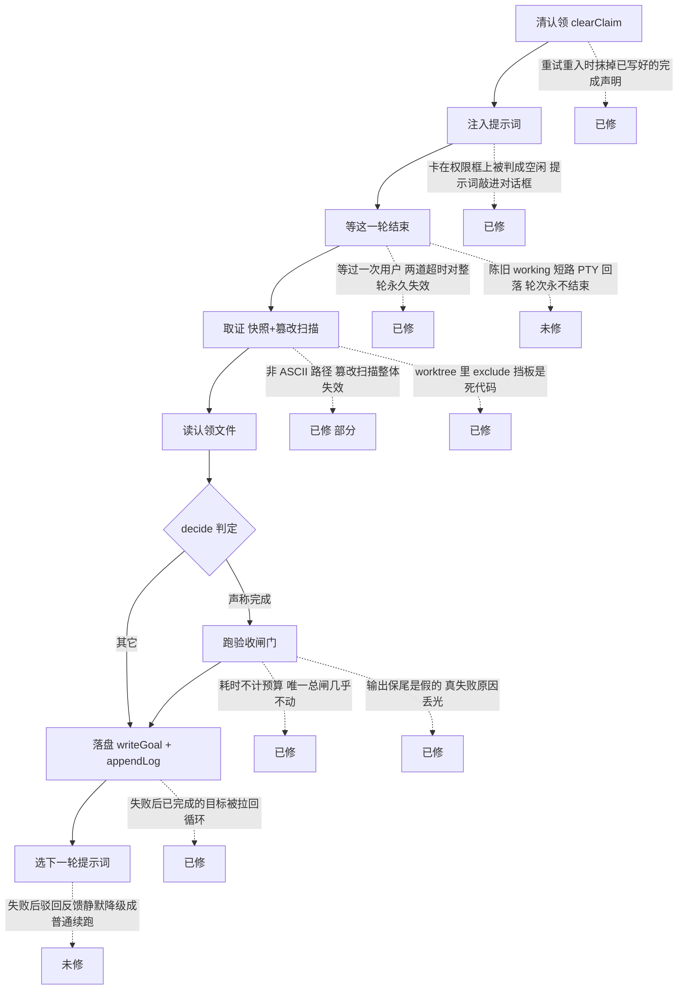

# Goal 模式代码评审结论(2026-08-15)

四个方向各派一名评审(设计 / 逻辑 / 边界 / 架构)独立通读 `goal-mode/`,加上主线自查。
本文只收录**验证过**的结论:每条标注了证据形态,以及它是不是被多个方向独立找到。

评审的直接动因是同一天内两次事故 —— 一次目录搬迁杀死了跑了两小时的目标,一次 attach
缺陷让接回后 27 分钟又停。两次的共同点是:**我验证的是我想到的那个假设,而不是它可能坏的空间**;
当时 137 个测试全绿,因为没有一个真的执行过一轮循环。

## 缺陷在轮次生命周期里的分布

## 一、已修(12 条)

按严重程度排列。「交叉印证」指两个以上方向独立找到同一根因,可信度最高。

### 1. resume 时会把提示词敲进权限确认对话框

`cli/goal-loop.mjs` · 逻辑方向 · 实测复现 · **当天自己引入**

`safeToInject`(原 `agentIsBusy`)把 `sinceMs` 传成 `Date.now()`,而该参数的语义是「本轮注入时刻」,
只采信 `stateStartedAt > sinceMs` 的 hook 状态 —— 传当前时刻让条件恒假,「等你确认」整档成为死代码。
agent 卡在权限框上时被读成空闲,于是整段续跑提示词被敲进那个对话框。

改法不只是修时间基准:要问的**不是「忙不忙」而是「注入安不安全」**。现在只有明确空闲在提示符前
(finished / quiet)才放行,busy、needs-user、断开、判不出来一律不注入。

### 2. 已完成的目标会被重试拉回循环,最后改写成受阻

`cli/goal-loop.mjs` · 架构 + 逻辑**交叉印证** · 实测复现 · **当天自己引入**

`finish` 的出口在 `appendLog` 之后,而循环顶部没有 `state !== 'active'` 守卫。落盘成功、写日志失败
(磁盘满、权限)被重试接住 → 循环带着一个已写为 `complete` 的目标继续注入 → grace 到点改写成
`blocked`,退出码从 0 变 2。复现序列:`1:complete … 34:complete, 34:blocked`。

### 3. 重试会吃掉 agent 已经写好的完成声明

`cli/goal-loop.mjs` · 架构 + 逻辑**交叉印证** · 实测复现 · **当天自己引入**

`clearClaim` 原在循环体开头无条件执行,而重试正是从体开头重入。取证阶段抖一下(例如同一 worktree
里有人手跑 git 命令撞上 `index.lock`),重试第一件事就是删掉那份 claim,而 agent 已经闲下来不会再写
第二次 → 完成被静默吞掉,目标一路跑到预算耗尽。现已与注入绑定,只在真要注入时清。

### 4. 数据里出现双花括号占位符会终结目标

`cli/continuation-prompt.mjs` · 边界 · 实测复现

占位符残留检查跑在**替换后的全文**上,于是目标描述或验收输出里任何模板语法都会抛错;错误落进轮次
重试,每 3 秒复现一次,10 分钟后判受阻。触发面很宽:目标写「把模板里的占位符替换成真实值」,
或任何 Vue / Handlebars / Jinja 项目的测试失败输出。现在只检查模板本身 —— **数据不该有能力炸掉渲染**。

### 5. 工作区排除规则挡板在所有 git worktree 里是死代码

`cli/git-snapshot.mjs` · 边界 · 真 worktree 实测

用的是 `--absolute-git-dir`,在 linked worktree 里返回 `.git/worktrees/名字`,而 git 实际读的排除规则
在共用的 `.git/info/exclude`。两侧哈希恒为空,比较永远不触发。**这正是 README 最得意的那条挡板**
(一条排除规则就能让改动从内容指纹里消失,tree diff 完全看不见),而 worktree 是 Orca 的主力工作区形态。
改用 `--git-common-dir` 后实测:修前为空,修后有哈希。

### 6. 验收输出的「保尾」是假的,真正的失败原因被丢光

`cli/acceptance-gate.mjs` · 边界 · 实测复现

采集到 8000 字就停止追加,所谓「尾巴」切的是**前 8000 字的尾巴**。任何输出超过这个量的测试运行器,
回灌给 agent 的只有开头一堆通过用例的噪音 —— 而那是驳回提示词里 agent 唯一能拿到的证据。
现在头尾分开采集:600 行噪音 + 最后一行真失败,实测保住。

### 7. 本轮只要等过一次用户,两道超时就对整轮永久失效

`cli/goal-loop.mjs` · 逻辑 · 实测复现

`announcedNeedsUser` 只置位不复位,而启动超时和卡死超时都以它为前置条件。你点完允许后 agent 崩了,
守卫会一直等下去;配「时长不限」就是永久挂起。现在只看**此刻**是否在等人,并且把用户思考的那段时间
**还给两个计时器**,不算成 agent 没动静。

### 8. 验收耗时完全不计入预算

`cli/goal-loop.mjs` · 设计 + 逻辑**交叉印证** · 实测

记账点在验收之前,而裁判是整条链上最贵的一步(十几到四十分钟),一分钟都不扣。
实测:某目标挂钟跨度 9.1 小时,`activeMs` 只有 5 分钟,配 `maxTurns: 0` 等于**完全没有总闸**。
这是当天「预算从墙钟改成活跃时长」那次改动留下的洞。

### 9. 完成声明被驳回的那一轮,基线与空转计数都不更新

`cli/goal-decision.mjs` · 主线自查 + 逻辑 · 实况数据验证

`lastSnapshot` 与 `stallCount` 的更新都写在函数末尾,而「声称完成」那一整块的每个 return 都在它们之前。
后果有二:下一轮的「本轮改了哪些文件」会把上一轮的改动一起算进去(这个数据既注入给 agent 又显示在
面板时间线上);更严重的是**反复声称完成就能一直躲开空转熔断**。

实况证据:某目标记录里的基线是第 3 轮的树,而第 4 轮结束时是另一个 —— 第 4 轮声称完成、被驳回,基线原地不动。

### 10. 一次意外终结整个目标(两条路径)

`cli/goal-loop.mjs` · 主线自查 · 事故复盘

轮次里任何一步抛出的错误都会一路抛到顶层 catch,打印一行就退出 —— 目标终结,记录还停在 `active`,
从外面看只是「驱动没了」。同一模式两次杀死目标:一次偶发 CLI 调用失败,一次被搬走的提示词模板。
`waitForRoundEnd` 返回的失败(终端断开、注入后无动静)是同一模式藏在另一条路径上,Orca 重启一下就够。

现在两者都走统一重试,连续不好满 10 分钟才认输,而且认输也停在可接回状态并留下死因。

### 11. 验收判词不落盘

`cli/goal-loop.mjs` · 事故复盘

裁判一跑十几到四十分钟,却是整条链上唯一不留痕的一步:判词只在内存里待到「构造下一轮注入」那一刻。
那一步一旦失败,这几十分钟就白跑,连「为什么没通过」都查不到。现在判完立即写
`~/.orca-goal/verdict/`,驳回摘要进逐轮日志,面板时间线能说出原因。

### 12. attach 到空闲 agent 会干等到超时

`cli/goal-loop.mjs` · 事故复盘

`resume` 用 attach 语义避免打断在跑的轮次,但 agent 空闲时没有轮次可挂,守卫干等 300 秒后判受阻。
上一轮声称完成后 agent 就闲着了,接回必然踩中。现在 attach 只在 agent 确实在忙时成立。

### 附:评审同时发现的测试缺陷(已修)

- 新增的 runLoop 用例传的阈值键名写错(`maxStalls` 而非 `maxStallRounds`),
  于是 `>= undefined` 恒假 —— **那几个用例实际上把空转和假完成两个熔断都关掉了**。
- `driver-resilience.test.mjs` 里两条断言在匹配**源码文本**而不是行为:把 `continue` 换成 `break`
  照样通过,把常量改名反而变红。这类测试会在下次重构时集体误报,然后被人一把删掉。

## 二、待决的策略判断(6 条)

这些没有客观正确答案,是取舍,需要产品判断。

### P1. 假完成计数:累计还是连续

判词写「**连续** 3 次」,实现是累计(全仓无清零点)。实测序列:第 1、10、21 轮各一次假完成,中间
18 轮全是真实进展 → 目标被终结,而判词说它在原地打转。

| 选项 | 代价 |
|---|---|
| 改成真·连续 | 符合文案,长目标不再误杀;但 agent 可靠「干一轮真活」重置 |
| 保持累计,只改文案 | 防试探更强;但 50 轮的目标累计 3 次乐观判断几乎必然 |

**建议**:改成连续,但重置门槛设为**这一轮有实质进展**(指纹变了),而非「没声称完成」。

**无论选哪边都该改的**:现在「裁判超时」「命令起不来」「判词解析不了」和「agent 撒谎」记进同一个
计数器。环境故障不该记成对 agent 的指控,应拆开并升级给人。

### P2. 裁判要不要强制只读沙箱

代码默认不传沙箱参数(理由:判据往往需要构建、起服务、跑测试才验得了)。而本机 codex 全局配置是
`danger-full-access` + `approval_policy = never`,**于是裁判带全盘写权限、无审批运行**。
README 却写着「裁判在机制上改不了任何文件」—— 现在唯一的约束是提示词里那句请求。

**建议**:默认只读,要放开必须显式给,并在启动横幅打印当前沙箱模式。
**另加一条无成本兜底**:判定前后各拍一次工作区 tree SHA,不一致就作废该次判定并告警 ——
这对提示词型裁判(claude)同样成立。

### P3. 声称受阻要不要付代价

完成声明要过全部裁判;受阻声明**不触发任何核实**,连写两轮就终结目标。
对一个想收工的 agent,**撒谎说受阻是成本最低的路径**,而用户在面板上只能看到 agent 自己写的理由。

**建议**:受阻不终结目标,转成「等用户」态 + 通知,由人决定继续还是收摊。
真受阻的场景(缺权限、缺凭证、需求有歧义)本来就必须人介入,自动终结把这个信号变成了终点。

### P4. 多批验收:串行门禁还是全跑汇总

验收闸门第一条失败就短路。拆成四批之后,**只有第 1 批会被判,后三批在它通过前永远不跑**。

| 选项 | 代价 |
|---|---|
| 保持短路 | 省时间,且强制按顺序修(先全局 token 再页面);但只能看到一批的清单 |
| 全跑汇总 | 一次拿到全景,可并行修;但最坏一次上百分钟,且前几批可能因后续改动而过期 |

**建议**:保持短路,但**在启动横幅和面板上说清楚这一点**;另加 `--check-all` 开关供手动全量。

### P5. 篡改质证:一次回复放行,还是必须拿证据消解

挡一轮的同时把**所有** finding 标成已确认,agent 一个字节不改再声称一次就通过。
于是质证上限在「一次性削弱」这种最常见的模式下**永远触发不了**。
提示词模板还把这条配方直接写给了 agent(「这次即使你什么都没改也会采信」)。

**建议**:对 `gate-config-edited`、`ignore-rules-edited` 这类**确定性**发现要求证据消解
(下一轮在上一轮的门禁定义上重跑);`assertions-removed` 这类启发式的保持一次性豁免,避免误报骚扰。
同时删掉提示词里那句话 —— 不必把绕过方式写给被判定者。

### P6. 要不要在目标开始前跑一次基线验收

两个方向的失败都真实存在:检查**本来就绿**(agent 什么都不干就能拿到「目标达成」+ 退出码 0);
检查**本来就红**(每次完成声明都被驳回,而驳回提示词告诉 agent「是你错了」,它去修无关问题直到判死)。

代价是 start 时多花一次验收时间 —— 对裁判型验收可能上百分钟。

**建议**:加 `--baseline` 开关;对超时设置很长的检查自动跳过并在横幅提示「本次未做基线核对」。

## 三、已知未修(工程项)

| 问题 | 位置 | 后果 | 证据 |
|---|---|---|---|
| `stop` 会杀掉毫不相干的进程 | `cli/detached-driver.mjs`、`cli/goal-state.mjs` | 锁文件只在干净退出时删除;SIGKILL / 断电 / `forget` 后残留,重启后 PID 复用 → `status` 报「驱动在跑」、`start` 被拒、`stop` 把无辜进程 SIGTERM + SIGKILL | 实测复现 |
| Linux 上开箱即坏 | `cli/orca-terminal.mjs` | CLI 名默认取 `orca`,而上游明确 Linux 上叫 `orca-ide`(避开 GNOME 读屏软件);Windows 侧另有多处 POSIX-only:登录 shell 调用、裸名 spawn `.cmd`、面板生成的 heredoc 脚本 | 上游源码交叉确认 |
| 一轮 6 秒跑完 20 轮 | `cli/goal-loop.mjs`、`cli/terminal-activity.mjs` | 注入时刻取在发送**之前**,落在窗口里的上一轮结束事件会被当成本轮结束;循环没有最短轮次间隔。git 工作区靠空转熔断兜住,**文件夹工作区拿不到指纹、熔断关闭,完全没有兜底**,会向终端连灌 21 次提示词 | 实测复现 |
| 陈旧的 working 状态短路 PTY 回落 | `cli/terminal-activity.mjs` | hook 卡在一小时前的 working、终端一字节没吐,仍判 busy → 卡死上限永远差一步 → 配「时长不限」即永久挂起 | 实测复现 |
| 面板 heredoc 定界符会被验收标准撞开 | `plugin/panel.html` | 标准里有一行恰好等于定界符,文件被截断,后续内容变成 shell 命令 | 实测复现 |
| 数值参数不校验 | `cli/orca-goal.mjs` | 验收超时写成非数字或 0 → 静默变成 1 毫秒超时 → 每条验收刚起就被杀 → 完成声明永远被驳回。而 0 在别处明确表示「不限」 | 实测复现 |
| 相对路径 + 后台运行静默失败 | `cli/orca-goal.mjs`、`cli/detached-driver.mjs` | 父进程打印「已在后台启动」并退出 0,子进程在状态目录下解析相对配置路径失败即退,唯一线索埋在驱动日志里。工作区参数同样从未做绝对化 | 实测复现 |
| 篡改扫描在非 ASCII 路径上整体失效 | `cli/git-snapshot.mjs` | git 默认转义非 ASCII 路径,导致测试文件被归到源码类、门禁配置正则不匹配 → 删断言 / 改弱验收全部看不见 | 实测复现 |
| 认领文件几个边界 | `cli/goal-claim.mjs` | 路径若是目录 → 每轮必抛 → 10 分钟后判受阻;无大小上限 → 重定向进去的大文件被整份读入;匹配在任意行且大小写不敏感 → 日志行 `Complete: 5 files changed` 被当成完成声明 | 实测复现 |
| 控制字符能穿过压平写进 PTY | `cli/continuation-prompt.mjs`、`cli/orca-terminal.mjs` | 转义符、Ctrl-C、退格都不是空白字符,压平后原样保留,发送守卫只挡换行 | 实测复现 |
| `forget` 只删目标记录 | `cli/goal-state.mjs` | 认领、日志、提示词、判词、锁全部残留,状态目录只增不减;同一终端跑第二个目标时逐轮日志不截断,面板时间线会混进上一代的轮次 | 代码判读 |
| 目标身份等于终端句柄 | `cli/goal-state.mjs` | 没有「这一次运行」的概念,派生文件按终端命名 → 代际混淆 | 架构方向 |
| 面板不按工作区过滤 | `plugin/panel.html` | 永远显示全局第一个进行中的目标,空态文案却写「这个工作区还没有目标」 | 代码判读 |

## 四、复核过、确认没问题的地方

- **依赖图是干净的有向无环图**,没有循环依赖;决策核心确实是纯函数,一轮调两次不会重复累加(注释属实)。
- **重试不会让轮次号跳号**,也不会重复累加同一段时间。
- 状态写入是临时文件 + 原子改名,并发读不会读到半截 JSON;`.tmp` 也被正确过滤。
- 验收闸门:空命令列表、超时、启动失败、非零退出码都不会被算成通过;杀进程走进程组。
- 快照拿不到时返回「不可用」而不是伪造相等值,上层据此关掉熔断 —— 语义一致。
- 配置文件的行注释剥离不会误伤字符串内容;工作区路径含空格、含中文均正常(问题只出在 git 对
  **仓库内相对路径**的转义上)。
- 桌面通知的转义正确,且失败全吞不影响目标结果。

## 五、方法论备忘

这次评审最值钱的不是条数,而是三件事:

1. **交叉印证**。四个方向独立找到同一根因的有五处(裁判沙箱、假完成计数语义、验收耗时不计预算、
   重试吃掉完成声明、已完成目标被复活)。被独立命中两次以上的,基本不会是误报。
2. **实测优先于推断**。绝大多数结论附带可复现的构造,而不是「看起来可能有问题」。
   少数只做了代码判读的都明确标注了。
3. **修复本身要被怀疑**。12 条已修里有 4 条是当天修复动作自己引入的
   (注入安全判定的时间基准、终态守卫缺失、清认领时机、测试阈值键名写错)。
   修完立刻做**变异验证** —— 把修复撤掉,对应测试必须变红 —— 是唯一能把「测了」和「测对了」分开的办法。

对应地,测试上有两条纪律:**测行为不测排版**(断言源码文本的用例是负资产),
**阈值和键名要能被单测本身校验**(写错键名等于静默关掉熔断,比没写测试更糟)。
